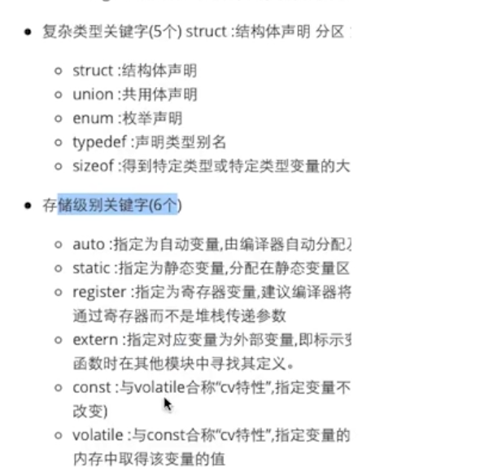

这里的截图只作为基础的提示，了解一下就行

# 基础：





# 常量：

整型常量

实型常量

字符常量

字符串常量


整型常量除了上面的整数10，还有二进制，八进制，十六进制

除了上面讲到的常量，还有一些特殊常量：


# 变量：


定义的时候是什么类型，就存什么类型，如上value是int类型，那么就存int类型


字节和地址

内存寻址/开辟新空间，都是从大到小


以上，对于变量value，他的首地址就是0ffc9

```c
// 获取值
printf("%i", value);
// 获取地址
printf("%p", &value)
```

内存以“字节为单位"，字节都是连续的


mac都是64位编译器，比如我们存储的是int类型，那么就占用4个字节


第二讲 12开始


第三讲

<pre class="vditor-reset" placeholder="" contenteditable="true" spellcheck="false"><p data-block="0"></p><p data-block="0"></p><p data-block="0"></p></pre>


-
