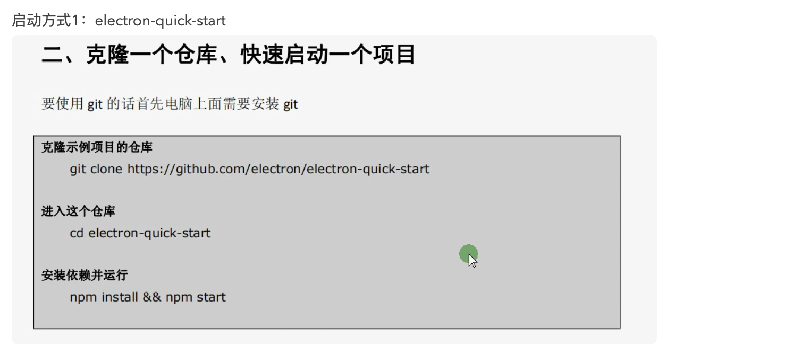
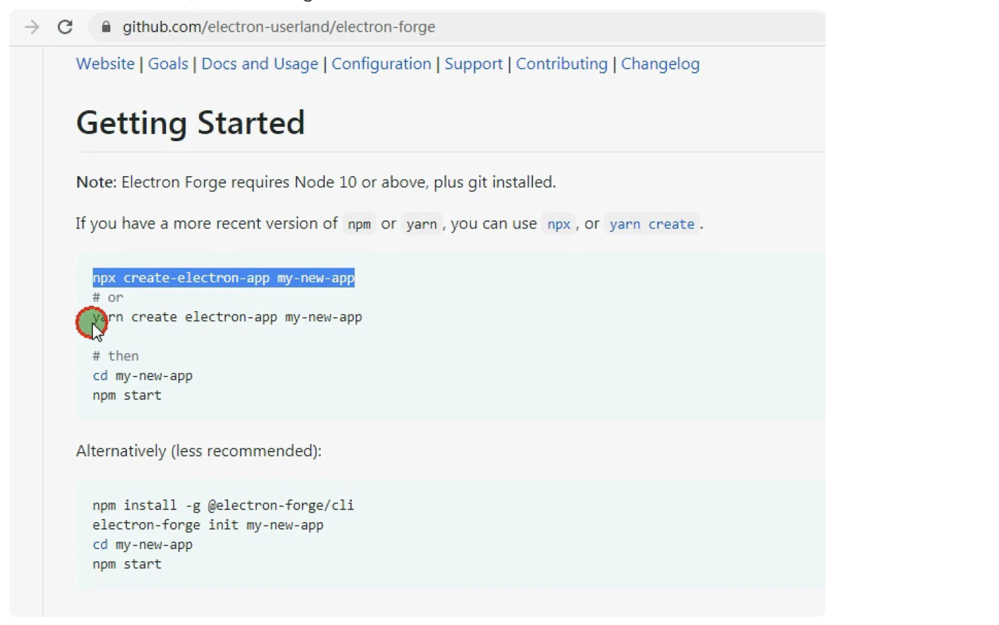
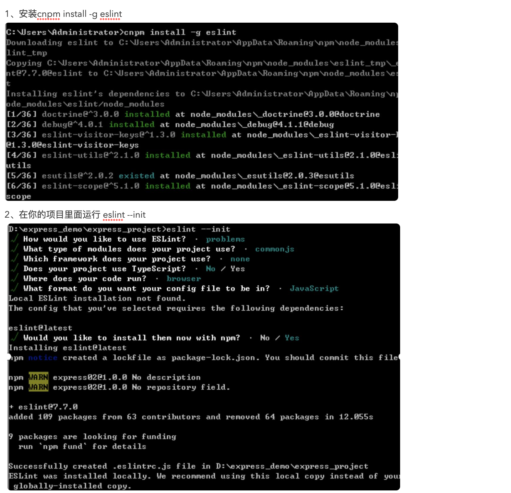
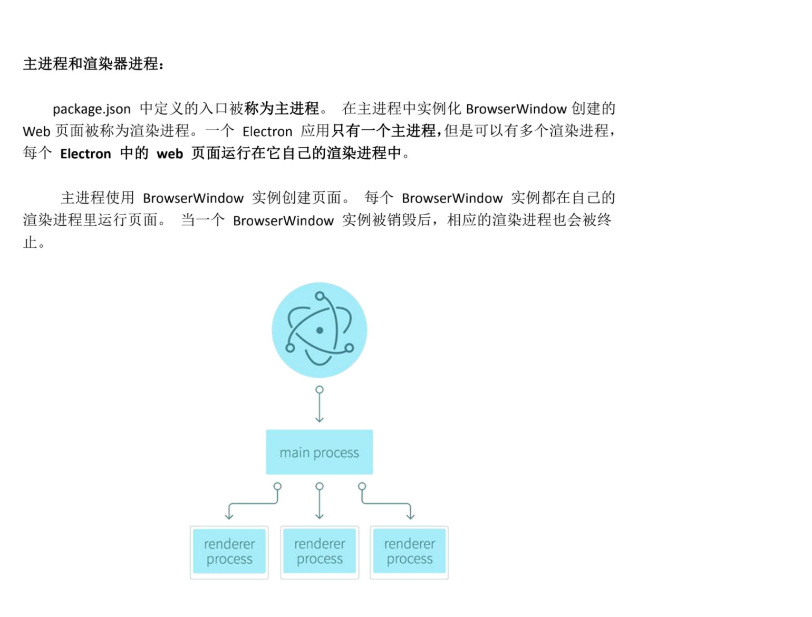
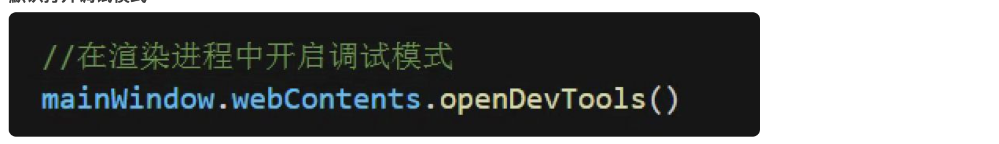

该课程来源是淘宝买的会员课，和家里台式机（windows）绑定了IP


## 1、简介

npm i -g electron

视频中版本：

node 12.18.4

electron 10.1.2

启动方式1：electron-quick-start



启动方式2：electron-forge

官网：electronforge.io

node要求大于10版本，以及本地有git



启动方式3：自己从0手动搭建

1、新建一个项目目录   例如：****electrondemo01****

2、在****electrondemo01****目录下面新建三个文件:   index.html、main.js 、package.json

3、index.html 里面用css 进行布局（以前怎么写现在还是怎么写）

4、在main.js 中写如下代码：

```js
const { app, BrowserWindow } = require("electron")
const path = require("path")
const createWindow=()=>{
    const mainWindow = new BrowserWindow({
        width: 800,
        height: 600,
    });
    mainWindow.loadFile(path.join(__dirname, 'index.html'));
    // mainWindow.loadURL('https://github.com');
}
//监听electron ready事件创建窗口
app.on('ready', createWindow);
//监听窗口关闭的事件，关闭的时候退出应用，macOs需要排除
app.on('window-all-closed', () => {
    if (process.platform !== 'darwin') {
        app.quit();
    }
});
//Macos中点击dock中的应用图标的时候重新创建窗口
app.on('activate', () => {
    if (BrowserWindow.getAllWindows().length === 0) {
        createWindow();
    }
});

```

5、运行

```shell
electron .          注意：命令后面有个点
```

五、开发工具中配置Eslint

ESLint最初是由Nicholas C. Zakas 于2013年6月创建的开源项目。它的目标是 ****提供一个插件化的javascript代码检测工具**** 。



electron中的主进程和渲染进程：



**Electron ****主进程和渲染进程中使用**

**Nodejs ****以及 ****Nodejs ****第三方模块（注意）**

Electron5.x 之前默认可以在主进程以及渲染进程中直接使用 nodejs, 但是在 Electron5.x

默认没法在渲染进程中直接使用 nodejs，如果我们想在渲染进程中使用 nodejs 的话需要进

行如下配置。

文档：

```
https://www.electronjs.org/docs/api/browser-window
```

```
mainWindow=new BrowserWindow({width:800,height:600, webPreferences: {
 nodeIntegration: true,
 contextIsolation:false
}});
```

 **1** **、渲染进程中使用 ****Nodejs ****读取本地文件**

```
var fs = require('fs');
var content = document.getElementById('content');
var button = document.getElementById('button');
button.addEventListener('click',function(e){
  fs.readFile('package.json','utf8',function(err,data){
    content.textContent = data;
    console.log(data);
  });
});
```

**默认打开调试模式：**



**2** **、渲染进程和主进程中使用 ****Nodejs ****第三方模块**

如果只是改改样式，reload就行，但是引入新的node模块，需要重启服务
