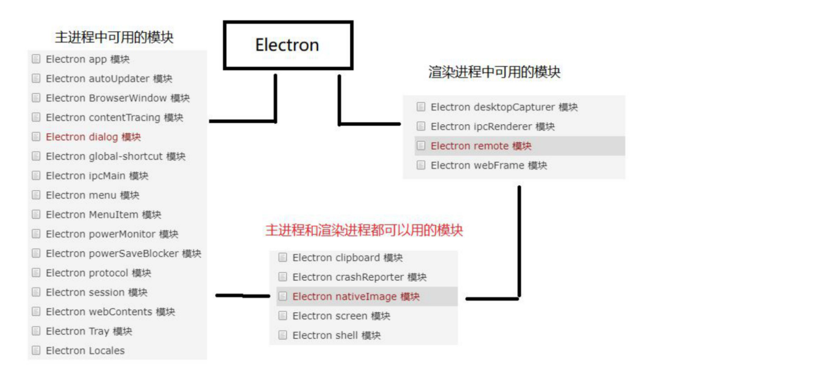

3、Electron 模块介绍、remote 模块、通过 BrowserWindow 打开新窗口

 **一、** **Electron ****主进程和渲染进程中的模块（介绍）**



**二、** **Electron remote ****模块**

**remote ****模块**提供了一种在渲染进程（网页）和主进程之间进行进程间通讯（IPC）的简便途径。

**Electron ** **中** **, ****与 ****GUI ****相关的模块（如 ****dialog, menu ** **等**  **)**  **只存在于主进程，而不在渲染进程中 ** 。

为了能从渲染进程中使用它们，需要用 ipc模块来给主进程发送进程间消息。**使用 ****remote ****模**

 **块，可以调用主进程对象的方法** ，而无需显式地发送进程间消息，这类似于 Java 的 RMI。

 **注意**  **：** Electron10.x 以后要使用 remote 模块的话必须得在 BrowserWindow 中开启

参考：[https://www.electronjs.org/docs/api/browser-window](https://www.electronjs.org/docs/api/browser-window)

```
mainWindow=new BrowserWindow({width:800,height:600,webPreferences: {
  nodeIntegration: true,
  enableRemoteModule: true,
}});
```

 **三、** **Electron ****渲染进程中通过 ****remote ****模块调用主进程中**

**的 ****BrowserWindow ****打开新窗口**

**主进程部分代码：**

```
mainWindow=new BrowserWindow({width:800,height:600,webPreferences: {
  nodeIntegration: true,
  enableRemoteModule: true, //要开启 remote 模块
}});
```

**渲染进程代码：**

```
const btn = document.querySelector('#btn');
const path = require('path');
const BrowerWindow = require('electron').remote.BrowserWindow;
btn.onclick = () => {
  win = new BrowerWindow({
    width: 300,
    height: 200,
    frame: false,
    transparent: true
    // fullscreen:true
  })
  win.loadURL(path.join('file:',__dirname,'news.html'));
  win.on('close',()=>{win = null});
}
```
