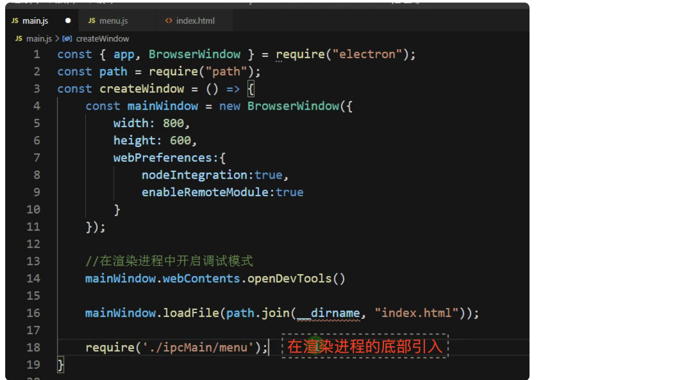

3、实现**Electron ****自定义软件顶部菜单、右键菜****单以及绑定快捷键**

**Electron ****中 ****Menu ****模块**可以用来创建原生菜单，它可用作**应用菜单**和 **context ** **菜单** 。

这个模块是一个 **主进程的模块** ，并且可以通过 remote 模块给渲染进程调用。

```
const { Menu } = require('electron');
var menuTemplate = [
  {
    label: "文件",
    submenu: [
      {
        label: '新建文件',
        accelerator: 'ctrl+n',
        click: function () {
          console.log('ctrl+n');
        }
      },
      {
        label: '新建窗口',
        click: function () {
          console.log('new window');
        }
      }
    ]
  },
  {
    label: '编辑',
    submenu: [
      {
        label: '复制',
        role: 'copy'
      },
      {
        label: '截切',
        role: 'cut'
      }
    ]
  }
]
var menuBuilder = Menu.buildFromTemplate(menuTemplate)
Menu.setApplicationMenu(menuBuilder)
```

引用：



**Electron ****自定义右键菜单**

```
const { remote } = require('electron');
const Menu = remote.Menu;
const contextMenuTemplate = [
  {
    label: '复制',
    role: 'copy'
  },
  {
    label: '黏贴',
    role: 'paste'
  },
  { type: 'separator' }, //分隔线
  {
    label: '其他功能',
    click: () => {
      console.log('click')
    }
  }
];
var menuBuilder = Menu.buildFromTemplate(contextMenuTemplate)
window.addEventListener('contextmenu', (e) => {
  e.preventDefault();
  menuBuilder.popup({ window: remote.getCurrentWindow() });
}, false);
```
