## 基础

java收入oracle（甲骨文）

java SE : 标准版 （核心和基础）

java EE : 企业版 （企业解决方案）

java ME ： 小型版 （针对移动设备的解决方案，市场不是太认可，更多的使用Android和IOS）

官网下载安装JDK开发工具包：https://www.oracle.com/java/technologies/downloads/#jdk17-mac

企业中一般用历史版本比较老的JDK，比如现在都19了，企业中用的JDK 8 最多

bytedance@C02G86T2MD6R [21:34:55] [~/bytedance/marketing/op_promotion] [hotfix-report-error]
-> % java --version
java 17.0.5 2022-10-18 LTS
Java(TM) SE Runtime Environment (build 17.0.5+9-LTS-191)
Java HotSpot(TM) 64-Bit Server VM (build 17.0.5+9-LTS-191, mixed mode, sharing)

bytedance@C02G86T2MD6R [21:34:59] [~/bytedance/marketing/op_promotion] [hotfix-report-error]
-> % javac --version
javac 17.0.

java是执行工具，javac是编译工具

搞一个hello world：

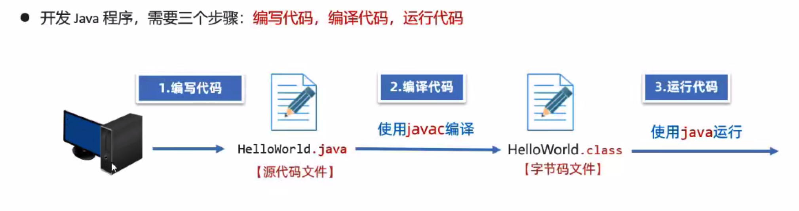

新建文件HelloWorld.java，文件中创建的类的类名必须是HelloWorld

```
public class HelloWorld {
  public static void main(String[] args) {
    System.out.println("Hello Wolrd");
  }
}
```

bytedance@C02G86T2MD6R [21:46:00] [~/personal/diary/java/test] [main *]
-> % javac HelloWorld.java

bytedance@C02G86T2MD6R [21:47:26] [~/personal/diary/java/test] [main *]
-> % java HelloWorld
Hello Wolrd

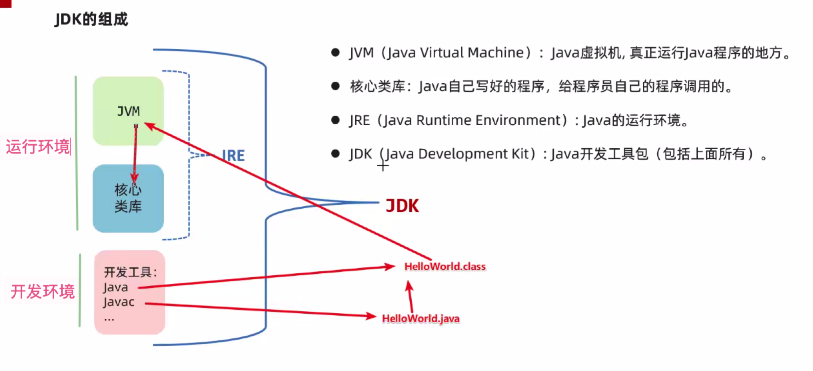

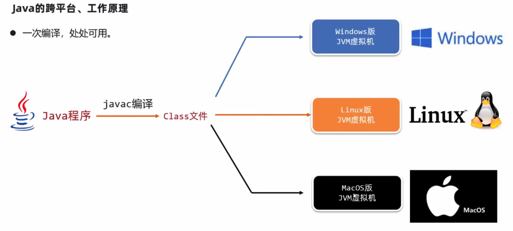

java开发IDE：

1、Eclipse；2、MyEclipse；3、NetBeans；4、IntelliJ  **IDEA** ；5、JBuilder；6、Jdeveloper；7、jCreator

项目创建顺序：

java创建文件是按照如下四个层级来组织文件结构

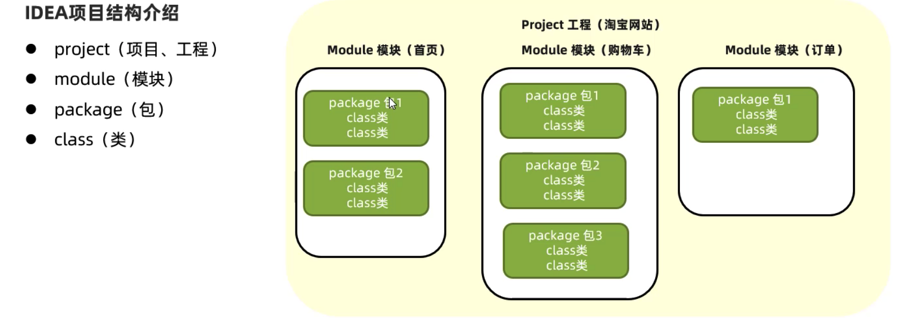

数据类型：

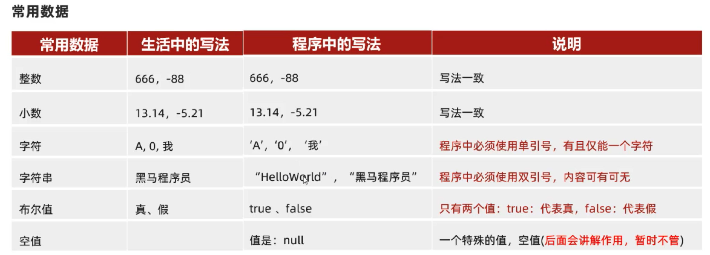

变量：

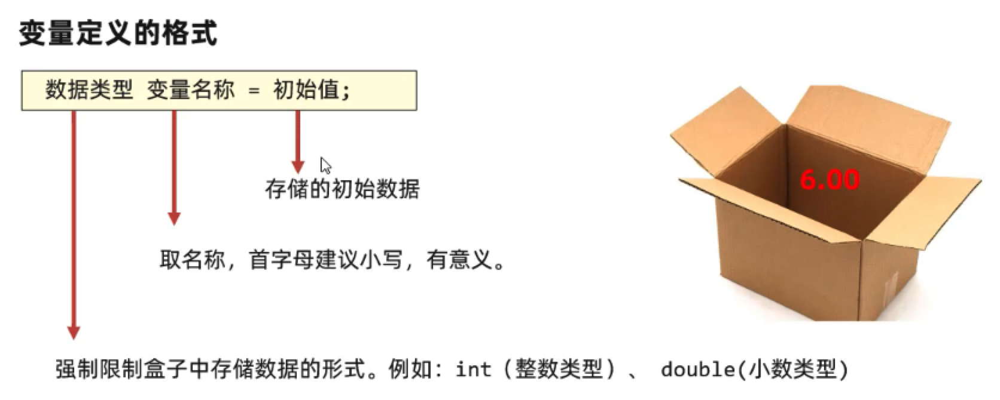

定义变量注意点：

1、先声明后使用；

2、变量声明后，不能存储其他类型的数据；

3、变量有效范围在"}"截止，且在同一个范围内不能重复定义；

4、变量定义可以没有初始值，但是使用的时候必须给初始值；

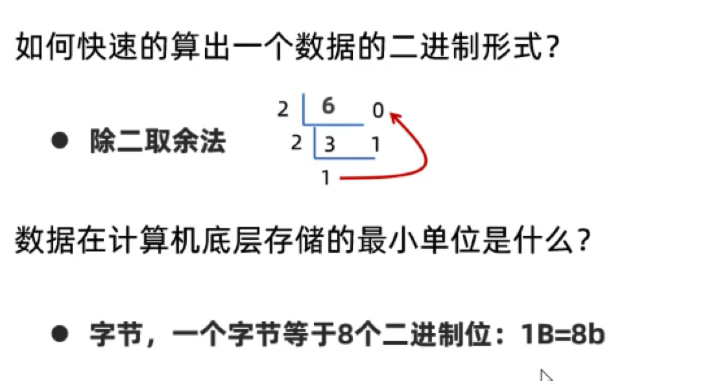

一个字节等于8b，又有kb，MB，GB，TB……

如何验证一个字母也是用数字的形式存储的？（ASC表）

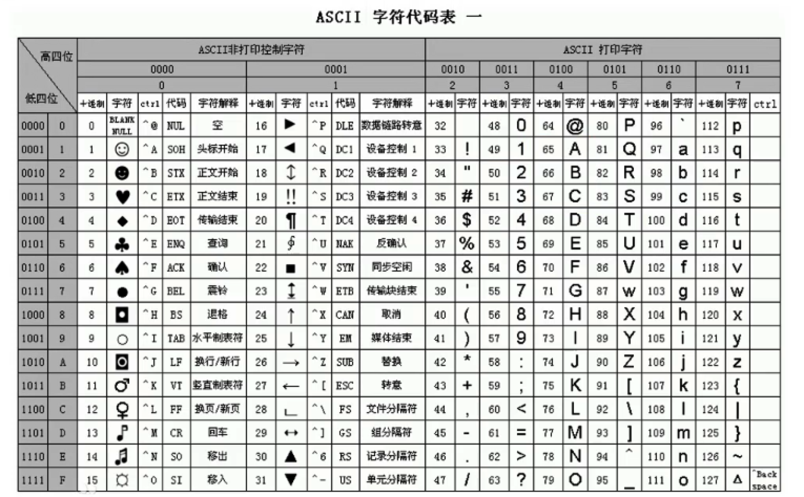

文字的存储：

```
char test = 'a';
System.out.println('a' + 1); // 98
System.out.println('a'); // a，因为知道输出的是char类型，所以把存储的97转成了字母a进行展示
```

图片的存储：

就是每个像素点，由rgba组成，然后每个颜色由0-255构成，再转二进制

声音的存储：

声音的正余弦波通过模数转换，变成二进制进行转换。

java支持写二进制、八进制、十六进制，分别需要用0B或者0b，0、0X或者ox开头

```
int test2 = 0b01100001;
System.out.println(test2); // 97
```

## 基础数据类型：

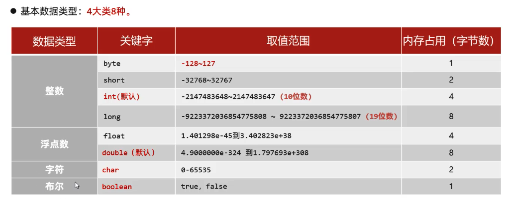

比如byte：占用1个字节，也就是2的8次方，也就是256，也就是-128~127 + 0(这个数据) = 256

```
byte a = 123;
    System.out.println(a); // 123;
//    byte aa = 128; // 报错，byte范围：-128～127
    int aaa = 232323;
    long aaaa = 23412341234123L; // 不加L，这个数没有超出long的范围也会报错，因为写的数据默认是int类型，加个L或者l表示这个数据就是long类型
    float s = 98.4F; // 默认写个小数都是double类型，要明确表示浮点型，就在后面加一个F或者f表示浮点型
    double ss = 999.33; // 也可以在后面加上一个D（没必要）
    char sddd = '4';
//    char df = '中国'; // 报错，字符类型只能是1位
    // js中常用的string，在java中只能是引用数据类型，String
    String name = "hahha，网络";
    System.out.println(name);
```

关键字：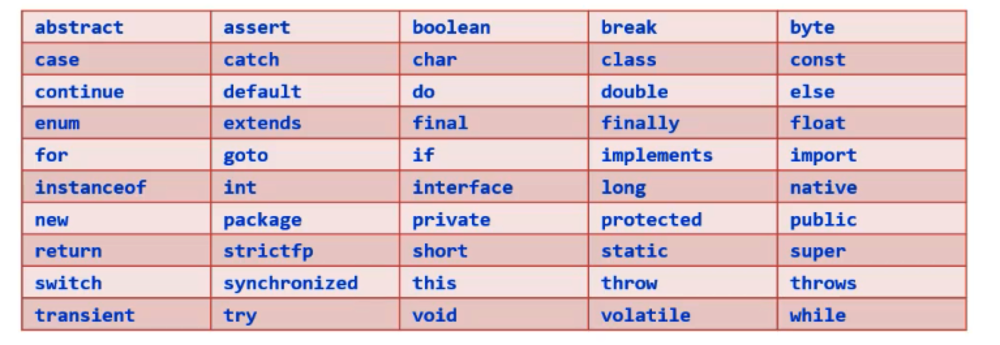

自动类型转换：

1、小范围数据类型的变量可以直接赋值给大范围的变量

```
比如：
	byte a = 20;
	int b = a;
比如：
	char ch = 'a'; // 00000000 01100001
	int code = ch; // 00000000 00000000 00000000 01100001
```

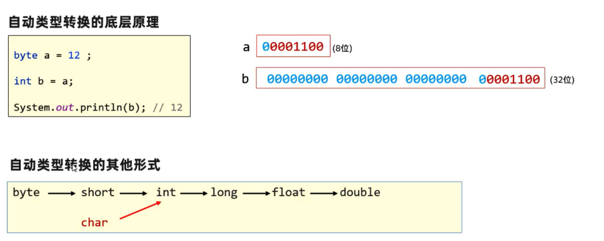

2、表达式的自定类型转换

```
比如：
	byte a = 10;
	int b = 20;
	double c = 1.0;
	double rs = a + b + c;
比如：
	byte i = 10;
	byte j = 10;
	byte s = i + j; // 报错，因为i和j会自动转成成int，所有s只能至少是int类型来接收
```

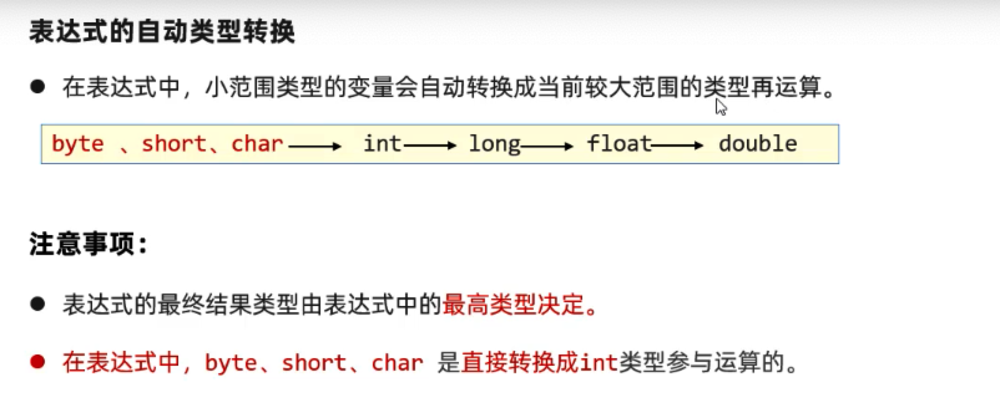

3、强制类型转换

```
比如：
	byte a = 1;
	int h = a; // 小转大没问题
比如：
	int a = 1000;
	byte h = a; // 大转小报错
但是既然是强制，可以这么写：
	int a = 1000;
	byte h = (byte)a;
```

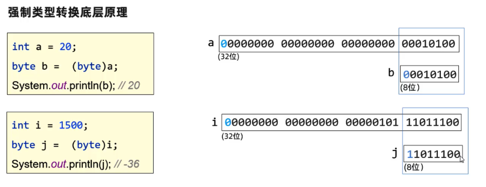

结论：

1、强制类型转换可能导致数据（丢失）溢出；

2、浮点型强转成整形，直接丢掉小数部分，保留整数部分返回。

写了一个人机交互输入输出的demo：

```
package com.itheima.scanner;
import java.util.Scanner;
// 1、导包操作 (并不需要自己写的，以后通过工具进行导入更方便)
public class ScannerDemo {
    public static void main(String[] args) {
        // 目标：接收用户的键盘输入的数据。
        // 2、得到一个键盘扫描器对象
        Scanner sc = new Scanner(System.in);

        System.out.println("请您输入您的年龄：");
        // 3、等待接收用户输入一个整数，按了回车键才会把数据交给age变量
        int age = sc.nextInt();
        System.out.println("您的年龄是：" + age);

        System.out.println("请您输入您的名称：");
        // 4、等待接收用户输入一个字符串，按了回车键才会把数据交给name变量
        String name = sc.next();
        System.out.println(name + "欢迎进入系统！");
    }
}

```

加减乘除：

```
// 目标：掌握基本的算术算术运算符的使用：+ - * / %
        int a = 10;
        int b = 3;
        System.out.println(a / b); // 3.3333  ==>  3 // 因为 a和b参与运算最高等级的数据类型是int，所以计算出来的结果最高也是int
        System.out.println(a * 1.0 / b); // 3.3333 // 变相把参与运算的最高数据类型变成float
	System.out.println(3  / 2 * 1.0); // 1.0 // 因为3/2最高类型是int，算出来的结果1 * 1.0，就只能是1.0
```

顺序控制：

If：

```
package com.test.haa;
public class Operate {
  public static void main(String[] args) {
    int a = 10;
    if (a < 1 || a > 6) {
      System.out.println("bingo");
    }
  }
}
```

switch：

```
package com.itheima.branch;

public class SwicthDemo4 {
    public static void main(String[] args) {
        // 需求：用户输入月份可以展示该月份的天数。
        // 1、3 、5、 7 、 8、 10、 12月份是 31天
        // 2月份是闰年为29天、非闰年为28天。
        // 4 、6 、9、 11月份 是30天
        int month = 7;
        switch (month){
            case 1:
            case 3:
            case 5:
            case 7:
            case 8:
            case 10:
            case 12:
                System.out.println(month +"是31天！");
                break;
            case 2:
                System.out.println(month +"月闰年为29天、非闰年为28天！");
                break;
            case 4:
            case 6:
            case 9:
            case 11:
                System.out.println(month +"是30天！");
                break;
            default:
                System.out.println("数据有误！");
        }
    }
}

```

for循环：

demo1：break 和 continue 用法

break：只能用于结束所在循环，或者结束所在switch分支的执行；

continue：只能在循环中使用；

```
package com.itheima.loop;

public class BreakAndContinueDemo10 {
    public static void main(String[] args) {
        // 目标：理解break 和 continue的作用。
        // 场景：假如你又有老婆了，然后你犯错了，你老婆罚你做5天家务，每天都是洗碗。
        // 但是洗碗到第三天后心软了 原谅你了不用洗了
        for (int i = 0; i < 5; i++) {
            System.out.println("快乐的洗碗~~~~");
            if(i == 2) {
                break; // 跳出并结束当前循环的执行~~
            }
        }

        // continue 跳出当前循环的当次执行，进入循环的下一次
        // 场景：假如你又有老婆了，然后你犯错了，你老婆罚你做5天家务，
        // 每天都是洗碗。但是洗碗到第三天后心软了 原谅你了不用洗了 但是依然不解恨 继续洗第4天 5天
        for (int i = 1; i <= 5 ; i++) {
            if(i == 3){
                continue; // 立即跳出当次执行，进入循环的下一次！
            }
            System.out.println("洗碗：" + i);
        }


    }
}

```

demo2：找水仙花数

```
package com.itheima.loop;

public class ForTest4 {
    public static void main(String[] args) {
        // 需求：找出水仙花数并输出
        // 在循环外定义一个变量用于记录水仙花的个数
        int count = 0;
        // 1、定义一个for循环找出全部三位数
        for (int i = 100; i <= 999; i++) {
            // 2、判断这个三位数是否满足要求
            // i = 157
            // 个位
            int ge = i % 10;
            // 十位
            int shi = i / 10 % 10;
            // 百位
            int bai = i / 100;
            if( (ge*ge*ge + shi * shi * shi + bai * bai * bai) == i){
                System.out.print(i+"\t");
                count++;
            }
        }
        System.out.println(); // 换行！
        System.out.println("水仙花个数是：" + count);
    }
}

```

while循环：

```
package com.itheima.loop;

public class WhileDemo5 {
    public static void main(String[] args) {
        // 目标：学会使用while循环，并理解它的流程
        int i = 0;
        while (i < 3){
            System.out.println("Hello World");
            i++;
        }
        System.out.println("----------------------");
        int j = 0;
        while (j < 3){
            System.out.println("Hello World");
        }
    }
}

```

Random:

```
package com.itheima.random;

import java.util.Random;

public class RandomDemo1 {
    public static void main(String[] args) {
        // 目标：学会使用Java提供的随机数类Random
        // 1、导包
        // 2、创建随机数对象
        Random r = new Random();

        // 3、调用nextInt功能（方法）可以返回一个整型的随机数给你
        for (int i = 0; i < 20; i++) {
            int data = r.nextInt(10); // 0 - 9 不包含10的（包前不包后）
            System.out.println(data);
        }

        System.out.println("-----------------------");
        // 1 - 10 ==> -1 ==> (0 - 9) + 1
        int data = r.nextInt(10) + 1;
        System.out.println(data);

        // 3 - 17 ==> -3 ==> (0 - 14) + 3
        int data1 = r.nextInt(15) + 3;
        System.out.println(data1);
    }
}

```

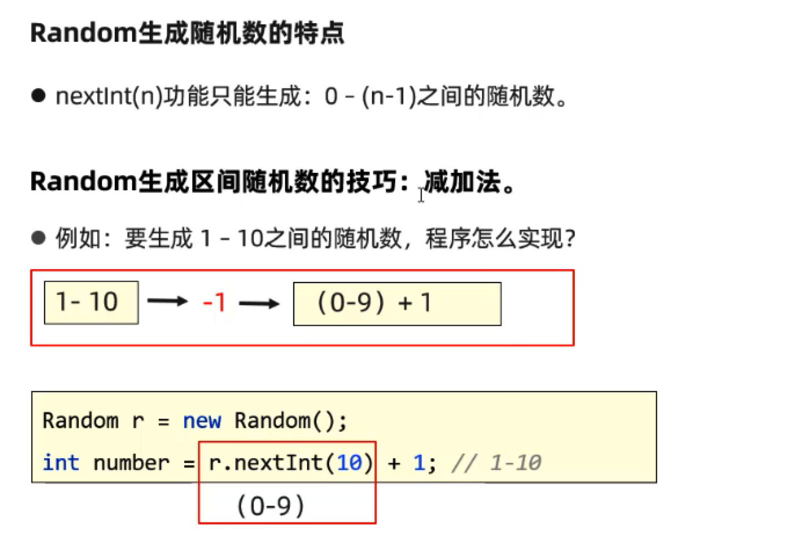

数组：

```
package com.itheima.create;

public class ArrayDemo1 {
    public static void main(String[] args) {
        // 目标：学会使用静态初始化的方式定义数组
        // 数据类型[] 数组名称 = new 数据类型[]{元素1,元素2,...}
        // double[] scores = new double[]{99.5, 88.0, 75.5};
        double[] scores = {99.5, 88.0, 75.5}; // 简化写法

        // int[] ages = new int[]{12, 24, 36};
        int[] ages = {12, 24, 36};

        // String[] names = new String[]{"牛二", "全蛋儿", "老王"};
        String[] names = {"牛二", "全蛋儿", "老王"};

        System.out.println(scores);
    }
}

```


数组特点：

1、什么类型的数组就只能存放什么类型的数据

2、数组一旦定义出来，长度、类型就固定了

```
package com.itheima.create;

public class ArrayAttentionDemo3 {
    public static void main(String[] args) {
        // 目标：理解数组的注意事项
        // 1、数据类型[] 数组名称 也可以写成 数据类型 数组名称[]
        int[] ages = {11, 23, 45};
        // int ages1[] = {11, 23, 45};

        // 2、什么类型的数组只能存放什么类型的元素
        // String[] names = {"西门吹雪", "独孤求败", 23}; // 错误的

        // 3、数组一旦定义出来之后，类型和长度就固定了
        int[] ages2 = {11, 23, 45};
        System.out.println(ages2[3]); // 报错！ 长度固定是3了不能访问第4个元素！！
    }
}

```

动态初始化数组：

```
package com.itheima.create;

public class ArrayDemo4 {
    public static void main(String[] args) {
        // 动态初始化数组 一开始值确定元素的类型和数组的长度
        // 目标：学会【动态初始化数组】的定义和使用。
        double[] scores = new double[3]; // [0.0, 0.0, 0.0]
        //                                    0    1    2

        // 赋值
        scores[0] = 99.5;
        System.out.println(scores[0]);

        System.out.println(scores[2]);


        String[] names = new String[90];
        names[0] = "迪丽热巴";
        names[2] = "马尔扎哈";
        System.out.println(names[0]);
        System.out.println(names[1]);
        System.out.println(names[2]);

    }
}

```

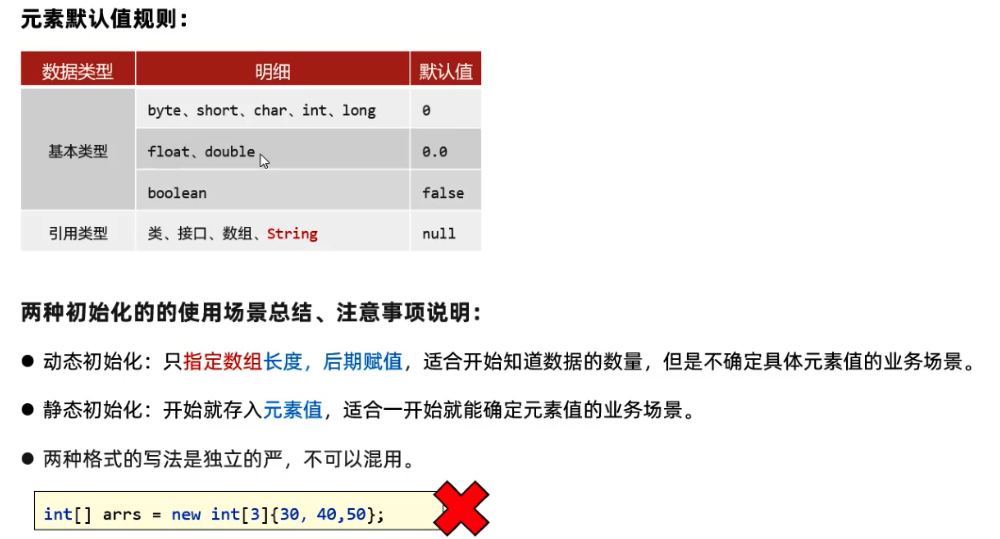

```
package com.itheima.create;

public class ArrayDemo5 {
    public static void main(String[] args) {
        // 目标：掌握动态初始化元素默认值的规则。
        // 1、整型数组的元素默认值都是0
        int[] arr = new int[10];
        System.out.println(arr[0]);
        System.out.println(arr[9]);

        // 2、字符数组的元素默认值是多少呢？ 0
        char[] chars = new char[100];
        System.out.println((int)chars[0]);
        System.out.println((int)chars[99]);

        // 3、浮点型数组的元素默认值是0.0
        double[] scores = new double[90];
        System.out.println(scores[0]);
        System.out.println(scores[89]);

        // 4、布尔类型的数组
        boolean[] booleans = new boolean[100];
        System.out.println(booleans[0]);
        System.out.println(booleans[99]);

        // 5、引用类型的数组
        String[] names = new String[90];
        System.out.println(names[0]);
        System.out.println(names[89]);

        // int[] arrs = new int[3]{30, 40, 50};

        int[] a = {1,2,3};
        int[] b = {1,2,3};
        System.out.println(a);
        System.out.println(b);
    }
}

```

java内存分配介绍

栈 ： 方法运行时所进入的内存，变量也是在这里

堆 ： new出来的东西（对象）

方法区 （比如Helloworld.class/Test.class）字节码文件加载时进入的内存

本地方法栈

寄存器

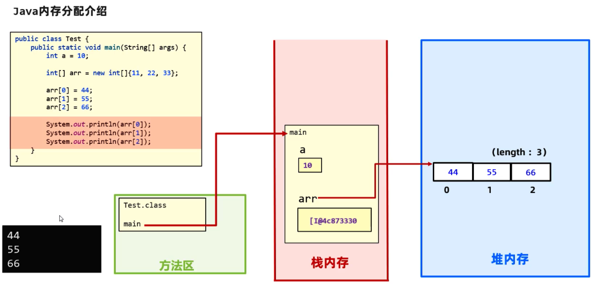

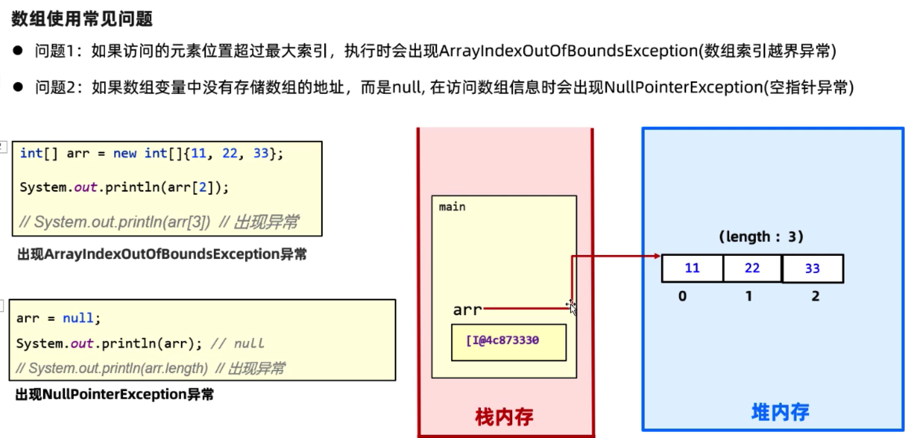

## 面向对象

如何定义一个类：

```
public class 类名 {
	1、成员变量
	2、成员方法
	3、构造器
	4、代码块
	5、内部类
}
```

demo: /diary/java/test/javaseprod/hello-app/src/com/test/haa

一个文件中可以写多个类，但是只能有一个类可以被public修饰（不建议一个文件定义多个）

对象的内存关系；

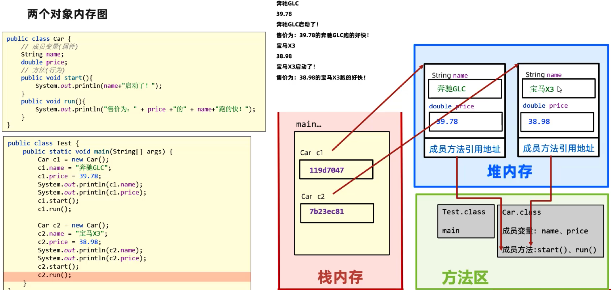

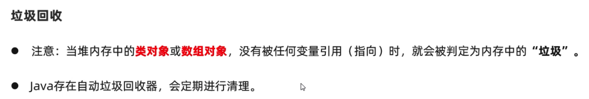

构造器：constructor，其实就是和类同名的函数（分有参和无参）

```
package com.itheima.constructor;

public class Car {
    String name;
    double price;

    /**
      无参数构造器(默认存在的)
     */
    public Car(){
        System.out.println("无参数构造器被触发执行~~~");
    }

    /**
       有参数构造器
     */
    public Car(String n, double p){
        System.out.println("有参数构造器被触发执行~~~");
        name = n;
        price = p;
    }
}

```

注意点：一旦写了有参构造器，new的时候就必须传参，写了无参构造器，new的时候就不能传参，不然会报错。

static：

```
package com.itheima.d1_static;

public class User {
    /**
      在线人数。
      注意：static修饰的成员变量：静态成员变量，只在内存中有一份，可以被共享
     */
    public static int onlineNumber = 161;
    /**
       实例成员变量：无static修饰，属于每个对象的，必须用对象名.访问
     */
    private String name;
    private int age;

    public static void main(String[] args) {
        // 目标：理解static修饰成员变量的作用和访问特点。
        // 1、类名.静态成员变量。
        System.out.println(User.onlineNumber);

        // 2、对象名.实例成员变量
        // System.out.println(User.name); // 报错
        User u = new User();
        u.name = "张三";
        u.age = 21;
        System.out.println(u.name);
        System.out.println(u.age);
        u.onlineNumber++; // 新来了一个人
        System.out.println(u.onlineNumber);

        User u2 = new User();
        u2.name = "张三2";
        u2.age = 22;
        System.out.println(u2.name);
        System.out.println(u2.age);
        u2.onlineNumber++; // 新来了一个人

        System.out.println(u.onlineNumber);
        System.out.println(User.onlineNumber); // 推荐方式
        // 注意：同一个类中静态成员变量的访问可以省略类名。
        System.out.println(onlineNumber);

    }

}

```

原理：

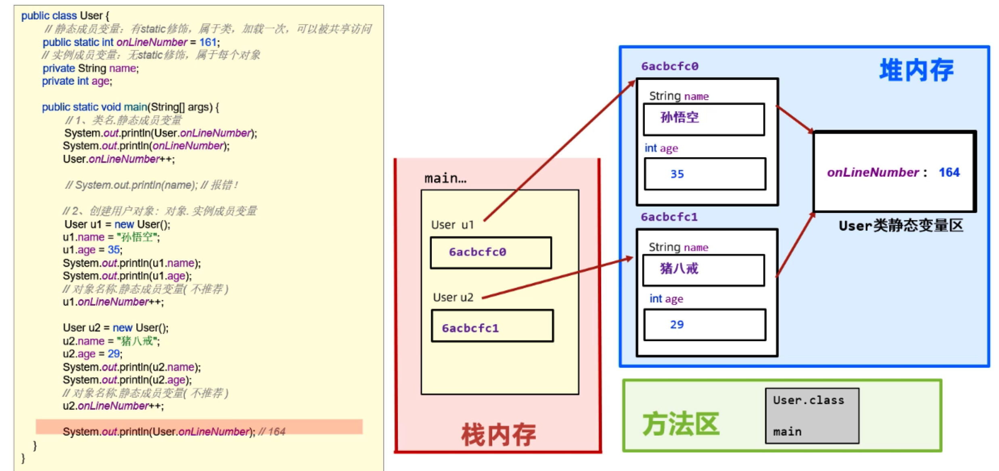

User.class、main……等被加载进方法区的同时，也将onLineNumber加载进了堆内存，执行第一个new User的时候，就开辟了一个堆内存存储该对象，并且开辟了对应的属性name/age存储空间。

### 实例和属性：

##### demo1：

```
package com.itheima.d1_static;

public class Student {
    /**
       实例成员变量：无static修饰，属于对象。
     */
    private String name;

    /**
       静态成员方法: 有static修饰，归属于类，可以被共享访问，用类名或者对象名都可以访问。
     */
    public static int getMax(int age1, int age2){
        return age1 > age2 ? age1 : age2;
    }

    /**
       实例方法:属于对象的，只能用对象触发访问
     */
    public void study(){
        System.out.println(name + "在好好学习，天天向上~");
    }

    public static void main(String[] args) {
        // 1、类名.静态成员方法
        System.out.println(Student.getMax(10, 3));
        // 注意：同一个类中，访问静态方法，类名可以省略不写。
        System.out.println(getMax(10, 32));

//         study(); // 报错了
        // 2、对象.实例方法
        Student s = new Student();
        s.name = "猪八戒";
        s.study();

        // 3、对象.静态方法 (语法是可行，但是不推荐)
        System.out.println(s.getMax(13,34));
    }
}

```

##### demo2：

```
package com.itheima.d1_static;

public class Student {
    /**
       实例成员变量：无static修饰，属于对象。
     */
    private String name;

    /**
       静态成员方法: 有static修饰，归属于类，可以被共享访问，用类名或者对象名都可以访问。
     */
    public static int getMax(int age1, int age2){
        return age1 > age2 ? age1 : age2;
    }

    /**
       实例方法:属于对象的，只能用对象触发访问
     */
    public void study(){
        System.out.println(name + "在好好学习，天天向上~");
    }

    public static void main(String[] args) {
        // 1、类名.静态成员方法
        System.out.println(Student.getMax(10, 3));
        // 注意：同一个类中，访问静态方法，类名可以省略不写。
        System.out.println(getMax(10, 32));

//         study(); // 报错了
        // 2、对象.实例方法
        Student s = new Student();
        s.name = "猪八戒";
        s.study();

        // 3、对象.静态方法 (语法是可行，但是不推荐)
        System.out.println(s.getMax(13,34));
    }
}

```

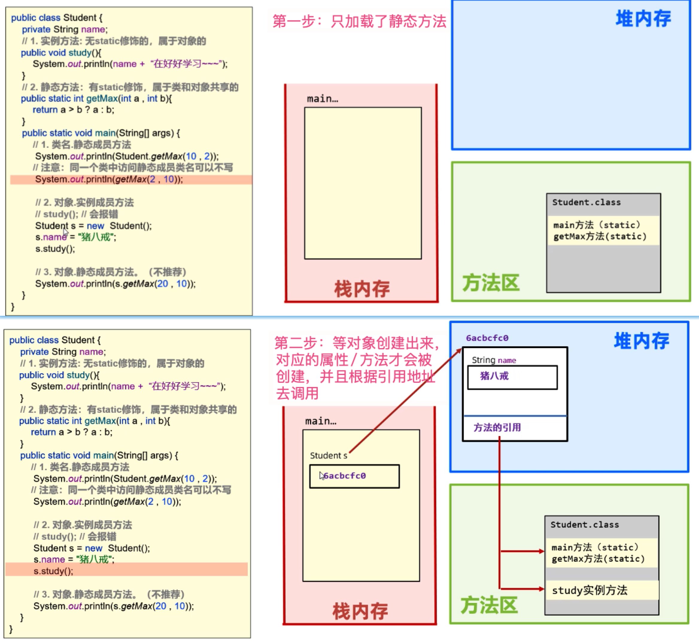

##### demo3：

静态成员和实例属性的访问关系：

```
package com.itheima.d1_static;

public class Test3 {

    /**
       静态成员
     */
    public static int onlineNumber = 10;
    public static void test2(){
        System.out.println("==test2==");
    }

    /**
      实例成员
     */
    private String name;
    public void run(){
        System.out.println(name + "跑的快~~");
    }

    // 3、静态方法中不可以出现this关键字
    public static void test3(){
        // System.out.println(this); // this只能代表当前对象！！
    }

    // 2、实例方法可以访问静态成员，也可以访问实例成员
    public void go(){
        System.out.println(Test3.onlineNumber);
        System.out.println(onlineNumber);
        test2();
        System.out.println(name);
        System.out.println(this);
        run();
    }

    // 1、静态方法只能访问静态成员，不能"直接"访问实例成员。
    public static void test(){
        System.out.println(Test3.onlineNumber);
        System.out.println(onlineNumber);
        test2();
        // System.out.println(name); // 不能直接访问实例成员。
        // run(); // 不能直接访问实例成员。
    }

    public static void main(String[] args) {
        // 目标：理解static 访问相关的语法：面试笔试题，或者以后理解程序很重要的知识（拓展）。
    }
}

```

##### demo4：

工具类的开发，比如开发一个验证码，在登录/注册的时候都会调用验证码，那么验证码就可以封装到一个util中：

ItheimUtil类：

```
package com.itheima.d2_static_util;

import java.util.Random;

/**
   工具类
 */
public class ItheimUtil {

    /**
       注意：由于工具类无需创建对象，所以把其构造器私有化会显得很专业！这样外界就不能够通过new实例化了
     */
    private ItheimUtil(){
    }

    /**
       静态方法。
     */
    public static String createVerifyCode(int n){
        // 开发一个验证码：
        // 1、定义一个变量记住验证码。
        String code = "";
        // 2、定义一个变量记住全部验证码字符。
        String data = "abcdefghijklmnopqrstuvwxyzABCDEFGHIJKLMNOPQRSTUVWXYZ0123456789";
        // 3、定义一个循环生成几个随机索引，去得到几个字符
        Random r = new Random();
        for (int i = 0; i < n; i++) {
            // 4、获取随机索引对应的字符。链接给code
            int index = r.nextInt(data.length());
            code += data.charAt(index);
        }
        return code;
    }
}

```

同目录下新建：Check类，并调用：ItheimUtil

```
package com.itheima.d2_static_util;

import java.util.Random;

public class Check {
    public static void main(String[] args) {
        // 开发一个验证码：
        System.out.println(ItheimUtil.createVerifyCode(6));
    }
}

```

为什么用静态方法，不用实例方法？

回答：方便快捷不占内存

### 代码块：

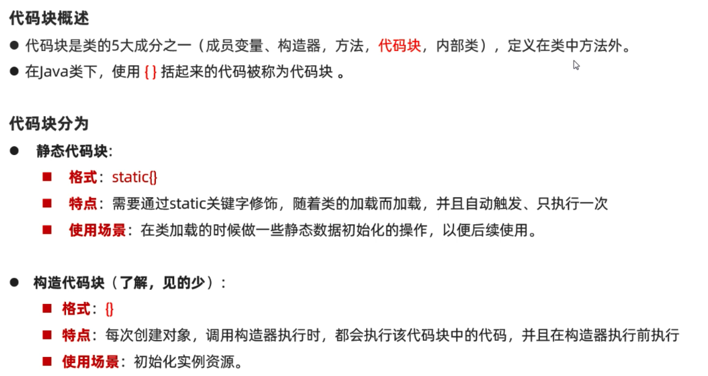

##### demo1：

静态代码块（static{}）

```
package com.itheima.d3_static_code;

public class StaticDemo1 {

    public static String schoolName;

    /**
       静态代码块：有static修饰，属于类，与类一起优先加载一次，自动触发执行。
       作用：可以用于初始化静态资源。
     */
    static {
        System.out.println("------静态代码块被触发执行了------");
        schoolName = "黑马";
    }

    public static void main(String[] args) {
        // 目标：先理解静态代码块。
        System.out.println("------main方法执行------");
        System.out.println(schoolName);
    }
}

```

##### demo2:

实例代码块（构造代码块）：

```
package com.itheima.d3_static_code;

public class StaticDemo2 {

    private String name;

    public StaticDemo2(){
        System.out.println("===无参构造器被触发执行==");
    }

    /**
       实例代码块：无static修饰，属于对象，每次构建对象时，都会触发一次执行。
       初始化实例资源。
     */
    {
        //name = "张三";
        System.out.println("===实例代码块被触发执行===");
    }

    public static void main(String[] args) {
        // 目标：理解实例代码块（构造代码块）。
        StaticDemo2 s1 = new StaticDemo2();
        System.out.println(s1.name);

        StaticDemo2 s2 = new StaticDemo2();
        System.out.println(s2.name);
    }
    // 打印顺序：
    //    ===实例代码块被触发执行===
    //    ===无参构造器被触发执行==
    //    ===实例代码块被触发执行===
    //    ===无参构造器被触发执行==
}

```

##### demo3：

初始化一副牌：

```
package com.itheima.d3_static_code;

import java.util.ArrayList;

public class StaticTest3 {

    /**
      1、定义一个静态的集合，这样这个集合只加载 一个。因为当前房间只需要一副牌。
     */
    public static ArrayList<String> cards = new ArrayList<>();

    /**
      2、在程序真正运行main方法前，把54张牌放进去吧，后续游戏可以直接使用了。
     */
    static {
        // 3、正式做牌，放到集合中去。
        // a、定义一个数组存储全部点数：类型确定了，个数确定了。
        String[] sizes = {"3", "4", "5", "6", "7", "8", "9", "10", "J", "Q", "K", "A", "2"};
        // b、定义一个数组存储全部的花色：类型确定了，个数确定了。
        String[] colors = {"♥", "♠", "♦", "♣"};
        // c、遍历点数
        for (int i = 0; i < sizes.length; i++) {
            // sizes[i]
            // d、遍历花色
            for (int j = 0; j < colors.length; j++) {
                // colors[j]
                // 一张牌
                String card = sizes[i] + colors[j];
                cards.add(card);
            }
        }
        // e、单独加入大小王。
        cards.add("小🃏");
        cards.add("大🃏");
    }

    public static void main(String[] args) {
        // 目标：模拟游戏启动前，初始化54张牌数据。
        System.out.println("新牌：" + cards);
    }
}

```

### 单例模式：

```
package com.itheima.d4_static_singleinstance;

/**
   使用饿汉单例实现单例类
 */
public class SingleInstance {

    /**
      2、饿汉单例是在获取对象前，对象已经提前准备好了一个。
       这个对象只能是一个，所以定义静态成员变量记住。
     */
    public static SingleInstance instance = new SingleInstance();

    /**
       1、必须把构造器私有化。
     */
    private SingleInstance(){
    }
}

```

为了避免被人挖坑，升级版：

```
package com.itheima.d4_static_singleinstance;

/**
   懒汉单例
 */
public class SingleInstance2 {

    /**
      2、定义一个静态的成员变量负责存储一个对象。
         只加载一次，只有一份。
       注意：最好私有化，这样可以避免给别人挖坑！
     */
    private static SingleInstance2 instance;

    /**
      3、提供一个方法，对外返回单例对象。
     */
    public static SingleInstance2 getInstance() {
        if(instance == null){
            // 第一次来拿对象 ：此时需要创建对象。
            instance = new SingleInstance2();
        }
        return instance;
    }


    /**
       1、私有化构造器
     */
    private SingleInstance2(){
    }
}

```

### 继承：

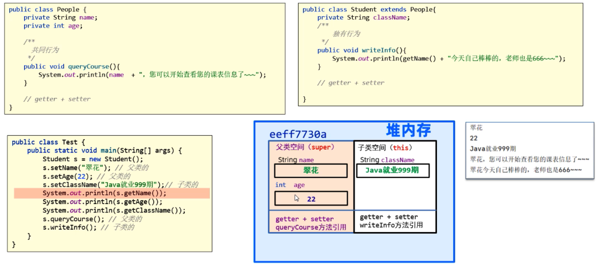

1、extend的注意点：

```
package com.itheima.d7_extends_feature;

public class Test {
    public static void main(String[] args) {
        // 目标：理解继承的特点。
        // 1、子类不能继承父类的构造器
        // 2、子类是否可以继承父类的私有成员？ 我认为是可以继承父类私有成员的（后面会讲），只是不能直接访问。
        Tiger t = new Tiger();
        // t.eat();
        // 3、子类是否可以继承父类的静态成员。 我认识不算继承的。只是共享的。
        System.out.println(Tiger.location);
    }
}

class Animal{
    private void eat(){
        System.out.println("动物要吃东西~~");
    }

    public static String location = "长隆动物园";
}

class Tiger extends Animal{

}

```

2、java只支持单集成，不支持多集成

3、继承后成员的访问特点：就近原则。

如果出现同名的变量，访问原则：

```

package com.itheima.d8_extends_field_method;

public class Test {
    public static void main(String[] args) {
        // 目标：理解继承后成员的访问特点：就近原则。
        Dog d = new Dog();
        d.run(); // 子类的
        d.lookDoor(); // 子类的
        d.showName();

    }
}

class Animal{
    public String name = "动物名";
    public void run(){
        System.out.println("动物可以跑~~");
    }
}

class Dog extends Animal{
    public String name = "狗名";

    public void lookDoor(){
        System.out.println("狗可以看门~~");
    }

    public void showName(){
        String name = "局部名";
        System.out.println(name);
        System.out.println(this.name); // 当前子类对象的name
        System.out.println(super.name); // 找父类的name

        super.run(); // 找父类的方法
	// 如果子类中没有run方法，那就是写不写super都会去父类中寻找
        run(); // 子类的run
    }

    public void run(){ // 就近原则
        System.out.println("狗跑的贼快~~~");
    }
}

```

## javaBean：实体类

标准的javaBean必须满足：

1、成员变脸需要使用private修饰；

2、提供每一个成员变量对应的setXXX（）/getXXX（）；

3、必须提供一个无参构造器；

demo：

```

package com.itheima.javabean;

public class User {
    private double height;
    private String name;
    private double salary;
    private String address;
    private String phone;

    public User() {
    }

    public User(double height, String name, double salary, String address, String phone) {
        this.height = height;
        this.name = name;
        this.salary = salary;
        this.address = address;
        this.phone = phone;
    }

    public double getHeight() {
        return height;
    }

    public void setHeight(double height) {
        this.height = height;
    }

    public String getName() {
        return name;
    }

    public void setName(String name) {
        this.name = name;
    }

    public double getSalary() {
        return salary;
    }

    public void setSalary(double salary) {
        this.salary = salary;
    }

    public String getAddress() {
        return address;
    }

    public void setAddress(String address) {
        this.address = address;
    }

    public String getPhone() {
        return phone;
    }

    public void setPhone(String phone) {
        this.phone = phone;
    }
}
如上很多的setXXX和getXXX方法，可以自动生成，在代码空白区，右键，选择“generate"，再选择“set and get"，再选择对应的属性，就可以生成对应属性的set和get方法，题外话，constructor也可以这样自动生成。

```

使用：

```
package com.itheima.javabean;

public class Test {
    public static void main(String[] args) {
        User user = new User();
        user.setName("二狗");
        user.setHeight(163);
        user.setSalary(50000);
        user.setAddress("中国");
        user.setPhone("13141314520");
//        String name = user.getName();
//        System.out.println(name);
        System.out.println(user.getName());
        System.out.println(user.getHeight());
        System.out.println(user.getSalary());
        System.out.println(user.getAddress());
        System.out.println(user.getPhone());

        System.out.println("--------------------");
        User user1 = new User(176, "黑马吴彦祖", 30000, "黑马", "110");
        System.out.println(user1.getName());
        System.out.println(user1.getHeight());
        System.out.println(user1.getSalary());
        System.out.println(user1.getAddress());
        System.out.println(user1.getPhone());
    }
}

```

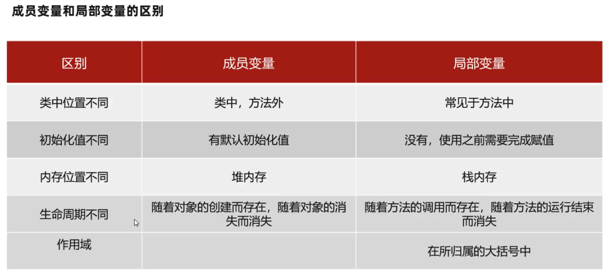

## String类

放在了java.lang.String中

```
String name = "na";
name += "haah"; // nahaah;
```

这里引用数据类型name的地址是没有发生变化的，但是value发生了改变

demo:

```
 public class StringDemo2 {
    public static void main(String[] args) {
        // 方式一：直接使用双引号得到字符串对象
        String name = "我爱你中国";
        System.out.println(name);

        // 方式二：
        // 1、public String(): 创建一个空白字符串对象，不含有任何内容 （几乎不用）
        String s1 = new String(); // s1 = ""
        System.out.println(s1);

        // 2、public String(String): 根据传入的字符串内容，来创建字符串对象（几乎不用）
        String s2 = new String("我是中国人");
        System.out.println(s2);

        // 3、public String(char[] c): 根据字符数组的内容，来创建字符串对象
        char[] chars = {'a' , 'b' , '中', '国'};
        String s3 = new String(chars);
        System.out.println(s3); // ab中国

        // 4、public String(byte[] b):  根据字节数组的内容，来创建字符串对象
        byte[] bytes = {97, 98, 99, 65, 66, 67};
        String s4 = new String(bytes);
        System.out.println(s4); // abcABC

        System.out.println("---------------------------------------");
        String ss1 = "abc";
        String ss2 = "abc";
        System.out.println(ss1 == ss2); // true // 指向了同一个"abc"对象

        char[] chars1 = {'a' , 'b' , 'c'};
        String ss3 = new String(chars1);
        String ss4 = new String(chars1);
        System.out.println(ss3 == ss4); // false new一次就新创建了一个对象
    }
}
```

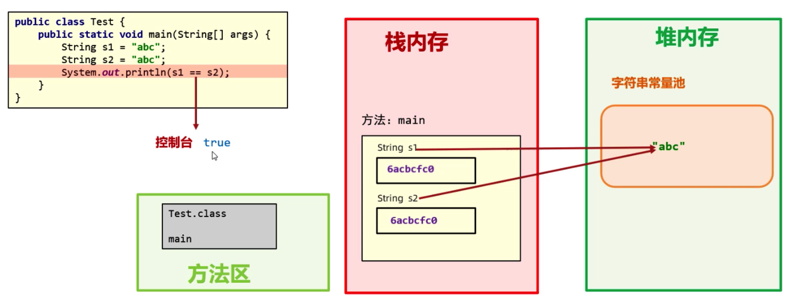

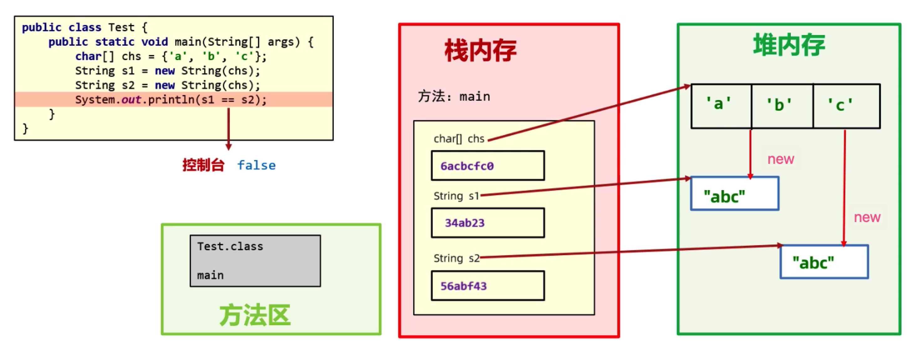

思考题：

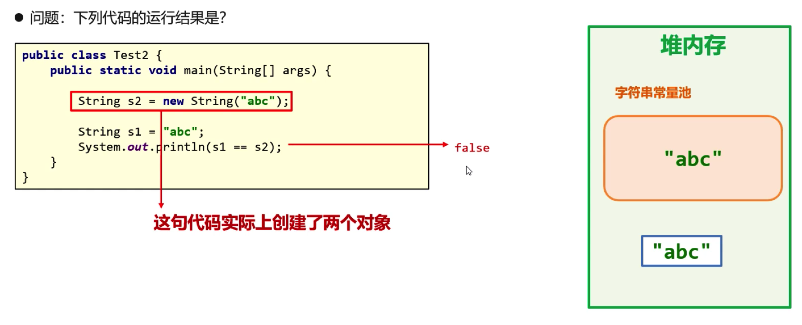

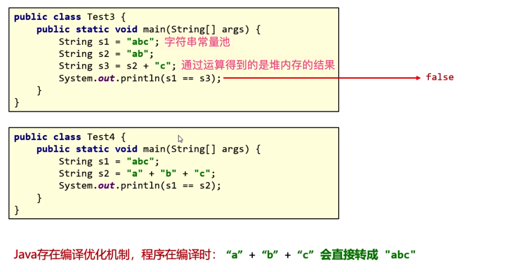

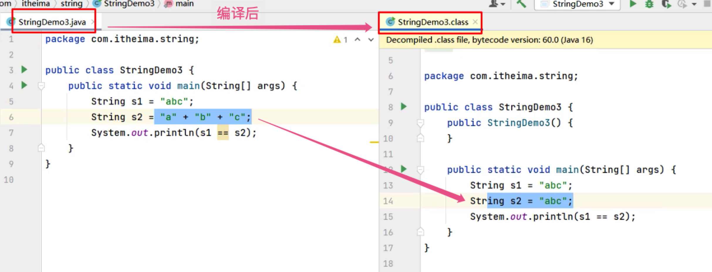

 字符串判断的demo：

```
package com.itheima.string;

import java.util.Scanner;

public class StringAPIEqualsDemo4 {
    public static void main(String[] args) {
        // 1、正确登录名和密码
        String okName = "itheima";
        String okPassword = "123456";

        // 2、请您输入登录名称和密码
        Scanner sc = new Scanner(System.in);
        System.out.println("登录名称：");
        String name = sc.next();
        System.out.println("登录密码：");
        String password = sc.next();

        // 3、判断用户输入的登录名称和密码与正确的内容是否相等。
        if(okName.equals(name ) && okPassword.equals(password)){
            System.out.println("登录成功！");
        }else {
            System.out.println("用户名或者密码错误了！");
        }

        // 4、忽略大小写比较内容的Api: 一般用于比较验证码这样的业务逻辑
        String sysCode = "23AdFh";
        String code1 = "23aDfH";
        System.out.println(sysCode.equals(code1)); // false
        System.out.println(sysCode.equalsIgnoreCase(code1)); // true
    }
}

```

字符串基础api的demo：

```
package com.itheima.string;

/**
    目标：掌握String常用的其他API。
 */
public class StringAPIOtherDemo5 {
    public static void main(String[] args) {
        // 1、public int length(): 获取字符串的长度
        String name = "我爱你中国love";
        System.out.println(name.length());

        // 2、public char charAt(int index): 获取某个索引位置处的字符
        char c = name.charAt(1);
        System.out.println(c);

        System.out.println("------------遍历字符串中的每个字符--------------");
        for (int i = 0; i < name.length(); i++) {
            char ch = name.charAt(i);
            System.out.println(ch);
        }
        // 3、public char[] toCharArray()：: 把字符串转换成字符数组
        char[] chars = name.toCharArray();
        for (int i = 0; i < chars.length; i++) {
            char ch = chars[i];
            System.out.println(ch);
        }

        // 4、public String substring(int beginIndex, int endIndex) ：截取内容，(包前不包后的)
        String name2 = "Java是最厉害的编程语言！";
        //              01234567   89
        String rs = name2.substring(0, 9);
        System.out.println(rs);
        String rs1 = name2.substring(4, 9);
        System.out.println(rs1);

        // 5、public String substring(int beginIndex):从当前索引一直截取到末尾
        String rs2 = name2.substring(4);
        System.out.println(rs2);

        // 6、public String replace(CharSequence target, CharSequence replacement)
        String name3 = "金三胖是最厉害的80后，金三胖棒棒的！我好爱金三胖";
        String rs3 = name3.replace("金三胖", "***");
        System.out.println(rs3);

        // 7、public boolean contains(CharSequence s)
        System.out.println(name3.contains("金三胖")); // true
        System.out.println(name3.contains("金二胖")); // false

        // 8、public boolean startsWith(String prefix)
        System.out.println(name3.startsWith("金三胖"));
        System.out.println(name3.startsWith("金三胖是最厉害的"));
        System.out.println(name3.startsWith("金三胖是最厉害的2"));

        // 9、public String[] split(String s): 按照某个内容把字符串分割成字符串数组返回。
        String name4 = "王宝强,贾乃亮,陈羽凡";
        String[] names = name4.split(",");
        for (int i = 0; i < names.length; i++) {
            System.out.println("选择了：" + names[i]);
        }
    }
}

```

## ArrayList:

表达的是一种集合类，集合是一个容器，与数组类似，不同的是集合的大小是不固定的。相对于数组，它提供了更加丰富的API

arraylist增删改查操作demo：

```
package com.test.world;

import java.util.ArrayList;

public class World2 {
  public static void main(String[] args) {
    ArrayList<String> list = new ArrayList<>();
    list.add("Java");
    list.add("Java");
    list.add("MySQL");
    list.add("MyBatis");
    list.add("HTML");

    // 1、public E get(int index)：获取某个索引位置处的元素值
    String e = list.get(3);
    System.out.println(e);

    // 2、public int size()：获取集合的大小（元素个数）
    System.out.println(list.size());

    // 3、完成集合的遍历
    for (int i = 0; i < list.size(); i++) {
      System.out.println(list.get(i));
    }

    // 4、public E remove(int index)：删除某个索引位置处的元素值,并返回被删除的元素值
    System.out.println(list); // [Java, Java, MySQL, MyBatis, HTML]
    String e2 = list.remove(2);
    System.out.println(e2);
    System.out.println(list);

    // 5、public boolean remove(Object o):直接删除元素值，删除成功返回true，删除失败返回false
    System.out.println(list.remove("MyBatis"));
    System.out.println(list);

    ArrayList<String> list1 = new ArrayList<>();
    list1.add("Java");
    list1.add("王宝强");
    list1.add("Java");
    list1.add("MySQL");
    System.out.println(list1);
    // 只会删除第一次出现的这个元素值，后面的不删除
    System.out.println(list1.remove("Java"));
    System.out.println(list1);


    // 6、public E set(int index,E element)：修改某个索引位置处的元素值。
    String e3 = list.set(0 , "贾乃亮");
    System.out.println(e3);
    System.out.println(list);
  }
}


```

##### demo1：

```
package com.test.world;

import java.util.ArrayList;

public class World2 {
  public static void main(String[] args) {
    ArrayList<Integer> scores = new ArrayList<>();
    scores.add(98);
    scores.add(77);
    scores.add(66);
    scores.add(89);
    scores.add(79);
    scores.add(50);
    scores.add(100);
    System.out.println(scores);
    // [98, 77, 66, 89, 79, 50, 100]
    // [98, 66, 89, 50, 100]
    //                   i
//
//    // 1、遍历集合中的每个元素
//        for (int i = 0; i < scores.size(); i++) {
//            int score = scores.get(i);
//            // 2、判断这个分数是否低于80分，如果低于则从集合中删除它
//            if(score < 80){
//                scores.remove(i);
//            }
//        }
//        System.out.println(scores);

    //  结果：
    //  [98, 77, 66, 89, 79, 50, 100]
    //  [98, 66, 89, 50, 100]

    for (int i = scores.size() - 1; i >= 0 ; i--) {
      int score = scores.get(i);
      // 2、判断这个分数是否低于80分，如果低于则从集合中删除它
      if(score < 80){
        scores.remove(i);
      }
    }
    System.out.println(scores);
    //结果：
    //    [98, 77, 66, 89, 79, 50, 100]
    //    [98, 89, 100]
  }
}


```

##### demo2：

1、定义moive类：

```
package com.itheima.arraylist;

import java.util.ArrayList;

/**
    案例：集合存储自定义元素并遍历。
    需求：定义电影类（名称，分值，演员），创建3个电影对象，代表三部影片，存入集合中并遍历。
    《肖生克的救赎》, 9.7 , 罗宾斯
    《霸王别姬》, 9.6 , 张国荣、张丰毅
    《阿甘正传》, 9.5 , 汤姆.汉克斯
 */
public class ArrayListTest5{
    public static void main(String[] args) {
        // 1、定义一个电影类：Movie
        // 2、定义一个ArrayList集合存储这些影片对象。
        ArrayList<Movie> movies = new ArrayList<>();

        // 3、创建影片对象封装电影数据，把对象加入到集合中去。
//        Movie m1 = new Movie("《肖生克的救赎》", 9.7 , "罗宾斯");
//        movies.add(m1);
        movies.add(new Movie("《肖生克的救赎》", 9.7 , "罗宾斯"));
        movies.add(new Movie("《霸王别姬》", 9.6 , "张国荣、张丰毅"));
        movies.add(new Movie("《阿甘正传》", 9.5 , "汤姆.汉克斯"));

        System.out.println(movies);

        // 4、遍历集合中的影片对象并展示出来
        for (int i = 0; i < movies.size(); i++) {
            Movie movie = movies.get(i);
            System.out.println("片名：" + movie.getName());
            System.out.println("评分：" + movie.getScore());
            System.out.println("主演：" + movie.getActor());
        }
    }
}


```

2、对movie类进行调用：

```
package com.itheima.arraylist;

import java.util.ArrayList;

/**
    案例：集合存储自定义元素并遍历。
    需求：定义电影类（名称，分值，演员），创建3个电影对象，代表三部影片，存入集合中并遍历。
    《肖生克的救赎》, 9.7 , 罗宾斯
    《霸王别姬》, 9.6 , 张国荣、张丰毅
    《阿甘正传》, 9.5 , 汤姆.汉克斯
 */
public class ArrayListTest5{
    public static void main(String[] args) {
        // 1、定义一个电影类：Movie
        // 2、定义一个ArrayList集合存储这些影片对象。
        ArrayList<Movie> movies = new ArrayList<>();

        // 3、创建影片对象封装电影数据，把对象加入到集合中去。
//        Movie m1 = new Movie("《肖生克的救赎》", 9.7 , "罗宾斯");
//        movies.add(m1);
        movies.add(new Movie("《肖生克的救赎》", 9.7 , "罗宾斯"));
        movies.add(new Movie("《霸王别姬》", 9.6 , "张国荣、张丰毅"));
        movies.add(new Movie("《阿甘正传》", 9.5 , "汤姆.汉克斯"));

        System.out.println(movies);

        // 4、遍历集合中的影片对象并展示出来
        for (int i = 0; i < movies.size(); i++) {
            Movie movie = movies.get(i);
            System.out.println("片名：" + movie.getName());
            System.out.println("评分：" + movie.getScore());
            System.out.println("主演：" + movie.getActor());
        }
    }
}


```
