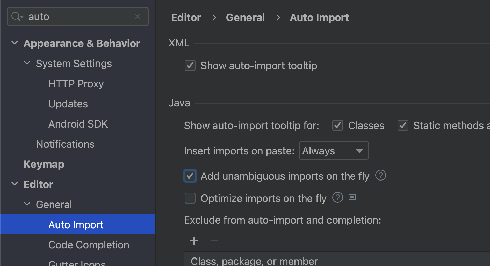
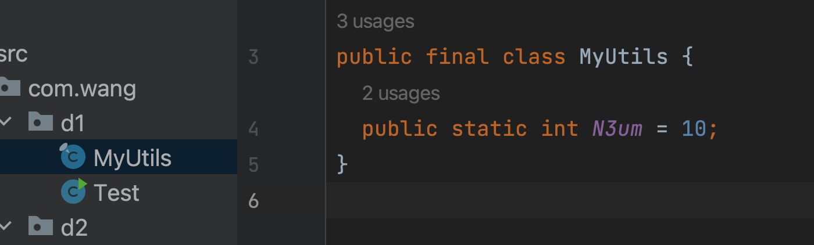
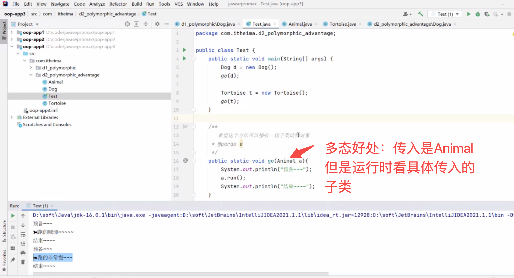

开始20天第2讲

# 导包：


当我们在Test文件中使用了另外一个类的比如：鼠标放到静态变量身上，IDE会自动提示option+回车，自动导包(同级不需要，不同级需要导包)

自动导包，鼠标放上去就导入，但是这个功能不好使，那就用上面的手动办法吧



当不同的package（包)存在同名的类，在同一个文件中使用时候，另外一个类就必须全路径去使用：


如果对包和类名都进行重命名操作，那么已经引用的地方IDE也能帮我们直接重命名

# 权限修饰符：


速记下就是public可以被任何地方使用，缺省 就是只能在当前包使用

# final和abstract：


场景1：比如我们的工具类，肯定希望别人是直接使用



场景2：比如我们往一个函数中传递了一个参数，不希望这个参数再被二次赋值（比如我传了一个折扣比例进来），这个时候我们就可以对这个形参进行final修饰：


场景3：关于final修饰复杂数据类型，比如类，他的内容就可以被重新修改：


场景4：final和abstract不能同时修饰一个变量、方法，当我们的一个方法被abstract修饰，肯定需要子类去实现，实现的时候会有@overrides修饰该重写方法。

场景5：可以感受下abstact在模版函数场景的使用demo：


# 常量：


# interface：

一个类可以实现多一个接口，一个接口也可以去实现多个接口，一般我们会给接口比较多的场景，将接口进行层级划分，让一个接口去实现多个接口，然后再让这个类去实现这一个接口，好处就是结构清晰。

```java
package com.wang.d1;

// 声明一个接口：体现的就是一种规范，所以这种规范肯定是公开的
// 对于接口本身而言，这种【规范】也是存在简写的，如下：
public interface ABC {
  // 定义一个常量标准写法
  public  static final String SCHE = "AHAHAHA";
  // 简写：
  String SCHEE = "JJJJ";
  // 抽象方法，需要类去实现该接口并实现该方法
  // 在接口中定义的方法并没有函数体
  public abstract void run();
  // 简写
  void run2();
}

```

JDK8后接口做了一些改动，为了扩展接口的功能又不影响目前已经规范，所以就有了下面的骚操作：

骚操作1：可以写一个类似在类中才可以调用的，带有函数体的方法


骚操作2：


骚操作3：


```java
package com.wang.d1;

// 声明一个接口：体现的就是一种规范，所以这种规范肯定是公开的
// 对于接口本身而言，这种【规范】也是存在简写的，如下：
public interface ABC {
  // 定义一个常量标准写法
  public static final String SCHE = "AHAHAHA";
  // 简写：
  String SCHEE = "JJJJ";

  // 抽象方法，需要类去实现该接口并实现该方法
  // 在接口中定义的方法并没有函数体
  public abstract void run();

  // 简写
  void run2();

  // JDK8后的骚操作1：
  //  public void test3() { // 要用default代替public
  //
  //  }
  // 该方法只能过继给实现这个接口的类的实例来进行调用
  default void test3() {
    System.out.println("djdjjd");
    getAge(); // 只能被内部调用
  }

  // JDK8后的骚操作2：
  public static void getName() { // public可以省略
    System.out.println("woww");
  }
  // JDK8后的骚操作3：
  private void getAge() {
    System.out.println(15);
  }

}

```

调用：


# 多态：


从下面的截图就能看出来，即使子类中写了和父类同名变量，再实例化后调用该变量，也是打印的父类的变量value：


多态好处：



但是多态有个缺点，如上的案例，当我们子类有一个独有的fn，但是比如Dog有看门的功能，如果再18行后面执行a.kanmen()，岂不是乌龟也需要执行，就报错了。

这个问题是有解决办法的：


demo：


所以强转之前，java建议：


因为上面代码简单，能够直接看出a是new Dog来的，但是当代码结构复杂，a的来源不容易直接看出来的时候，使用instanceof做判断还是很有必要的。

# 内部类：


内部类的种类：


## 静态内部类：


如果非得内部类访问外面的实例属性，可以通过在内部类里面实例化外部类，然后再调用该实例属性、方法。

## 成员内部类：


这种更符合生活中的场景，比如人和心脏，肯定先实例出人，再实例出心脏，再调用对应的实例方法，属性。

当我们的内部类和外部类同名，怎么访问外部类的属性、方法：


## 局部内部类：

这种写法不规范，或者不常用，只作为了解。


## 匿名内部类：

这个后续用的最多，也可以看成局部内部类的简化版：

比如我们要调用一个接口的方法，这个时候就必须先实例化，再通过这个实例去调用方法，这个就比较麻烦，写法如下：


我们用匿名内部类来减少代码：


这里看着是接口进行了实例化，其实是借助匿名内部类的写法，实现了简写的方式，本质上还是对类进行的实例化，再调用实例的swim方法。

这种需要传递接口，然后传递对应实例的场景，还有一个demo如下：


# Object常用Api：

## toString：

默认我们打印一个实例，或者实例.toString()进行打印，得到的内容如图：包名@地址 的形式：


但是实际工作中，我们是希望拿到这个实例具体的属性，方法这些内容的，所以我们要对toString进行重写：


## equals：

 如果不重写他，他的用途和==一样，就是比较两个实例的地址是否相同，所以一般我们用==去比较两个实例的地址，而重写equals，来判断两个实例的内容是否相等，比如一个设备，他可能录入途径不一样，但是厂家，铭牌，型号，did等都一模一样，我们就认为通过不同途径录入进来的这个设备就是同一台设备。

如下案例是比较Student是否相同，注释掉的部分其实就是提前判断，首先传入的是Student才具有可比较的价值，手写的equals重写案例如下：


官方的自动生成效果：


疑问，为啥比较name用的是Objects.equals，而不是字符串的name.equals(...)呢？

答：担心name是null造成空指针异常，Objects.equals是在字符串equals基础上预先做了非空判断

# Objects常用Api：

Objects是Object的子类

## equals:

其实如果没有使用官方重写Ojbect.equels，还不如直接用Objects.equals来的安全


## isNull：

判断某个变量是否是null

```java
public static void main(String[] args) {
    String a = null;
    Boolean b = isNull(a);
    System.out.println(b); // true
  }
```

# StringBuilder:

特点：可以链接各种各样的数据类型，可以链式编程


性能上他是比String直接进行+操作性能好的，因为String在进行+操作的时候，是不断地在创建都丢弃对象，然后替换变量指向的新地址：


而StringBuilder是一直在一个对象中进行的操作，所以性能上会好一些

demo：


常见的api，比如翻转reverse，length，这里有一个注意点，一般我们是把Stringbuilder作为操作string的工具，它就是一个过程，最后处理完后还是要转换成Strting进行传递（toString())，而不要直接用StringBuilder进行传递。比如这里的check

# Math：


上面见到的StringBuilder，Math这些都是直接在代码中使用，不需要引包

# System：


## 时间毫秒值：


用途demo，比如我们测试一段代码的性能：


## 数组拷贝（了解)

这个System提供的拷贝方法


```java
public class Haha {
  public static int Haha1 = 222;

  // 效果：[0,0,0,0,0,0] => [0,0,40,50,60,0]
  public static void main(String[] args) {
    int[] a = {10,20,30,40,50,60,70};
    int[] b = new int[6];
    System.arraycopy(a, 3, b,2,3);
    System.out.println(Arrays.toString(b));
  }
}
```

# BigDecimal：


bigDecimal在阿里里面的使用规范：


使用bigDecimal.valueOf更好用，因为一版需要处理大数的情况，都是数字类的入参，所以bigDecimal.valueOf用的场合更多。

把大数转换成bigDecimal进行加减乘除后，最终还是要转换成普通的数据结构来进行传递，所以bigDecimal也就是一个工具，一个过程，最后在使用的时候，比如我们转成double进行打印：


# 处理时间：

## Date

手册：https://docs.oracle.com/javase/8/docs/api/java/util/Date.html

Date是JDK8以前的工具函数，目前很少使用（后面有更高级的Api)，可以看到Date目前还有两种初始化的方式还没有被废弃：


demo：

```java
import java.util.Date;
public class Haha {
  public static void main(String[] args) {
    Date d = new Date();
    System.out.println(d); // 是北京时间 Mon Aug 21 07:05:01 CST 2023
    long time = d.getTime();
    System.out.println(time);
    System.out.println(System.currentTimeMillis()); // 等同d.getTime();
    // 计算当前时间往后走1h121s的时间是多少
    long Time2 = System.currentTimeMillis();
    Time2 += (60 * 60 + 121) * 1000;
    Date Time3 = new Date(Time2);
    System.out.println(Time3);
  }
}
```

## SimpleDateFormat(格式化日期)：

包含了转成对应格式时间（format)和把对应格式时间字符串转换成时间毫秒值（parse)

手册: https://docs.oracle.com/javase/8/docs/api/java/text/SimpleDateFormat.html

### format：


具体缩写的含义可以参考文档：


对上面的【日期对象】进行格式化：

```java
import java.text.SimpleDateFormat;
import java.util.Date;
//...
SimpleDateFormat sdf = new SimpleDateFormat("yyyy年MM月dd日 HH:mm:ss EEE a");
String ss = sdf.format(Time3);
System.out.println(ss); // 2023年08月16日 09:24:37 周三 上午
```

SimpleDateFormat也可以格式化时间毫秒值：

```java
    long f = System.currentTimeMillis();
    String f2 = sdf.format(f);
    System.out.println(f2); // 2023年08月16日 08:28:35 周三 上午
```

### parse：

案例：计算出2021年08月06日11点11分11秒，往后走2天14小时49分06秒后的时间是多少

```java
package com.wang.d2;
import java.text.ParseException;
import java.text.SimpleDateFormat;
import java.util.Date;

public class Haha {
  public static void main(String[] args) throws ParseException {
    String dateStr = "2021年08月06日 11:11:11";
// 这里格式化的格式和字符串必须能匹配上，不然会报错
    SimpleDateFormat sdf = new SimpleDateFormat("yyyy年MM月dd日 HH:mm:ss");
    Date d = sdf.parse(dateStr);
//    long time = d.getTime() + (2*24*60*60 + 14*60*60 + 49*60 + 6) * 1000;
    // 下面这种写法更保险，不容易越界
    long time = d.getTime() + (2L*24*60*60 + 14*60*60 + 49*60 + 6) * 1000;
    // 再把加好的时间毫秒值再转换成对应格式的时间字符串
    String dd = sdf.format(time);
    System.out.println(dd); // 2021年08月09日 02:00:17
  }
}


```

如上，我们对一个字符串进行parse后，得到Date对象，当我们想比较两个时间谁在前谁在后的时候，可以使用Date上的api进行判断，伪代码如下：

```
Date d1 = sdf.parse(dateStr1);
Date d2 = sdf.parse(dateStr2);
Date d3 = sdf.parse(dateStr3);
if（d1.after(d2) && d1.before(d3)){...}
```

## calendar:


```java
package com.itheima.d3_calendar;

import javax.xml.crypto.Data;
import java.util.Calendar;
import java.util.Date;

/**
    目标：日历类Calendar的使用,可以得到更加丰富的信息。

    Calendar代表了系统此刻日期对应的日历对象。
    Calendar是一个抽象类，不能直接创建对象。
    Calendar日历类创建日历对象的语法：
        Calendar rightNow = Calendar.getInstance();
    Calendar的方法：
        1.public static Calendar getInstance(): 返回一个日历类的对象。
        2.public int get(int field)：取日期中的某个字段信息。
        3.public void set(int field,int value)：修改日历的某个字段信息。
        4.public void add(int field,int amount)：为某个字段增加/减少指定的值
        5.public final Date getTime(): 拿到此刻日期对象。
        6.public long getTimeInMillis(): 拿到此刻时间毫秒值
    小结：
        记住。
 */
public class CalendarDemo{
    public static void main(String[] args) {
        // 1、拿到系统此刻日历对象
        Calendar cal = Calendar.getInstance();
        System.out.println(cal);

        // 2、获取日历的信息:public int get(int field)：取日期中的某个字段信息。
        int year = cal.get(Calendar.YEAR);
        System.out.println(year);

        int mm = cal.get(Calendar.MONTH) + 1;
        System.out.println(mm);

        int days = cal.get(Calendar.DAY_OF_YEAR) ;
        System.out.println(days);

        // 3、public void set(int field,int value)：修改日历的某个字段信息。一般很少做修改操作
        // cal.set(Calendar.HOUR , 12);
        // System.out.println(cal);

        // 4.public void add(int field,int amount)：为某个字段增加/减少指定的值
        // 请问64天后是什么时间
        cal.add(Calendar.DAY_OF_YEAR , 64);
        cal.add(Calendar.MINUTE , 59);

        //  5.public final Date getTime(): 拿到此刻日期对象。
        Date d = cal.getTime();
        System.out.println(d);

        //  6.public long getTimeInMillis(): 拿到此刻时间毫秒值
        long time = cal.getTimeInMillis();
        System.out.println(time);

    }
}

```


# 新版本处理时间api：

## LocalDate: 

年月日

```java
package com.itheima.d4_jdk8_time;
import java.time.LocalDate;
import java.time.Month;

public class Demo01LocalDate {
    public static void main(String[] args) {
        // 1、获取本地日期对象。
        LocalDate nowDate = LocalDate.now();
        System.out.println("今天的日期：" + nowDate);//今天的日期：

        int year = nowDate.getYear();
        System.out.println("year：" + year);


        int month = nowDate.getMonthValue();
        System.out.println("month：" + month);

        int day = nowDate.getDayOfMonth();
        System.out.println("day：" + day);

        //当年的第几天
        int dayOfYear = nowDate.getDayOfYear();
        System.out.println("dayOfYear：" + dayOfYear);

        //星期
        System.out.println(nowDate.getDayOfWeek());
        System.out.println(nowDate.getDayOfWeek().getValue());

        //月份
        System.out.println(nowDate.getMonth());//AUGUST
        System.out.println(nowDate.getMonth().getValue());//8

        System.out.println("------------------------");
        LocalDate bt = LocalDate.of(1991, 11, 11);
        System.out.println(bt);//直接传入对应的年月日
        System.out.println(LocalDate.of(1991, Month.NOVEMBER, 11));//相对上面只是把月换成了枚举
    }
}

```

## LocalTime: 

时分秒：

```java
package com.itheima.d4_jdk8_time;

import java.time.LocalDateTime;
import java.time.LocalTime;
import java.time.Month;

public class Demo02LocalTime {
    public static void main(String[] args) {
        // 1、获取本地时间对象。
        LocalTime nowTime = LocalTime.now();
        System.out.println("今天的时间：" + nowTime);//今天的时间：

        int hour = nowTime.getHour();//时
        System.out.println("hour：" + hour);//hour：

        int minute = nowTime.getMinute();//分
        System.out.println("minute：" + minute);//minute：

        int second = nowTime.getSecond();//秒
        System.out.println("second：" + second);//second：

        int nano = nowTime.getNano();//纳秒
        System.out.println("nano：" + nano);//nano：

        System.out.println("-----");
        System.out.println(LocalTime.of(8, 20));//时分
        System.out.println(LocalTime.of(8, 20, 30));//时分秒
        System.out.println(LocalTime.of(8, 20, 30, 150));//时分秒纳秒
        LocalTime mTime = LocalTime.of(8, 20, 30, 150);

        System.out.println("---------------");
        System.out.println(LocalDateTime.of(1991, 11, 11, 8, 20));
        System.out.println(LocalDateTime.of(1991, Month.NOVEMBER, 11, 8, 20));
        System.out.println(LocalDateTime.of(1991, 11, 11, 8, 20, 30));
        System.out.println(LocalDateTime.of(1991, Month.NOVEMBER, 11, 8, 20, 30));
        System.out.println(LocalDateTime.of(1991, 11, 11, 8, 20, 30, 150));
        System.out.println(LocalDateTime.of(1991, Month.NOVEMBER, 11, 8, 20, 30, 150));
    }
}

```

## LocalDateTime：

年月日时分秒

```java
package com.wang.d2;
import java.text.ParseException;

import java.time.LocalDate;
import java.time.LocalDateTime;
import java.time.LocalTime;

public class Haha {
  public static void main(String[] args) throws ParseException {
    // 日期 时间
    LocalDateTime nowDateTime = LocalDateTime.now();
    System.out.println("今天是：" + nowDateTime);//今天是：
    System.out.println(nowDateTime.getYear());//年
    System.out.println(nowDateTime.getMonthValue());//月
    System.out.println(nowDateTime.getDayOfMonth());//日
    System.out.println(nowDateTime.getHour());//时
    System.out.println(nowDateTime.getMinute());//分
    System.out.println(nowDateTime.getSecond());//秒
    System.out.println(nowDateTime.getNano());//纳秒
    //日：当年的第几天
    System.out.println("dayOfYear：" + nowDateTime.getDayOfYear());//dayOfYear：249
    //星期
    System.out.println(nowDateTime.getDayOfWeek());//THURSDAY
    System.out.println(nowDateTime.getDayOfWeek().getValue());//4
    //月份
    System.out.println(nowDateTime.getMonth());//SEPTEMBER
    System.out.println(nowDateTime.getMonth().getValue());//9


    LocalDate ld = nowDateTime.toLocalDate(); // 获取年月日
    System.out.println("toLocalDate: "+ld);

    LocalTime lt = nowDateTime.toLocalTime(); // 获取时分秒
    System.out.println(lt.getHour());
    System.out.println(lt.getMinute());
    System.out.println(lt.getSecond());
  }
}


```

## 更新时间：

这个api的好处就是对原始的时间对象进行操作后返回的是一个新的对象，原始对象不会改变，区别于calender的api，一旦修改了日历上的api，整个日历对象上的日期都变了

```java
package com.itheima.d4_jdk8_time;

import java.time.LocalDate;
import java.time.LocalTime;
import java.time.MonthDay;

public class Demo04UpdateTime {
    public static void main(String[] args) {
        LocalTime nowTime = LocalTime.now();
        System.out.println(nowTime);//当前时间
        System.out.println(nowTime.minusHours(1));//一小时前
        System.out.println(nowTime.minusMinutes(1));//一分钟前
        System.out.println(nowTime.minusSeconds(1));//一秒前
        System.out.println(nowTime.minusNanos(1));//一纳秒前

        System.out.println("----------------");

        System.out.println(nowTime.plusHours(1));//一小时后
        System.out.println(nowTime.plusMinutes(1));//一分钟后
        System.out.println(nowTime.plusSeconds(1));//一秒后
        System.out.println(nowTime.plusNanos(1));//一纳秒后

        System.out.println("------------------");
        // 不可变对象，每次修改产生新对象！
        System.out.println(nowTime);

        System.out.println("---------------");
        LocalDate myDate = LocalDate.of(2018, 9, 5);
        LocalDate nowDate = LocalDate.now();

        System.out.println("今天是2018-09-06吗？ " + nowDate.equals(myDate));//今天是2018-09-06吗？ false
        System.out.println(myDate + "是否在" + nowDate + "之前？ " + myDate.isBefore(nowDate));//2018-09-05是否在2018-09-06之前？ true
        System.out.println(myDate + "是否在" + nowDate + "之后？ " + myDate.isAfter(nowDate));//2018-09-05是否在2018-09-06之后？ false

        System.out.println("---------------------------");
        // 判断今天是否是你的生日
        LocalDate birDate = LocalDate.of(1996, 8, 5);
        LocalDate nowDate1 = LocalDate.now();

        MonthDay birMd = MonthDay.of(birDate.getMonthValue(), birDate.getDayOfMonth());
        MonthDay nowMd = MonthDay.from(nowDate1);

        System.out.println("今天是你的生日吗？ " + birMd.equals(nowMd));//今天是你的生日吗？ false
    }
}

```

## 系统时间戳的获取：

本地和0时区的转换：

```java
package com.itheima.d4_jdk8_time;

import java.time.Instant;
import java.time.LocalDate;
import java.time.ZoneId;
import java.util.Date;

public class Haha {
  public static void main(String[] args) {
    // 1、得到一个Instant时间戳对象 0时区
    Instant instant = Instant.now();
    System.out.println(instant); // 2023-08-20T23:49:19.132521Z

    // 2、系统此刻的时间戳怎么办？
    Instant instant1 = Instant.now();
    // 2023-08-21T07:49:19.136893+08:00[Asia/Shanghai]
    System.out.println(instant1.atZone(ZoneId.systemDefault()));

    // 3、如何去返回Date对象
    Date date = Date.from(instant); // Mon Aug 21 07:49:19 CST 2023
    System.out.println(date);

    Instant i2 = date.toInstant(); // 2023-08-20T23:49:19.132Z
    System.out.println(i2);
  }
}

```

## 格式化：

DateTimeFormatter：

```java
package com.itheima.d4_jdk8_time;

import java.time.LocalDateTime;
import java.time.format.DateTimeFormatter;
public class Haha {
  public static void main(String[] args) {
    // 本地此刻  日期时间 对象
    LocalDateTime ldt = LocalDateTime.now();
    System.out.println(ldt);// 2023-08-21T08:02:00.138645

    // 解析/格式化器
    DateTimeFormatter dtf = DateTimeFormatter.ofPattern("yyyy-MM-dd HH:mm:ss EEE a");
    // 正向格式化
    System.out.println(dtf.format(ldt)); // 2023-08-21 08:02:00 周一 上午
    // 逆向格式化
    System.out.println(ldt.format(dtf)); // 2023-08-21 08:02:00 周一 上午

    // 解析字符串时间
    DateTimeFormatter dtf1 = DateTimeFormatter.ofPattern("yyyy-MM-dd HH:mm:ss");
    // 解析当前字符串时间成为本地日期时间对象
    LocalDateTime ldt1 = LocalDateTime.parse("2019-11-11 11:11:11" ,  dtf1);
    System.out.println(ldt1); // 字符串变成了时间对象，2019-11-11T11:11:11
    System.out.println(ldt1.getDayOfYear()); // 315
  }
}

```

## 时间区间：

### period：获取对应年、月、日

```java
package com.itheima.d4_jdk8_time;

import java.time.LocalDate;
import java.time.Period;

public class Haha {
  public static void main(String[] args) {
    // 当前本地 年月日
    LocalDate today = LocalDate.now();
    System.out.println(today);// 2023-08-21

    // 生日的 年月日
    LocalDate birthDate = LocalDate.of(1998, 10, 13);
    System.out.println(birthDate); // 1998-10-13

    Period period = Period.between(birthDate, today);//第二个参数减第一个参数

    System.out.println(period.getYears()); // 24
    System.out.println(period.getMonths()); // 10
    System.out.println(period.getDays()); // 8
  }
}

```

### duration: 获取两个区间的时间戳

```java
package com.itheima.d4_jdk8_time;

import java.time.Duration;
import java.time.LocalDateTime;

public class Haha {
  public static void main(String[] args) {
    // 本地日期时间对象。
    LocalDateTime today = LocalDateTime.now();
    System.out.println(today);// 2023-08-21T08:14:55.773879

    // 出生的日期时间对象
    LocalDateTime birthDate = LocalDateTime.of(2021,8
      ,06,01,00,00);

    System.out.println(birthDate); // 2021-08-06T01:00
    //第二个参数减第一个参数, 两者可以颠倒
    Duration duration = Duration.between(today, birthDate);

    System.out.println(duration.toDays());//两个时间差的天数 745
    System.out.println(duration.toHours());//两个时间差的小时数 // 17887
    System.out.println(duration.toMinutes());//两个时间差的分钟数 // 1073236
    System.out.println(duration.toMillis());//两个时间差的毫秒数 // 64394193945
    System.out.println(duration.toNanos());//两个时间差的纳秒数 // 64394193945859000
  }
}

```

### chroneUnit:

```java
package com.itheima.d4_jdk8_time;

import java.time.LocalDateTime;
import java.time.temporal.ChronoUnit;

public class Haha {
  public static void main(String[] args) {
    // 本地日期时间对象：此刻的
    LocalDateTime today = LocalDateTime.now();
    System.out.println(today); // 2023-08-21T08:20:44.257799

    // 生日时间
    LocalDateTime birthDate = LocalDateTime.of(1990,10,1,
      10,50,59);
    System.out.println(birthDate); // 1990-10-01T10:50:59

    System.out.println("相差的年数：" + ChronoUnit.YEARS.between(birthDate, today)); // 相差的年数：32
    System.out.println("相差的月数：" + ChronoUnit.MONTHS.between(birthDate, today)); // 相差的月数：394
    System.out.println("相差的周数：" + ChronoUnit.WEEKS.between(birthDate, today)); // 相差的周数：1715
    System.out.println("相差的天数：" + ChronoUnit.DAYS.between(birthDate, today)); // 相差的天数：12011
    System.out.println("相差的时数：" + ChronoUnit.HOURS.between(birthDate, today)); // 相差的时数：288285
    System.out.println("相差的分数：" + ChronoUnit.MINUTES.between(birthDate, today)); // 相差的分数：17297129
    System.out.println("相差的秒数：" + ChronoUnit.SECONDS.between(birthDate, today)); // 相差的秒数：1037827785
    System.out.println("相差的毫秒数：" + ChronoUnit.MILLIS.between(birthDate, today)); // 相差的毫秒数：1037827785257
    System.out.println("相差的微秒数：" + ChronoUnit.MICROS.between(birthDate, today)); // 相差的微秒数：1037827785257799
    System.out.println("相差的纳秒数：" + ChronoUnit.NANOS.between(birthDate, today)); // 相差的纳秒数：1037827785257799000
    System.out.println("相差的半天数：" + ChronoUnit.HALF_DAYS.between(birthDate, today)); // 相差的半天数：24023
    System.out.println("相差的十年数：" + ChronoUnit.DECADES.between(birthDate, today)); // 相差的十年数：3
    System.out.println("相差的世纪（百年）数：" + ChronoUnit.CENTURIES.between(birthDate, today)); // 相差的世纪（百年）数：0
    System.out.println("相差的千年数：" + ChronoUnit.MILLENNIA.between(birthDate, today)); // 相差的千年数：0
    System.out.println("相差的纪元数：" + ChronoUnit.ERAS.between(birthDate, today)); // 相差的纪元数：0
  }
}

```

# 包装类：

集合、泛型都不支持基本类型，所以java中也是要把基本类型转换成对象，比如int变成了Interger


用Byte或者byte定义数据类型都是一样的，它会自定装箱，拆箱：


当我们用int去接一个null就会报错，但是使用Integer去接null就不会报错，容错率更高

集合和泛型不支持基本类型，只能用包装类

demo:

```java
package com.itheima.d5_integer;

/**
    目标：明白包装类的概念，并使用。
 */
public class Test {
    public static void main(String[] args) {
        int a = 10;
        Integer a1 = 11;
        Integer a2 = a; // 自动装箱
        System.out.println(a);
        System.out.println(a1);

        Integer it = 100;
        int it1 = it; // 自动拆箱
        System.out.println(it1);

        double db = 99.5;
        Double db2 = db; // 自动装箱了
        double db3 = db2; // 自动拆箱
        System.out.println(db3);

        // int age = null; // 报错了！
        Integer age1 = null;
        Integer age2 = 0;

        System.out.println("-----------------");
        // 1、包装类可以把基本类型的数据转换成字符串形式。（没啥用）
        Integer i3 = 23;
        String rs = i3.toString();
        System.out.println(rs + 1);

        String rs1 = Integer.toString(i3);
        System.out.println(rs1 + 1);

        // 可以直接+字符串得到字符串类型
        String rs2 = i3 + "";
        System.out.println(rs2 + 1);

        System.out.println("-----------------");

        String number = "23";
        //转换成整数
        // int age = Integer.parseInt(number);
        int age = Integer.valueOf(number);
        System.out.println(age + 1);

        String number1 = "99.9";
        //转换成小数
//        double score = Double.parseDouble(number1);
        double score = Double.valueOf(number1);
        System.out.println(score + 0.1);
    }
}

```

# 正则：

demo1

```java
package com.itheima.d6_regex;

/**
 目标：全面、深入学习正则表达式的规则
 */
public class Haha {
  public static void main(String[] args) {
    //public boolean matches(String regex):判断是否与正则表达式匹配，匹配返回true
    // 只能是 a  b  c
    System.out.println("a".matches("[abc]")); // true
    System.out.println("z".matches("[abc]")); // false

    // 不能出现a  b  c
    System.out.println("a".matches("[^abc]")); // false
    System.out.println("z".matches("[^abc]")); // true

    System.out.println("a".matches("\\d")); // false
    System.out.println("3".matches("\\d")); // true
    System.out.println("333".matches("\\d")); // false
    System.out.println("z".matches("\\w")); // true
    System.out.println("2".matches("\\w")); // true
    System.out.println("21".matches("\\w")); // false
    System.out.println("你".matches("\\w")); //false
    System.out.println("你".matches("\\W")); // true
    System.out.println("---------------------------------");
    //  以上正则匹配只能校验单个字符。

    // 校验密码
    // 必须是数字 字母 下划线 至少 6位
    System.out.println("2442fsfsf".matches("\\w{6,}")); // true
    System.out.println("244f".matches("\\w{6,}"));// false

    // 验证码 必须是数字和字符  必须是4位
    System.out.println("23dF".matches("[a-zA-Z0-9]{4}"));// true
    System.out.println("23_F".matches("[a-zA-Z0-9]{4}"));// false
    System.out.println("23dF".matches("[\\w&&[^_]]{4}"));// true
    System.out.println("23_F".matches("[\\w&&[^_]]{4}"));// false

  }
}

```

demo2:

```java
package com.itheima.d6_regex;
/**
 目标：正则表达式在方法中的应用。
 public String[] split(String regex)：
 -- 按照正则表达式匹配的内容进行分割字符串，反回一个字符串数组。
 public String replaceAll(String regex,String newStr)
 -- 按照正则表达式匹配的内容进行替换
 */
public class Haha {
  public static void main(String[] args) {
    String names = "小路dhdfhdf342蓉儿43fdffdfbjdfaf小何";

    String[] arrs = names.split("\\w+");
    System.out.println(arrs.toString());// [Ljava.lang.String;@7a81197d
    for (int i = 0; i < arrs.length; i++) {
      System.out.println(arrs[i]);
    }

    String names2 = names.replaceAll("\\w+", "  ");
    System.out.println(names2); // 小路  蓉儿  小何
  }
}

```

demo3: 了解api

```java
package com.itheima.d6_regex;

import java.util.regex.Matcher;
import java.util.regex.Pattern;

/**
 拓展：正则表达式爬取信息中的内容。(了解)
 */
public class Haha {
  public static void main(String[] args) {
    String rs = "来黑马程序学习Java,电话020-43422424，或者联系邮箱" +
      "itcast@itcast.cn,电话18762832633，0203232323" +
      "邮箱bozai@itcast.cn，400-100-3233 ，4001003232";

    // 需求：从上面的内容中爬取出 电话号码和邮箱。
    // 1、定义爬取规则，字符串形式
    String regex = "(\\w{1,30}@[a-zA-Z0-9]{2,20}(\\.[a-zA-Z0-9]{2,20}){1,2})|(1[3-9]\\d{9})" +
      "|(0\\d{2,6}-?\\d{5,20})|(400-?\\d{3,9}-?\\d{3,9})";

    // 2、把这个爬取规则编译成匹配对象。
    Pattern pattern = Pattern.compile(regex);

    // 3、得到一个内容匹配器对象
    Matcher matcher = pattern.matcher(rs);

    // 4、开始找了
    while (matcher.find()) {
      String rs1 = matcher.group();
      System.out.println(rs1);
//      020-43422424
//      itcast@itcast.cn
//      18762832633
//      0203232323
//      bozai@itcast.cn
//      400-100-3233
//      4001003232
    }

  }
}

```

demo4: 伪代码

```java
// 判断手机号
  if(tel.matches("0\\d{2,6}-?\\d{5,20}")){
                System.out.println("格式正确，注册完成！");
                break;
            }else {
                System.out.println("格式有误！");
            }
// 判断邮箱：
 if(email.matches("\\w{1,30}@[a-zA-Z0-9]{2,20}(\\.[a-zA-Z0-9]{2,20}){1,2}")){
                System.out.println("邮箱格式正确，注册完成！");
                break;
            }else {
                System.out.println("格式有误！");
            }
```


# 数组：

```java
package com.itheima.d7_arrays;

import java.util.Arrays;

public class Haha {
  public static void main(String[] args) {
    // 目标：学会使用Arrays类的常用API ,并理解其原理
    int[] arr = {10, 2, 55, 23, 24, 100};
    System.out.println(arr); // [I@36baf30c
    System.out.println(Arrays.toString(arr));// [10, 2, 55, 23, 24, 100]

    // 2、排序的API(默认自动对数组元素进行升序排序)
    Arrays.sort(arr);
    System.out.println(Arrays.toString(arr)); // [2, 10, 23, 24, 55, 100]

    // 3、二分搜索技术（前提数组必须排好序才支持，否则出bug）
    int index = Arrays.binarySearch(arr, 55);
    System.out.println(index);// 4

    // 返回不存在元素的规律： - （应该插入的位置索引 + 1） 
    int index2 = Arrays.binarySearch(arr, 22); // -3
    System.out.println(index2);


    // 注意：数组如果么有排好序，可能会找不到存在的元素，从而出现bug!!
    int[] arr2 = {12, 36, 34, 25 , 13,  24,  234, 100};
    System.out.println(Arrays.binarySearch(arr2 , 36)); // -7
  }

}

```

demo2:

```java
package com.itheima.d7_arrays;

import com.wang.d2.Student;

import java.util.Arrays;
import java.util.Comparator;

public class Haha {
  public static void main(String[] args) {
    // 目标：自定义数组的排序规则：Comparator比较器对象。
    // 1、Arrays的sort方法对于有值特性的数组是默认升序排序
    int[] ages = {34, 12, 42, 23};
    Arrays.sort(ages);
    System.out.println(Arrays.toString(ages)); // [12, 23, 34, 42]

    // 2、需求：降序排序！(自定义比较器对象，只能支持引用类型的排序！！)
    Integer[] ages1 = {34, 12, 42, 23};
    /**
     参数一：被排序的数组 必须是引用类型的元素
     参数二：匿名内部类对象，代表了一个比较器对象。
     */
    Arrays.sort(ages1, new Comparator<Integer>() {
      @Override
      public int compare(Integer o1, Integer o2) {
        // 指定比较规则。
//                if(o1 > o2){
//                    return 1;
//                }else if(o1 < o2){
//                    return -1;
//                }
//                return 0;
        // return o1 - o2; // 默认升序
        return o2 - o1; //  降序
      }
    });
    System.out.println(Arrays.toString(ages1)); // [42, 34, 23, 12]

    System.out.println("-------------------------");
    Student[] students = new Student[3];
    students[0] = new Student("吴磊",23 , 175.5);
    students[1] = new Student("谢鑫",18 , 185.5);
    students[2] = new Student("王亮",20 , 195.5);
    // [Student{name='吴磊', age=23, height=175.5}, Student{name='谢鑫', age=18, height=185.5}, Student{name='王亮', age=20, height=195.5}]
    System.out.println(Arrays.toString(students));
  
    // Arrays.sort(students);  // 直接运行奔溃
    Arrays.sort(students, new Comparator<Student>() {
      @Override
      public int compare(Student o1, Student o2) {
        // 自己指定比较规则
        // return o2.getAge() - o1.getAge(); // 按照年龄降序排序！！
        return Double.compare(o2.getHeight(), o1.getHeight()); // 比较浮点型可以这样写  降序
      }
    });
    // [Student{name='王亮', age=20, height=195.5}, Student{name='谢鑫', age=18, height=185.5}, Student{name='吴磊', age=23, height=175.5}]
    System.out.println(Arrays.toString(students));
  }
}

```

# Lambda表达式：

进一步简化匿名类表达式

```java
package com.itheima.d9_lambda;

public class Haha {
  public static void main(String[] args) {
    // 目标：学会使用Lambda的标准格式简化匿名内部类的代码形式
    // 注意：Lambda只能简化接口中只有一个抽象方法的匿名内部类形式（函数式接口）
    // 匿名内部类，最早的写法
//    Swimming s1 = new Swimming() {
//      @Override
//      public void swim() {
//        System.out.println("老师游泳贼溜~~~~~");
//      }
//    };

// 简写1
//        Swimming s1 = () -> {
//            System.out.println("老师游泳贼溜~~~~~");
//        };
// 简写2
//    Swimming s1 = () -> System.out.println("老师游泳贼溜~~~~~");
    go(s1);

    System.out.println("---------------------");
//        go(new Swimming() {
//            @Override
//            public void swim() {
//                System.out.println("学生游泳很开心~~~");
//            }
//        });

//        go(() ->{
//                System.out.println("学生游泳很开心~~~");
//        });

    go(() -> System.out.println("学生游泳很开心~~~"));


  }

  public static void go(Swimming s){
    System.out.println("开始。。。");
    s.swim();
    System.out.println("结束。。。");
  }
}

@FunctionalInterface // 一旦加上这个注解必须是函数式接口，里面只能有一个抽象方法
interface Swimming{
  void swim();
}

```

demo2:

```java
package com.itheima.d9_lambda;

import javax.swing.*;
import java.awt.event.ActionEvent;
import java.awt.event.ActionListener;
import java.util.Arrays;
import java.util.Comparator;

public class LambdaDemo3 {
    public static void main(String[] args) {
        Integer[] ages1 = {34, 12, 42, 23};
        /**
         参数一：被排序的数组 必须是引用类型的元素
         参数二：匿名内部类对象，代表了一个比较器对象。
         */
//        Arrays.sort(ages1, new Comparator<Integer>() {
//            @Override
//            public int compare(Integer o1, Integer o2) {
//                return o2 - o1; //  降序
//            }
//        });

//        Arrays.sort(ages1, (Integer o1, Integer o2) -> {
//                return o2 - o1; //  降序
//        });


//        Arrays.sort(ages1, ( o1,  o2) -> {
//            return o2 - o1; //  降序
//        });

        Arrays.sort(ages1, ( o1,  o2 ) ->  o2 - o1 );

        System.out.println(Arrays.toString(ages1));

        System.out.println("---------------------------");
        JFrame win = new JFrame("登录界面");
        JButton btn = new JButton("我是一个很大的按钮");
//        btn.addActionListener(new ActionListener() {
//            @Override
//            public void actionPerformed(ActionEvent e) {
//                System.out.println("有人点我，点我，点我！！");
//            }
//        });

//        btn.addActionListener((ActionEvent e) -> {
//                System.out.println("有人点我，点我，点我！！");
//        });

//        btn.addActionListener(( e) -> {
//            System.out.println("有人点我，点我，点我！！");
//        });

//        btn.addActionListener( e -> {
//            System.out.println("有人点我，点我，点我！！");
//        });

        btn.addActionListener( e -> System.out.println("有人点我，点我，点我！！") );
        win.add(btn);
        win.setSize(400, 300);
        win.setVisible(true);
    }
}

```
