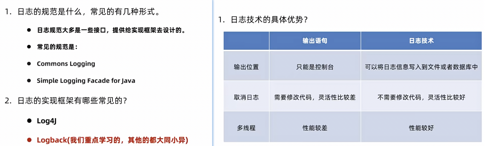
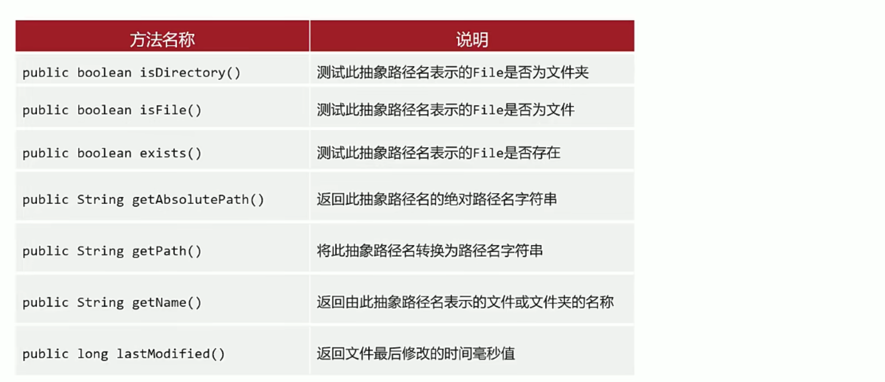
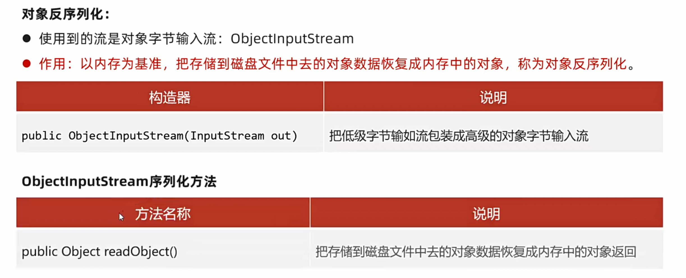
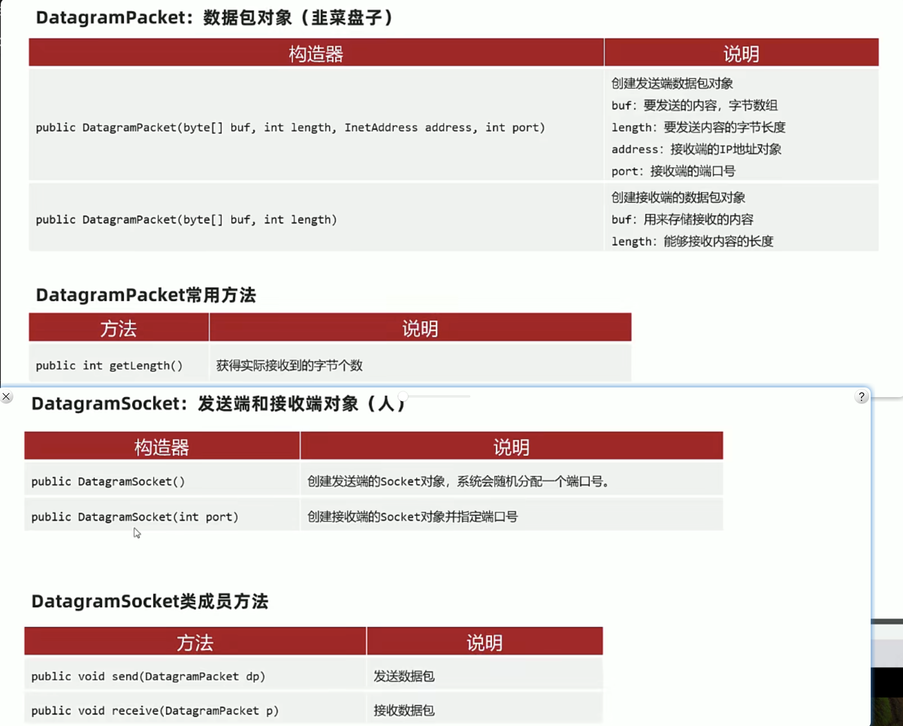

# 日志框架：

## 日志发展史：




## 了解LogBack：


案例：

电影购票系统：


项目demo路劲：java/movie-buy-app

# File ：


## File类：


demo: File.separator、绝对路径，相对路径：

## File类常用api：



demo：

```java
package com.itheima.d1_file;
import java.io.File;
import java.text.SimpleDateFormat;

/**
     目标：File类的获取功能的API
     - public String getAbsolutePath()  ：返回此File的绝对路径名字符串。
     - public String getPath()  ： 获取创建文件对象的时候用的路径
     - public String getName()  ： 返回由此File表示的文件或目录的名称。
     - public long length()  ：    返回由此File表示的文件的长度。
 */
public class FileDemo02 {
    public static void main(String[] args) {
        // 1.绝对路径创建一个文件对象
        File f1 = new File("D:/resources/xueshan.jpeg");
        // a.获取它的绝对路径。
        System.out.println(f1.getAbsolutePath());
        // b.获取文件定义的时候使用的路径。
        System.out.println(f1.getPath());
        // c.获取文件的名称：带后缀。
        System.out.println(f1.getName());
        // d.获取文件的大小：字节个数。
        System.out.println(f1.length()); // 字节大小
        // e.获取文件的最后修改时间
        long time = f1.lastModified();
        System.out.println("最后修改时间：" + new SimpleDateFormat("yyyy/MM/dd HH:mm:ss").format(time));
        // f、判断文件是文件还是文件夹
        System.out.println(f1.isFile()); // true
        System.out.println(f1.isDirectory()); // false

        System.out.println("-------------------------");

        File f2 = new File("file-io-app\\src\\data.txt");
        // a.获取它的绝对路径。
        System.out.println(f2.getAbsolutePath());
        // b.获取文件定义的时候使用的路径。
        System.out.println(f2.getPath());
        // c.获取文件的名称：带后缀。
        System.out.println(f2.getName());
        // d.获取文件的大小：字节个数。
        System.out.println(f2.length()); // 字节大小
        // e.获取文件的最后修改时间
        long time1 = f2.lastModified();
        System.out.println("最后修改时间：" + new SimpleDateFormat("yyyy/MM/dd HH:mm:ss").format(time1));
        // f、判断文件是文件还是文件夹
        System.out.println(f2.isFile()); // true
        System.out.println(f2.isDirectory()); // false
        System.out.println(f2.exists()); // true

        File file = new File("D:/");
        System.out.println(file.isFile()); // false
        System.out.println(file.isDirectory()); // true
        System.out.println(file.exists()); // true

        File file1 = new File("D:/aaa");
        System.out.println(file1.isFile()); // false
        System.out.println(file1.isDirectory()); // false
        System.out.println(file1.exists()); // false

    }
}

```

## file增删：


没有提供删除非空文件夹的目的是因为这种操作比较危险，所以需要自己实现（递归)

demo：

```java
package com.itheima.d1_file;

import java.io.File;
import java.io.IOException;

/**
     目标：File类的创建和删除的方法
     - public boolean createNewFile() ：当且仅当具有该名称的文件尚不存在时，
              创建一个新的空文件。 （几乎不用的，因为以后文件都是自动创建的！）
     - public boolean delete() ：删除由此File表示的文件或目录。 （只能删除空目录）
     - public boolean mkdir() ：创建由此File表示的目录。（只能创建一级目录）
     - public boolean mkdirs() ：可以创建多级目录（建议使用的）
 */
public class FileDemo03 {
    public static void main(String[] args) throws IOException {
        File f = new File("file-io-app\\src\\data.txt");
        // a.创建新文件，创建成功返回true ,反之 ,不需要这个，以后文件写出去的时候都会自动创建
        System.out.println(f.createNewFile());
        File f1 = new File("file-io-app\\src\\data02.txt");
        System.out.println(f1.createNewFile()); // （几乎不用的，因为以后文件都是自动创建的！）

        // b.mkdir创建一级目录
        File f2 = new File("D:/resources/aaa");
        System.out.println(f2.mkdir());

        // c.mkdirs创建多级目录(重点)
        File f3 = new File("D:/resources/ccc/ddd/eee/ffff");
//        System.out.println(f3.mkdir());
        System.out.println(f3.mkdirs()); // 支持多级创建

        // d.删除文件或者空文件夹
        System.out.println(f1.delete());
        File f4 = new File("D:/resources/xueshan.jpeg");
        System.out.println(f4.delete()); // 占用一样可以删除

        // 只能删除空文件夹,不能删除非空文件夹.
        File f5 = new File("D:/resources/aaa");
        System.out.println(f5.delete());
    }
}

```

## 遍历文件夹：


listFiles只能遍历当前文件夹对象下的一级文件对象

```java
package com.itheima.d1_file;

import java.io.File;
import java.util.Arrays;

/**

    目标：File针对目录的遍历
    - public String[] list()：
         获取当前目录下所有的"一级文件名称"到一个字符串数组中去返回。
    - public File[] listFiles()(常用)：
         获取当前目录下所有的"一级文件对象"到一个文件对象数组中去返回（重点）
 */
public class FileDemo04 {
    public static void main(String[] args) {
        // 1、定位一个目录
        File f1 = new File("D:/resources");
        String[] names = f1.list();
        for (String name : names) {
            System.out.println(name);
        }

        // 2.一级文件对象
        // 获取当前目录下所有的"一级文件对象"到一个文件对象数组中去返回（重点）

        File[] files = f1.listFiles();
        for (File f : files) {
            System.out.println(f.getAbsolutePath());
 	    // f.delete(); 会删除当前目录下非空文件夹以外所有文件夹+文件
        }

        // 注意事项
	// 当f是一个文件，那么files1是一个null
        File dir = new File("D:/resources/ddd");
        File[] files1 = dir.listFiles();
        System.out.println(Arrays.toString(files1));
    }
}

```

## 递归找文件：

```java
package com.itheima.d2_recusion;

import java.io.File;
import java.io.IOException;

/**
    目标：去D判断搜索 eDiary.exe文件
 */
public class RecursionDemo05 {
    public static void main(String[] args) {
        // 2、传入目录 和  文件名称
        searchFile(new File("D:/") , "eDiary.exe");
    }

    /**
     * 1、搜索某个目录下的全部文件，找到我们想要的文件。
     * @param dir  被搜索的源目录
     * @param fileName 被搜索的文件名称
     */
    public static void searchFile(File dir,String fileName){
        // 3、判断dir是否是目录
        if(dir != null && dir.isDirectory()){
            // 可以找了
            // 4、提取当前目录下的一级文件对象
            File[] files = dir.listFiles(); // null  []
            // 5、判断是否存在一级文件对象，存在才可以遍历
            if(files != null && files.length > 0) {
                for (File file : files) {
                    // 6、判断当前遍历的一级文件对象是文件 还是 目录
                    if(file.isFile()){
                        // 7、是不是咱们要找的，是把其路径输出即可
                        if(file.getName().contains(fileName)){
                            System.out.println("找到了：" + file.getAbsolutePath());
                            // 启动它。
                            try {
                                Runtime r = Runtime.getRuntime();
                                r.exec(file.getAbsolutePath());
                            } catch (IOException e) {
                                e.printStackTrace();
                            }
                        }
                    }else {
                        // 8、是文件夹，需要继续递归寻找
                        searchFile(file, fileName);
                    }
                }
            }
        }else {
            System.out.println("对不起，当前搜索的位置不是文件夹！");
        }
    }
}

```

在操作文件内容之前，还需要了解文件内容是如何被保存的，

## 字符集：

计算机用二进制去存储数据，那转换的规则，就是字符集，最早也是最通用的就是ASCII表，他定义了英文和阿拉伯数字的存储：


GBK的出现是为了解决中文的存储问题，它是兼容ASCII表的，但是由于只解决了中文问题，世界上还有很多语言需要兼容，位数又不够了，所以又出现了Unicode码表（Unicode码表又指的一类规范，实际执行的规范是UTF-8,UTF-16等)

ASCII ——》 1个字节代表一个字符（可以存储2的8次方 256个字符，如果首位代表正负，那也可以存储256/2=128种字符，英文大小写+数字+标点符号够用了)，一个字节又由8位二进制位存储。

GBK ——》 2个字节代表了一个字符，可以存储2的16次方的字符，也就是65536 / 2 = 32768 (除2是因为首位用来代表正负)，3万多个字符存中文够用了，但是存下世界上所有语言还是不太够，所以有了Unicode

Unicode ——》3个字节代表一个字符，可以存16777216 / 2= 8388608 个字符。


以上的说法只是一个大概，具体一个字符在一种字符集中占几位，如下：


存储和读取的方式：


字符的操作都是放在了String类上了：


demo：


占位分析：


## IO流-字节流：

因为字符在使用字符集进行存储编码的时候，可能有两位，三位字节代表一个字符，如果用字节流读取，可能存在截断造成乱码的问题，所以字符流就是用来解决字节流读取的这个问题、

字节流更加的适合音视频文件，字符流适合读取文本


这里的IO：注意一下方向，都是以当前代码为中心，从文件，网络等方式接收到该代码位置，就是input，然后从当前代码输出出去到文件，内容，网络等等，就是output了。


### FileInputStream:


demo：

```java
package com.itheima.d4_byte_stream;

import java.io.File;
import java.io.FileInputStream;
import java.io.InputStream;

/**
    目标：字节输入流的使用。

    IO流的体系：
                 字节流                                   字符流
        字节输入流            字节输出流               字符输入流        字符输出流
        InputStream          OutputStream           Reader           Writer  (抽象类)
        FileInputStream      FileOutputStream       FileReader       FileWriter(实现类，可以使用的)

    文件字节输入流：FileInputStream
        -- 作用：以内存为基准，把磁盘文件中的数据以字节的形式读取到内存中去。
                按照字节读文件数据到内存中。
        -- 构造器：
            public FileInputStream(File file):创建字节输入流管道与源文件对象接通
            public FileInputStream(String pathname)：创建字节输入流管道与源文件路径接通。
        -- 方法：
            public int read(): 每次读取一个字节返回，读取完毕返回-1。

    小结：
        一个一个字节读取中文数据输出其实是被淘汰的，性能极差！
         一个一个字节读取中文数据输出，会出现截断中文字节的情况，无法避免读取中文输出乱码的问题。

 */
public class FileInputStreamDemo01 {
    public static void main(String[] args) throws Exception {
        // 1、创建一个文件字节输入流管道与源文件接通。
        // InputStream is = new FileInputStream(new File("file-io-app\\src\\data.txt"));
        // 简化写法 FileInputStream实现了new File
        InputStream is = new FileInputStream("file-io-app\\src\\data.txt"); // 文件内容：ab3爱

        // 2、读取一个字节返回 （每次读取一滴水）
//        int b1 = is.read();
//        System.out.println((char)b1); // 如果直接打印读出来是a是97
//
//        int b2 = is.read();
//        System.out.println((char)b2);
//
//        int b3 = is.read();
//        System.out.println((char)b3);
//
//        int b4 = is.read(); // 读取完毕返回-1
//        System.out.println(b4);

        // 3、使用循环改进
        // 定义一个变量记录每次读取的字节    a  b  3   爱
        //                              o o  o   [ooo]
        int b;
        while (( b = is.read() ) != -1){
            System.out.print((char) b); // 字节流一个字节一个字节的读取，所以遇到中文，就会打印乱码
        }
    }
}

```

所以上面这种读取存在两个问题： 1、性能差，2、中文读取乱码

解决第一个问题：可以指定桶长度，一定程度缓解性能问题：

read方法指定读取长度：

```java
package com.itheima.d4_byte_stream;
import java.io.FileInputStream;
import java.io.InputStream;
/**
   目标：使用文件字节输入流每次读取一个字节数组的数据。
 */
public class FileInputStreamDemo02 {
    public static void main(String[] args) throws Exception {
        // 1、创建一个文件字节输入流管道与源文件接通
        InputStream is = new FileInputStream("file-io-app/src/data02.txt");

//        当文件内容是：ab3abccd
//        byte[] buffer = new byte[3]; // 3B 桶长 3字节
//        int len = is.read(buffer); // 每次读取出来的内容长度
//        System.out.println("读取了几个字节：" + len);
//        String rs = new String(buffer); // 解码内容，默认编码格式
//        System.out.println(rs); // 读取的第一桶内容： ab3 第二桶：abc 第三桶：cdc 【读取第二三桶需要反复执行12-17行代码】
//        第三桶异常，多了一个c是因为同一个桶，最后一桶只有2个字节，只能覆盖桶的前两位
//
//        解决办法：
//        int len2 = is.read(buffer);
//        System.out.println("读取了几个字节：" + len2);
//        // 读取多少倒出多少
//        String rs2 = new String(buffer,0 ,len2); // 指定读取的开始结束位置，读多少倒多少
//        System.out.println(rs2);
//
//        int len3 = is.read(buffer);
//        System.out.println(len3); // 读取完毕返回-1

//        改进使用循环，每次读取一个字节数组：
        byte[] buffer = new byte[3];
        int len; // 记录每次读取的字节数。
        while ((len = is.read(buffer)) != -1) {
            // 读取多少倒出多少
            System.out.print(new String(buffer, 0 , len));
        }
    }
}

```

如何解决中文乱码问题？那么我们可以尝试一次性读完文件内容，但是这种如果文件很大，是存在问题的，不过也是一个思路：

```java
package com.itheima.d4_byte_stream;
import java.io.File;
import java.io.FileInputStream;
import java.io.InputStream;

/**
   目标：使用文件字节输入流一次读完文件的全部字节。可以解决乱码问题。
 */
public class FileInputStreamDemo03 {
    public static void main(String[] args) throws Exception {
        // 1、创建一个文件字节输入流管道与源文件接通
        File f = new File("file-io-app/src/data03.txt");
        InputStream is = new FileInputStream(f);

        // 方式1、定义一个字节数组与文件的大小刚刚一样大。
//        byte[] buffer = new byte[(int) f.length()]; // 如果不转，其实已经有问题了，f.length()可能很大，所以返回的是long，结果被强转成int才能使用，说明文件太大是不行的
//        int len = is.read(buffer);
//        System.out.println("读取了多少个字节：" + len);
//        System.out.println("文件大小：" + f.length());
//        System.out.println(new String(buffer));

        // 方式2：读取全部字节数组
        byte[] buffer = is.readAllBytes();
        System.out.println(new String(buffer));

    }
}

```


### FileOutPutStream：


demo：

```java
package com.itheima.d4_byte_stream;

import java.io.File;
import java.io.FileNotFoundException;
import java.io.FileOutputStream;
import java.io.OutputStream;

/**
    目标：字节输出流的使用。

    IO流的体系：
            字节流                                   字符流
    字节输入流           字节输出流               字符输入流       字符输出流
    InputStream         OutputStream           Reader         Writer     (抽象类)
    FileInputStream     FileOutputStream       FileReader     FileWriter (实现类)

    a.FileOutputStream文件字节输出流。
        -- 作用：以内存为基准，把内存中的数据，按照字节的形式写出到磁盘文件中去。
                 简单来说，把内存数据按照字节写出到磁盘文件中去。
        -- 构造器：
            public FileOutputStream(File file):创建一个字节输出流管道通向目标文件对象。
            public FileOutputStream(String file):创建一个字节输出流管道通向目标文件路径。
            public FileOutputStream(File file , boolean append):创建一个追加数据的字节输出流管道通向目标文件对象。
            public FileOutputStream(String file , boolean append):创建一个追加数据的字节输出流管道通向目标文件路径。
        -- 方法：
           public void write(int a):写一个字节出去 。
           public void write(byte[] buffer):写一个字节数组出去。
           public void write(byte[] buffer , int pos , int len):写一个字节数组的一部分出去。
                           参数一，字节数组；参数二：起始字节索引位置，参数三：写多少个字节数出去。
    小结：
        记住。
        换行：  os.write("\r\n".getBytes()); // 换行
        追加数据管道： OutputStream os = new FileOutputStream("day10_demo/out01.txt" , true); // 追加管道！！
 */
public class OutputStreamDemo04 {
    public static void main(String[] args) throws Exception {
        // 1、创建一个文件字节输出流管道与目标文件接通
        OutputStream os = new FileOutputStream("file-io-app/src/out04.txt" , true); // 追加数据管道
//        OutputStream os = new FileOutputStream("file-io-app/src/out04.txt"); // 先清空之前的数据，写新数据进入

        // 2、写数据出去
        // a.public void write(int a):写一个字节出去
        os.write('a');
        os.write(98);
        os.write("\r\n".getBytes()); // 换行
        // os.flush(); // 写数据必须， 刷新后可以继续使用该流
        // os.write('徐'); // [ooo] 因为没有指定桶大小，所以默认一次是写一个字节，写一个中文进去（当前默认是UTF-8，等于中文是3个字节），现在只写了一个字节，文件中的内容肯定是乱码
        // 最后： 一定要关闭的原因：结束操作，因为代码在内存中，读写速度快，磁盘文件读写慢，如果不关闭，会拖慢内存的运行速度。
        // os.close(); // 关闭后该流不能再进行操作

        // 一次写入多个字节：
        // b.public void write(byte[] buffer):写一个字节数组出去。
        byte[] buffer = {'a' , 97, 98, 99};
        os.write(buffer);

        byte[] buffer2 = "我是中国人".getBytes(); // 存中文，需要把中文通过默认方式转成字节码（数组），然后再写进文件
//        byte[] buffer2 = "我是中国人".getBytes("GBK"); // 文件默认是UFF-8（当前环境决定），写的时候指定GBK，文件内容就会乱码
        os.write(buffer2);
        os.write("\r\n".getBytes()); // 同理，换行符要写入，也要先转成字节数组再写入文件

        // c. public void write(byte[] buffer , int pos , int len):写一个字节数组的一部分出去。
        byte[] buffer3 = {'a',97, 98, 99};
        os.write(buffer3, 0 , 3); // 只写前三个 aab

        // os.flush(); // 写数据必须，刷新数据 可以继续使用流
        os.close(); // 释放资源，包含了刷新的！关闭后流不可以使用了
    }
}

```

总结：


### 文件拷贝：


demo：

```java
package com.itheima.d4_byte_stream;

import java.io.FileInputStream;
import java.io.FileOutputStream;
import java.io.InputStream;
import java.io.OutputStream;

/**
 *   目标：学会使用字节流完成文件的复制（支持一切文件类型的复制）
 */
public class CopyDemo05 {
    public static void main(String[] args) {
        try {
            // 1、创建一个字节输入流管道与原视频接通
            InputStream is = new FileInputStream("file-io-app/src/out04.txt");

            // 2、创建一个字节输出流管道与目标文件接通
            OutputStream os = new FileOutputStream("file-io-app/src/out05.txt");

            // 3、定义一个字节数组转移数据
            byte[] buffer = new byte[1024];
            int len; // 记录每次读取的字节数。
            while ((len = is.read(buffer)) != -1){
                os.write(buffer, 0 , len);
            }
            System.out.println("复制完成了！");

            // 4、关闭流。
            os.close();
            is.close();
        } catch (Exception e){
            e.printStackTrace();
        }
    }
}

```

os，is可能因为代码运行到中间就报错，导致不能正常关闭，所以要依赖try/catch来完成异常兜底：

```java
package com.itheima.d5_resource;

import java.io.*;

/**
 *   目标：学会使用finally释放资源。
 */
public class TryCatchFinallyDemo1 {
    public static void main(String[] args) {
        InputStream is = null;
        OutputStream os = null;
        try {

            // System.out.println(10/ 0);

            // 1、创建一个字节输入流管道与原视频接通
             is = new FileInputStream("file-io-app/src/out04.txt");

            // 2、创建一个字节输出流管道与目标文件接通
             os = new FileOutputStream("file-io-app/src/out05.txt");

            // 3、定义一个字节数组转移数据
            byte[] buffer = new byte[1024];
            int len; // 记录每次读取的字节数。
            while ((len = is.read(buffer)) != -1){
                os.write(buffer, 0 , len);
            }
            System.out.println("复制完成了！");

         //   System.out.println( 10 / 0);

        } catch (Exception e){
            e.printStackTrace();
        } finally {
            // 无论代码是正常结束，还是出现异常都要最后执行这里
            System.out.println("========finally=========");
            try {
                // 4、关闭流。
                if(os!=null)os.close();
            } catch (IOException e) {
                e.printStackTrace();
            }
            try {
                if(is != null) is.close();
            } catch (IOException e) {
                e.printStackTrace();
            }
        }

        System.out.println(test(10, 2));
    }

    public static int test(int a , int b){
        try {
            int c = a / b;
            return c;
        }catch (Exception e){
            e.printStackTrace();
            return -111111; // 计算出现bug.
        }finally {
            System.out.println("--finally--");
            // 哪怕上面有return语句执行，也必须先执行完这里才可以！
            // 开发中不建议在这里加return ，如果加了，返回的永远是这里的数据了，这样会出问题！
            return 100;
        }
    }
}

```

这里一定要注意finally中的代码，及时catch中return了，如果finally中再写一次return，最终return出去的肯定是finally中的代码

结合try/catch，JDK7和JDK9分别给出了方案：


JDK7:demo

```java
package com.itheima.d5_resource;

import java.io.*;

/**
 *   目标：学会使用JDK 7的新方式释放资源
 */
public class TryCatchResouceDemo2 {
    public static void main(String[] args) {

        try (
                // 这里面只能放置资源对象，用完会自动关闭：自动调用资源对象的close方法关闭资源（即使出现异常也会做关闭操作）
                // 1、创建一个字节输入流管道与原视频接通
               InputStream is = new FileInputStream("file-io-app/src/out04.txt");
                // 2、创建一个字节输出流管道与目标文件接通
               OutputStream os = new FileOutputStream("file-io-app/src/out05.txt");

               // int age = 23; // 这里只能放资源
                MyConnection connection = new MyConnection(); // 最终会自动调用资源的close方法
                ) {

            // 3、定义一个字节数组转移数据
            byte[] buffer = new byte[1024];
            int len; // 记录每次读取的字节数。
            while ((len = is.read(buffer)) != -1){
                os.write(buffer, 0 , len);
            }
            System.out.println("复制完成了！");

        } catch (Exception e){
            e.printStackTrace();
        }

    }
}

class MyConnection implements AutoCloseable{
    @Override
    public void close() throws IOException {
        System.out.println("连接资源被成功释放了！");
    }
}
```

JSK9:demo

```java
package com.itheima.d5_resource;

import java.io.*;

/**
 *   目标：JDK 9释放资源的方式：可以了解下。
 */
public class TryCatchResouceDemo3 {
    public static void main(String[] args) throws Exception {

        // 这里面只能放置资源对象，用完会自动关闭：自动调用资源对象的close方法关闭资源（即使出现异常也会做关闭操作）
        // 1、创建一个字节输入流管道与原视频接通
        InputStream is = new FileInputStream("file-io-app/src/out04.txt");
        // 2、创建一个字节输出流管道与目标文件接通
        OutputStream os = new FileOutputStream("file-io-app/src/out05.txt");
        try ( is ; os ) {
            // 3、定义一个字节数组转移数据
            byte[] buffer = new byte[1024];
            int len; // 记录每次读取的字节数。
            while ((len = is.read(buffer)) != -1){
                os.write(buffer, 0 , len);
            }
            System.out.println("复制完成了！");

        } catch (Exception e){
            e.printStackTrace();
        }
    }
}

```

## IO流-字符流：

### FileReader：


FileReader读取一个字符：

```java
package com.itheima.d6_char_stream;

import java.io.File;
import java.io.FileReader;
import java.io.Reader;

/**
     目标：字符输入流的使用。

     IO流的体系：
            字节流                                   字符流
     字节输入流           字节输出流               字符输入流       字符输出流
     InputStream         OutputStream            Reader         Writer     (抽象类)
     FileInputStream     FileOutputStream        FileReader     FileWriter (实现类)

     c.FileReader:文件字符输入流。
         -- 作用：以内存为基准，把磁盘文件的数据以字符的形式读入到内存。
            简单来说，读取文本文件内容到内存中去。

         -- 构造器：
            public FileReader(File file):创建一个字符输入流与源文件对象接通。
            public FileReader(String filePath):创建一个字符输入流与源文件路径接通。

         -- 方法：
            public int read(): 读取一个字符的编号返回！ 读取完毕返回-1
            public int read(char[] buffer):读取一个字符数组，读取多少个字符就返回多少个数量，读取完毕返回-1
     小结：
        字符流一个一个字符的读取文本内容输出，可以解决中文读取输出乱码的问题。
        字符流很适合操作文本文件内容。
        但是：一个一个字符的读取文本内容性能较差！！
 */
public class FileReaderDemo01 {
    public static void main(String[] args) throws Exception {
        // 目标：每次读取一个字符。
        // 1、创建一个字符输入流管道与源文件接通
        Reader fr = new FileReader("file-io-app\\src\\data06.txt");

        // 2、读取一个字符返回，没有可读的字符了返回-1
//        int code = fr.read();
//        System.out.print((char)code);
//
//        int code1 = fr.read();
//        System.out.print((char)code1);

        // 3、使用循环读取字符
        int code;
        while ((code = fr.read()) != -1){
            System.out.print((char) code);
        }
    }
}

```

一次多去多个字符：

```java
package com.itheima.d6_char_stream;

import java.io.FileReader;
import java.io.Reader;

/**
     目标：字符输入流的使用-按照字符数组读取。

     IO流的体系：
            字节流                                       字符流
     字节输入流           字节输出流               字符输入流       字符输出流
     InputStream         OutputStream           Reader         Writer     (抽象类)
     FileInputStream     FileOutputStream       FileReader     FileWriter (实现类)

     c.FileReader:文件字符输入流。
         -- 作用：以内存为基准，把磁盘文件的数据以字符的形式读入到内存。
            简单来说，读取文本文件内容到内存中去。
         -- 构造器：
            public FileReader(File file):创建一个字符输入流与源文件对象接通。
            public FileReader(String filePath):创建一个字符输入流与源文件路径接通。
         -- 方法：
            public int read(): 读取一个字符的编号返回！ 读取完毕返回-1
            public int read(char[] buffer):读取一个字符数组，
                    读取多少个字符就返回多少个数量，读取完毕返回-1
     小结：
         字符流按照字符数组循环读取数据，可以解决中文读取输出乱码的问题，而且性能也较好！！
 */
public class FileReaderDemo02 {
    public static void main(String[] args) throws Exception {
        // 1、创建一个文件字符输入流与源文件接通
        Reader fr = new FileReader("file-io-app/src/data07.txt");

        // 2、用循环，每次读取一个字符数组的数据。  1024 + 1024 + 8
        char[] buffer = new char[1024]; // 每次读取的桶大小 1K字符 1KB
        int len;
        while ((len = fr.read(buffer)) != -1) {
            String rs = new String(buffer, 0, len);
            System.out.print(rs);
        }

    }
}

```


### FileWriter：


demo:

```java
package com.itheima.d6_char_stream;

import java.io.File;
import java.io.FileWriter;
import java.io.Writer;

/**
     目标：字符输出流的使用。

     IO流的体系：
            字节流                                   字符流
     字节输入流           字节输出流               字符输入流       字符输出流
     InputStream         OutputStream           Reader         Writer     (抽象类)
     FileInputStream     FileOutputStream       FileReader     FileWriter (实现类)

     d.FileWriter文件字符输出流的使用。
        -- 作用：以内存为基准，把内存中的数据按照字符的形式写出到磁盘文件中去。
            简单来说，就是把内存的数据以字符写出到文件中去。
        -- 构造器：
           public FileWriter(File file):创建一个字符输出流管道通向目标文件对象。
           public FileWriter(String filePath):创建一个字符输出流管道通向目标文件路径。
           public FileWriter(File file,boolean append):创建一个追加数据的字符输出流管道通向目标文件对象。
           public FileWriter(String filePath,boolean append):创建一个追加数据的字符输出流管道通向目标文件路径。
        -- 方法：
             a.public void write(int c):写一个字符出去
             b.public void write(String c)写一个字符串出去：
             c.public void write(char[] buffer):写一个字符数组出去
             d.public void write(String c ,int pos ,int len):写字符串的一部分出去
             e.public void write(char[] buffer ,int pos ,int len):写字符数组的一部分出去
     小结：
        字符输出流可以写字符数据出去，总共有5个方法写字符。
        覆盖管道：
             Writer fw = new FileWriter("Day10Demo/src/dlei03.txt"); // 覆盖数据管道
        追加数据管道：
             Writer fw = new FileWriter("Day10Demo/src/dlei03.txt",true); // 追加数据管道
        换行：
             fw.write("\r\n"); // 换行
        结论：读写字符文件数据建议使用字符流。复制文件建议使用字节流。
 */
public class FileWriterDemo03 {
    public static void main(String[] args) throws Exception {
        // 1、创建一个字符输出流管道与目标文件接通
        // Writer fw = new FileWriter("file-io-app/src/out08.txt"); // 覆盖管道，每次启动都会清空文件之前的数据
        Writer fw = new FileWriter("file-io-app/src/out08.txt", true); // 追加

//      a.public void write(int c):写一个字符出去
        fw.write(98);
        fw.write('a');
        fw.write('徐'); // 不会出问题了
        fw.write("\r\n"); // 换行

//       b.public void write(String c)写一个字符串出去
        fw.write("abc我是中国人"); // 字符串
        fw.write("\r\n"); // 换行


//       c.public void write(char[] buffer):写一个字符数组出去
        char[] chars = "abc我是中国人".toCharArray(); // 字符数组，画蛇添足
        fw.write(chars);
        fw.write("\r\n"); // 换行


//       d.public void write(String c ,int pos ,int len):写字符串的一部分出去
        // 字符写入： abc：3个， abc我是： 5个，如果是字符（UTF-8）：abc我是：9个
        fw.write("abc我是中国人", 0, 5);
        fw.write("\r\n"); // 换行


//       e.public void write(char[] buffer ,int pos ,int len):写字符数组的一部分出去
        fw.write(chars, 3, 5); // 我是中国人
        fw.write("\r\n"); // 换行


        // fw.flush();// 刷新后流可以继续使用
        fw.close(); // 关闭包含刷线，关闭后流不能使用

    }
}

```

## IO流-缓冲流：


缓存流快的原因：


缓冲流在字节流和字符流中都有自己的api：


#### 缓冲流-字节流：


demo： 改造之前的拷贝文件：

```java
package com.itheima.d1_byte_buffer;

import java.io.*;

/**
    目标：使用字节缓冲流完成数据的读写操作。
 */
public class ByteBufferDemo {
    public static void main(String[] args) {

        try (
                // 这里面只能放置资源对象，用完会自动关闭：自动调用资源对象的close方法关闭资源（即使出现异常也会做关闭操作）
                // 1、创建一个字节输入流管道与原视频接通
                InputStream is = new FileInputStream("D:\\resources\\newmeinv.jpeg");
                // a.把原始的字节输入流包装成高级的缓冲字节输入流
                InputStream bis = new BufferedInputStream(is);
                // 2、创建一个字节输出流管道与目标文件接通
                OutputStream os = new FileOutputStream("D:\\resources\\newmeinv222.jpeg");
                // b.把字节输出流管道包装成高级的缓冲字节输出流管道
                OutputStream bos = new BufferedOutputStream(os);

        ) {

            // 3、定义一个字节数组转移数据
            byte[] buffer = new byte[1024];
            int len; // 记录每次读取的字节数。
            while ((len = bis.read(buffer)) != -1){
                bos.write(buffer, 0 , len);
            }
            System.out.println("复制完成了！");

        } catch (Exception e){
            e.printStackTrace();
        }

    }
}

```

可见功能没啥变化，就是多new了一个用于缓冲的对象，然后把原始的对象换成缓冲对象就行。

关于*inputstream相关的api，我们可以做如下的一个测试：

```
（1）使用低级的字节流按照一个一个字节的形式复制文件。
（2）使用低级的字节流按照一个一个字节数组的形式复制文件。
（3）使用高级的缓冲字节流按照一个一个字节的形式复制文件。
（4）使用高级的缓冲字节流按照一个一个字节数组的形式复制文件。
```

最终得出一个结论：

```
（1）使用低级的字节流按照一个一个字节的形式复制文件：慢的让人简直无法忍受。直接被淘汰。
（2）使用低级的字节流按照一个一个字节数组的形式复制文件: 比较慢，但是还是可以忍受的！
（3）缓冲流一个一个字节复制：很慢，不建议使用。
（4）缓冲流一个一个字节数组复制：飞快，简直太完美了（推荐使用）
```

demo:

```java
package com.itheima.d2_byte_buffer_time;

import java.io.*;

/**
    目标：利用字节流的复制统计各种写法形式下缓冲流的性能执行情况。

    复制流：
        （1）使用低级的字节流按照一个一个字节的形式复制文件。
        （2）使用低级的字节流按照一个一个字节数组的形式复制文件。
        （3）使用高级的缓冲字节流按照一个一个字节的形式复制文件。
        （4）使用高级的缓冲字节流按照一个一个字节数组的形式复制文件。

    源文件：C:\course\3-视频\18、IO流-文件字节输出流FileOutputStream写字节数据出去.avi
    目标文件：C:\course\

    小结：
        使用高级的缓冲字节流按照一个一个字节数组的形式复制文件，性能好，建议开发使用！
 */
public class ByteBufferTimeDemo {
    private static final String SRC_FILE = "D:\\course\\基础加强\\day08-日志框架、阶段项目\\视频\\14、用户购票功能.avi";
    private static final String DEST_FILE = "D:\\course\\";

    public static void main(String[] args) {
        // copy01(); // 使用低级的字节流按照一个一个字节的形式复制文件：慢的让人简直无法忍受。直接被淘汰。
        copy02(); // 使用低级的字节流按照一个一个字节数组的形式复制文件: 比较慢，但是还是可以忍受的！
        // copy03(); // 缓冲流一个一个字节复制：很慢，不建议使用。
        copy04(); // 缓冲流一个一个字节数组复制：飞快，简直太完美了（推荐使用）
    }

    private static void copy04() {
        long startTime = System.currentTimeMillis();
        try (
                // 1、创建低级的字节输入流与源文件接通
                InputStream is = new FileInputStream(SRC_FILE);
                // a.把原始的字节输入流包装成高级的缓冲字节输入流
                InputStream bis = new BufferedInputStream(is);
                // 2、创建低级的字节输出流与目标文件接通
                OutputStream os = new FileOutputStream(DEST_FILE + "video4.avi");
                // b.把字节输出流管道包装成高级的缓冲字节输出流管道
                OutputStream bos = new BufferedOutputStream(os);
        ) {

            // 3、定义一个字节数组转移数据
            byte[] buffer = new byte[1024];
            int len; // 记录每次读取的字节数。
            while ((len = bis.read(buffer)) != -1){
                bos.write(buffer, 0 , len);
            }

        } catch (Exception e){
            e.printStackTrace();
        }
        long endTime = System.currentTimeMillis();
        System.out.println("使用缓冲的字节流按照一个一个字节数组的形式复制文件耗时：" + (endTime - startTime)/1000.0 + "s");
    }


    private static void copy03() {
        long startTime = System.currentTimeMillis();
        try (
                // 1、创建低级的字节输入流与源文件接通
                InputStream is = new FileInputStream(SRC_FILE);
                // a.把原始的字节输入流包装成高级的缓冲字节输入流
                InputStream bis = new BufferedInputStream(is);
                // 2、创建低级的字节输出流与目标文件接通
                OutputStream os = new FileOutputStream(DEST_FILE + "video3.avi");
                // b.把字节输出流管道包装成高级的缓冲字节输出流管道
                OutputStream bos = new BufferedOutputStream(os);
        ){

            // 3、定义一个变量记录每次读取的字节（一个一个字节的复制）
            int b;
            while ((b = bis.read()) != -1){
                bos.write(b);
            }
        }catch (Exception e){
            e.printStackTrace();
        }
        long endTime = System.currentTimeMillis();
        System.out.println("使用缓冲的字节流按照一个一个字节的形式复制文件耗时：" + (endTime - startTime)/1000.0 + "s");
    }


    private static void copy02() {
        long startTime = System.currentTimeMillis();
        try (
                // 这里面只能放置资源对象，用完会自动关闭：自动调用资源对象的close方法关闭资源（即使出现异常也会做关闭操作）
                // 1、创建一个字节输入流管道与原视频接通
                InputStream is = new FileInputStream(SRC_FILE);
                // 2、创建一个字节输出流管道与目标文件接通
                OutputStream os = new FileOutputStream(DEST_FILE + "video2.avi")
        ) {

            // 3、定义一个字节数组转移数据
            byte[] buffer = new byte[1024];
            int len; // 记录每次读取的字节数。
            while ((len = is.read(buffer)) != -1){
                os.write(buffer, 0 , len);
            }
        } catch (Exception e){
            e.printStackTrace();
        }
        long endTime = System.currentTimeMillis();
        System.out.println("使用低级的字节流按照一个一个字节数组的形式复制文件耗时：" + (endTime - startTime)/1000.0 + "s");
    }

    /**
      使用低级的字节流按照一个一个字节的形式复制文件
     */
    private static void copy01() {
        long startTime = System.currentTimeMillis();
        try (
                // 1、创建低级的字节输入流与源文件接通
                InputStream is = new FileInputStream(SRC_FILE);
                // 2、创建低级的字节输出流与目标文件接通
                OutputStream os = new FileOutputStream(DEST_FILE + "video1.avi")
                ){

            // 3、定义一个变量记录每次读取的字节（一个一个字节的复制）
            int b;
            while ((b = is.read()) != -1){
                os.write(b);
            }
        }catch (Exception e){
            e.printStackTrace();
        }
        long endTime = System.currentTimeMillis();
        System.out.println("使用低级的字节流按照一个一个字节的形式复制文件耗时：" + (endTime - startTime)/1000.0 + "s");
    }

}

```

#### 缓冲流-字符流：

read和writer默认是8k的缓冲

##### BufferReader:


demo: readLine在做一些内容分析的时候还是很好用的api

```java
package com.itheima.d3_char_buffer;

import java.io.BufferedReader;
import java.io.FileReader;
import java.io.IOException;
import java.io.Reader;

/**
    目标：学会使用缓冲字符输入流提高字符输入流的性能，新增了按照行读取的方法(经典代码)
 */
public class BufferedReaderDemo1 {
    public static void main(String[] args) {
        try (
                // 1、创建一个文件字符输入流与源文件接通。
                Reader fr = new FileReader("io-app2/src/data01.txt");
                // a、把低级的字符输入流包装成高级的缓冲字符输入流。
                BufferedReader br = new BufferedReader(fr);
                ){

            // 2、用循环，每次读取一个字符数组的数据。  1024 + 1024 + 8
//            char[] buffer = new char[1024]; // 1K字符
//            int len;
//            while ((len = br.read(buffer)) != -1) {
//                String rs = new String(buffer, 0, len);
//                System.out.print(rs);
//            }

              String line;
              while ((line = br.readLine()) != null){
                  System.out.println(line);
              }
        } catch (IOException e) {
            e.printStackTrace();
        }
    }
}

```

##### BufferWriter:


demo:

```java
package com.itheima.d3_char_buffer;

import java.io.BufferedWriter;
import java.io.FileWriter;
import java.io.Writer;

/**
     目标：缓冲字符输出流的使用，学会它多出来的一个功能：newLine();
 */
public class BufferedWriterDemo2 {
    public static void main(String[] args) throws Exception {
        // 1、创建一个字符输出流管道与目标文件接通
        Writer fw = new FileWriter("io-app2/src/out02.txt"); // 覆盖管道，每次启动都会清空文件之前的数据
       //Writer fw = new FileWriter("io-app2/src/out02.txt", true); // 追加数据
        BufferedWriter bw = new BufferedWriter(fw);

//      a.public void write(int c):写一个字符出去
        bw.write(98);
        bw.write('a');
        bw.write('徐'); // 不会出问题了
        bw.newLine(); // bw.write("\r\n"); // 换行

//       b.public void write(String c)写一个字符串出去
        bw.write("abc我是中国人");
        bw.newLine(); // bw.write("\r\n"); // 换行


//       c.public void write(char[] buffer):写一个字符数组出去
        char[] chars = "abc我是中国人".toCharArray();
        bw.write(chars);
        bw.newLine(); // bw.write("\r\n"); // 换行


//       d.public void write(String c ,int pos ,int len):写字符串的一部分出去
        bw.write("abc我是中国人", 0, 5);
        bw.newLine(); // bw.write("\r\n"); // 换行

//       e.public void write(char[] buffer ,int pos ,int len):写字符数组的一部分出去
        bw.write(chars, 3, 5);
        bw.newLine(); // bw.write("\r\n"); // 换行


        // fw.flush();// 刷新后流可以继续使用
        bw.close(); // 关闭包含刷线，关闭后流不能使用

    }
}

```

## IO流-转换流：


### 输入转换流：

当对方文件（资源)因为各种原因只能保留原来的编码方式，我们就只能按照对应的编码方式去读取，这个时候就用到了转换流


demo：

```java
package com.itheima.d4_transfer_stream;

import java.io.*;

/**
     目标：字符输入转换流InputStreamReader的使用。

             字节流                                     字符流
     字节输入流               字节输出流              字符输入流            字符输出流
     InputStream             OutputStream          Reader               Writer   (抽象类)
     FileInputStream         FileOutputStream      FileReader           FileWriter(实现类)
     BufferedInputStream     BufferedOutputStream  BufferedReader       BufferedWriter(实现类，缓冲流)
                                                   InputStreamReader    OutputStreamWriter
     字符输入转换流InputStreamReader:
          -- 作用：可以解决字符流读取不同编码乱码的问题。
                  也可以把原始的字节流按照指定编码转换成字符输入流

          -- 构造器：
                public InputStreamReader(InputStream is)：可以使用当前代码默认编码转换成字符流，几乎不用！
                public InputStreamReader(InputStream is,String charset):可以指定编码把字节流转换成字符流(核心)

     小结：
        字符输入转换流InputStreamReader:作用：可以解决字符流读取不同编码乱码的问题。
        public InputStreamReader(InputStream is,String charset):可以指定编码把字节流转换成字符流(核心)
 */
public class InputStreamReaderDemo01 {
    public static void main(String[] args) throws Exception {
        // 代码UTF-8   文件 GBK  "D:\\resources\\data.txt"
        // 1、提取GBK文件的原始字节流。   abc 我
        //                            ooo oo
        InputStream is = new FileInputStream("D:\\resources\\data.txt");
        // 2、把原始字节流转换成字符输入流
        // Reader isr = new InputStreamReader(is); // 默认以UTF-8的方式转换成字符流。 还是会乱码的  跟直接使用FileReader是一样的
        Reader isr = new InputStreamReader(is , "GBK"); // 以指定的GBK编码转换成字符输入流  完美的解决了乱码问题

        BufferedReader br = new BufferedReader(isr);
        String line;
        while ((line = br.readLine()) != null){
            System.out.println(line);
        }
    }
}

```

### 输出转换流：

同样的道理（场景)，比如对方可能只能按照对应的编码方式去接收文件


demo：

```java
package com.itheima.d4_transfer_stream;

import java.io.*;
import java.nio.Buffer;

/**
     目标：字符输出转换OutputStreamWriter流的使用。

                字节流                                         字符流
     字节输入流               字节输出流              字符输入流            字符输出流
     InputStream             OutputStream          Reader               Writer   (抽象类)
     FileInputStream         FileOutputStream      FileReader           FileWriter(实现类)
     BufferedInputStream     BufferedOutputStream  BufferedReader       BufferedWriter(实现类，缓冲流)
                                                   InputStreamReader    OutputStreamWriter

     字符输出转换流：OutputStreamWriter
           -- 作用：可以指定编码把字节输出流转换成字符输出流。
                   可以指定写出去的字符的编码。
           -- 构造器：
                public OutputStreamWriter(OutputStream os) :   用当前默认编码UTF-8把字节输出流转换成字符输出流
                public OutputStreamWriter(OutputStream os , String charset):指定编码把字节输出流转换成字符输出流
     小结：
        字符输出转换流OutputStreamWriter可以指定编码把字节输出流转换成字符输出流。
        从而实现指定写出去的字符编码！
 */
public class OutputStreamWriterDemo02 {
    public static void main(String[] args) throws Exception {
        // 1、定义一个字节输出流
        OutputStream os = new FileOutputStream("io-app2/src/out03.txt");

        // 2、把原始的字节输出流转换成字符输出流
        // Writer osw = new OutputStreamWriter(os); // 以默认的UTF-8写字符出去 跟直接写FileWriter一样
        Writer osw = new OutputStreamWriter(os , "GBK"); // 指定GBK的方式写字符出去

        // 3、把低级的字符输出流包装成高级的缓冲字符输出流。
        BufferedWriter bw = new BufferedWriter(osw);

        bw.write("我爱中国1~~");
        bw.write("我爱中国2~~");
        bw.write("我爱中国3~~");

        bw.close();
    }
}

```

在数据往硬盘中存储的时候，除了字符以外，还会涉及到代码中对象的存储，希望对象进行存储，就涉及到序列化和反序列化的问题。

## 序列化：


对象实现序列化，需要有两步操作：1、对象要实现Serializable接口，2、通过

ObjectOutputStream实现对对象的序列化：

demo：

被序列化的对象Student：

```java
package com.itheima.d5_serializable;

import java.io.Serializable;

/**
  对象如果要序列化，必须实现Serializable序列化接口。
 */
public class Student implements Serializable {
    // 申明序列化的版本号码
    // 序列化的版本号与反序列化的版本号必须一致才不会出错！
    private static final long serialVersionUID = 1;
    private String name;
    private String loginName;
    // transient修饰的成员变量不参与序列化了
    private transient String passWord;
    private int age ;

    public Student(){
    }

    public Student(String name, String loginName, String passWord, int age) {
        this.name = name;
        this.loginName = loginName;
        this.passWord = passWord;
        this.age = age;
    }

    public String getName() {
        return name;
    }

    public void setName(String name) {
        this.name = name;
    }

    public String getLoginName() {
        return loginName;
    }

    public void setLoginName(String loginName) {
        this.loginName = loginName;
    }

    public String getPassWord() {
        return passWord;
    }

    public void setPassWord(String passWord) {
        this.passWord = passWord;
    }

    public int getAge() {
        return age;
    }

    public void setAge(int age) {
        this.age = age;
    }

    @Override
    public String toString() {
        return "Student{" +
                "name='" + name + '\'' +
                ", loginName='" + loginName + '\'' +
                ", passWord='" + passWord + '\'' +
                ", age=" + age +
                '}';
    }
}

```

序列化：

```java
package com.itheima.d5_serializable;
import java.io.FileOutputStream;
import java.io.ObjectOutputStream;
import java.io.PrintStream;

/**
     目标：学会对象序列化，使用 ObjectOutputStream 把内存中的对象存入到磁盘文件中。

     transient修饰的成员变量不参与序列化了
     对象如果要序列化，必须实现Serializable序列化接口。

     申明序列化的版本号码
     序列化的版本号与反序列化的版本号必须一致才不会出错！
     private static final long serialVersionUID = 1;
 */
public class ObjectOutputStreamDemo1 {
    public static void main(String[] args) throws Exception {
        // 1、创建学生对象
        Student s = new Student("陈磊", "chenlei","1314520", 21);

        // 2、对象序列化：使用对象字节输出流包装字节输出流管道
        ObjectOutputStream oos = new ObjectOutputStream(new FileOutputStream("io-app2/src/obj.txt"));

        // 3、直接调用序列化方法
        oos.writeObject(s);

        // 4、释放资源
        oos.close();
        System.out.println("序列化完成了~~");

    }
}

```

## 反序列化：




demo：

使用上面通过Student序列化生成的文件

文件内容：io-app2/src/obj.txt：

```
��sr#com.itheima.d5_serializable.StudentIageL	loginNametLjava/lang/String;Lnameq~xptchenleit陈磊
```

再进行反序列化：

```java
package com.itheima.d5_serializable;

import java.io.FileInputStream;
import java.io.FileNotFoundException;
import java.io.ObjectInputStream;

/**
    目标：学会进行对象反序列化：使用对象字节输入流把文件中的对象数据恢复成内存中的Java对象。
 */
public class ObjectInputStreamDemo2 {
    public static void main(String[] args) throws Exception {
        // 1、创建对象字节输入流管道包装低级的字节输入流管道
        ObjectInputStream is = new ObjectInputStream(new FileInputStream("io-app2/src/obj.txt"));

        // 2、调用对象字节输入流的反序列化方法
        Student s = (Student) is.readObject();

        System.out.println(s);
    }
}

```

序列化和反序列化过程中，需要注意的两个点：

1、比如某个对象依赖了密码信息，密码是不能被序列化保存的，不然存在泄密问题，这个时候不希望保存value的字段，可以通过：transient 去修饰，他的value就不会被序列化保存，如上Student的passWord字段：

```java
 // transient修饰的成员变量不参与序列化了
    private transient String passWord;
```

2、当我们序列化保存了某个对象，但是可能这个类进行了内容更新，我们如何这个时候拿着旧的数据，新的类去反序列化就会出错，为了保证序列化内容和类（模版)保持一致，有一个保留字段这么定义：

```java
   // 申明序列化的版本号码
    // 序列化的版本号与反序列化的版本号必须一致才不会出错！
    private static final long serialVersionUID = 1;
```

当更新了类的内容，我们就更新下serialVersionUID，这样就能确保类是否和已经序列化的内容保证一致，如果不一致，就需要先序列化更新被序列化保存的内容。

## properties：了解

存：

```java
package com.itheima.d7_properties;

import java.io.FileWriter;
import java.util.Map;
import java.util.Properties;
import java.util.Scanner;

/**
    目标：Properties的概述和使用(框架底层使用，了解这个技术即可)（保存数据到属性文件）

    Properties: 属性集对象。
         其实就是一个Map集合。也就是一个键值对集合，但是我们一般不会当集合使用，
         因为有HashMap。

    Properties核心作用：
         Properties代表的是一个属性文件，可以把键值对的数据存入到一个属性文件中去。
         属性文件：后缀是.properties结尾的文件,里面的内容都是 key=value。

    大家在后期学的很多大型框架技术中，属性文件都是很重要的系统配置文件。
        users.properties
                admin=123456
                dlei=dlei

     需求：使用Properties对象生成一个属性文件，里面存入用户名和密码信息。

     Properties的方法：
         -- public Object setProperty(String key, String value) ： 保存一对属性。  (put)
         -- public String getProperty(String key) : 使用此属性列表中指定的键搜索属性值 (get)
         -- public Set<String> stringPropertyNames() : 所有键的名称的集合  (keySet())
         -- public void store(OutputStream out, String comments): 保存数据到属性文件中去
         -- public void store(Writer fw, String comments): 保存数据到属性文件中去

     小结：
            Properties可以保存键值对数据到属性文件

 */
public class PropertiesDemo01 {
    public static void main(String[] args) throws Exception {
        // 需求：使用Properties把键值对信息存入到属性文件中去。
        Properties properties = new Properties();
        properties.setProperty("admin", "123456");
        properties.setProperty("dlei", "003197");
        properties.setProperty("heima", "itcast");
        System.out.println(properties);

        /**
           参数一：保存管道 字符输出流管道
           参数二：保存心得
         */
        properties.store(new FileWriter("io-app2/src/users.properties")
                , "this is users!! i am very happy! give me 100!");

    }
}


```

取：

```java
package com.itheima.d7_properties;

import java.io.FileReader;
import java.util.Properties;
import java.util.Set;

/**
    目标：Properties读取属性文件中的键值对信息。（读取）
    Properties的方法：
        -- public Object setProperty(String key, String value) ： 保存一对属性。
        -- public String getProperty(String key) ：使用此属性列表中指定的键搜索属性值
        -- public Set<String> stringPropertyNames() ：所有键的名称的集合
        -- public void store(OutputStream out, String comments):保存数据到属性文件中去
        -- public synchronized void load(InputStream inStream):加载属性文件的数据到属性集对象中去
        -- public synchronized void load(Reader fr):加载属性文件的数据到属性集对象中去
    小结：
        属性集对象可以加载读取属性文件中的数据!!
 */
public class PropertiesDemo02 {
    public static void main(String[] args) throws Exception {
        // 需求：Properties读取属性文件中的键值对信息。（读取）
        Properties properties = new Properties();
        System.out.println(properties);

        // 加载属性文件中的键值对数据到属性对象properties中去
        properties.load(new FileReader("io-app2/src/users.properties"));

        System.out.println(properties);
        String rs = properties.getProperty("dlei");
        System.out.println(rs);
        String rs1 = properties.getProperty("admin");
        System.out.println(rs1);
    }
}


```

# 多线程：


多线程的实现方案：（这些方案应该是基础方案里面常见方案，以后应该会有更高级的实现)

1、继承Thread类

2、实现Runnable接口

3、JSK5新增 实现Callable接口

## 实现方案：

### 1、继承Thread类：

demo:

```java
package com.itheima.d1_create;

/**
   目标：多线程的创建方式一：继承Thread类实现。
 */
public class ThreadDemo1 {
    public static void main(String[] args) {
        // 3、new一个新线程对象
        Thread t = new MyThread();
        // 4、调用start方法启动线程（执行的还是run方法）
        t.start();
//        注意主线程的逻辑要放到子线程创建之后，如果下面的for循环放到了子线程创建之前，就变成了先执行完下面的for循环，再去创建线程，就没有多线程的意义了
        for (int i = 0; i < 5; i++) {
            System.out.println("主线程执行输出：" + i);
        }

    }
}

/**
   1、定义一个线程类继承Thread类
 */
class MyThread extends Thread{
    /**
       2、重写run方法，里面是定义线程以后要干啥
     */
    @Override
    public void run() {
        for (int i = 0; i < 5; i++) {
            System.out.println("子线程执行输出：" + i);
        }
    }
}
```


所以这个写法有两个不太好的点：1、不能再继承别的类，2、拿不到别的线程返回结果

### 2、实现Runnable接口


demo:

```java
package com.itheima.d1_create;

/**
   目标：学会线程的创建方式二，理解它的优缺点。
 */
public class ThreadDemo2 {
    public static void main(String[] args) {
        // 3、创建一个任务对象
        Runnable target = new MyRunnable();
        // 4、把任务对象交给Thread处理
        Thread t = new Thread(target);
        // Thread t = new Thread(target, "1号");
        // 5、启动线程
        t.start();

        for (int i = 0; i < 10; i++) {
            System.out.println("主线程执行输出：" + i);
        }
    }
}

/**
   1、定义一个线程任务类 实现Runnable接口
 */
class MyRunnable  implements Runnable {
    /**
       2、重写run方法，定义线程的执行任务的
     */
    @Override
    public void run() {
        for (int i = 0; i < 10; i++) {
            System.out.println("子线程执行输出：" + i);
        }
    }
}

```


对于这种写法，就剩一个不好的点：不能拿到别的线程的返回结果

对于接口的实现，我们可以通过匿名内部类去简化代码：

```java
package com.itheima.d1_create;

/**
   目标：学会线程的创建方式二(匿名内部类方式实现，语法形式)
 */
public class ThreadDemo2Other {
    public static void main(String[] args) {
//        方式1：
        Runnable target = new Runnable() {
            @Override
            public void run() {
                for (int i = 0; i < 10; i++) {
                    System.out.println("子线程1执行输出：" + i);
                }
            }
        };
        Thread t = new Thread(target);
        t.start();
//      方式2：
        new Thread(new Runnable() {
            @Override
            public void run() {
                for (int i = 0; i < 10; i++) {
                    System.out.println("子线程2执行输出：" + i);
                }
            }
        }).start();
//      方式3：
        new Thread(() -> {
                for (int i = 0; i < 10; i++) {
                    System.out.println("子线程3执行输出：" + i);
            }
        }).start();

        for (int i = 0; i < 10; i++) {
            System.out.println("主线程执行输出：" + i);
        }
    }
}


```

### 3、JSK5新增 实现Callable接口

特点：

1、该写法的主要作用就是可以得到线程执行的返回结果

2、注意这个Callable是一个泛型接口

```java
package com.itheima.d1_create;

import java.util.concurrent.Callable;
import java.util.concurrent.ExecutionException;
import java.util.concurrent.FutureTask;

/**
   目标：学会线程的创建方式三：实现Callable接口，结合FutureTask完成。
 */
public class ThreadDemo3 {
    public static void main(String[] args) {
        // 3、创建Callable任务对象
        Callable<String> call = new MyCallable(100);
        // 4、把Callable任务对象 交给 FutureTask 对象
        //  FutureTask对象的作用1： 是Runnable的对象（实现了Runnable接口），可以交给Thread了
        //  FutureTask对象的作用2： 可以在线程执行完毕之后通过调用其get方法得到线程执行完成的结果
        FutureTask<String> f1 = new FutureTask<>(call);
        // 5、交给线程处理
        Thread t1 = new Thread(f1);
        // 6、启动线程
        t1.start();


        Callable<String> call2 = new MyCallable(200);
        FutureTask<String> f2 = new FutureTask<>(call2);
        Thread t2 = new Thread(f2);
        t2.start();

        try {
            // 如果f1任务没有执行完毕，这里的代码会等待，直到线程1跑完才提取结果。
            String rs1 = f1.get();
            System.out.println("第一个结果：" + rs1);
        } catch (Exception e) {
            e.printStackTrace();
        }

        try {
            // 如果f2任务没有执行完毕，这里的代码会等待，直到线程2跑完才提取结果。
            String rs2 = f2.get();
            System.out.println("第二个结果：" + rs2);
        } catch (Exception e) {
            e.printStackTrace();
        }
    }
}

/**
    1、定义一个任务类 实现Callable接口  应该申明线程任务执行完毕后的结果的数据类型
 */
class MyCallable implements Callable<String>{
    private int n;
    public MyCallable(int n) {
        this.n = n;
    }

    /**
       2、重写call方法（任务方法）
     */
    @Override
    public String call() throws Exception {
        int sum = 0;
        for (int i = 1; i <= n ; i++) {
            sum += i;
        }
        return "子线程执行的结果是：" + sum;
    }
}

```

以上三种实现，可以结合着实际情况来使用，哪种写法能满足场景就用哪个，不一定用最后一种，主要是写法有点麻烦。

三种写法对比：


## 锁：

### 不使用锁存在问题：

因为多线程会导致代码执行先后顺序不确定，比如同一个账号，只有10w块，两个人同时对这个账号取10w块，如果没有限制，如下：


这个时候两个人都同时运行到23行，满足条件，运行25行，代表两人都取钱成功，最后账户还剩-10w，肯定是不ok的，问题就暴露出来了：

1、存在多线层并发

2、同时访问共享资源

3、存在修改共享资源

### 扩展：

在解决这个问题之前，需要扩展两个小知识：1、给线程命名，2、线程休眠

#### 1、给线程命名：

重命名：这种在生产中基本不用：

线程demo：

```java
package com.itheima.d2_api;

public class MyThread extends Thread{
    public MyThread() {
    }

    public MyThread(String name) {
        // 为当前线程对象设置名称，送给父类的有参数构造器初始化名称
        super(name);
    }

    @Override
    public void run() {
        for (int i = 0; i < 5; i++) {
            System.out.println( Thread.currentThread().getName() + "输出：" + i);
        }
    }
}

```

方式1：直接setName给线程命名：

我们发现，及时没有给类重写setXXX，getXXX,这个setName也能直接使用，应该是他的父类有直接的实现

```java
package com.itheima.d2_api;
/**
    目标：线程的API
 */
public class ThreadDemo01 {
    // main方法是由主线程负责调度的
    public static void main(String[] args) {
        Thread t1 = new MyThread("1号");
        // t1.setName("1号");
        t1.start();
        System.out.println(t1.getName());

        Thread t2 = new MyThread("2号");
        // t2.setName("2号");
        t2.start();
        System.out.println(t2.getName());

        // 哪个线程执行它，它就得到哪个线程对象（当前线程对象）
        // 主线程的名称就叫main
        Thread m = Thread.currentThread();
        System.out.println(m.getName());
        m.setName("最牛的线程");

        for (int i = 0; i < 5; i++) {
            System.out.println( m.getName() + "输出：" + i);
        }
    }
}

```

方式2：通过super去设置：

比如我们取钱线程类，继承了Thread，就可以通过super去透传：

```java
package com.itheima.d3_thread_safe;

/**
   取钱的线程类
 */
public class DrawThread extends Thread {
    // 接收处理的账户对象
    private Account acc;
    public DrawThread(Account acc,String name){
        super(name);
        this.acc = acc;
    }
    @Override
    public void run() {
        // 小明 小红：取钱
        acc.drawMoney(100000);
    }
}

```

外部初始化：

```java
Account acc = new Account("ICBC-111", 100000);
new DrawThread(acc, "小明").start();
```

#### 2、线程休眠：

```java
package com.itheima.d2_api;
/**
    目标：线程的API
 */
public class ThreadDemo02 {
    // main方法是由主线程负责调度的
    public static void main(String[] args) throws Exception {
        for (int i = 1; i <= 5; i++) {
            System.out.println("输出：" + i);
            if(i == 3){
                // 让当前线程进入休眠状态
                // 段子：项目经理让我加上这行代码，如果用户愿意交钱，我就注释掉。
                Thread.sleep(3000);
            }
        }
    }
}
```

接下来我们来给上面的代码添加锁，先梳理下目前要实现的代码：

### 上锁：

1、代码入口：实例化账户，创建两个线程（人)去账户中取钱

```java
package com.itheima.d5_thread_synchronized_method;

import java.util.Hashtable;

public class TestSafeDemo {
    public static void main(String[] args) {
        // 测试线程安全问题
        // 1、创建一个共享的账户对象。
        Account acc = new Account("ICBC-111" , 100000);

        // 2、创建2个线程对象，操作同一个账户对象
        new DrawThread(acc, "小明").start();
        new DrawThread(acc,"小红").start();
    }
}
```

2、人类（DrawThread)，进行取钱操作：

```java
package com.itheima.d5_thread_synchronized_method;

/**
  线程类
 */
public class DrawThread extends Thread{
    private Account acc;
    public DrawThread(Account acc, String name){
        super(name);
        this.acc = acc;
    }

    @Override
    public void run() {
        // 小明 小红  ： acc
        acc.drawMoney(100000);
    }
}

```

3、账户，在账户中对需要进行锁住的逻辑进行包裹：

#### 上锁方式1：锁code

如下：如果是类的实例方法，就用：synchronized (this) {...}去包裹，如果是静态方法，就用synchronized (Account.class){...}去包裹：如下：

```java
package com.itheima.d4_thread_synchronized_code;

/**
    账户类：余额，卡号
 */
public class Account {
    private String cardId;
    private double money; // 余额 关键信息

    public Account() {
    }

    public Account(String cardId, double money) {
        this.cardId = cardId;
        this.money = money;
    }

    public String getCardId() {
        return cardId;
    }

    public void setCardId(String cardId) {
        this.cardId = cardId;
    }

    public double getMoney() {
        return money;
    }

    public void setMoney(double money) {
        this.money = money;
    }

//    // 100个线程人
//    public static void run(){
//        synchronized (Account.class){
//
//        }
//    }


    /**
      小明 小红
     */
    public void drawMoney(double money) {
        // 1、拿到是谁来取钱
        String name = Thread.currentThread().getName();
        // 同步代码块
        // 小明 小红
        // this == acc 共享账户
        synchronized (this) {
            // 2、判断余额是否足够
            if(this.money >= money){
                // 钱够了
                System.out.println(name+"来取钱，吐出：" + money);
                // 更新余额
                this.money -= money;
                System.out.println(name+"取钱后，余额剩余：" + this.money);
            }else{
                // 3、余额不足
                System.out.println(name+"来取钱，余额不足！");
            }
        }
    }
}

```

#### 上锁方式2：锁方法

```java
public synchronized void drawMoney(double money) {
        // 1、拿到是谁来取钱
        String name = Thread.currentThread().getName();
        // 2、判断余额是否足够
        // 小明  小红
        if(this.money >= money){
            // 钱够了
            System.out.println(name+"来取钱，吐出：" + money);
            // 更新余额
            this.money -= money;
            System.out.println(name+"取钱后，余额剩余：" + this.money);
        }else{
            // 3、余额不足
            System.out.println(name+"来取钱，余额不足！");
        }
    }
```

同步方法和同步代码块，其实核心都是利用同一个类的this指向，类.class来判断调用情况，所以在java中，高度抽象的对象设计是很重要的

上锁方式3：lock锁


推荐写法：这种写法是防止因为代码异常导致没有解锁：


demo:

```java
package com.itheima.d6_thread_synchronized_lock;
import java.util.concurrent.locks.Lock;
import java.util.concurrent.locks.ReentrantLock;

/**
    账户类：余额 , 卡号。
 */
public class Account {
    private String cardId;
    private double money; // 余额 关键信息
    // final修饰后：锁对象是唯一和不可替换的，非常专业
    private final Lock lock = new ReentrantLock();

    public Account() {
    }

    public Account(String cardId, double money) {
        this.cardId = cardId;
        this.money = money;
    }

    public String getCardId() {
        return cardId;
    }

    public void setCardId(String cardId) {
        this.cardId = cardId;
    }

    public double getMoney() {
        return money;
    }

    public void setMoney(double money) {
        this.money = money;
    }

    /**
      小明 小红
     */
    public void drawMoney(double money) {
        // 1、拿到是谁来取钱
        String name = Thread.currentThread().getName();
        // 2、判断余额是否足够
        // 小明  小红
        lock.lock(); // 上锁
        try {
            if(this.money >= money){
                // 钱够了
                System.out.println(name+"来取钱，吐出：" + money);
                // 更新余额
                this.money -= money;
                System.out.println(name+"取钱后，余额剩余：" + this.money);
            }else{
                // 3、余额不足
                System.out.println(name+"来取钱，余额不足！");
            }
        } finally {
            lock.unlock(); // 解锁
        }

    }
}

```

解决了多线程的并发问题后，还有一个问题很重要，就是我们是否应该保留一些长期存在的线程以及最多多少个线程，这样才能让服务更加高效，因为创建线程的过程是很消耗内存的。

## 线程池：


### ThreadPoolExecutor：


#### 处理runnable任务：

runnable:

```java
package com.itheima.d8_threadpool;

public class MyRunnable implements Runnable{
    @Override
    public void run() {
        for (int i = 0; i < 5; i++) {
            System.out.println(Thread.currentThread().getName() + "输出了：HelloWorld ==> "  + i);
        }
        try {
            System.out.println(Thread.currentThread().getName() + "本任务与线程绑定了，线程进入休眠了~~~");
            Thread.sleep(10000000);
        } catch (Exception e) {
            e.printStackTrace();
        }
    }
}

```

执行：

```java
package com.itheima.d8_threadpool;

import java.util.concurrent.*;

/**
    目标：自定义一个线程池对象，并测试其特性。
 */
public class ThreadPoolDemo1 {
    public static void main(String[] args) {
        // 1、创建线程池对象
        /**
         public ThreadPoolExecutor(int corePoolSize,
                                 int maximumPoolSize,
                                 long keepAliveTime,
                                 TimeUnit unit,
                                 BlockingQueue<Runnable> workQueue,
                                 ThreadFactory threadFactory,
                                 RejectedExecutionHandler handler)
         */
        ExecutorService pool = new ThreadPoolExecutor(3, 5 ,
                6, TimeUnit.SECONDS, new ArrayBlockingQueue<>(5) , Executors.defaultThreadFactory(),
               new ThreadPoolExecutor.AbortPolicy() );

        // 2、给任务线程池处理。
        Runnable target = new MyRunnable();
        pool.execute(target);
        pool.execute(target);
        pool.execute(target);

        pool.execute(target);
        pool.execute(target);
        pool.execute(target);
        pool.execute(target);
        pool.execute(target);
        // 线程中有3个在处理，然后池子中最多放5条，再多就要创建线程了

        // 创建临时线程
        pool.execute(target);
        pool.execute(target);
//        // 不创建，拒绝策略被触发！！！
//        pool.execute(target);

        // 关闭线程池（开发中一般不会使用）。
        // pool.shutdownNow(); // 立即关闭，即使任务没有完成，会丢失任务的！
        pool.shutdown(); // 会等待全部任务执行完毕之后再关闭（建议使用的）但是当前demo使用的是sleep，所以这句话没办法执行
    }
}

```

#### 处理callable任务：

callable:

```java
package com.itheima.d8_threadpool;

import java.util.concurrent.Callable;

/**
    1、定义一个任务类 实现Callable接口  应该申明线程任务执行完毕后的结果的数据类型
 */
public class MyCallable implements Callable<String>{
    private int n;
    public MyCallable(int n) {
        this.n = n;
    }

    /**
       2、重写call方法（任务方法）
     */
    @Override
    public String call() throws Exception {
        int sum = 0;
        for (int i = 1; i <= n ; i++) {
            sum += i;
        }
        return Thread.currentThread().getName()
                + "执行 1-" + n+ "的和，结果是：" + sum;
    }
}

```

执行：

```java
package com.itheima.d8_threadpool;

import java.util.concurrent.*;

/**
    目标：自定义一个线程池对象，并测试其特性。
 */
public class ThreadPoolDemo2 {
    public static void main(String[] args) throws Exception {
        // 1、创建线程池对象
        /**
         public ThreadPoolExecutor(int corePoolSize,
                                 int maximumPoolSize,
                                 long keepAliveTime,
                                 TimeUnit unit,
                                 BlockingQueue<Runnable> workQueue,
                                 ThreadFactory threadFactory,
                                 RejectedExecutionHandler handler)
         */
        ExecutorService pool = new ThreadPoolExecutor(3, 5 ,
                6, TimeUnit.SECONDS, new ArrayBlockingQueue<>(5) , Executors.defaultThreadFactory(),
               new ThreadPoolExecutor.AbortPolicy() );

        // 2、给任务线程池处理。
        Future<String> f1 = pool.submit(new MyCallable(100));
        Future<String> f2 = pool.submit(new MyCallable(200));
        Future<String> f3 = pool.submit(new MyCallable(300));
        Future<String> f4 = pool.submit(new MyCallable(400));
        Future<String> f5 = pool.submit(new MyCallable(500));

//        String rs = f1.get();
//        System.out.println(rs);
        // 取结果是一个队列的过程，他会等待上一个取到了结果才会取下一个
        System.out.println(f1.get());
        System.out.println(f2.get());
        System.out.println(f3.get());
        System.out.println(f4.get());
        System.out.println(f5.get());
    }
}

```


### Executors创建线程池：

```java
package com.itheima.d8_threadpool;

import java.util.concurrent.*;

/**
    目标：使用Executors的工具方法直接得到一个线程池对象。
 */
public class ThreadPoolDemo3 {
    public static void main(String[] args) throws Exception {
        // 1、创建固定线程数据的线程池
        ExecutorService pool = Executors.newFixedThreadPool(3);

        pool.execute(new MyRunnable());
        pool.execute(new MyRunnable());
        pool.execute(new MyRunnable());
        pool.execute(new MyRunnable()); // 已经没有多余线程了
    }
}

```

### 定时器：

他也是一种任务，但是是单线程，只要其中一个挂了，会影响其他任务执行：

```java
package com.itheima.d9_timer;

import java.util.Date;
import java.util.Timer;
import java.util.TimerTask;

/**
    目标：Timer定时器的使用和了解。
 */
public class TimerDemo1 {
    public static void main(String[] args) {
        // 1、创建Timer定时器
        Timer timer = new Timer();  // 定时器本身就是一个单线程。
        // 2、调用方法，处理定时任务
        timer.schedule(new TimerTask() {
            @Override
            public void run() {
                System.out.println(Thread.currentThread().getName() + "执行AAA~~~" + new Date());
//                try {
//                    Thread.sleep(5000);
//                } catch (InterruptedException e) {
//                    e.printStackTrace();
//                }
            }
        }, 0, 2000);

        timer.schedule(new TimerTask() {
            @Override
            public void run() {
                System.out.println(Thread.currentThread().getName() + "执行BB~~~"+ new Date());
                System.out.println(10/0);
            }
        }, 0, 2000);

        timer.schedule(new TimerTask() {
            @Override
            public void run() {
                System.out.println(Thread.currentThread().getName() + "执行CCC~~~"+ new Date());
            }
        }, 0, 3000);
    }
}

```

### Executors开启定时任务：

```java
package com.itheima.d9_timer;

import java.util.Date;
import java.util.Timer;
import java.util.TimerTask;
import java.util.concurrent.Executors;
import java.util.concurrent.ScheduledExecutorService;
import java.util.concurrent.TimeUnit;

/**
    目标：Timer定时器的使用和了解。
 */
public class TimerDemo2 {
    public static void main(String[] args) {
        // 1、创建ScheduledExecutorService线程池，做定时器
        ScheduledExecutorService pool = Executors.newScheduledThreadPool(3);

        // 2、开启定时任务
        pool.scheduleAtFixedRate(new TimerTask() {
            @Override
            public void run() {
                System.out.println(Thread.currentThread().getName() + "执行输出：AAA  ==》 " + new Date());
                try {
                    Thread.sleep(100000);
                } catch (InterruptedException e) {
                    e.printStackTrace();
                }
            }
        }, 0, 2, TimeUnit.SECONDS);


        pool.scheduleAtFixedRate(new TimerTask() {
            @Override
            public void run() {
                System.out.println(Thread.currentThread().getName() + "执行输出：BBB  ==》 " + new Date());
                System.out.println(10 / 0);
            }
        }, 0, 2, TimeUnit.SECONDS);


        pool.scheduleAtFixedRate(new TimerTask() {
            @Override
            public void run() {
                System.out.println(Thread.currentThread().getName() + "执行输出：CCC  ==》 " + new Date());
            }
        }, 0, 2, TimeUnit.SECONDS);

    }
}

```

# 网络编程：


InetAdress就是java面向对象的体现，他代表了IP相关的属性都挂载在这个对象上




=

=

=

=

=
