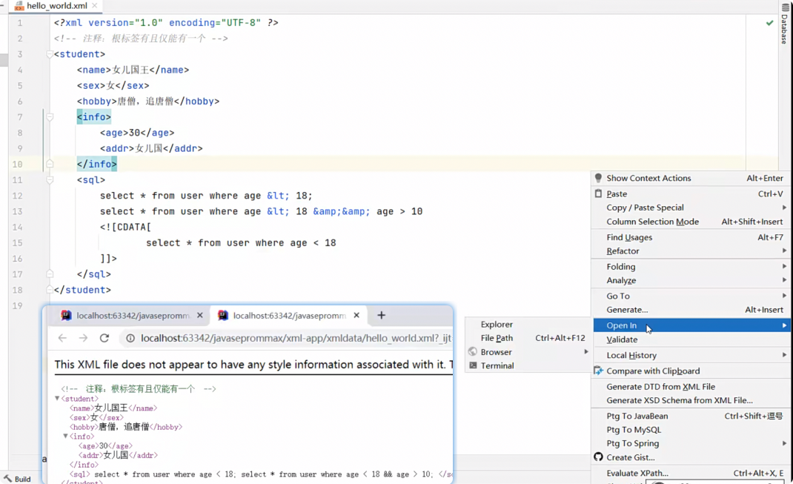

# xml


demo:



## 文档约束（了解)


### DTD

dtd只能约束标签，不能约束字段


### schema

能够约束字段类型


data.xsd:

```java
<?xml version="1.0" encoding="UTF-8" ?>
<schema xmlns="http://www.w3.org/2001/XMLSchema"
        targetNamespace="http://www.itcast.cn"
        elementFormDefault="qualified" >
    <!-- targetNamespace:申明约束文档的地址（命名空间）-->
    <element name='书架'>
        <!-- 写子元素 -->
        <complexType>
            <!-- maxOccurs='unbounded': 书架下的子元素可以有任意多个！-->
            <sequence maxOccurs='unbounded'>
                <element name='书'>
                    <!-- 写子元素 -->
                    <complexType>
                        <sequence>
                            <element name='书名' type='string'/>
                            <element name='作者' type='string'/>
                            <element name='售价' type='double'/>
                        </sequence>
                    </complexType>
                </element>
            </sequence>
        </complexType>
    </element>
</schema>
```

hello_world_schema.xml:

```java
<?xml version="1.0" encoding="UTF-8" ?>
<书架 xmlns="http://www.itcast.cn"
    xmlns:xsi="http://www.w3.org/2001/XMLSchema-instance"
    xsi:schemaLocation="http://www.itcast.cn data.xsd">
    <!-- xmlns="http://www.itcast.cn"  基本位置
         xsi:schemaLocation="http://www.itcast.cn books02.xsd" 具体的位置 -->
    <书>
        <书名>神雕侠侣</书名>
        <作者>金庸</作者>
        <售价>399.9</售价>
    </书>
    <书>
        <书名>神雕侠侣</书名>
        <作者>金庸</作者>
        <售价>19.5</售价>
    </书>

</书架>
```


## 文档解析

### Dom4j


Contacts.xml: 被解析xml文档

```java
<?xml version="1.0" encoding="UTF-8"?>
<contactList>
    <contact id="1" vip="true">
        <name>   潘金莲  </name>
        <gender>女</gender>
        <email>panpan@itcast.cn</email>
    </contact>
    <contact id="2" vip="false">
        <name>武松</name>
        <gender>男</gender>
        <email>wusong@itcast.cn</email>
    </contact>
    <contact id="3" vip="false">
        <name>武大狼</name>
        <gender>男</gender>
        <email>wuda@itcast.cn</email>
    </contact>
    <user>
    </user>
</contactList>

```

Contact 的javaBean： 用来保存xml中解析出来的内容，用对象保存

```java
package com.itheima.d1_dom4j;
/**
 <contact id="1" vip="true">
 <name>   潘金莲  </name>
 <gender>女</gender>
 <email>panpan@itcast.cn</email>
 </contact>
 */
public class Contact {
    private String name;
    private int id;
    private boolean vip;
    private char gender;
    private String email;

    public Contact() {
    }

    public Contact(String name, int id, boolean vip, char gendar, String email) {
        this.name = name;
        this.id = id;
        this.vip = vip;
        this.gender = gendar;
        this.email = email;
    }

    public String getName() {
        return name;
    }

    public void setName(String name) {
        this.name = name;
    }

    public int getId() {
        return id;
    }

    public void setId(int id) {
        this.id = id;
    }

    public boolean isVip() {
        return vip;
    }

    public void setVip(boolean vip) {
        this.vip = vip;
    }

    public char getGender() {
        return gender;
    }

    public void setGender(char gender) {
        this.gender = gender;
    }

    public String getEmail() {
        return email;
    }

    public void setEmail(String email) {
        this.email = email;
    }

    @Override
    public String toString() {
        return "Contact{" +
                "name='" + name + '\'' +
                ", id=" + id +
                ", vip=" + vip +
                ", gendar=" + gender +
                ", email='" + email + '\'' +
                '}';
    }
}

```

Dom4JHellowWorldDemo1: 解析Xml：

```java
package com.itheima.d1_dom4j;

import org.dom4j.Attribute;
import org.dom4j.Document;
import org.dom4j.DocumentException;
import org.dom4j.Element;
import org.dom4j.io.SAXReader;
import org.junit.Test;

import java.io.File;
import java.io.FileInputStream;
import java.io.InputStream;
import java.util.List;

/**
   目标：学会使用dom4j解析XML文件中的数据。
    1、导入dom4j框架。
    2、准备一个XML文件。
 */
public class Dom4JHelloWorldDemo1 {
    @Test
    public void parseXMLData() throws Exception {
        // 1、创建一个Dom4j的解析器对象，代表了整个dom4j框架
        SAXReader saxReader = new SAXReader();

        // 2、把XML文件加载到内存中成为一个Document文档对象
        // Document document = saxReader.read(new File("xml-app\\src\\Contacts.xml")); // 需要通过模块名去定位
        // Document document = saxReader.read(new FileInputStream("xml-app\\src\\Contacts.xml"));

        // 注意: getResourceAsStream中的/是直接去src下寻找的文件
        InputStream is = Dom4JHelloWorldDemo1.class.getResourceAsStream("/Contacts.xml");
        Document document = saxReader.read(is);

        // 3、获取根元素对象
        Element root = document.getRootElement();
        System.out.println(root.getName());

        // 4、拿根元素下的全部子元素对象(一级)
        // List<Element> sonEles =  root.elements();
        List<Element> sonEles =  root.elements("contact");
        for (Element sonEle : sonEles) {
            System.out.println(sonEle.getName());
        }

        // 拿某个子元素
        Element userEle = root.element("user");
        System.out.println(userEle.getName());

        // 默认提取第一个子元素对象 (Java语言。)
        Element contact = root.element("contact");
        // 获取子元素文本
        System.out.println(contact.elementText("name"));
        // 去掉前后空格
        System.out.println(contact.elementTextTrim("name"));
        // 获取当前元素下的子元素对象
        Element email = contact.element("email");
        System.out.println(email.getText());
        // 去掉前后空格
        System.out.println(email.getTextTrim());

        // 根据元素获取属性值
        Attribute idAttr = contact.attribute("id");
        System.out.println(idAttr.getName() + "-->" + idAttr.getValue());
        // 直接提取属性值
        System.out.println(contact.attributeValue("id"));
        System.out.println(contact.attributeValue("vip"));


    }
}

```

Dom4JTest2: 结合Contact来打印xml转对象内容：

```java
package com.itheima.d1_dom4j;

import org.dom4j.Document;
import org.dom4j.Element;
import org.dom4j.io.SAXReader;
import org.junit.Test;

import java.util.ArrayList;
import java.util.List;

public class Dom4JTest2 {
    @Test
    public void parseToList() throws Exception {
        // 需求：解析XML中的数据成为一个List集合对象。
        // 1、导入框架（做过）
        // 2、创建SaxReader对象
        SAXReader saxReader = new SAXReader();
        // 3、加载XML文件成为文档对象Document对象。
        Document document =
                saxReader.read(Dom4JTest2.class.getResourceAsStream("/Contacts.xml"));
        // 4、先拿根元素
        Element root = document.getRootElement();
        // 5、提取contact子元素
        List<Element> contactEles = root.elements("contact");
        // 6、准备一个ArrayList集合封装联系人信息
        List<Contact> contacts = new ArrayList<>();
        // 7、遍历Contact子元素
        for (Element contactEle : contactEles) {
            // 8、每个子元素都是一个联系人对象
            Contact contact = new Contact();
            contact.setId(Integer.valueOf(contactEle.attributeValue("id")));
            contact.setVip(Boolean.valueOf(contactEle.attributeValue("vip")));
            contact.setName(contactEle.elementTextTrim("name"));
            contact.setGender(contactEle.elementTextTrim("gender").charAt(0));
            contact.setEmail(contactEle.elementText("email"));
            // 9、把联系人对象数据加入到List集合
            contacts.add(contact);
        }
        // 10、遍历List集合
        for (Contact contact : contacts) {
            System.out.println(contact);
        }
    }
}

```

### 检索Xpath：


demo:

```java
package com.itheima.d2_xpath;
import org.dom4j.Attribute;
import org.dom4j.Document;
import org.dom4j.Element;
import org.dom4j.Node;
import org.dom4j.io.SAXReader;
import org.junit.Test;

import java.util.List;

/**
    目标：XPath检索XML中的信息啊。(了解)

    引入：
        Dom4J可以用于解析整个XML的数据。
        但是如果要检索XML中的某些信息，建议使用XPath.（Xpath依赖Dom4j技术）
        Dom4J用于解析数据，Xpath用于检索数据。
    XPath使用步骤：
        1.导入dom4j框架。（XPath依赖于Dom4j技术,必须先导入dom4j框架！）
        2.导入XPath独有的框架包。jaxen-1.1.2.jar
    XPath常用API:
        List<Node> selectNodes(String var1):检索出一批节点集合。
        Node selectSingleNode(String var1)：检索出一个节点返回。
    XPath提供的四种检索数据的写法：
        1.绝对路径。
        2.相对路径。
        3.全文搜索。
        4.属性查找。
    小结：
         1.绝对路径： /根元素/子元素/子元素。
         2.相对路径： ./子元素/子元素。 (.代表了当前元素)
         3.全文搜索：
                //元素  在全文找这个元素
                //元素1/元素2  在全文找元素1下面的一级元素2
                //元素1//元素2  在全文找元素1下面的全部元素2
         4.属性查找。
                //@属性名称  在全文检索属性对象。
                //元素[@属性名称]  在全文检索包含该属性的元素对象。
                //元素[@属性名称=值]  在全文检索包含该属性的元素且属性值为该值的元素对象。
 */
public class XPathDemo {
    /**
     1.绝对路径: /根元素/子元素/子元素。
     */
    @Test
    public void parse01() throws Exception {
        // a、创建解析器对象
        SAXReader saxReader = new SAXReader();
        // b、把XML加载成Document文档对象
        Document document =
                saxReader.read(XPathDemo.class.getResourceAsStream("/Contacts2.xml"));
        // c、检索全部的名称
        List<Node> nameNodes = document.selectNodes("/contactList/contact/name");
        for (Node nameNode : nameNodes) {
            Element  nameEle = (Element) nameNode;
            System.out.println(nameEle.getTextTrim());
        }
    }

    /**
     2.相对路径： ./子元素/子元素。 (.代表了当前元素)
     */
    @Test
    public void parse02() throws Exception {
        // a、创建解析器对象
        SAXReader saxReader = new SAXReader();
        // b、把XML加载成Document文档对象
        Document document =
                saxReader.read(XPathDemo.class.getResourceAsStream("/Contacts2.xml"));
        Element root = document.getRootElement();
        // c、检索全部的名称
        List<Node> nameNodes = root.selectNodes("./contact/name");
        for (Node nameNode : nameNodes) {
            Element  nameEle = (Element) nameNode;
            System.out.println(nameEle.getTextTrim());
        }
    }

    /**
     3.全文搜索：
     //元素  在全文找这个元素
     //元素1/元素2  在全文找元素1下面的一级元素2
     //元素1//元素2  在全文找元素1下面的全部元素2
     */
    @Test
    public void parse03() throws Exception {
        // a、创建解析器对象
        SAXReader saxReader = new SAXReader();
        // b、把XML加载成Document文档对象
        Document document =
                saxReader.read(XPathDemo.class.getResourceAsStream("/Contacts2.xml"));
        // c、检索数据
        //List<Node> nameNodes = document.selectNodes("//name");
        // List<Node> nameNodes = document.selectNodes("//contact/name");
        List<Node> nameNodes = document.selectNodes("//contact//name");
        for (Node nameNode : nameNodes) {
            Element  nameEle = (Element) nameNode;
            System.out.println(nameEle.getTextTrim());
        }
    }

    /**
     4.属性查找。
     //@属性名称  在全文检索属性对象。
     //元素[@属性名称]  在全文检索包含该属性的元素对象。
     //元素[@属性名称=值]  在全文检索包含该属性的元素且属性值为该值的元素对象。
     */
    @Test
    public void parse04() throws Exception {
        // a、创建解析器对象
        SAXReader saxReader = new SAXReader();
        // b、把XML加载成Document文档对象
        Document document =
                saxReader.read(XPathDemo.class.getResourceAsStream("/Contacts2.xml"));
        // c、检索数据
        List<Node> nodes = document.selectNodes("//@id");
        for (Node node : nodes) {
            Attribute attr = (Attribute) node;
            System.out.println(attr.getName() + "===>" + attr.getValue());
        }

        // 查询name元素（包含id属性的）
//      Node node = document.selectSingleNode("//name[@id]");
        Node node = document.selectSingleNode("//name[@id=888]");
        Element ele = (Element) node;
        System.out.println(ele.getTextTrim());
    }
}

```


=


=

=


=

=
