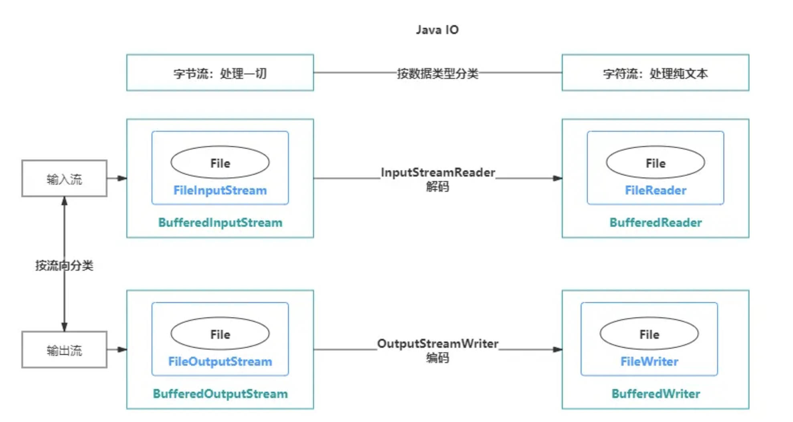
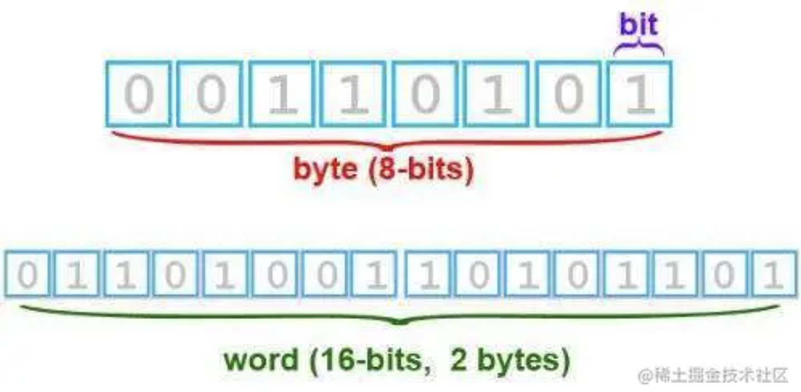
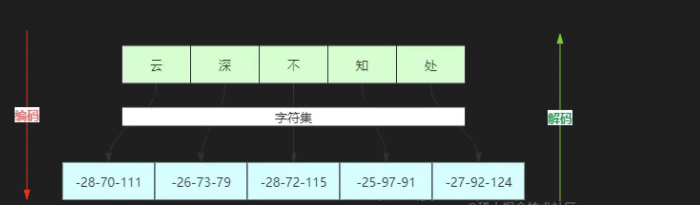
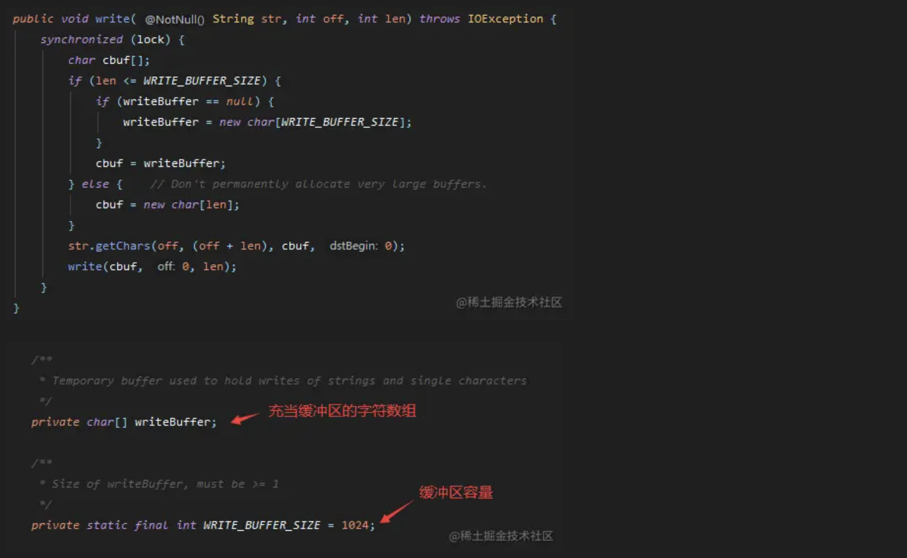
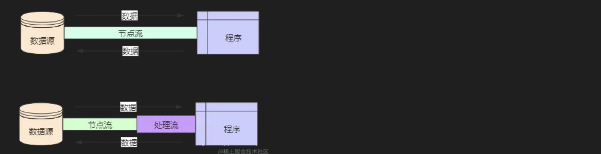
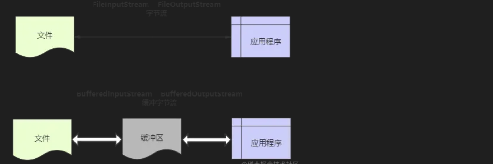
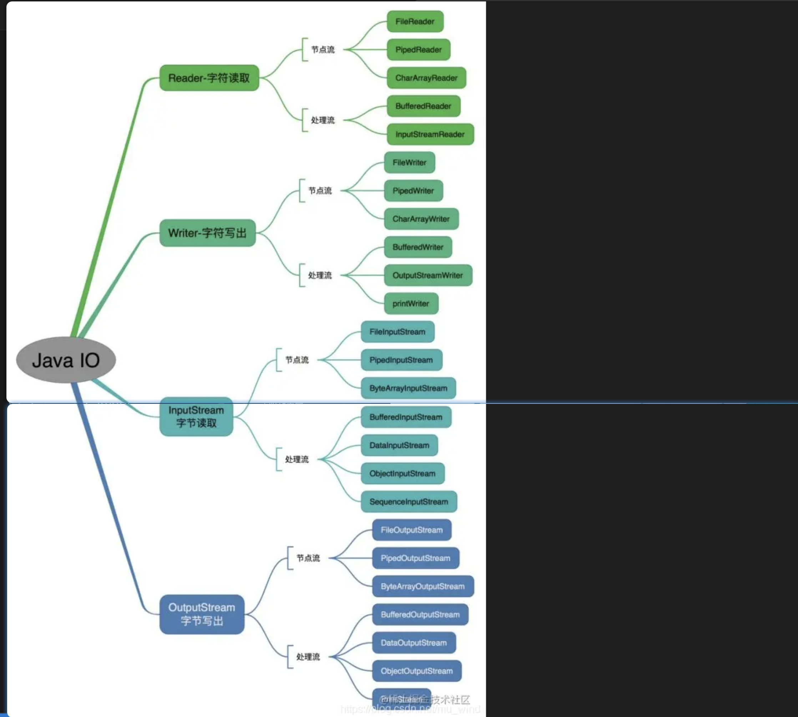
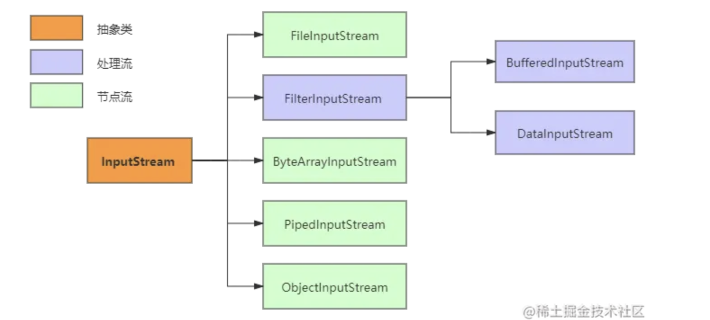
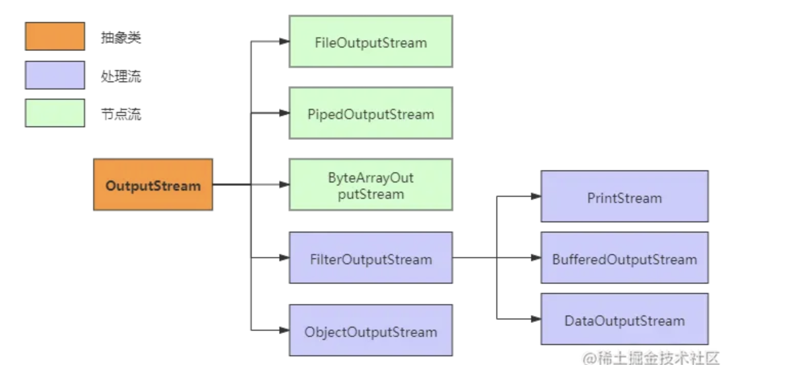
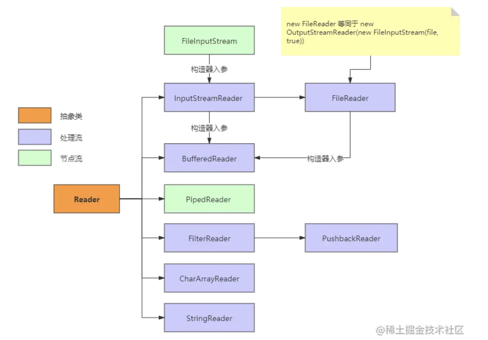

来源：

https://juejin.cn/post/6914190943939723278

> 原文链接：[blog.csdn.net/mu\_wind/ar…](https://link.juejin.cn?target=https%3A%2F%2Fblog.csdn.net%2Fmu%255C_wind%2Farticle%2Fdetails%2F108674284 "https://blog.csdn.net/mu%5C_wind/article/details/108674284")?

### Java IO流

* [前言](https://link.juejin.cn?target=https%3A%2F%2Fblog.csdn.net%2Fmu_wind%2Farticle%2Fdetails%2F108674284%3Futm_medium%3Ddistribute.pc_feed.none-task-blog-personrec_tag-4.nonecase%26depth_1-utm_source%3Ddistribute.pc_feed.none-task-blog-personrec_tag-4.nonecase%26request_id%3D5f6d4fb0dfc5717f9a2ae4ea%23_1 "https://blog.csdn.net/mu_wind/article/details/108674284?utm_medium=distribute.pc_feed.none-task-blog-personrec_tag-4.nonecase&amp;depth_1-utm_source=distribute.pc_feed.none-task-blog-personrec_tag-4.nonecase&amp;request_id=5f6d4fb0dfc5717f9a2ae4ea#_1")
* [1 初识Java IO](https://link.juejin.cn?target=https%3A%2F%2Fblog.csdn.net%2Fmu_wind%2Farticle%2Fdetails%2F108674284%3Futm_medium%3Ddistribute.pc_feed.none-task-blog-personrec_tag-4.nonecase%26depth_1-utm_source%3Ddistribute.pc_feed.none-task-blog-personrec_tag-4.nonecase%26request_id%3D5f6d4fb0dfc5717f9a2ae4ea%231_Java_IO_25 "https://blog.csdn.net/mu_wind/article/details/108674284?utm_medium=distribute.pc_feed.none-task-blog-personrec_tag-4.nonecase&amp;depth_1-utm_source=distribute.pc_feed.none-task-blog-personrec_tag-4.nonecase&amp;request_id=5f6d4fb0dfc5717f9a2ae4ea#1_Java_IO_25")
* * [1.1 IO流分类](https://link.juejin.cn?target=https%3A%2F%2Fblog.csdn.net%2Fmu_wind%2Farticle%2Fdetails%2F108674284%3Futm_medium%3Ddistribute.pc_feed.none-task-blog-personrec_tag-4.nonecase%26depth_1-utm_source%3Ddistribute.pc_feed.none-task-blog-personrec_tag-4.nonecase%26request_id%3D5f6d4fb0dfc5717f9a2ae4ea%2311_IO_39 "https://blog.csdn.net/mu_wind/article/details/108674284?utm_medium=distribute.pc_feed.none-task-blog-personrec_tag-4.nonecase&amp;depth_1-utm_source=distribute.pc_feed.none-task-blog-personrec_tag-4.nonecase&amp;request_id=5f6d4fb0dfc5717f9a2ae4ea#11_IO_39")
  * [1.2 案例实操](https://link.juejin.cn?target=https%3A%2F%2Fblog.csdn.net%2Fmu_wind%2Farticle%2Fdetails%2F108674284%3Futm_medium%3Ddistribute.pc_feed.none-task-blog-personrec_tag-4.nonecase%26depth_1-utm_source%3Ddistribute.pc_feed.none-task-blog-personrec_tag-4.nonecase%26request_id%3D5f6d4fb0dfc5717f9a2ae4ea%2312__96 "https://blog.csdn.net/mu_wind/article/details/108674284?utm_medium=distribute.pc_feed.none-task-blog-personrec_tag-4.nonecase&amp;depth_1-utm_source=distribute.pc_feed.none-task-blog-personrec_tag-4.nonecase&amp;request_id=5f6d4fb0dfc5717f9a2ae4ea#12__96")
* [2 IO流对象](https://link.juejin.cn?target=https%3A%2F%2Fblog.csdn.net%2Fmu_wind%2Farticle%2Fdetails%2F108674284%3Futm_medium%3Ddistribute.pc_feed.none-task-blog-personrec_tag-4.nonecase%26depth_1-utm_source%3Ddistribute.pc_feed.none-task-blog-personrec_tag-4.nonecase%26request_id%3D5f6d4fb0dfc5717f9a2ae4ea%232_IO_294 "https://blog.csdn.net/mu_wind/article/details/108674284?utm_medium=distribute.pc_feed.none-task-blog-personrec_tag-4.nonecase&amp;depth_1-utm_source=distribute.pc_feed.none-task-blog-personrec_tag-4.nonecase&amp;request_id=5f6d4fb0dfc5717f9a2ae4ea#2_IO_294")
* * [2.1 File类](https://link.juejin.cn?target=https%3A%2F%2Fblog.csdn.net%2Fmu_wind%2Farticle%2Fdetails%2F108674284%3Futm_medium%3Ddistribute.pc_feed.none-task-blog-personrec_tag-4.nonecase%26depth_1-utm_source%3Ddistribute.pc_feed.none-task-blog-personrec_tag-4.nonecase%26request_id%3D5f6d4fb0dfc5717f9a2ae4ea%2321_File_298 "https://blog.csdn.net/mu_wind/article/details/108674284?utm_medium=distribute.pc_feed.none-task-blog-personrec_tag-4.nonecase&amp;depth_1-utm_source=distribute.pc_feed.none-task-blog-personrec_tag-4.nonecase&amp;request_id=5f6d4fb0dfc5717f9a2ae4ea#21_File_298")
  * [2.2 字节流](https://link.juejin.cn?target=https%3A%2F%2Fblog.csdn.net%2Fmu_wind%2Farticle%2Fdetails%2F108674284%3Futm_medium%3Ddistribute.pc_feed.none-task-blog-personrec_tag-4.nonecase%26depth_1-utm_source%3Ddistribute.pc_feed.none-task-blog-personrec_tag-4.nonecase%26request_id%3D5f6d4fb0dfc5717f9a2ae4ea%2322__345 "https://blog.csdn.net/mu_wind/article/details/108674284?utm_medium=distribute.pc_feed.none-task-blog-personrec_tag-4.nonecase&amp;depth_1-utm_source=distribute.pc_feed.none-task-blog-personrec_tag-4.nonecase&amp;request_id=5f6d4fb0dfc5717f9a2ae4ea#22__345")
  * [2.3 字符流](https://link.juejin.cn?target=https%3A%2F%2Fblog.csdn.net%2Fmu_wind%2Farticle%2Fdetails%2F108674284%3Futm_medium%3Ddistribute.pc_feed.none-task-blog-personrec_tag-4.nonecase%26depth_1-utm_source%3Ddistribute.pc_feed.none-task-blog-personrec_tag-4.nonecase%26request_id%3D5f6d4fb0dfc5717f9a2ae4ea%2323__371 "https://blog.csdn.net/mu_wind/article/details/108674284?utm_medium=distribute.pc_feed.none-task-blog-personrec_tag-4.nonecase&amp;depth_1-utm_source=distribute.pc_feed.none-task-blog-personrec_tag-4.nonecase&amp;request_id=5f6d4fb0dfc5717f9a2ae4ea#23__371")
  * [2.4 序列化](https://link.juejin.cn?target=https%3A%2F%2Fblog.csdn.net%2Fmu_wind%2Farticle%2Fdetails%2F108674284%3Futm_medium%3Ddistribute.pc_feed.none-task-blog-personrec_tag-4.nonecase%26depth_1-utm_source%3Ddistribute.pc_feed.none-task-blog-personrec_tag-4.nonecase%26request_id%3D5f6d4fb0dfc5717f9a2ae4ea%2324__385 "https://blog.csdn.net/mu_wind/article/details/108674284?utm_medium=distribute.pc_feed.none-task-blog-personrec_tag-4.nonecase&amp;depth_1-utm_source=distribute.pc_feed.none-task-blog-personrec_tag-4.nonecase&amp;request_id=5f6d4fb0dfc5717f9a2ae4ea#24__385")
* [3 IO流方法](https://link.juejin.cn?target=https%3A%2F%2Fblog.csdn.net%2Fmu_wind%2Farticle%2Fdetails%2F108674284%3Futm_medium%3Ddistribute.pc_feed.none-task-blog-personrec_tag-4.nonecase%26depth_1-utm_source%3Ddistribute.pc_feed.none-task-blog-personrec_tag-4.nonecase%26request_id%3D5f6d4fb0dfc5717f9a2ae4ea%233_IO_387 "https://blog.csdn.net/mu_wind/article/details/108674284?utm_medium=distribute.pc_feed.none-task-blog-personrec_tag-4.nonecase&amp;depth_1-utm_source=distribute.pc_feed.none-task-blog-personrec_tag-4.nonecase&amp;request_id=5f6d4fb0dfc5717f9a2ae4ea#3_IO_387")
* * [3.1 字节流方法](https://link.juejin.cn?target=https%3A%2F%2Fblog.csdn.net%2Fmu_wind%2Farticle%2Fdetails%2F108674284%3Futm_medium%3Ddistribute.pc_feed.none-task-blog-personrec_tag-4.nonecase%26depth_1-utm_source%3Ddistribute.pc_feed.none-task-blog-personrec_tag-4.nonecase%26request_id%3D5f6d4fb0dfc5717f9a2ae4ea%2331__388 "https://blog.csdn.net/mu_wind/article/details/108674284?utm_medium=distribute.pc_feed.none-task-blog-personrec_tag-4.nonecase&amp;depth_1-utm_source=distribute.pc_feed.none-task-blog-personrec_tag-4.nonecase&amp;request_id=5f6d4fb0dfc5717f9a2ae4ea#31__388")
  * [3.2 字符流方法](https://link.juejin.cn?target=https%3A%2F%2Fblog.csdn.net%2Fmu_wind%2Farticle%2Fdetails%2F108674284%3Futm_medium%3Ddistribute.pc_feed.none-task-blog-personrec_tag-4.nonecase%26depth_1-utm_source%3Ddistribute.pc_feed.none-task-blog-personrec_tag-4.nonecase%26request_id%3D5f6d4fb0dfc5717f9a2ae4ea%2332__402 "https://blog.csdn.net/mu_wind/article/details/108674284?utm_medium=distribute.pc_feed.none-task-blog-personrec_tag-4.nonecase&amp;depth_1-utm_source=distribute.pc_feed.none-task-blog-personrec_tag-4.nonecase&amp;request_id=5f6d4fb0dfc5717f9a2ae4ea#32__402")
* [4 附加内容](https://link.juejin.cn?target=https%3A%2F%2Fblog.csdn.net%2Fmu_wind%2Farticle%2Fdetails%2F108674284%3Futm_medium%3Ddistribute.pc_feed.none-task-blog-personrec_tag-4.nonecase%26depth_1-utm_source%3Ddistribute.pc_feed.none-task-blog-personrec_tag-4.nonecase%26request_id%3D5f6d4fb0dfc5717f9a2ae4ea%234__424 "https://blog.csdn.net/mu_wind/article/details/108674284?utm_medium=distribute.pc_feed.none-task-blog-personrec_tag-4.nonecase&amp;depth_1-utm_source=distribute.pc_feed.none-task-blog-personrec_tag-4.nonecase&amp;request_id=5f6d4fb0dfc5717f9a2ae4ea#4__424")
* * [4.1 位、字节、字符](https://link.juejin.cn?target=https%3A%2F%2Fblog.csdn.net%2Fmu_wind%2Farticle%2Fdetails%2F108674284%3Futm_medium%3Ddistribute.pc_feed.none-task-blog-personrec_tag-4.nonecase%26depth_1-utm_source%3Ddistribute.pc_feed.none-task-blog-personrec_tag-4.nonecase%26request_id%3D5f6d4fb0dfc5717f9a2ae4ea%2341__425 "https://blog.csdn.net/mu_wind/article/details/108674284?utm_medium=distribute.pc_feed.none-task-blog-personrec_tag-4.nonecase&amp;depth_1-utm_source=distribute.pc_feed.none-task-blog-personrec_tag-4.nonecase&amp;request_id=5f6d4fb0dfc5717f9a2ae4ea#41__425")
  * [4.2 IO流效率对比](https://link.juejin.cn?target=https%3A%2F%2Fblog.csdn.net%2Fmu_wind%2Farticle%2Fdetails%2F108674284%3Futm_medium%3Ddistribute.pc_feed.none-task-blog-personrec_tag-4.nonecase%26depth_1-utm_source%3Ddistribute.pc_feed.none-task-blog-personrec_tag-4.nonecase%26request_id%3D5f6d4fb0dfc5717f9a2ae4ea%2342_IO_439 "https://blog.csdn.net/mu_wind/article/details/108674284?utm_medium=distribute.pc_feed.none-task-blog-personrec_tag-4.nonecase&amp;depth_1-utm_source=distribute.pc_feed.none-task-blog-personrec_tag-4.nonecase&amp;request_id=5f6d4fb0dfc5717f9a2ae4ea#42_IO_439")
  * [4.3 NIO](https://link.juejin.cn?target=https%3A%2F%2Fblog.csdn.net%2Fmu_wind%2Farticle%2Fdetails%2F108674284%3Futm_medium%3Ddistribute.pc_feed.none-task-blog-personrec_tag-4.nonecase%26depth_1-utm_source%3Ddistribute.pc_feed.none-task-blog-personrec_tag-4.nonecase%26request_id%3D5f6d4fb0dfc5717f9a2ae4ea%2343_NIO_662 "https://blog.csdn.net/mu_wind/article/details/108674284?utm_medium=distribute.pc_feed.none-task-blog-personrec_tag-4.nonecase&amp;depth_1-utm_source=distribute.pc_feed.none-task-blog-personrec_tag-4.nonecase&amp;request_id=5f6d4fb0dfc5717f9a2ae4ea#43_NIO_662")

# 前言

> 有人曾问fastjson的作者（阿里技术专家高铁）：“你开发fastjson，没得到什么好处，反而挨了骂背了锅，这种事情你为什么要做呢？”
>
> 高铁答道：“因为热爱本身，就是奖励啊！”
>
> 这个回答顿时触动了我。想想自己，又何尝不是如此。写作是个痛苦的过程，用心写作就更加煎熬，需字字斟酌，反复删改才有所成。然而，当一篇篇精良文章出自己手而呈现眼前时，那些痛苦煎熬就都那么值得。如果这些博文能有幸得大家阅读和认可，就更加是莫大的鼓舞了。技术人的快乐就是可以这么纯粹和简单。

点波关注不迷路，一键三连好运连连！

IO流是Java中的一个重要构成部分，也是我们经常打交道的。这篇关于Java IO的博文干货满满，堪称全网前三（请轻喷！）

下面几个问题（问题还会继续补充），如果你能对答如流，那么恭喜你，IO知识掌握得很好，可以立即关闭文章。反之，你可以在后面得文章中寻找答案。

1. Java IO流有什么特点？
2. Java IO流分为几种类型？
3. 字节流和字符流的关系与区别？
4. 字符流是否使用了缓冲？
5. 缓冲流的效率一定高吗？为什么？
6. 缓冲流体现了Java中的哪种设计模式思想？
7. 为什么要实现序列化?如何实现序列化?
8. 序列化数据后，再次修改类文件，读取数据会出问题，如何解决呢?

# 1 初识Java IO

IO，即 `in`和 `out`，也就是输入和输出，指应用程序和外部设备之间的数据传递，常见的外部设备包括文件、管道、网络连接。

Java 中是通过流处理IO 的， **那么什么是流** ？

流（`Stream`），是一个抽象的概念，是指一连串的数据（字符或字节），是以先进先出的方式发送信息的通道。

当程序需要读取数据的时候，就会开启一个通向数据源的流，这个数据源可以是文件，内存，或是网络连接。类似的，当程序需要写入数据的时候，就会开启一个通向目的地的流。这时候你就可以想象数据好像在这其中“流”动一样。

一般来说关于流的特性有下面几点：

1. 先进先出：最先写入输出流的数据最先被输入流读取到。
2. 顺序存取：可以一个接一个地往流中写入一串字节，读出时也将按写入顺序读取一串字节，不能随机访问中间的数据。（`RandomAccessFile`除外）
3. 只读或只写：每个流只能是输入流或输出流的一种，不能同时具备两个功能，输入流只能进行读操作，对输出流只能进行写操作。在一个数据传输通道中，如果既要写入数据，又要读取数据，则要分别提供两个流。

## 1.1 IO流分类

IO流主要的分类方式有以下3种：

1. 按数据流的方向：输入流、输出流
2. 按处理数据单位：字节流、字符流
3. 按功能：节点流、处理流



**1、输入流与输出流**

输入与输出是相对于应用程序而言的，比如文件读写，读取文件是输入流，写文件是输出流，这点很容易搞反。


**2、字节流与字符流**

字节流和字符流的用法几乎完成全一样，区别在于字节流和字符流所操作的数据单元不同，字节流操作的单元是数据单元是8位的字节，字符流操作的是数据单元为16位的字符。

**为什么要有字符流？**

Java中字符是采用Unicode标准，Unicode 编码中，一个英文为一个字节，一个中文为两个字节。



而在UTF-8编码中，一个中文字符是3个字节。例如下面图中，“云深不知处”5个中文对应的是15个字节：-28-70-111-26-73-79-28-72-115-25-97-91-27-92-124



那么问题来了，如果使用字节流处理中文，如果一次读写一个字符对应的字节数就不会有问题，一旦将一个字符对应的字节分裂开来，就会出现乱码了。为了更方便地处理中文这些字符，Java就推出了字符流。

字节流和字符流的其他区别：

1. 字节流一般用来处理图像、视频、音频、PPT、Word等类型的文件。字符流一般用于处理纯文本类型的文件，如TXT文件等，但不能处理图像视频等非文本文件。用一句话说就是：字节流可以处理一切文件，而字符流只能处理纯文本文件。
2. 字节流本身没有缓冲区，缓冲字节流相对于字节流，效率提升非常高。而字符流本身就带有缓冲区，缓冲字符流相对于字符流效率提升就不是那么大了。详见文末效率对比。

以写文件为例，我们查看字符流的源码，发现确实有利用到缓冲区：



**3、节点流和处理流**

 **节点流** ：直接操作数据读写的流类，比如 `FileInputStream`

 **处理流** ：对一个已存在的流的链接和封装，通过对数据进行处理为程序提供功能强大、灵活的读写功能，例如 `BufferedInputStream`（缓冲字节流）

处理流和节点流应用了Java的装饰者设计模式。

下图就很形象地描绘了节点流和处理流，处理流是对节点流的封装，最终的数据处理还是由节点流完成的。



在诸多处理流中，有一个非常重要，那就是 **缓冲流** 。

我们知道，程序与磁盘的交互相对于内存运算是很慢的，容易成为程序的性能瓶颈。减少程序与磁盘的交互，是提升程序效率一种有效手段。缓冲流，就应用这种思路：普通流每次读写一个字节，而缓冲流在内存中设置一个缓存区，缓冲区先存储足够的待操作数据后，再与内存或磁盘进行交互。这样，在总数据量不变的情况下，通过提高每次交互的数据量，减少了交互次数。



联想一下生活中的例子，我们搬砖的时候，一块一块地往车上装肯定是很低效的。我们可以使用一个小推车，先把砖装到小推车上，再把这小推车推到车前，把砖装到车上。这个例子中，小推车可以视为缓冲区，小推车的存在，减少了我们装车次数，从而提高了效率。


需要注意的是，缓冲流效率一定高吗？不一定，某些情形下，缓冲流效率反而更低，具体请见IO流效率对比。

完整的IO分类图如下：



## 1.2 案例实操

接下来，我们看看如何使用Java IO。

 **文本读写的例子** ，也就是文章开头所说的，将“松下问童子，言师采药去。只在此山中，云深不知处。”写入本地文本，然后再从文件读取内容并输出到控制台。

**1、FileInputStream、FileOutputStream（字节流）**

**字节流的方式效率较低，不建议使用**

```java
public class IOTest {
	public static void main(String[] args) throws IOException {
		File file = new File("D:/test.txt");

		write(file);
		System.out.println(read(file));
	}

	public static void write(File file) throws IOException {
		OutputStream os = new FileOutputStream(file, true);

		// 要写入的字符串
		String string = "松下问童子，言师采药去。只在此山中，云深不知处。";
		// 写入文件
		os.write(string.getBytes());
		// 关闭流
		os.close();
	}

	public static String read(File file) throws IOException {
		InputStream in = new FileInputStream(file);

		// 一次性取多少个字节
		byte[] bytes = new byte[1024];
		// 用来接收读取的字节数组
		StringBuilder sb = new StringBuilder();
		// 读取到的字节数组长度，为-1时表示没有数据
		int length = 0;
		// 循环取数据
		while ((length = in.read(bytes)) != -1) {
			// 将读取的内容转换成字符串
			sb.append(new String(bytes, 0, length));
		}
		// 关闭流
		in.close();

		return sb.toString();
	}
}
123456789101112131415161718192021222324252627282930313233343536373839

```

**2、BufferedInputStream、BufferedOutputStream（缓冲字节流）**

缓冲字节流是为高效率而设计的，真正的读写操作还是靠 `FileOutputStream`和 `FileInputStream`，所以其构造方法入参是这两个类的对象也就不奇怪了。

```java
public class IOTest {

	public static void write(File file) throws IOException {
		// 缓冲字节流，提高了效率
		BufferedOutputStream bis = new BufferedOutputStream(new FileOutputStream(file, true));

		// 要写入的字符串
		String string = "松下问童子，言师采药去。只在此山中，云深不知处。";
		// 写入文件
		bis.write(string.getBytes());
		// 关闭流
		bis.close();
	}

	public static String read(File file) throws IOException {
		BufferedInputStream fis = new BufferedInputStream(new FileInputStream(file));

		// 一次性取多少个字节
		byte[] bytes = new byte[1024];
		// 用来接收读取的字节数组
		StringBuilder sb = new StringBuilder();
		// 读取到的字节数组长度，为-1时表示没有数据
		int length = 0;
		// 循环取数据
		while ((length = fis.read(bytes)) != -1) {
			// 将读取的内容转换成字符串
			sb.append(new String(bytes, 0, length));
		}
		// 关闭流
		fis.close();

		return sb.toString();
	}
}
12345678910111213141516171819202122232425262728293031323334

```

**3、InputStreamReader、OutputStreamWriter（字符流）**

**字符流适用于文本文件的读写** ，`OutputStreamWriter`类其实也是借助 `FileOutputStream`类实现的，故其构造方法是 `FileOutputStream`的对象

```java
public class IOTest {

	public static void write(File file) throws IOException {
		// OutputStreamWriter可以显示指定字符集，否则使用默认字符集
		OutputStreamWriter osw = new OutputStreamWriter(new FileOutputStream(file, true), "UTF-8");

		// 要写入的字符串
		String string = "松下问童子，言师采药去。只在此山中，云深不知处。";
		osw.write(string);
		osw.close();
	}

	public static String read(File file) throws IOException {
		InputStreamReader isr = new InputStreamReader(new FileInputStream(file), "UTF-8");
		// 字符数组：一次读取多少个字符
		char[] chars = new char[1024];
		// 每次读取的字符数组先append到StringBuilder中
		StringBuilder sb = new StringBuilder();
		// 读取到的字符数组长度，为-1时表示没有数据
		int length;
		// 循环取数据
		while ((length = isr.read(chars)) != -1) {
			// 将读取的内容转换成字符串
			sb.append(chars, 0, length);
		}
		// 关闭流
		isr.close();

		return sb.toString()
	}
}
12345678910111213141516171819202122232425262728293031

```

**4、字符流便捷类**

Java提供了 `FileWriter`和 `FileReader`简化字符流的读写，`new FileWriter`等同于 `new OutputStreamWriter(new FileOutputStream(file, true))`

```java
public class IOTest {

	public static void write(File file) throws IOException {
		FileWriter fw = new FileWriter(file, true);

		// 要写入的字符串
		String string = "松下问童子，言师采药去。只在此山中，云深不知处。";
		fw.write(string);
		fw.close();
	}

	public static String read(File file) throws IOException {
		FileReader fr = new FileReader(file);
		// 一次性取多少个字节
		char[] chars = new char[1024];
		// 用来接收读取的字节数组
		StringBuilder sb = new StringBuilder();
		// 读取到的字节数组长度，为-1时表示没有数据
		int length;
		// 循环取数据
		while ((length = fr.read(chars)) != -1) {
			// 将读取的内容转换成字符串
			sb.append(chars, 0, length);
		}
		// 关闭流
		fr.close();

		return sb.toString();
	}
}
123456789101112131415161718192021222324252627282930

```

**5、BufferedReader、BufferedWriter（字符缓冲流）**

```java
public class IOTest {

	public static void write(File file) throws IOException {
		// BufferedWriter fw = new BufferedWriter(new OutputStreamWriter(new
		// FileOutputStream(file, true), "UTF-8"));
		// FileWriter可以大幅度简化代码
		BufferedWriter bw = new BufferedWriter(new FileWriter(file, true));

		// 要写入的字符串
		String string = "松下问童子，言师采药去。只在此山中，云深不知处。";
		bw.write(string);
		bw.close();
	}

	public static String read(File file) throws IOException {
		BufferedReader br = new BufferedReader(new FileReader(file));
		// 用来接收读取的字节数组
		StringBuilder sb = new StringBuilder();

		// 按行读数据
		String line;
		// 循环取数据
		while ((line = br.readLine()) != null) {
			// 将读取的内容转换成字符串
			sb.append(line);
		}
		// 关闭流
		br.close();

		return sb.toString();
	}
}
123456789101112131415161718192021222324252627282930313
```

# 2 IO流对象

第一节中，我们大致了解了IO，并完成了几个案例，但对IO还缺乏更详细的认知，那么接下来我们就对Java IO细细分解，梳理出完整的知识体系来。

Java种提供了40多个类，我们只需要详细了解一下其中比较重要的就可以满足日常应用了。

## 2.1 File类

`File`类是用来操作文件的类，但它不能操作文件中的数据。

```java
public class File extends Object implements Serializable, Comparable<File>
1

```

`File`类实现了 `Serializable`、 `Comparable<File>`，说明它是支持序列化和排序的。

**File类的构造方法**

方法名

说明

`File(File parent, String child)`

根据 parent 抽象路径名和 child 路径名字符串创建一个新 File 实例。

`File(String pathname)`

通过将给定路径名字符串转换为抽象路径名来创建一个新 File 实例。

`File(String parent, String child)`

根据 parent 路径名字符串和 child 路径名字符串创建一个新 File 实例。

`File(URI uri)`

通过将给定的 file: URI 转换为一个抽象路径名来创建一个新的 File 实例。

**File类的常用方法**

方法

说明

`createNewFile()`

当且仅当不存在具有此抽象路径名指定名称的文件时，不可分地创建一个新的空文件。

`delete()`

删除此抽象路径名表示的文件或目录。

`exists()`

测试此抽象路径名表示的文件或目录是否存在。

`getAbsoluteFile()`

返回此抽象路径名的绝对路径名形式。

`getAbsolutePath()`

返回此抽象路径名的绝对路径名字符串。

`length()`

返回由此抽象路径名表示的文件的长度。

`mkdir()`

创建此抽象路径名指定的目录。

**File类使用实例**

```java
public class FileTest {
	public static void main(String[] args) throws IOException {
		File file = new File("C:/Mu/fileTest.txt");

		// 判断文件是否存在
		if (!file.exists()) {
			// 不存在则创建
			file.createNewFile();
		}
		System.out.println("文件的绝对路径：" + file.getAbsolutePath());
		System.out.println("文件的大小：" + file.length());

		// 刪除文件
		file.delete();
	}
}
12345678910111213141516

```

## 2.2 字节流

`InputStream`与 `OutputStream`是两个抽象类，是字节流的基类，所有具体的字节流实现类都是分别继承了这两个类。

以 `InputStream`为例，它继承了 `Object`，实现了 `Closeable`

```java
public abstract class InputStream
extends Object
implements Closeable
123

```

`InputStream`类有很多的实现子类，下面列举了一些比较常用的：



详细说明一下上图中的类：

1. `InputStream`：`InputStream`是所有字节输入流的抽象基类，前面说过抽象类不能被实例化，实际上是作为模板而存在的，为所有实现类定义了处理输入流的方法。
2. `FileInputSream`：文件输入流，一个非常重要的字节输入流，用于对文件进行读取操作。
3. `PipedInputStream`：管道字节输入流，能实现多线程间的管道通信。
4. `ByteArrayInputStream`：字节数组输入流，从字节数组(byte[])中进行以字节为单位的读取，也就是将资源文件都以字节的形式存入到该类中的字节数组中去。
5. `FilterInputStream`：装饰者类，具体的装饰者继承该类，这些类都是处理类，作用是对节点类进行封装，实现一些特殊功能。
6. `DataInputStream`：数据输入流，它是用来装饰其它输入流，作用是“允许应用程序以与机器无关方式从底层输入流中读取基本 Java 数据类型”。
7. `BufferedInputStream`：缓冲流，对节点流进行装饰，内部会有一个缓存区，用来存放字节，每次都是将缓存区存满然后发送，而不是一个字节或两个字节这样发送，效率更高。
8. `ObjectInputStream`：对象输入流，用来提供对**基本数据或对象**的持久存储。通俗点说，也就是能直接传输对象，通常应用在反序列化中。它也是一种处理流，构造器的入参是一个 `InputStream`的实例对象。

`OutputStream`类继承关系图：



`OutputStream`类继承关系与 `InputStream`类似，需要注意的是 `PrintStream`.

## 2.3 字符流

与字节流类似，字符流也有两个抽象基类，分别是 `Reader`和 `Writer`。其他的字符流实现类都是继承了这两个类。

以 `Reader`为例，它的主要实现子类如下图：



各个类的详细说明：

1. `InputStreamReader`：从字节流到字符流的桥梁（`InputStreamReader`构造器入参是 `FileInputStream`的实例对象），它读取字节并使用指定的字符集将其解码为字符。它使用的字符集可以通过名称指定，也可以显式给定，或者可以接受平台的默认字符集。
2. `BufferedReader`：从字符输入流中读取文本，设置一个缓冲区来提高效率。`BufferedReader`是对 `InputStreamReader`的封装，前者构造器的入参就是后者的一个实例对象。
3. `FileReader`：用于读取字符文件的便利类，`new FileReader(File file)`等同于 `new InputStreamReader(new FileInputStream(file, true),"UTF-8")`，但 `FileReader`不能指定字符编码和默认字节缓冲区大小。
4. `PipedReader` ：管道字符输入流。实现多线程间的管道通信。
5. `CharArrayReader`：从 `Char`数组中读取数据的介质流。
6. `StringReader` ：从 `String`中读取数据的介质流。

`Writer`与 `Reader`结构类似，方向相反，不再赘述。唯一有区别的是，`Writer`的子类 `PrintWriter`。

## 2.4 序列化

待续…

# 3 IO流方法

## 3.1 字节流方法

字节输入流 `InputStream`主要方法：

* `read()` ：从此输入流中读取一个数据字节。
* `read(byte[] b)` ：从此输入流中将最多 b.length 个字节的数据读入一个 byte 数组中。
* `read(byte[] b, int off, int len)` ：从此输入流中将最多 len 个字节的数据读入一个 byte 数组中。
* `close()`：关闭此输入流并释放与该流关联的所有系统资源。

字节输出流 `OutputStream`主要方法：

* `write(byte[] b)` ：将 b.length 个字节从指定 byte 数组写入此文件输出流中。
* `write(byte[] b, int off, int len)` ：将指定 byte 数组中从偏移量 off 开始的 len 个字节写入此文件输出流。
* `write(int b)` ：将指定字节写入此文件输出流。
* `close()` ：关闭此输入流并释放与该流关联的所有系统资源。

## 3.2 字符流方法

字符输入流 `Reader`主要方法：

* `read()`：读取单个字符。
* `read(char[] cbuf)` ：将字符读入数组。
* `read(char[] cbuf, int off, int len)` ： 将字符读入数组的某一部分。
* `read(CharBuffer target)` ：试图将字符读入指定的字符缓冲区。
* `flush()` ：刷新该流的缓冲。
* `close()` ：关闭此流，但要先刷新它。

字符输出流 `Writer`主要方法：

* `write(char[] cbuf)` ：写入字符数组。
* `write(char[] cbuf, int off, int len)` ：写入字符数组的某一部分。
* `write(int c)` ：写入单个字符。
* `write(String str)` ：写入字符串。
* `write(String str, int off, int len)` ：写入字符串的某一部分。
* `flush()` ：刷新该流的缓冲。
* `close()` ：关闭此流，但要先刷新它。

另外，字符缓冲流还有两个独特的方法：

* `BufferedWriter`类 `newLine()` ：**写入一个行分隔符。这个方法会自动适配所在系统的行分隔符。**
* `BufferedReader`类 `readLine()` ：读取一个文本行。

# 4 附加内容

## 4.1 位、字节、字符

字节(Byte)是计量单位，表示数据量多少，是计算机信息技术用于计量存储容量的一种计量单位，通常情况下一字节等于八位。

字符(Character)计算机中使用的字母、数字、字和符号，比如’A’、‘B’、’$’、’&'等。

一般在英文状态下一个字母或字符占用一个字节，一个汉字用两个字节表示。

字节与字符：

* ASCII 码中，一个英文字母（不分大小写）为一个字节，一个中文汉字为两个字节。
* UTF-8 编码中，一个英文字为一个字节，一个中文为三个字节。
* Unicode 编码中，一个英文为一个字节，一个中文为两个字节。
* 符号：英文标点为一个字节，中文标点为两个字节。例如：英文句号 . 占1个字节的大小，中文句号 。占2个字节的大小。
* UTF-16 编码中，一个英文字母字符或一个汉字字符存储都需要 2 个字节（Unicode 扩展区的一些汉字存储需要 4 个字节）。
* UTF-32 编码中，世界上任何字符的存储都需要 4 个字节。

## 4.2 IO流效率对比

首先，对比下普通字节流和缓冲字节流的效率：

```java
public class MyTest {
	public static void main(String[] args) throws IOException {
		File file = new File("C:/Mu/test.txt");
		StringBuilder sb = new StringBuilder();

		for (int i = 0; i < 3000000; i++) {
			sb.append("abcdefghigklmnopqrstuvwsyz");
		}
		byte[] bytes = sb.toString().getBytes();

		long start = System.currentTimeMillis();
		write(file, bytes);
		long end = System.currentTimeMillis();

		long start2 = System.currentTimeMillis();
		bufferedWrite(file, bytes);
		long end2 = System.currentTimeMillis();

		System.out.println("普通字节流耗时：" + (end - start) + " ms");
		System.out.println("缓冲字节流耗时：" + (end2 - start2) + " ms");

	}

	// 普通字节流
	public static void write(File file, byte[] bytes) throws IOException {
		OutputStream os = new FileOutputStream(file);
		os.write(bytes);
		os.close();
	}

	// 缓冲字节流
	public static void bufferedWrite(File file, byte[] bytes) throws IOException {
		BufferedOutputStream bo = new BufferedOutputStream(new FileOutputStream(file));
		bo.write(bytes);
		bo.close();
	}
}
12345678910111213141516171819202122232425262728293031323334353637

```

运行结果：

```
普通字节流耗时：250 ms
缓冲字节流耗时：268 ms
12

```

这个结果让我大跌眼镜，不是说好缓冲流效率很高么？要知道为什么，只能去源码里找答案了。翻看字节缓冲流的 `write`方法：

```java
public synchronized void write(byte b[], int off, int len) throws IOException {
    if (len >= buf.length) {
        /* If the request length exceeds the size of the output buffer,
           flush the output buffer and then write the data directly.
           In this way buffered streams will cascade harmlessly. */
        flushBuffer();
        out.write(b, off, len);
        return;
    }
    if (len > buf.length - count) {
        flushBuffer();
    }
    System.arraycopy(b, off, buf, count, len);
    count += len;
}
123456789101112131415

```

注释里说得很明白：如果请求长度超过输出缓冲区的大小，刷新输出缓冲区，然后直接写入数据。这样，缓冲流将无害地级联。

但是，至于为什么这么设计，我没有想明白，有哪位明白的大佬可以留言指点一下。

基于上面的情形，要想对比普通字节流和缓冲字节流的效率差距，就要避免直接读写较长的字符串，于是，设计了下面这个对比案例：用字节流和缓冲字节流分别复制文件。

```java
public class MyTest {
	public static void main(String[] args) throws IOException {
		File data = new File("C:/Mu/data.zip");
		File a = new File("C:/Mu/a.zip");
		File b = new File("C:/Mu/b.zip");

		StringBuilder sb = new StringBuilder();

		long start = System.currentTimeMillis();
		copy(data, a);
		long end = System.currentTimeMillis();

		long start2 = System.currentTimeMillis();
		bufferedCopy(data, b);
		long end2 = System.currentTimeMillis();

		System.out.println("普通字节流耗时：" + (end - start) + " ms");
		System.out.println("缓冲字节流耗时：" + (end2 - start2) + " ms");
	}

	// 普通字节流
	public static void copy(File in, File out) throws IOException {
		// 封装数据源
		InputStream is = new FileInputStream(in);
		// 封装目的地
		OutputStream os = new FileOutputStream(out);

		int by = 0;
		while ((by = is.read()) != -1) {
			os.write(by);
		}
		is.close();
		os.close();
	}

	// 缓冲字节流
	public static void bufferedCopy(File in, File out) throws IOException {
		// 封装数据源
		BufferedInputStream bi = new BufferedInputStream(new FileInputStream(in));
		// 封装目的地
		BufferedOutputStream bo = new BufferedOutputStream(new FileOutputStream(out));

		int by = 0;
		while ((by = bi.read()) != -1) {
			bo.write(by);
		}
		bo.close();
		bi.close();
	}
}
1234567891011121314151617181920212223242526272829303132333435363738394041424344454647484950

```

运行结果：

```
普通字节流耗时：184867 ms
缓冲字节流耗时：752 ms
12

```

这次，普通字节流和缓冲字节流的效率差异就很明显了，达到了245倍。

再看看字符流和缓冲字符流的效率对比：

```java
public class IOTest {
	public static void main(String[] args) throws IOException {
		// 数据准备
		dataReady();

		File data = new File("C:/Mu/data.txt");
		File a = new File("C:/Mu/a.txt");
		File b = new File("C:/Mu/b.txt");
		File c = new File("C:/Mu/c.txt");

		long start = System.currentTimeMillis();
		copy(data, a);
		long end = System.currentTimeMillis();

		long start2 = System.currentTimeMillis();
		copyChars(data, b);
		long end2 = System.currentTimeMillis();

		long start3 = System.currentTimeMillis();
		bufferedCopy(data, c);
		long end3 = System.currentTimeMillis();

		System.out.println("普通字节流1耗时：" + (end - start) + " ms,文件大小：" + a.length() / 1024 + " kb");
		System.out.println("普通字节流2耗时：" + (end2 - start2) + " ms,文件大小：" + b.length() / 1024 + " kb");
		System.out.println("缓冲字节流耗时：" + (end3 - start3) + " ms,文件大小：" + c.length() / 1024 + " kb");
	}

	// 普通字符流不使用数组
	public static void copy(File in, File out) throws IOException {
		Reader reader = new FileReader(in);
		Writer writer = new FileWriter(out);

		int ch = 0;
		while ((ch = reader.read()) != -1) {
			writer.write((char) ch);
		}
		reader.close();
		writer.close();
	}

	// 普通字符流使用字符流
	public static void copyChars(File in, File out) throws IOException {
		Reader reader = new FileReader(in);
		Writer writer = new FileWriter(out);

		char[] chs = new char[1024];
		while ((reader.read(chs)) != -1) {
			writer.write(chs);
		}
		reader.close();
		writer.close();
	}

	// 缓冲字符流
	public static void bufferedCopy(File in, File out) throws IOException {
		BufferedReader br = new BufferedReader(new FileReader(in));
		BufferedWriter bw = new BufferedWriter(new FileWriter(out));

		String line = null;
		while ((line = br.readLine()) != null) {
			bw.write(line);
			bw.newLine();
			bw.flush();
		}

		// 释放资源
		bw.close();
		br.close();
	}

	// 数据准备
	public static void dataReady() throws IOException {
		StringBuilder sb = new StringBuilder();
		for (int i = 0; i < 600000; i++) {
			sb.append("abcdefghijklmnopqrstuvwxyz");
		}
		OutputStream os = new FileOutputStream(new File("C:/Mu/data.txt"));
		os.write(sb.toString().getBytes());

		os.close();
		System.out.println("完毕");
	}
}
1234567891011121314151617181920212223242526272829303132333435363738394041424344454647484950515253545556575859606162636465666768697071727374757677787980818283

```

运行结果：

```
普通字符流1耗时：1337 ms,文件大小：15234 kb
普通字符流2耗时：82 ms,文件大小：15235 kb
缓冲字符流耗时：205 ms,文件大小：15234 kb
123

```

测试多次，结果差不多，可见字符缓冲流效率上并没有明显提高，我们更多的是要使用它的 `readLine()`和 `newLine()`方法。
