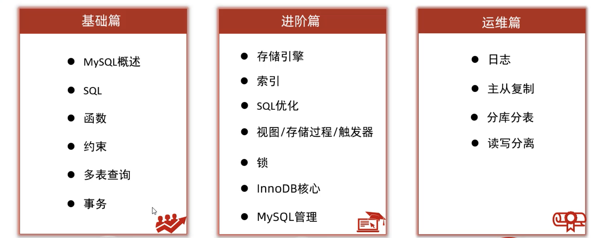
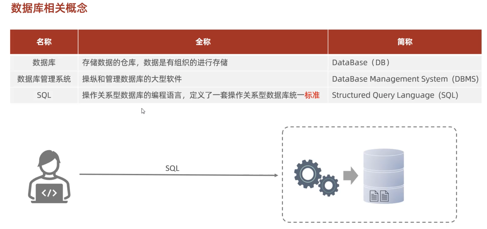
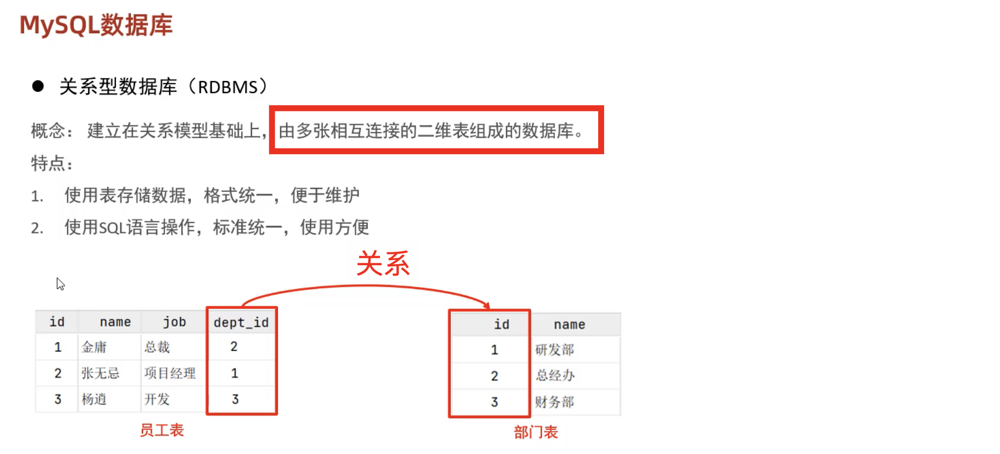
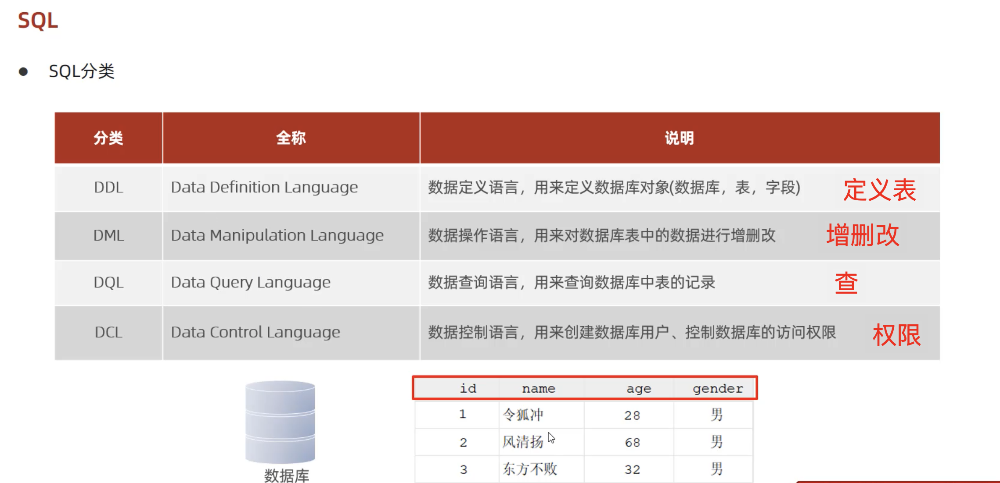
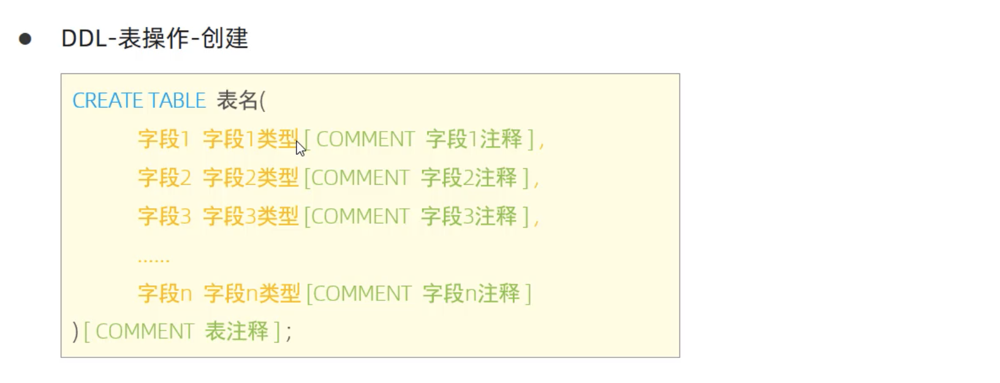

# 总概

1.md是基础篇

2.md是进阶篇

3.md是运维篇






所以不用太担心用了那个数据库管理系统，SQL制定了标准



自己理解：这种通过一定关系组织起来的多张表，就是关系型-数据库


# SQL：



## DDL：

库操作：

```sql
# 查所有：
show databases;
# 查当前：
select database();
# 创建：
create database [if not exists] 数据库名 [default charset 字符集] [collate 排序规则];
# demo: create database wangTest003 default charset utf8mb4;
# utf8mb4一个字符占4个字节，utf8一个字符占3个字节
# 删除
drop database [if exists] 数据库名；
# 使用
use 数据库名；
```

表操作：

```sql
# 查所有表：
show tables;
# 查表结构：
desc 表名；
# 查询指定表的建表语句：
show create table 表名；
```

建表：



demo:

```sql
mysql> create table w01(id int comment '编号',name varchar(30),age int comment '年纪') comment '用户表';
Query OK, 0 rows affected (0.01 sec)

mysql> show tables;
+-----------------------+
| Tables_in_wangtest003 |
+-----------------------+
| w01                   |
+-----------------------+
1 row in set (0.00 sec)

mysql> desc w01;
+-------+-------------+------+-----+---------+-------+
| Field | Type        | Null | Key | Default | Extra |
+-------+-------------+------+-----+---------+-------+
| id    | int         | YES  |     | NULL    |       |
| name  | varchar(30) | YES  |     | NULL    |       |
| age   | int         | YES  |     | NULL    |       |
+-------+-------------+------+-----+---------+-------+
3 rows in set (0.00 sec)
```


08开始
