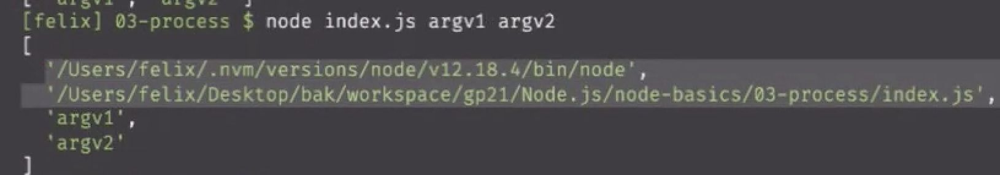

## 5月28号

本系列教程book地址：

[https://lurongtao.gitee.io/felixbooks-gp19-node.js/basics/01-Node.js%E5%9F%BA%E7%A1%80.html](https://lurongtao.gitee.io/felixbooks-gp19-node.js/basics/01-Node.js%E5%9F%BA%E7%A1%80.html)  

  

1、node运行环境

2、npx是什么，和npm区别

[https://blog.csdn.net/caseywei/article/details/108635681](https://blog.csdn.net/caseywei/article/details/108635681)  

  

3、http-server  broswer-async

4、node 13版本以后就支持import

5、浏览器安全沙箱

```
一、概要：浏览器安全可以分为三大块 — Web页面安全、浏览器网络安全、浏览器系统安全
二、从安全的角度看待，为什么浏览器要从单进程发展 ？
对于单进程应用，即整个浏览器只有一个进程。当浏览器出现一些重要的漏洞时，黑客可以直接攻击操作系统，获取操作系统中的用户信息。这毫无疑问是 “核弹” 级别的漏洞。
对于多进程架构的浏览器。即使出现漏洞，那么黑客也只能攻击到渲染进程。而浏览器内核还是安全的。
三、 浏览器安全沙箱：目标 将渲染进程和操作系统隔离。

关键思想是 将安全的操作在浏览器内核进行，不安全的操作统统丢到渲染进程里面进行。
渲染进程负责：1. HTML解析 2. CSS解析 3.图片 解码 4.JavaScript执行 5.布局 6.绘制 7. XML解析

浏览器内核：1. Cookie存储 2.Cache存储 3.网络请求 4.文件读取 5.下载管理 6.SSL/TSL 7.浏览器窗口管理

我们都知道，下载文件是安全的，而执行文件是危险的、有可能遭到攻击的。所以执行文件的操作交给了渲染进程。而下载东西时，渲染进程只是提交请求，而下载东西依靠的是网络进程。
四、安全沙箱如何影响到各个模块功能：

持久化存储。操作系统的文件管理是在浏览器内核完成的，再通过 IPC 与浏览器进程进行通信。
网络访问。
用户交互。事件是由浏览器进程监听的，浏览器通过判断将事件交给 渲染进程 或 浏览器内核 处理。
渲染进程需要渲染出位图，为了显示位图，渲染进程需要将生成好的位图发送到浏览器内核，然后浏览器内核将位图复制到屏幕上。

```

  

6、node如何接受流数据

```
const server = http.createServer((req, res) => {
        if(req.method==='OPTIONS'){
            res.setHeader("Access-Control-Allow-Origin", "*");
            res.statusCode=200;
        }
        if(req.method==='POST'){
          // 存储数组空间
          let msg=[];
          // 接收到数据消息
          req.on('data',(chunk)=>{
            if(chunk){
              msg.push(chunk);
            }
          })
          // 接收完毕
          req.on('end',()=>{
            // 对buffer数组阵列列表进行buffer合并返回一个Buffer
            let buf=Buffer.concat(msg);
            conosole.log(buf)//提取Buffer正确
          })                  
}    
});
server.listen(3000,'127.0.0.1');
```

  

  

7、fs.writeFile(‘./log.txt’, ‘hello’, (err, data) => { // 错误优先

if (err) {

} else {

console.log(‘文件创建成功’)

}

})

  

8、进程管理

process.argv.slice(2)

  

  

9、server

const http = require(‘http’)

http.createServer((req, res) => {

let url = request.url

res.write(url)

res.end()

}).listen(8090, ‘localhost’, () => {

console.log(‘localhost: 8090’)

})

  

10、node模块分类：

内置，比如node里面的path、http等模块

第三方，比如npm发布的包

自定义模块

  

11、nvm 管理node版本

安装办法：在github的nvm仓库有对应的wget或者curl命令

  

12、mac环境变量配置地址： ~/.bash\_profile

  

13、如何查看nodejs发布过哪些包？

1、github 看changlog

2、淘宝镜像里面也可以看版本更新（10分钟同步一次）

3、npm view node versions （列出当前node发布过的版本）

4、nvm list 就能看到node历史版本

  

14、npm使用 Node Package Manager

npm install lodash --global (-g)

npm uninstall lodash --global (-g)

  

15、npm init -y

  

  

16、模块访问简写方式：

比如我们的项目里面安装了gulp包，我们在package.json里面的script里面的书写如下：

查看版本：  

```
"script" : {
 "dev": "./node_modules/gulp/bin/index.js -v"
}
```

其实可以简化为：

```
"script" : {
 "dev": "gulp -v" // 默认去当前目录下的node_modules里面进行查找
}
```