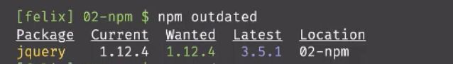
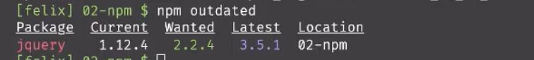
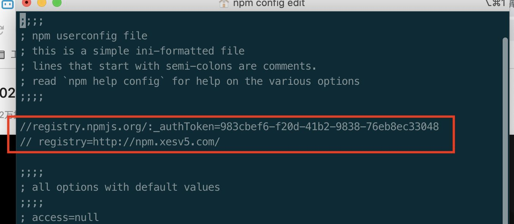
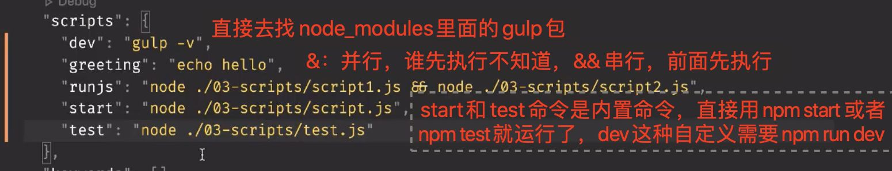

## 5月29号

1、一个包已经安装在dependencies里面，怎么换到devDependencies里面？

直接 npm i xx -D 就会自动切换

  

2、列出项目里面npm包依赖关系

npm list

如果只想看某一个的依赖：

npm list | grep lodash

  

3、当我们新拉取一个项目(意思没有node\_modules)，dependencies和devDependencies的依赖，我们只想安装生产环境的依赖：

npm i --production (只有\--production，没有--deve....)

  

4、npm安装某个包的具体版本  
npm i lodash@1.2.0 

如果想安装某个大版本里面的最高版本，我们可以这么安装：

npm i lodash@1 

如果不写@，默认安装最高版本

  

5、node package versions

eg： 13.4.0

major：13 ， minor：4 ，patch：0 （约定：偶数代表稳定patch，奇数是不稳定的patch）

  

6、“jQuery”： “^1.12.4”，里面的^是什么含义?

  

npm outdated 可以列出当前项目的依赖的包版本情况

^：表示锁定major版本号

比如我们知道jqeruy的2版本的最高版本是2.2.4，我们将上面的依赖改成：“jQuery”： “^2.0.0”（注意：这里之前已经安装了1.12.4版本），这个时候执行npm outdated:

  

发现期望的版本和已经安装的版本，和我们自己改动的“jQuery”： “^2.0.0”一点关系都没有，执行npm update:

安装的jQuery是2.2.4版本

  

~：锁定major和minor版本号

  

“jQuery”： “2.0.0”：前面不加任何版本限制，代表只能安装当前版本  

  

“jQuery”： “\*”：代表一直安装最新版本  

  

7、清除npm缓存：比如安装一半网络中断，以后因为缓存一直安装一直失败

npm cache clean --force

  

8、\_\_dirname：代表当前文件在当前机器上的物理路径

  

9、package.json中的main作用?

暴露出去，让使用你npm包的人知道入口在哪里

  

10、npm发布流程？

在当前根目录下执行： npm adduser (发布前注意源地址指向是不是对的)

npm login

npm publish (unpublish) (--force)

  

  

11、npm切换源

npm获取源：npm config get registery

npm设置源：npm config set registery xx

  

或者直接去npm config eidt里面通过vim改动：

  

  

12、package.json里面的script注意事项

  

  

13、读取packages.json里面的配置：

比如我们在packag.json里面新加了一个字段：

```
“config”: {
  "env": "production"
}，
“script” : {
  "dev": "node ./1.js"，
  “env”: "echo $npm_package_config_env"
}
```

1.js里面书写：

```
console.log(process.env.npm_package_config_env)
```

  

  

在【npm脚本环境下】可以通过npm run dev来读取结果是： ”production“，

如果直接通过运行 node ./1.js是读取不到npm里面的config配置的，结果： undefined

  

直接运行： npm run build也可以读取到当前package.json里面的config配置结果： ”production“