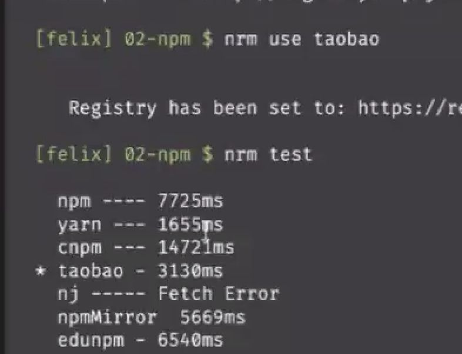
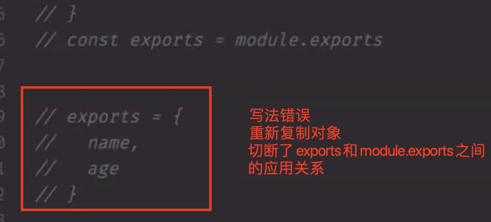

## 5月31号

1、github资源下载方式： https   ssh   github cli

  

2、ssh方式：

- 第一步，查看是否已经有公私钥：  
    ls -al ~/.ssh
- 第二步：生成公私钥：  
    ssh-keygen -t rsa -C “email”
- 复制公钥：  
    pbcopy < ~/.ssh/id\_rsa.pub

  

3、npm脚本注入自定义变量：

```
”script“: {
  "dev": "NODE_ENV=development ..."
}
```

  

4、cross-env 解决问题：

跨平台兼容问题

  

5、nrm :  npm registery manager

nrm ls

nrm use taobao 

nrm test 

  

  

6、npx： npm5.2版本后引入的

（1）能够直接找到当前项目安装的node\_moduels里面的依赖，比如: npx gulp -v 

（2）如果本地没有安装gulp，执行npx gulp -v 它会讲gulp安装到本地一个临时目录（并不是全局环境，也不是当前的工程目录），这个包的安装目录好处：不会污染全局环境，适合于临时构建的一些命令依赖，但是这个到底是全局安装还是禁止，有对应的参数：

npx --no-install http-server 如果没有安装http-server，就不安装 （注意顺序）

npx -\-ignore-existing http-server  不管是否本地安装，都要重新安装（最新的）

  

7、commonJs是node的第三方规范

浏览器是没有require这个方法的，node里面就有，node把commonjs内置了

commonJS规范里面module.exports = exports

  

  

  

8、CommonJS 和ES Module区别

[https://blog.csdn.net/fhjdzkp/article/details/109384991](https://blog.csdn.net/fhjdzkp/article/details/109384991)  

commonjs和esModule: 简单数据类型：commonjs是拷贝（第一次拷贝后就不在读取被拷贝的文件），es6是引用（会同步变化）， 复杂数据类型：commonjs是拷贝浅拷贝（用的事用一个地址），es6和简单数据类型一样，肯定也是公用一个地址，表现和commonjs一致  

  

9、url.parse(url) ，把url解析成对象获取path，query等等参数

url.format() 把对象解析成URL地址

url.resolve(”http://www.baidu.com/a”, ‘../’)  → “[http://www.baidu.com](http://www.baidu.com)”

```
const myURL = new URL('https://example.org/?abc=123'); // 谷歌下面也能直接使用
console.log(myURL.searchParams.get('abc'));
// Prints 123

myURL.searchParams.append('abc', 'xyz');
console.log(myURL.href);
// Prints https://example.org/?abc=123&abc=xyz

myURL.searchParams.delete('abc');
myURL.searchParams.set('a', 'b');
console.log(myURL.href);
// Prints https://example.org/?a=b

const newSearchParams = new URLSearchParams(myURL.searchParams);
// The above is equivalent to
// const newSearchParams = new URLSearchParams(myURL.search);

newSearchParams.append('a', 'c');
console.log(myURL.href);
// Prints https://example.org/?a=b
console.log(newSearchParams.toString());
// Prints a=b&a=c

// newSearchParams.toString() is implicitly called
myURL.search = newSearchParams;
console.log(myURL.href);
// Prints https://example.org/?a=b&a=c
newSearchParams.delete('a');
console.log(myURL.href);
// Prints https://example.org/?a=b&a=c

```

  

  

10、log4js用途：用于记录js

cosnt log4js = require(”log4js”)

log4js.configure = ({...})

var loger = log4js.getLogger()

loger.level = ‘debug’  

  

执行loger.debug(要打印的内容)，就会把打印的内容保存到一个带有时间的文件里面去