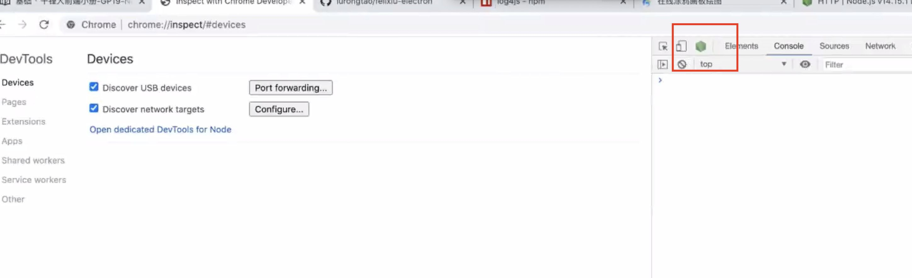
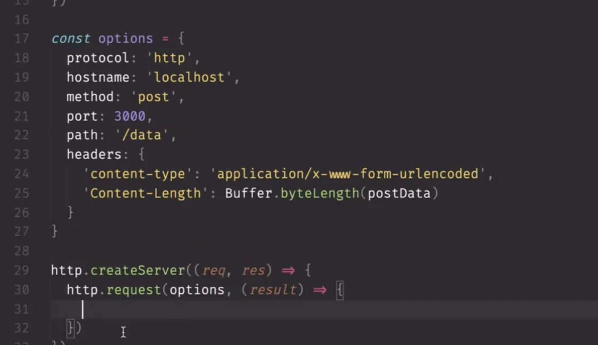

6月1日

1、查看querystring的常见用法 unescape用法

2、http / https

```
http.createServer((req, res) => {
  response.wirite('test')
  response.end()
})
```

createServer接受函数，所以叫做高阶函数 

  

3、node在chrome里面进行调试：（启动chrome的node调试图标）

node --inspect  \--inspect-brk  a.js

  

调试环境配置：（chrome）

[https://blog.csdn.net/huzhenv5/article/details/103513125](https://blog.csdn.net/huzhenv5/article/details/103513125)  

  

4、node进程管理工具：

nodemon （本地调试使用）

supervisor

forever

pm2

之前启动服务：

node a.js， 现在nodemon a.js

  

5、返回数据：

response.write(200, {

  ‘content-type’: ‘text/html’  

})

response.write(’<div>haha</div>’)

response.end()

  

6、取数据：

http://www.bad.com/a/b

const url = request.url // url = ‘/a/b’

request.on(’data’ chunk => {})

request.end(’data’ chunk => {})

这里把参数接收下来后还是字符串，需要querystring.parse()来做字符串 =》 对象转化

  

7、接口测试工具： postman 、 insomnia

学习insomnia使用

  

8、 查看content-type的四种类型

  

9、补全这里的逻辑

  

  

21开始