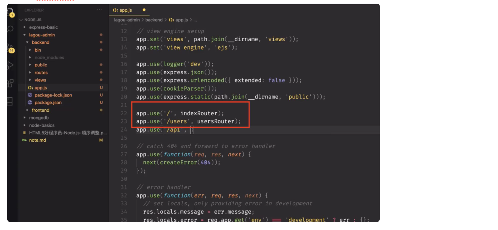

## 6月11号

从80开始：

昨天的课程本来是61-65，调整到68-72，今天：73-79（纯前端老代码方案，了解即可），62-67的内容是后面100多集左右再回来接着看

80集开始

1、后端生成项目模板： express-genator全局安装：

执行：express -e （-e表示用ejs模板) 生成标准后端项目模板

执行： nodemon ./bin/www



mongoose文档：

[http://mongoosejs.net/docs/index.html](http://mongoosejs.net/docs/index.html)

80-81： 讲解注册用户前端页面，用bootstrap进行的页面排版，并准备好了前端请求接口（简单看看就行）

82：初始化后端模板，编写第一个后端接口

83：mongoDB + mongoose 操作数据 (mongoose使用文档：[http://mongoosejs.net/docs/index.htmll)](http://mongoosejs.net/docs/index.htmll))

84： mongoose 插入第一条数据，bcrypt进行密码加密，cors解决跨域


mongoDB：

使用某个表：use xx （如果没有这个表就代表要创建一个新表，并且要添加一条数据才真的创建成功）

删表： db.dropDatabase()

创建集合：db.createCollection("article")

删除集合：db.article.drop()

增： insert

查： find

```
db.collection.find(query, projection)
# query：查询条件，类似于SQL中的WHERE部分
# projection：可选，使用投影操作符指定返回的键
```


更新：

```
db.collection.update(
   <query>,
   <update>,
   {
     multi: <boolean>
   }
)
# query：修改的查询条件，类似于SQL中的WHERE部分
# update：更新属性的操作符，类似与SQL中的SET部分
# multi：设置为true时会更新所有符合条件的文档，默认为false只更新找到的第一条
```

删除：

```
db.collection.remove(
   <query>,
   {
     justOne: <boolean>
   }
)
# query：删除的查询条件，类似于SQL中的WHERE部分
# justOne：设置为true只删除一条记录，默认为false删除所有记录
```

limit

skip

sort

## mongoose：

链接：

```
// connection.js file
const mongoose = require('mongoose');
const conn = mongoose.createConnection(

  // 连接地址，MongoDB 的服务端口为27017
  // dbtest是我要使用的数据库名，当往其中写数据时，MongoDB 会自动创建一个名为dbtest的数据库，不用事先手动创建。
  'mongodb://127.0.0.1:27017/dbtest', 

  // 一些兼容配置，必须加，你不写运行的时候会提示你加。
  {
    useNewUrlParser: true,
    useUnifiedTopology: true
   }
)
conn.on('open', () => {
	console.log('打开 mongodb 连接');
})
conn.on('err', (err) => {
	console.log('err:' + err);
})
```

增：

```
// insert.js file
let mongoose = require('mongoose');

// 导入连接模块
let connection = require('./connection');

// 创建schema
let StudentSchema = new mongoose.Schema({
   name: String,
   age: Number
})

// 通过connection和schema创建model
let StudentModel = connection.model('Student', StudentSchema);


// 通过实例化model创建文档
let studentDoc = new StudentModel({
    name: 'zhangsan',
    age: 20
})

// 将文档插入到数据库，save方法返回一个Promise对象。
studentDoc.save().then((doc) => {
    console.log(doc)
})
```

读：

model.find

更新：

StudentModel.update({name: 'lisi'}, {age: 80}).then(result => { console.log(result) })

update 方法接收2个参数，第一个是查询条件，第二个是修改的值

删除：

`remove`|`removeOne`|`removeMany`|`bulkWrite`方法
