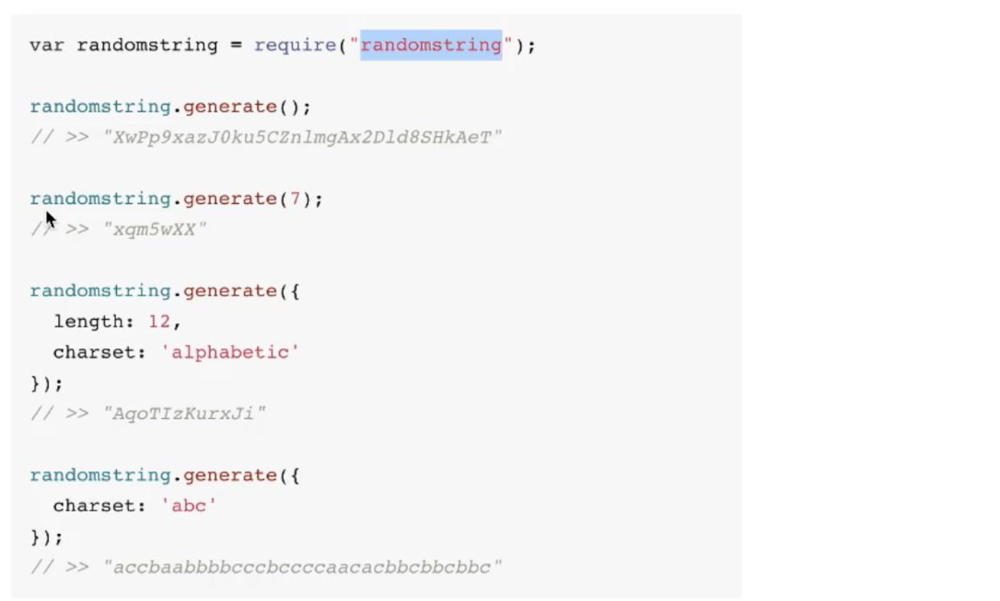
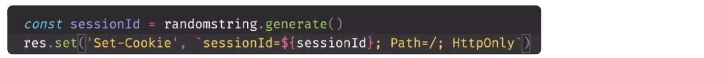
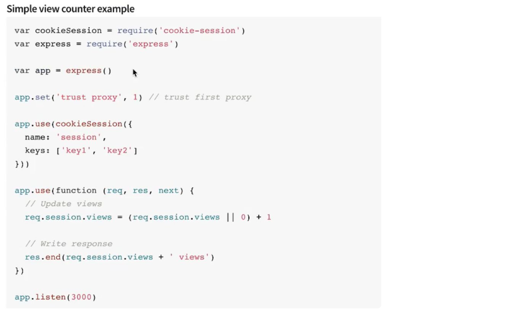

## 6月14号

85 -94 ：都在操作增删改查，而且都是jquery操作+mongoDB的api使用，简单学习跳过

95：

登录态的处理方案：

方案1、登录接口，后端生成一个session，然后返回前端一个cookie，前端下次请求带上这个cookie和session（可以放缓存（服务器不能宕机），redis，也可以放数据库）进行比对，ok就放行 （这个方案需要后端存用户的登录态）

方案2、基于token的方案，其实就是一个令牌（门票），验票通过就放行，后端不用存储登录信息（方案2较多）

方案3、OAuth：比如微信的登录，其实就是自己存一个串，然后对方计算一个串，两个串进行比较

方案1：

用户密码的比较，数据库中存储了对应的用户信息（密码是密文存储（hash）），用户登录，先查库确认用户是否存在，然后用bcrpyt.compare方法进行比较用户登录的密码和库里面的密码，如果是true，就开始生成cookie，并返回前端：

第一步：生成hash值



第二步：种cookie



tips：一般我们的图片资源都不要放在和html，js，ajax接口同域下面，因为我们一旦登录后，同域下面所有的请求都会带上登录态，如果图片太多，图片都会主动的加上登录态，导致网站性能下降，所以我们习惯将静态资源（主要指图片）放到CDN，而css，js，html这些还是放到对应的服务器就行，因为这些资源变动快

第三步：上面的cookie，session是模拟的过程，正常我们应该使用npm包：cookie-session来完成上面的流程：



总体梳理流程：

当我们使用bcrpyt.compare完成登录比较后，就在req.session.username = username，当访问某一个接口需要登录态的时候，我们就可以加一个鉴权的中间件（我们新建一个middleware的文件夹，里面就放置中间件的函数，进行暴露）,并将函数添加到需要鉴权的路由上去：比如：

```
app.get('/',auth, getlist)
```

如果我们在使用controller：getlist获取接口数据之前需要使用auth函数进行鉴权，在auth里面，只是进行了一个判断：req.session.username是否存在，不存在就412
