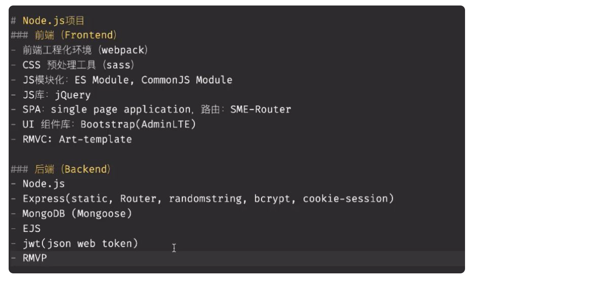
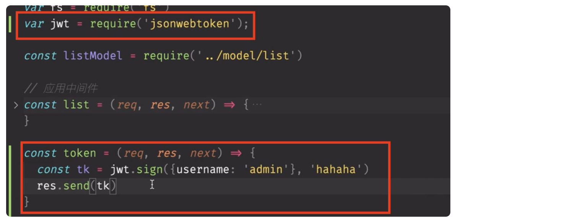
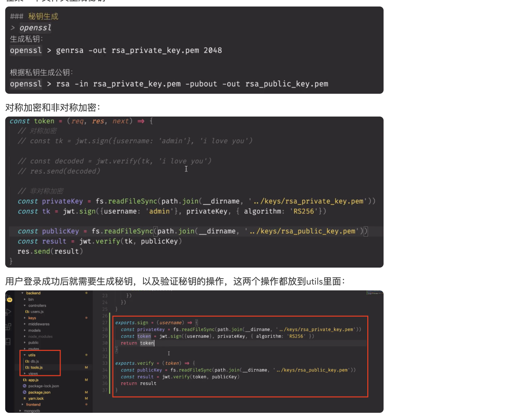
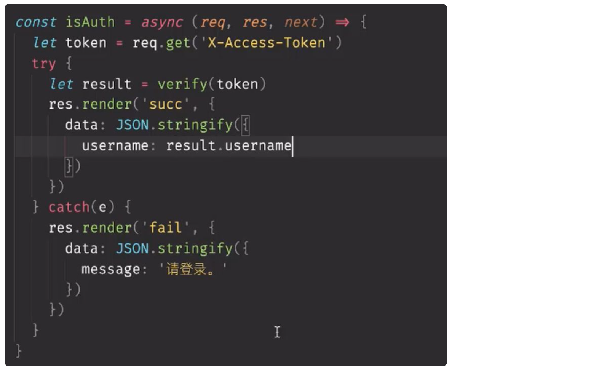

## 6月15号

token鉴权的方案：

后端生成一个hash串：token，然后返回给前端，前端进行存储，每次请求都需要带上这个token，这个方案叫做：JWT，Json Web Token，对应npm包：jsonwebtoken,可以进行对称加密，也可以进行非对称加密

第一次访问生成token：

在某一个文件夹生成秘钥：

在登录成功后，sign一个token，然后可以放到响应体，也可以放到自定义头部字段里面去返回前端，这里前端获取相应的头部自定义字段可能有坑：

[https://www.cnblogs.com/lanshengzhong/p/10156933.html](https://www.cnblogs.com/lanshengzhong/p/10156933.html)

tips：一般自定义头部字段都用X-Access-Token,这种格式来写（约定）

之前验证登录的中间件，是依靠登录成功后在请求头上放了一个自定义的对象，放置username字段，有这个字段就代表成功，现在改成JWT登录后，这里面的Auth就可以改成：

