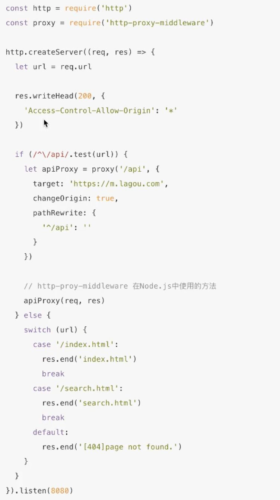

## 6月2号

1、当我们使用github上面的包当做npm依赖，安装如下：

  

2、jsonp：浏览器请求js不会跨域的特性

前端：页面通过http-server -p 9000 跑在9000端口下

  

前端改进：

  

  

后端：

  

后端改进：

  

  

3、第三方CDN源：BootCDN

  

  

4、cores：跨源资源共享

  

  

5、查看端口占用：lsof -i:8080

  

  

6、跨域node中间件：http-proxy-middleware  正向代理

  

新版本使用http-proxy-middleware结构出来的createProxyMiddleware

