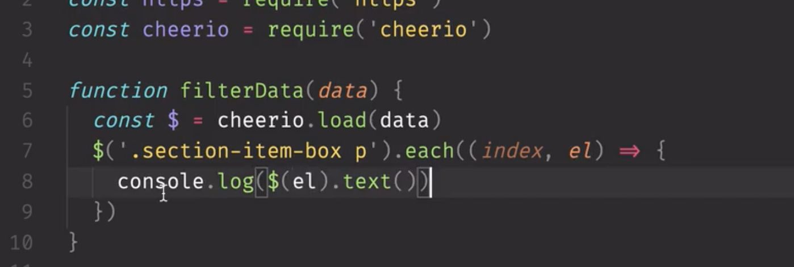
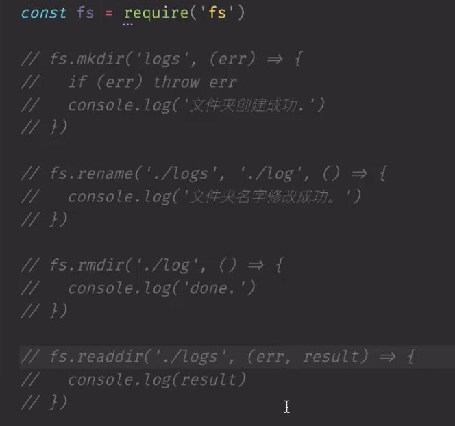
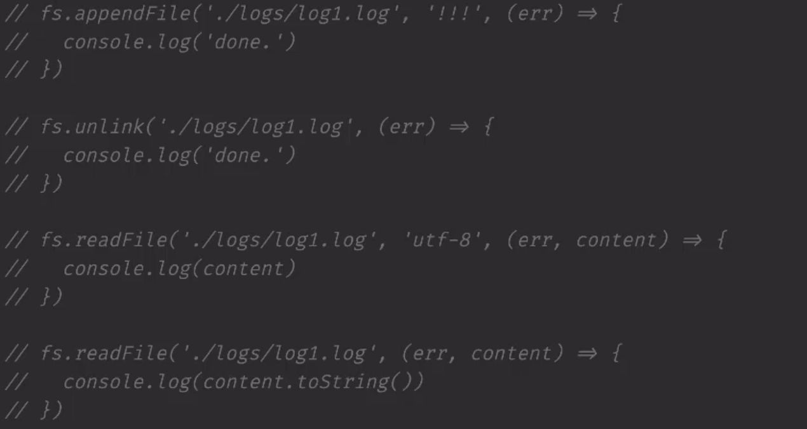
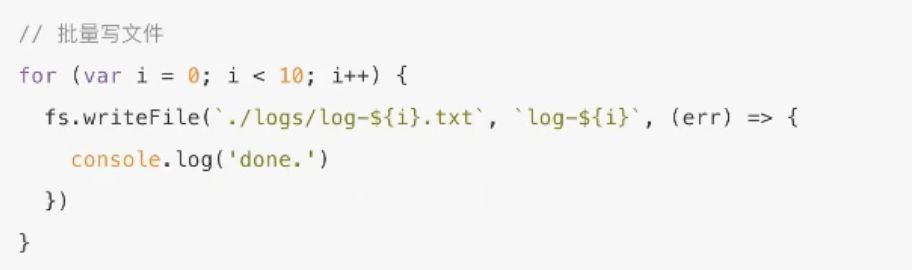
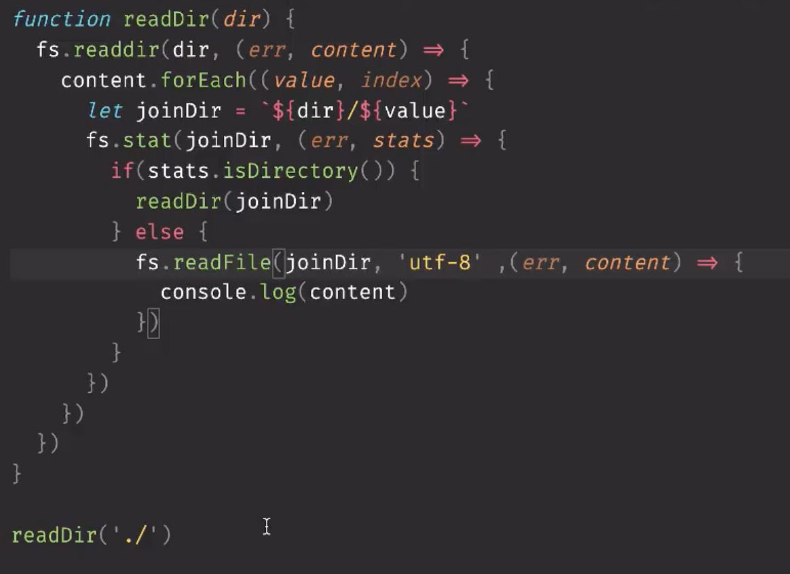
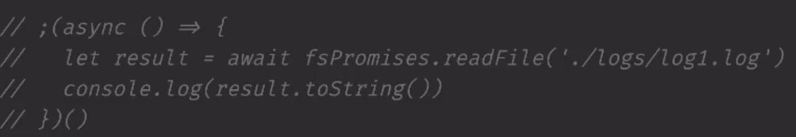
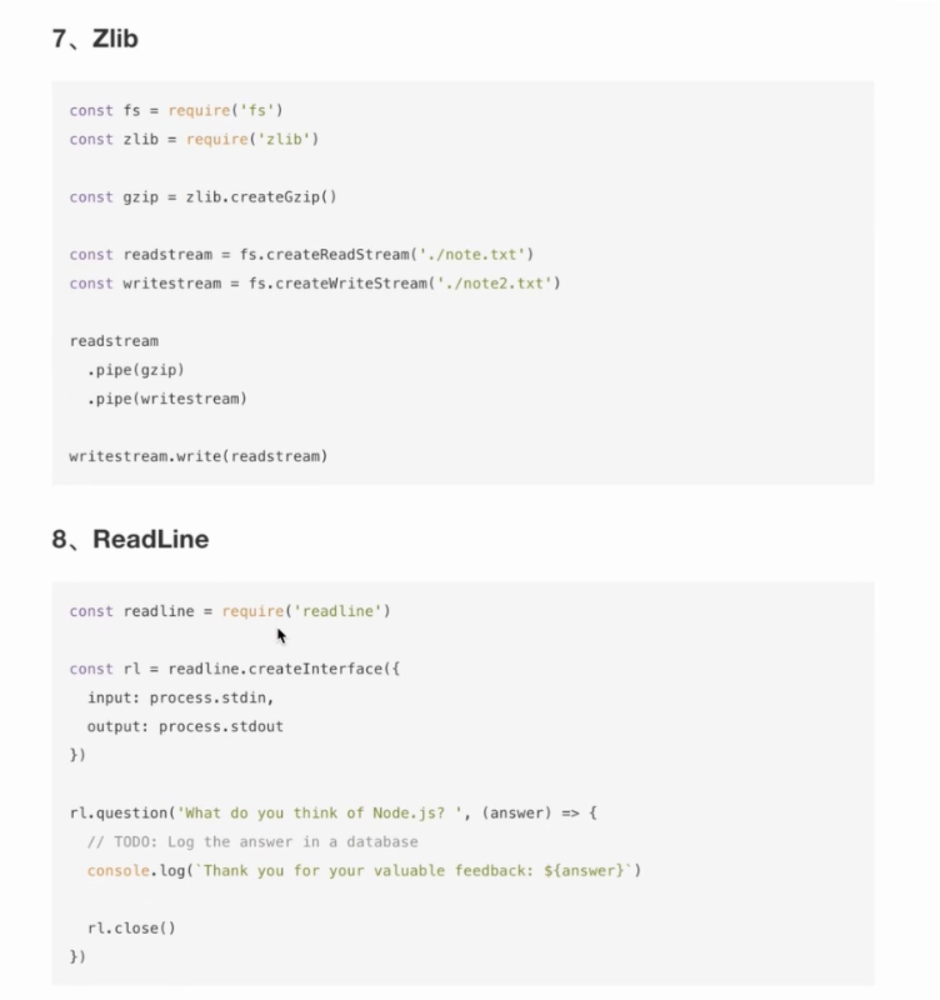

## 6月3号

1、python 方向： 爬虫 、 web服务、数据分析

  

cheerio库，将爬取的DOM字符串，转换成DOM结构的JSON数据

  

  

2、event模块 ： node的时间发布和订阅模块

  

3、fs模块： 

异步操作：

fs.mkdir

fs.rename

fs.rmdir

fs.readdir 读取的内容是数组

  

fs.writeFile ( \\n 是newline的含义)

fs.appendFile ： 在原来文件的基础上添加内容

fs.unlink:  删除文件内容

fs.readFile 

  

  

同步操作： 上面操作 fs.xxxSync()

fs.reafFileSync

  

  

  

目录遍历读取内容：

  

  

使用fs的promise写法：

```
const fsPromises =  require('fs').promises // node 10.0.0 + 版本提供
```

  

  

  

fs.watch 和 fs.watchFile区别？

  

文件的操作都是流的操作，一个pipe干一个事

  

