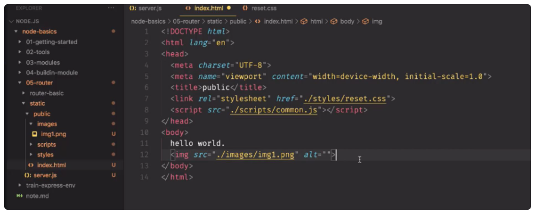
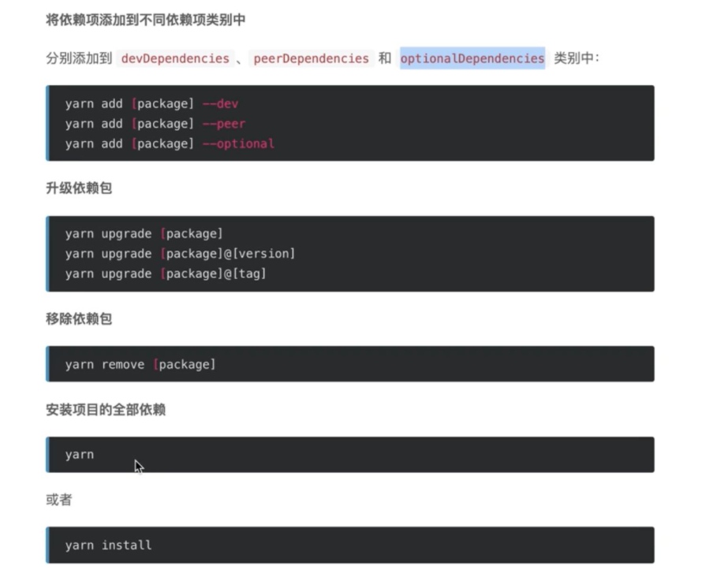
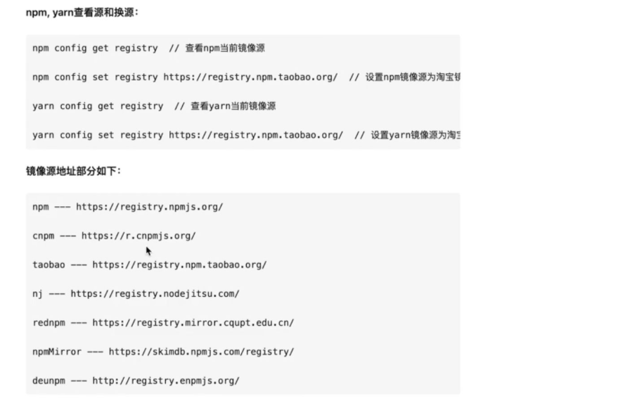

## 6月8号

1、自己写一个静态资源中间件

/server.js

```
// 引入相关模块
var http = require('http');
var url = require('url');
var path = require('path');
var readStaticFile = require('./modules/readStaticFile');

// 搭建 HTTP 服务器
var server = http.createServer(function(req, res) {
  var urlObj = url.parse(req.url);
  var urlPathname = urlObj.pathname;
  var filePathname = path.join(__dirname, "/public", urlPathname);

  // 读取静态文件
  readStaticFile(res, filePathname);
});

// 在 3000 端口监听请求
server.listen(3000, function() {
  console.log("服务器运行中.");
  console.log("正在监听 3000 端口:")
})
```

/modules/readStaticFile.js

```
// 引入依赖的模块
var path = require('path')
var fs = require('fs')
var mime = require('mime')

function readStaticFile(res, filePathname) {

  var ext = path.parse(filePathname).ext
  var mimeType = mime.getType(ext) || 'text/html' // 可能是文件夹

  // 判断路径是否有后缀, 有的话则说明客户端要请求的是一个文件 
  if (ext) {
    // 根据传入的目标文件路径来读取对应文件
    fs.readFile(filePathname, (err, data) => {
    // 错误处理
      if (err) {
        res.writeHead(404, { "Content-Type": "text/plain" })
        res.write("404 - NOT FOUND")
        res.end()
      } else {
        res.writeHead(200, { "Content-Type":`${mimeType}`; 'charset=utf-8' })
        res.write(data)
        res.end()
      }
    });
    // 返回 true 表示, 客户端想要的 是 静态文件
    return true
  } else {
    // 返回 false 表示, 客户端想要的 不是 静态文件
    return false
  }
}

// 导出函数
module.exports = readStaticFile
```

相应的前端静态资源如下：



注意：

这里使用了ext来判断是否是请求文件，这么做的好处，相对于fs.existsSync:

fs.existsSync是用来判断文件或者文件夹是否存在，如果请求的路径是/public，一样判断成功，这个时候还需要进一步判断/public下面的文件是否存在，这样就冗余了，没有用ext拿来做判方便

2、异步函数如果被封装成了async、await形式，被调用的时候一定要在最外层的调用写上await，不然不生效

3、yarn （同npm工具）

yarn init



4、依赖包的种类（只做了解）

**devDependencies、peerDependencies 和 optionalDependencies区别**

在一个Node.js项目中，package.json几乎是一个必须的文件，它的主要作用就是管理项目中所使用到的外部依赖包，同时它也是npm命令的入口文件。

npm 目前支持以下几类依赖包管理：

* dependencies
* devDependencies
* peerDependencies
* optionalDependencies
* bundledDependencies / bundleDependencies

**dependencies**

应用依赖，或者叫做业务依赖，这是我们最常用的依赖包管理对象！它用于指定应用依赖的外部包，这些依赖是应用发布后正常执行时所需要的，但不包含测试时或者本地打包时所使用的包。

**devDependencies**

开发环境依赖，仅次于dependencies的使用频率！它的对象定义和dependencies一样，只不过它里面的包只用于开发环境，不用于生产环境，这些包通常是单元测试或者打包工具等，例如gulp, grunt, webpack, moca, coffee等。

**peerDependencies**

同等依赖，或者叫同伴依赖，用于指定当前包（也就是你写的包）兼容的宿主版本。如何理解呢？ 试想一下，我们编写一个gulp的插件，而gulp却有多个主版本，我们只想兼容最新的版本，此时就可以用同等依赖（peerDependencies）来指定。

```
{
  "name": "gulp-my-plugin",
  "version": "0.0.1",
  "peerDependencies": {
    "gulp": "3.x"
  }
}
```

**optionalDependencies**

可选依赖，如果有一些依赖包即使安装失败，项目仍然能够运行或者希望npm继续运行，就可以使用optionalDependencies。另外optionalDependencies会覆盖dependencies中的同名依赖包，所以不要在两个地方都写。

**bundledDependencies / bundleDependencies**

打包依赖，bundledDependencies是一个包含依赖包名的数组对象，在发布时会将这个对象中的包打包到最终的发布包里。

5、yarn源的问题：



6、演进路径：express =》 koa =》 egg

7、express环境生成器：

npm i -g express-generator

执行： express
