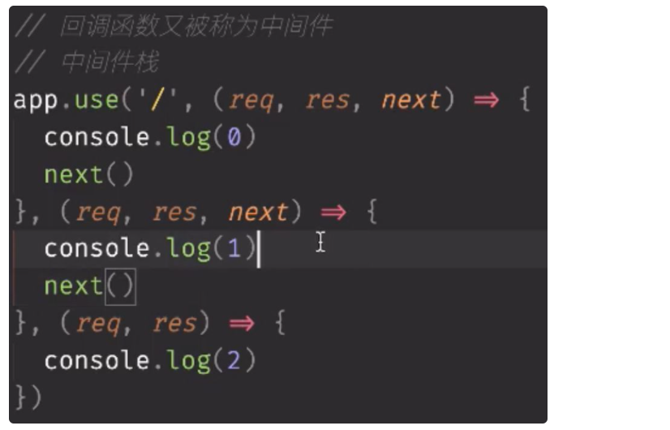
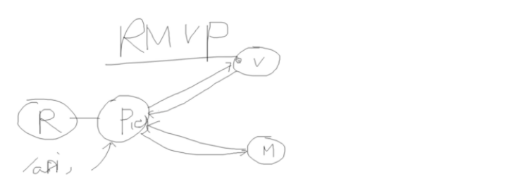
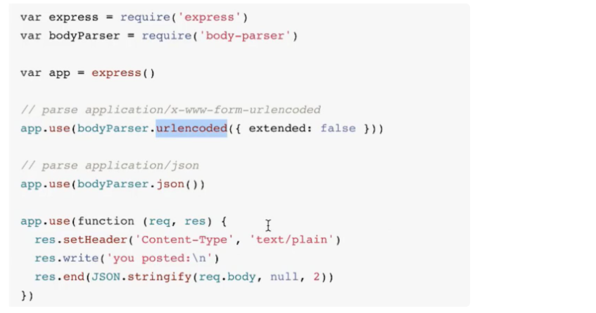
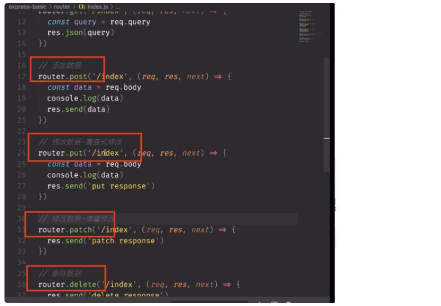
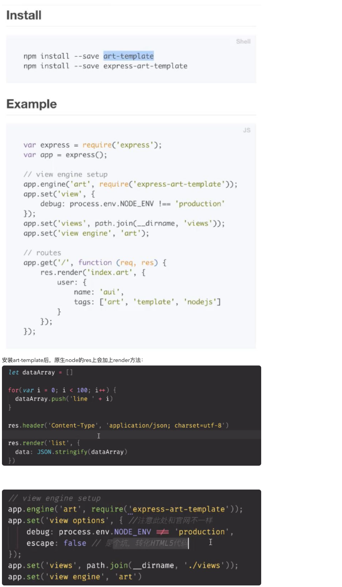

6月9号

1、 express => hello world

```
var express = require('express');
var app = express();

app.get('/', function (req, res) {
  res.send('Hello World!');
});

var server = app.listen(3000, function () {
  var host = server.address().address;
  var port = server.address().port;

  console.log('Example app listening at http://%s:%s', host, port);
});
```

2、 app.use解析路径是从上至下的进行匹配

3、中间件+中间件栈



3、MVC



R: request操作，主要进行router各个路径的拦截（拦截后需要用方法处理，一般写在controller里面进行暴露）

  

M: model，提供数据源

V: view模板，常用模板ejs，jade，pug，art-template……

P: 就是MVC里面的C，这里面写处理路由的方法，进行暴露 （这里把model提供的数据和view层进行结合）

4、body-parser

单独安装使用如下：



他应该是被express内置了，有另外的写法（待考证）

5、http请求方法的区别



put： 全部改动（全部覆盖）

patch： 改一个（类似打补丁）

router.all(‘/xxx’, (req, res, next) => {res.send(’1’)})   来者不拒，不区分方法

确切的语义好处：一个路径不同方法也可以实现请求的拦截

6、中间件种类：

1、应用中间件，自己写的

2、路由中间件，定义的路由

3、第三方中间件，比如body-parser

4、内置中间件，比如app.use(express.static(’public’))里面的static

7、页面渲染

SSR： server side render

CSR： client side render

8、art-template应用：服务端和客户端都可以使用

这里是以服务端为例：



因为前段不能操作文件，这里前端使用art-template十分的鸡肋，也只能定义或者引入模板来进行传参渲染，体验太差

9、path.join 和 path.resolve区别？

[https://blog.csdn.net/weishachucuo/article/details/111562943](https://blog.csdn.net/weishachucuo/article/details/111562943)
