1、环境配置

# 【改文件前备份文件】

composer的安装：（php版本的npm）

[https://www.jianshu.com/p/fd1b53df3f4b/](https://www.jianshu.com/p/fd1b53df3f4b/)

Linux平台LAMP是经典搭配，因为Linux，Apache，MySQL,PHP都开源

windows平台: WAMP

mac平台:MAMP（mac自带apache和php，所以只需要安装mysql就行）

查看apache版本

```
sudo apachectl -v
```

启动：

```
sudo apachectl start
```

重启：

```
sudo apachectl restart
```

停止：

```
sudo apachectl stop
```

更改apache的静态资源目录：

/etc/apache2/http.conf 里面的DocumentRoot：

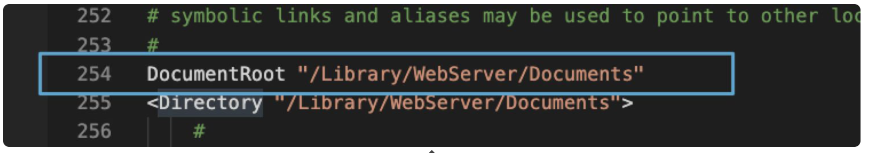

这个文件目录里面改动文件很麻烦（没读写权限）: sudo chmod -R 777 /Library/WebServer/Documents

如果是开启虚拟站点：


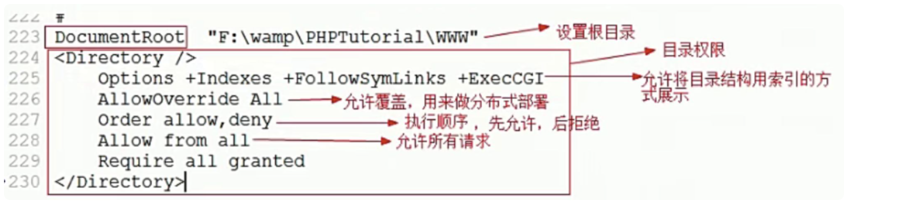

tips：目录权限的第一句话上线必须删除（安全问题）

开启apache的php扩展：


但是是php7，这个时候，我们想办法把php7切换回php5：

[https://www.jianshu.com/p/e6ae669a9b0f](https://www.jianshu.com/p/e6ae669a9b0f)

cmd: php -v  # 7.3.11

cmd: httpd -v  # Server version: Apache/2.4.41 (Unix)

cmd: httpd -t

这个第一次运行会报错：

AH00558: httpd: Could not reliably determine the server's fully qualified domain name, using 10.25.188.86. Set the 'ServerName' directive globally to suppress this message

改动： /private/etc/apache2/httpd.conf

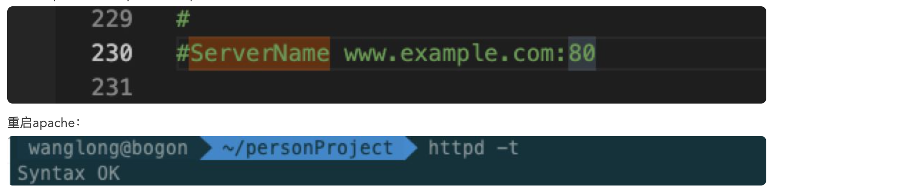

表示apache运行良好

从服务端的角度看动态页面和静态页面的定义：

静态页面：服务端不执行的页面

动态页面：服务端执行的页面


查看端口占用：

sudo lsof -i:80

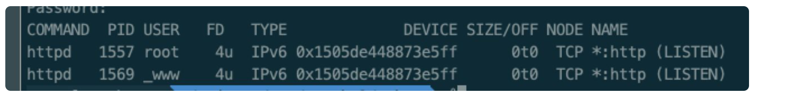

查看apache（httpd）是否正常开启

tips:

cmd: netstat -ano是windows环境查看端口的指令

查看apache服务状态：

amd： apachectl configtest

到目前为止，对/private/etc/apache2/httpd.conf文件进行配置备份：

```
#
# This is the main Apache HTTP server configuration file.  It contains the
# configuration directives that give the server its instructions.
# See <URL:http://httpd.apache.org/docs/2.4/> for detailed information.
# In particular, see 
# <URL:http://httpd.apache.org/docs/2.4/mod/directives.html>
# for a discussion of each configuration directive.
#
# Do NOT simply read the instructions in here without understanding
# what they do.  They're here only as hints or reminders.  If you are unsure
# consult the online docs. You have been warned.  
#
# Configuration and logfile names: If the filenames you specify for many
# of the server's control files begin with "/" (or "drive:/" for Win32), the
# server will use that explicit path.  If the filenames do *not* begin
# with "/", the value of ServerRoot is prepended -- so "logs/access_log"
# with ServerRoot set to "/usr/local/apache2" will be interpreted by the
# server as "/usr/local/apache2/logs/access_log", whereas "/logs/access_log" 
# will be interpreted as '/logs/access_log'.


#
# ServerRoot: The top of the directory tree under which the server's
# configuration, error, and log files are kept.
#
# Do not add a slash at the end of the directory path.  If you point
# ServerRoot at a non-local disk, be sure to specify a local disk on the
# Mutex directive, if file-based mutexes are used.  If you wish to share the
# same ServerRoot for multiple httpd daemons, you will need to change at
# least PidFile.
#
ServerRoot "/usr"


#
# Mutex: Allows you to set the mutex mechanism and mutex file directory
# for individual mutexes, or change the global defaults
#
# Uncomment and change the directory if mutexes are file-based and the default
# mutex file directory is not on a local disk or is not appropriate for some
# other reason.
#
# Mutex default:/private/var/run


#
# Listen: Allows you to bind Apache to specific IP addresses and/or
# ports, instead of the default. See also the <VirtualHost>
# directive.
#
# Change this to Listen on specific IP addresses as shown below to 
# prevent Apache from glomming onto all bound IP addresses.
#
#Listen 12.34.56.78:80
<IfDefine SERVER_APP_HAS_DEFAULT_PORTS>
    Listen 8080
</IfDefine>
<IfDefine !SERVER_APP_HAS_DEFAULT_PORTS>
    Listen 80
</IfDefine>


#
# Dynamic Shared Object (DSO) Support
#
# To be able to use the functionality of a module which was built as a DSO you
# have to place corresponding `LoadModule' lines at this location so the
# directives contained in it are actually available _before_ they are used.
# Statically compiled modules (those listed by `httpd -l') do not need
# to be loaded here.
#
# Example:
# LoadModule foo_module modules/mod_foo.so
#
#LoadModule mpm_event_module libexec/apache2/mod_mpm_event.so
LoadModule mpm_prefork_module libexec/apache2/mod_mpm_prefork.so
#LoadModule mpm_worker_module libexec/apache2/mod_mpm_worker.so
LoadModule authn_file_module libexec/apache2/mod_authn_file.so
#LoadModule authn_dbm_module libexec/apache2/mod_authn_dbm.so
#LoadModule authn_anon_module libexec/apache2/mod_authn_anon.so
#LoadModule authn_dbd_module libexec/apache2/mod_authn_dbd.so
#LoadModule authn_socache_module libexec/apache2/mod_authn_socache.so
LoadModule authn_core_module libexec/apache2/mod_authn_core.so
LoadModule authz_host_module libexec/apache2/mod_authz_host.so
LoadModule authz_groupfile_module libexec/apache2/mod_authz_groupfile.so
LoadModule authz_user_module libexec/apache2/mod_authz_user.so
#LoadModule authz_dbm_module libexec/apache2/mod_authz_dbm.so
#LoadModule authz_owner_module libexec/apache2/mod_authz_owner.so
#LoadModule authz_dbd_module libexec/apache2/mod_authz_dbd.so
LoadModule authz_core_module libexec/apache2/mod_authz_core.so
#LoadModule authnz_ldap_module libexec/apache2/mod_authnz_ldap.so
LoadModule access_compat_module libexec/apache2/mod_access_compat.so
LoadModule auth_basic_module libexec/apache2/mod_auth_basic.so
#LoadModule auth_form_module libexec/apache2/mod_auth_form.so
#LoadModule auth_digest_module libexec/apache2/mod_auth_digest.so
#LoadModule allowmethods_module libexec/apache2/mod_allowmethods.so
#LoadModule file_cache_module libexec/apache2/mod_file_cache.so
#LoadModule cache_module libexec/apache2/mod_cache.so
#LoadModule cache_disk_module libexec/apache2/mod_cache_disk.so
#LoadModule cache_socache_module libexec/apache2/mod_cache_socache.so
#LoadModule socache_shmcb_module libexec/apache2/mod_socache_shmcb.so
#LoadModule socache_dbm_module libexec/apache2/mod_socache_dbm.so
#LoadModule socache_memcache_module libexec/apache2/mod_socache_memcache.so
#LoadModule socache_redis_module libexec/apache2/mod_socache_redis.so
#LoadModule watchdog_module libexec/apache2/mod_watchdog.so
#LoadModule macro_module libexec/apache2/mod_macro.so
#LoadModule dbd_module libexec/apache2/mod_dbd.so
#LoadModule dumpio_module libexec/apache2/mod_dumpio.so
#LoadModule echo_module libexec/apache2/mod_echo.so
#LoadModule buffer_module libexec/apache2/mod_buffer.so
#LoadModule data_module libexec/apache2/mod_data.so
#LoadModule ratelimit_module libexec/apache2/mod_ratelimit.so
LoadModule reqtimeout_module libexec/apache2/mod_reqtimeout.so
#LoadModule ext_filter_module libexec/apache2/mod_ext_filter.so
#LoadModule request_module libexec/apache2/mod_request.so
#LoadModule include_module libexec/apache2/mod_include.so
LoadModule filter_module libexec/apache2/mod_filter.so
#LoadModule reflector_module libexec/apache2/mod_reflector.so
#LoadModule substitute_module libexec/apache2/mod_substitute.so
#LoadModule sed_module libexec/apache2/mod_sed.so
#LoadModule charset_lite_module libexec/apache2/mod_charset_lite.so
#LoadModule deflate_module libexec/apache2/mod_deflate.so
#LoadModule xml2enc_module libexec/apache2/mod_xml2enc.so
#LoadModule proxy_html_module libexec/apache2/mod_proxy_html.so
LoadModule mime_module libexec/apache2/mod_mime.so
#LoadModule ldap_module libexec/apache2/mod_ldap.so
LoadModule log_config_module libexec/apache2/mod_log_config.so
#LoadModule log_debug_module libexec/apache2/mod_log_debug.so
#LoadModule log_forensic_module libexec/apache2/mod_log_forensic.so
#LoadModule logio_module libexec/apache2/mod_logio.so
LoadModule env_module libexec/apache2/mod_env.so
#LoadModule mime_magic_module libexec/apache2/mod_mime_magic.so
#LoadModule expires_module libexec/apache2/mod_expires.so
LoadModule headers_module libexec/apache2/mod_headers.so
#LoadModule usertrack_module libexec/apache2/mod_usertrack.so
##LoadModule unique_id_module libexec/apache2/mod_unique_id.so
LoadModule setenvif_module libexec/apache2/mod_setenvif.so
LoadModule version_module libexec/apache2/mod_version.so
#LoadModule remoteip_module libexec/apache2/mod_remoteip.so
#LoadModule proxy_module libexec/apache2/mod_proxy.so
#LoadModule proxy_connect_module libexec/apache2/mod_proxy_connect.so
#LoadModule proxy_ftp_module libexec/apache2/mod_proxy_ftp.so
#LoadModule proxy_http_module libexec/apache2/mod_proxy_http.so
#LoadModule proxy_fcgi_module libexec/apache2/mod_proxy_fcgi.so
#LoadModule proxy_scgi_module libexec/apache2/mod_proxy_scgi.so
#LoadModule proxy_uwsgi_module libexec/apache2/mod_proxy_uwsgi.so
#LoadModule proxy_fdpass_module libexec/apache2/mod_proxy_fdpass.so
#LoadModule proxy_wstunnel_module libexec/apache2/mod_proxy_wstunnel.so
#LoadModule proxy_ajp_module libexec/apache2/mod_proxy_ajp.so
#LoadModule proxy_balancer_module libexec/apache2/mod_proxy_balancer.so
#LoadModule proxy_express_module libexec/apache2/mod_proxy_express.so
#LoadModule proxy_hcheck_module libexec/apache2/mod_proxy_hcheck.so
#LoadModule session_module libexec/apache2/mod_session.so
#LoadModule session_cookie_module libexec/apache2/mod_session_cookie.so
#LoadModule session_dbd_module libexec/apache2/mod_session_dbd.so
LoadModule slotmem_shm_module libexec/apache2/mod_slotmem_shm.so
#LoadModule slotmem_plain_module libexec/apache2/mod_slotmem_plain.so
#LoadModule ssl_module libexec/apache2/mod_ssl.so
#LoadModule dialup_module libexec/apache2/mod_dialup.so
#LoadModule http2_module libexec/apache2/mod_http2.so
#LoadModule lbmethod_byrequests_module libexec/apache2/mod_lbmethod_byrequests.so
#LoadModule lbmethod_bytraffic_module libexec/apache2/mod_lbmethod_bytraffic.so
#LoadModule lbmethod_bybusyness_module libexec/apache2/mod_lbmethod_bybusyness.so
##LoadModule lbmethod_heartbeat_module libexec/apache2/mod_lbmethod_heartbeat.so
LoadModule unixd_module libexec/apache2/mod_unixd.so
#LoadModule heartbeat_module libexec/apache2/mod_heartbeat.so
#LoadModule heartmonitor_module libexec/apache2/mod_heartmonitor.so
#LoadModule dav_module libexec/apache2/mod_dav.so
LoadModule status_module libexec/apache2/mod_status.so
LoadModule autoindex_module libexec/apache2/mod_autoindex.so
#LoadModule asis_module libexec/apache2/mod_asis.so
#LoadModule info_module libexec/apache2/mod_info.so
<IfModule !mpm_prefork_module>
  #LoadModule cgid_module libexec/apache2/mod_cgid.so
</IfModule>
<IfModule mpm_prefork_module>
  #LoadModule cgi_module libexec/apache2/mod_cgi.so
</IfModule>
#LoadModule dav_fs_module libexec/apache2/mod_dav_fs.so
#LoadModule dav_lock_module libexec/apache2/mod_dav_lock.so
#LoadModule vhost_alias_module libexec/apache2/mod_vhost_alias.so
LoadModule negotiation_module libexec/apache2/mod_negotiation.so
LoadModule dir_module libexec/apache2/mod_dir.so
#LoadModule imagemap_module libexec/apache2/mod_imagemap.so
#LoadModule actions_module libexec/apache2/mod_actions.so
#LoadModule speling_module libexec/apache2/mod_speling.so
#LoadModule userdir_module libexec/apache2/mod_userdir.so
LoadModule alias_module libexec/apache2/mod_alias.so
#LoadModule rewrite_module libexec/apache2/mod_rewrite.so
LoadModule php7_module libexec/apache2/libphp7.so
#LoadModule perl_module libexec/apache2/mod_perl.so
LoadModule hfs_apple_module libexec/apache2/mod_hfs_apple.so


LoadModule php7_module modules/libphp7.so
AddType application/x-httpd-php .php
DirectoryIndex index.php index.htm index.html


<IfModule unixd_module>
#
# If you wish httpd to run as a different user or group, you must run
# httpd as root initially and it will switch.  
#
# User/Group: The name (or #number) of the user/group to run httpd as.
# It is usually good practice to create a dedicated user and group for
# running httpd, as with most system services.
#
User _www
Group _www


</IfModule>


# 'Main' server configuration
#
# The directives in this section set up the values used by the 'main'
# server, which responds to any requests that aren't handled by a
# <VirtualHost> definition.  These values also provide defaults for
# any <VirtualHost> containers you may define later in the file.
#
# All of these directives may appear inside <VirtualHost> containers,
# in which case these default settings will be overridden for the
# virtual host being defined.
#


#
# ServerAdmin: Your address, where problems with the server should be
# e-mailed.  This address appears on some server-generated pages, such
# as error documents.  e.g. admin@your-domain.com
#
ServerAdmin you@example.com


#
# ServerName gives the name and port that the server uses to identify itself.
# This can often be determined automatically, but we recommend you specify
# it explicitly to prevent problems during startup.
#
# If your host doesn't have a registered DNS name, enter its IP address here.
#
ServerName localhost:80


#
# Deny access to the entirety of your server's filesystem. You must
# explicitly permit access to web content directories in other 
# <Directory> blocks below.
#
<Directory />
    AllowOverride none
    Options All
    allow from all
    Require all granted
</Directory>


#
# Note that from this point forward you must specifically allow
# particular features to be enabled - so if something's not working as
# you might expect, make sure that you have specifically enabled it
# below.
#


#
# DocumentRoot: The directory out of which you will serve your
# documents. By default, all requests are taken from this directory, but
# symbolic links and aliases may be used to point to other locations.
#
DocumentRoot "/Users/wanglong/personProject/phptest"
<Directory "/Users/wanglong/personProject/phptest">
    #
    # Possible values for the Options directive are "None", "All",
    # or any combination of:
    #   Indexes Includes FollowSymLinks SymLinksifOwnerMatch ExecCGI MultiViews
    #
    # Note that "MultiViews" must be named *explicitly* --- "Options All"
    # doesn't give it to you.
    #
    # The Options directive is both complicated and important.  Please see
    # http://httpd.apache.org/docs/2.4/mod/core.html#options
    # for more information.
    #
    Options FollowSymLinks Multiviews
    MultiviewsMatch Any


    #
    # AllowOverride controls what directives may be placed in .htaccess files.
    # It can be "All", "None", or any combination of the keywords:
    #   AllowOverride FileInfo AuthConfig Limit
    #
    AllowOverride None


    #
    # Controls who can get stuff from this server.
    #
    Require all granted
</Directory>


#
# DirectoryIndex: sets the file that Apache will serve if a directory
# is requested.
#
<IfModule dir_module>
    DirectoryIndex index.html index.php
</IfModule>


#
# The following lines prevent .htaccess and .htpasswd files from being 
# viewed by Web clients. 
#
<FilesMatch "^\.([Hh][Tt]|[Dd][Ss]_[Ss])">
    Require all denied
</FilesMatch>


#
# Apple specific filesystem protection.
#
<Files "rsrc">
    Require all denied
</Files>
<DirectoryMatch ".*\.\.namedfork">
    Require all denied
</DirectoryMatch>


#
# ErrorLog: The location of the error log file.
# If you do not specify an ErrorLog directive within a <VirtualHost>
# container, error messages relating to that virtual host will be
# logged here.  If you *do* define an error logfile for a <VirtualHost>
# container, that host's errors will be logged there and not here.
#
ErrorLog "/private/var/log/apache2/error_log"


#
# LogLevel: Control the number of messages logged to the error_log.
# Possible values include: debug, info, notice, warn, error, crit,
# alert, emerg.
#
LogLevel warn


<IfModule log_config_module>
    #
    # The following directives define some format nicknames for use with
    # a CustomLog directive (see below).
    #
    LogFormat "%h %l %u %t \"%r\" %>s %b \"%{Referer}i\" \"%{User-Agent}i\"" combined
    LogFormat "%h %l %u %t \"%r\" %>s %b" common


    <IfModule logio_module>
      # You need to enable mod_logio.c to use %I and %O
      LogFormat "%h %l %u %t \"%r\" %>s %b \"%{Referer}i\" \"%{User-Agent}i\" %I %O" combinedio
    </IfModule>


    #
    # The location and format of the access logfile (Common Logfile Format).
    # If you do not define any access logfiles within a <VirtualHost>
    # container, they will be logged here.  Contrariwise, if you *do*
    # define per-<VirtualHost> access logfiles, transactions will be
    # logged therein and *not* in this file.
    #
    CustomLog "/private/var/log/apache2/access_log" common


    #
    # If you prefer a logfile with access, agent, and referer information
    # (Combined Logfile Format) you can use the following directive.
    #
    #CustomLog "/private/var/log/apache2/access_log" combined
</IfModule>


<IfModule alias_module>
    #
    # Redirect: Allows you to tell clients about documents that used to 
    # exist in your server's namespace, but do not anymore. The client 
    # will make a new request for the document at its new location.
    # Example:
    # Redirect permanent /foo http://www.example.com/bar


    #
    # Alias: Maps web paths into filesystem paths and is used to
    # access content that does not live under the DocumentRoot.
    # Example:
    # Alias /webpath /full/filesystem/path
    #
    # If you include a trailing / on /webpath then the server will
    # require it to be present in the URL.  You will also likely
    # need to provide a <Directory> section to allow access to
    # the filesystem path.


    #
    # ScriptAlias: This controls which directories contain server scripts. 
    # ScriptAliases are essentially the same as Aliases, except that
    # documents in the target directory are treated as applications and
    # run by the server when requested rather than as documents sent to the
    # client.  The same rules about trailing "/" apply to ScriptAlias
    # directives as to Alias.
    #
    ScriptAliasMatch ^/cgi-bin/((?!(?i:webobjects)).*$) "/Library/WebServer/CGI-Executables/$1"


</IfModule>


<IfModule cgid_module>
    #
    # ScriptSock: On threaded servers, designate the path to the UNIX
    # socket used to communicate with the CGI daemon of mod_cgid.
    #
    #Scriptsock cgisock
</IfModule>


#
# "/Library/WebServer/CGI-Executables" should be changed to whatever your ScriptAliased
# CGI directory exists, if you have that configured.
#
<Directory "/Library/WebServer/CGI-Executables">
    AllowOverride None
    Options None
    Require all granted
</Directory>


<IfModule headers_module>
    #
    # Avoid passing HTTP_PROXY environment to CGI's on this or any proxied
    # backend servers which have lingering "httpoxy" defects.
    # 'Proxy' request header is undefined by the IETF, not listed by IANA
    #
    RequestHeader unset Proxy early
</IfModule>


<IfModule mime_module>
    #
    # TypesConfig points to the file containing the list of mappings from
    # filename extension to MIME-type.
    #
    TypesConfig /private/etc/apache2/mime.types


    #
    # AddType allows you to add to or override the MIME configuration
    # file specified in TypesConfig for specific file types.
    #
    #AddType application/x-gzip .tgz
    #
    # AddEncoding allows you to have certain browsers uncompress
    # information on the fly. Note: Not all browsers support this.
    #
    #AddEncoding x-compress .Z
    #AddEncoding x-gzip .gz .tgz
    #
    # If the AddEncoding directives above are commented-out, then you
    # probably should define those extensions to indicate media types:
    #
    AddType application/x-compress .Z
    AddType application/x-gzip .gz .tgz


    #
    # AddHandler allows you to map certain file extensions to "handlers":
    # actions unrelated to filetype. These can be either built into the server
    # or added with the Action directive (see below)
    #
    # To use CGI scripts outside of ScriptAliased directories:
    # (You will also need to add "ExecCGI" to the "Options" directive.)
    #
    #AddHandler cgi-script .cgi


    # For type maps (negotiated resources):
    #AddHandler type-map var


    #
    # Filters allow you to process content before it is sent to the client.
    #
    # To parse .shtml files for server-side includes (SSI):
    # (You will also need to add "Includes" to the "Options" directive.)
    #
    #AddType text/html .shtml
    #AddOutputFilter INCLUDES .shtml
</IfModule>


#
# The mod_mime_magic module allows the server to use various hints from the
# contents of the file itself to determine its type.  The MIMEMagicFile
# directive tells the module where the hint definitions are located.
#
#MIMEMagicFile /private/etc/apache2/magic


#
# Customizable error responses come in three flavors:
# 1) plain text 2) local redirects 3) external redirects
#
# Some examples:
#ErrorDocument 500 "The server made a boo boo."
#ErrorDocument 404 /missing.html
#ErrorDocument 404 "/cgi-bin/missing_handler.pl"
#ErrorDocument 402 http://www.example.com/subscription_info.html
#


#
# MaxRanges: Maximum number of Ranges in a request before
# returning the entire resource, or one of the special
# values 'default', 'none' or 'unlimited'.
# Default setting is to accept 200 Ranges.
#MaxRanges unlimited


#
# EnableMMAP and EnableSendfile: On systems that support it, 
# memory-mapping or the sendfile syscall may be used to deliver
# files.  This usually improves server performance, but must
# be turned off when serving from networked-mounted 
# filesystems or if support for these functions is otherwise
# broken on your system.
# Defaults: EnableMMAP On, EnableSendfile Off
#
#EnableMMAP off
#EnableSendfile on


TraceEnable off


# Supplemental configuration
#
# The configuration files in the /private/etc/apache2/extra/ directory can be 
# included to add extra features or to modify the default configuration of 
# the server, or you may simply copy their contents here and change as 
# necessary.


# Server-pool management (MPM specific)
Include /private/etc/apache2/extra/httpd-mpm.conf


# Multi-language error messages
#Include /private/etc/apache2/extra/httpd-multilang-errordoc.conf


# Fancy directory listings
Include /private/etc/apache2/extra/httpd-autoindex.conf


# Language settings
#Include /private/etc/apache2/extra/httpd-languages.conf


# User home directories
#Include /private/etc/apache2/extra/httpd-userdir.conf


# Real-time info on requests and configuration
#Include /private/etc/apache2/extra/httpd-info.conf


# Virtual hosts
#Include /private/etc/apache2/extra/httpd-vhosts.conf


# Local access to the Apache HTTP Server Manual
#Include /private/etc/apache2/extra/httpd-manual.conf


# Distributed authoring and versioning (WebDAV)
#Include /private/etc/apache2/extra/httpd-dav.conf


# Various default settings
#Include /private/etc/apache2/extra/httpd-default.conf


# Configure mod_proxy_html to understand HTML4/XHTML1
<IfModule proxy_html_module>
Include /private/etc/apache2/extra/proxy-html.conf
</IfModule>


# Secure (SSL/TLS) connections
#Include /private/etc/apache2/extra/httpd-ssl.conf
#
# Note: The following must must be present to support
#       starting without SSL on platforms with no /dev/random equivalent
#       but a statically compiled-in mod_ssl.
#
<IfModule ssl_module>
SSLRandomSeed startup builtin
SSLRandomSeed connect builtin
</IfModule>


# Include /private/etc/apache2/other/*.conf


```

练习：

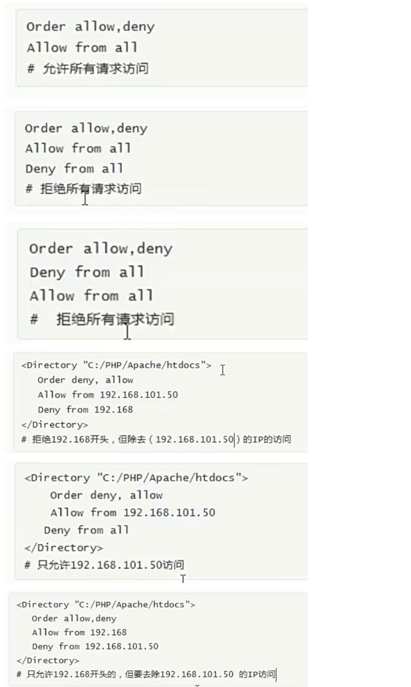

默认首页：

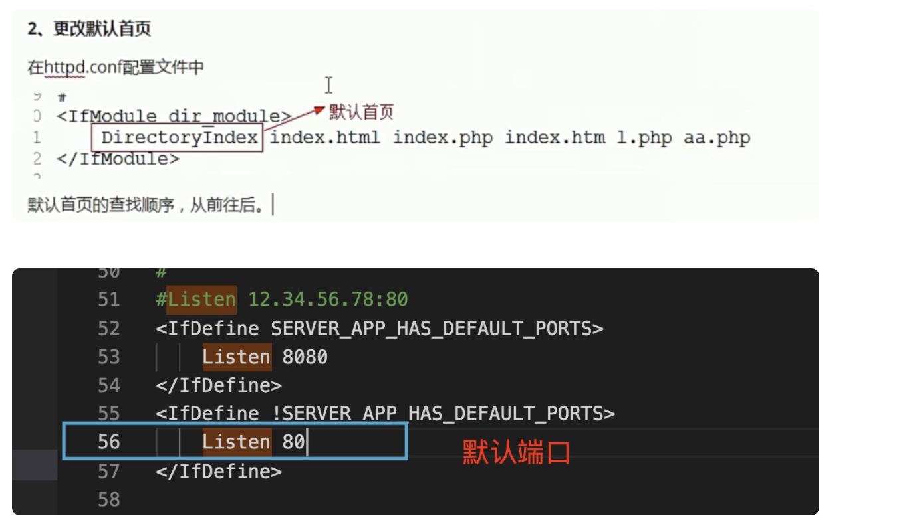

可以写多个端口，最大65535

# 虚拟主机配置：

第一步：注释掉httpd.conf里面的DocumentRoot


第二步：放开如下这段的注释


第三步：更改/private/etc/apache2/extra/httpd-vhosts.conf的配置：

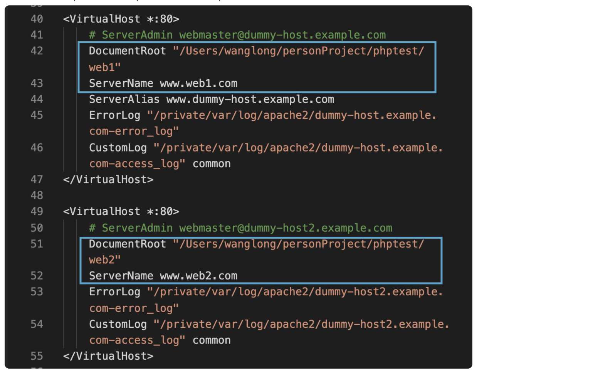

第四步：添加对应的文件：

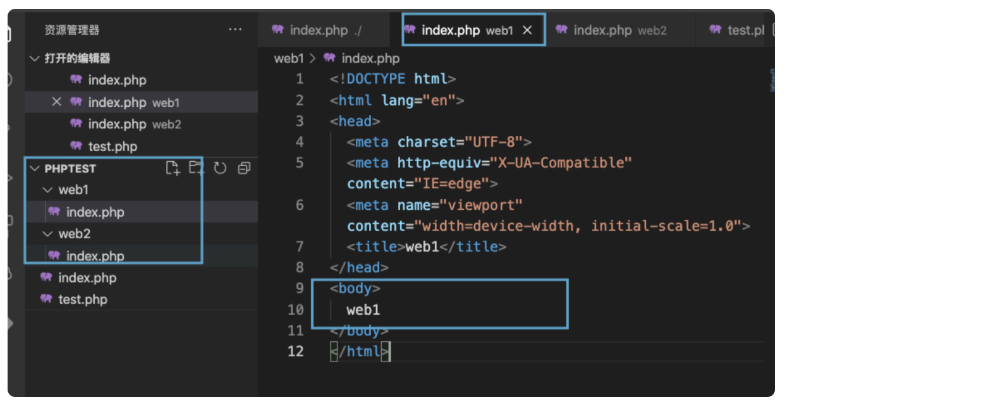

第五步：添加host解析：


第六步：查看结果：


概念区别：


tips：

这里的权限，就如下：

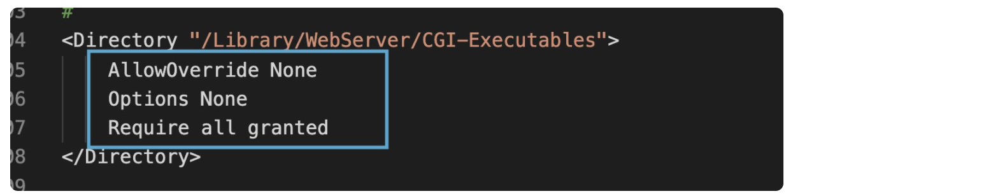

这里的域名：

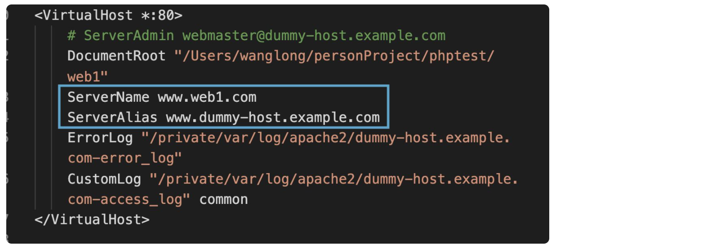

php是编译型还是解释型：

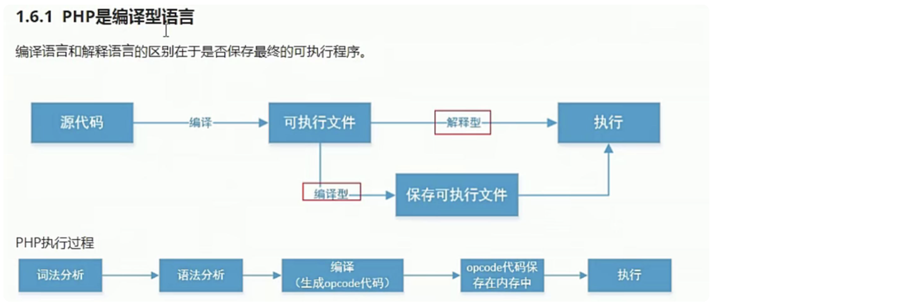

php4之前都是解释型，但是后来随着技术发展，php需要做语法分析，词法分析，需要生成opcode（没有生成真实的文件），其实还是进行了编译，所以也可以说php是解释型语言

文章拓展：

[https://blog.csdn.net/diavid/article/details/81205072](https://blog.csdn.net/diavid/article/details/81205072)

自己理解：

比如c，c++这些需要先编译成.exe等可执行文件的脚本，叫做编译型，而像php这种语言，其实是加载到可执行器里面后再编译，再执行，两个步骤是不能脱离编译器环境的。

对于相同的100次请求：

c编译一次，执行100次

php编译100次，执行100次

所以裸奔的情况下，php执行效率是很低的，所以php在编译完后在一定的缓存时效内，是可以直接使用缓存文件，减少编译过程的。

总结：

区分编译型还是解释型，其实就看编译过程是在哪里发生（这个是重点）+是否有编译文件生成（感觉这个无所谓）

所以：比如java，js，python这些都是解释型语言

**在安装 PhpMyAdmin前要确保PHP apache和MySQL是运行良好的**

**一、首先配置apache 服务器环境**

由于 PHP apache 环境在 Mac OS上是自带的，所以不需要另处下安装包，只需要简单配置一下即可。

1. 首先打开终端输入命令：sudo vim /etc/apache2/httpd.conf ，打开文件后找到以下两行，# LoadModule php5_module libexec/apache2/libphp5.so 和 # ServerName 分别将它们的注释去掉，并将 ServerName 后改成 ServerName localhost
2. 之后重启 apache, 命令如下：sudo apachectl restart
3. 如果第二步报错“AH00558”，则sodo vim /usr/local/etc/httpd/httpd.conf,找到文件中的ServerName 后改成 ServerName localhost
4. 然后重启 apache, 命令如下：sudo apachectl restart

5.到 浏览器 中输入：[http://localhost/](https://links.jianshu.com/go?to=http%3A%2F%2Flocalhost%2F)，如果出现 --> It works! 说明成功配置好了 apache 的 php 服务环境。

**二、 安装部署 mysql 服务**

mysql安装：地址：[https://www.mysql.com/downloads/](https://www.mysql.com/downloads/)

入口：[MySQL Community (GPL) Downloads »](https://dev.mysql.com/downloads/)    再找到   [MySQL Community Server](https://dev.mysql.com/downloads/mysql/)

第一步：确认mysql安装位置：

默认安装路径是：/usr/local/mysql/bin

第二步：编辑~/.bash_profile

添加如下内容：

```
export PATH=$PATH:/usr/local/mysql/bin
alias mysql=/usr/local/mysql/bin/mysql
alias mysqladmin=/usr/local/mysql/bin/mysqladmin
```

第三步：source ~/.bash_profile，让新加的环境变量生效

第四步：测试：cmd：mysql -u root -p  输入密码：12345678

```
mysql> show databases;
+--------------------+
| Database           |
+--------------------+
| information_schema |
| mysql              |
| performance_schema |
| sys                |
+--------------------+
4 rows in set (0.00 sec)
mysql> quit
Bye
```

done

**三、安装部署 PhpMyAdmin**

要管理Mysql，如果用命令行比较麻烦，开源的 phpMyAdmin 采用C/S的模式，方便管理。

1. 官网上下一个phpMyAdmin. 它是由 php 开发的，链接为: [https://www.phpmyadmin.net](https://links.jianshu.com/go?to=https%3A%2F%2Fwww.phpmyadmin.net)
2. 将下载下来的解压放在 /Library/WebServer/Documents/ 目录下，完整的目录为：/Library/WebServer/Documents/phpmyadmin/，那么用命令行进入这个目录：cd /Library/WebServer/Documents/phpmyadmin/
3. 输入以下命令：

cp config.sample.inc.php config.inc.php //复制一份配置文件的模板

vim config.inc.php //进入到文件中

4. 进入文件后，按照下面进行修改：

```
$cfg['blowfish_secret'] = '自己定字符串';         //用于Cookie加密，随意的长字符串

$cfg['Servers'][$i]['host'] = '127.0.0.1';         //MySQL守护程序做了IP绑定
```

5. 接着我们就可以在浏览器中输入URL：[http://localhost/phpmyadmin/](https://links.jianshu.com/go?to=http%3A%2F%2Flocalhost%2Fphpmyadmin%2F)
6. 打开页面后，输入用户名为：root，密码是MySQL的密码

，此时就可以 login 到 mysql 的管理界面啦

如何删除mac上的mysql？

```
sudo rm /usr/local/mysql
sudo rm -rf /usr/local/mysql*
sudo rm -rf /Library/StartupItems/MySQLCOM
sudo rm -rf /Library/PreferencePanes/MySQL*
rm -rf ~/Library/PreferencePanes/MySQL*
sudo rm -rf /Library/Receipts/mysql*
sudo rm -rf /Library/Receipts/MySQL*
```

And finally removed the line MYSQLCOM=-YES- from `/etc/hostconfig，这一步有的版本的mac没有`
