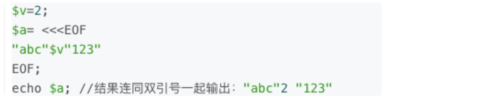
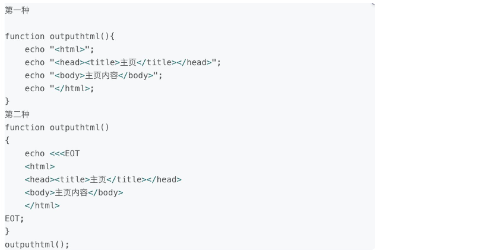
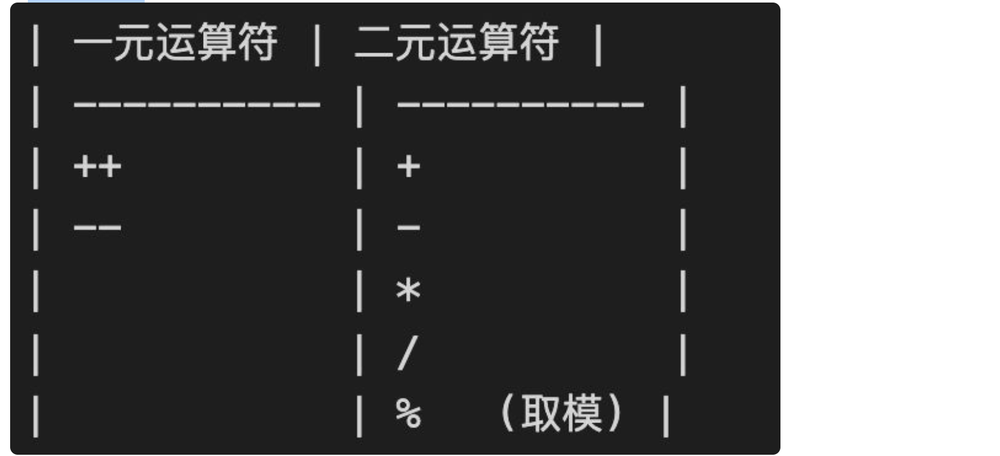
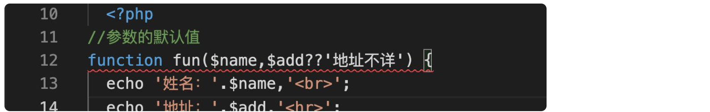
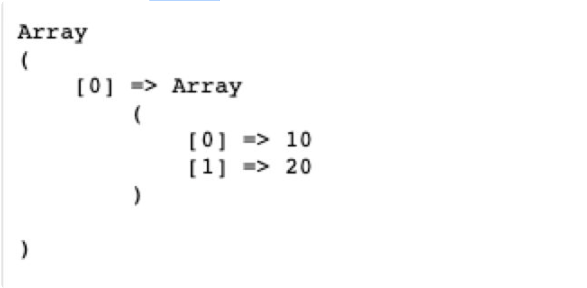
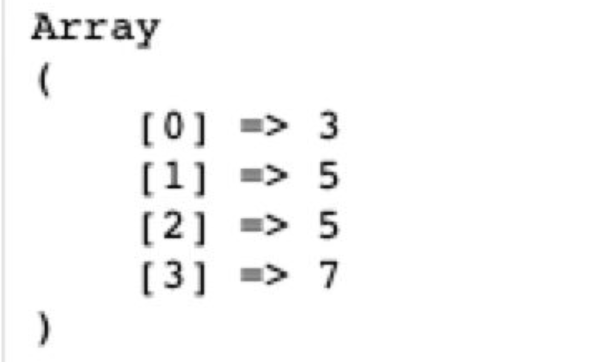
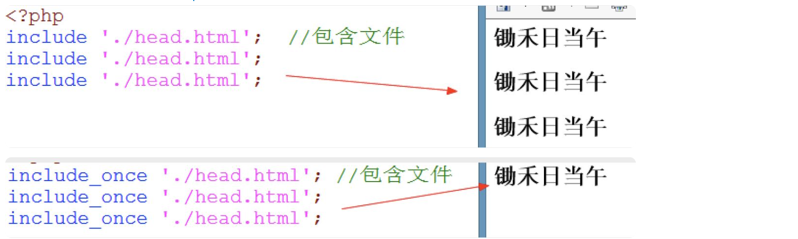
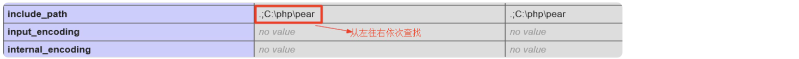
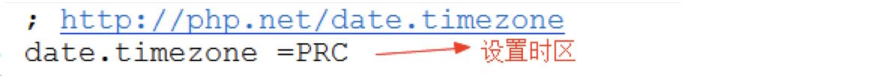

## 2、php基础语法

php的执行不一定非得要apache：


## 1、定界符

因为PHP是脚本语言，所以需要定界符

1、标准风格（推荐使用）

```
<?php
echo 'i am a boy!';
?>
```

提醒，如果整个页面都是PHP代码，PHP结束符是可以省略的（推荐）

```
<?php
echo 'i am a boy!';
```

短标记风格：

```
<?
echo 'i am a boy!';
?>
```

默认中文会出现乱码，需要在/private/etc/php.ini.default（php.ini）文件中开启对应的配置：改成on（但是实际测试，php7即使没有开启也没有出现乱码）


**问题，打印phpinfo接口**Loaded Configuration File居然是空，正常应该指向php.ini才对，所以上面是否更改**/private/etc/php.ini.default，配置会生效，不太确定**



## 2、注释

单行注释： //和#

多行注释： /* */

## 3、输出

echo:输出

print:输出，输出成功返回1

```
var_dump('abc'); //string(3) "abc"  类型（长度）内容
```

## 4、变量

变量名规则：

1. 变量必须以$开头，$符不是变量的一部分，仅表示后面的标识符是变量名。
2. 除了$以外，以字母、下划线开头，后面跟着数字、字母、下划线
3. 变量名区分大小写，$aa和$Aa是两个空间

可变变量：

```
<?php
  $name1='tom';
  $name2='berry';
  if(rand(1,10)%2){ 
    $name='name1';  //将变量名存储在$name中
  }else{
    $name='name2';
  }
  echo $$name;   // 随机输出tom、berry
```

变量传递：值传递：

值传递：

```
$num1=10; //将10付给$num1
$num2=$num1;  //将$num1的值付给$num2
$num2=20;   //更改$num2
echo $num1;   //10
```

地址传递：

```
$num1=10;   //将10付给$num1
$num2=&$num1; //将$num1的地址付给$num2
$num2=20;   //更改$num2
echo $num1;   //20
```

销毁变量：

```
$num1=10;
$num2=&$num1;
unset($num1); //销毁的是变量名
echo $num2;   //10
```

## 5、定义常量

（1）常量名前没有$符

（2）常量名推荐使用大写

```
define('NAME','tom');   //定义常量
define('PI',3.14,true);   //定义常量,不区分大小写
echo NAME,'<br>',Pi; // tom 3.14
//true表示不区分大小写，默认是区分大小写的。
```

【2】定义常量可以用特殊字符，但是在调用的时候必须用 `constant`关键字调用

```
define('%-%','tom');
echo constant('%-%');   //通过constant获取特殊字符作为常量名的常量
```

```
if(!defined('NAME')){ 
  define('NAME','berry');
}
echo NAME;  //berry
```

【4】还可以使用const关键字定义常量

```
const NAME='tom';
echo NAME;    //tom
```

小结：

2、常量在整个运行过程中值保持不变，常量不能重新定义

3、使用constant获取特殊字符做的常量名的值

## 6、预定义常量+**魔术常量**

有很多，比如：

预定义常量：

```
echo PHP_VERSION,'<br>';    //PHP版本号
echo PHP_OS,'<br>';       //PHP操作系统
echo PHP_INT_MAX,'<br>';    //PHP中整型的最大值  
```

魔术常量：

```
echo __LINE__,'<br>';   //获取当前行号
echo __FILE__,'<br>';   //文件的完整路径和文件名
echo __DIR__,'<br>';    //文件所在的目录
```

## 7、数据类型

数据类型有两种：强类型和弱类型

【1】整型

存整数，PHP_INT_MAX获取整形最大值

PHP支持8、10、16机制的整数

```
$num1=10;   //十进制
$num2=010;    //八进制（数字前面加0）
$num3=0x10;   //十六进制（数字前面加0x）

echo $num1,'<br>';    //10
echo $num2,'<br>';    //8
echo $num3;       //16
```

进制转换

| 机制 | 缩写 | 单词 |

| -------- | ---- | ------------- |

| 十进制 | dec | decimalist |

| 二进制 | bin | binary |

| 八进制 | oct | octonary |

| 十六进制 | hex | hexdecimalist |

php提供的进制转换：

```
echo decbin(123),'<br>';   //十进制转二进制
echo bindec(1111011),'<br>';  //二进制转十进制
echo dechex(123),'<br>';    //十进制转十六进制
echo hexdec('7b'),'<br>';   //十六进制转十进制
echo decoct(123);       //十进制转八进制
```

【2】浮点型

浮点数在内存中保存的是近似值，浮点数不能参与比较

```
true)
echo '<br>';
var_dump(0.1==(1-0.9)); //bool(false)
```

如果浮点数要比较，必须确定比较的位数

```
true)
echo '<br>';
var_dump(0.1==(1-0.9)); //bool(false)
echo '<br>';
var_dump(bccomp(0.1,1-0.9,5)); //比较小数点后面5位 int(0) 0表示相等
```

提醒：如果一个整数超出了整形的范围，会自动的转成浮点型

【3】布尔型

不能使用echo 和print输出布尔型，要使用var_dump()输出

```
$flag=false;
var_dump($flag);  //bool(false) 
```

【4】字符串型

（1）在PHP中单引号字符串和双引号字符串是有区别的

（2）单引号字符串是真正的字符串

（3）双引号字符串要解析字符串中的变量

```
$name='tom';
echo '我的名字叫$name','<br>'; //我的名字叫$name
echo "我的名字叫$name",'<br>'; //我的名字叫tom
```

通过{ }取变量值

```
$name='tom';
echo '$name是我的名字','<br>'; //$name是我的名字
echo "{$name}是我的名字",'<br>'; //{}表示获取变量的值（tom是我的名字）
echo "${name}是我的名字",'<br>'; //$和{只要挨着一起就可以（tom是我的名字）
```

输出特殊字符

```
echo '毛主席说：\'上课不要睡觉\'','<br>'; //转义字符 毛主席说：'上课不要睡觉'
echo '文件保存在c:\\'; //文件保存在c:\
```

字符串定界符（可以理解成模板）

（1）.以<<<End开始标记开始，以End结束标记结束，**结束标记必须顶头写**，不能有缩进和空格，且在结束标记末尾要有分号 。

（2）.开始标记和开始标记相同，比如常用大写的EOT、EOD、EOF来表示，但是不只限于那几个，只要保证开始标记和结束标记不在正文中出现即可。

（3）.位于开始标记和结束标记之间的变量可以被正常解析，但是函数则不可以。在heredoc中，变量不需要用连接符.或,来拼接，如下：



（4）4.heredoc常用在输出包含大量HTML语法d文档的时候。比如：函数outputhtml()要输出HTML的主页。可以有两种写法。很明显第二种写法比较简单和易于阅读：



【5】数组

（1）在PHP中数组有两种形式，索引数组和关联数组

（2）索引数组：用整数做下标，默认从0开始，后面依次加一

（3）关联数组：用字符串做下标，通过=>符号将下标和值关联起来

```
//1、索引数组的声明
$stu=array('tom','berry','ketty');   //索引数组
print_r($stu);  //输出数组  Array ( [0] => tom [1] => berry [2] => ketty ) 
echo '<hr>';
echo $stu[0],'<br>';  //tom
echo $stu[1],'<br>';  //berry
echo $stu[2],'<hr>';  //ketty
------------------------------------------
//2、关联数组
$emp=array('name'=>'李白','sex'=>'男','age'=>22);
print_r($emp);  //Array ( [name] => 李白 [sex] => 男 [age] => 22 ) 
echo '<hr>';
echo $emp['name'],'<br>'; //李白
echo $emp['sex'],'<br>';  //男
echo $emp['age'];     //22
```

练习：

```
$array=array(1=>'a','b','c','d');
print_r($array);   //Array ( [1] => a [2] => b [3] => c [4] => d ) 
echo '<br>';
--------------------------
$array=array('a',2=>'b','c',5=>'d');
print_r($array);  //Array ( [0] => a [2] => b [3] => c [5] => d ) 
echo '<br>';
----------------------------
$array=array('a','name'=>'b','c','sex'=>'d');
print_r($array); //Array ( [0] => a [name] => b [1] => c [sex] => d ) 
echo '<br>';
------------------------------
$array=array(1=>'a',1=>'b',1=>'c','d');
print_r($array);  //Array ( [1] => c [2] => d ) 
```

注意点：

数组的下标只能是正整数和字符串

```
$stu[true]='tom';   //转成1   Array ( [1] => tom )
$stu[false]='berry';  //转成0 Array ( [0] => berry )
$stu[12.9]='aa';    //转成12（取整数部分） Array ( [12] => aa )
$stu[-10]='bb';     //负数可以做下标 Array ( [-10] => bb )
$stu[-12.3]='cc';   //取负整数 Array ( [-12] => cc )
$stu['10']='dd';    //字符串数字转成数字 Array ( [10] => dd )
$stu['']='ee';      //空字符串也可以做下标 Array ( [] => ee )
$stu[null]='ff';    //转成空字符串做下标 Array ( [] => ff )
print_r($stu);
```

短数组语法，可以直接通过中括号声明数组

```
$stu=['tom','berry','ketty'];
print_r($stu);  //Array ( [0] => tom [1] => berry [2] => ketty ) 
```

tips: 在PHP7.1中可以支持数组的赋值

```
$num1=10;
$num2=20;
[$num1,$num2]=[$num2,$num1];
echo $num1,'<br>',$num2; // 20 10
```

再加一个变量：

```
$num1=10;
$num2=20;
$d = '';
[$num1,$num2, $d]=[$num2,$num1, 8989];
echo $num1,'<br>',$num2,'<br>',$d; // 20 1 8989
?>
```

tips: 在7.1开始支持: 字符串可以通过数组的方式去调用

```
echo 'abc'[0],'<br>';   //a  
echo 'abc'[-1],'<br>';    //c，从右边开始取第一个  
```

二维数组的声明：

```
$stu=[
  ['name'=>'tom','sex'=>'男','age'=>22],
  ['name'=>'berry','sex'=>'女','age'=>23]
];
echo '<pre>';
print_r($stu);
//运行结果
Array
(
    [0] => Array
        (
            [name] => tom
            [sex] => 男
            [age] => 22
        )
    [1] => Array
        (
            [name] => berry
            [sex] => 女
            [age] => 23
        )
)
```

提醒：在PHP中 null和NULL是一样的，不区分大小写

【6】类型转换

（1）自动类型转换：当提供的类型和需要的类型不一致的时候会自动进行类型转换

```
$num=10;
if($num){   //自动将数字转成布尔型
  echo 'aa';
}else{
  echo 'bb';
}
---------------------------------
echo '20'-10; //自动的将字符串转成数字
```

（2）强制类型转换

语法：（数据类型）数据

```
$num1='12';
var_dump($num1,(int)$num1,(float)$num1);   //string(2) "12" int(12) float(12) 
```

bool转换：

```
'abc');  echo '<br>';    //bool(true)  
var_dump((bool)'');   echo '<br>';    //bool(false) 
var_dump((bool)'0');  echo '<br>';    //bool(false) 
var_dump((bool)'0.0');  echo '<br>';    //bool(true) 
var_dump((bool)'00'); echo '<br>';    //bool(true) 
var_dump((bool)'false');  echo '<br>';  //bool(true) 
var_dump((bool)'null'); echo '<br>';    //bool(true) 
var_dump((bool)1);    echo '<br>';    //bool(true) 
var_dump((bool)0);    echo '<br>';    //bool(false) 
var_dump((bool)-10);    echo '<br>';  //bool(true) 
var_dump((bool)0.0);    echo '<br>';  //bool(false) 
var_dump((bool)array());  echo '<br>';  //bool(false) 
var_dump((bool)array(1)); echo '<br>';  //bool(true) 
var_dump((bool)array(false)); echo '<br>';//bool(true) 
var_dump((bool)null); echo '<br>';      //bool(false) 
```

## 8、运算符

【1】算数运算符



注意：在PHP中，算术运算符只能做数学运算

```
echo '10'+'20','<br>';    //30
echo '10ab'+'20cd','<br>';  //30
echo 'ab10'+'cd20','<br>';  //0
```

++前置：先自增再运算

++后置：先运算再自增

```
$num=10;
$num++;
echo $num;  //11
-------------------------
$num=10;
echo $num++;   //10
------------------------
$num=10;
echo ++$num;   //11
------------------------
$num=5;
echo (++$num)+(++$num)+(++$num);  //21
-------------------------
$num=5;
echo ($num++)+($num++)+($num++);  //18
```

【2】**关系运算符（比较运算符）**

> =

<

<=

==

!=

===

!==

【3】**逻辑运算符**

& 与：运算符两边的表达式都要计算

| 或：运算符两边的表达式都要计算

&& 短路与：如果前面的条件不满足，后面的条件就不用计算了

|| 短路或

! 非

```
$a=5;
$b=10;
if($a>10 && ++$a>20)
  echo '你好吗';
echo $a;    //5
//分析：$a>10为false, 与中只要有一个是false，另一个不用计算结果肯定是false，所以短路与++a就不计算了，结果是5
----------------------------
<?php
$a=5;
$b=10;
if($a<10 || ++$a>20)
  echo '你好吗';
echo $a;    //5
//分析：短路或只要有一个为true，结果肯定是true，$a<10结果是true，后面++$a就不用计算了。
```

【4】**赋值运算符**

= //赋值

+= //a+=b a=a+b

-=

*=

/=

%=

【5】**字符串连接符(.)**

 **

```
echo 'aa'.'bb';   //字符串链接 aabb
```

【6】** **错误抑制符(@)**

 **

```
<?php
echo @($aa+$bb);  //错误抑制
```

【7】** **三元运算符(?:)**

表达式?值1：值2

//表达式的值为true，返回值1，否则返回值2

【8】**null合并运算符(??)**

**

```
echo $name??'姓名不详';   //姓名不详 如果$name有值就返回$name，没有值就返回”姓名不详“
```

tips：类似js中一个函数中形参的默认值

```
echo isset($name)?$name:'姓名不详';   //姓名不详
echo '<hr>';

$stu=array();
echo empty($stu)?'空':'非空';    //空
```

## 9、逻辑控制语句

【1】if：

```
if(条件){

}elseif(条件){    //注意：elseif之间没有空格

}else{

}
```

【2】switch：

```
switch(表达式){
   case 常量：
       //代码块
       break;
   case 常量：
       //代码块
       break;
   default:
       //代码块
}
```

demo：**判断闰年**

```
<body>
<?php
if(!empty($_POST)){ //$_POST不为空说明有post提交的数据
  //var_dump($_POST);
  $year=$_POST['year']; //获取年份
  if($year==''){
    echo '您没有输入年份';
  }else{
    if(is_numeric($year)){  //判断$year是否是数字或字符串数字
      $year+=0;   //将字符串数字转成数字型  
      if(is_int($year)){  //is_int用来检测变量是否是整型
        if($year<1){
          echo '年份必须正整数';
        }else{
          if($year%4==0 && $year%100!=0 || $year%400==0)
            echo "{$year}是闰年";
          else
            echo "{$year}是平年";
        }
      }else{
        echo '您输入的不是整数';
      }
    }else{
      echo '您输入的不是数字';
    }
  }
} 
?>
<form method="post" action="">
  请输入年份： <input type="text" name="year"> <br />
  <input type="submit" name="button" value="判断闰年">
</form>
</body>
```

【3】for：

```
for($i=1;$i<=10;$i+=2){
  echo "{$i}:锄禾日当午<br>";
}
/*
1:锄禾日当午
3:锄禾日当午
5:锄禾日当午
7:锄禾日当午
9:锄禾日当午
*/
```

demo：都是死循环：

```
<?php
for($i=1;$i<=10;){}
//死循环，$i永远等于1，1永远小于10，条件永远为true
-------------------------
for($i=1;;$i++){}
//死循环，只要没有条件都是死循环
-------------------------
for(;;){}
//这是一个经典的死循环
```

tips:在循环执行完毕后，$i的值是存在的

```
for($i=1;$i<=3;$i++){}
echo $i;    //4
```

【4】while、do-while:

```
while(条件){
}
-------------------------
do{

}while(条件)
```

小结：

1、for、while、do-while可以相互替换

2、如果明确知道循环多少次首先for循环，如要要循环到条件不成立为止选while或do-while

3、先判断再执行选while，先执行再判断选do-while

4、while循环条件不成立就不执行，do-while至少执行一次

【5】foreach:

```
//语法一
foreach(数组 as 值){
}
//语法二
foreach(数组 as 键=>值){
}
```

demo:

```
<?php
$stu=['tom','berry','ketty'];
foreach($stu as $v){
  echo $v,'<br>';
}
/**
tom
berry
ketty
*/
echo '<hr>';
-----------------------------------------------------------
foreach($stu as $k=>$v){
  echo "{$k}:{$v}<br>";
}
/**
0:tom
1:berry
2:ketty
*/
```

break：中断循环

continue：中断当前循环，进入下一个循环

```
<?php
for($i=1; $i<=10; $i++) {
  if($i==5)
    break;  //中断循环
  echo "{$i}：锄禾日当午<br>";
}
//结果
1：锄禾日当午
2：锄禾日当午
3：锄禾日当午
4：锄禾日当午
--------------------------------------------------
<?php
for($i=1; $i<=10; $i++) {
  if($i==5)
    continue;  //跳出5，进入6循环
  echo "{$i}：锄禾日当午<br>";
}
1：锄禾日当午
2：锄禾日当午
3：锄禾日当午
4：锄禾日当午    //注意，没有打印第5句
6：锄禾日当午
7：锄禾日当午
8：锄禾日当午
9：锄禾日当午
10：锄禾日当午
```

break和continue默认中断、跳出1重循环，如果调中断、跳出多重循环，在后面加一个数字。

```
<?php
for($i=1; $i<=10; $i++) {
  for($j=1;$j<=$i;$j++){
    echo $j.' ';
    if($j==5){
      break 2;   //中断2重循环
    }
  } 
  echo '<br>';
}
//运行结果
1 
1 2 
1 2 3 
1 2 3 4 
1 2 3 4 5 
```

再来一个：这个案例证明switch在php其实是一次循环的函数，这里的js不太一样，js只需要break就可以跳出for循环，而php中的只写break是跳不出for循环的。

```
<?php
for($i=1; $i<=10; $i++) {
  switch($i){
    case 5:
      break 2;
  }
  echo $i,'<br>';
}
//结果
1
2
3
4
```

【6】逻辑控制的替代语法

php中除了do-while以外，其他的语法结构都有替代语法

规则：左大括号变冒号,右大括号变endXXX

```
//if的替代语法
    if():
    elseif():
    else:
    endif;
//switch替代语法
    switch():
    endswitch;
//for
    for():
    endfor;
//while
    while():
    endwhile;
//foreach
    foreach():
    endforeach;
```

demo：

```
<body>
<?php
for($i=1;$i<=10;$i++):
  if($i%2==0):
?>
  <?php echo $i;?>:锄禾日当午<br>
<?php
  endif;
endfor;
?>
</body>
//运行结果
2:锄禾日当午
4:锄禾日当午
6:锄禾日当午
8:锄禾日当午
10:锄禾日当午
```

主要if后面如果跟了else if,这里写的是elseif还是else if，即是否有空格：如下demo可以出来他们的含义是不一样的

```
<?php
$score=80;
if($score>=90):
  echo 'A';
elseif($score>=80):    //elseif之间没有空格，如果有空格是嵌套if语句
  echo 'B';
else:
  echo 'C';
endif;
----------------------------------------
<?php
$score=80;
if($score>=90):
  echo 'A';
else:
  if($score>=80):
    echo 'B';

  else:
    echo 'C';
  endif;
endif;
```

## 10、函数

```
//定义函数
function show() {
  echo '锄禾日当午<br>';
}
//调用
show();   //锄禾日当午
SHOW();   //锄禾日当午  函数名不区分大小写
```

注意：

1、变量名区分大小写

2、关键字（比如if else while const……）、函数名不区分大小写

函数名可以保存到变量中 ：

```
function show($args) {
  echo $args,'<br>';
}
$str='show';  //将函数名保存到变量中
$str('锄禾日当午');


function showChinese() {
  echo '锄禾日当午<br>';
}
function showEnglish() {
  echo 'chu he re dang wu<br>';
}
$fun=rand(1,10)%2?'showChinese':'showEnglish';   //可变变量
$fun();
```

匿名函数：

```
//匿名函数
$fun=function(){
  echo '锄禾日当午<br>';
};
//匿名函数调用
$fun();
```

默认情况下，参数的传递是值传递：

```
$num=10;
function fun($args) {
  $args=100;
}
fun($num);
echo $num;    //10
```

如果想变成地址传递：

```
$num=10;
//地址传递
function fun(&$args) {   //&符表示取地址
  $args=100;
}
fun($num);
echo $num;    //100
```

tips：如果是地址传递，不能直接写值，不然会报错：

```
function fun(&$args) {
  $args=100;
}
fun(10);   //Fatal error: Only variables can be passed by reference (只有变量才能传递引用)
```

参数默认值：

(1)默认值必须是值,不能用变量代替，不然语法报错

(2)无默认值的形参放在前面（建议），如果形参无默认值，对应的实参又没传递值，函数体又没处理这个形参，会导致报错：实参少于形参（报错），实参多于形参，只取前面对应的值

```
//参数的默认值
function fun($name,$add='地址不详') {
  echo '姓名：'.$name,'<br>';
  echo '地址：'.$add,'<hr>';
}
//测试
fun('tom','北京'); // tom 北京
fun('berry');// berry 地址不详
```

```
define('ADD','地址不详');
function fun($name,$add=ADD) {    //默认值可以使用常量
  echo '姓名：'.$name,'<br>';
  echo '地址：'.$add,'<hr>';
}
//测试
fun('berry');
```

tips: 这里可以写成$add??'地址不详'吗？ 语法错误



获取所有形参：

```
function fun() {
  //echo func_num_args(),'<br>';  //获取参数的个数
  $args=func_get_args();  //获取参数数组
  print_r($args);
}
fun(10);
fun(10,20);
fun(10,20,30); 
```

tips：类似于js函数体中的的arguments

**参数约束：**

```
// ...$hobby包含了除了前面两个参数以外的所有参数
function fun($name,$age,...$hobby) {
  echo '姓名：'.$name,'<br>';
  echo '年龄：'.$age,'<br>';
  print_r($hobby);
  echo '<hr>';
}
fun('tom',22);
fun('berry',25,'读书','睡觉');
```

另外一个demo：

```
function fun(...$args) {
  print_r($args);
  echo '<br>';
}
$num=[10,20];
echo '<pre>';
fun(...$num);   //将数组中的参数展开
//运行结果
/*
Array
(
    [0] => 10
    [1] => 20
)
*/
```

如果fun(...$num);改成fun($num):执行结果变成：



结论：

1、函数的实参是可以通过...进行展开的，fun(...$num);展开后其实传递的参数就是fun(10,20);然后被$args以数组的形式接收（好比js里面的arguments，接收的形式就是数组）

2、fun(...$num);如果传递的参数改成: fun(3,5,...[5,7])，最终传递到fun里面$args打印出来就是：



3、如果是以fun($num)的形式入参，因为入参是一个数组，$args又以数组的形式（又包了一层数组）接收，所以变成了一个二维数组，如上结果。

参数类型约束：

```
//类型约束
function fun(string $name,int $age) {
  echo "姓名：{$name},'<br>'";
  echo "年龄：{$age}<br>";
}
fun('tom',22);
//约束$name是字符串型，$age是整型
```

返回值约束：

```
function fun(int $num1,int $num2):int {  //必须返回整型
  return $num1+$num2;
}
echo fun(10,20);    //30
// 可以约束：string、int、float、bool、数组
```

return用途：1、终止函数/当前页脚本执行。2、返回值

```
echo '锄禾日当午<br>';
return;     //终止脚本执行
echo '汗滴禾下土<br>'; //不执行
----------------------------------
function fun() {
  echo 'aaa';
  return ;    //终止函数执行
  echo 'bbb';
}
fun();   //aaa
----------------------------------
function fun() {
  return 10;  //返回值
}
echo fun();   //10
```

tips：return只能中断当前页面，如果有包含文件，只能中断包含文件

demo:

```
// index.php
echo '锄禾日当午<br>';
require './test.php';    //包含文件
echo '汗滴禾下土<br>'; // 会输出
------------------------------
// test.php
echo 'aaa<br>';
return;   //只能中断test.php
echo 'bbb<br>'; // 不会输出
```

如果想完全终止脚本：使用exit()、或die()

```
echo 'aaa<br>';
exit();  //die()
echo 'bbb<br>';
```

**返回页面结果：**

```
// test.php
return array('name'=>'tom','sex'=>'男');
// index.php
$stu=require './test.php';
print_r($stu);  //Array ( [name] => tom [sex] => 男 ) 
```

## 11、作用域

1、全局变量：在函数外面

2、局部变量：在函数里面，默认情况下，函数内部是不会去访问函数外部的变量

3、超全局变量：可以在函数内部和函数外部访问

```
$num=10;   
function fun() {
  echo $num;     //Notice: Undefined variable: num  
}
fun();
//函数内部默认不能访问函数外部的值
---------------------
<?php
$_POST['num']=10;   //将值付给超全局变量
function fun() {
  echo $_POST['num'];    //获取超全局的值   10
}
fun();
----------------------------
<?php
function fun() {
  $_GET['num']=10;  //将值付给超全局变量
}
fun();
echo $_GET['num'];  //打印超全局变量的值  10
```

$GLOBALS： $GLOBALS保存的是全局变量的所有的值

```
// 在函数内部访问全局变量：
$num=10;  //全局变量
function fun() {
  echo $GLOBALS['num']; //输出全局的$num
}
fun();
----------------------------
// 全局访问函数内部赋值的全局变量
function fun() {
  $GLOBALS['num']=10;  //将值付给全局的$num
}
fun();
echo $num;   //10
```

global关键字：

```
$num=10;
function fun() {
  global $num;   //将全局变量的$num的地址引入到函数内部  相当于$num=&GLOBALS['num']
  echo $num;  //10
  $num=100;
}
fun();
echo '<br>';
echo $num;    //100
-----------------------------------
$num=10;
function fun() {
  global $num;
  unset($num);  //销毁的是引用，不是具体的值
}
fun();
echo $num;    //10  
```

常量没有作用域的概念：

```
define('PI',3.14);
function fun() {
  echo PI;   //3.14
}
fun();
echo '<br>';
-------------------------------------
function fun() {
  define('PI',3.14);
}
fun();
echo PI;   //3.14
```

**静态变量（static）：**

静态变量一般指的是静态局部变量。静态变量只初始化一次

```
function fun() {
  $num=10;  //普通变量每调用一次初始化一次，调用完毕销毁
  $num++;
  echo $num,'<br>';
}
fun();  //11
fun();  //11
--------------------------------
<?php
function fun() {
  static $num=10; //静态变量只初始化一次，调用完毕吧不销毁，第二次调用的时候就不再初始化
  $num++;
  echo $num,'<br>';
}
fun();  //11
fun();  //12
```

常量和静态变量的区别

1、常量和静态变量都是初始化一次

2、常量不能改变值，静态变量可以改变值

3、常量没有作用域，静态变量有作用域

```
function fun1() {
  define('num',10);
}
function fun2() {
  echo num;   //10
}
fun1();
fun2();
------------------------------------------------------------
function fun1() {
  static $num=10;
}
function fun2() {
  echo $num;  //Notice: Undefined variable: num 因为静态变量是有作用域的
}
fun1();
fun2();
```

**1、这个use只能用在匿名函数上面**

2、use可以引入值，也可以引入地址

```
$num=10;
$num1=32;
$fun=function() use($num, $num1) {  //将$num引入到匿名函数中
  echo $num;  
  echo $num1; 
};
$fun();   //10
```

总结：如何在函数内部访问函数外部变量

1、使用超全局变量

2、$GLOBALS

3、global

4、use将函数外部变量引入到匿名函数内部

demo：

```
$num=10;
function test() {
  $num=20;
  $fun=function() use($num) {   //只能引入一层
    echo $num;
  };
  $fun();
}
test();    //20
------------------------------------
$num=10;
$fun=function()use(&$num){   //use可以传地址
  $num=100;
};
$fun();
echo $num;  //100
```

**递归：**

```
// 输出9 8 7 6 .....
function printer($num) {
  echo $num,' ';
  if($num==1) //递归出口
    return;
  printer($num-1);  //递归点
}
printer(9); //9 8 7 6 5 4 3 2 1 
------------------------------------
// 从1加到100

function cal($num) {
  if($num==1)
    return 1;
  return $num+cal($num-1);
}
echo cal(100);
//分析
//**
第$i次执行      结果
cal(100)      100+cal(99)
=         100+99+cal(98)
=         100+99+98+cal(97)
=         100+99+98+++++cal(1)
=         100+99+98++++1
*//
------------------------------------
// 打印前10个斐波那契数列
function fbnq($n) {
  if($n==1 || $n==2)
    return 1;
  return fbnq($n-1)+fbnq($n-2); //第n个斐波那契数等于前两个数之和
}
echo fbnq(5),'<br>';
//**
*分析：
fbnq(5) =fbnq(4)+fbnq(3)
    =fbnq(3)*2+fbnq(2)
    =(fbnq(2)+fbnq(1))*2+fbnq(2)
    =(1+1)*2+1
    =5
*//
//打印前10个斐波那契数
for($i=1;$i<=10;$i++)
  echo fbnq($i),' ';   //1 1 2 3 5 8 13 21 34 55 
```

tips:

递归尽量少用，因为递归需要用到现场保护，现场保护是需要消耗资源的

## 12、文件包含

【1】文件引用

1、require：包含多次

2、include：包含多次

3、require_once： 包含一次

4、include_once： 包含一次



tips：

1、require遇到错误抛出error类别的错误，停止执行

2、include遇到错误抛出warning类型的错误，继续执行

3、require_once、include_once只能包含一次

4、HTML类型的包含页面中存在PHP代码，如果包含到PHP中是可以被执行的

5、包含文件相当于把包含文件中的代码拷贝到主文件中执行，魔术常量除外，魔术常量获取的是所在文件的信息。

6、包含在编译时不执行、运行时加载到内存、独立编译包含文件

**【2】包含文件的路径：**

./ 当前目录

../ 上一级目录

```
require './head.html';   //在当前目录下查找
require 'head.html';    //受include_path配置影响
```

phpinfo();查看：



include_path的使用场景：

```
// 如果包含文件的目录结构比较复杂，比如：在c:\aa\bb\cc\dd中有多个文件需要包含，可以将包含的路径设置成include_path，这样包含就只要写文件名就可以了
set_include_path('c:\aa\bb\cc\dd');  //设置include_path
require 'head1.html';   //受include_path配置影响
require 'head2.html';
```

tips:

正斜（/） web中目录分隔用正斜 [http://www.sina.com/index.php](http://www.sina.com/index.php)

反斜（\）物理地址的分隔用反斜，（windows中物理地址正斜和反斜都可以） c:\web1\aa

【3】错误处理：

1. notice：提示
2. warning：警告
3. error：致命错误

tips：

notice和warning报错后继续执行，error报错后停止执行

**错误的提示方法：**

方法一：显示在浏览器上

方法二：记录在日志中

在php.ini中

```

1. error_reporting = E_ALL：报告所有的错误

2. display_errors = On：将错误显示在浏览器上

3. log_errors = On：将错误记录在日志中

4. error_log=’地址’：错误日志保存的地址

```

在项目开发过程中有两个模式，开发模式，运行模式

```

开发模式：错误显示在浏览器上，不要记录在日志中

运行模式：错误不显示在浏览器上，记录是日志中

```

配置demo：

```
$debug=false;   //true:开发模式  false：运行模式
ini_set('error_reporting',E_ALL); //所有的错误有报告
if($debug){
  ini_set('display_errors','on'); //错误显示是浏览器上
  ini_set('log_errors','off');  //错误不显示在日志中
}else{
  ini_set('display_errors','off');
  ini_set('log_errors','on');
  ini_set('error_log','./err.log'); //错误日志保存的地址
}
//测试
echo $num;
```

tips：ini_set()设置PHP的配置参数

**自定义错误处理(了解)：**

通过trigger_error产生一个用户级别的 error/warning/notice 信息

```
$age=100;
if($age>80){
  //trigger_error('年龄不能超过80岁');  //默认触发了notice级别的错误
  //trigger_error('年龄不能超过80岁',E_USER_NOTICE); //触发notice级别的错误
  //trigger_error('年龄不能超过80岁',E_USER_WARNING);
  trigger_error('年龄不能超过80岁',E_USER_ERROR);   //错误用户error错误
}
```

tips：用户级别的错误的常量名中一定要带有USER。

定义错误处理函数：

```
function error() {
  echo '这是自定义错误处理';
}
set_error_handler('error'); //注册错误处理函数,只要有错误就会自动的调用错误处理函数
echo $num;
```

处理处理函数还可以带有参数：

```
/**
*自定义错误处理函数
*@param $errno int 错误类别
*@param $errstr string 错误信息
*@param $errfile string 文件地址
*@param $errline int 错误行号
*/
function error($errno,$errstr,$errfile,$errline) {
  switch($errno){
    case E_NOTICE:
    case E_USER_NOTICE:
      echo '记录在日志中，上班后在处理<br>';
      break;
    case E_WARNING:
    case E_USER_WARNING:  
      echo '给管理员发邮件<br>';
      break;
    case E_ERROR:
    case E_USER_ERROR:
      echo '给管理员打电话<br>';
      break;
  }
  echo "错误信息：{$errstr}<br>";
  echo "错误文件：{$errfile}<br>";
  echo "错误行号：{$errline}<br>";
}
set_error_handler('error');
echo $num;

//运行结果
记录在日志中，上班后在处理
错误信息：Undefined variable: num
错误文件：F:\wamp\www\4-demo.php
错误行号：50
```

## 13、文件编程

```
//1、创建目录
//mkdir('./aa');  //创建aa文件夹
//mkdir('./aa/bb'); //在aa目录下创建bb(aa目录必须存在)
mkdir('./aa/bb/cc/dd',0777,true); //递归创建 true表示递归创建，默认是false
//删除dd文件夹
rmdir('./aa/bb/cc/dd'); 
//将aa重命名aaa
rename('./aa','./aaa');
// 是否是文件夹
echo is_dir('./aaa')?'是文件夹':'不是文件夹';
```

tips：

1、删除的文件夹必须是空的

2、PHP基于安全考虑，没有提供递归删除。

打开文件夹、读取文件夹、关闭文件夹:

```
$folder=opendir('./');  //打开目录
//var_dump($folder);    //resource(3) of type (stream) 
while($f=readdir($folder)){ //读取文件夹
  if($f=='.' || $f=='..')
    continue;
  echo iconv('gbk','utf-8',$f),'<br>';  //将gbk转成utf-8
}
closedir($folder);    //关闭文件夹
```

tips:

2、每个文件夹中都有.和..

练习：

1、通过for循环将数组中值求和、求平均值

```
//1、求数组的和、平均值
$num=[1,20,53,23,14,12,15];
$sum=0;
for($i=0,$n=count($num);$i<$n;$i++){
  $sum+=$num[$i];
}
echo '和是：'.$sum,'<br>';   //和是：138
echo '平均值：'.number_format($sum/count($num),1);   //精确到小数点后面1位  平均值：19.7
echo '<hr>';
```

2、数组翻转

```
$stu=['tom','berry','ketty','rose','jake'];
for($i=0,$j=count($stu)-1;$i<$j;$i++,$j--){
  [$stu[$i],$stu[$j]]=[$stu[$j],$stu[$i]];   //元素交换
}
print_r($stu); //Array ( [0] => jake [1] => rose [2] => ketty [3] => berry [4] => tom ) 
```

3、遍历二维数组

```
$stu=[
  [1,2,3,4],
  [10,20,30,40]
];
for($i=0;$i<count($stu);$i++){  //循环第一列
  for($j=0;$j<count($stu[$i]);$j++){   //循环第二列
    echo $stu[$i][$j],' ';
  }
  echo '<br>';
}
//运行结果
1 2 3 4 
10 20 30 40 
```

4、循环输出1-100，其中3的倍数输出A，5的倍数输出B，15输出C

```
for($i=1; $i<=100; $i++) {
  if($i%15==0)   //先写%15,，因为可以%15的值一定可以%3和%5
    echo 'C';
  elseif($i%3==0)
    echo 'A';
  elseif($i%5==0)
    echo 'B';
  else
    echo $i;
  echo ' ';
}
```

5、打印水仙花数

```
for($i=100;$i<=999;$i++){
  $a=(int)($i/100);   //百位数
  $b=(int)(($i%100)/10);  //十位数
  $c=$i%10;       //个位数
  if($i==pow($a,3)+pow($b,3)+pow($c,3))
    echo $i,'<br>';
}
//pow($a,3)  表示$a的三次方
//运行结果
153
370
371
407
```

6、打印100以内的斐波那契数（迭代法）1 1 2 3 5 8 13 21 .....

```
$num1=1;   //第一个数
$num2=1;    //第二个数
echo $num1,' ',$num2,' ';
while(true){
  $num3=$num1+$num2;   //第三个数是前面两个数的和
  if($num3>100)    //超过100就终止循环
    break;
  echo $num3,' ';
  $num1=$num2;    //将$num2移给$num1
  $num2=$num3;    //将$num3移给$num2
}
//1 1 2 3 5 8 13 21 34 55 89 
```

## 14、文件处理

将字符串写入文件：

```
$str="床前明月光，\r\n疑是地上霜。\r\n举头望明月，\r\n低头思故乡。";
file_put_contents('./test.txt',$str);  //将字符串写到文本中
```

tips:

1、 所有的“写”操作都是清空重写

2、在文本中换行是\r\n

\r:回车 光标移动到当前行的最前面

\n:换行 将光标下移动一行

按键盘的回车键做了两步，第一步将光标移动到当前行的最前面，第二步下移一行。

\r\n是特殊字符，必须放在双引号内

将整个文件读入一个字符串:

```
//方法一：
echo file_get_contents('./test.txt');   //将整个文件读入一个字符串 
//方法二：
readfile('./test.txt'); //读取输出文件内容
```

打开文件并操作：

模式：

r：读 read

w:写 write

a:追加 append

```
$fp=fopen('./test.txt','w');    //打开文件返回文件指针（文件地址）
//var_dump($fp);    //resource(3) of type (stream) 
for($i=1;$i<=10;$i++)
  fputs($fp,'关关雎鸠'."\r\n"); //写一行
fclose($fp);  //关闭文件
----------------------------------------
$fp=fopen('./test.txt','r');  //打开文件读取
while($line=fgets($fp)){
  echo $line,'<br>';
}
----------------------------------------
$fp=fopen('./test.txt','a');  //打开文件追加
fputs($fp,'在河之洲');      //在文件末尾追加
```

小结：

1、打开文件，返回文件指针（文件指针就是文件地址），资源类型

2、打开文件写、追加操作，如果文件不存在，就创建新的文件

3、打开文件读操作，文件不存在就报错

5、追加是在文件的末尾追加

```
echo is_file('./test.txt')?'是文件':'不是文件';
```

```
echo file_exists('./test.txt')?'文件存在':'文件不存在';
```

删除文件【unlink】：

```
$path='./test.txt';
if(file_exists($path)){   //文件存在
  if(is_dir($path))   //如果是文件夹用rmdir()删除
    rmdir($path);
  elseif(is_file($Path))  //如果是文件用unlink()删除
    unlink($path);
}else{
  echo '文件夹或文件不存在';
}
```

```
$path='./face.jpg';
$fp=fopen($path,'r');
header('content-type:image/jpeg');  //告知浏览器下面的代码通过jpg图片方式解析
echo fread($fp,filesize($path));  //二进制读取
```

tips:

1、文件的存储有两种：字符流和二进制流

2、二进制流的读取按文件大小来读的。

header('content-type:image/jpeg');
echo file_get_contents('./face.jpg');小结：

1、文本流有明确的结束符，二进制流没有明确的结束符，通过文件大小判断文件是否读取完毕

**服务器接受数据的三种方式：**

$_POST：数组类型，保存的POST提交的值

$_GET：数组类型，保存的GET提交的值

$_REQUEST：数组类型，保存的GET和POST提交的值

小结：

1、在开发的时候，如果明确是post提交就使用 `$_POST`获取，如果明确get提交就用 `$_GET`获取

2、request获取效率低，尽可能不要使用，除非提交的类型不确定的情况下才使用。

在一个请求中，既有get又有post，get和post传递的名字是一样的，这时候通过$_REQUET获取的数据是什么?

php.ini的配置决定：request_order = "GP" # 先获取GET，在获取POST值

表单的enctype属性

 默认情况下，表单传递是字符流，不能传递二进制流，通过设置表单的enctype属性传递复合数据。

enctype属性的值有：

1. application/x-www-form-urlencoded：【默认】，表示传递的是带格式的文本数据。
2. multipart/form-data：复合的表单数据（字符串，文件），文件上传必须设置此值
3. text/plain：用于向服务器传递无格式的文本数据，主要用户电子邮件

tips：

multipart：复合    form-data：表单数组

**服务器接受文件:**

超全局变量 `$_FILES`是一个二维数组，用来保存客户端上传到服务器的文件信息。二维数组的行是文件域的名称，列有5个。

1、`$_FILES[][‘name’]`：上传的文件名

2、`$_FILES[][‘type]`：上传的类型，这个类型是MIME类型（image/jpeg、image/gif、image/png）

3、`$_FILES[][‘size’]`：文件的大小，以字节为单位

4、`$_FILES[][‘tmp_name’]`：文件上传时的临时文件

`$_FILES[][‘error’]`详解

| 值 | 错误描述 |

|----| ------------------------------------------------------------ |

| 0 | 正确 |

| 1 | 文件大小超过了php.ini中允许的最大值 upload_max_filesize = 2M |

| 2 | 文件大小超过了表单允许的最大值 |

| 3 | 只有部分文件上传 |

| 4 | 没有文件上传 |

| 6 | 找不到临时文件 |

| 7 | 文件写入失败 |

**将上传文件移动到指定位置：**

**

```
// move_uploaded_file(临时地址,目标地址)
<body>
<?php
if(!empty($_POST)) {
  if($_FILES['face']['error']==0){  //上传正确
        //文件上传
    move_uploaded_file($_FILES['face']['tmp_name'],'./'.$_FILES['face']['name']);
  }else{
    echo '上传有误';
    echo '错误码:'.$_FILES['face']['error'];
  }
}
?>
<form method="post" action="" enctype='multipart/form-data'>
  <input type="file" name="face">
  <input type="submit" name="button" value="上传">
</form>
</body>
```

小结：上传的同名的文件要给覆盖

php.ini**与文件上传有关的配置：**

**

post_max_size = 8M：表单允许的最大值

upload_max_filesize = 2M：允许上传的文件大小

upload_tmp_dir =F:\wamp\tmp：指定临时文件地址，如果不知道操作系统指定

file_uploads = On：是否允许文件上传

max_file_uploads = 20：允许同时上传20个文件

通过时间戳做文件名：

```
$path='face.stu.jpg';
echo strrchr($path,'.'),'<br>';  //从最后一个点开始截取，一直截取到最后
echo time().rand(100,999).strrchr($path,'.'),'<br>';   
echo uniqid().strrchr($path,'.'),'<br>';   //生成唯一的ID
echo uniqid('goods_').strrchr($path,'.'),'<br>';   //带有前缀
echo uniqid('goods_',true).strrchr($path,'.'),'<br>';  //唯一ID+随机数
```

**验证文件格式：**

方法一：判断文件的扩展名（不能识别文件伪装）

操作思路：将文件的后缀和允许的后缀对比

```
<body>
<?php
if(!empty($_POST)) {
  $allow=array('.jpg','.png','.gif'); //允许的扩展名
  $ext=strrchr($_FILES['face']['name'],'.');  //上传文件扩展名
  if(in_array($ext,$allow))
    echo '允许上传';
  else
    echo '文件不合法';
}
?>
<form method="post" action="" enctype='multipart/form-data'>
  <input type="file" name="face">
  <input type="submit" name="button" value="上传">
</form>
</body>
```

方法二：通过 `$_FIELS[]['type']`类型（不能识别文件伪装）

```
<body>
<?php
if(!empty($_POST)) {
  $allow=array('image/jpeg','image/png','image/gif'); //允许的类别
  $mime=$_FILES['face']['type'];  //上传文件类型
  if(in_array($mime,$allow))
    echo '允许上传';
  else
    echo '文件不合法';
}
?>
<form method="post" action="" enctype='multipart/form-data'>
  <input type="file" name="face">
  <input type="submit" name="button" value="上传">
</form>
</body>
```

方法三：php_fileinfo扩展（可以防止文件伪装）

在php.ini中开启fileinfo扩展

```
// extension=php_fileinfo.dll
<body>
<?php
if(!empty($_POST)) {
  //第一步：创建finfo资源
  $info=finfo_open(FILEINFO_MIME_TYPE);
  //var_dump($info);    //resource(2) of type (file_info) 
  //第二步：将finfo资源和文件做比较
  $mime=finfo_file($info,$_FILES['face']['tmp_name']);
  //第三步，比较是否合法
  $allow=array('image/jpeg','image/png','image/gif'); //允许的类别
  echo in_array($mime,$allow)?'合法':'不合法';
}
?>
<form method="post" action="" enctype='multipart/form-data'>
  <input type="file" name="face">
  <input type="submit" name="button" value="上传">
</form>
</body>
```

小结：验证文件格式有三种方法

1、可以验证扩展名（不可以防止文件伪装）

2、通过 `$_FILES[]['type']`验证（不可以防止文件伪装）

3、通过file_info扩展（可以防止文件伪装）

完整上传验证demo：

第一步：验证是否有误

第二步：验证格式

第三步：验证大小

第四步：验证是否是http上传

第五步：上传实现

```
<body>
<?php
/**
*验证错误
*如果有错，就返回错误，如果没错，就返回null
*/
function check($file) {
  //1：验证是否有误
  if($file['error']!=0){
    switch($file['error']) {
      case 1:
        return '文件大小超过了php.ini中允许的最大值,最大值是：'.ini_get('upload_max_filesize');
      case 2:
        return '文件大小超过了表单允许的最大值';
      case 3:
        return '只有部分文件上传';
      case 4:
        return '没有文件上传';
      case 6:
        return '找不到临时文件';
      case 7:
        return '文件写入失败';
      default:
        return '未知错误';
    }
  }
  //2、验证格式
  $info=finfo_open(FILEINFO_MIME_TYPE);
  $mime=finfo_file($info,$file['tmp_name']);
  $allow=array('image/jpeg','image/png','image/gif'); //允许的类别
  if(!in_array($mime,$allow)){
    return '只能上传'.implode(',',$allow).'格式';
  }
  //3、验证大小
  $size=123456789;
  if($file['size']>$size){
    return '文件大小不能超过'.number_format($size/1024,1).'K';
  }
  //4、验证是否是http上传
  if(!is_uploaded_file($file['tmp_name']))
    return '文件不是HTTP POST上传的<br>';


  return null;  //没有错误
}

//表单提交
if(!empty($_POST)) {
  //上传文件过程中有错误就显示错误
  if($error=check($_FILES['face'])){
    echo $error;
  }else{
    //文件上传，上传的文件保存到当天的文件夹中
    $foldername=date('Y-m-d');    //文件夹名称
    $folderpath="./uploads/{$foldername}";  //文件夹路径
    if(!is_dir($folderpath))
      mkdir($folderpath);
    $filename=uniqid('',true).strrchr($_FILES['face']['name'],'.'); //文件名
    $filepath="$folderpath/$filename";  //文件路径
    if(move_uploaded_file($_FILES['face']['tmp_name'],$filepath))
      echo "上传成功,路径是：{$foldername}/{$filename}";
    else
      echo '上传失败<br>';
  }
}
?>
<form method="post" action="" enctype='multipart/form-data'>
  <input type="file" name="face">
  <input type="submit" name="button" value="上传">
</form>
</body>
```

时间戳转换格式：

```
echo date('Y-m-d H:i:s',1231346),'<br>';    //将时间戳转成年-月-日 小时:分钟:秒
echo date('Y-m-d H:i:s'),'<br>';  //将当前的时间转成年-月-日 小时:分钟:秒
```

php.ini设置时区：



**
