## 3、数据库

## 1、库操作

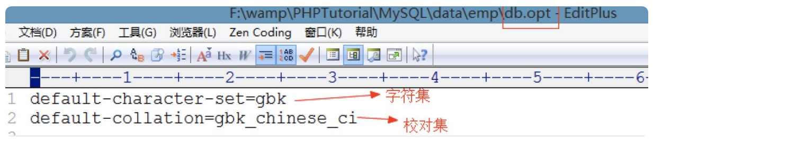

**退出登录：**

mysql> exit -- 方法一

mysql> quit -- 方法二

mysql> \q -- 方法三

创建的demo：

```
-- 创建数据库
mysql> create database stu;
Query OK, 1 row affected (0.06 sec)

-- 创建数据库时，如果数据库已经存在就要报错
mysql> create database stu;
# ERROR 1007 (HY000): Can't create database 'stu'; database exists

-- 在创建数据库时候，判断数据库是否存在，不存在就创建
mysql> create database if not exists stu;
Query OK, 1 row affected, 1 warning (0.00 sec)

-- 特殊字符、关键字做数据库名，使用反引号将数据库名括起来
mysql> create database `create`;
Query OK, 1 row affected (0.04 sec)

mysql> create database `%$`;
Query OK, 1 row affected (0.05 sec)

-- 创建数据库时指定存储的字符编码
mysql> create database emp charset=gbk;
Query OK, 1 row affected (0.00 sec)
# 如果不指定编码，数据库默认使用安装数据库时指定的编码
```

**显示所有数据库：**

 **

```
mysql> show databases;
+--------------------+
| Database           |
+--------------------+
| information_schema |
| mysql              |
| performance_schema |
| test               |
+--------------------+
4 rows in set (0.00 sec)
```

** 注意：数据库安装后，只带上面四个数据库

**删除数据库:**

**

```
// drop database [if exists] 数据库名

mysql> drop database `create`;
Query OK, 0 rows affected (0.00 sec)
```

---

**显示创建数据库的语句:**

**

```
mysql> show create database emp;
+----------+-------------------------------------------------------------+
| Database | Create Database                                             |
+----------+-------------------------------------------------------------+
| emp      | CREATE DATABASE `emp` /*!40100 DEFAULT CHARACTER SET gbk */ |
+----------+-------------------------------------------------------------+
1 row in set (0.00 sec)
```

****修改数据库:**

只能修改数据库选项，数据库的选项只有字符编码

```
mysql> alter database emp charset=utf8;
Query OK, 1 row affected (0.00 sec)
```

**选择数据库:**

**

```
mysql> use emp;
Database changed
```

## 2、表操作

****创建表:**

 **

```
create table [if not exists] `表名`(
    `字段名` 数据类型 [null|not null] [default] [auto_increment] [primary key] [comment],
    `字段名 数据类型 …
)[engine=存储引擎] [charset=字符编码]

null|not null     是否为空
default:          默认值
auto_increment    自动增长,默认从1开始，每次递增1
primary key       主键，主键的值不能重复，不能为空,每个表必须只能有一个主键
comment:          备注
engine            引擎决定了数据的存储和查找   myisam、innodb

tips：表名和字段名如果用了关键字，要用反引号引起来。
```

demo:

---

```
-- 设置客户端和服务器通讯的编码
mysql> set names gbk;  
Query OK, 0 rows affected (0.00 sec)

-- 创建简单的表
mysql> create table stu1(
    -> id int auto_increment primary key,
    -> name varchar(20) not null
    -> )engine=innodb charset=gbk;
Query OK, 0 rows affected (0.11 sec)

-- 创建复杂的表
mysql> create table stu2(
    -> id int auto_increment primary key comment '主键',
    -> name varchar(20) not null comment '姓名',
    -> `add` varchar(50) not null default '地址不详' comment '地址',
    -> score int comment '成绩,可以为空'
    -> )engine=myisam;
Query OK, 0 rows affected (0.06 sec)
```

** **小结：

1、如果不指定引擎，默认是innodb

2、如果不指定字符编码，默认和数据库编码一致

**

数据表的文件:

```
一个数据库对应一个文件夹
一个表对应一个或多个文件
引擎是myisam，一个表对应三个文件
  .frm  ：存储的是表结构
  .myd  :存储的是表数据
  .myi  :存储的表数据的索引
引擎是innodb,一个表对应一个表结构文件，innodb的都有表的数据都保存在ibdata1文件中，如果数据量很大，会自动的创建ibdata2，ibdata3...

innodb和myisam的区别
| 引擎   |                                                              |
| ------ | ------------------------------------------------------------ |
| myisam | 1、查询速度快<br />2、容易产生碎片<br />3、不能约束数据      |
| innodb | 1、以前没有myisam查询速度快，现在已经提速了<br />2、不产生碎片<br />3、可以约束数据 |

tips：推荐使用innodb

```

**显示所有表：**

```
show tables;
```

 **显示创建表的语句：** show create table; -- 结果横着排列

```
show create table \G  -- 将结果竖着排列
```

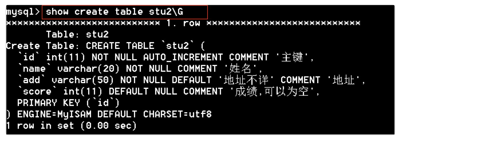

**查看表结构：**

**

```
// desc[ribe] 表名

mysql> describe stu2;
+-------+-------------+------+-----+----------+----------------+
| Field | Type        | Null | Key | Default  | Extra          |
+-------+-------------+------+-----+----------+----------------+
| id    | int(11)     | NO   | PRI | NULL     | auto_increment |
| name  | varchar(20) | NO   |     | NULL     |                |
| add   | varchar(50) | NO   |     | 地址不详   |                |
| score | int(11)     | YES  |     | NULL     |                |
+-------+-------------+------+-----+----------+----------------+
4 rows in set (0.05 sec)

-- 方法二
mysql> desc stu2;
+-------+-------------+------+-----+----------+----------------+
| Field | Type        | Null | Key | Default  | Extra          |
+-------+-------------+------+-----+----------+----------------+
| id    | int(11)     | NO   | PRI | NULL     | auto_increment |
| name  | varchar(20) | NO   |     | NULL     |                |
| add   | varchar(50) | NO   |     | 地址不详   |                |
| score | int(11)     | YES  |     | NULL     |                |
+-------+-------------+------+-----+----------+----------------+
4 rows in set (0.00 sec)
```

****复制表:两种：复制表数据和复制表结构**

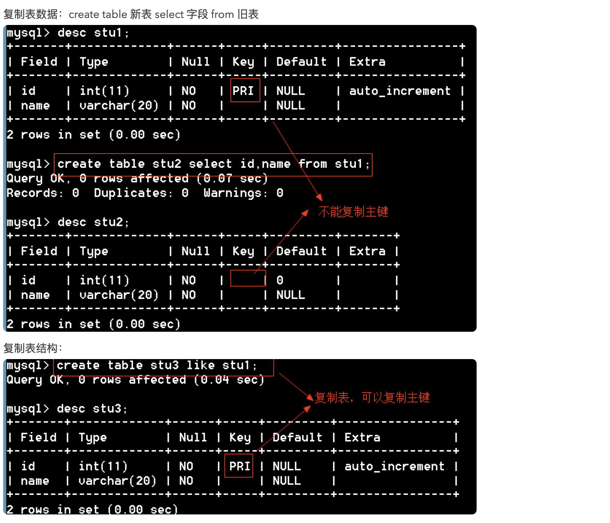

**删除表：**

```
// drop table [if exists] 表1，表2,… 

-- 删除表
mysql> drop table stu4;
Query OK, 0 rows affected (0.06 sec)

-- 如果表存在就删除
mysql> drop table if exists stu4;
Query OK, 0 rows affected, 1 warning (0.00 sec)

-- 一次删除多个表
mysql> drop table stu2,stu3;
Query OK, 0 rows affected (0.03 sec)
```

**修改表:（下面指的字段就是列）**

【1】修改表名

 **

```
// alter table 表名 rename to 新表名
-- 将stu表名改成student
mysql> alter table stu rename to student;
Query OK, 0 rows affected (0.00 sec)
```

【2】添加字段

```
// alter table 表名add [column] 字段名 数据类型 [位置]

mysql> alter table stu add `add` varchar(20); -- 默认添加字段放在最后
Query OK, 0 rows affected (0.05 sec)

mysql> alter table stu add sex char(1) after name;  -- 在name之后添加sex字段
Query OK, 0 rows affected (0.00 sec)
Records: 0  Duplicates: 0  Warnings: 0

mysql> alter table stu add age int first;  -- age放在最前面
Query OK, 0 rows affected (0.00 sec)
Records: 0  Duplicates: 0  Warnings: 0

mysql> desc stu;
+-------+-------------+------+-----+---------+-------+
| Field | Type        | Null | Key | Default | Extra |
+-------+-------------+------+-----+---------+-------+
| age   | int(11)     | YES  |     | NULL    |       |
| id    | int(11)     | YES  |     | NULL    |       |
| name  | varchar(20) | YES  |     | NULL    |       |
| sex   | char(1)     | YES  |     | NULL    |       |
| add   | varchar(20) | YES  |     | NULL    |       |
+-------+-------------+------+-----+---------+-------+
5 rows in set (0.00 sec)
```

【3】删除字段

```
// alter table 表 drop [column] 字段名  
mysql> alter table stu drop age;   -- 删除age字段
Query OK, 0 rows affected (0.00 sec)
Records: 0  Duplicates: 0  Warnings: 0
```

【4】改字段名

```
// alter table 表 change [column] 原字段名 新字段名 数据类型 …

-- 将name字段更改为stuname varchar(10)
mysql> alter table stu change name stuname varchar(10);
Query OK, 0 rows affected (0.02 sec)
Records: 0  Duplicates: 0  Warnings: 0

mysql> desc stu;
+---------+-------------+------+-----+---------+-------+
| Field   | Type        | Null | Key | Default | Extra |
+---------+-------------+------+-----+---------+-------+
| id      | int(11)     | YES  |     | NULL    |       |
| stuname | varchar(10) | YES  |     | NULL    |       |
| sex     | char(1)     | YES  |     | NULL    |       |
| add     | varchar(20) | YES  |     | NULL    |       |
+---------+-------------+------+-----+---------+-------+
4 rows in set (0.00 sec)
```

** 【5】修改字段的类型

```
// alter table 表 modify 字段名 字段属性…
// 将sex数据类型更改为varchar(20)
mysql> alter table stu  modify sex varchar(20);
Query OK, 0 rows affected (0.00 sec)
Records: 0  Duplicates: 0  Warnings: 0

// 将add字段更改为varchar(20) 默认值是‘地址不详’
mysql> alter table stu modify `add` varchar(20) default '地址不详';
Query OK, 0 rows affected (0.00 sec)
Records: 0  Duplicates: 0  Warnings: 0
```

将表移动到其他数据库:

```
// 将当前数据库中的student表移动到php74数据库中改名为stu
mysql> alter table student rename to php74.stu;
Query OK, 0 rows affected (0.00 sec)
```

## 3、表数据操作

### 【1】插入数据

**插入数据：**

```
-- 插入所有字段
mysql> insert into stu (id,stuname,sex,`add`) values (1,'tom','男','北京');
Query OK, 1 row affected (0.00 sec)

-- 插入部分字段
mysql> insert into stu(id,stuname) values (2,'berry');

-- 插入的字段和表的字段可以顺序不一致。但是插入字段名和插入的值一定要一一对应
mysql> insert into stu(sex,`add`,id,stuname) values ('女','上海',3,'ketty');
Query OK, 1 row affected (0.00 sec)

-- 插入字段名可以省略
mysql> insert into stu values(4,'rose','女','重庆');
Query OK, 1 row affected (0.00 sec)
```

tips：

1、插入字段名的顺序和数据表中字段名的顺序可以不一致

2、插入值的个数、顺序必须和插入字段名的个数、顺序要一致。

3、如果插入的值的顺序和个数与表字段的顺序个数一致，插入字段可以省略。

插入默认值和空值：

```
mysql> insert into stu values (5,'jake',null,default);
Query OK, 1 row affected (0.05 sec)
```

tips:

default关键字用来插入默认值，null用来插入空值.

插入多条数据：

```
mysql> insert into stu values (6,'李白','男','四川'),(7,'杜甫','男','湖北');
Query OK, 2 rows affected (0.00 sec)
Records: 2  Duplicates: 0  Warnings: 0
```

### 【2】更新数据

```
// update 表名 set 字段=值 [where 条件]
-- 将berry性别改为女
mysql> update stu set sex='女' where stuname='berry';
Query OK, 1 row affected (0.06 sec)

-- 将编号是1号的学生性别改成女，地址改为上海。
mysql> update stu set sex='女',`add`='上海' where id=1;
Query OK, 1 row affected (0.00 sec)
```

### 【3】删除数据

```
// delete from 表名 [where 条件]
-- 删除1号学生
mysql> delete from stu where id=1;

-- 删除名字是berry的学生
mysql> delete from stu where stuname='berry';
Query OK, 1 row affected (0.00 sec)

-- 删除所有数据
mysql> delete from stu;
Query OK, 5 rows affected (0.00 sec)
```

delete from 表和truncate table 表区别？

```
1、delete from 表：遍历表记录，一条一条的删除
2、truncate table：将原表销毁，再创建一个同结构的新表。就清空表而言，这种方法效率高。
```

【4】**查询数据**

**

```
// select 列名 from 表名

-- 查询id字段的值
mysql> select id from stu;

-- 查询id,stuname字段的值
mysql> select id,stuname from stu;、

-- 查询所有字段的值
mysql> select * from stu;
```

---

如果出现乱码，怎么看哪个码不对：

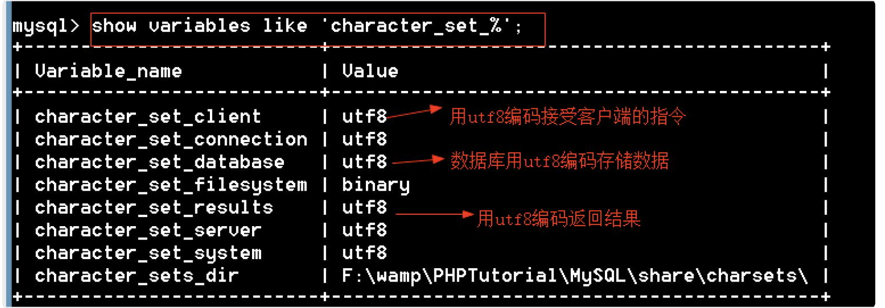

比如是客户端传过来的编码格式不对，就可以如下设置解除编码问题：**

```
mysql> set character_set_client=gbk;
Query OK, 0 rows affected (0.05 sec)
```

最简答的办法：将三码都设置成xxx编码方式

```
set names xxx;
```

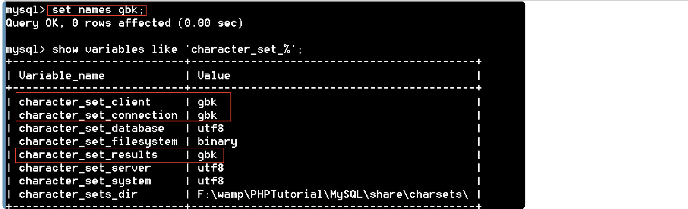

小结：

1、设置什么编码取决于客户端的编码

2、通过set names 设置编码

## 【4】校对集：

1、概念：在某种字符集下，字符之间的比较关系，比如a和B的大小关系，如果区分大小写a>B，如果不区分大小写则a<B。比如赵钱孙李大小关系，不同的标准关系不一样

2、校对集依赖与字符集，不同的字符集的的比较规则不一样，如果字符集更改，校对集也重新定义。

3、不同的校对集对同一字符序列比较的结果是不一致的。

4、 可以在定义字符集的同时定义校对集、 语法：

```
collate = 校对集
```

demo：

定义两个表，相同字符集不同校对集

```
mysql> create table stu1(
-> name char(1)
-> )charset=utf8 collate=utf8_general_ci;
Query OK, 0 rows affected (0.05 sec)

mysql> create table stu2(
-> name char(1)
-> )charset=utf8 collate=utf8_bin;
Query OK, 0 rows affected (0.05 sec)

mysql> insert into stu1 values ('a'),('B');
Query OK, 2 rows affected (0.00 sec)
Records: 2 Duplicates: 0 Warnings: 0

mysql> insert into stu2 values ('a'),('B');
Query OK, 2 rows affected (0.00 sec)
Records: 2 Duplicates: 0 Warnings: 0
```

测试：两个表的数据都是有小到大排序

```
mysql> select * from stu1 order by name; -- 不区分大小写
+------+
| name |
+------+
| a |
| B |
+------+
2 rows in set (0.08 sec)

mysql> select * from stu2 order by name; -- 区分大小写
+------+
| name |
+------+
| B |
| a |
+------+
2 rows in set (0.00 sec)
```

## 5、mysql数据类型

【1】整型

```
| 整形       | 占用字节数  | 范围                                      |
| --------- | ---------- | ---------------------------------------- |
| tinyint   | 1          | -128~127                                 |
| smallint  | 2          | -32768~32767                             |
| mediumint | 3          | -8388608~8388607                         |
| int       | 4          | -2147483648~2147483647                   |
| bigint    | 8          | -9223372036854775808~9223372036854775807 |
```

tips: 选择的范围尽可能小，范围越小占用资源越少

```
mysql> create table stu1(
    -> id tinyint,      # 范围要尽可能小，范围越小，占用空间越少
    -> name varchar(20)
    -> );
Query OK, 0 rows affected (0.02 sec)

// 超出范围会报错
mysql> insert into stu1 values (128,'tom');
ERROR 1264 (22003): Out of range value for column 'id' at row 1

// 无符号整形（unsigned） 无符号整形就是没有负数，无符号整数是整数的两倍
mysql> create table stu2(
    -> id tinyint unsigned    # 无符号整数
    -> );
Query OK, 0 rows affected (0.02 sec)

mysql> insert into stu2 values (128);
Query OK, 1 row affected (0.00 sec)

// 整形支持显示宽度，显示宽带是最小的显示位数，如int(11)表示整形最少用11位表示，如果不够位数用0填充。显示宽度默认不起作用，必须结合zerofill才起作用。

mysql> create table stu4(
    -> id int(5),
    -> num int(5) zerofill   # 添加前导0,int(5)显示宽带是5
    -> );
Query OK, 0 rows affected (0.05 sec)

mysql> insert into stu4 values (12,12);
Query OK, 1 row affected (0.00 sec)

mysql> select * from stu4;
+------+-------+
| id   | num   |
+------+-------+
|   12 | 00012 |
+------+-------+
1 row in set (0.00 sec)
```

tips:

1、范围要尽可能小，范围越小，占用空间越少

2、无符号整数是整数的两倍

3、整形支持显示宽度，显示宽带是最小的显示位数，必须结合zerofill才起作用

【2】浮点型

```
| 浮点型            | 占用字节数   | 范围               |
| ---------------- | ---------- | ------------------ |
| float（单精度型）  | 4          | -3.4E+38~3.4E+38   |
| double（双精度型） | 8          | -1.8E+308~1.8E+308 |
```

M：总位数 D：小数位数

```
mysql> create table stu5(
    -> num1 float(5,2),   -- 浮点数
    -> num2 double(6,1)   -- 双精度数
    -> );
Query OK, 0 rows affected (0.05 sec)

mysql> insert into stu5 values (3.1415,12.96);
Query OK, 1 row affected (0.00 sec)

mysql> select * from stu5;
+------+------+
| num1 | num2 |
+------+------+
| 3.14 | 13.0 |
+------+------+
1 row in set (0.00 sec)

// 科学记数法
mysql> create table stu6(
    -> num float   # 不指定位数，默认是小数点后面6位  double默认是17位
    -> );
Query OK, 0 rows affected (0.03 sec)

mysql> insert into stu6 values (5E2),(6E-2); # 插入科学计数法
Query OK, 2 rows affected (0.00 sec)
Records: 2  Duplicates: 0  Warnings: 0
mysql> select * from stu6;
+------+
| num  |
+------+
|  500 |
| 0.06 |
+------+
2 rows in set (0.00 sec)

// 浮点数精度会丢失
mysql> insert into stu6 values(99.999999999);
Query OK, 1 row affected (0.00 sec)
mysql> select * from stu6;
+------+
| num  |
+------+
|  100 |
+------+
```

tips:

1、浮点数有单精度和双精度

2、浮点数支持科学计数法

3、浮点数精度会丢失

【3】小数（定点数）

原理：将整数部分和小数部分分开存储

```
// decimal(M,D)
mysql> create table stu8(
    -> num decimal(20,9)   # 存放定点数
    -> );
Query OK, 0 rows affected (0.00 sec)

mysql> insert into stu8 values(12.999999999);
Query OK, 1 row affected (0.00 sec)

mysql> select * from stu8;
+--------------+
| num          |
+--------------+
| 12.999999999 |
+--------------+
1 row in set (0.00 sec)
```

tips:

1、decimal是变长的，大致是每9个数字用4个字节存储，整数和小数分开计算。M最大是65,D最大是30，默认是（10,2）。

2、定点和浮点都支持无符号、显示宽度0填充。

【4】**字符型**

在数据库中没有字符串概念，只有字符，所以数据库中只能用单引号

```
| 数据类型    | 描述                       |
| ---------- | ------------              |
| char       | 定长字符，最大可以到255       |
| varchar    | 可变长度字符，最大可以到65535 |
| tinytext   | 2^8^–1 =255               |
| text       | 2^16^–1 =65535            |
| mediumtext | 2^24^–1                   |
| longtext   | 2^32^–1                   |
```

tips:

char(4)：存放4个字符，中英文一样。

varchar(L)实现变长机制，需要额外的空间来记录数据真实的长度。

L的理论长度是65535，但事实上达不到，因为有的字符是多字节字符，所以L达不到65535。

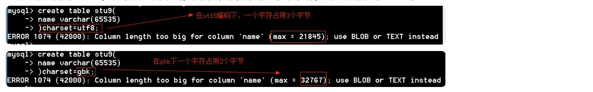

一个记录的所有字段的总长度也不能超过65535个字节.

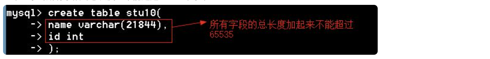


总结：

1、char是定长，var是变长

2、char最大值是255，varchar最大值是65535，具体要看字符编码

3、text系列在表中存储的是地址

4、一条记录的总长度不能超过65535

【5】**枚举(enum)**

 **

```
mysql> create table stu12(
    -> name varchar(20),
    -> sex enum('男','女','保密') # 枚举
    -> );
Query OK, 0 rows affected (0.06 sec)

-- 插入的枚举值只能是枚举中提供的选项
mysql> insert into stu12 values ('tom','男');
Query OK, 1 row affected (0.00 sec)
-- 报错，只能插入男、女、保密
mysql> insert into stu12 values ('tom','不告诉你');
ERROR 1265 (01000): Data truncated for column 'sex' at row 1
```

枚举值是通过整形数字来管理的，第一个值是1，第二个值是2，以此类推，枚举值在数据库存储的是整形数字。

```
mysql> insert into stu12 values ('berry',2);   -- 插入数字
Query OK, 1 row affected (0.00 sec)

mysql> select * from stu12;
+-------+------+
| name  | sex  |
+-------+------+
| tom   | 男     |
| berry | 女    |
+-------+------+

mysql> select * from stu12 where sex=2;   -- 2表示第二个枚举值
+-------+------+
| name  | sex  |
+-------+------+
| berry | 女    |
+-------+------+
1 row in set (0.00 sec)
```

【6】**集合(set)**

从集合中选择一些值作为数据（多选）

```
mysql> create table stu13(
    -> name varchar(20),
    -> hobby set('爬山','读书','游泳','烫头')  -- 集合
    -> );
Query OK, 0 rows affected (0.00 sec)

mysql> insert into stu13 values ('tom','爬山');
mysql> insert into stu13 values ('Berry','爬山,游泳');
Query OK, 1 row affected (0.00 sec)

mysql> insert into stu13 values ('Berry','游泳,爬山');   -- 插入的顺序不一样，但显示的顺序一样
Query OK, 1 row affected (0.00 sec)

mysql> select * from stu13;
+-------+-----------+
| name  | hobby     |
+-------+-----------+
| tom   | 爬山         |
| Berry | 爬山,游泳       |
| Berry | 爬山,游泳       |
+-------+-----------+
3 rows in set (0.00 sec)
```

集合和枚举一样，也为每个集合元素分配一个固定值，分配方式是从前往后按2的0、1、2、…次方，转换成二进制后只有一位是1，其他都是0。

```
'爬山','读书','游泳','烫头'
  1     2      4     8

mysql> select hobby+0 from stu13;
+---------+
| hobby+0 |
+---------+
|       1 |
|       5 |
|       5 |
+---------+
mysql> insert into stu13 values ('rose',15);
Query OK, 1 row affected (0.00 sec)
```

** **【7】**日期时间型**

**

```
| 数据类型  | 描述                     |
| --------- | ---------------------  |
| datetime  | 日期时间，占用8个字节     |
| date      | 日期  占用3个字节        |
| time      | 时间 占用3个字节         |
| year      | 年份，占用1个字节        |
| timestamp | 时间戳，占用4个字节      |
```

（1）datetime和date：datetime格式：年-月-日 小时:分钟:秒。支持的范围是'1000-01-01 00:00:00'到'9999-12-31 23:59:59'。

```
mysql> create table stu14(
    -> t1 datetime,    -- 日期时间
    -> t2 date        -- 日期
    -> );
Query OK, 0 rows affected (0.05 sec)
-- 插入测试数据
mysql> insert into stu14 values ('2019-01-15 12:12:12','2019-01-15 12:12:12');
Query OK, 1 row affected, 1 warning (0.00 sec)
-- 查询
mysql> select * from stu14;
+---------------------+------------+
| t1                  | t2         |
+---------------------+------------+
| 2019-01-15 12:12:12 | 2019-01-15 |
+---------------------+------------+
1 row in set (0.00 sec)
```

timestamp（时间戳）

```
datetime类型和timestamp类型表现上是一样的，他们的区别在于：
datetime从1000到9999，而timestamp从1970年~2038年（原因在于timestamp占用4个字节，和整形的范围一样，2038年01月19日11:14:07以后的秒数就超过了4个字节的长度）

```mysql
mysql> create table stu15(
    -> t1 timestamp
    -> );
Query OK, 0 rows affected (0.06 sec)

mysql> insert into stu15 values ('2038-01-19 11:14:07');
Query OK, 1 row affected (0.00 sec)
```

year

```
只能表示1901~2155之间的年份，因为只占用1个字节，只能表示255个数
mysql> create table stu16(
    -> y1 year
    -> );
Query OK, 0 rows affected (0.08 sec)

mysql> insert into stu16 values (2155);
Query OK, 1 row affected (0.00 sec)
```

time

```
mysql> create table stu17(
    -> t1 time
    -> );
Query OK, 0 rows affected (0.02 sec)

mysql> insert into stu17 values ('12:12:12');
Query OK, 1 row affected (0.00 sec)

mysql> insert into stu17 values ('212:12:12');
Query OK, 1 row affected (0.00 sec)

mysql> insert into stu17 values ('-212:12:12');
Query OK, 1 row affected (0.00 sec)

mysql> insert into stu17 values ('839:00:00');   -- 报错
ERROR 1292 (22007): Incorrect time value: '839:00:00' for column 't1' at row 1

-- time支持以天的方式来表示时间间隔
mysql> insert into stu17 values ('10 10:25:25');   -- 10天10小时25分25秒
Query OK, 1 row affected (0.00 sec)

mysql> select * from stu17;
+------------+
| t1         |
+------------+
| 12:12:12   |
| 212:12:12  |
| -212:12:12 |
| 250:25:25  |
+------------+
4 rows in set (0.00 sec)
```

【8】Boolean

MySQL不支持布尔型，true和false在数据库中对应的是1和0

```
mysql> create table stu18(
    -> flag boolean
    -> );
Query OK, 0 rows affected (0.05 sec)

mysql> desc stu18;
+-------+------------+------+-----+---------+-------+
| Field | Type       | Null | Key | Default | Extra |
+-------+------------+------+-----+---------+-------+
| flag  | tinyint(1) | YES  |     | NULL    |       |
+-------+------------+------+-----+---------+-------+
1 row in set (0.00 sec)

mysql> insert into stu18 values (true),(false);
Query OK, 2 rows affected (0.00 sec)
Records: 2  Duplicates: 0  Warnings: 0

mysql> select * from stu18;
+------+
| flag |
+------+
|    1 |
|    0 |
+------+
2 rows in set (0.00 sec
```

tips:

boolean型在MySQL中对应的是tinyint

demo:

电话号码一般使用什么数据类型存储? varchar

手机号码用什么数据类型 char

性别一般使用什么数据类型存储? char tinyint enum

年龄信息一般使用什么数据类型存储? tinyint

照片信息一般使用什么数据类型存储? binary

薪水一般使用什么数据类型存储? decimal

## 6、列属性

【1】**是否为空（null|not null）**

**

```
null表示字段值可以为null
not null字段值不能为空
```

【2】 **默认值（default）：** default关键字用来插入默认值

---

```
mysql> create table stu19(
    -> name varchar(20) not null default '姓名不详',
    -> addr varchar(50) not null default '地址不详'
    -> );
Query OK, 0 rows affected (0.05 sec)

mysql> insert into stu19(name) values ('tom');
Query OK, 1 row affected (0.00 sec)

mysql> insert into stu19 values (default,default);
Query OK, 1 row affected (0.00 sec)

mysql> select * from stu19;
+----------+----------+
| name     | addr     |
+----------+----------+
| tom      | 地址不详   |
| 姓名不详  | 地址不详   |
+----------+----------+
2 rows in set (0.00 sec)
```

【3】**自动增长（auto_increment）**

字段值从1开始，每次递增1，自动增长的值就不会有重复，适合用来生成唯一的id。**在MySQL中只要是自动增长列必须是主键**

【4】**主键（primary key）**

****  ****主键概念：唯一标识表中的记录的一个或一组列称为主键。

主键注意点：

**** 1、不能重复、不能为空

 ****2、一个表只能有一个主键。

****  ****主键作用：

**** 1、保证数据完整性

2、加快查询速度

练习：

 **

```
// 创建主键方法一
mysql> create table stu20(
    -> id int auto_increment primary key,
    -> name varchar(20)
    -> );
Query OK, 0 rows affected (0.04 sec)

// 创建主键方法二
mysql> create table stu21(
    -> id int auto_increment,
    -> name varchar(20),
    -> primary key(id)
    -> );
Query OK, 0 rows affected (0.02 sec)

// 创建主键-组合键
mysql> create table stu22(
    -> classname varchar(20),
    -> stuname varchar(20),
    -> primary key(classname,stuname)  -- 创建组合键
    -> );
Query OK, 0 rows affected (0.00 sec)

mysql> desc stu22;
+-----------+-------------+------+-----+---------+-------+
| Field     | Type        | Null | Key | Default | Extra |
+-----------+-------------+------+-----+---------+-------+
| classname | varchar(20) | NO   | PRI |         |       |
| stuname   | varchar(20) | NO   | PRI |         |       |
+-----------+-------------+------+-----+---------+-------+
2 rows in set (0.00 sec)

// 通过更改表添加主键
mysql> create table stu23(
    -> id int,
    -> name varchar(20)
    -> );
Query OK, 0 rows affected (0.05 sec)
-- 添加主键
mysql> alter table stu23 add primary key(id);
Query OK, 0 rows affected (0.09 sec)
Records: 0  Duplicates: 0  Warnings: 0

// 删除主键
mysql> alter table stu23 drop primary key;
Query OK, 0 rows affected (0.03 sec)
Records: 0  Duplicates: 0  Warnings: 0

// 插入数据
mysql> create table stu25(
    -> id tinyint unsigned auto_increment primary key,
    -> name varchar(20)
    -> );
Query OK, 0 rows affected (0.05 sec)

-- 插入数据
mysql> insert into stu25 values (3,'tom');   -- 可以直接插入数字
Query OK, 1 row affected (0.06 sec)

-- 自动增长列可以插入null,让列的值自动递增
mysql> insert into stu25 values (null,'berry');
Query OK, 1 row affected (0.00 sec)
```

** **tips:

1、只要是auto_increment必须是主键，但是主键不一定是auto_increment

2、主键特点是不能重复不能为空

3、一个表只能有一个主键，但是一个主键可以有多个字段组成

4、自动增长列通过插入null值让其递增

5、自动增长列的数据被删除，默认不再重复使用。truncate table删除数据后，再次插入从1开始

---

练习：

```
在主键列输入的数值，允许为空吗?    不可以
一个表可以有多个主键吗?        不可以
在一个学校数据库中，如果一个学校内允许重名的学员，但是一个班级内不允许学员重名，可以组合班级和姓名两个字段一起来作为主键吗？            对
标识列（自动增长列）允许为字符数据类型吗？ 不允许
一个自动增长列中，插入3行，删除2行，插入3行，删除2行，插入3行，删除2行，再次插入是多少？  10
```

【5】**唯一键（unique）**

**

```
| 键     | 区别                                          |
| ------ | -------------------------------------------- |
| 主键   | 1、不能重复，不能为空<br />2、一个表只能有一个主键   |
| 唯一键 | 1、不能重刻，可以为空<br />2、一个表可以有多个唯一键  |
```

demo：

```
-- 创建表的时候创建唯一键 
mysql> create table stu26(
    -> id int auto_increment primary key,
    -> name varchar(20) unique    -- 唯一键
    -> );
Query OK, 0 rows affected (0.05 sec)

-- 方法二 
mysql> create table stu27(
    -> id int primary key,
    -> name varchar(20),
    -> unique(name)
    -> );
Query OK, 0 rows affected (0.05 sec)
```

tips：unique 或 unique key 是一样的

通过修改表添加唯一键：

```
// 将name设为唯一键
mysql> alter table stu28 add unique(name);  
// 将name,addr设为唯一键
mysql> alter table stu28 add unique(name),add unique(addr);
Query OK, 0 rows affected (0.00 sec)
Records: 0  Duplicates: 0  Warnings: 0

mysql> desc stu28;
+-------+-------------+------+-----+---------+-------+
| Field | Type        | Null | Key | Default | Extra |
+-------+-------------+------+-----+---------+-------+
| id    | int(11)     | NO   | PRI | NULL    |       |
| name  | varchar(20) | YES  | UNI | NULL    |       |
| addr  | varchar(20) | YES  | UNI | NULL    |       |
+-------+-------------+------+-----+---------+-------+
3 rows in set (0.02 sec)
```

通过show create table 查看唯一键的名字:

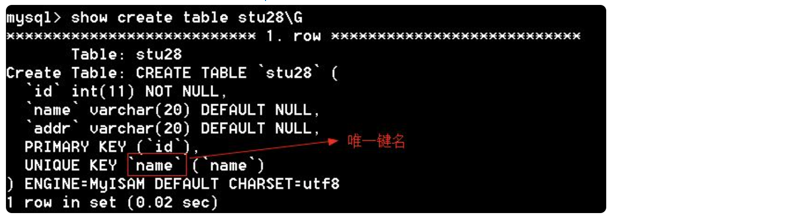

通过唯一键的名字删除唯一键:

```
mysql> alter table stu28 drop index name;
Query OK, 0 rows affected (0.00 sec)
Records: 0  Duplicates: 0  Warnings: 0
```

【6】 **备注（comment）：** 说明性文本

```
mysql> create table stu29(
    -> id int primary key comment '学号',
    -> name varchar(20) not null comment '姓名'
    -> );
Query OK, 0 rows affected (0.03 sec)
```

**

**## 8、SQL注释

-- 单行注释

# 单行注释

/* */ 多行注释

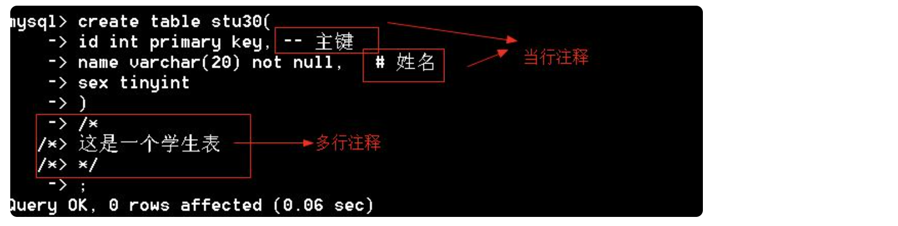

## 9、主表和从表

**主从表的使用规则：**

1. 主表中没有的记录，从表不允许插入
2. 从表中有的记录，主表中不允许删除
3. 删除主表前，先删子表

添加外键：

```
-- 创建表的时候添加外键
drop table if exists stuinfo;
create table stuinfo( # 主表
       id tinyint primary key,
       name varchar(20)
)engine=innodb;

drop table if exists stuscore;
create table stuscore( # 从表
       sid tinyint primary key,
       score tinyint unsigned,
       foreign key(sid) references stuinfo(id)   -- 创建外键
)engine=innodb;

-- 通过修改表的时候添加外键
语法：alter table 从表 add foreign key(公共字段) references 主表(公共字段)

drop table if exists stuinfo;
create table stuinfo(
       id tinyint primary key,
       name varchar(20)
)engine=innodb;

drop table if exists stuscore;
create table stuscore(
       sid tinyint primary key,
       score tinyint unsigned
)engine=innodb;

alter table stuscore add foreign key (sid) references stuinfo(id)
```

删除外键：

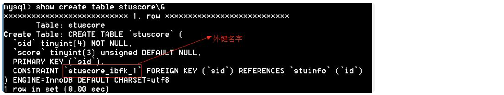

```
mysql> alter table stuscore drop foreign key `stuscore_ibfk_1`;
Query OK, 0 rows affected (0.00 sec)
Records: 0  Duplicates: 0  Warnings: 0
```

小结：

1、只有innodb才能支持外键

2、公共字段的名字可以不一样，但是数据类型要一样

**三种外键操作：**

1、 严格限制（参见主表和从表）

2、 置空操作（set null）：如果主表记录删除，或关联字段更新，则从表外键字段被设置为null。

3、 级联操作（cascade）：如果主表记录删除，则从表记录也被删除。主表更新，从表外键字段也更新。

语法：foreign key (外键字段) references 主表名 (关联字段) [主表记录删除时的动作] [主表记录更新时的动作]。

一般说删除时置空，更新时级联。

```
drop table if exists stuinfo;
create table stuinfo(
       id tinyint primary key comment '学号，主键',
       name varchar(20) comment '姓名'
)engine=innodb;

drop table if exists stuscore;
create table stuscore(
       id int auto_increment primary key comment '主键',
       sid tinyint comment '学号，外键',
       score tinyint unsigned comment '成绩',
       foreign key(sid) references stuinfo(id) on delete set null on update cascade
)engine=innodb;
```

tips:

置空、级联操作中外键不能是从表的主键

phpstudy中MySQL默认不是严格模式，将MySQL设置成严格模式

打开my.ini，在sql-mode的值中，添加STRICT_TRANS_TABLES

```
sql-mode="NO_AUTO_CREATE_USER,NO_ENGINE_SUBSTITUTION,STRICT_TRANS_TABLES"
```

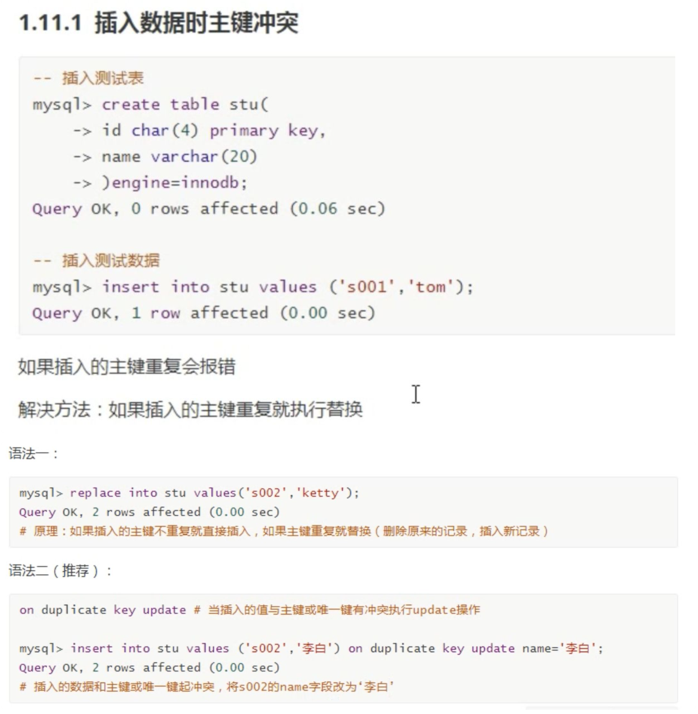

## 10、数据库设计

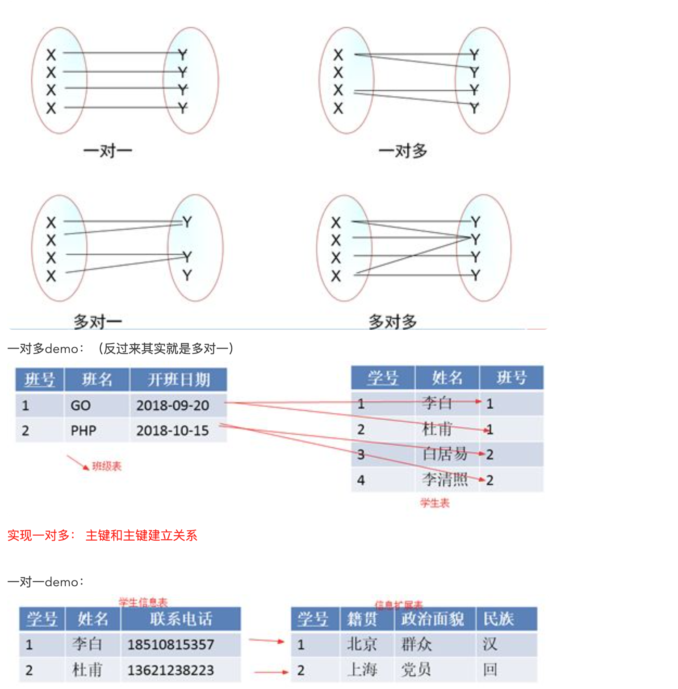

一对一为啥不用一张表存：

在字段数量很多情况下，数据量也就很大，每次查询都需要检索大量数据，这样效率低下。我们可以将所有字段分成两个部分，“常用字段”和“不常用字段”，这样对大部分查询者来说效率提高了。【表的垂直分割】

**实现一对一： 主键和主键建立关系**

多对多demo：

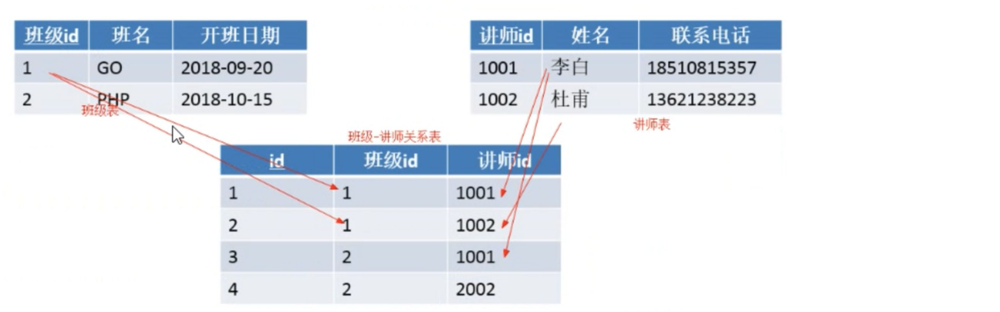

**实现多对多： 引入第三章关系表**

设计步骤（demo）:

第一步：收集信息

```
BBS论坛的基本功能：
用户注册和登录，后台数据库需要存放用户的注册信息和在线状态信息；
用户发贴，后台数据库需要存放贴子相关信息，如贴子内容、标题等；
用户可以对发帖进行回复；
论坛版块管理：后台数据库需要存放各个版块信息，如版主、版块名称、贴子数等；
```

第二步：标识对象

```
实体一般是名词：
1、用户对象
2、板块对象
3、帖子对象
4、跟帖对象
```

第三步：标识每个实体的属性

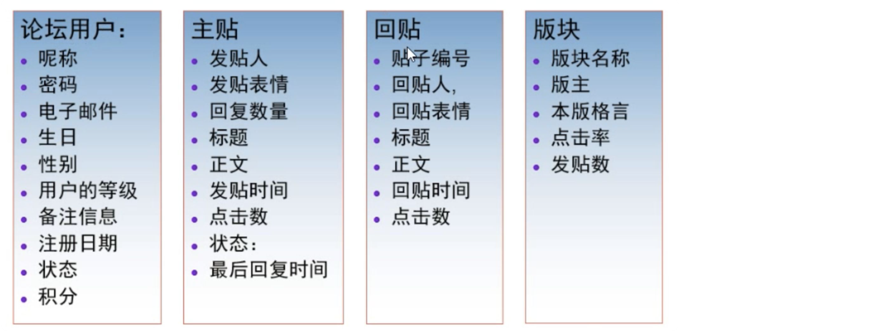

第四步：标识对象之间的关系

标识对象之间的关系可以通过ER图来展示

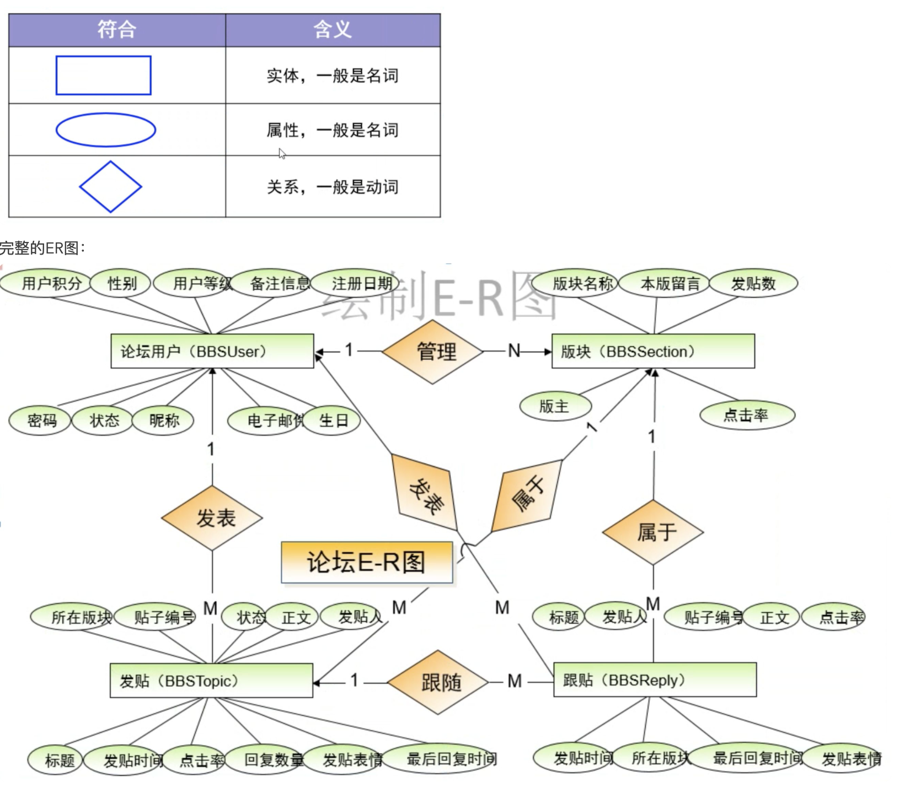

在图转表的时候，要注意一下两点：

1. 实体转成表，属性转成字段
2. 如果没有合适的字段做主键，给表添加一个自动增长列做主键。

还要遵循下面三个范式：

第一范式：确保每列原子性，一个字段一个含义

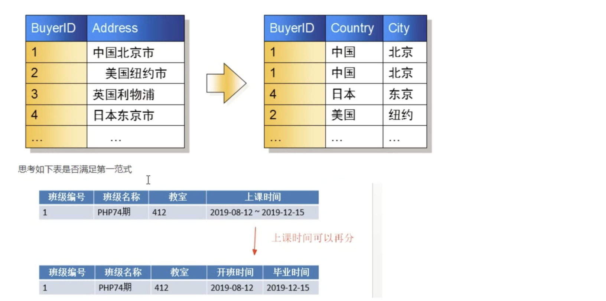

思考：地址包含省、市、县、地区是否需要拆分？

如果仅仅起地址的作用，不需要统计，可以不拆分；如果有按地区统计的功能需要拆分。

在实际项目中，建议拆分。

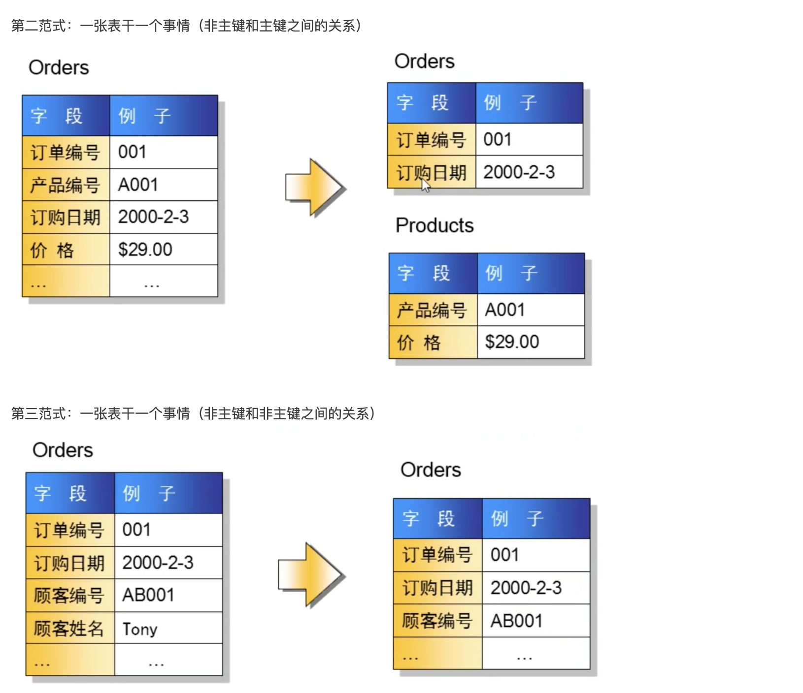

**反3NF设计：**

范式越高，数据冗余越少，但是效率有时就越地下，为了提高运行效率，可以适当让数据冗余。

| 学号 | 姓名 | 语文 | 数学 | 总分 |

| ---- | ---- | ---- | ---- | ---- |

| 1 | 李白 | 77 | 88 | 165 |

上面的设计不满足第三范式，但是高考分数表就是这样设计的，为什么？

答：高考分数峰值访问量非常大，这时候就是性能更重要。当性能和规范化冲突的时候，我们首选性能。这就是“反三范式”。

小结

1、第一范式约束的所有字段

2、第二范式约束的主键和非主键的关系

3、第三范式约束的非主键之间的关系

4、范式越高，冗余越少，但表业越多。

5、规范化和性能的关系 ：性能比规范化更重要

## 11、**查询语句(单表查询基础语法)**

```
语法：select [选项] 列名 [from 表名] [where 条件]  [group by 分组] [order by 排序][having 条件] [limit 限制]
```

【1】select基本使用：

```
mysql> select '锄禾日当午';
+------------+
| 锄禾日当午          |
+------------+
| 锄禾日当午          |
+------------+
1 row in set (0.00 sec)

-- 输出表达式
mysql> select 10*10;
+-------+
| 10*10 |
+-------+
|   100 |
+-------+
1 row in set (0.00 sec)

mysql> select ch,math,ch+math from stu;
+------+------+---------+
| ch   | math | ch+math |
+------+------+---------+
|   80 | NULL |    NULL |
|   77 |   76 |     153 |
|   55 |   82 |     137 |
| NULL |   74 |    NULL |

-- 表达式部分可以用函数
mysql> select rand();
+--------------------+
| rand()             |
+--------------------+
| 0.6669325378415478 |
+--------------------+
1 row in set (0.00 sec)
```

通过as给字段取别名：

```
mysql> select '锄禾日当午' as '标题';   -- 取别名
+------------+
| 标题           |
+------------+
| 锄禾日当午          |
+------------+
1 row in set (0.00 sec)

mysql> select ch,math,ch+math as '总分' from stu;
+------+------+------+
| ch   | math | 总分    |
+------+------+------+
|   80 | NULL | NULL |
|   77 |   76 |  153 |
|   55 |   82 |  137 |
| NULL |   74 | NULL |

-- 多学一招：as可以省略
mysql> select ch,math,ch+math '总分' from stu;
+------+------+------+
| ch   | math | 总分    |
+------+------+------+
|   80 | NULL | NULL |
|   77 |   76 |  153 |
|   55 |   82 |  137 |
| NULL |   74 | NULL |
```

【2】from：

笛卡尔积：

```
// from：来自，from后面跟的是数据源。数据源可以有多个。返回笛卡尔积。
create table t1(
       str char(2)
);
insert into t1 values ('aa'),('bb');
create table t2(
       num int
);
insert into t2 values (10),(20);

测试
// from子句
mysql> select * from t1;
+------+
| str  |
+------+
| aa   |
| bb   |
+------+
2 rows in set (0.00 sec)
// 多个数据源,返回笛卡尔积
mysql> select * from t1,t2;
+------+------+
| str  | num  |
+------+------+
| aa   |   10 |
| bb   |   10 |
| aa   |   20 |
| bb   |   20 |
+------+------+
4 rows in set (0.00 sec)
```

dual表: 是一个伪表。在有些特定情况下，没有具体的表的参与，但是为了保证select语句的完整又必须要一个表名，这时候就使用伪表。

```
mysql> select 10*10 as 结果 from dual;
+------+
| 结果     |
+------+
|  100 |
+------+
1 row in set (0.00 sec)
```

**【3】where子句:**

**

```
-- 比较运算符
> 大于
< 小于
>=  大于等于
<=  小于等于
= 等于
!=  不等于

-- 逻辑运算符
and  与
or   或
not  非
-- 其他
in | not in            字段的值在枚举范围内
between…and|not between…and      字段的值在数字范围内
is null | is not null      字段的值不为空
```

demo:

```
-- 查找语文成绩及格的学生
mysql> select * from stu where ch>=60;
-- 查询语文和数学都及格的学生
mysql> select * from stu where ch>=60 and math>=60;
-- 查询语文或数学不及格的学生
mysql> select * from stu where ch<60 or math<60;
```

思考：

```
-- 输出所有数据
mysql> select * from stu where 1;  
-- 不输出数据 
mysql> select * from stu where 0;   
-- 通过or实现
mysql> select * from stu where stuaddress='北京' or stuaddress='上海';
-- 通过in语句实现
mysql> select * from stu where stuaddress in ('北京','上海');
-- 查询不是北京和上海的学生
mysql> select * from stu where stuaddress not in ('北京','上海');
-- 查看年龄在20到25岁之间 方法一：
mysql> select * from stu where stuage>=20 and stuage<=25;
-- 查看年龄在20到25岁之间 方法二：
mysql> select * from stu where not(stuage<20 or stuage>25);
-- 查看年龄在20到25岁之间 方法三：between...and...
mysql> select * from stu where stuage between 20 and 25;
-- 年龄不在20~25之间
mysql> select * from stu where stuage not between 20 and 25;
-- 查找缺考的学生
mysql> select * from stu where ch is null or math is null;
+--------+----------+--------+--------+---------+------------+------+------+
| stuNo  | stuName  | stuSex | stuAge | stuSeat | stuAddress | ch   | math |
+--------+----------+--------+--------+---------+------------+------+------+
| s25301 | 张秋丽         | 男       |     18 |       1 | 北京           |   80 | NULL |
| s25304 | 欧阳俊雄        | 男       |     28 |       4 | 天津           | NULL |   74 |
+--------+----------+--------+--------+---------+------------+------+------+
-- 查找没有缺考的学生
mysql> select * from stu where ch is not null and math is not null;
+--------+----------+--------+--------+---------+------------+------+------+
| stuNo  | stuName  | stuSex | stuAge | stuSeat | stuAddress | ch   | math |
+--------+----------+--------+--------+---------+------------+------+------+
| s25302 | 李文才        | 男       |     31 |       3 | 上海          |   77 |   76 |
| s25303 | 李斯文        | 女      |     22 |       2 | 北京           |   55 |   82 |
| s25305 | 诸葛丽丽         | 女      |     23 |       7 | 河南           |   72 |   56 |
| s25318 | 争青小子        | 男       |     26 |       6 | 天津           |   86 |   92 |
| s25319 | 梅超风        | 女      |     23 |       5 | 河北          |   74 |   67 |
| s25320 | Tom      | 男       |     24 |       8 | 北京           |   65 |   67 |
| s25321 | Tabm     | 女      |     23 |       9 | 河北          |   88 |   77 |
+--------+----------+--------+--------+---------+------------+------+------+
7 rows in set (0.00 sec)
-- 查找需要补考的学生
mysql> select * from stu where ch<60 or math<60 or ch is null or math is null;
+--------+----------+--------+--------+---------+------------+------+------+
| stuNo  | stuName  | stuSex | stuAge | stuSeat | stuAddress | ch   | math |
+--------+----------+--------+--------+---------+------------+------+------+
| s25301 | 张秋丽         | 男       |     18 |       1 | 北京           |   80 | NULL |
| s25303 | 李斯文        | 女      |     22 |       2 | 北京           |   55 |   82 |
| s25304 | 欧阳俊雄        | 男       |     28 |       4 | 天津           | NULL |   74 |
| s25305 | 诸葛丽丽         | 女      |     23 |       7 | 河南           |   72 |   56 |
+--------+----------+--------+--------+---------+------------+------+------+
4 rows in set (0.00 sec)
```

【4】 **group by 【分组查询】：** 将查询的结果分组，分组查询目的在于统计数据。

**

```
-- 查询男生和女生的各自语文平均分
mysql> select stusex,avg(ch) '平均分' from stu group by stusex;
+--------+---------+
| stusex | 平均分       |
+--------+---------+
| 女      | 72.2500 |
| 男       | 77.0000 |
+--------+---------+
2 rows in set (0.00 sec)

-- 查询男生和女生各自多少人
mysql> select stusex,count(*) 人数 from stu group by stusex;
+--------+------+
| stusex | 人数     |
+--------+------+
| 女      |    4 |
| 男       |    5 |
+--------+------+
2 rows in set (0.00 sec)

-- 查询每个地区多少人
mysql> select stuaddress,count(*) from stu group by stuaddress;
+------------+----------+
| stuaddress | count(*) |
+------------+----------+
| 上海          |        1 |
| 北京           |        3 |
| 天津           |        2 |
| 河北          |        2 |
| 河南           |        1 |
+------------+----------+
5 rows in set (0.00 sec)

-- 每个地区的数学平均分
mysql> select stuaddress,avg(math) from stu group by stuaddress;
+------------+-----------+
| stuaddress | avg(math) |
+------------+-----------+
| 上海          |   76.0000 |
| 北京           |   74.5000 |
| 天津           |   83.0000 |
| 河北          |   72.0000 |
| 河南           |   56.0000 |
+------------+-----------+
5 rows in set (0.00 sec)
```

**注意点：**

**如果一旦分组，如下，select选取了setuname和setsex，但是是通过setsex来分组的，这个时候，setname并不能正常取值，而是取的命中数据的第一条（可以看错是取数错误）。逻辑上正常分组可以变成group by setsex，setname，但是人名都是唯一的，也没必要用它分组，所以没有意义，像这种group by多个字段的情况，叫做多列分组：**

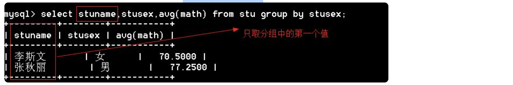

** **多列分组：

```
mysql> select stuaddress,stusex,avg(math) from stu group by stuaddress,stusex;
+------------+--------+-----------+
| stuaddress | stusex | avg(math) |
+------------+--------+-----------+
| 上海          | 男       |   76.0000 |
| 北京           | 女      |   82.0000 |
| 北京           | 男       |   67.0000 |
| 天津           | 男       |   83.0000 |
| 河北          | 女      |   72.0000 |
| 河南           | 女      |   56.0000 |
+------------+--------+-----------+
6 rows in set (0.00 sec)
```

小结：

** **1、如果是分组查询，查询字段是分组字段和聚合函数。

2、查询字段是普通字段，只取第一个值

【5】**order by排序：**

**

```
// asc：升序【默认】
// desc：降序

-- 按年龄的升序排列
mysql> select * from stu order by stuage asc;
mysql>  select * from stu order by stuage;       -- 默认是升序

-- 按总分降序
mysql> select *,ch+math '总分' from stu order by ch+math desc;

// 多列排序
-- 年龄升序，如果年龄一样，按ch降序排列
mysql> select * from stu order by stuage asc,ch desc;

select * from stu order by stuage desc,ch desc;     #年龄降序，语文降序
select * from stu order by stuage desc,ch asc;    #年龄降序，语文升序
select * from stu order by stuage,ch desc;          #年龄升序、语文降序
select * from stu order by stuage,ch;         #年龄升序、语文升序
```

【6】 **having条件：** 是在结果集上进行条件筛选（where是对原始数据进行筛选）

**

**

```
-- 查询女生
mysql> select * from stu where stusex='女';
+--------+----------+--------+--------+---------+------------+------+------+
| stuNo  | stuName  | stuSex | stuAge | stuSeat | stuAddress | ch   | math |
+--------+----------+--------+--------+---------+------------+------+------+
| s25303 | 李斯文        | 女      |     22 |       2 | 北京           |   55 |   82 |
| s25305 | 诸葛丽丽         | 女      |     23 |       7 | 河南           |   72 |   56 |
| s25319 | 梅超风        | 女      |     23 |       5 | 河北          |   74 |   67 |
| s25321 | Tabm     | 女      |     23 |       9 | 河北          |   88 |   77 |
+--------+----------+--------+--------+---------+------------+------+------+
4 rows in set (0.00 sec)

-- 查询女生
mysql> select * from stu having stusex='女';
+--------+----------+--------+--------+---------+------------+------+------+
| stuNo  | stuName  | stuSex | stuAge | stuSeat | stuAddress | ch   | math |
+--------+----------+--------+--------+---------+------------+------+------+
| s25303 | 李斯文    | 女      |     22 |       2 | 北京       |   55 |   82 |
| s25305 | 诸葛丽丽  | 女      |     23 |       7 | 河南       |   72 |   56 |
| s25319 | 梅超风    | 女      |     23 |       5 | 河北       |   74 |   67 |
| s25321 | Tabm     | 女      |     23 |       9 | 河北       |   88 |   77 |
+--------+----------+--------+--------+---------+------------+------+------+
4 rows in set (0.00 sec)

-- 查询女生姓名
mysql> select stuname from stu where stusex='女';
+----------+
| stuname  |
+----------+
| 李斯文    |
| 诸葛丽丽  |
| 梅超风    |
| Tabm     |
+----------+
4 rows in set (0.00 sec)

-- 使用having报错，因为结果集中没有stusex字段
mysql> select stuname from stu having stusex='女';
ERROR 1054 (42S22): Unknown column 'stusex' in 'having clause'
```

【7】**limit ：**

**1、参数： **limit [**起始位置**]，显示长度

2、limit在update和delete语句中也是可以使用的。

```
-- 从第0个位置开始取，取3条记录
mysql> select * from stu limit 0,3;

-- 从第2个位置开始取，取3条记录
mysql> select * from stu limit 2,3;
+--------+----------+--------+--------+---------+------------+------+------+
| stuNo  | stuName  | stuSex | stuAge | stuSeat | stuAddress | ch   | math |
+--------+----------+--------+--------+---------+------------+------+------+
| s25303 | 李斯文        | 女      |    22 |   2 | 北京        |   55 |   82 |
| s25304 | 欧阳俊雄      | 男       |    28 |  4 | 天津        | NULL |   74 |
| s25305 | 诸葛丽丽      | 女      |     23 |  7 | 河南        |   72 |   56 |
+--------+----------+--------+--------+---------+------------+------+------+
3 rows in set (0.00 sec)

// 起始位置可以省略，默认是从0开始
mysql> select * from stu limit 3;
+--------+---------+--------+--------+---------+------------+------+------+
| stuNo  | stuName | stuSex | stuAge | stuSeat | stuAddress | ch   | math |
+--------+---------+--------+--------+---------+------------+------+------+
| s25301 | 张秋丽   | 男     |     18 |       1 | 北京        |   80 | NULL |
| s25302 | 李文才   | 男     |     31 |       3 | 上海        |   77 |   76 |
| s25303 | 李斯文   | 女     |     22 |       2 | 北京        |   55 |   82 |
+--------+---------+--------+--------+---------+------------+------+------+
3 rows in set (0.00 sec)

// 例题：找出班级总分前三名
mysql> select *,ch+math total from stu order by (ch+math) desc limit 0,3;
+--------+----------+--------+--------+---------+------------+------+------+-------+
| stuNo  | stuName  | stuSex | stuAge | stuSeat | stuAddress | ch   | math | total |
+--------+----------+--------+--------+---------+------------+------+------+-------+
| s25318 | 争青小子  | 男      |     26 |       6 | 天津       |   86 |   92 |   178 |
| s25321 | Tabm     | 女      |     23 |       9 | 河北       |   88 |   77 |   165 |
| s25302 | 李文才    | 男      |     31 |       3 | 上海       |   77 |   76 |   153 |
+--------+----------+--------+--------+---------+------------+------+------+-------+
3 rows in set (0.00 sec)

--  前3名语文成绩加1分
mysql> update stu set ch=ch+1 order by ch+math desc limit 3;
Query OK, 3 rows affected (0.00 sec)
Rows matched: 3  Changed: 3  Warnings: 0

-- 前3名删除
mysql> delete from stu order by ch+math desc limit 3;
Query OK, 3 rows affected (0.00 sec)
```

【8】**查询语句中的选项：**

1、 all：显示所有数据 【默认】

2、 distinct：去除结果集中重复的数据

```
mysql> select all stuaddress from stu;
+------------+
| stuaddress |
+------------+
| 北京        |
| 北京        |
| 天津        |
| 河南        |
| 河北        |
| 北京        |
+------------+
6 rows in set (0.00 sec)

-- 去除重复的项
mysql> select distinct stuaddress from stu;
+------------+
| stuaddress |
+------------+
| 北京       |
| 天津       |
| 河南       |
| 河北       |
+------------+
4 rows in set (0.00 sec)
```

【9】**聚合函数：**

1. sum() 求和
2. avg() 求平均值
3. max() 求最大值
4. min() 求最小值
5. count() 求记录数

 **

```
// 语文最高分
mysql> select max(ch) '语文最大值' from stu;
+------------+
| 语文最大值          |
+------------+
|         88 |
+------------+
1 row in set (0.00 sec)

// 求语文总分、语文平均分、语文最低分、总人数
mysql> select max(ch) 语文最高分,min(ch) 语文最低分,sum(ch) 语文总分,avg(ch) 语文平均分,count(*) 总人数 from stu;
+------------+------------+----------+------------+--------+
| 语文最高分  | 语文最低分   | 语文总分   | 语文平均分  | 总人数  |
+------------+------------+----------+------------+--------+
|         88 |         55 |      597 |    74.6250 |      9 |
+------------+------------+----------+------------+--------+
1 row in set (0.00 sec)
```

【10】**模糊查询 - ****通配符：**

**  **1. _ [下划线] 表示任意一个字符

2. % 表示任意字符

```
1、满足“T_m”的有（A、C）
A：Tom         B：Toom       C：Tam         D：Tm     E：Tmo

2、满足“T_m_”的有（ B C）
A:Tmom   B:Tmmm  C:T1m2    D:Tmm     E:Tm

3、满足“张%”的是（ABCD）
A:张三     B：张三丰     C：张牙舞爪      D：张      E：小张

4、满足“%诺基亚%”的是（ABCD）
A：诺基亚2100   B：2100诺基亚   C：把我的诺基亚拿过来   D：诺基亚
```

** **【11】 **模糊查询 - like：** 模糊查询的条件不能用'='，要使用like。

**

```
mysql> select * from stu where stuname like 'T_m';
+--------+---------+--------+--------+---------+------------+------+------+
| stuNo  | stuName | stuSex | stuAge | stuSeat | stuAddress | ch   | math |
+--------+---------+--------+--------+---------+------------+------+------+
| s25320 | Tom     | 男     |     24 |       8  | 北京       |   65 |   67 |
+--------+---------+--------+--------+---------+------------+------+------+
1 row in set (0.00 sec)

-- 查询姓张的学生
mysql> select * from stu where stuname like '张%';
+--------+---------+--------+--------+---------+------------+------+------+
| stuNo  | stuName | stuSex | stuAge | stuSeat | stuAddress | ch   | math |
+--------+---------+--------+--------+---------+------------+------+------+
| s25301 | 张秋丽   | 男     |     18 |       1 | 北京        |   80 | NULL |
+--------+---------+--------+--------+---------+------------+------+------+
1 row in set (0.00 sec)
```

【12】**union（联合）：**

1、用途：将多个select语句结果集纵向联合起来

2、参数：all：显示所有数据， distinct：去除重复的数据【默认】

```
-- 方法一：
mysql> select * from stu where (stuaddress='上海' and stusex='男') or (stuaddress='北京' and stusex='女');
+--------+---------+--------+--------+---------+------------+------+------+
| stuNo  | stuName | stuSex | stuAge | stuSeat | stuAddress | ch   | math |
+--------+---------+--------+--------+---------+------------+------+------+
| s25302 | 李文才       | 男       |     31 |       3 | 上海          |   77 |   76 |
| s25303 | 李斯文       | 女      |     22 |       2 | 北京           |   55 |   82 |
+--------+---------+--------+--------+---------+------------+------+------+
2 rows in set (0.00 sec)

-- 方法二：union
mysql> select * from stu where stuaddress='上海' and stusex='男' union select * from stu where stuaddress='北京' and stusex='女';
+--------+---------+--------+--------+---------+------------+------+------+
| stuNo  | stuName | stuSex | stuAge | stuSeat | stuAddress | ch   | math |
+--------+---------+--------+--------+---------+------------+------+------+
| s25302 | 李文才       | 男       |     31 |       3 | 上海          |   77 |   76 |
| s25303 | 李斯文       | 女      |     22 |       2 | 北京           |   55 |   82 |
+--------+---------+--------+--------+---------+------------+------+------+
2 rows in set (0.00 sec)

结论：union可以将一个复杂的条件转成两个简单的条件

// all参数：
mysql> select stuname from stu union all select name from emp;
```

tips:

1、 union两边的select语句的字段个数必须一致

2、 union两边的select语句的字段名可以不一致，最终按第一个select语句的字段名。

3、 union两边的select语句中的数据类型可以不一致。

插入数据：主键冲突：

```
// 测试表：
mysql> create table stu(
    -> id char(4) primary key,
    -> name varchar(20)
    -> )engine=innodb;
Query OK, 0 rows affected (0.06 sec)
// 插入第一条数据：
mysql> insert into stu values ('s001','tom');
// 插入第二条数据，如果id重复：
// 解决办法1：把insert替换成replace
mysql> replace into stu values('s002','ketty');
Query OK, 2 rows affected (0.00 sec)
// 原理：如果插入的主键不重复就直接插入，如果主键重复就替换（删除原来的记录，插入新记录）

// 解决办法2：on duplicate key update # 当插入的值与主键或唯一键有冲突执行update操作 （推荐方法2）
mysql> insert into stu values ('s002','李白') on duplicate key update name='李白';
Query OK, 2 rows affected (0.00 sec)
// 插入的数据和主键或唯一键起冲突，将s002的name字段改为‘李白’
```

## 12、多表查询：

【1】内连接

```
-- 语法一
select * from 表1 inner join 表2 on 表1.公共字段=表2.公共字段
-- 语法二
select * from 表1，表2 where 表1.公共字段=表2.公共字段
```

demo：

```
mysql> select * from stuinfo inner join stumarks on stuinfo.stuno=stumarks.stuno;
# 也可以写成： mysql> select * from stuinfo join stumarks on stuinfo.stuno=stumarks.stuno;
+--------+----------+--------+--------+---------+------------+---------+--------+-------------+---------+
| stuNo  | stuName  | stuSex | stuAge | stuSeat | stuAddress | examNo  | stuNo  | writtenExam | labExam |
+--------+----------+--------+--------+---------+------------+---------+--------+-------------+---------+
| s25303 | 李斯文    | 女      |     22 |       2 | 北京       | s271811 | s25303 |          80 |      58 |
| s25302 | 李文才    | 男      |     31 |       3 | 上海       | s271813 | s25302 |          50 |      90 |
| s25304 | 欧阳俊雄  | 男       |     28 |       4 | 天津       | s271815 | s25304 |         65 |      50 |
| s25301 | 张秋丽    | 男      |     18 |       1 | 北京       | s271816 | s25301 |          77 |      82 |
| s25318 | 争青小子   | 男     |     26 |       6 | 天津        | s271819 | s25318 |          56 |      48 |
+--------+----------+--------+--------+---------+------------+---------+--------+-------------+---------+
5 rows in set (0.00 sec)

-- 使用where
mysql> select * from stuinfo,stumarks where stuinfo.stuno=stumarks.stuno;
+--------+----------+--------+--------+---------+------------+---------+--------+-------------+---------+
| stuNo  | stuName  | stuSex | stuAge | stuSeat | stuAddress | examNo  | stuNo  | writtenExam | labExam |
+--------+----------+--------+--------+---------+------------+---------+--------+-------------+---------+
| s25303 | 李斯文        | 女      |     22 |       2 | 北京           | s271811 | s25303 |          80 |      58 |
| s25302 | 李文才        | 男       |     31 |       3 | 上海          | s271813 | s25302 |          50 |      90 |
| s25304 | 欧阳俊雄        | 男       |     28 |       4 | 天津           | s271815 | s25304 |          65 |      50 |
| s25301 | 张秋丽         | 男       |     18 |       1 | 北京           | s271816 | s25301 |          77 |      82 |
| s25318 | 争青小子        | 男       |     26 |       6 | 天津           | s271819 | s25318 |          56 |      48 |
+--------+----------+--------+--------+---------+------------+---------+--------+-------------+---------+
5 rows in set (0.00 sec)

-- 相同的字段只显示一次
mysql> select s.stuno,stuname,stusex,writtenexam,labexam from stuinfo s inner join stumarks m on s.stuno=m.stuno;
+--------+----------+--------+-------------+---------+
| stuno  | stuname  | stusex | writtenexam | labexam |
+--------+----------+--------+-------------+---------+
| s25303 | 李斯文    | 女      |          80 |      58 |
| s25302 | 李文才    | 男      |          50 |      90 |
| s25304 | 欧阳俊雄   | 男     |          65 |      50 |
| s25301 | 张秋丽     | 男     |          77 |      82 |
| s25318 | 争青小子   | 男     |          56 |      48 |
+--------+----------+--------+-------------+---------+
5 rows in set (0.00 sec)

-- 如何实现三表查询
select * from 表1 inner join 表2 on 表1.公共字段=表2.公共字段 inner join 表3 on 表2.公共字段=表3.公共字段
```

tips:

表连接越多，效率越低

【2.1】**左外连接**

规则：以左边的表为准，右边如果没有对应的记录用null显示

```
select * from 表1 left join 表2 on 表1.公共字段=表2.公共字段
```

demo：

```
mysql> select stuname,writtenexam,labexam from stuinfo left join stumarks on stuinfo.stuno=stumarks.stuno;
+----------+-------------+---------+
| stuname  | writtenexam | labexam |
+----------+-------------+---------+
| 张秋丽    |          77 |      82 |
| 李文才    |          50 |      90 |
| 李斯文    |          80 |      58 |
| 欧阳俊雄  |          65 |      50 |
| 诸葛丽丽  |        NULL |    NULL |
| 争青小子  |          56 |      48 |
| 梅超风    |        NULL |    NULL |
+----------+-------------+---------+
7 rows in set (0.01 sec)
```

思考：

```
select * from 表1 left join 表2 on 表1.公共字段=表2.公共字段
和
select * from 表2 left join 表1 on 表1.公共字段=表2.公共字段   一样吗？
答：不一样，第一个SQL以表1为准，第二个SQL以表2为准。
```

【2.2】**右外连接**

规则：以右边的表为准，左边如果没有对应的记录用null显示

```
select * from 表1 right join 表2 on 表1.公共字段=表2.公共字段
```

demo：

```
mysql> select stuname,writtenexam,labexam from stuinfo right join stumarks on stuinfo.stuno=stumarks.stuno;
+----------+-------------+---------+
| stuname  | writtenexam | labexam |
+----------+-------------+---------+
| 李斯文    |          80 |      58 |
| 李文才    |          50 |      90 |
| 欧阳俊雄  |          65 |      50 |
| 张秋丽    |          77 |      82 |
| 争青小子  |          56 |      48 |
| NULL     |          66 |      77 |
+----------+-------------+---------+
6 rows in set (0.00 sec)
```

思考：

```
select * from 表1 left join 表2 on 表1.公共字段=表2.公共字段
和
select * from 表2 right join 表1 on 表1.公共字段=表2.公共字段   一样吗？
答：一样
```

【2.3】交叉连接

```
mysql> select * from stuinfo cross join stumarks;


-- 交叉连接有连接表达式与内连接是一样的
mysql> select * from stuinfo cross join stumarks on stuinfo.stuno=stumarks.stuno;
+--------+----------+--------+--------+---------+------------+---------+--------+-------------+---------+
| stuNo  | stuName  | stuSex | stuAge | stuSeat | stuAddress | examNo  | stuNo  | writtenExam | labExam |
+--------+----------+--------+--------+---------+------------+---------+--------+-------------+---------+
| s25303 | 李斯文    | 女      |     22 |       2 | 北京       | s271811 | s25303 |          80 |      58 |
| s25302 | 李文才    | 男      |     31 |       3 | 上海       | s271813 | s25302 |          50 |      90 |
| s25304 | 欧阳俊雄  | 男      |     28 |       4 | 天津       | s271815 | s25304 |          65 |      50 |
| s25301 | 张秋丽    | 男      |     18 |       1 | 北京       | s271816 | s25301 |          77 |      82 |
| s25318 | 争青小子  | 男      |     26 |       6 | 天津       | s271819 | s25318 |          56 |      48 |
+--------+----------+--------+--------+---------+------------+---------+--------+-------------+---------+
5 rows in set (0.00 sec)
```

tips：

1、交叉连接如果没有连接条件返回笛卡尔积

2、如果有连接条件和内连接是一样的。

【3.1】 **自然连接** （natural join）

自动判断条件连接，判断的条件是依据同名字段

 **

```
mysql> select * from stuinfo natural join stumarks;
+--------+----------+--------+--------+---------+------------+---------+-------------+---------+
| stuNo  | stuName  | stuSex | stuAge | stuSeat | stuAddress | examNo  | writtenExam | labExam |
+--------+----------+--------+--------+---------+------------+---------+-------------+---------+
| s25303 | 李斯文    | 女     |     22 |       2 | 北京        | s271811 |          80 |      58 |
| s25302 | 李文才    | 男     |     31 |       3 | 上海        | s271813 |          50 |      90 |
| s25304 | 欧阳俊雄  | 男     |     28 |       4 | 天津         | s271815 |          65 |      50 |
| s25301 | 张秋丽    | 男     |     18 |       1 | 北京        | s271816 |          77 |      82 |
| s25318 | 争青小子  | 男     |     26 |       6 | 天津        | s271819 |          56 |      48 |
+--------+----------+--------+--------+---------+------------+---------+-------------+---------+
5 rows in set (0.00 sec)
```

【3.2】** 自然左外连接（natural left join）

```
mysql> select * from stuinfo natural left join stumarks;
+--------+----------+--------+--------+---------+------------+---------+-------------+---------+
| stuNo  | stuName  | stuSex | stuAge | stuSeat | stuAddress | examNo  | writtenExam | labExam |
+--------+----------+--------+--------+---------+------------+---------+-------------+---------+
| s25301 | 张秋丽    | 男       |     18 |       1 | 北京           | s271816 |          77 |      82 |
| s25302 | 李文才    | 男       |     31 |       3 | 上海          | s271813 |          50 |      90 |
| s25303 | 李斯文        | 女      |     22 |       2 | 北京           | s271811 |          80 |      58 |
| s25304 | 欧阳俊雄        | 男       |     28 |       4 | 天津           | s271815 |          65 |      50 |
| s25305 | 诸葛丽丽         | 女      |     23 |       7 | 河南           | NULL    |        NULL |    NULL |
| s25318 | 争青小子        | 男       |     26 |       6 | 天津           | s271819 |          56 |      48 |
| s25319 | 梅超风        | 女      |     23 |       5 | 河北          | NULL    |        NULL |    NULL |
+--------+----------+--------+--------+---------+------------+---------+-------------+---------+
7 rows in set (0.00 sec)
```

【3.3】自然右外连接（natural right join）

```
mysql> select * from stuinfo natural right join stumarks;
+--------+---------+-------------+---------+----------+--------+--------+---------+------------+
| stuNo  | examNo  | writtenExam | labExam | stuName  | stuSex | stuAge | stuSeat | stuAddress |
+--------+---------+-------------+---------+----------+--------+--------+---------+------------+
| s25303 | s271811 |          80 |      58 | 李斯文    | 女      |     22 |       2 | 北京       |
| s25302 | s271813 |          50 |      90 | 李文才    | 男      |     31 |       3 | 上海       |
| s25304 | s271815 |          65 |      50 | 欧阳俊雄  | 男      |     28 |       4 | 天津       |
| s25301 | s271816 |          77 |      82 | 张秋丽    | 男      |     18 |       1 | 北京       |
| s25318 | s271819 |          56 |      48 | 争青小子  | 男      |     26 |       6 | 天津       |
| s25320 | s271820 |          66 |      77 | NULL     | NULL   |   NULL |    NULL | NULL       |
+--------+---------+-------------+---------+----------+--------+--------+---------+------------+
6 rows in set (0.00 sec)
```

【4】**子查询**

语法：select * from 表1 where （子查询）

外面的查询称为父查询，子查询为父查询提供查询条件

【4.1】**标量子查询**

特点：子查询返回的值是一个

```
-- 查找笔试成绩是80的学生
mysql> select * from stuinfo where stuno=(select stuno from stumarks where writtenexam=80);
+--------+---------+--------+--------+---------+------------+
| stuNo  | stuName | stuSex | stuAge | stuSeat | stuAddress |
+--------+---------+--------+--------+---------+------------+
| s25303 | 李斯文   | 女     |     22 |       2 | 北京        |
+--------+---------+--------+--------+---------+------------+
1 row in set (0.00 sec)

-- 查找最高分的学生
-- 方法一
mysql> select * from stuinfo where stuno=(select stuno from stumarks order by writtenexam desc limit 1);
+--------+---------+--------+--------+---------+------------+
| stuNo  | stuName | stuSex | stuAge | stuSeat | stuAddress |
+--------+---------+--------+--------+---------+------------+
| s25303 | 李斯文   | 女      |     22 |       2 | 北京       |
+--------+---------+--------+--------+---------+------------+
1 row in set (0.00 sec)

-- 方法二：
mysql> select * from stuinfo where stuno=(select stuno from stumarks where writtenexam=(select max(writtenexam) from stumarks))
+--------+---------+--------+--------+---------+------------+
| stuNo  | stuName | stuSex | stuAge | stuSeat | stuAddress |
+--------+---------+--------+--------+---------+------------+
| s25303 | 李斯文   | 女     |     22 |       2 | 北京        |
+--------+---------+--------+--------+---------+------------+
1 row in set (0.00 sec)
```

【4.2】**列子查询**

特点： 子查询返回的结果是一列

如果子查询的结果返回多条记录，不能使用等于，用in或not in

```
-- 查找及格的同学
mysql> select * from stuinfo where stuno in (select stuno from stumarks where writtenexam>=60);
+--------+----------+--------+--------+---------+------------+
| stuNo  | stuName  | stuSex | stuAge | stuSeat | stuAddress |
+--------+----------+--------+--------+---------+------------+
| s25301 | 张秋丽    | 男     |     18 |       1 | 北京        |
| s25303 | 李斯文    | 女     |     22 |       2 | 北京        |
| s25304 | 欧阳俊雄  | 男     |     28 |       4 | 天津        |
+--------+----------+--------+--------+---------+------------+
3 rows in set (0.00 sec)

-- 查询不及格的同学
mysql> select * from stuinfo where stuno in (select stuno from stumarks where writtenexam<60);
+--------+----------+--------+--------+---------+------------+
| stuNo  | stuName  | stuSex | stuAge | stuSeat | stuAddress |
+--------+----------+--------+--------+---------+------------+
| s25302 | 李文才    | 男     |     31 |       3 | 上海        |
| s25318 | 争青小子  | 男     |     26 |       6 | 天津        |
+--------+----------+--------+--------+---------+------------+
2 rows in set (0.00 sec)

-- 查询需要补考的学生
mysql> select * from stuinfo where stuno not in (select stuno from stumarks where writtenexam>=60);
+--------+----------+--------+--------+---------+------------+
| stuNo  | stuName  | stuSex | stuAge | stuSeat | stuAddress |
+--------+----------+--------+--------+---------+------------+
| s25302 | 李文才    | 男     |     31 |       3 | 上海        |
| s25305 | 诸葛丽丽  | 女      |     23 |       7 | 河南       |
| s25318 | 争青小子  | 男      |     26 |       6 | 天津       |
| s25319 | 梅超风    | 女      |     23 |       5 | 河北       |
+--------+----------+--------+--------+---------+------------+
4 rows in set (0.00 sec)
```

【4.3】**行子查询**

特点：子查询返回的结果是多个字段组成

```
-- 查找语文成绩最高的男生和女生

mysql> select * from stu where(stusex,ch) in (select stusex,max(ch) from stu group by stusex);
+--------+----------+--------+--------+---------+------------+------+------+
| stuNo  | stuName  | stuSex | stuAge | stuSeat | stuAddress | ch   | math |
+--------+----------+--------+--------+---------+------------+------+------+
| s25318 | 争青小子        | 男       |     26 |       6 | 天津           |   86 |   92 |
| s25321 | Tabm     | 女      |     23 |       9 | 河北          |   88 |   77 |
+--------+----------+--------+--------+---------+------------+------+------+
2 rows in set (0.00 sec)
```

【4.4】**表子查询**

特点：将子查询的结果作为表

```
-- 查找语文成绩最高的男生和女生

mysql> select * from (select * from stu order by ch desc) t group by stusex;
+--------+----------+--------+--------+---------+------------+------+------+
| stuNo  | stuName  | stuSex | stuAge | stuSeat | stuAddress | ch   | math |
+--------+----------+--------+--------+---------+------------+------+------+
| s25321 | Tabm     | 女      |     23 |       9 | 河北          |   88 |   77 |
| s25318 | 争青小子        | 男       |     26 |       6 | 天津           |   86 |   92 |
+--------+----------+--------+--------+---------+------------+------+------+
2 rows in set (0.00 sec)
```

注意：from后面跟的是数据源，如果将子查询当成表来看， 必须给结果集取别名。

```


【4.5】**exists子查询**

```

-- 如果笔试成绩有人超过80人，就显示所有学生信息
mysql> select * from stuinfo where exists (select * from stumarks where writtenexam>=80);

-- 没有超过80的学生，就显示所有学生信息
mysql> select * from stuinfo where not exists (select * from stumarks where writtenexam>=80);
Empty set (0.00 sec)

```
作用：提高查询效率


【5】**视图**

概述：


1、视图是一张虚拟表，它表示一张表的部分数据或多张表的综合数据，其结构和数据是建立在对表的查询基础上

2、视图中并不存放数据，而是存放在视图所引用的原始表（基表）中

3、同一张原始表，根据不同用户的不同需求，可以创建不同的视图


作用：

1、筛选表中的行

2、防止未经许可的用户访问敏感数据

3、隐藏数据表的结构

4、降低数据表的复杂程度


**

**创建视图：**

```

create view 视图名
as
  select 语句；

-- 查询视图
select 列名 from 视图

```
demo：

```

-- 创建视图
mysql> create view view1
    -> as
    -> select * from stu where ch>=60 and math>=60;
Query OK, 0 rows affected (0.00 sec)

-- 查询视图
mysql> select * from view1;
+--------+----------+--------+--------+---------+------------+------+------+
| stuNo  | stuName  | stuSex | stuAge | stuSeat | stuAddress | ch   | math |
+--------+----------+--------+--------+---------+------------+------+------+
| s25302 | 李文才        | 男       |     31 |       3 | 上海          |   77 |   76 |
| s25318 | 争青小子        | 男       |     26 |       6 | 天津           |   86 |   92 |
| s25319 | 梅超风        | 女      |     23 |       5 | 河北          |   74 |   67 |
| s25320 | Tom      | 男       |     24 |       8 | 北京           |   65 |   67 |
| s25321 | Tabm     | 女      |     23 |       9 | 河北          |   88 |   77 |
+--------+----------+--------+--------+---------+------------+------+------+
5 rows in set (0.02 sec)

-- 视图可以使得降低SQL语句的复杂度
mysql> create view view2
    -> as
    -> select stuno,stusex,writtenexam,labexam from stuinfo natural join stumarks;
Query OK, 0 rows affected (0.01 sec)

```


**修改视图：**


**
```

alter view 视图名
as
  select 语句

例题：
mysql> alter view view2
    -> as
    -> select stuname from stuinfo;
Query OK, 0 rows affected (0.00 sec)

```


****删除视图：**


**
```

drop view [if exists ] 视图1，视图,...

例题
mysql> drop view view2;
Query OK, 0 rows affected (0.00 sec)

```


****查看视图信息：**


**
```

-- 方法一；
mysql> show tables; -- 显示所有的表和视图

-- 方法二：精确查找视图（视图信息存储在information_schema下的views表中）
mysql> select table_name from information_schema.views;
+------------+
| table_name |
+------------+
| view1      |
+------------+
1 row in set (0.05 sec)

-- 方法三：通过表的comment属性查询视图
mysql> show table status\G;   -- 查询所有表和视图的详细状态信息
mysql> show table status where comment='view'\G   -- 只查找视图信息

```


查询视图的结构：

```

mysql> desc view1;

```


查询创建视图的语法：


```

mysql> show create view view1\G

```


**视图算法：**

```

场景：找出语文成绩最高的男生和女生
方法一：
mysql> select * from (select * from stu order by ch desc) t group by stusex;
+--------+----------+--------+--------+---------+------------+------+------+
| stuNo  | stuName  | stuSex | stuAge | stuSeat | stuAddress | ch   | math |
+--------+----------+--------+--------+---------+------------+------+------+
| s25321 | Tabm     | 女      |     23 |       9 | 河北          |   88 |   77 |
| s25318 | 争青小子        | 男       |     26 |       6 | 天津           |   86 |   92 |
+--------+----------+--------+--------+---------+------------+------+------+
2 rows in set (0.00 sec)

方法二：
mysql> create view view3
    -> as
    -> select * from stu order by ch desc;
Query OK, 0 rows affected (0.00 sec)

mysql> select * from view3 group by stusex;
+--------+---------+--------+--------+---------+------------+------+------+
| stuNo  | stuName | stuSex | stuAge | stuSeat | stuAddress | ch   | math |
+--------+---------+--------+--------+---------+------------+------+------+
| s25301 | 张秋丽        | 男       |     18 |       1 | 北京           |   80 | NULL |
| s25303 | 李斯文       | 女      |     22 |       2 | 北京           |   55 |   82 |
+--------+---------+--------+--------+---------+------------+------+------+
2 rows in set (0.00 sec)

```
结论：方法一和方法二的结果不一样，这是因为视图的算法造成的。


视图的算法有：

1、merge：合并算法（将视图语句和外层语句合并后再执行）

2、temptable:临时表算法（将视图作为一个临时表来执行）

3、undefined：未定义算法（用哪种算法由MySQL决定，这是默认算法，视图一般会选merge算法）

重新通过视图实现：


```

-- 创建视图，指定算法为临时表算法
mysql> create or replace algorithm=temptable view view3
    -> as
    -> select * from stu order by ch desc;
Query OK, 0 rows affected (0.00 sec)

mysql> select * from view3 group by stusex;
+--------+----------+--------+--------+---------+------------+------+------+
| stuNo  | stuName  | stuSex | stuAge | stuSeat | stuAddress | ch   | math |
+--------+----------+--------+--------+---------+------------+------+------+
| s25321 | Tabm     | 女      |     23 |       9 | 河北          |   88 |   77 |
| s25318 | 争青小子        | 男       |     26 |       6 | 天津           |   86 |   92 |
+--------+----------+--------+--------+---------+------------+------+------+
2 rows in set (0.00 sec)

```
结论：和子查询结果一致。


【6】**事务**

事务特点：

事务必须具备以下四个属性，简称ACID 属性：

原子性（Atomicity）：事务是一个完整的操作。事务的各步操作是不可分的（原子的）；要么都执行，要么都不执行

一致性（Consistency）：当事务完成时，数据必须处于一致状态

隔离性（Isolation）：对数据进行修改的所有并发事务是彼此隔离的。

永久性（Durability）：事务完成后，它对数据库的修改被永久保持。


```

-- 开启事务
start transaction  或 begin [work]
-- 提交事务
commit
-- 回滚事务
rollback

```

demo：

```

-- 插入测试数据
mysql> create table bank(
    -> card char(4) primary key comment '卡号',
    -> money decimal(10,2) not null
    -> )engine=innodb charset=utf8;
Query OK, 0 rows affected (0.05 sec)

mysql> insert into bank values ('1001',1000),('1002',1);
Query OK, 2 rows affected (0.00 sec)
Records: 2  Duplicates: 0  Warnings: 0

-- 开启事务
mysql> begin;
Query OK, 0 rows affected (0.00 sec)

mysql> delimiter //   -- 更改定界符
mysql> update bank set money=money-100 where card='1001';
    -> update bank set money=money+100 where card='1002' //
Query OK, 1 row affected (0.04 sec)
Rows matched: 1  Changed: 1  Warnings: 0

-- 回滚事务
mysql> rollback //
Query OK, 0 rows affected (0.00 sec)

mysql> select * from bank  //
+------+---------+
| card | money   |
+------+---------+
| 1001 | 1000.00 |
| 1002 |    1.00 |
+------+---------+
2 rows in set (0.00 sec)

---

-- 开启事务
mysql> start transaction  //
Query OK, 0 rows affected (0.00 sec)

mysql> update bank set money=money-100 where card='1001';
    -> update bank set money=money+100 where card='1002' //
Query OK, 1 row affected (0.00 sec)
Rows matched: 1  Changed: 1  Warnings: 0

-- 提交事务
mysql> commit //
Query OK, 0 rows affected (0.00 sec)

mysql> select * from bank //
+------+--------+
| card | money  |
+------+--------+
| 1001 | 900.00 |
| 1002 | 101.00 |
+------+--------+

```
设置事务回滚点：

```

-- 开启事务
mysql> begin  //
Query OK, 0 rows affected (0.00 sec)

mysql> insert into bank values ('1003',500) //
Query OK, 1 row affected (0.00 sec)

-- 记录事务的回滚点
mysql> savepoint a1  //
Query OK, 0 rows affected (0.00 sec)

mysql> insert into bank values ('1004',200) //
Query OK, 1 row affected (0.00 sec)

-- 回滚到回滚点
mysql> rollback  to a1  //
Query OK, 0 rows affected (0.00 sec)
-- 查询
mysql> select * from bank //
+------+--------+
| card | money  |
+------+--------+
| 1001 | 900.00 |
| 1002 | 101.00 |
| 1003 | 500.00 |
+------+--------+
3 rows in set (0.00 sec)

```
tips：每一个SQL语句都是一个独立的事务


小结：

1、事务是事务开启的时候开始

2、提交事务、回滚事务后事务都结束

3、只有innodb支持事务

4、一个SQL语句就是一个独立的事务，开启事务是将多个SQL语句放到一个事务中执行


【7】**索引**

优点：加快查询速度

缺点：

1、带索引的表在数据库中需要更多的存储空间

2、增、删、改命令需要更长的处理时间，因为它们需要对索引进行更新


创建索引的指导原则：

（1）适合创建索引的列:

**

1、该列用于频繁搜索

2、该列用于对数据进行排序

3、在WHERE子句中出现的列，在join子句中出现的列。


（2）请不要使用下面的列创建索引：

1、列中仅包含几个不同的值。

2、表中仅包含几行。为小型表创建索引可能不太划算，因为MySQL在索引中搜索数据所花的时间比在表中逐行搜索所花的时间更长


**创建索引：**


1、主键索引：只要创建了主键就会自动的创建主键索引

2、唯一索引：创建唯一键就创建了唯一索引


```

-- 创建表的时候添加唯一索引
create table t5(
    id int primary key,
    name varchar(20),
    unique ix_name(name)  -- 添加唯一索引
);

-- 给表添加唯一索引
mysql> create table t5(
    -> name varchar(20),
    -> addr varchar(50)
    -> );
Query OK, 0 rows affected (0.00 sec)

mysql> create unique index ix_name on t5(name);
Query OK, 0 rows affected (0.06 sec)
Records: 0  Duplicates: 0  Warnings: 0

-- 通过更改表的方式创建唯一索引
mysql> alter table t5 add unique ix_addr (addr);
Query OK, 0 rows affected (0.00 sec)
Records: 0  Duplicates: 0  Warnings: 0

```
普通索引：

```

-- 创建表的时候添加普通索引
mysql> create table t6(
    -> id int primary key,
    -> name varchar(20),
    -> index ix_name(name)
    -> );
Query OK, 0 rows affected (0.02 sec)

-- 给表添加普通索引
mysql> create table t7(
    -> name varchar(20),
    -> addr varchar(50)
    -> );
Query OK, 0 rows affected (0.00 sec)

mysql> create index ix_name on t7(name) ;
Query OK, 0 rows affected (0.08 sec)
Records: 0  Duplicates: 0  Warnings: 0

-- 通过更改表的方式创建索引
mysql> alter table t7 add index ix_addr(addr);
Query OK, 0 rows affected (0.02 sec)
Records: 0  Duplicates: 0  Warnings: 0

```
小结：

1、创建主键就会创建主键索引

2、创建唯一键就会创建唯一索引

3、创建唯一键的语法


```

--语法一
create unique [index] 索引名 on 表名（字段名）
-- 方法二
alter table 表名 add uniqe [index] 索引名(字段名)

```
4、创建普通索引

```

create index 索引名 on 表名（字段名）
-- 语法二
alter table 表名 add index 索引名(字段名)

```
5、索引创建后，数据库根据查询语句自动选择索引


**删除索引：**

语法：drop index 索引名 on 表名

```

mysql> drop index ix_name on t7;
Query OK, 0 rows affected (0.01 sec)
Records: 0  Duplicates: 0  Warnings: 0

```


【8】函数

（1）**数字类：**

**
```

-- 获取随机数
mysql> select rand();
+------------------+
| rand()           |
+------------------+
| 0.25443412666622 |
+------------------+
1 row in set (0.00 sec)

-- 随机排序
mysql> select * from stuinfo order by rand();

-- 随机获取一条记录
mysql> select * from stuinfo order by rand() limit 1;

-- 四舍五入，向上取整，向下取整
mysql> select round(3.1415926,3) '四舍五入',truncate(3.14159,3) '截取数据',ceil(3.1) '向上取整',floor(3.9) '向下取整';
+----------+----------+----------+----------+
| 四舍五入  | 截取数据  | 向上取整   | 向下取整        |
+----------+----------+----------+----------+
|    3.142 |    3.141 |        4 |        3 |
+----------+----------+----------+----------+
1 row in set (0.04 sec)
注意： 截取数据直接截取，不四舍五入

```
（2）**字符串类：**

**

```

-- 大小写转换
mysql> select ucase('i name is tom') '转成大写',lcase('My Name IS TOM') '转成小写';
+---------------+----------------+
| 转成大写       | 转成小写         |
+---------------+----------------+
| I NAME IS TOM | my name is tom |
+---------------+----------------+
1 row in set (0.00 sec)

-- 截取字符串
mysql> select left('abcdef',3) '从左边截取',right('abcdef',3) '从右边截取',substring('abcdef',2,3) '字符串';
+------------+------------+--------+
| 从左边截取  | 从右边截取    | 字符串 |
+------------+------------+--------+
| abc        | def        | bcd    |
+------------+------------+--------+
1 row in set (0.00 sec)

-- 字符串相连
mysql> select concat('中国','北京','顺义') '地址';
+--------------+
| 地址          |
+--------------+
| 中国北京顺义   |
+--------------+
1 row in set (0.00 sec)

mysql> select concat(stuname,'-',stusex) 信息 from stuinfo;
+-------------+
| 信息         |
+-------------+
| 张秋丽-男     |
| 李文才-男     |
| 李斯文-女     |
| 欧阳俊雄-男   |
| 诸葛丽丽-女   |
| 争青小子-男   |
| 梅超风-女     |
+-------------+
7 rows in set (0.00 sec)

-- coalesce(str1,str2)  :str1有值显示str1,如果str1为空就显示str2
-- 将成绩为空的显示为缺考
mysql> select stuname,coalesce(writtenexam,'缺考'),coalesce(labexam,'缺考') from stuinfo natural left join stumarks;
+----------+------------------------------+--------------------------+
| stuname  | coalesce(writtenexam,'缺考')    | coalesce(labexam,'缺考')    |
+----------+------------------------------+--------------------------+
| 张秋丽    | 77                           | 82                       |
| 李文才    | 50                           | 90                       |
| 李斯文    | 80                           | 58                       |
| 欧阳俊雄   | 65                          | 50                       |
| 诸葛丽丽   | 缺考                         | 缺考                      |
| 争青小子   | 56                           | 48                       |
| 梅超风    | 缺考                          | 缺考                      |
+----------+------------------------------+--------------------------+
7 rows in set (0.02 sec)

-- length（）:字节长度，char_length()：字符长度
mysql> select length('锄禾日当午') 字节,char_length('锄禾日当午') 字符;
+------+------+
| 字节  | 字符    |
+------+------+
|   10 |    5 |
+------+------+
1 row in set (0.00 sec)

```
（3）**时间类**

 **
```

-- 时间戳
mysql> select unix_timestamp();
+------------------+
| unix_timestamp() |
+------------------+
|       1560330458 |
+------------------+
1 row in set (0.00 sec)

-- 格式化时间戳
mysql> select from_unixtime(unix_timestamp());
+---------------------------------+
| from_unixtime(unix_timestamp()) |
+---------------------------------+
| 2019-06-12 17:08:18             |
+---------------------------------+
1 row in set (0.05 sec)

-- 获取当前格式化时间
mysql> select now();
+---------------------+
| now()               |
+---------------------+
| 2019-06-12 17:08:50 |
+---------------------+
1 row in set (0.00 sec)

-- 获取年，月，日，小时，分钟，秒
mysql> select year(now()) 年,month(now()) 月,day(now()) 日,hour(now()) 小时,minute(now()) 分钟,second(now())秒;
+------+------+------+------+------+------+
| 年   | 月   | 日    | 小时  | 分钟 | 秒     |
+------+------+------+------+------+------+
| 2019 |    6 |   12 |   17 |   10 |   48 |
+------+------+------+------+------+------+
1 row in set (0.00 sec)

-- 星期，本年第几天;
mysql> select dayname(now()) 星期,dayofyear(now()) 本年第几天;
+-----------+------------+
| 星期          | 本年第几天          |
+-----------+------------+
| Wednesday |        163 |
+-----------+------------+
1 row in set (0.00 sec)

-- 日期相减
mysql> select datediff(now(),'2010-08-08') 相距天数;
+----------+
| 相距天数         |
+----------+
|     3230 |
+----------+
1 row in set (0.00 sec)

```
** **加密函数:**

 **
```

1、md5()
2、sha()
mysql> select md5('aa');
+----------------------------------+
| md5('aa')                        |
+----------------------------------+
| 4124bc0a9335c27f086f24ba207a4912 |
+----------------------------------+
1 row in set (0.00 sec)

mysql> select sha('aa');
+------------------------------------------+
| sha('aa')                                |
+------------------------------------------+
| e0c9035898dd52fc65c41454cec9c4d2611bfb37 |
+------------------------------------------+
1 row in set (0.00 sec)

```
** **预处理:**


每个代码的段的执行都要经历：词法分析——语法分析——编译——执行

预编译一次，可以多次执行。用来解决一条SQL语句频繁执行的问题。


```

预处理语句：prepare 预处理名字 from ‘sql语句’
执行预处理：execute 预处理名字 [using 变量]

```
demo：

```

-- 不带参数的预处理
-- 创建预处理
mysql> prepare stmt from 'select * from stuinfo';
Query OK, 0 rows affected (0.06 sec)
Statement prepared

-- 执行预处理
mysql> execute stmt;
+--------+----------+--------+--------+---------+------------+
| stuNo  | stuName  | stuSex | stuAge | stuSeat | stuAddress |
+--------+----------+--------+--------+---------+------------+
| s25301 | 张秋丽         | 男       |     18 |       1 | 北京           |
| s25302 | 李文才        | 男       |     31 |       3 | 上海          |
| s25303 | 李斯文        | 女      |     22 |       2 | 北京           |
| s25304 | 欧阳俊雄        | 男       |     28 |       4 | 天津           |
| s25305 | 诸葛丽丽         | 女      |     23 |       7 | 河南           |
| s25318 | 争青小子        | 男       |     26 |       6 | 天津           |
| s25319 | 梅超风        | 女      |     23 |       5 | 河北          |
+--------+----------+--------+--------+---------+------------+
7 rows in set (0.00 sec)

-- 带一个参数的预处理
-- 创建带有位置占位符的预处理语句
mysql> prepare stmt from 'select * from stuinfo where stuno=?' ;
Query OK, 0 rows affected (0.00 sec)
Statement prepared

-- 调用预处理，并传参数
mysql> delimiter //
mysql> set @id='s25301';
    -> execute stmt using @id //
Query OK, 0 rows affected (0.00 sec)

+--------+---------+--------+--------+---------+------------+
| stuNo  | stuName | stuSex | stuAge | stuSeat | stuAddress |
+--------+---------+--------+--------+---------+------------+
| s25301 | 张秋丽        | 男       |     18 |       1 | 北京           |
+--------+---------+--------+--------+---------+------------+
1 row in set (0.00 sec)

-- 传递多个参数
mysql> prepare stmt from 'select * from stuinfo where stuage>? and stusex=?' //
Query OK, 0 rows affected (0.00 sec)
Statement prepared

mysql> set @age=20;
    -> set @sex='男';
    -> execute stmt using @age,@sex //
Query OK, 0 rows affected (0.00 sec)

+--------+----------+--------+--------+---------+------------+
| stuNo  | stuName  | stuSex | stuAge | stuSeat | stuAddress |
+--------+----------+--------+--------+---------+------------+
| s25302 | 李文才        | 男       |     31 |       3 | 上海          |
| s25304 | 欧阳俊雄        | 男       |     28 |       4 | 天津           |
| s25318 | 争青小子        | 男       |     26 |       6 | 天津           |
+--------+----------+--------+--------+---------+------------+
3 rows in set (0.00 sec)

```
小结：

1、MySQL中变量以@开头

2、通过set给变量赋值

3、？是位置占位符


# 13、数据库备份和还原

（1）备份：

数据库中的数据需要定期备份，数据量小的可以一周备份一次，数据量的可以一天备份一次。

利用mysqldump工具，语法：mysqldump 数据库连接 数据库 > SQL文件备份地址

```

-- 将data数据库中所有的表导出到data.sql中
F:\wamp\PHPTutorial\MySQL\bin>mysqldump -uroot -proot data>c:\data.sql

-- 将data数据库中的stuinfo、stumarks表
F:\wamp\PHPTutorial\MySQL\bin>mysqldump -uroot -proot data stuinfo stumarks>c:\data.sql

-- 导出data数据库，导出的语句中带有创建数据库的语法
F:\wamp\PHPTutorial\MySQL\bin>mysqldump -uroot -proot -B data>c:\data1.sql

```
（2）还原：


```

方法一：MySQL的source指令（需要登录MySQL才能使用）
mysql> source c:/data.sql;
注意：地址分隔符用斜线，不能用反斜线

方法二：通过mysql指令数据还原（不需要登录MySQL）
语法：
mysql 连接数据库 导入的数据库名 < 导入的SQL文件

例题：
F:\wamp\PHPTutorial\MySQL\bin>mysql -uroot -proot data1 < c:\data.sql

```


# 14、mysqli操作数据库

在php.ini中开启mysqli扩展：

```

extension=php_mysqli.dll

```
先创建一张表：

```

-- 创建表
drop table if exists news;
create table news(
       id int unsigned auto_increment primary key comment '主键',
       title varchar(20) not null comment '标题',
       content text not null comment '内容',
       createtime int not null comment '添加时间'
)engine=innodb charset=utf8 comment '新闻表';

-- 插入测试数据
insert into news values (null,'锄禾','锄禾日当午',unix_timestamp());
insert into news values (null,'草','离离原上草',unix_timestamp());

```
连接数据库：


```

<?php
//连接数据库，连接成功返回连接对象 @：操作抑制符
$link=@mysqli_connect('127.0.0.1','root','12345678','test','3306');
//var_dump($link);      //object(mysqli)
if(mysqli_connect_error()){
  echo '错误号：'.mysqli_connect_errno(),'<br>';  //显示错误编码
  echo '错误信息：'.mysqli_connect_error();    //显示错误信息
  exit;
}
//设置字符编码
mysqli_set_charset($link,'utf8'); 
?>

```
tips：与数据库相关用utf8，与页面显示相关用utf-8

增删改查：

```

<?php
//1、连接数据库
$link=mysqli_connect('localhost','root','root','data');
//2、设置支付编码
mysqli_set_charset($link,'utf8');
//3、执行SQL语句

//3.1  执行insert语句
/*
$rs=mysqli_query($link,"insert into news values (null,'静夜思','床前明月光',unix_timestamp())");
if($rs)
  echo '自动增长的编号是：'.mysqli_insert_id($link);
*/

//3.2  执行update语句
/*
$rs=mysqli_query($link,"update news set content='疑是地上霜' where id=4");
if($rs)
  echo '受影响的记录数是：'.mysqli_affected_rows($link);
else{
  echo '错误码：'.mysqli_errno($link),'<br>';
  echo '错误信息：'.mysqli_error($link); 
}
*/

//3.3  执行delete语句
mysqli_query($link,"delete from news where id=5");
```
上面用到的函数：


**数据查询语句：**

数据查询用select、desc、show，成功会返回结果集，失败返回false

**
```
//1、连接数据库 如果连接失败就执行or后面的sql语句
$link=@mysqli_connect('localhost','root','root','data') or die('错误信息：'.mysqli_connect_error());
//2、设置字符编码
mysqli_query($link,'set names utf8');
//3、执行查询语句
$rs=mysqli_query($link,'select * from news');
//var_dump($rs);  //object(mysqli_result)
//4、获取对象中的数据
//4.1  将对象中的一条数据匹配成索引数组,指针下移一条
//$rows=mysqli_fetch_row($rs);

//4.2  将对象中的一条数据匹配成关联数组,指针下移一条
//$rows=mysqli_fetch_assoc($rs);

//4.3  将对象中的一条数据匹配成索引，关联数组,指针下移一条
//$rows=mysqli_fetch_array($rs);

//4.4  总列数、总行数
//echo '总行数'.mysqli_num_rows($rs),'<br>';
//echo '总列数'.mysqli_num_fields($rs),'<br>';

//4.5  获取所有数据
//$list=mysqli_fetch_all($rs);    //默认是索引数组
//$list=mysqli_fetch_all($rs,MYSQLI_NUM);   //匹配成索引数组
//$list=mysqli_fetch_all($rs,MYSQLI_ASSOC);   //匹配成关联数组
$list=mysqli_fetch_all($rs,MYSQLI_BOTH);    //匹配成关联、索引数组

echo '<pre>';
print_r($list);

//5、销毁结果集
mysqli_free_result($rs);

//6、关闭连接
mysqli_close($link);
```
使用的函数：

**


**
