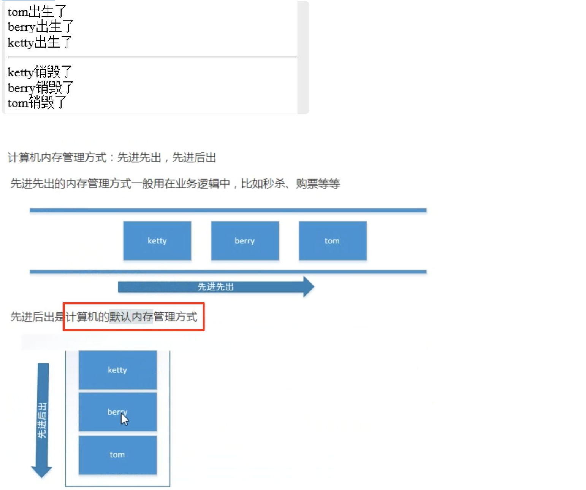
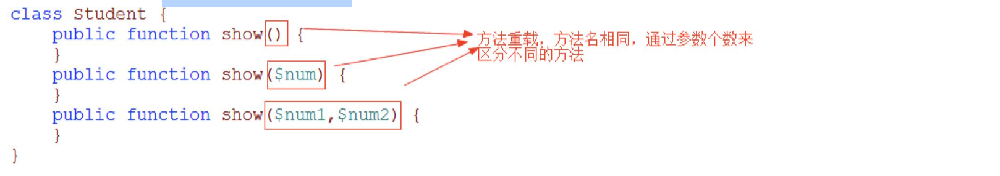
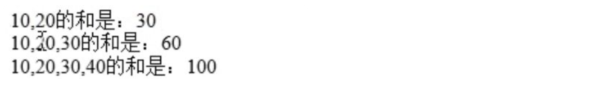
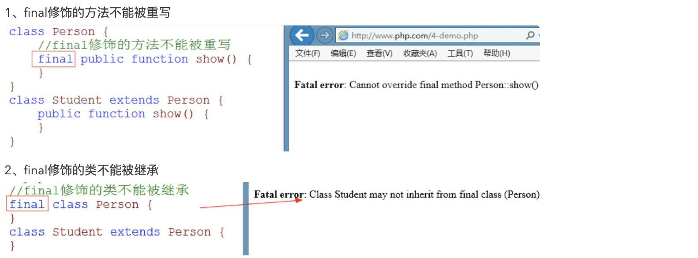

## 4、面向对象

## 1、类名的命名规则：

1. 以字母、下划线开头，后面跟的是字母、数字、下划线
2. 不能用PHP关键字做类名
3. 类名不区分大小写（变量名区分，关键字、类名不区分大小写）
4. 类名用帕斯卡命名法（大驼峰 单词的首字母大写）

## 2、对象比较：

```
//定义类
class Student {

}
//实例化对象
$stu1=new Student();
$stu2=new Student;
$stu3=$stu2; //对象传递的是地址 
//var_dump($stu1,$stu2,$stu3); //object(Student)#1 (0) { } object(Student)#2 (0) { } object(Student)#2 (0) { } 
//对象比较
var_dump($stu1==$stu2);   //bool(true) ,比较对象的结构
echo '<br>';
var_dump($stu1===$stu2);  //bool(false) $stu1和$stu2是否是同一个对象
echo '<br>';
var_dump($stu2===$stu3);  //bool(true) $stu2和$stu3是同一个对象
```

## 3、属性操作：

```
//定义类
class Student {
  public $name;       //属性
  public $add='地址不详';   //属性

  //定义方法
  public function show() {
    echo '这是show方法<br>';
  }
  //public可以省略，如果省略，默认就是public
  function test() {
    echo '这是test方法<br>';
  }
}
//实例化对象
$stu=new Student();
//print_r($stu);  //Student Object ( [name] => [add] => 地址不详 ) 
//操作属性
//1、给属性赋值
$stu->name='tom';
$stu->add='北京';

$stu->show(); //调用方法
$stu->test();

//2、获取属性的值
echo '姓名：'.$stu->name,'<br>'; //姓名：tom
echo '地址：'.$stu->add,'<br>';    //地址：北京

//3、添加属性
$stu->age=20;
print_r($stu);  //Student Object ( [name] => tom [add] => 北京 [age] => 20 ) 
echo '<br>';
//4、删除属性
unset($stu->add);
print_r($stu);  //Student Object ( [name] => tom [age] => 20 ) 
```

## 4、访问修饰符：

public（公有的） ： 在类的内部和外部都能访问

private（私有的） ： 只能在类的内部访问 （私有属性可以继承但不能重写）

protected（受保护的） ：  在整个继承链上访问

一般来说，属性都用私有的，通过公有的方法对私有的属性进行赋值和取值

私有属性：

```
class A {
	private $name='PHP';
	public function showA() {
		//var_dump($this);	//object(B)#1 (2) { ["name":"B":private]=> string(4) "Java" ["name":"A":private]=> string(3) "PHP" } 
		echo $this->name,'<br>';	//PHP
	}
}
class B extends A {
	private $name='Java';
	public function showB() {
		//var_dump($this);	//object(B)#1 (2) { ["name":"B":private]=> string(4) "Java" ["name":"A":private]=> string(3) "PHP" } 
		echo $this->name,'<br>';	//Java
	}
}
$obj=new B();
$obj->showA();
$obj->showB();
/*分析：
showA()和showB()中的$this都表示B的对象，B中继承了A的私有属性，所以B中有两个$name.
在showA()中只能访问A中的$name，不能访问B中的$name
在showB()中只能访问B中的$name,不能访问A中的$name
------------------------------------------------------------------------------------
class A {
	protected $name='tom';
	public function showA() {
		echo $this->name,'<br>';
	}
}
class B extends A {
	public $name='berry';
	public function showB() {
		echo $this->name,'<br>';
	}
}
//测试
$obj=new B();
$obj->showA();	//berry
$obj->showB();	//berry

/*
分析：B中将A的$name重写，所以$obj中只有一个$name,($name='berry'),不管$this在哪个方法中访问，就只能访问这个$name
*/
```

$this：

```
//访问修饰符
class Student {
  private $name;  //私有属性
  private $sex; //私有属性
  public function __construct($name,$sex) {
    $this->name=$name;
    $this->sex=$sex;
  }
  //通过公有的方法对私有的属性进行赋值
  public function setInfo($name,$sex) {
    if($sex!='男' && $sex!='女'){
      echo '性别必须是男或女';
      exit;
    }
    $this->name=$name;   //$this表示当前对象
    $this->sex=$sex;
  }
  //显示信息
  public function getInfo() {
    echo '姓名：'.$this->name,'<br>';
    echo '性别：'.$this->sex,'<br>';
  }
}
//实例化
$stu=new Student;
$stu->setInfo('tom','男');
$stu->getInfo();
echo '<hr>';
$stu2=new Student;
$stu2->setInfo('berry','女');
$stu2->getInfo();
```

tips：构造函数可以带参数，但不能有return

demo：

```
class A {
  public function __construct() {
    var_dump($this);
  }
}
class B extends A {
}
new A();  //object(A)#1 (0) { } 
echo '<br>';
new B();  //object(B)#1 (0) { } 
```

## 5、类和对象在内存中的分布：

1. 对象的本质是一个复杂的变量
2. 类的本质是一个自定义的复杂数据类型
3. 栈区：运行速度快，体积小，保存基本类型
4. 堆区：运行速度稍慢，体积大，保存复杂类型
5. 实例化的过程就是分配内存空间的过程
6. 对象保存在堆区，将堆区的地址保存到栈区。

## 6、析构方法：

当对象销毁的时候自动调用

```
function __destruct(){
}
```

tips：析构函数不可以带参数

demo：

```
class Student {
  private $name;
  //构造方法
  public function __construct($name) {
    $this->name=$name;
    echo "{$name}出生了<br>";
  }
  //析构方法
  public function __destruct() {
    echo "{$this->name}销毁了<br>";
  }
}
//测试
$stu1=new Student('tom');
$stu2=new Student('berry');
$stu3=new Student('ketty');
echo '<hr>';
```

运行结果：



上面的代码，tom先进，所以最后出，所以最后销毁

demo：

```
<?php
class Student {
  private $name;
  //构造方法
  public function __construct($name) {
    $this->name=$name;
    echo "{$name}出生了<br>";
  }
  //析构方法
  public function __destruct() {
    echo "{$this->name}销毁了<br>";
  }
}
//测试
$stu1=new Student('tom');
$stu2=new Student('berry');
$stu3=new Student('ketty');
unset($stu2);
echo '<hr>';
/*
tom出生了
berry出生了
ketty出生了
berry销毁了

ketty销毁了
tom销毁了
*/
```

demo：

```
<?php
class Student {
  private $name;
  //构造方法
  public function __construct($name) {
    $this->name=$name;
    echo "{$name}出生了<br>";
  }
  //析构方法
  public function __destruct() {
    echo "{$this->name}销毁了<br>";
  }
}
//测试
new Student('tom');
new Student('berry');
new Student('ketty');
/*
tom出生了
tom销毁了
berry出生了
berry销毁了
ketty出生了
ketty销毁了
*/
```

## 7、继承中的构造函数：

**规则：**

1、如果子类有构造函数就调用子类的，如果子类没有就调用父类的构造函数。

2、子类的构造函数调用后，默认不再调用父类的构造函数

```
class Per {
    //父类的构造函数
  public function __construct() {
    echo '这是父类<br>';
  }
}
class Student extends Person {
    //子类的构造函数
  public function __construct() {
    Per::__construct();    //通过父类的名字调用父类的构造函数
    parent::__construct();    //parent表示父类的名字 （用这个好）
    echo '这是子类<br>';
  }
}
//测试
new Student();
```

tips：使用parent关键字表示父类的名字，可以降低程序的耦合性

给父类传递参数：

```
<?php
class Person {
  protected $name;
  protected $sex;
    //父类的构造函数
  public function __construct($name,$sex) {
    $this->name=$name;
    $this->sex=$sex;
  }
}
class Student extends Person {
  private $score;
    //子类的构造函数
  public function __construct($name,$sex,$score) {
    parent::__construct($name,$sex);  //调用父类构造函数并传递参数
    $this->score=$score;
  }
    //显示信息
  public function getInfo() {
    echo "姓名：{$this->name}<br>";
    echo "性别：{$this->sex}<br>";
    echo "成绩：{$this->score}";
  }
}
//测试
$stu=new Student('tom','男',88);
$stu->getInfo();
/*
姓名：tom
性别：男
成绩：88
*/
```

## 8、多态：

多态：多种形态。 多态分为两种：方法重写和方法重载

（1）方法重写：子类重写了父类的同名的方法

```
<?php
//父类
class Person {
	public function show() {
		echo '这是父类<br>';
	}
}
//子类
class Student extends Person {
	//子类重写了父类的同名方法
	public function show() {
		echo '这是子类<br>';
	}
}
//测试
$stu=new Student;
$stu->show();			//这是子类
```

注意事项：

1. 子类的方法必须和父类的方法同名
2. 参数个数要一致
3. 子类修饰的不能比父类更加严格

（2）方法重载

在同一个类中，有多个同名的函数，通过参数的不同来区分不同的方法，称为方法重载



**注意：PHP不支持方法重载，但是PHP可以通过魔术方法来模拟方法重载。**

**

```
class Math {
  public function __call($fn_name,$fn_args) {
    $sum=0;
    foreach($fn_args as $v) {
      $sum+=$v;
    }
    echo implode(',',$fn_args).'的和是：'.$sum,'<br>'; // 表示用逗号把参数拼接起来的字符串
  }
}
//利用魔术方法模拟方法重载
$math=new Math();
$math->call(10,20);
$math->call(10,20,30);
$math->call(10,20,30,40);
```

结果：



**

## 9、方法修饰符：

方法修饰符有：static、final、abstract

（1）static【静态的】

1. static修饰的属性叫静态属性、static修饰的方法叫静态方法
2. 静态成员加载类的时候分配空间，程序执行完毕后销毁
3. 静态成员在内存中就一份。
4. 调用语法 类名::属性 类名::方法名()

```
class Person {
	public static $add='北京';    // 修饰符之间没有顺序
	static public function show() {
		echo '这是一个静态的方法<br>';
	}
}
echo Person::$add,'<br>'; //北京
Person::show();		//这是一个静态的方法
```

demo：

```
class Student {
	private static $num=0;	//静态变量，在内存中就一份
	public function __construct() {
		self::$num++;      //self表示所在类的类名
	}
	public function __destruct() {
		self::$num--;
	}
	public function show() {
		echo '总人数是：'.self::$num,'<br>';
	}
}
//测试
$stu1=new Student;
$stu2=new Student;
$stu3=new Student;
$stu2->show();			//总人数是：3
unset($stu2);
$stu3->show();			//总人数是：2
```

tips：self表示所在类的类名，使用self降低耦合性

静态成员也可以被继承：

```
class Person {
	public static $add='中国';
	public static function show() {
		echo '这是人类<br>';
	}
}
//继承
class Student extends Person {
}
//测试
echo Student::$add,'<br>';		//中国   通过子类名称访问父类的静态成员
Student::show();				//这是人类
```

静态延时绑定：

static表示当前对象所属的类

```
class Person {
	public static $type='人类';
	public function show1() {
		//var_dump($this);		//object(Student)#1 (0) { } 
		//echo self::$type,'<br>';	//人类
		echo static::$type,'<br>';			//学生   延时绑定
	}
}
class Student extends Person {
	public static $type='学生';
	public function show2() {
		//var_dump($this);		//object(Student)#1 (0) { } 
		//echo self::$type,'<br>';	//学生
		echo static::$type,'<br>';			//学生
	}
}
//测试
$obj=new Student();
$obj->show1();
$obj->show2();
```

小结：

 1、static在内存中就一份，在类加载的时候分配空间

 2、如果有多个修饰符，修饰符之间是没有顺序的

 3、self表示所在类的类名

 4、static表示当前对象所属的类

 5、static有两个作用，第一表示静态的，第二表示类名

（2）final【最终的】：



作用：

1、如果一个类确定不被继承，一个方法确定不会被重写，用final修饰可以提高执行效率。

2、如果一个方法不允许被其他类重写，可以用final修饰。

（3）abstract【抽象的】：

1. abstract修饰的方法是抽象方法，修饰的类是抽象类
2. 只有方法的声明没有方法的实现称为抽象方法
3. 一个类中只要有一个方法是抽象方法，这个类必须是抽象类。
4. 抽象类的特点是不能被实例化
5. 子类继承了抽象类，就必须重新实现父类的所有的抽象方法，否则不允许实例化
6. 类中没有抽象方法也可以声明成抽象类，用来阻止类的实例化

demo：

```
<?php
//抽象类
abstract class Person {
	public abstract function setInfo();	//抽象方法
	public function getInfo() {
		echo '获取信息<br>';
	}
}
//继承
class Student extends Person {
    //重写实现父类的抽象方法
	public function setInfo() {
		echo '重新实现父类的抽象方法<br>';
	}
}
//测试
$stu=new Student;
$stu->setInfo();		//重新实现父类的抽象方法
$stu->getInfo();		//获取信息
```

抽象类的作用：

 1、定义命名规范

 2、阻止实例化，如果一个类中所有的方法都是静态方法，这时候没有必要去实例化，可以通过abstract来阻止来的实例化。

类常量：

类常量是const常量

```
class Student {
	//public const ADD； 	//7.1以后才支持访问修饰符
	const ADD='地址不详';
}
echo Student::ADD;
```

（1）问题：define常量和const常量的区别？

 答：const常量可以做类成员，define常量不可以做类成员。

 （2）问题：常量和静态的属性的区别？

 答：相同点：都在加载类的时候分配空间 不同点：常量的值不可以更改，静态属性的值可以更改

## 10、接口（interface）

1. 如果一个类中所有的方法是都是抽象方法，那么这个抽象类可以声明成接口
2. 接口是一个特殊的抽象类，接口中只能有抽象方法和常量
3. 接口中的抽象方法只能是public，可以省略，默认也是public的
4. 通过implements关键字来实现接口
5. 不能使用abstract和final来修饰接口中的抽象方法。

```
interface IPerson {
	const ADD='中国';
	function fun1();
	function fun2();
}
//接口实现
class Student implements IPerson {
	public function fun1() {
	
	}
	public function fun2() {
	
	}
}
//访问接口中的常量
echo IPerson::ADD;
```

接口的多重实现：

类不允许多重继承，但是接口允许多重实现。

```
interface IPic1 {
	function fun1();
}
interface IPic2 {
	function fun2();
}
//接口允许多重实现
class Student implements IPic1,IPic2 {
	public function fun1() {
	
	}
	public function fun2() {
	
	}
}
```

注意：

 1、在接口的多重实现中，如果有同名的方法，只要实现一次即可

 2、类可以继承的同时实现接口

```
class Student extends Person implements IPIc1,IPic1{}
```

匿名类：（了解的内容，PHP7.0支持）

```
<?php
$stu=new class {
	public $name='tom';
	public function __construct() {
		echo '构造函数<br>';
	}
};
echo $stu->name;
/*运行结果；
构造函数
tom
*/
```

小结：

 1、如果类只被实例化一次就可以使用匿名类

 2、好处，在执行的过程中，类不占用空间

方法绑定：（了解的内容，PHP7.0支持）

作用：将方法绑定到对象上，并调用

```
-- 闭包->call(对象)：将闭包绑定到对象上,并调用 （在PHP中匿名函数称为闭包）$lang='en';
$lang='en';
//类
class Student{
}
//匿名函数
if($lang=='ch'){
	$fun=function(){
		echo '我是一名学生';
	};
}else{
	$fun=function(){
		echo 'i am a studnet';
	};
}
//绑定
$stu=new Student;
$fun->call($stu);	//i am a studnet
```

## 11、异常处理

集中处理在代码块中发生的异常。 在代码块中发生了异常直接抛出，代码块中不处理异常，将异常集中起来一起处理。

关键字：

 try:监测代码块

 catch:捕获异常

 throw:抛出异常

 finally:无论有无异常都会执行，可以省略

 Exception：异常类

```
try{
	//检测代码
}catch(Exception $ex){
	//捕获异常
}
finally{
	//不论是否有异常，都要执行，finally可以省略
}
```

demo：

```
<?php
if(isset($_POST['button'])) {
	try{
		$age=$_POST['age'];
		if($age=='')
			throw new Exception('年龄不能为空',1001);	//抛出异常
		if(!is_numeric($age))
			throw new Exception('年龄必须是数字',1001);	//抛出异常
		if(!($age>=10 && $age<=30)) 
			throw new Exception('年龄必须在10-30之间',1002);	//抛出异常
		echo '您的年龄合适';
	}catch(Exception $ex){		//捕获异常
		echo '错误信息：'.$ex->getMessage(),'<br>';
		echo '错误码：'.$ex->getCode(),'<br>';
		echo '文件地址：'.$ex->getFile(),'<br>';
		echo '错误行号：'.$ex->getLine(),'<br>';
	}
	finally{
		echo '关闭数据库连接';  //不管是否有异常，finally都要执行
	}
}
?>
<form method="post" action="">
	年龄： <input type="text" name="age"> <br />
	<input type="submit" name="button" value="提交">
</form>
```

结果：


自定义异常：

场景：如果实现异常的分类处理？比如异常有三个级别异常对应三种处理方式 自定义三种异常即可 所有异常类的父类是Exception，Exception中的方法不允许重写

demo：

```
<?php
//自定义空异常类
class MyNullException extends Exception {
}
//自定义类型异常
class MyTypeException extends Exception {
}
//自定义范围异常
class MyRangeException extends Exception {
}
//逻辑代码
if(isset($_POST['button'])) {
	try{
		$name=$_POST['name'];
		$age=$_POST['age'];
		if($name=='')
			throw new MyNullException('姓名不能为空');
		if($age=='')
			throw new MyNullException('年龄不能为空');
		if(!is_numeric($age))
			throw new MyTypeException('年龄不是数字');
		if($age<10 || $age>30)
			throw new MyRangeException('年龄必须在10-30之间');
		echo '姓名：'.$name,'<br>';
		echo '年龄：'.$age;
	}catch(MyNullException $ex){
		echo $ex->getMessage(),'<br>';
		echo '错误记录在日志中';
	}catch(MyTypeException $ex){
		echo $ex->getMessage(),'<br>';
		echo '发送电子邮件';
	}catch(MyRangeException $ex){
		echo $ex->getMessage(),'<br>';
		echo '给管理员打电话';
	}

}
?>
<form method="post" action="">
	姓名： <input type="text" name="name"> <br />
	年龄： <input type="text" name="age"> <br />
	<input type="submit" name="button" value="提交">
</form>
```

## 12、自动加载类（__autoload()函数在PHP7.2以后就不支持了）

在项目开发中，因为一个文件中只能写一个类，并且在执行过程中会有很多的类参与，如果一个一个的加载很麻烦，所以，就需要一个机制实现在PHP执行过程中自动加载需要的类。

类的规则：

1. 一个文件中只能放一个类（必须）
2. 文件名和类名同名（必须）
3. 类文件以.class.php结尾（不是必须）

demo：

```
-- 创建`Goods.class.php`页面
//商品类
abstract class Goods {
  protected $name;
  final public function setName($name) {
    $this->name=$name;  
  }
  public abstract function getName();
}

-- 创建Book.class.php页面
//图书类
class Book extends Goods {
  public function getName() {
    echo "《{$this->name}》<br>";
  }
}

-- 创建Phone.class.php页面
//电话类
class Phone extends Goods {
  public function getName() {
    echo $this->name,'<br>';
  }
}

-- 在PHP页面上加载类文件
require './Goods.class.php';    //手动加载类文件
require './Book.class.php';   //手动加载类文件
require './Phone.class.php';  //手动加载类文件
//测试
$book=new Book();
$book->setName('面向对象编程');
$phone=new Phone();
$phone->setName('苹果6s');
$book->getName(); // 《面向对象编程》
$phone->getName(); // 苹果6s
```

**自动加载类：**

**

```
当缺少类的时候自动的调用`__autoload()`函数，并且将缺少的类名作为参数传递给`__autoload()`。


<?php
/*
*作用：自动加载类
*@param $class_name string 缺少的类名
*/
function __autoload($class_name) {
  require "./{$class_name}.class.php";
}
//测试
$book=new Book();
$book->setName('面向对象编程');
$phone=new Phone();
$phone->setName('苹果6s');
$book->getName();
$phone->getName();
```

 **注册加载类：** 通过spl_autoload_register()注册__autoload()函数

**

```
//方法一：
/*
//加载类函数
function loadClass($class_name) {
  require "./{$class_name}.class.php";
}
//注册加载类函数
spl_autoload_register('loadClass');
*/


//方法二：
spl_autoload_register(function($class_name){
  require "./{$class_name}.class.php";
});


//测试
$book=new Book();
$book->setName('面向对象编程');
$phone=new Phone();
$phone->setName('苹果6s');
$book->getName();
$phone->getName();
```

tips：spl_autoload_register()可以注册多个自动加载函数（PHP5.1以后就开始支持此函数）

**

```
function load1($class) {

  require "./{$class}.class.php";
}
function load2($class) {
  require "./{$class}.php";
}
function load3($class) {
  require "./{$class}.fun.php";
}
spl_autoload_register('load1');
spl_autoload_register('load2');
spl_autoload_register('load3');
```

 **类文件存储不规则的加载方法：** 将类名和文件地址做一个映射，组成一个关联数组

**

```
spl_autoload_register(function($class_name){
  //类名和文件地址映射成一个关联数组
  $map=array(
    'Goods' =>  './aa/Goods.class.php',
    'Book'  =>  './bb/Book.class.php',
    'Phone' =>  './cc/Phone.class.php'
  );
  //在映射数组中找到就包含
  if(isset($map[$class_name]))
    require $map[$class_name];
});
//测试
$book=new Book();
$book->setName('面向对象编程');
$phone=new Phone();
$phone->setName('苹果6s');
$book->getName();
$phone->getName();
```

**

**## 13、clone和__clone()

创建对象的方式有哪些？

方法一：实例化

方法二：克隆

```
class Student {
    //执行clone指令的时候自动执行
  public function __clone() {
    echo '正在克隆对象<br>';
  }
}
$stu1=new Student;
$stu2=clone $stu1;    //克隆对象
var_dump($stu1,$stu2);  //object(Student)#1 (0) { } object(Student)#2 (0) { } 
```

小结：

1、clone的创建对象的方法之一

2、当执行clone指令的时候，会自动的调用__clone()方法

## 14、**设计模式**

**（1）单例模式**

一个类只能有一个对象

应用场景：多次请求数据库只需要一个连接对象。

实现：三私一公

1、私有的静态属性用来保存对象的单例

2、私有的构造方法用来阻止在类的外部实例化

3、私有的__clone阻止在类的外部clone对象

4、公有的静态方法用来获取对象的单例

```
class DB {
  //静态的属性用来保存对象的单例
  private static $instance;
  //私有的构造方法阻止在类的外部实例化 私有属性导致外部通过new实例化失败，来达到禁止外部通过new的方式实例化对象
  private function __construct() {

  }
  //私有的__clone()阻止在类的外部clone对象
  private function __clone() {

  }
  public static function getInstance() {
    //保存的值不属于DB类的类型就实例化
    if(!self::$instance instanceof self)
      self::$instance=new self();
    return self::$instance;
  }
}
//测试
$db1=DB::getInstance();
$db2=DB::getInstance();
var_dump($db1,$db2);  //object(DB)#1 (0) { } object(DB)#1 (0) { } 
```

（2）**工厂模式**

特点：传递不同的参数获取不同的对象

```
class ProductsA {
}
class ProductsB { 
}
//工厂模式
class ProductsFactory {
  public function create($num) {
    switch($num) {
      case 1:
        return new ProductsA;
      case 2:
        return new ProductsB;
      default:
        return null;
    }
  }
}
//测试
$factory=new ProductsFactory();
$obj1=$factory->create(1);
$obj2=$factory->create(2);
var_dump($obj1,$obj2); //object(ProductsA)#2 (0) { } object(ProductsB)#3 (0) { } 
```

（3）**策略模式：**

**

```
<?php
class Walk {
  public function way() {
    echo '走着去<br>';
  }
}
class Bus {
  public function way() {
    echo '坐车去<br>';
  }
}
//策略模式
class Student {
  public function play($obj) {
    $obj->way();
  }
}
//测试
$stu=new Student;
$stu->play(new Walk()); //走着去
$stu->play(new Bus());  //坐车去
```

**

## 15、序列化与反序列化：

在PHP中，数组和对象无法保存，如果需要保存就要将数组或对象转换成一个序列。

序列化：将数组或对象转换成一个序列（serialize）

反序列化：将序列化的字符串转换成数组或对象。(unserialize)

```
//数组的序列化
/*
$stu=['tom','berry','ketty'];
$str=serialize($stu);   //序列化
file_put_contents('./stu.txt',$str);
*/

//数组的反序列化
$str=file_get_contents('./stu.txt');
$stu=unserialize($str);   //反序列化
print_r($stu);  //Array ( [0] => tom [1] => berry [2] => ketty ) 

//对象的序列化
class Student {
  public $name;
  protected $sex;
  private $add;
  public function __construct($name,$sex,$add) {
    $this->name=$name;
    $this->sex=$sex;
    $this->add=$add;
  }
}
/*
//测试
$stu=new Student('tom','男','北京');
//序列化
$str=serialize($stu);
file_put_contents('./stu.txt',$str);
*/

//反序列化，类的反序列化必须要有类的参与
$str=file_get_contents('./stu.txt');
$stu=unserialize($str);
echo '<pre>';
var_dump($stu);
```

tips：注意：对象的反序列化需要有类的参与，如果没有类在反序列化时候无法确定类

## 16、魔术方法

已经学习的魔术方法

__construct()

__destruct()

__clone()

__tostring()：将对象当成字符串使用的时候自动调用

__invoke()：将对象当成函数使用的时候自动调用

```
class Student {
  //把对象当成字符串使用的时候自动执行
  public function __tostring() {
    return '这是一个对象，不是字符串<br>';
  }
  //把对象当成函数使用的时候自动执行
  public function __invoke() {
    echo '这是一个对象，不是函数<br>';
  }
}
$stu=new Student;
echo $stu;  //当成字符串使用
$stu();   //当成函数使用
```

__set($k,$v)：给无法访问的属性赋值的时候自动执行

__get($k)：获取无法访问的属性值的时候自动调用

__isset($k)：判断无法访问的属性是否存在自动调用

__unset($k)：销毁无法访问的属性的时候自动执行

```
class Student {
  private $name;
  private $sex;
  private $age;
  //给无法访问的属性赋值的时候自动执行
  public function __set($k,$v) {
    $this->$k=$v;
  }
  //获取无法访问的属性值的时候自动调用
  public function __get($k) {
    return $this->$k;
  }
  //判断无法访问的属性是否存在自动调用
  public function __isset($k) {
    return isset($this->$k);
  }
  //销毁无法访问的属性的时候自动执行
  public function __unset($k) {
    unset($this->$k);
  }
}
//测试
$stu=new Student;
//1、给私有属性赋值
$stu->name='tom';
$stu->sex='男';
$stu->age=22;
//2、获取私有属性的值
//echo $stu->name;
//3、判断私有属性是否存在
//var_dump(isset($stu->name));
//4、销毁私有属性
unset($stu->age);
print_r($stu);
```

设置读写属性：

```
class Student {
  private $name;      //读写属性
  private $add='中国';  //只读属性
  private $age;     //只写属性

  public function __set($k,$v) {
    if(in_array($k,array('name','age')))
      $this->$k=$v;
    else
      echo "{$k}属性是只读属性<br>";
  }
  public function __get($k) {
    if(in_array($k,array('name','add')))
      return $this->$k;
    else
      echo "{$k}是只写属性<br>";
  }
}
//测试
$stu=new Student;
$stu->name='tom';
$stu->age=22;
echo '姓名：'.$stu->name,'<br>';
echo '地址：'.$stu->add,'<br>';
```

__call()：调用无法访问的方法时自动执行

__callstatic()：调用无法访问的静态方法时自动执行

```
class Student {
  /**
  *作用：调用无法访问的方法时自动执行
  *@param $fn_name string 方法名
  *@param $fn_args array 参数数组
  */
  public function __call($fn_name,$fn_args) {
    echo "{$fn_name}不存在<br>";
  }
  //调用无法访问的静态方法时自动执行
  public static function __callstatic($fn_name,$fn_args) {
    echo "{$fn_name}静态方法不存在<br>"; 
  }
}
//测试
$stu=new Student;
$stu->show(10,20);

Student::show();
```

__sleep()：当序列化的时候自动调用

__wakeup()：当反序列化的时候自动调用

```
class Student {
  private $name;
  private $sex;
  private $add='中国';
  public function __construct($name,$sex) {
    $this->name=$name;
    $this->sex=$sex;
  }
  /**
  *序列化的时候自动调用
  *@return array 序列化的属性名
  */
  public function __sleep() {
    return array('name','sex');
  }
  //反序列化的时候自动调用
  public function __wakeup() {
    $this->type='学生';
  }
}
//测试
$stu=new Student('tom','男');
$str=serialize($stu); //序列化
$stu=unserialize($str); //反序列化
print_r($stu);
```

628行了
