## 基础

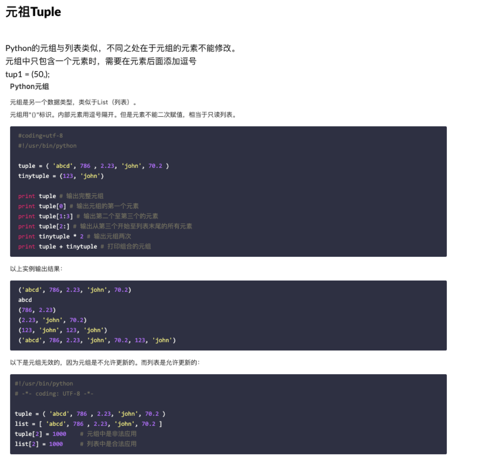  

### python中的6个序列的内置类型

1、Python中6个序列的内置类型分别是什么？  
Python包含6中内建的序列，即列表、元组、字符串、Unicode字符串、buffer对象和 xrange 对象。序列通用的操作包括：索引、长度、组合（序列相加）、重复（乘法）、分片、检查成员、遍历、最小值和最大值。  
2、 列表和元组的异同有哪些？  
Python有6个序列的内置类型，但最常见的是列表和元组。  
列表和元组相似，具体包含下面几个方面：  
相同点：  
1、均具有序列的特性，均可以进行序列通用的操作；  
2、通常均使用括号表示，且括号内的元素以逗号分隔值出现，数据项均不需要具有相同的类型；  
3、均包含内置函数max、min、len；  
4、均可以转换为对方；  
异同点：  
1、定义不同  
        1）列表使用方括号括起来的。  
        2）元组使用小括号括起来的。  
2、是否可修改  
        1）列表可修改  
        2）元组不可修改  
3、转换方式  
        1）列表转元组：tuple(seq)  
        2）元组转列表： list(seq)  
4、是否含内置方法  
        1）列表提供11个内置方法list.append(obj)、list.count(obj)、list.extend(seq)、list.index(obj)、list.insert(index, obj)、list.pop(\[index=-1\]\])、list.remove(obj)、list.reverse()、list.sort(cmp=None, key=None, reverse=False)、list.clear()、list.copy()；  
        2）元组未提供内置方法

### 数字Numbers

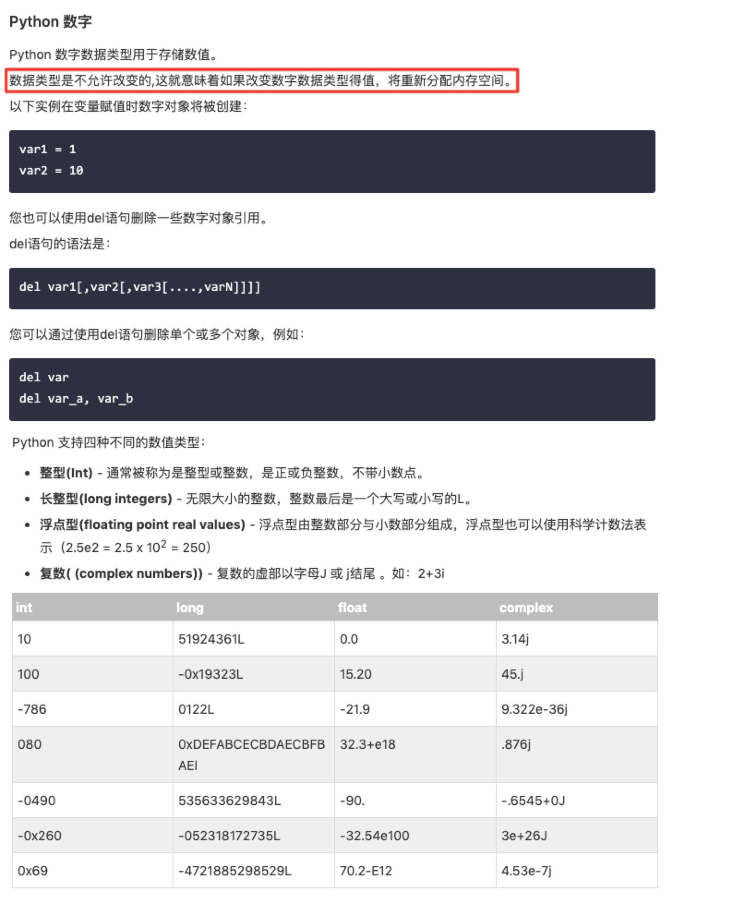  

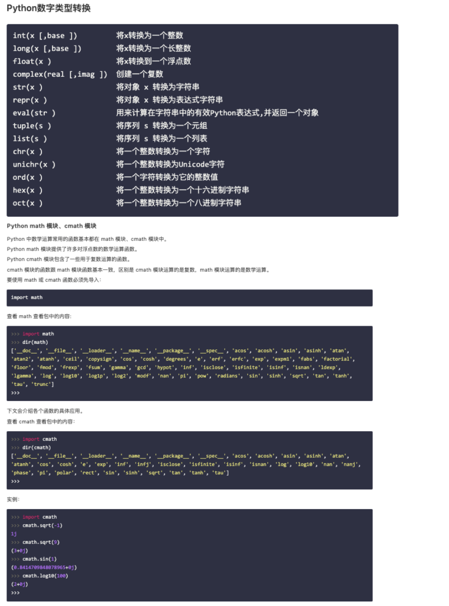  

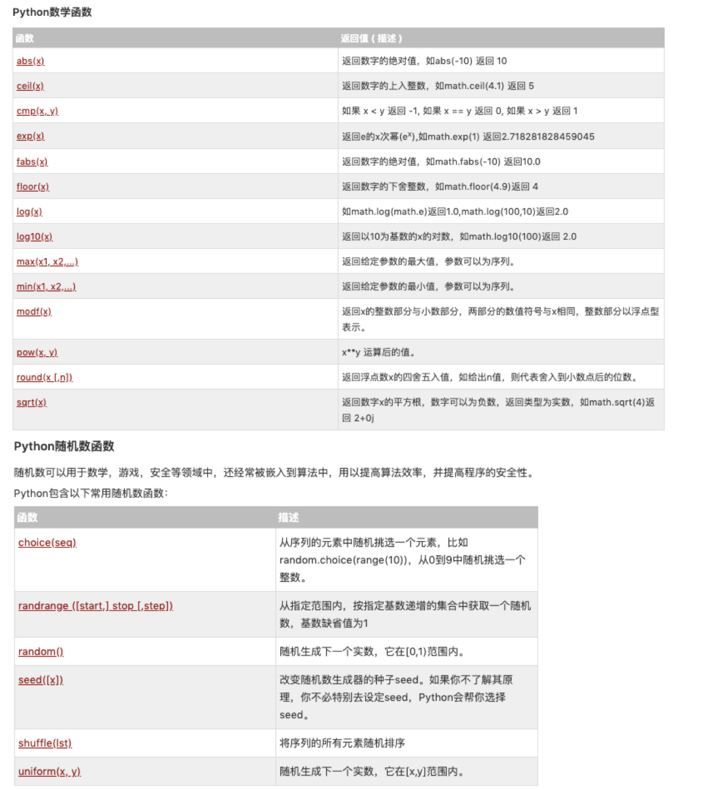  

  

  

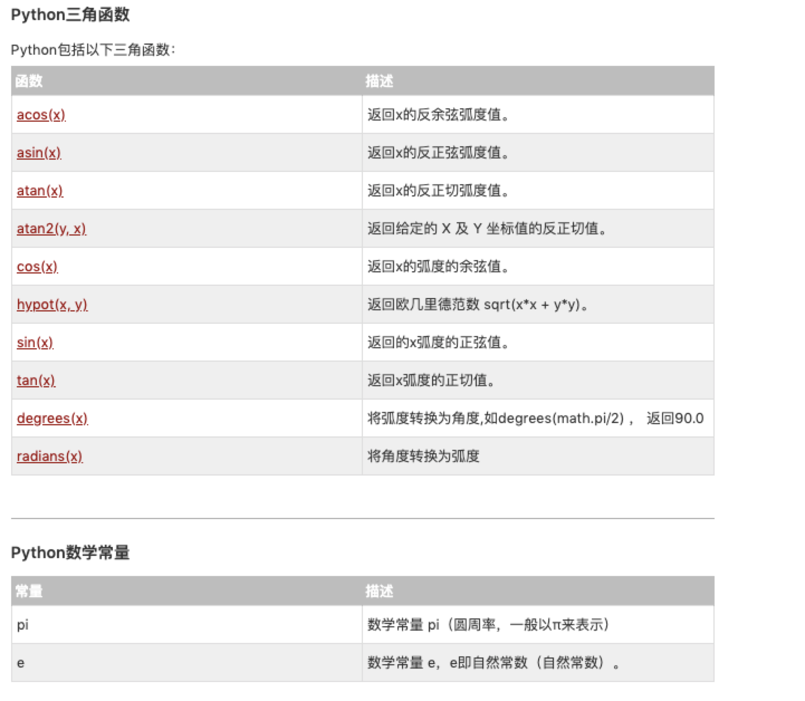  

### 基础认知

地址： [https://www.w3cschool.cn/python3/](https://www.w3cschool.cn/python3/)?

【编译器】是把源程序的每一条语句都编译成机器语言,并保存成二进制文件,这样运行时计算机可以直接以机器语言来运行此程序,速度很快;   
缺点：开发效率低，不能跨平台  
优点：运行速度快

【解释器】则是只在执行程序时,才一条一条的解释成机器语言给计算机来执行,所以运行速度是不如编译后的程序运行的快的.   
缺点：运行速度慢  
优点：开发效率高，可以跨平台。

编译型  
优点：编译器一般会有预编译的过程对代码进行优化。因为编译只做一次，运行时不需要编译，所以编译型语言的程序执行效率高。可以脱离语言环境独立运行。  
缺点：编译之后如果需要修改就需要整个模块重新编译。编译的时候根据对应的运行环境生成机器码，不同的操作系统之间移植就会有问题，需要根据运行的操作系统环境编译不同的可执行文件。  
解释型  
优点：有良好的平台兼容性，在任何环境中都可以运行，前提是安装了解释器（虚拟机）。灵活，修改代码的时候直接修改就可以，可以快速部署，不用停机维护。  
缺点：每次运行的时候都要解释一遍，性能上不如编译型语言。  
2.2动态语言和静态语言  
通常我们所说的动态语言、静态语言是指动态类型语言和静态类型语言。  
（1）动态类型语言：动态类型语言是指在运行期间才去做数据类型检查的语言，也就是说，在用动态类型的语言编程时，永远也不用给任何变量指定数据类型，该语言会在你第一次赋值给变量时，在内部将数据类型记录下来。Python和Ruby就是一种典型的动态类型语言，其他的各种脚本语言如VBScript也多少属于动态类型语言。  
（2）静态类型语言：静态类型语言与动态类型语言刚好相反，它的数据类型是在编译其间检查的，也就是说在写程序时要声明所有变量的数据类型，C/C++是静态类型语言的典型代表，其他的静态类型语言还有C#、JAVA等。  
2.3强类型定义语言和弱类型定义语言  
（1）强类型定义语言：强制数据类型定义的语言。也就是说，一旦一个变量被指定了某个数据类型，如果不经过强制转换，那么它就永远是这个数据类型了。举个例子：如果你定义了一个整型变量a,那么程序根本不可能将a当作字符串类型处理。强类型定义语言是类型安全的语言。  
（2）弱类型定义语言：数据类型可以被忽略的语言。它与强类型定义语言相反, 一个变量可以赋不同数据类型的值。  
强类型定义语言在速度上可能略逊色于弱类型定义语言，但是强类型定义语言带来的严谨性能够有效的避免许多错误。另外，“这门语言是不是动态语言”与“这门语言是否类型安全”之间是完全没有联系的！  
例如：Python是动态语言，是强类型定义语言（类型安全的语言）; VBScript是动态语言，是弱类型定义语言（类型不安全的语言）; JAVA是静态语言，是强类型定义语言（类型安全的语言）。  
通过上面这些介绍，我们可以得出：

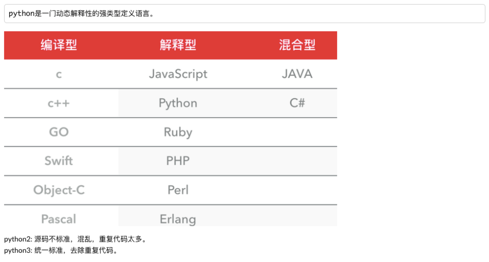  

python2: 源码不标准，混乱，重复代码太多。  
python3: 统一标准，去除重复代码。

### python的种类

CPython  
当我们从Python官方网站下载并安装好Python 3.6后，我们就直接获得了一个官方版本的解释器：CPython。这个解释器是用C语言开发的，所以叫CPython。在命令行下运行python就是启动CPython解释器。  
CPython是使用最广的Python解释器。教程的所有代码也都在CPython下执行。

IPython  
IPython是基于CPython之上的一个交互式解释器，也就是说，IPython只是在交互方式上有所增强，但是执行Python代码的功能和CPython是完全一样的。好比很多国产浏览器虽然外观不同，但内核其实都是调用了IE。  
CPython用>>>作为提示符，而IPython用In \[序号\]:作为提示符。

PyPy  
PyPy是另一个Python解释器，它的目标是执行速度。PyPy采用JIT技术，对Python代码进行动态编译（注意不是解释），所以可以显著提高Python代码的执行速度。  
绝大部分Python代码都可以在PyPy下运行，但是PyPy和CPython有一些是不同的，这就导致相同的Python代码在两种解释器下执行可能会有不同的结果。如果你的代码要放到PyPy下执行，就需要了解PyPy和CPython的不同点。

Jython  
Jython是运行在Java平台上的Python解释器，可以直接把Python代码编译成Java字节码执行。

IronPython  
IronPython和Jython类似，只不过IronPython是运行在微软.Net平台上的Python解释器，可以直接把Python代码编译成.Net的字节码。

小结：  
　　Python的解释器很多，但使用最广泛的还是CPython。如果要和Java或.Net平台交互，最好的办法不是用Jython或IronPython，而是通过网络调用来交互，确保各程序之间的独立性。

黑窗口操作

python进入Perl环境，然后输入exit（）退出Perl环境

打印内容： ptint() 类似于console.log（）都可以进行运算  
py3要求print后面必须用括号包起来，py2可以不写括号

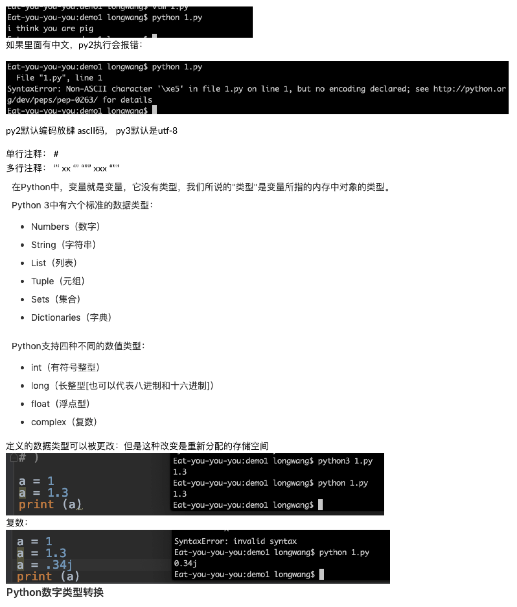  

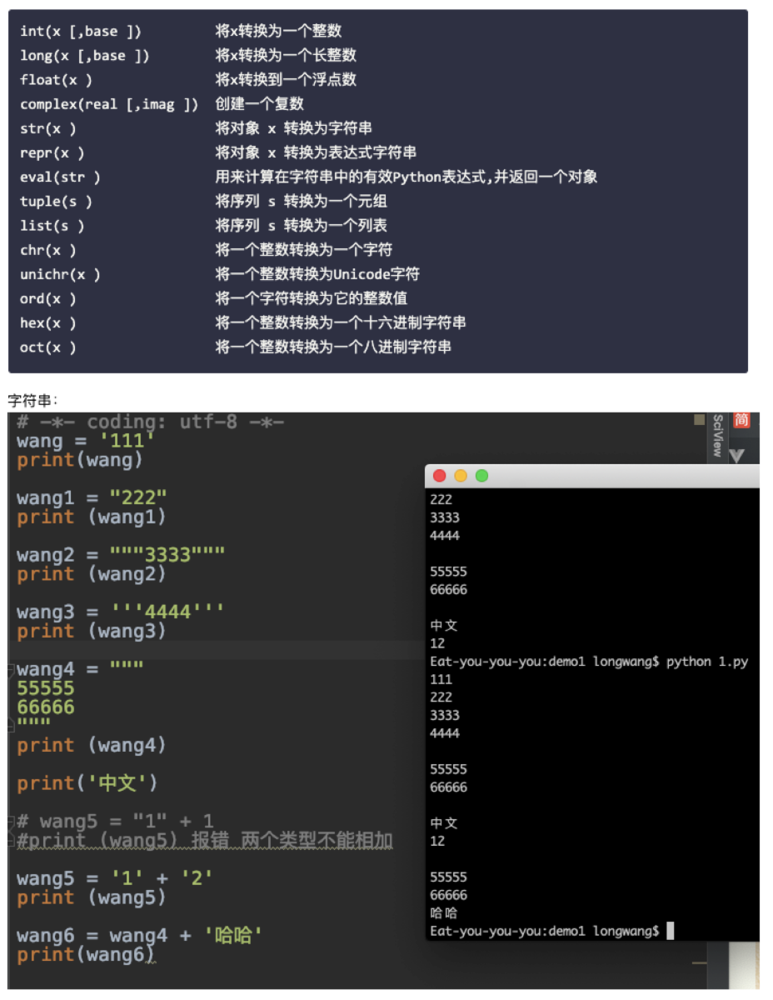  

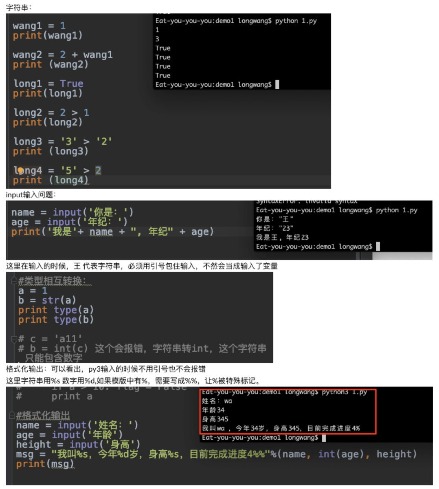  

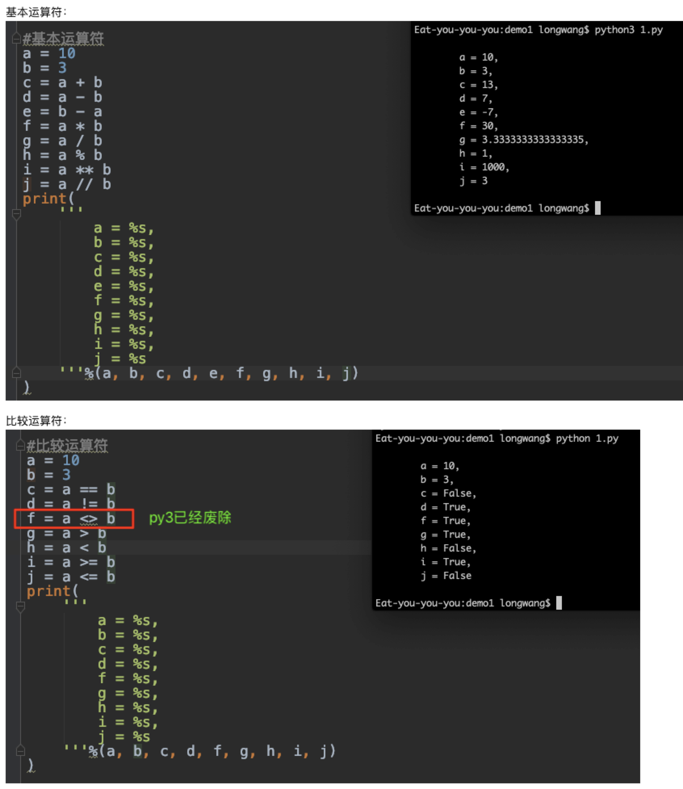  

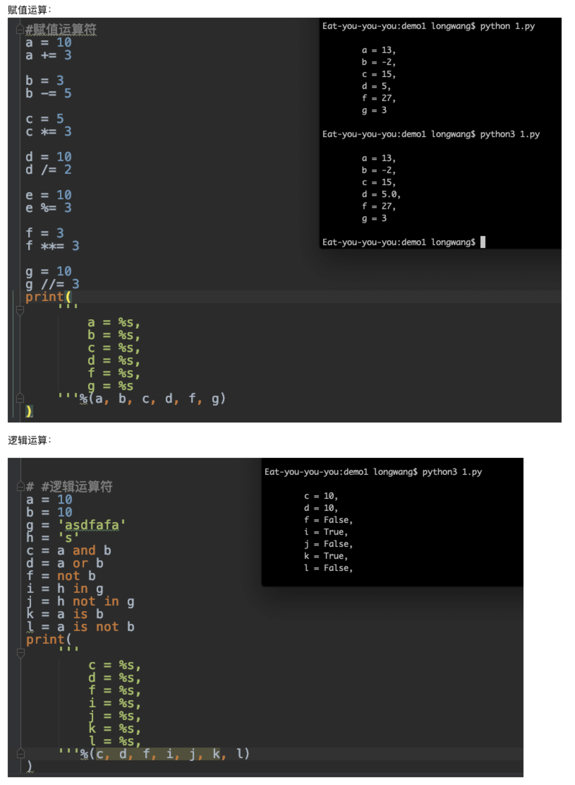  

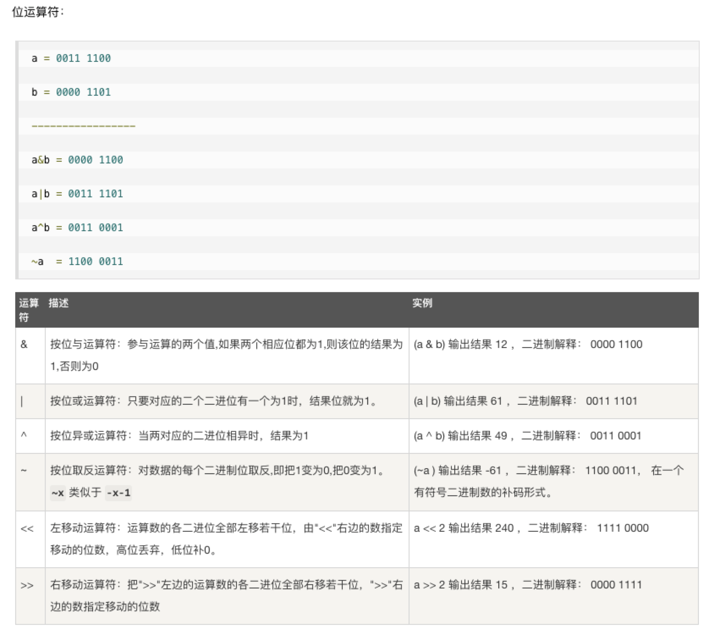  

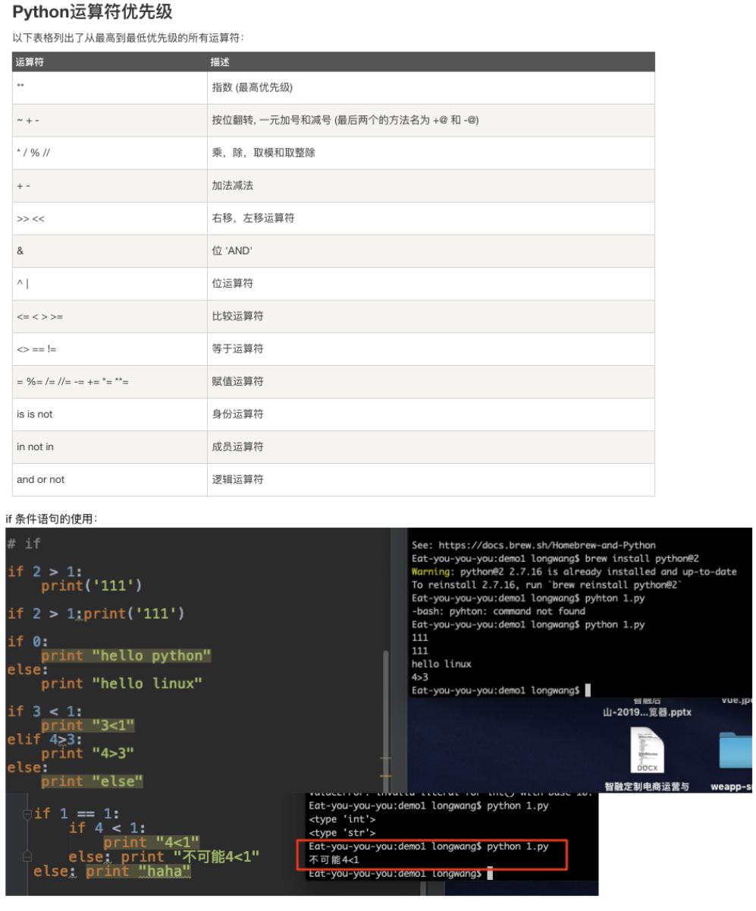  

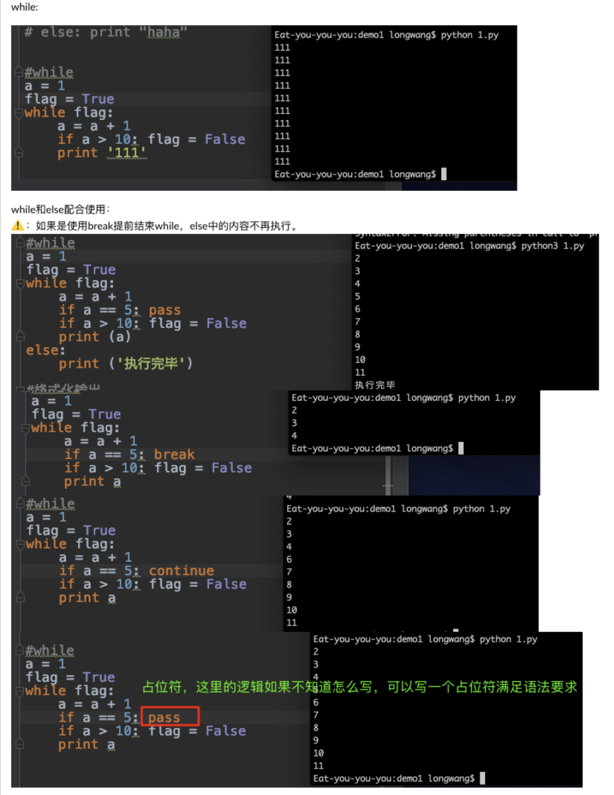  

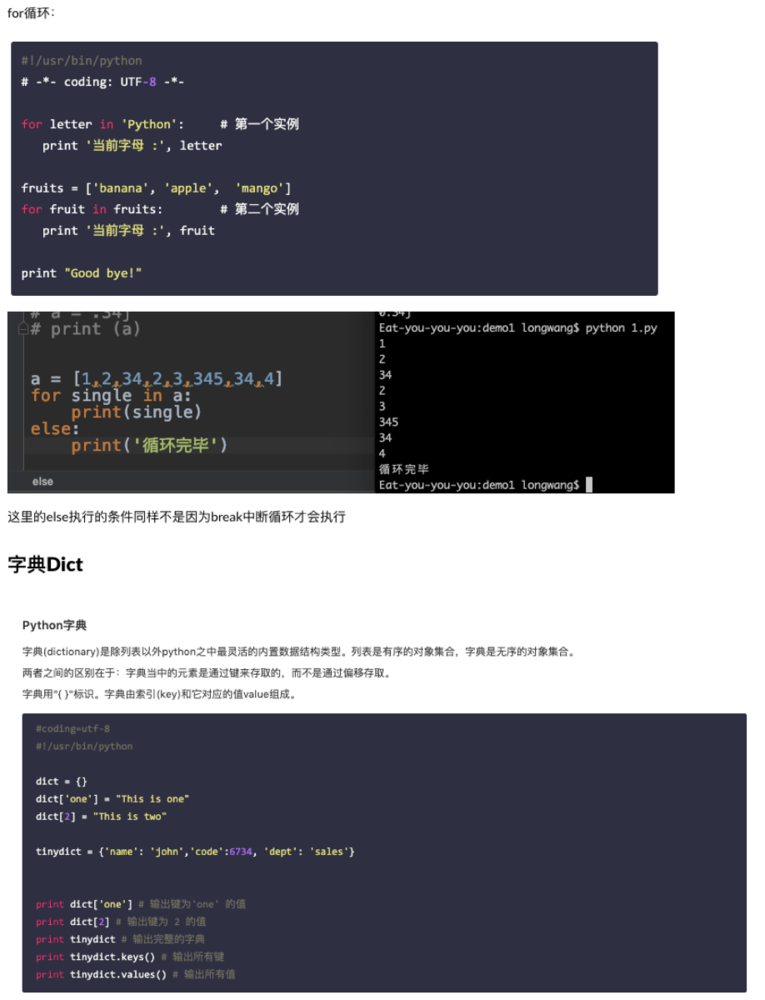  

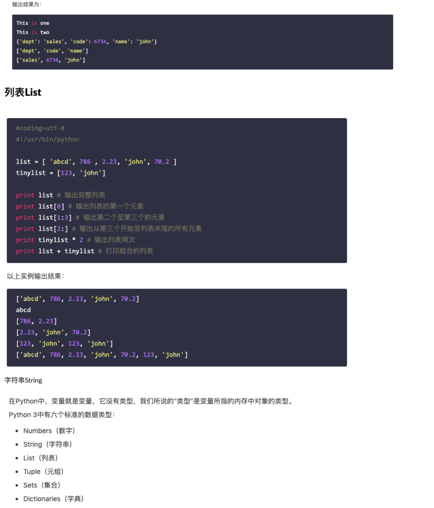  

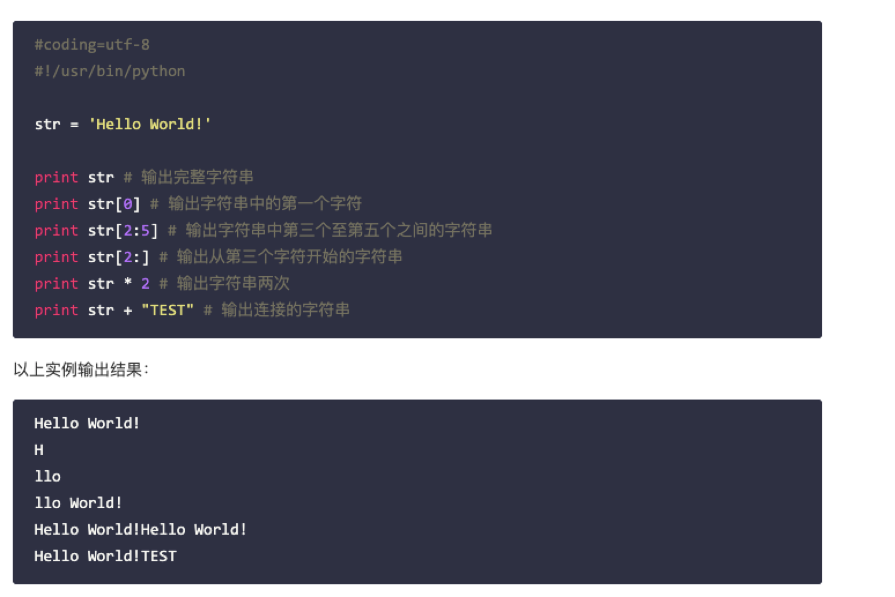