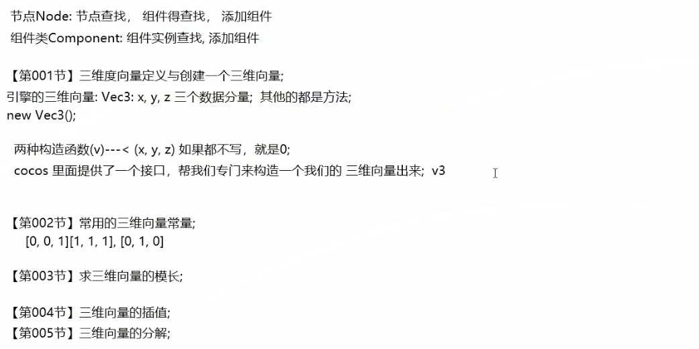
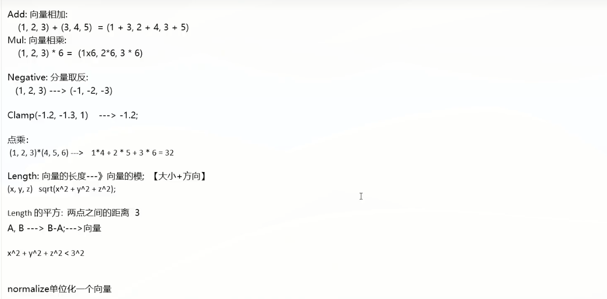

教程来源：

https://www.bilibili.com/video/BV12s4y1X7ps/?spm_id_from=333.337.search-card.all.click&vd_source=55dcc9b2dc5b93d913718cd6ba694fc2

资料 地址:

https://www.bycwedu.com/page/815879268

# 第一讲

# 第二讲

网格：

纹理：

mesh：简单理解成定点的坐标

颜色数据：就是纹理贴图

# 第三讲

回顾第一二讲

本讲开始：

接下来详细说下这个截图：

# 第四讲

# 第五讲

# 第六讲

# 第七讲

三位向量

# 第八讲

讲解世界坐标和局部坐标

世界缩放和局部缩放

欧拉旋转（世界旋转，局部旋转)

欧拉角：优点：直观，缺点：计算性能不好，万向节锁的问题，引擎内部会把欧拉角转换成四元素计算

欧拉角：就是我们通过界面调整角度直观看到的度数

四元素：脚本编写的时候用这个

# 第九讲：
