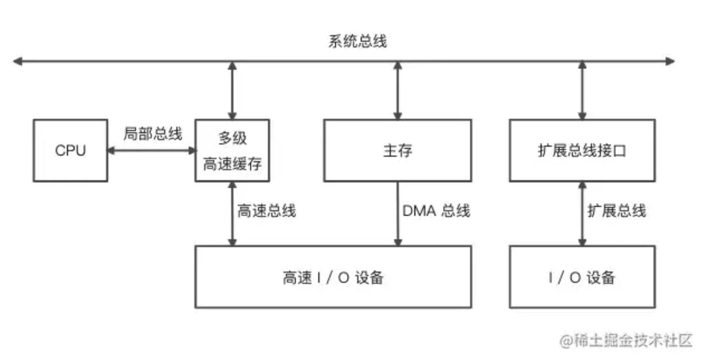
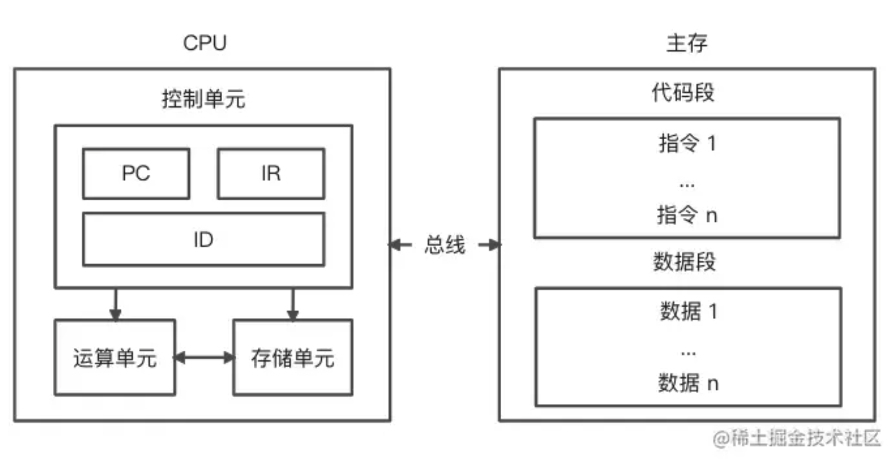
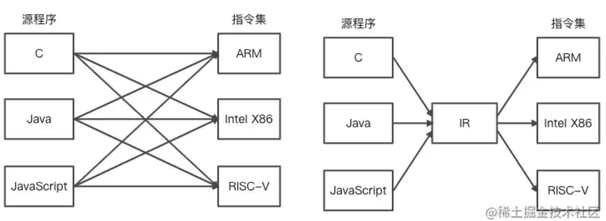
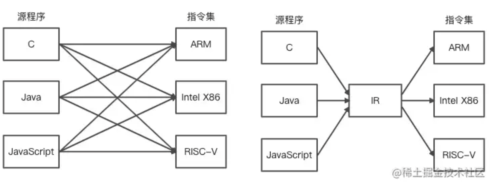
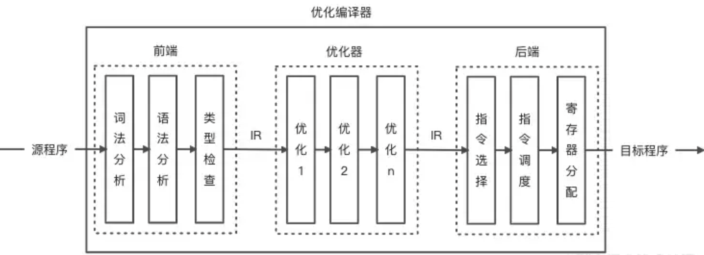

来源：https://juejin.cn/post/6987549240436195364#heading-42

## 前言

为了尽量多给出一些知识点，所以不会针对问题进行机械式的回答，可能更多的需要大家自行理解和抽象。其中大部分面试题可能会已文章链接的形式出现，或许是我自己以前写过的文章，或者是我觉得别人写的不错的文章。

> 温馨提示：本文主要给出了 1 ~ 5、7 ~ 8、10 ~ 15、18、20 ~ 21、24、29 ~ 30 等面试题的答案解析。

## 基础知识

基础知识主要包含以下几个方面：

* 基础：计算机原理、编译原理、数据结构、算法、设计模式、编程范式等基本知识了解
* 语法：JavaScript、ECMAScript、CSS、TypeScript、HTML、Node.js 等语法的了解和使用
* 框架：React、Vue、Egg、Koa、Express、Webpack 等原理的了解和使用
* 工程：编译工具、格式工具、Git、NPM、单元测试、Nginx、PM2、CI / CD 了解和使用
* 网络：HTTP、TCP、UDP、WebSocket、Cookie、Session、跨域、缓存、协议的了解
* 性能：编译性能、监控、白屏检测、SEO、Service Worker 等了解
* 插件：Chrome 、Vue CLI 、Webpack 等插件设计思路的理解
* 系统：Mac、Windows、Linux 系统配置的实践
* 后端：Redis 缓存、数据库、Graphql、SSR、模板引擎等了解和使用

### 基础

#### 1、列举你所了解的计算机存储设备类型？

现代计算机以存储器为中心，主要由 CPU、I / O 设备以及主存储器三大部分组成。各个部分之间通过总线进行连接通信，具体如下图所示：

上图是一种多总线结构的示意图，CPU、主存以及 I / O 设备之间的所有数据都是通过总线进行并行传输，使用局部总线是为了提高 CPU 的吞吐量（CPU 不需要直接跟 I / O 设备通信），而使用高速总线（更贴近 CPU）和 DMA 总线则是为了提升高速 I / O 设备（外设存储器、局域网以及多媒体等）的执行效率。

主存包括随机存储器 RAM 和只读存储器 ROM，其中 ROM 又可以分为 MROM（一次性）、PROM、EPROM、EEPROM 。ROM 中存储的程序（例如启动程序、固化程序）和数据（例如常量数据）在断电后不会丢失。RAM  主要分为静态 RAM（SRAM） 和动态 RAM（DRAM） 两种类型（DRAM 种类很多，包括 SDRAM、RDRAM、CDRAM 等），断电后数据会丢失，主要用于存储临时程序或者临时变量数据。 DRAM  一般访问速度相对较慢。由于现代 CPU 读取速度要求相对较高，因此在 CPU 内核中都会设计 L1、L2 以及 L3 级别的多级高速缓存，这些缓存基本是由 SRAM 构成，一般访问速度较快。

#### 2、一般代码存储在计算机的哪个设备中？代码在 CPU 中是如何运行的？

高级程序设计语言不能直接被计算机理解并执行，需要通过翻译程序将其转换成特定处理器上可执行的指令，计算机 CPU 的简单工作原理如下所示：

CPU 主要由控制单元、运算单元和存储单元组成（注意忽略了中断系统），各自的作用如下：

* **控制单元** ：在节拍脉冲的作用下，将程序计数器（Program Counter，PC）指向的主存或者多级高速缓存中的指令地址送到地址总线，接着获取指令地址所对应的指令并放入指令寄存器 （Instruction Register，IR）中，然后通过指令译码器（Instruction Decoder，ID）分析指令需要进行的操作，最后通过操作控制器（Operation Controller，OC）向其他设备发出微操作控制信号。
* **运算单元** ：如果控制单元发出的控制信号存在算术运算（加、减、乘、除、增 1、减 1、取反等）或者逻辑运算（与、或、非、异或），那么需要通过运算单元获取存储单元的计算数据进行处理。
* **存储单元** ：包括片内缓存和寄存器组，是 CPU 中临时数据的存储地方。CPU 直接访问主存数据大概需要花费数百个机器周期，而访问寄存器或者片内缓存只需要若干个或者几十个机器周期，因此会使用内部寄存器或缓存来存储和获取临时数据（即将被运算或者运算之后的数据），从而提高 CPU 的运行效率。

除此之外，计算机系统执行程序指令时需要花费时间，其中取出一条指令并执行这条指令的时间叫指令周期。指令周期可以分为若干个阶段（取指周期、间址周期、执行周期和中断周期），每个阶段主要完成一项基本操作，完成基本操作的时间叫机器周期。机器周期是时钟周期的分频，例如最经典的 8051 单片机的机器周期为 12 个时钟周期。时钟周期是 CPU 工作的基本时间单位，也可以称为节拍脉冲或 T 周期（CPU 主频的倒数） 。假设 CPU 的主频是 1 GHz（1 Hz 表示每秒运行 1 次），那么表示时钟周期为 1 / 109 s。理论上 CPU 的主频越高，程序指令执行的速度越快。

#### 3、什么是指令和指令集？

上图右侧主存中的指令是 CPU 可以支持的处理命令，一般包含算术指令（加和减）、逻辑指令（与、或和非）、数据指令（移动、输入、删除、加载和存储）、流程控制指令以及程序结束指令等，由于 CPU 只能识别二进制码，因此指令是由二进制码组成。除此之外，指令的集合称为指令集（例如汇编语言就是指令集的一种表现形式），常见的指令集有精简指令集（ARM）和复杂指令集（Inter X86）。一般指令集决定了 CPU 处理器的硬件架构，规定了处理器的相应操作。

#### 4、复杂指令集和精简指令集有什么区别？

#### 5、JavaScript 是如何运行的？解释型语言和编译型语言的差异是什么？

早期的计算机只有机器语言时，程序设计必须用二进制数（0 和 1）来编写程序，并且要求程序员对计算机硬件和指令集非常了解，编程的难度较大，操作极易出错。为了解决机器语言的编程问题，慢慢开始出现了符号式的汇编语言（采用 ADD、SUB、MUL、DIV 等符号代表加减乘除）。为了使得计算机可以识别汇编语言，需要将汇编语言翻译成机器能够识别的机器语言（处理器的指令集）：


由于每一种机器的指令系统不同，需要不同的汇编语言程序与之匹配，因此程序员往往需要针对不同的机器了解其硬件结构和指令系统。为了可以抹平不同机器的指令系统，使得程序员可以更加关注程序设计本身，先后出现了各种面向问题的高级程序设计语言，例如 BASIC 和 C，具体过程如下图所示：

高级程序语言会先翻译成汇编语言或者其他中间语言，然后再根据不同的机器翻译成机器语言进行执行。除此之外，汇编语言虚拟机和机器语言机器之间还存在一层操作系统虚拟机，主要用于控制和管理操作系统的全部硬件和软件资源（随着超大规模集成电路技术的不断发展，一些操作系统的软件功能逐步由硬件来替换，例如目前的操作系统已经实现了部分程序的固化，简称固件，将程序永久性的存储在 ROM 中）。机器语言机器还可以继续分解成微程序机器，将每一条机器指令翻译成一组微指令（微程序）进行执行。

上述虚拟机所提供的语言转换程序被称为编译器，主要作用是将某种语言编写的源程序转换成一个等价的机器语言程序，编译器的作用如下图所示：

例如 C 语言，可以先通过 gcc 编译器生成 Linux 和 Windows 下的目标 .o 和 .obj 文件（object 文件，即目标文件），然后将目标文件与底层系统库文件、应用程序库文件以及启动文件链接成可执行文件在目标机器上执行。

> 温馨提示：感兴趣的同学可以了解一下 ARM 芯片的程序运行原理，包括使用 IDE 进行程序的编译（IDE 内置编译器，主流编译器包含 ARMCC、IAR 以及 GCC FOR ARM 等，其中一些编译器仅仅随着 IDE 进行捆绑发布，不提供独立使用的能力，而一些编译器则随着 IDE 进行发布的同时，还提供命令行接口的独立使用方式）、通过串口进行程序下载（下载到芯片的代码区初始启动地址映射的存储空间地址）、启动的存储空间地址映射（包括系统存储器、闪存 FLASH、内置 SRAM 等）、芯片的程序启动模式引脚 BOOT 的设置（例如调试代码时常常选择内置 SRAM、真正程序运行的时候选择闪存 FLASH）等。

如果某种高级语言或者应用语言（例如用于人工智能的计算机设计语言）转换的目标语言不是特定计算机的汇编语言，而是面向另一种高级程序语言（很多研究性的编译器将 C 作为目标语言），那么还需要将目标高级程序语言再进行一次额外的编译才能得到最终的目标程序，这种编译器可称为源到源的转换器。

除此之外，有些程序设计语言将编译的过程和最终转换成目标程序进行执行的过程混合在一起，这种语言转换程序通常被称为解释器，主要作用是将某种语言编写的源程序作为输入，将该源程序执行的结果作为输出，解释器的作用如下图所示：


解释器和编译器有很多相似之处，都需要对源程序进行分析，并转换成目标机器可识别的机器语言进行执行。只是解释器是在转换源程序的同时立马执行对应的机器语言（转换和执行的过程不分离），而编译器得先把源程序全部转换成机器语言并产生目标文件，然后将目标文件写入相应的程序存储器进行执行（转换和执行的过程分离）。例如 Perl、Scheme、APL 使用解释器进行转换， C、C++ 则使用编译器进行转换，而 Java 和 JavaScript 的转换既包含了编译过程，也包含了解释过程。

#### 6、简单描述一下 Babel 的编译过程？

#### 7、JavaScript 中的数组和函数在内存中是如何存储的？

JavaScript 中的数组存储大致需要分为两种情况：

* 同种类型数据的数组分配连续的内存空间
* 存在非同种类型数据的数组使用哈希映射分配内存空间

> 温馨提示：可以想象一下连续的内存空间只需要根据索引（指针）直接计算存储位置即可。如果是哈希映射那么首先需要计算索引值，然后如果索引值有冲突的场景下还需要进行二次查找（需要知道哈希的存储方式）。

#### 8、浏览器和 Node.js 中的事件循环机制有什么区别？

> 阅读链接：[面试分享：两年工作经验成功面试阿里P6总结](https://juejin.cn/post/6844903928442667015#heading-43 "https://juejin.cn/post/6844903928442667015#heading-43") - 了解 Event Loop 吗？

#### 9、ES6 Modules 相对于 CommonJS 的优势是什么？

#### 10、高级程序设计语言是如何编译成机器语言的？

#### 11、编译器一般由哪几个阶段组成？数据类型检查一般在什么阶段进行？

#### 12、编译过程中虚拟机的作用是什么？

#### 13、什么是中间代码（IR），它的作用是什么？

#### 14、什么是交叉编译？

编译器的设计是一个非常庞大和复杂的软件系统设计，在真正设计的时候需要解决两个相对重要的问题：

* 如何分析不同高级程序语言设计的源程序
* 如何将源程序的功能等价映射到不同指令系统的目标机器

为了解决上述两项问题，编译器的设计最终被分解成前端（注意这里所说的不是 Web 前端）和后端两个编译阶段，前端用于解决第一个问题，而后端用于解决第二个问题，具体如下图所示：

上图中的中间表示（Intermediate Representation，IR）是程序结构的一种表现方式，它会比 AST（后续讲解）更加接近汇编语言或者指令集，同时也会保留源程序中的一些高级信息，除此之外 ，它的种类很多，包括[三地址码（Three Address Code, TAC）](https://link.juejin.cn?target=https%3A%2F%2Fen.wikipedia.org%2Fwiki%2FThree-address_code "https://en.wikipedia.org/wiki/Three-address_code")、[静态单赋值形式（Static Single Assignment Form, SSA）](https://link.juejin.cn?target=https%3A%2F%2Fen.wikipedia.org%2Fwiki%2FStatic_single_assignment_form "https://en.wikipedia.org/wiki/Static_single_assignment_form")以及基于栈的 IR 等，具体作用包括：

* 靠近前端部分主要适配不同的源程序，靠近后端部分主要适配不同的指令集，更易于编译器的错误调试，容易识别是 IR 之前还是之后出问题
* 如下左图所示，如果没有 IR，那么源程序到指令集之间需要进行一一适配，而有了中间表示，则可以使得编译器的职责更加分离，源程序的编译更多关注如何转换成 IR，而不是去适配不同的指令集
* IR 本身可以做到多趟迭代从而优化源程序，在每一趟迭代的过程中可以研究代码并记录优化的细节，方便后续的迭代查找并利用这些优化信息，最终可以高效输出更优的目标程序
* 
* 由于 IR 可以进行多趟迭代进行程序优化，因此在编译器中可插入一个新的优化阶段，如下图所示：
  
  优化器可以对 IR 处理一遍或者多遍，从而生成更快执行速度（例如找到循环中不变的计算并对其进行优化从而减少运算次数）或者更小体积的目标程序，也可能用于产生更少异常或者更低功耗的目标程序。除此之外，前端和后端内部还可以细分为多个处理步骤，具体如下图所示：
  
  优化器中的每一遍优化处理都可以使用一个或多个优化技术来改进代码，每一趟处理最终都是读写 IR 的操作，这样不仅仅可以使得优化可以更加高效，同时也可以降低优化的复杂度，还提高了优化的灵活性，可以使得编译器配置不同的优化选项，达到组合优化的效果。

#### 15、发布 / 订阅模式和观察者模式的区别是什么？

> 阅读链接：[基于Vue实现一个简易MVVM ](https://juejin.cn/post/6844904099704471559#heading-10 "https://juejin.cn/post/6844904099704471559#heading-10")- 观察者模式和发布/订阅模式

#### 16、装饰器模式一般会在什么场合使用？

#### 17、谈谈你对大型项目的代码解耦设计理解？什么是 Ioc？一般 DI 采用什么设计模式实现？

#### 18、列举你所了解的编程范式？

编程范式（Programming paradigm）是指计算机编程的基本风格或者典型模式，可以简单理解为编程学科中实践出来的具有哲学和理论依据的一些经典原型。常见的编程范式有：

* 面向过程（Process Oriented Programming，POP）
* 面向对象（Object Oriented Programming，OOP）
* 面向接口（Interface Oriented Programming， IOP）
* 面向切面（Aspect Oriented Programming，AOP）
* 函数式（Funtional Programming，FP）
* 响应式（Reactive Programming，RP）
* 函数响应式（Functional Reactive Programming，FRP）

> 阅读链接：：如果你对于编程范式的定义相对模糊，可以继续阅读 [What is the precise definition of programming paradigm?](https://link.juejin.cn?target=https%3A%2F%2Fsoftwareengineering.stackexchange.com%2Fquestions%2F166442%2Fwhat-is-the-precise-definition-of-programming-paradigm%23 "https://softwareengineering.stackexchange.com/questions/166442/what-is-the-precise-definition-of-programming-paradigm#") 了解更多。

不同的语言可以支持多种不同的编程范式，例如 C 语言支持 POP 范式，C++ 和 Java 语言支持 OOP 范式，Swift 语言则可以支持 FP 范式，而 Web 前端中的 JavaScript 可以支持上述列出的所有编程范式。

#### 19、什么是面向切面（AOP）的编程？

#### 20、什么是函数式编程？

顾名思义，函数式编程是使用函数来进行高效处理数据或数据流的一种编程方式。在数学中，函数的三要素是定义域、值域和**对应关系。**假设 A、B 是非空数集，对于集合 A 中的任意一个数 x，在集合 B 中都有唯一确定的数 f(x) 和它对应，那么可以将 f 称为从 A 到 B 的一个函数，记作：y = f(x)。在函数式编程中函数的概念和数学函数的概念类似，主要是描述形参 x 和返回值 y 之间的**对应关系，**如下图所示：


> 温馨提示：图片来自于[简明 JavaScript 函数式编程——入门篇](https://juejin.cn/post/6844903936378273799 "https://juejin.cn/post/6844903936378273799")。

在实际的编程中，可以将各种明确**对应关系**的函数进行传递、组合从而达到处理数据的最终目的。在此过程中，我们的关注点不在于如何去实现**对应关系，**而在于如何将各种已有的对应关系进行高效联动，从而可快速进行数据转换，达到最终的数据处理目的，提供开发效率。

**简单示例**

尽管你对函数式编程的概念有所了解，但是你仍然不知道函数式编程到底有什么特点。这里我们仍然拿 OOP 编程范式来举例，假设希望通过 OOP 编程来解决数学的加减乘除问题：

```typescript
class MathObject {
  constructor(private value: number) {}
  public add(num: number): MathObject {
    this.value += num;
    return this;
  }
  public multiply(num: number): MathObject {
    this.value *= num;
    return this;
  }
  public getValue(): number {
    return this.value;
  }
}

const a = new MathObject(1);
a.add(1).multiply(2).add(a.multiply(2).getValue()); 
复制代码
```

我们希望通过上述程序来解决 (1 + 2) * 2 + 1 * 2 的问题，但实际上计算出来的结果是 24，因为在代码内部有一个 `this.value` 的状态值需要跟踪，这会使得结果不符合预期。 接下来我们采用函数式编程的方式：

```typescript
function add(a: number, b: number): number {
  return a + b;
}

function multiply(a: number, b: number): number {
  return a * b;
}

const a: number = 1;
const b: number = 2;

add(multiply(add(a, b), b), multiply(a, b));
复制代码
```

以上程序计算的结果是 8，完全符合预期。我们知道了 `add` 和 `multiply` 两个函数的实际 **对应关系** ，通过将**对应关系**进行有效的组合和传递，达到了最终的计算结果。除此之外，这两个函数还可以根据数学定律得出更优雅的组合方式：

```typescript
add(multiply(add(a, b), b), multiply(a, b));

// 根据数学定律分配律：a * b  +  a * c = a * (b + c)，得出：
// (a + b) * b + a * b = (2a + b) * b

// 简化上述函数的组合方式
multiply(add(add(a, a), b), b);
复制代码
```

我们完全不需要追踪类似于 OOP 编程范式中可能存在的内部状态数据，事实上对于数学定律中的结合律、交换律、同一律以及分配律，上述的函数式编程代码足可以胜任。

**原则**

通过上述简单的例子可以发现，要实现高可复用的函数**（对应关系）**，一定要遵循某些特定的原则，否则在使用的时候可能无法进行高效的传递和组合，例如

* 高内聚低耦合
* 最小意外原则
* 单一职责原则
* ...

如果你之前经常进行无原则性的代码设计，那么在设计过程中可能会出现各种出乎意料的问题（这是为什么新手老是出现一些稀奇古怪问题的主要原因）。函数式编程可以有效的通过一些原则性的约束使你设计出更加健壮和优雅的代码，并且在不断的实践过程中进行经验式叠加，从而提高开发效率。

**特点**

虽然我们在使用函数的过程中更多的不再关注函数如何实现（ **对应关系）** ，但是真正在使用和设计函数的时候需要注意以下一些特点：

* 声明式（Declarative Programming）
* 一等公民（First Class Function）
* 纯函数（Pure Function）
* 无状态和数据不可变（Statelessness and Immutable Data）
* ...

**声明式**

我们以前设计的代码通常是命令式编程方式，这种编程方式往往注重具体的实现的过程（ **对应关系** ），而函数式编程则采用声明式的编程方式，往往注重如何去组合已有的**对应关系。**简单举个例子：

```typescript
// 命令式
const array = [0.8, 1.7, 2.5, 3.4];
const filterArray = [];

for (let i = 0; i < array.length; i++) {
  const integer = Math.floor(array[i]);
  if (integer < 2) {
    continue;
  }
  filterArray.push(integer);
}

// 声明式
// map 和 filter 不会修改原有数组，而是产生新的数组返回
[0.8, 1.7, 2.5, 3.4].map((item) => Math.floor(item)).filter((item) => item > 1);
复制代码
```

命令式代码一步一步的告诉计算机需要执行哪些语句，需要关心变量的实例化情况、循环的具体过程以及跟踪变量状态的变化过程。声明式代码更多的不再关心代码的具体执行过程，而是采用表达式的组合变换去处理问题，不再强调 **怎么做** ，而是指明**做什么。**声明式编程方式可以将我们设计代码的关注点彻底从过程式解放出来，从而提高开发效率。

**一等公民**

在 JavaScript 中，函数的使用非常灵活，例如可以对函数进行以下操作：

```typescript
interface IHello {
  (name: string): string;
  key?: string;
  arr?: number[];
  fn?(name: string): string;
}

// 函数声明提升
console.log(hello instanceof Object); // true

// 函数声明提升
// hello 和其他引用类型的对象一样，都有属性和方法
hello.key = 'key';
hello.arr = [1, 2];
hello.fn = function (name: string) {
  return `hello.fn, ${name}`;
};

// 函数声明提升
// 注意函数表达式不能在声明前执行，例如不能在这里使用 helloCopy('world')
hello('world'); 

// 函数
// 创建新的函数对象，将函数的引用指向变量 hello
// hello 仅仅是变量的名称
function hello(name: string): string {
  return `hello, ${name}`;
}

console.log(hello.key); // key
console.log(hello.arr); // [1,2]
console.log(hello.name); // hello

// 函数表达式
const helloCopy: IHello = hello;
helloCopy('world');

function transferHello(name: string, hello: Hello) {
  return hello('world');
}

// 把函数对象当作实参传递
transferHello('world', helloCopy);

// 把匿名函数当作实参传递
transferHello('world', function (name: string) {
  return `hello, ${name}`;
});

复制代码
```

通过以上示例可以看出，函数继承至对象并拥有对象的特性。在 JavaScript 中可以对函数进行参数传递、变量赋值或数组操作等等，因此把函数称为一等公民。函数式编程的核心就是对函数进行组合或传递，JavaScript 中函数这种灵活的特性是满足函数式编程的重要条件。

**纯函数**

纯函数是是指在相同的参数调用下，函数的返回值唯一不变。这跟数学中函数的映射关系类似，同样的 x 不可能映射多个不同的 y。使用函数式编程会使得函数的调用非常稳定，从而降低 Bug 产生的机率。当然要实现纯函数的这种特性，需要函数不能包含以下一些副作用：

* 操作 Http 请求
* 可变数据（包括在函数内部改变输入参数）
* DOM 操作
* 打印日志
* 访问系统状态
* 操作文件系统
* 操作数据库
* ...

从以上常见的一些副作用可以看出，纯函数的实现需要遵循最小意外原则，为了确保函数的稳定唯一的输入和输出，尽量应该避免与函数外部的环境进行任何交互行为，从而防止外部环境对函数内部产生无法预料的影响。纯函数的实现应该自给自足，举几个例子：

```typescript
// 如果使用 const 声明 min 变量（基本数据类型），则可以保证以下函数的纯粹性
let min: number = 1;

// 非纯函数
// 依赖外部环境变量 min，一旦 min 发生变化则输入和返回不唯一
function isEqual(num: number): boolean {
  return num === min;
}

// 纯函数
function isEqual(num: number): boolean {
  return num === 1;
}

// 非纯函数
function request<T, S>(url: string, params: T): Promise<S> {
  // 会产生请求成功和请求失败两种结果，返回的结果可能不唯一
  return $.getJson(url, params);
}

// 纯函数
function request<T, S>(url: string, params: T) : () => Promise<S> {
  return function() {
    return $.getJson(url, params);
  }
}
复制代码
```

纯函数的特性使得函数式编程具备以下特性：

* 可缓存性（Cacheable）
* 可移植性（Portable）
* 可测试性（Testable）

可缓存性和可测试性基于纯函数输入输出唯一不变的特性，可移植性则主要基于纯函数不依赖外部环境的特性。这里举一个可缓存的例子：

```typescript
interface ICache<T> {
  [arg: string]: T;
}

interface ISquare<T> {
  (x: T): T;
}

// 简单的缓存函数（忽略通用性和健壮性）
function memoize<T>(fn: ISquare<T>): ISquare<T> {
  const cache: ICache<T> = {};
  return function (x: T) {
    const arg: string = JSON.stringify(x);
    cache[arg] = cache[arg] || fn.call(fn, x);
    return cache[arg];
  };
}

// 纯函数
function square(x: number): number {
  return x * x;
}

const memoSquare = memoize<number>(square);
memoSquare(4);

// 不会再次调用纯函数 square，而是直接从缓存中获取值
// 由于输入和输出的唯一性，获取缓存结果可靠稳定
// 提升代码的运行效率
memoSquare(4);
复制代码
```

**无状态和数据不可变**

在函数式编程的简单示例中已经可以清晰的感受到函数式编程绝对不能依赖内部状态，而在纯函数中则说明了函数式编程不能依赖外部的环境或状态，因为一旦依赖的状态变化，不能保证函数根据对应关系所计算的返回值因为状态的变化仍然保持不变。

这里单独讲解一下数据不可变，在 JavaScript 中有很多数组操作的方法，举个例子：

```typescript
const arr = [1, 2, 3];

console.log(arr.slice(0, 2)); // [1, 2]
console.log(arr); // [1, 2, 3]
console.log(arr.slice(0, 2)); // [1, 2]
console.log(arr); // [1, 2, 3]

console.log(arr.splice(0, 1)); // [1]
console.log(arr); // [2, 3]
console.log(arr.splice(0, 1)); // [2]
console.log(arr); // [3]
复制代码
```

这里的 `slice` 方法多次调用都不会改变原有数组，且会产生相同的输出。而 `splice` 每次调用都在修改原数组，且产生的输出也不相同。 在函数式编程中，这种会改变原有数据的函数已经不再是纯函数，应该尽量避免使用。

> 阅读链接：如果想要了解更深入的函数式编程知识点，可以额外阅读[函数式编程指北](https://link.juejin.cn?target=https%3A%2F%2Fllh911001.gitbooks.io%2Fmostly-adequate-guide-chinese%2Fcontent%2F "https://llh911001.gitbooks.io/mostly-adequate-guide-chinese/content/")。

#### 21、响应式编程的使用场景有哪些？

响应式编程是一种基于**观察者（发布 / 订阅）模式**并且面向 **异步** （Asynchronous） **数据流** （Data Stream）和**变化传播**的声明式编程范式。响应式编程主要适用的场景包含：

* 用户和系统发起的连续事件处理，例如鼠标的点击、键盘的按键或者通信设备发起的信号等
* 非可靠的网络或者通信处理（例如 HTTP 网络的请求重试）
* 连续的异步 IO 处理
* 复杂的继发事务处理（例如一次事件涉及到多个继发的网络请求）
* 高并发的消息处理（例如 IM 聊天）
* ...

### 语法

#### 22、如何实现一个上中下三行布局，顶部和底部最小高度是 100px，中间自适应?

#### 23、如何判断一个元素 CSS 样式溢出，从而可以选择性的加 title 或者 Tooltip?

#### 24、如何让 CSS 元素左侧自动溢出（... 溢出在左侧）？

The **`direction`** CSS property sets the direction of text, table columns, and horizontal overflow. Use `rtl` for languages written from right to left (like Hebrew or Arabic), and `ltr` for those written from left to right (like English and most other languages).

具体查看：[developer.mozilla.org/en-US/docs/…](https://link.juejin.cn?target=https%3A%2F%2Fdeveloper.mozilla.org%2Fen-US%2Fdocs%2FWeb%2FCSS%2Fdirection "https://developer.mozilla.org/en-US/docs/Web/CSS/direction")

#### 25、什么是沙箱？浏览器的沙箱有什么作用？

#### 26、如何处理浏览器中表单项的密码自动填充问题？

#### 27、Hash 和 History 路由的区别和优缺点？

#### 28、JavaScript 中对象的属性描述符有哪些？分别有什么作用？

#### 29、JavaScript 中 console 有哪些 api ?

The **`console`** object provides access to the browser's debugging console (e.g. the [Web console](https://link.juejin.cn?target=https%3A%2F%2Fdeveloper.mozilla.org%2Fen-US%2Fdocs%2FTools%2FWeb_Console "https://developer.mozilla.org/en-US/docs/Tools/Web_Console") in Firefox). The specifics of how it works varies from browser to browser, but there is a *de facto* set of features that are typically provided.

这里列出一些我常用的 API:

* console.log
* console.error
* console.time
* console.timeEnd
* console.group

具体查看：[developer.mozilla.org/en-US/docs/…](https://link.juejin.cn?target=https%3A%2F%2Fdeveloper.mozilla.org%2Fen-US%2Fdocs%2FWeb%2FAPI%2Fconsole "https://developer.mozilla.org/en-US/docs/Web/API/console")

#### 30、 简单对比一下 Callback、Promise、Generator、Async 几个异步 API 的优劣？

在 JavaScript 中利用[事件循环机制](https://juejin.cn/post/6844903843197616136#heading-3 "https://juejin.cn/post/6844903843197616136#heading-3")（Event Loop）可以在单线程中实现非阻塞式、异步的操作。例如

* Node.js 中的 Callback、[EventEmitter](https://link.juejin.cn?target=http%3A%2F%2Fnodejs.cn%2Fapi%2Fevents.html%23events_class_eventemitter "http://nodejs.cn/api/events.html#events_class_eventemitter")、[Stream](https://link.juejin.cn?target=http%3A%2F%2Fnodejs.cn%2Fapi%2Fstream.html "http://nodejs.cn/api/stream.html")
* ES6 中的 [Promise](https://link.juejin.cn?target=https%3A%2F%2Fes6.ruanyifeng.com%2F%23docs%2Fpromise "https://es6.ruanyifeng.com/#docs/promise")、[Generator](https://link.juejin.cn?target=https%3A%2F%2Fes6.ruanyifeng.com%2F%23docs%2Fgenerator-async "https://es6.ruanyifeng.com/#docs/generator-async")
* ES2017 中的 [Async](https://link.juejin.cn?target=https%3A%2F%2Fes6.ruanyifeng.com%2F%23docs%2Fasync "https://es6.ruanyifeng.com/#docs/async")
* 三方库 RxJS、[Q](https://link.juejin.cn?target=https%3A%2F%2Fgithub.com%2Fkriskowal%2Fq "https://github.com/kriskowal/q") 、[Co、](https://link.juejin.cn?target=https%3A%2F%2Fgithub.com%2Ftj%2Fco "https://github.com/tj/co")[Bluebird](https://link.juejin.cn?target=https%3A%2F%2Fgithub.com%2Fpetkaantonov%2Fbluebird "https://github.com/petkaantonov/bluebird")

我们重点来看一下常用的几种编程方式（Callback、Promise、Generator、Async）在语法糖上带来的优劣对比。

**Callback**

Callback（回调函数）是在 Web 前端开发中经常会使用的编程方式。这里举一个常用的定时器示例：

```typescript
export interface IObj {
  value: string;
  deferExec(): void;
  deferExecAnonymous(): void;
  console(): void;
}

export const obj: IObj = {
  value: 'hello',

  deferExecBind() {
    // 使用箭头函数可达到一样的效果
    setTimeout(this.console.bind(this), 1000);
  },

  deferExec() {
    setTimeout(this.console, 1000);
  },

  console() {
    console.log(this.value);
  },
};

obj.deferExecBind(); // hello
obj.deferExec(); // undefined
复制代码
```

回调函数经常会因为调用环境的变化而导致 `this` 的指向性变化。除此之外，使用回调函数来处理多个继发的异步任务时容易导致回调地狱（Callback Hell）:

```typescript
fs.readFile(fileA, 'utf-8', function (err, data) {
  fs.readFile(fileB, 'utf-8', function (err, data) {
    fs.readFile(fileC, 'utf-8', function (err, data) {
      fs.readFile(fileD, 'utf-8', function (err, data) {
        // 假设在业务中 fileD 的读写依次依赖 fileA、fileB 和 fileC
        // 或者经常也可以在业务中看到多个 HTTP 请求的操作有前后依赖（继发 HTTP 请求）
        // 这些异步任务之间纵向嵌套强耦合，无法进行横向复用
        // 如果某个异步发生变化，那它的所有上层或下层回调可能都需要跟着变化（比如 fileA 和 fileB 的依赖关系倒置）
        // 因此称这种现象为 回调地狱
        // ....
      });
    });
  });
});
复制代码
```

回调函数不能通过 `return` 返回数据，比如我们希望调用带有回调参数的函数并返回异步执行的结果时，只能通过再次回调的方式进行参数传递：

```typescript
// 希望延迟 3s 后执行并拿到结果
function getAsyncResult(result: number) {
  setTimeout(() => {
    return result * 3;
  }, 1000);
}

// 尽管这是常规的编程思维方式
const result = getAsyncResult(3000);
// 但是打印 undefined
console.log('result: ', result);

function getAsyncResultWithCb(result: number, cb: (result: number) => void) {
  setTimeout(() => {
    cb(result * 3);
  }, 1000);
}

// 通过回调的形式获取结果
getAsyncResultWithCb(3000, (result) => {
  console.log('result: ', result); // 9000
});

复制代码
```

对于 JavaScript 中标准的异步 API 可能无法通过在外部进行 `try...catch...` 的方式进行错误捕获：

```typescript
try {
  setTimeout(() => {
    // 下述是异常代码
    // 你可以在回调函数的内部进行 try...catch...
    console.log(a.b.c)
  }, 1000)

} catch(err) {
  // 这里不会执行
  // 进程会被终止
  console.error(err)
}
复制代码
```

上述示例讲述的都是 JavaScript 中标准的异步 API ，如果使用一些三方的异步 API 并且提供了回调能力时，这些 API 可能是非受信的，在真正使用的时候会因为 **执行反转** （回调函数的执行权在三方库中）导致以下一些问题：

* 使用者的回调函数设计没有进行错误捕获，而恰恰三方库进行了错误捕获却没有抛出错误处理信息，此时使用者很难感知到自己设计的回调函数是否有错误
* 使用者难以感知到三方库的回调时机和回调次数，这个回调函数执行的权利控制在三方库手中
* 使用者无法更改三方库提供的回调参数，回调参数可能无法满足使用者的诉求
* ...

举个简单的例子：

```typescript
interface ILib<T> {
  params: T;
  emit(params: T): void;
  on(callback: (params: T) => void): void;
}

// 假设以下是一个三方库，并发布成了npm 包
export const lib: ILib<string> = {
  params: '',

  emit(params) {
    this.params = params;
  },

  on(callback) {
    try {
      // callback 回调执行权在 lib 上
      // lib 库可以决定回调执行多次
      callback(this.params);
      callback(this.params);
      callback(this.params);
      // lib 库甚至可以决定回调延迟执行
      // 异步执行回调函数
      setTimeout(() => {
        callback(this.params);
      }, 3000);
    } catch (err) {
      // 假设 lib 库的捕获没有抛出任何异常信息
    }
  },
};

// 开发者引入 lib 库开始使用
lib.emit('hello');

lib.on((value) => {
  // 使用者希望 on 里的回调只执行一次
	// 这里的回调函数的执行时机是由三方库 lib 决定
  // 实际上打印四次，并且其中一次是异步执行
  console.log(value);
});

lib.on((value) => {
  // 下述是异常代码
  // 但是执行下述代码不会抛出任何异常信息
  // 开发者无法感知自己的代码设计错误
  console.log(value.a.b.c)
});
复制代码
```

**Promise**

Callback 的异步操作形式除了会造成回调地狱，还会造成难以测试的问题。ES6 中的 Promise （基于[ Promise A +](https://link.juejin.cn?target=https%3A%2F%2Fpromisesaplus.com%2F "https://promisesaplus.com/") 规范的异步编程解决方案）利用[有限状态机](https://link.juejin.cn?target=http%3A%2F%2Fwww.ruanyifeng.com%2Fblog%2F2013%2F09%2Ffinite-state_machine_for_javascript.html "http://www.ruanyifeng.com/blog/2013/09/finite-state_machine_for_javascript.html")的原理来解决异步的处理问题，Promise 对象提供了统一的异步编程 API，它的特点如下：

* Promise 对象的执行状态不受外界影响。Promise 对象的异步操作有三种状态： `pending`（进行中）、 `fulfilled`（已成功）和 `rejected`（已失败） ，只有 Promise 对象本身的异步操作结果可以决定当前的执行状态，任何其他的操作无法改变状态的结果
* Promise 对象的执行状态不可变。Promise 的状态只有两种变化可能：从 `pending`（进行中）变为 `fulfilled`（已成功）或从 `pending`（进行中）变为 `rejected`（已失败）

> 温馨提示：有限状态机提供了一种优雅的解决方式，异步的处理本身可以通过异步状态的变化来触发相应的操作，这会比回调函数在逻辑上的处理更加合理，也可以降低代码的复杂度。

Promise 对象的执行状态不可变示例如下：

```typescript
const promise = new Promise<number>((resolve, reject) => {
  // 状态变更为 fulfilled 并返回结果 1 后不会再变更状态
  resolve(1);
  // 不会变更状态
  reject(4);
});

promise
  .then((result) => {
    // 在 ES 6 中 Promise 的 then 回调执行是异步执行（微任务）
    // 在当前 then 被调用的那轮事件循环（Event Loop）的末尾执行
    console.log('result: ', result);
  })
  .catch((error) => {
    // 不执行
    console.error('error: ', error);
  });
复制代码
```

假设要实现两个继发的 HTTP 请求，第一个请求接口返回的数据是第二个请求接口的参数，使用回调函数的实现方式如下所示（这里使用 `setTimeout` 来指代异步请求）：

```typescript
// 回调地狱
const doubble = (result: number, callback: (finallResult: number) => void) => {
  // Mock 第一个异步请求
  setTimeout(() => {
    // Mock 第二个异步请求（假设第二个请求的参数依赖第一个请求的返回结果）
    setTimeout(() => {
      callback(result * 2);
    }, 2000);
  }, 1000);
};

doubble(1000, (result) => {
  console.log('result: ', result);
});
复制代码
```

> 温馨提示：继发请求的依赖关系非常常见，例如人员基本信息管理系统的开发中，经常需要先展示组织树结构，并默认加载第一个组织下的人员列表信息。

如果采用 Promise 的处理方式则可以规避上述常见的回调地狱问题：

```typescript
const firstPromise = (result: number): Promise<number> => {
  return new Promise((resolve, reject) => {
    // Mock 异步请求
    // 将 resolve 改成 reject 会被 catch 捕获
    setTimeout(() => resolve(result), 1000);
  });
};

const nextPromise = (result: number): Promise<number> => {
  return new Promise((resolve, reject) => {
    // Mock 异步请求
    // 将 resolve 改成 reject 会被 catch 捕获
    setTimeout(() => resolve(result * 2), 1000);
  });
};

firstPromise(1000)
  .then((result) => {
    return nextPromise(result);
  })
  .then((result) => {
    // 2s 后打印 2000
    console.log('result: ', result);
  })
  // 任何一个 Promise 到达 rejected 状态都能被 catch 捕获
  .catch((err) => {
    console.error('err: ', err);
  });
复制代码
```

Promise 的错误回调可以同时捕获 `firstPromise` 和 `nextPromise` 两个函数的 `rejected` 状态。接下来考虑以下调用场景：

```typescript
const firstPromise = (result: number): Promise<number> => {
  return new Promise((resolve, reject) => {
    // Mock 异步请求
    setTimeout(() => resolve(result), 1000);
  });
};

const nextPromise = (result: number): Promise<number> => {
  return new Promise((resolve, reject) => {
    // Mock 异步请求
    setTimeout(() => resolve(result * 2), 1000);
  });
};

firstPromise(1000)
  .then((result) => {
    nextPromise(result).then((result) => {
      // 后打印
      console.log('nextPromise result: ', result);
    });
  })
  .then((result) => {
    // 先打印
    // 由于上一个 then 没有返回值，这里打印 undefined
    console.log('firstPromise result: ', result);
  })
  .catch((err) => {
    console.error('err: ', err);
  });
复制代码
```

首先 Promise 可以注册多个 `then`（放在一个执行队列里），并且这些 `then` 会根据上一次返回值的结果依次执行。除此之外，各个 Promise 的 `then` 执行互不干扰。 我们将示例进行简单的变换：

```typescript
const firstPromise = (result: number): Promise<number> => {
  return new Promise((resolve, reject) => {
    // Mock 异步请求
    setTimeout(() => resolve(result), 1000);
  });
};

const nextPromise = (result: number): Promise<number> => {
  return new Promise((resolve, reject) => {
    // Mock 异步请求
    setTimeout(() => resolve(result * 2), 1000);
  });
};

firstPromise(1000)
  .then((result) => {
    // 返回了 nextPromise 的 then 执行后的结果
    return nextPromise(result).then((result) => {
      return result;
    });
  })
  // 接着 nextPromise 的 then 执行的返回结果继续执行
  .then((result) => {
    // 2s 后打印 2000
    console.log('nextPromise result: ', result);
  })
  .catch((err) => {
    console.error('err: ', err);
  });

复制代码
```

上述例子中的执行结果是因为 `then` 的执行会返回一个新的 Promise 对象，并且如果 `then` 执行后返回的仍然是 Promise 对象，那么下一个 `then` 的链式调用会等待该 Promise 对象的状态发生变化后才会调用（能得到这个 Promise 处理的结果）。接下来重点看下 Promise 的错误处理：

```typescript
const promise = new Promise<string>((resolve, reject) => {
  // 下述是异常代码
  console.log(a.b.c);
  resolve('hello');
});

promise
  .then((result) => {
    console.log('result: ', result);
  })
  // 去掉 catch 仍然会抛出错误，但不会退出进程终止脚本执行
  .catch((err) => {
    // 执行
    // ReferenceError: a is not defined
    console.error(err);
  });

setTimeout(() => {
  // 继续执行
  console.log('hello world!');
}, 2000);
复制代码
```

从上述示例可以看出 Promise 的错误不会影响其他代码的执行，只会影响 Promise 内部的代码本身，因为Promise 会在内部对错误进行异常捕获，从而保证整体代码执行的稳定性。Promise 还提供了其他的一些 API 方便多任务的执行，包括

* `Promise.all`：适合多个异步任务并发执行但不允许其中任何一个任务失败
* `Promise.race` ：适合多个异步任务抢占式执行
* `Promise.allSettled` ：适合多个异步任务并发执行但允许某些任务失败

Promise 相对于 Callback 对于异步的处理更加优雅，并且能力也更加强大， 但是也存在一些自身的缺点：

* 无法取消 Promise 的执行
* 无法在 Promise 外部通过 `try...catch...` 的形式进行错误捕获（Promise 内部捕获了错误）
* 状态单一，每次决断只能产生一种状态结果，需要不停的进行链式调用

> 温馨提示：手写 Promise 是面试官非常喜欢的一道笔试题，本质是希望面试者能够通过底层的设计正确了解 Promise 的使用方式，如果你对 Promise 的设计原理不熟悉，可以深入了解一下或者手动设计一个。

**Generator**

Promise 解决了 Callback 的回调地狱问题，但也造成了代码冗余，如果一些异步任务不支持 Promise 语法，就需要进行一层 Promise 封装。Generator 将 JavaScript 的异步编程带入了一个全新的阶段，它使得异步代码的设计和执行看起来和同步代码一致。Generator 使用的简单示例如下：

```typescript
const firstPromise = (result: number): Promise<number> => {
  return new Promise((resolve, reject) => {
    setTimeout(() => resolve(result * 2), 1000);
  });
};

const nextPromise = (result: number): Promise<number> => {
  return new Promise((resolve, reject) => {
    setTimeout(() => resolve(result * 3), 1000);
  });
};

// 在 Generator 函数里执行的异步代码看起来和同步代码一致
function* gen(result: number): Generator<Promise<number>, Promise<number>, number> {
  // 异步代码
  const firstResult = yield firstPromise(result)
  console.log('firstResult: ', firstResult) // 2
	// 异步代码
  const nextResult = yield nextPromise(firstResult)
  console.log('nextResult: ', nextResult) // 6
  return nextPromise(firstResult)
}

const g = gen(1)

// 手动执行 Generator 函数
g.next().value.then((res: number) => {
  // 将 firstPromise 的返回值传递给第一个 yield 表单式对应的 firstResult
  return g.next(res).value
}).then((res: number) => {
  // 将 nextPromise 的返回值传递给第二个 yield 表单式对应的 nextResult
  return g.next(res).value
})
复制代码
```

通过上述代码，可以看出 Generator 相对于 Promise 具有以下优势：

* 丰富了状态类型，Generator 通过 `next` 可以产生不同的状态信息，也可以通过 `return` 结束函数的执行状态，相对于 Promise 的 `resolve` 不可变状态更加丰富
* Generator 函数内部的异步代码执行看起来和同步代码执行一致，非常利于代码的维护
* Generator 函数内部的执行逻辑和相应的状态变化逻辑解耦，降低了代码的复杂度

`next` 可以不停的改变状态使得 `yield` 得以继续执行的代码可以变得非常有规律，例如从上述的**手动执行 Generator 函数**可以看出，完全可以将其封装成一个自动执行的执行器，具体如下所示：

```typescript
const firstPromise = (result: number): Promise<number> => {
  return new Promise((resolve, reject) => {
    setTimeout(() => resolve(result * 2), 1000);
  });
};

const nextPromise = (result: number): Promise<number> => {
  return new Promise((resolve, reject) => {
    setTimeout(() => resolve(result * 3), 1000);
  });
};

type Gen =  Generator<Promise<number>, Promise<number>, number>

function* gen(): Gen {
  const firstResult = yield firstPromise(1)
  console.log('firstResult: ', firstResult) // 2
  const nextResult = yield nextPromise(firstResult)
  console.log('nextResult: ', nextResult) // 6
  return nextPromise(firstResult)
}

// Generator 自动执行器
function co(gen: () => Gen) {
  const g = gen()
  function next(data: number) {
    const result = g.next(data)
    if(result.done) {
      return result.value
    }
    result.value.then(data => {
      // 通过递归的方式处理相同的逻辑
      next(data)
    })
  }
  // 第一次调用 next 主要用于启动 Generator 函数
  // 内部指针会从函数头部开始执行，直到遇到第一个 yield 表达式
  // 因此第一次 next 传递的参数没有任何含义（这里传递只是为了防止 TS 报错）
  next(0)
}

co(gen)

复制代码
```

> 温馨提示：[TJ Holowaychuk ](https://link.juejin.cn?target=https%3A%2F%2Fgithub.com%2Ftj "https://github.com/tj")设计了一个 Generator 自动执行器 [Co](https://link.juejin.cn?target=https%3A%2F%2Fgithub.com%2Ftj%2Fco "https://github.com/tj/co")，使用 Co 的前提是 `yield`  命令后必须是 Promise 对象或者 Thunk 函数。Co 还可以支持并发的异步处理，具体可查看官方的[ API 文档](https://link.juejin.cn?target=https%3A%2F%2Fgithub.com%2Ftj%2Fco%23arrays "https://github.com/tj/co#arrays")。

需要注意的是 Generator 函数的返回值是一个 Iterator 遍历器对象，具体如下所示：

```typescript
const firstPromise = (result: number): Promise<number> => {
  return new Promise((resolve, reject) => {
    setTimeout(() => resolve(result * 2), 1000);
  });
};

const nextPromise = (result: number): Promise<number> => {
  return new Promise((resolve, reject) => {
    setTimeout(() => resolve(result * 3), 1000);
  });
};

type Gen = Generator<Promise<number>>;

function* gen(): Gen {
  yield firstPromise(1);
  yield nextPromise(2);
}

// 注意使用 next 是继发执行，而这里是并发执行
Promise.all([...gen()]).then((res) => {
  console.log('res: ', res);
});

for (const promise of gen()) {
  promise.then((res) => {
    console.log('res: ', res);
  });
}
复制代码
```

Generator 函数的错误处理相对复杂一些，极端情况下需要对执行和 Generator 函数进行双重错误捕获，具体如下所示：

```typescript
const firstPromise = (result: number): Promise<number> => {
  return new Promise((resolve, reject) => {
    // 需要注意这里的reject 没有被捕获
    setTimeout(() => reject(result * 2), 1000);
  });
};

const nextPromise = (result: number): Promise<number> => {
  return new Promise((resolve, reject) => {
    setTimeout(() => resolve(result * 3), 1000);
  });
};

type Gen = Generator<Promise<number>>;

function* gen(): Gen {
  try {
    yield firstPromise(1);
    yield nextPromise(2);
  } catch (err) {
    console.error('Generator 函数错误捕获: ', err);
  }
}

try {
  const g = gen();
  g.next();
  // 返回 Promise 后还需要通过 Promise.prototype.catch 进行错误捕获
  g.next();
  // Generator 函数错误捕获
  g.throw('err');
  // 执行器错误捕获
  g.throw('err');
} catch (err) {
  console.error('执行错误捕获: ', err);
}
复制代码
```

在使用 `g.throw` 的时候还需要注意以下一些事项：

* 如果 Generator 函数本身没有捕获错误，那么 Generator 函数内部抛出的错误可以在执行处进行错误捕获
* 如果 Generator 函数内部和执行处都没有进行错误捕获，则终止进程并抛出错误信息
* 如果没有执行过 `g.next`，则 `g.throw` 不会在 Gererator 函数中被捕获（因为执行指针没有启动 Generator 函数的执行），此时可以在执行处进行执行错误捕获

**Async**

Async 是 Generator 函数的语法糖，相对于 Generator 而言 Async 的特性如下：

* 内置执行器：Generator 函数需要设计手动执行器或者通用执行器（例如 Co 执行器）进行执行，Async 语法则内置了自动执行器，设计代码时无须关心执行步骤
* `yield` 命令无约束：在 Generator 中使用 Co 执行器时 `yield` 后必须是 Promise 对象或者 Thunk 函数，而 Async 语法中的 `await` 后可以是 Promise 对象或者原始数据类型对象、数字、字符串、布尔值等（此时会对其进行 `Promise.resolve()` 包装处理）
* 返回 Promise： `async` 函数的返回值是 Promise 对象（返回原始数据类型会被 Promise 进行封装）， 因此还可以作为 `await`  的命令参数，相对于 Generator 返回 Iterator 遍历器更加简洁实用

举个简单的示例：

```typescript
const firstPromise = (result: number): Promise<number> => {
  return new Promise((resolve, reject) => {
    setTimeout(() => resolve(result * 2), 1000);
  });
};

const nextPromise = (result: number): Promise<number> => {
  return new Promise((resolve, reject) => {
    setTimeout(() => resolve(result * 3), 1000);
  });
};

async function co() {
  const firstResult = await firstPromise(1);
  // 1s 后打印 2
  console.log('firstResult: ', firstResult); 
  // 等待 firstPromise 的状态发生变化后执行
  const nextResult = await nextPromise(firstResult);
  // 2s 后打印 6
  console.log('nextResult: ', nextResult); 
  return nextResult;
}

co();

co().then((res) => {
  console.log('res: ', res); // 6
});
复制代码
```

通过上述示例可以看出，`async` 函数的特性如下：

* 调用 `async` 函数后返回的是一个 Promise 对象，通过 `then` 回调可以拿到 async 函数内部 `return` 语句的返回值
* 调用 `async` 函数后返回的 Promise 对象必须等待内部所有 `await` 对应的 Promise 执行完（这使得 `async` 函数可能是阻塞式执行）后才会发生状态变化，除非中途遇到了 `return` 语句
* `await` 命令后如果是 Promise 对象，则返回 Promise 对象处理后的结果，如果是原始数据类型，则直接返回原始数据类型

上述代码是阻塞式执行，`nextPromise` 需要等待 `firstPromise` 执行完成后才能继续执行，如果希望两者能够并发执行，则可以进行下述设计：

```typescript
const firstPromise = (result: number): Promise<number> => {
  return new Promise((resolve, reject) => {
    setTimeout(() => resolve(result * 2), 1000);
  });
};

const nextPromise = (result: number): Promise<number> => {
  return new Promise((resolve, reject) => {
    setTimeout(() => resolve(result * 3), 1000);
  });
};

async function co() {
  return await Promise.all([firstPromise(1), nextPromise(1)]);
}

co().then((res) => {
  console.log('res: ', res); // [2,3]
});

复制代码
```

除了使用 Promise 自带的并发执行 API，也可以通过让所有的 Promise 提前并发执行来处理：

```typescript
const firstPromise = (result: number): Promise<number> => {
  return new Promise((resolve, reject) => {
    console.log('firstPromise');
    setTimeout(() => resolve(result * 2), 10000);
  });
};

const nextPromise = (result: number): Promise<number> => {
  return new Promise((resolve, reject) => {
    console.log('nextPromise');
    setTimeout(() => resolve(result * 3), 1000);
  });
};

async function co() {
  // 执行 firstPromise
  const first = firstPromise(1);
  // 和 firstPromise 同时执行 nextPromise
  const next = nextPromise(1);
  // 等待 firstPromise 结果回来
  const firstResult = await first;
  console.log('firstResult: ', firstResult);
  // 等待 nextPromise 结果回来
  const nextResult = await next;
  console.log('nextResult: ', nextResult);
  return nextResult;
}

co().then((res) => {
  console.log('res: ', res); // 3
});
复制代码
```

Async 的错误处理相对于 Generator 会更加简单，具体示例如下所示：

```typescript
const firstPromise = (result: number): Promise<number> => {
  return new Promise((resolve, reject) => {
    // Promise 决断错误
    setTimeout(() => reject(result * 2), 1000);
  });
};

const nextPromise = (result: number): Promise<number> => {
  return new Promise((resolve, reject) => {
    setTimeout(() => resolve(result * 3), 1000);
  });
};

async function co() {
  const firstResult = await firstPromise(1);
  console.log('firstResult: ', firstResult);
  const nextResult = await nextPromise(1);
  console.log('nextResult: ', nextResult);
  return nextResult;
}

co()
  .then((res) => {
    console.log('res: ', res);
  })
  .catch((err) => {
    console.error('err: ', err); // err: 2
  });
复制代码
```

`async` 函数内部抛出的错误，会导致函数返回的 Promise 对象变为 `rejected` 状态，从而可以通过 `catch` 捕获， 上述代码只是一个粗粒度的容错处理，如果希望 `firstPromise` 错误后可以继续执行 `nextPromise`，则可以通过 `try...catch...` 在 `async` 函数里进行局部错误捕获：

```typescript
const firstPromise = (result: number): Promise<number> => {
  return new Promise((resolve, reject) => {
    // Promise 决断错误
    setTimeout(() => reject(result * 2), 1000);
  });
};

const nextPromise = (result: number): Promise<number> => {
  return new Promise((resolve, reject) => {
    setTimeout(() => resolve(result * 3), 1000);
  });
};

async function co() {
  try {
    await firstPromise(1);
  } catch (err) {
    console.error('err: ', err); // err: 2
  }
  
  // nextPromise 继续执行
  const nextResult = await nextPromise(1);
  return nextResult;
}

co()
  .then((res) => {
    console.log('res: ', res); // res: 3
  })
  .catch((err) => {
    console.error('err: ', err);
  });
复制代码
```

> 温馨提示：Callback 是 Node.js 中经常使用的编程方式，Node.js 中很多原生的 API 都是采用 Callback 的形式进行异步设计，早期的 Node.js 经常会有 Callback 和 Promise 混用的情况，并且在很长一段时间里都没有很好的支持 Async 语法。如果你对 Node.js 和它的替代品 Deno 感兴趣，可以观看 Ryan Dahl 在 TS Conf 2019 中的经典演讲 [Deno is a New Way to JavaScript](https://link.juejin.cn?target=https%3A%2F%2Fwww.youtube.com%2Fwatch%3Fv%3D1gIiZfSbEAE "https://www.youtube.com/watch?v=1gIiZfSbEAE")。

#### 31、 Object.defineProperty 有哪几个参数？各自都有什么作用？

#### 32、 Object.defineProperty 和 ES6 的 Proxy 有什么区别？

> 阅读链接：[基于 Vue 实现一个 MVVM](https://juejin.cn/post/6844904099704471559#heading-23 "https://juejin.cn/post/6844904099704471559#heading-23") - 数据劫持的实现。

#### 33、 ES6 中 Symbol、Map、Decorator 的使用场景有哪些？或者你在哪些库的源码里见过这些 API 的使用？

#### 34、 为什么要使用 TypeScript ? TypeScript 相对于 JavaScript 的优势是什么？

#### 3框架

#### 54、 React Class 组件有哪些周期函数？分别有什么作用？

#### 55、 React Class 组件中请求可以在 componentWillMount 中发起吗？为什么？

#### 56、 React Class 组件和 React Hook 的区别有哪些？

#### 57、 React 中高阶函数和自定义 Hook 的优缺点？

#### 58、 简要说明 React Hook 中 useState 和 useEffect 的运行原理？

#### 59、 React 如何发现重渲染、什么原因容易造成重渲染、如何避免重渲染？

#### 60、 React Hook 中 useEffect 有哪些参数，如何检测数组依赖项的变化？

#### 61、 React 的 useEffect 是如何监听数组依赖项的变化的？

#### 62、 React Hook 和闭包有什么关联关系？

#### 63、 React 中 useState 是如何做数据初始化的？

#### 64、 列举你常用的 React 性能优化技巧？

#### 65、 Vue 2.x 模板中的指令是如何解析实现的？

#### 66、 简要说明 Vue 2.x 的全链路运作机制？

#### 67、 简单介绍一下 Element UI 的框架设计？

#### 68、 如何理解 Vue 是一个渐进式框架？

#### 69、 Vue 里实现跨组件通信的方式有哪些？

#### 70、 Vue 中响应式数据是如何做到对某个对象的深层次属性的监听的？

#### 71、 MVVM、MVC 和 MVP 的区别是什么？各自有什么应用场景？、

#### 72、 什么是 MVVM 框架？

### 工程

#### 73、Vue CLI 3.x 有哪些功能？Vue CLI 3.x 的插件系统了解？

#### 74、Vue CLI 3.x 中的 Webpack 是如何组装处理的？

#### 75、Vue 2.x 如何支持 TypeScript 语法？

#### 76、如何配置环境使得 JavaScript 项目可以支持 TypeScript 语法？

#### 77、如何对 TypeScript 进行 Lint 校验？ESLint 和 TSLint 有什么区别？

#### 78、Node.js 如何支持 TypeScript 语法？

#### 79、TypeScript 如何自动生成库包的声明文件？

#### 80、Babel 对于 TypeScript 的支持有哪些限制？

#### 81、Webpack 中 Loader 和 Plugin 的区别是什么？

#### 82、在 Webpack 中是如何做到支持类似于 JSX 语法的 Sourcemap 定位？

#### 83、发布 Npm 包如何指定引入地址？

#### 84、如何发布开发项目的特定文件夹为 Npm 包的根目录？

#### 85、如何发布一个支持 Tree Shaking 机制的 Npm 包？

#### 86、Npm 包中 peerDependencies 的作用是什么？

#### 87、如何优雅的调试需要发布的 Npm 包？

#### 88、在设计一些库包时如何生成版本日志？

#### 89、了解 Git （Submodule）子模块吗？简单介绍一下 Git 子模块的作用？

#### 90、Git 如何修改已经提交的 Commit 信息？

#### 91、Git 如何撤销 Commit 并保存之前的修改？

#### 92、Git 如何 ignore 被 commit 过的文件？

#### 93、在使用 Git 的时候如何规范 Git 的提交说明（Commit 信息）？

#### 94、简述符合 Angular 规范的提交说明的结构组成？

#### 95、Commit 信息如何和 Github Issues 关联？

#### 96、Git Hook 在项目中哪些作用？

#### 97、Git Hook 中客户端和服务端钩子各自用于什么作用？

#### 98、Git Hook 中常用的钩子有哪些？

#### 99、pre-commit 和 commit-msg 钩子的区别是什么？各自可用于做什么？

#### 100、husky 以及 ghook 等工具制作 Git Hook 的原理是什么？

#### 101、如何设计一个通用的 Git Hook ？

#### 102、Git Hook 可以采用 Node 脚本进行设计吗？如何做到？

#### 103、如何确保别人上传的代码没有 Lint 错误？如何确保代码构建没有 Lint 错误？

#### 104、如何在 Vs Code 中进行 Lint 校验提示？如何在 Vs Code 中进行 Lint 保存格式化？

#### 105、ESLint 和 Prettier 的区别是什么？两者在一起工作时会产生问题吗？

#### 106、如何有效的识别 ESLint 和 Prettier 可能产生冲突的格式规则？如何解决此类规则冲突问题？

#### 107、在通常的脚手架项目中进行热更新（hot module replacement）时如何做到 ESLint 实时打印校验错误信息？

#### 108、谈谈你对 SourceMap 的了解？

#### 109、如何调试 Node.js 代码？如何调试 Node.js TypeScript 代码？在浏览器中如何调试 Node.js 代码？

#### 110、列举你知道的所有构建工具并说说这些工具的优缺点？这些构建工具在不同的场景下应该如何选型？

#### 111、VS Code 配置中的用户和工作区有什么区别？

#### 112、VS Code 的插件可以只对当前项目生效吗？

#### 113、你所知道的测试有哪些测试类型？

#### 114、你所知道的测试框架有哪些？

#### 115、什么是 e2e 测试？有哪些 e2e 的测试框架？

#### 116、假设现在有一个插入排序算法，如何对该算法进行单元测试？

### 网络

#### 117、CDN 服务如何实现网络加速？

#### 118、WebSocket 使用的是 TCP 还是 UDP 协议？

#### 119、什么是单工、半双工和全双工通信？

#### 120、简单描述 HTTP 协议发送一个带域名的 URL 请求的协议传输过程？（DNS、TCP、IP、链路）

#### 121、什么是正向代理？什么是反向代理？

#### 122、Cookie 可以在服务端生成吗？Cookie 在服务端生成后的工作流程是什么样的？

#### 123、Session、Cookie 的区别和关联？如何进行临时性和永久性的 Session 存储？

#### 124、设置 Cookie 时候如何防止 XSS 攻击？

#### 125、简单描述一下用户免登陆的实现过程？可能会出现哪些安全性问题？一般如何对用户登录的密码进行加密？

#### 126、HTTP 中提升传输速率的方式有哪些？常用的内容编码方式有哪些？

#### 127、传输图片的过程中如果突然中断，如何在恢复后从之前的中断中恢复传输？

#### 128、什么是代理？什么是网关？代理和网关的作用是什么？

#### 129、HTTPS 相比 HTTP 为什么更加安全可靠？

#### 130、什么是对称密钥（共享密钥）加密？什么是非对称密钥（公开密钥）加密？哪个更加安全？

#### 131、你觉得 HTTP 协议目前存在哪些缺点？

### 性能

#### 133、在 React 中如何识别一个表单项里的表单做到了最小粒度 / 代价的渲染？

#### 134、在 React 的开发的过程中你能想到哪些控制渲染成本的方法？

### 插件

#### 135、Vue CLI 3.x 的插件系统是如何设计的？

#### 136、Webpack 中的插件机制是如何设计的？

### 系统

#### 137、\r\n（CRLF） 和 \n （LF）的区别是什么？(Vs Code 的右下角可以切换)

#### 138、/dev/null 的作用是啥？

#### 139、如何在 Mac 的终端中设置一个命令的别名？

#### 140、如何在 Windows 中设置环境变量？

#### 141、Mac 的文件操作系统默认区分文件路径的大小写吗？

#### 142、编写 Shell 脚本时如何设置文件的绝对路径？

### 后端

#### 143、Session、Cookie 的区别和关联？如何进行临时性和永久性的 Session 存储？

#### 144、如何部署 Node.js 应用？如何处理负载均衡中 Session 的一致性问题？

#### 145、如何提升 Node.js 代码的运行稳定性？

#### 146、GraphQL 与 Restful 的区别，它有什么优点？

#### 147、Vue SSR 的工作原理？Vuex 的数据如何同构渲染？

#### 148、SSR 技术和 SPA 技术的各自的优缺点是什么？

#### 149、如何处理 Node.js 渲染 HTML 压力过大问题？

## 业务思考

业务思考更多的是结合基础知识的广度和深度进行的具体业务实践，主要包含以下几个方面：

* 工程化：代码部署、CI / CD 流程设计、Jenkins、Gitlab、Docker 等
* 通用性：脚手架、SDK、组件库等框架设计
* 应用框架：Hybrid 混合、微前端、BFF、Monorepo
* 可视化：
* 低代码：通用表单设计、通用布局设计、通用页面设计、JSON Schema 协议设计等
* 测试：E2E 测试、单元测试、测试覆盖率、测试报告等
* 业务：数据、体验、复杂度、监控

### 工程化

#### 150、你所知道的 CI / CD 工具有哪些？在项目中有接触过类似的流程吗？

#### 151、如果让你实现一个 Web 前端的 CI / CD 工程研发平台，你会如何设计？

#### 152、如果我们需要将已有项目中的线上产物资源（例如图片）转换成本地私有化资源，你有什么解决方案？

#### 153、如何使用 Vue CLI 3.x 定制一个脚手架？比如内部自动集成了 i18n、 axios、Element UI、路由守卫等？

#### 154、Jenkins 如何配合 Node.js 脚本进行 CI / CD 设计？

### 通用性

#### 155、如果让你设计一个通用的项目脚手架，你会如何设计？一个通用的脚手架一般需要具备哪些能力？

#### 156、如果让你设计一个通用的工具库，你会如何设计？一个通用的工具库一般需要具备哪些能力？

#### 157、假设你自己实现的 React 或 Vue 的组件库要设计演示文档，你会如何设计？设计的文档需要实现哪些功能？

#### 158、在设计工具库包的时候你是如何设计 API 文档的？

### 应用框架

#### 159、谈谈 Electron、Nw.js、CEF、Flutter 和原生开发的理解？

#### 160、谈谈桌面端应用中 HotFix 的理解？

#### 161、你觉得什么样的场景需要使用微前端框架？

### 业务

#### 162、什么是单点登录？如何做单点登录？

#### 163、如何做一个项目的国际化方案？

#### 164、如何做一个项目的监控和埋点方案？

#### 165、如何建设项目的稳定性（监控、灰度、错误降级、回滚...）？

#### 166、一般管理后台型的应用需要考虑哪些性能方面的优化？

#### 167、简述一些提升项目体验的案例和技术方案（骨架屏、Loading 处理、缓存、错误降级、请求重试...）？

#### 168、假设需要对页面设计一个水印方案，你会如何设计？

### 低代码

#### 169、如何设计一个通用的 JSON Schema 协议使其可以动态渲染一个通用的联动表单？

#### 170、一般的低代码平台需要具备哪些能力？

## 笔试实践

笔试更多的是考验应聘者的逻辑思维能力和代码书写风格，主要包含以下几个方面：

* 正则表达式
* 算法
* 数据结构
* 设计模式
* 框架的部分原理实现
* TypeScript 语法
* 模板解析

### 数据结构

#### 171、使用 TypeScript 语法将没有层级的扁平数据转换成树形结构的数据

```javascript
// 扁平数据
[{
  name: '文本1',
  parent: null,
  id: 1,
}, {
  name: '文本2',
  id: 2,
  parent: 1
}, {
  name: '文本3',
  parent: 2,
  id: 3,
}]

// 树状数据
[{
  name: '文本1',
  id: 1,
  children: [{
    name: '文本2',
    id: 2,
    children: [{
      name: '文本3',
      id: 3
    }]
  }]
}]
复制代码
```

### 模板解析

#### 172、实现一个简易的模板引擎

```javascript
const template = '嗨，{{ info.name.value }}您好，今天是星期 {{ day.value }}';

const data = {
  info: {
    name: {
      value: '张三'
    }
  },
  day: {
    value: '三'
  }
};

render(template, data); // 嗨，张三您好，今天是星期三
复制代码
```

### 设计模式

#### 173、简单实现一个发布 / 订阅模式

### 正则表达式

#### 174、匹配出字符串中 const a  = require('xxx') 中的 xxx

## 面试题精选

大家如果去大厂面试过，就会发现，在网上刷了很多的前端面试题，但是去大厂面试的时候还是一头雾水，那是因为那些在网上一搜就能搜出来的题，大厂的面试官基本看不上，他们都会问一些开放题，在回答开放题的过程中，就能摸清你知识技能的广度和深度，所以本期会加入几道我在面试候选人常用的开放题，供大家学习和思考。

我把下面每道题的难度高低，和对标了大厂的多少职级，都写上去了，大家可以参考一下自己是什么职级。

### 第 1 题：如何劫持https的请求，提供思路

#### 难度：阿里p6+ ~ p7

很多人在google上搜索“前端面试 + https详解”，把答案倒背如流，但是问到如何劫持https请求的时候就一脸懵逼，是因为还是停留在https理论性阶段。

想告诉大家的是，就算是https，也不是绝对的安全，以下提供一个本地劫持https请求的简单思路。

模拟中间人攻击，以百度为例

* 先用OpenSSL查看下证书，直接调用openssl库识别目标服务器支持的SSL/TLS cipher suite

```arduino
    openssl s_client -connect www.baidu.com:443
复制代码
```

* 用sslcan识别ssl配置错误，过期协议，过时cipher suite和hash算法

```markdown
    sslscan -tlsall www.baidu.com:443
复制代码
```

* 分析证书详细数据

```sql
    sslscan -show-certificate --no-ciphersuites www.baidu.com:443
复制代码
```

* 生成一个证书

```vbnet
    openssl req -new -x509 -days 1096 -key ca.key -out ca.crt
复制代码
```

* 开启路由功能

```ini
    sysctl -w net.ipv4.ip_forward=1
复制代码
```

* 写转发规则，将80、443端口进行转发给8080和8443端口

```css
    iptables -t nat -A PREROUTING -p tcp --dport 80 -j REDIRECT --to-ports 8080 
    iptables -t nat -A PREROUTING -p tcp --dport 443 -j REDIRECT --to-ports 8443
复制代码
```

* 最后使用arpspoof进行arp欺骗

如果你有更好的想法或疑问，欢迎在这题目对应的github下留言：[github.com/airuikun/We…](https://link.juejin.cn?target=https%3A%2F%2Fgithub.com%2Fairuikun%2FWeekly-FE-Interview%2Fissues%2F11 "https://github.com/airuikun/Weekly-FE-Interview/issues/11")

### 第 2 题：前端如何进行seo优化

#### 难度：阿里p5

* 合理的title、description、keywords：搜索对着三项的权重逐个减小，title值强调重点即可；description把页面内容高度概括，不可过分堆砌关键词；keywords列举出重要关键词。
* 语义化的HTML代码，符合W3C规范：语义化代码让搜索引擎容易理解网页
* 重要内容HTML代码放在最前：搜索引擎抓取HTML顺序是从上到下，保证重要内容一定会被抓取
* 重要内容不要用js输出：爬虫不会执行js获取内容
* 少用iframe：搜索引擎不会抓取iframe中的内容
* 非装饰性图片必须加alt
* 提高网站速度：网站速度是搜索引擎排序的一个重要指标

如果你有更好的答案或想法，欢迎在这题目对应的github下留言：[github.com/airuikun/We…](https://link.juejin.cn?target=https%3A%2F%2Fgithub.com%2Fairuikun%2FWeekly-FE-Interview%2Fissues%2F12 "https://github.com/airuikun/Weekly-FE-Interview/issues/12")

### 第 3 题：前后端分离的项目如何seo

#### 难度：阿里p6 ~ p6+

* 使用prerender。但是回答prerender，面试官肯定会问你，如果不用prerender，让你直接去实现，好的，请看下面的第二个答案。
* 先去 [www.baidu.com/robots.txt](https://link.juejin.cn?target=https%3A%2F%2Fwww.baidu.com%2Frobots.txt "https://www.baidu.com/robots.txt") 找出常见的爬虫，然后在nginx上判断来访问页面用户的User-Agent是否是爬虫，如果是爬虫，就用nginx方向代理到我们自己用nodejs + puppeteer实现的爬虫服务器上，然后用你的爬虫服务器爬自己的前后端分离的前端项目页面，增加扒页面的接收延时，保证异步渲染的接口数据返回，最后得到了页面的数据，返还给来访问的爬虫即可。

如果你有更好的答案或想法，欢迎在这题目对应的github下留言：[github.com/airuikun/We…](https://link.juejin.cn?target=https%3A%2F%2Fgithub.com%2Fairuikun%2FWeekly-FE-Interview%2Fissues%2F13 "https://github.com/airuikun/Weekly-FE-Interview/issues/13")

### 第 4 题：简单实现async/await中的async函数

#### 难度：阿里p6 ~ p6+

async 函数的实现原理，就是将 Generator 函数和自动执行器，包装在一个函数里

```javascript
function spawn(genF) {
    return new Promise(function(resolve, reject) {
        const gen = genF();
        function step(nextF) {
            let next;
            try {
                next = nextF();
            } catch (e) {
                return reject(e);
            }
            if (next.done) {
                return resolve(next.value);
            }
            Promise.resolve(next.value).then(
                function(v) {
                    step(function() {
                        return gen.next(v);
                    });
                },
                function(e) {
                    step(function() {
                        return gen.throw(e);
                    });
                }
            );
        }
        step(function() {
            return gen.next(undefined);
        });
    });
}
复制代码
```

如果你有更好的答案或想法，欢迎在这题目对应的github下留言：[github.com/airuikun/We…](https://link.juejin.cn?target=https%3A%2F%2Fgithub.com%2Fairuikun%2FWeekly-FE-Interview%2Fissues%2F14 "https://github.com/airuikun/Weekly-FE-Interview/issues/14")

### 第 5 题：1000-div问题

#### 难度：阿里p5 ~ p6

* 一次性插入1000个div，如何优化插入的性能
  * 使用Fragment

```ini
    var fragment = document.createDocumentFragment();
    fragment.appendChild(elem);
复制代码
```

* 向1000个并排的div元素中，插入一个平级的div元素，如何优化插入的性能
  * 先display:none 然后插入 再display:block
  * 赋予key，然后使用virtual-dom，先render，然后diff，最后patch
  * 脱离文档流，用GPU去渲染，开启硬件加速

如果你有更好的答案或想法，欢迎在这题目对应的github下留言：[github.com/airuikun/We…](https://link.juejin.cn?target=https%3A%2F%2Fgithub.com%2Fairuikun%2FWeekly-FE-Interview%2Fissues%2F15 "https://github.com/airuikun/Weekly-FE-Interview/issues/15")

### 第 6 题：（开放题）2万小球问题：在浏览器端，用js存储2万个小球的信息，包含小球的大小，位置，颜色等，如何做到对这2万条小球信息进行最优检索和存储

#### 难度：阿里p7

你面试阿里和腾讯，能否上p7和t31，就看你对开放题能答有多深和多广。

这题目考察你如何在浏览器端中进行大数据的存储优化和检索优化。

如果你仅仅只是答用数组对象存储了2万个小球信息，然后用for循环去遍历进行索引，那是远远不够的。

这题要往深一点走，用特殊的数据结构和算法进行存储和索引。

然后进行存储和速度的一个权衡和对比，最终给出你认为的最优解。

我提供几个能触及阿里p7和腾讯t31级别的思路：

* 用ArrayBuffer实现极致存储
* 哈夫曼编码 + 字典查询树实现更优索引
* 用bit-map实现大数据筛查
* 用hash索引实现简单快捷的检索
* 用IndexedDB实现动态存储扩充浏览器端虚拟容量
* 用iframe的漏洞实现浏览器端localStorage无限存储，实现2千万小球信息存储

这种开放题答案不唯一，也不会要你现场手敲代码去实现，但是思路一定要行得通，并且是能打动面试官的思路，如果大家有更好的idea，欢迎大家到我的github里补充：[github.com/airuikun/We…](https://link.juejin.cn?target=https%3A%2F%2Fgithub.com%2Fairuikun%2FWeekly-FE-Interview%2Fissues%2F16 "https://github.com/airuikun/Weekly-FE-Interview/issues/16")

### 第 7 题：（开放题）接上一题如何尽可能流畅的实现这2万小球在浏览器中，以直线运动的动效显示出来

#### 难度：阿里p6+ ~ p7

这题考察对大数据的动画显示优化，当然方法有很多种。

但是你有没有用到浏览器的高级api？

你还有没有用到浏览器的专门针对动画的引擎？

或者你对3D的实践和优化，都可以给面试官展示出来。

提供几个思路：

* 使用GPU硬件加速
* 使用webGL
* 使用assembly辅助计算，然后在浏览器端控制动画帧频
* 用web worker实现javascript多线程，分块处理小球
* 用单链表树算法和携程机制，实现任务动态分割和任务暂停、恢复、回滚，动态渲染和处理小球

如果大家有更好的idea，欢迎大家到我的github里补充：[github.com/airuikun/We…](https://link.juejin.cn?target=https%3A%2F%2Fgithub.com%2Fairuikun%2FWeekly-FE-Interview%2Fissues%2F17 "https://github.com/airuikun/Weekly-FE-Interview/issues/17")

### 第 8 题：（开放题）100亿排序问题：内存不足，一次只允许你装载和操作1亿条数据，如何对100亿条数据进行排序。

#### 难度：阿里p6+ ~ p7

这题是考察算法和实际问题结合的一个问题

众所周知，腾讯玩的是社交，用户量极大。很多场景的数据量都是百亿甚至千亿级别。

那么如何对这些数据进行高效的操作呢，可以通过这题考察出来。

以前老听说很多人问，前端学算法没有用，考算法都是垃圾，面不出候选人的能力

其实。。。老哥实话告诉你，当你在做前端需要用到crc32、并查集、字典树、哈夫曼编码、LZ77之类东西的时候

已经是涉及到框架实现和极致优化层面了

那时你就已经到了另外一个前端高阶境界了

所以不要抵触算法，可能只是我们目前的眼界和能力，还没触及到那个层级

我前面已经公布了两道开放题的答案了，相信大家已经有所参悟。我觉得在思考开放题的过程中，会有很多意想不到的成长，所以我建议这道题大家可以尝试自己思考一下。本题答案会在周五公布到我的github上。
对应的github地址为：[github.com/airuikun/We…](https://link.juejin.cn?target=https%3A%2F%2Fgithub.com%2Fairuikun%2FWeekly-FE-Interview%2Fissues%2F18 "https://github.com/airuikun/Weekly-FE-Interview/issues/18")

### 第 9 题：（开放题）a.b.c.d和a['b']['c']['d']，哪个性能更高

#### 难度：阿里p7 ~ p7+

别看这题，题目上每个字都能看懂，但是里面涉及到的知识，暗藏杀鸡

这题要往深处走，会涉及ast抽象语法树、编译原理、v8内核对原生js实现问题

直接对标阿里p7 ~ p7+和腾讯t31 ~ t32职级，我觉得这个题是这篇文章里最难的一道题，所以我放在了开放题中的最后一题

大家多多思考，本题答案会在周五公布到我的github上

对应的github地址为：[github.com/airuikun/We…](https://link.juejin.cn?target=https%3A%2F%2Fgithub.com%2Fairuikun%2FWeekly-FE-Interview%2Fissues%2F19 "https://github.com/airuikun/Weekly-FE-Interview/issues/19")

### 第 10 题：git时光机问题

#### 难度：阿里p5 ~ p6+

现在大厂，已经全部都是用git了，基本没人使用svn了

很多面试候选人对git只会commit、pull、push

但是有没有使用过reflog、cherry-pick等等，这些都很能体现出来你对代码管理的灵活程度和代码质量管理。

针对git时光机经典问题，我专门写了一个文章，轻松搞笑通俗易懂，大家可以看一下，放松放松，同时也能学到对git的时光机操作[《git时光机》](https://link.juejin.cn?target=https%3A%2F%2Fgithub.com%2Fairuikun%2Fblog%2Fissues%2F5 "https://github.com/airuikun/blog/issues/5")

## 结语

本人还写了一些前端进阶知识的文章，如果觉得不错可以点个star。

> blog项目地址是：[github.com/airuikun/bl…](https://link.juejin.cn?target=https%3A%2F%2Fgithub.com%2Fairuikun%2Fblog "https://github.com/airuikun/blog")

https://juejin.cn/post/6844903842585247751


别人收集的：

https://github.com/haizlin/fe-interview

https://segmentfault.com/a/1190000019488576
