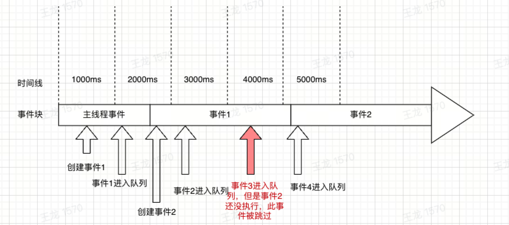

# 把人玩坏的倒计时


解决业务场景：PC商城重置密码验证码倒计时

以下内容根据实践方案不同，陈列出其优缺点

1、浏览器缩放的影响

2、浏览器推到后台的影响

3、切换tab的影响

4、加载大图片的影响

## 1、纯净版：setInterval

### 场景1：简单版

```js 
let time = 10
let base = new Date().getTime()
function countDown() {
    timer = setInterval(() => {
        let begin = new Date().getTime()
        time--
        let end = new Date().getTime()
        console.log('倒计时：', time)
        console.log('单次毫秒时间差：', begin - end)
        console.log('累计毫秒时间差：', begin - base)
        if (time == 0) {
            clearInterval(timer)
        }
    }, 1000)
}
countDown()
```

误差：

```js
-> % node timedown.js
倒计时： 9
单次毫秒时间差： 0
累计毫秒时间差： 1002
倒计时： 8
单次毫秒时间差： 0
累计毫秒时间差： 2002
倒计时： 7
单次毫秒时间差： 0
累计毫秒时间差： 3004
倒计时： 6
单次毫秒时间差： 0
累计毫秒时间差： 4004
倒计时： 5
单次毫秒时间差： 0
累计毫秒时间差： 5005
倒计时： 4
单次毫秒时间差： 0
累计毫秒时间差： 6006
倒计时： 3
单次毫秒时间差： 0
累计毫秒时间差： 7006
倒计时： 2
单次毫秒时间差： -1
累计毫秒时间差： 8005
倒计时： 1
单次毫秒时间差： 0
累计毫秒时间差： 9007
倒计时： 0
单次毫秒时间差： 0
累计毫秒时间差： 10007
```

结论：如果是短时间定时，低计算场景，这种方式性价比挺高

### 场景2：阻塞版：

```js
let startTime = new Date().getTime();
setInterval(function() {
  let i = 0;
  while (i++ < 1000000000);
}, 0);
setInterval(function() {
  console.log(
    "累计毫秒时间差：",
    new Date().getTime() - startTime
  );
}, 1000);
```

误差：

```js
-> % node b.js
累计毫秒时间差： 2026
累计毫秒时间差： 3553
累计毫秒时间差： 5067
累计毫秒时间差： 6583
累计毫秒时间差： 8099
累计毫秒时间差： 9659
累计毫秒时间差： 11177
累计毫秒时间差： 12717
```

结论：这种问题，单线程无解，建议用worker

## 2、递归版：

settTmeout递归模拟setInterval

递归settImeout可以解决setInterval的什么问题？首先，setInterval会存在【事件丢弃】和【重复执行】（事件1

和事件2连续执行）问题：如图，事件3被抛弃，并且事件1执行完毕，事件2马上执行



```js
setTimeout(() => {
    setTimeout(arguments.callee, interval)
}, interval)
```

解决问题：保证定时间隔，不会出现插队行为。但是解决不了定时不准的问题。

3、铂金版：

RAF

4、狗血版：

Api

5、

好文推荐：

evevtLop：https://juejin.cn/post/6844903512845860872

切换浏览器tab或者隐藏对定时的影响：https://juejin.cn/post/6899796711401586695?share_token=f73ea397-baa9-45a4-a478-8a5f30fc9ae3
