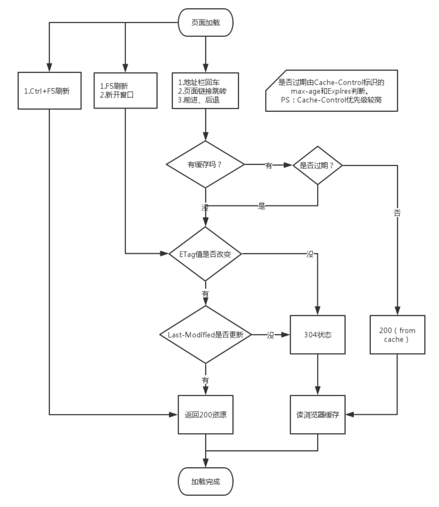

来源：https://www.cnblogs.com/lovesong/p/5352973.html

# [浏览器缓存机制](https://www.cnblogs.com/lovesong/p/5352973.html)

利用浏览器缓存，可以使得页面加载速度提高，也减轻服务端压力。有几个比较重要点如下：

1. 浏览器是如何判断缓存是否过期？
2. 服务端如何判断缓存已失效？
3. 为什么有了Last-Modified还要Etag？
4. 200 OK( from cache )和 304 Not Modified的区别？

下面是我总结的页面利用浏览器缓存的过程（图示）：

**浏览器是如何判断缓存是否过期？**

应该是根据Response Header里面的Cache-Control和Expires这两个属性，当两个都存在时，Cache-Control优先级较高。

**Cache-Control**

该字段用于控制浏览器在什么情况下直接使用本地缓存而不向服务器发送请求。一般具有以下值：

Public：指示响应可被任何缓存区缓存。

Private：指示对于单个用户的整个或部分响应消息，不能被共享缓存处理。这允许服务器仅仅描述当用户的部分响应消息，此响应消息对于其他用户的请求无效。

no-cache：指示请求或响应消息不能缓存。

no-store：用于防止重要的信息被无意的发布。在请求消息中发送将使得请求和响应消息都不使用缓存。

max-age：指示浏览器可以接收生存期不大于指定时间（以秒为单位）的响应。

min-fresh：指示浏览器可以接收响应时间小于当前时间加上指定时间的响应。

max-stale：指示浏览器可以接收超出超时期间的响应消息。如果指定max-stale消息的值，那么浏览器可以接收超出超时期指定值之内的响应消息。

PS：其实主要关注max-age这个值就行了。

**Expires**

Expires 头部字段提供一个日期和时间，在该日期前的所有对该资源的请求都会直接使用浏览器缓存而不用向服务器请求。

例如：

Expires: Sun, 08 Nov 2009 03:37:26 GMT

注意：

1. cache-control max-age 和 max-stale将覆盖Expires header。
2. 使用Expires存在服务器端时间和浏览器时间不一致的问题。
3. 另外有人说Expires 是HTTP 1.0的东西，现在默认浏览器均默认使用HTTP 1.1，所以它的作用基本忽略（暂不明了）。

**服务端如何判断缓存已失效？**

服务端通过If-Modified-Since（Last-Modified）和If-None-Match（Etag）这两个属性的值来判断缓存是否失效的。

**Last-Modified/If-Modified-Since**

Last-Modified/If-Modified-Since要配合Cache-Control使用。

Last-Modified：响应资源的最后修改时间。

If-Modified-Since：当缓存过期时，发现资源具有Last-Modified声明，则在请求头带上If-Modified-Since（值就是Last-Modified）。服务器收到请求后发现有头If-Modified-Since则与被请求资源的最后修改时间进行比对。若最后修改时间较新，说明资源又被改动过，则响应HTTP 200整片资源内容（写在响应消息包体内）;若最后修改时间较旧，说明资源无新修改，则响应HTTP 304，告知浏览器继续使用所保存的cache。

**Etag/If-None-Match**

Etag/If-None-Match也要配合Cache-Control使用。

Etag：资源在服务器的唯一标识（生成规则由服务器决定）。Apache中，ETag的值，默认是对文件的索引节（INode），大小（Size）和最后修改时间（MTime）进行Hash后得到的。

If-None-Match：当缓存过期时，发现资源具有Etage声明，则在请求头带上If-None-Match（值就是Etag）。服务器收到请求后发现有头If-None-Match 则与被请求资源的相应校验串进行比对，决定返回200或304。

**为什么有了Last-Modified还要Etag？**

Etag的出现主要是为了解决几个Last-Modified比较难解决的问题：

1. Last-Modified标注的最后修改只能精确到秒级，如果某些文件在1秒钟以内，被修改多次的话，它将不能准确标注文件的修改时间。
2. 如果某些文件会被定期生成，当有时内容并没有任何变化，但Last-Modified却改变了，导致文件没法使用缓存。
3. 有可能存在服务器没有准确获取文件修改时间，或者与代理服务器时间不一致等情形。

**200 OK( from cache )和 304 Not Modified的区别？**

200 OK( from cache )不向服务器发送请求，直接使用本地缓存文件。304 Not Modified则向服务器询问，若服务器认为浏览器的缓存版本还可用，那么便会返回304。

**200 OK( from cache ) 出现操作：**

1.地址栏回车

2.页面链接跳转

3.前进、后退

**304 Not Modified 出现操作：**

1.F5刷新

2.新开窗口

PS：但是这样不是绝对，还是会有奇怪的情况，例如百度首页无论是怎么刷，都是200 from cache。

**总结**

在写完这篇文章时候，有些地方我还是不大清楚的，就比如为什么百度首页无论是怎么刷，都是200 from cache。200 from cache和304 Not Modified出现条件并没有什么定论。
