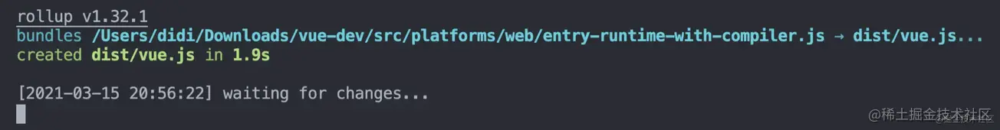
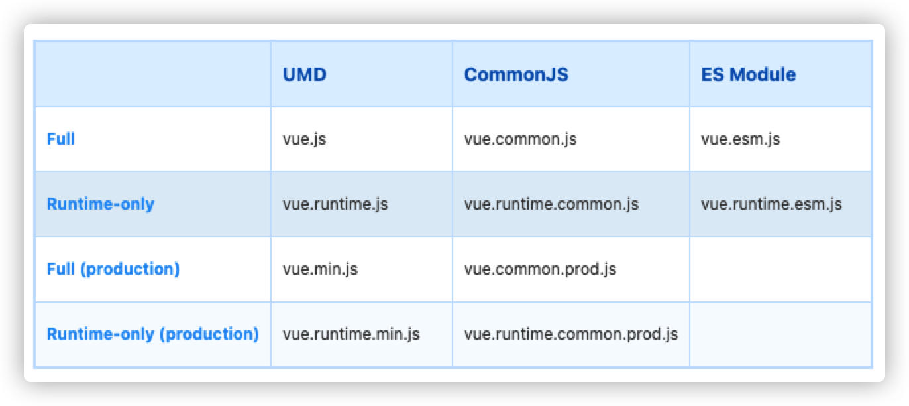

## 目标
精通 Vue 技术栈的源码原理，这是这系列的文章最终目的。

首先会从 Vue 源码解读开，会产出一系列的文章和视频，从详细刨析源码，再到 手写 Vue 1.0 和 Vue 2.0。之后会产出周边生态相关库的源码分析和手写系列，比如：vuex、vue-router、vue-cli 等。

相信经过这一系列的认真学习，大家都可以在自己的简历上写上这么一条：精通 Vue 技术栈的源码原理。

#### 1、适合人群

- 熟练使用 Vue 技术栈进行日常开发（增删改查）

- 想深入了解框架实现原理

- 想跳槽 或 跟老板提涨薪的同学（增删改查不值钱）


#### 2、如何学习

- 对于系列文章，顺序学习自然最好，但如果你本身对源码有一些了解或者对某一部分特别感兴趣，也可以直接看相应对应的文章。

- 很多人习惯利用碎片化时间去学习，对于快餐类的文章当然没有问题，但是如果你想深入学习，还是建议坐在电脑前用整块的时间对照着文章亲自动手去学。

- 记住：光看不练假把式，所以在学习过程中一定要勤动手，不动笔墨不读书，像笔记、思维导图、示例代码、为源码编写注释、debug 调试等，该上就上，绝对不能偷懒。
如果你觉得该系列文章对你有帮助，欢迎大家 点赞、关注，也欢迎将它分享给你身边的小伙伴。

#### 3、准备
现在最新的 Vue 2 的版本号是 2.6.12，所以我就以当前版本的代码进行分析和学习。

###### （1）下载 Vue 源码

- git 命令：git clone https://github.com/vuejs/vue.git

- 去 github 手动下载然后解压

###### （2）装包
执行 npm i 安装依赖，待装到端到端测试工具时可直接 ctrl + c 掉，不影响后续源码的研读。

###### （3）source map
在 package.json -> scripts 中的 dev 命令中添加 --sourcemap，这样就可以在浏览器中调试源码时查看当前代码在源码中的位置。

```json
{
  "scripts": {
    "dev": "rollup -w -c scripts/config.js --sourcemap --environment TARGET:web-full-dev"
  }
}
```
#### 4、开发调试

执行以下命令，启动开发环境：
```js
npm run dev
```
看到如下效果，并在 dist 目录下生成 vue.js.map 文件，则表示成功。到这里所有的准备工作均已完成，但是不要将当前命令行 ctrl + c 掉，因为你在阅读源码时会需要向源码中添加注释，甚至改动源码，当前命令可以监测源码的改动，如果发现改动会自动进行打包；如果关闭当前命令行，你会发现，随着你注释代码的编写，在浏览器中调试源码时会出现和源码映射的偏差。所以为了更好的调试体验就别关闭它。

  

#### 5、扫盲

执行 npm run build 命令之后会发现在 dist 目录下生成一堆特殊命名的 vue.*.js 文件，这些特殊的命名分别是什么意思呢？

###### （1）构建文件分类
  

###### （2）名词解释

- Full：这是一个全量的包，包含编译器（compiler）和运行时（runtime）。

- Compiler：编译器，负责将模版字符串（即你编写的类 html 语法的模版代码）编译为 JavaScript 语法的 render 函数。

- Runtime：负责创建 Vue 实例、渲染函数、patch 虚拟 DOM 等代码，基本上除了编译器之外的代码都属于运行时代码。

- UMD：兼容 CommonJS 和 AMD 规范，通过 CDN 引入的 vue.js 就是 UMD 规范的代码，包含编译器和运行时。

- CommonJS：典型的应用比如 nodeJS，CommonsJS 规范的包是为了给 browserify 和 webpack 1 这样旧的打包器使用的。他们默认的入口文件为 vue.runtime.common.js。

- ES Module：现代 JavaScript 规范，ES Module 规范的包是给像 webpack 2 和 rollup 这样的现代打包器使用的。这些打包器默认使用仅包含运行时的 vue.runtime.esm.js 文件。

###### 3、运行时（Runtime）+ 编译器（Compiler） vs. 只包含运行时（Runtime-only）

如果你需要动态编译模版（比如：将字符串模版传递给 template 选项，或者通过提供一个挂载元素的方式编写 html 模版比如$el），你将需要编译器，因此需要一个完整的构建包。
当你使用 vue-loader 或者 vueify 时，*.vue 文件中的模版在构建时会被编译为 JavaScript 的渲染函数。因此你不需要包含编译器的全量包，只需使用只包含运行时的包即可。
只包含运行时的包体积要比全量包的体积小 30%。因此尽量使用只包含运行时的包(webpack默认也是使用运行时的包)，如果你需要使用全量包，那么你需要进行如下配置：

###### webpack
```js
module.exports = {
  // ...
  resolve: {
    alias: {
      'vue$': 'vue/dist/vue.esm.js'
    }
  }
}
```
###### Rollup
```js
const alias = require('rollup-plugin-alias')

rollup({
  // ...
  plugins: [
    alias({
      'vue': 'vue/dist/vue.esm.js'
    })
  ]
})
```
###### Browserify
```js
{
  // ...
  "browser": {
    "vue": "vue/dist/vue.common.js"
  }
}
```

#### 5、源码目录结构
通过目录结构的阅读，对源码有一个大致的了解，知道哪些东西需要去哪看。

```
├── benchmarks                  性能、基准测试
├── dist                        构建打包的输出目录
├── examples                    案例目录
├── flow                        flow 语法的类型声明
├── packages                    一些额外的包，比如：负责服务端渲染的包 vue-server-renderer、配合 vue-loader 使用的的 vue-template-compiler，还有 weex 相关的
│   ├── vue-server-renderer
│   ├── vue-template-compiler
│   ├── weex-template-compiler
│   └── weex-vue-framework
├── scripts                     所有的配置文件的存放位置，比如 rollup 的配置文件
├── src                         vue 源码目录
│   ├── compiler                编译器
│   ├── core                    运行时的核心包
│   │   ├── components          全局组件，比如 keep-alive
│   │   ├── config.js           一些默认配置项
│   │   ├── global-api          全局 API，比如熟悉的：Vue.use()、Vue.component() 等
│   │   ├── instance            Vue 实例相关的，比如 Vue 构造函数就在这个目录下
│   │   ├── observer            响应式原理
│   │   ├── util                工具方法
│   │   └── vdom                虚拟 DOM 相关，比如熟悉的 patch 算法就在这儿
│   ├── platforms               平台相关的编译器代码
│   │   ├── web
│   │   └── weex
│   ├── server                  服务端渲染相关
├── test                        测试目录
├── types                       TS 类型声明

```


