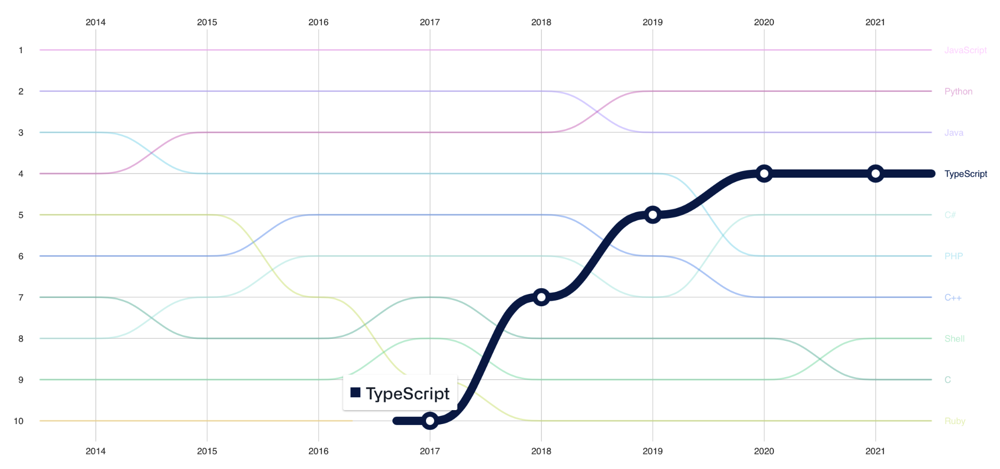
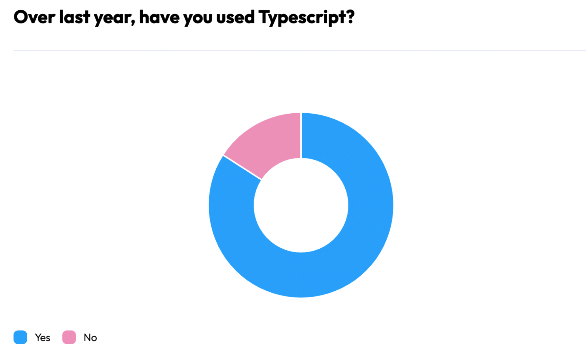
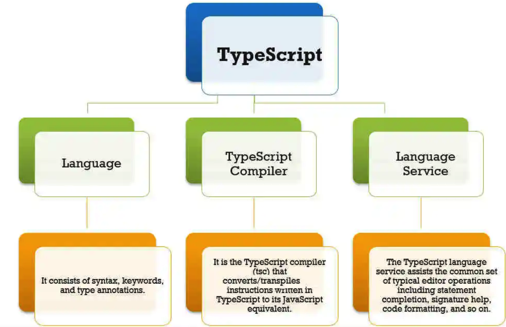

# 导读

当前业界，React + TypeScript这种开发模式，对于前端同学来说，非常受欢迎。一方面React框架，已经成为了很多前端开发的首选技术栈，另一方面TypeScript的类型约束，又能给开发同学提供类型检查、信息提示等能力。React和TypeScript两者的结合，能让前端同学在开发过程中事半功倍。

很多同学对于TypeScript的使用仅仅局限在非常简单的基础类型使用，对于在实战中更有价值的进阶用法，大家不很擅长。另外，在React的实战项目中，一些内置类型的使用，大多数同学都不知道怎么写比较合适，后面就会导致写很多的any，这样一定程度上就失去了TypeScript的使用意义。

本课程将着重介绍TypeScript类型基础以及类型系统在react中的应用，帮助读者更加深入去理解TypeScript最重要的部分。同时从字节内部的项目出发，精讲React + TypeScript的知识点，给出一套React + TypeScript的使用最佳实践，给前端同学有个学习的参考。

本章将会先简单介绍一下TypeScript背景，从使用率和受欢迎程度到功能特性，看一下TypeScript今天的发展现状。然后会介绍一下本课程大致的流程，包含的内容及侧重点。目标是通过介绍TypeScript类型系统的基本知识以及和react联动，让读者快速上手TypeScript，并在项目中快速落地实践。

# TypeScript简介

TypeScript 由 Microsoft 主导并得到所有主流 IDE 的支持，它使用 JavaScript 语法和语义以及帮助开发人员提高生产力和效率的附加功能，在前端编写代码时，更加可控和高效。

TypeScript 还在努力成为前端行业标准。现阶段完全不使用 TypeScript 的新项目已经很少了，而且在未来几年会越来越少。

TypeScript自2012年一经发布便大放异彩，迅速占领了前端开发者们的日常工作。使用率也突飞猛进，在不断改进功能和完善性能的背景下，稳稳地站到了一个新的高度。

The State of JavaScript 最近进行了一项调查，来总结 2022 年 JavaScript 的趋势和现状。其中超过 98% 的受访者使用 TypeScript 作为 JavaScript 编译器。同时根据State of frontend 2022的调查，今年使用TypeScript编码的人数占比达到了84%，相比去年上升了7个百分点。

TypeScript允许 JavaScript 不允许的可选类型。以下是 TypeScript 继续成为 JavaScript 中强大和流行趋势的一些原因。

* 丰富的静态类型支持
  * TypeScript 通过突出显示意外行为来检测程序错误。此错误检测功能发生在编译期间而不是执行期间。基于此，TypeScript 可以生成更高效的代码。
* 编译时类型检查
  * TypeScript基于结构化的类型，你可以基于类型语法构建出相对复杂的类型，但也是基于基本类型来构建。因此在编译时进行类型检查是简单且必要的步骤。
* 完全兼容JavaScript语法，简单易上手
  * TypeScript 使用 JavaScript 语法和其他功能。由于这些原因，对于 JavaScript 开发人员来说更容易学习。这些特性使 TypeScript 成为流行的编程语言。随着我们进入 2022 年下半年，TypeScript 会继续呈上升趋势。

TypeScript本身是一套非常复杂的语言功能支持集合，不止包含了与JavaScript一样的语法和基于此扩充的类型系统，这只是其中一小部分。通过下面这张图可以看出，语法和类型系统是TypeScript的一环。除此之外还包含了TypeScript编译器部分，语言服务部分。其中语言服务部分一般情况下用于在各种编辑器内部支持TypeScript语法高亮功能。语言服务部分和编译部分不在本教程讨论范围之内。

TypeScript通过引入强类型系统，补充了JavaScript的短板。原生JavaScript类型的灵活性导致在实际环境中可能会出现各种不确定的bug。通过使用TypeScript，我们可以在开发阶段既预测这些可能由类型转换导致的错误，从而提前规避bug，开发出更健全的程序。

* TypeScript可以编译出纯净、 简洁的JavaScript代码，并且可以运行在任何浏览器上、Node.js环境中和任何支持ECMAScript 3（或更高版本）的JavaScript引擎中。
* 类型允许JavaScript开发者在开发JavaScript应用程序时使用高效的开发工具和常用操作比如静态检查和代码重构。
  * 类型是可选的，类型推断让一些类型的注释使你的代码的静态验证有很大的不同。类型让你定义软件组件之间的接口和洞察现有JavaScript库的行为。
* TypeScript提供最新的和不断发展的JavaScript特性，包括那些来自2015年的ECMAScript和未来的提案中的特性，比如异步功能和Decorators，以帮助建立健壮的组件。
  * 这些特性为高可信应用程序开发时是可用的，但是会被编译成简洁的ECMAScript3（或更新版本）的JavaScript。

通过上面的介绍我们知道，TypeScript是在JavaScript上层封装了基本类型和定义了基本类型操作的一门新语言。最终其还是要编译成JavaScript运行在各个场景，编译过程把代码中涉及到的大多数类型部分剔除，只留下纯正的JavaScript代码。

接下来简单介绍一下本课程包含的内容。相信读者读过本教程的内容，一定能更熟练地运用TypeScript类型，在清晰地认识TypeScript类型系统的同时，提升自己的工作效率，在工作中大放异彩。

# 课程简介

通过阅读上一小节我们知道，类型其实只是TypeScript这个庞然大物中的一小部分，除了类型其实还有很多值的去深入研究的东西，但如果想讲透所有知识点，需要的篇幅和时间也是非常多的。

TypeScript学习流程可以简单概述为：类型 -> 类型操作 -> 语法 -> 编译/工程。现如今，前端各大开发框架层出不穷，基本每一套开发框架都会适配TypeScript，我们只需要按照框架提供的标准配置进行开发工作即可满足大多数工作场景。所以本课程包含了其中最为接近普通开发者的前两部分：类型和类型操作。

除此之外，为了更好的满足开发者的需求，以及更加贴近真实的开发场景，我们还结合TypeScript和当下使用人数最多的前端框架React，讲解了TypeScript如何在React中应用，以及详细介绍了React中封装的独有类型。更进一步，通过一个简单的TODO LIST项目讲解，将所学知识串联起来，做到融会贯通。

本课程将会从TypeScript类型基础出发，一点点讲解TypeScript中如果编写类型，以及最常用到的类型有哪些，在使用TypeScript开发项目期间，需要注意的点有哪些。其中包含了很多代码片段示例，再加上通俗易懂的讲解，帮助读者掌握TypeScript的基本用法。

本课程不会讲解JavaScript语法，所以会要求读者有一定的编程基础，最好有以下基础能力：

* JavaScript基础语法。（例如：数组、立即执行函数等）
* ES6语法。（例如：类、解构、Set集合等）

本课程会先讲解类型基础，但此类型基础并非TypeScript中的基础类型。这个类型基础是把工作中最常用到的以及最可能在大型项目中用到的类型做一个集合，统一讲解。所以会要求读者对JavaScript有一定的熟悉程度。

此外除了类型基础，还会讲到一些不常用的功能及知识。虽然不是重点讲解，但还是希望读者基于此对TypeScript有更深层次的了解，加深自己对TypeScript类型的理解，为将来全面进阶奠定基础。下面是本课程的大致的学习路线：

暂时无法在飞书文档外展示此内容

具体的，本课程所讲内容可以分为以下两个模块，每个模块会划分成4-5个子模块，方便读者更好的理解学习。

# 总结

在开篇第一章，主要为大家介绍了Typescript相关的背景信息、普及率，以及学习路径。同时介绍了本课程的定位，以及后续章节将会介绍的具体内容。

通过阅读本课程，你将会获得：

1. 知识体系 - TypeScript基本类型和类型操作
2. 知识体系 - TypeScript类型的进阶用法
3. 实践结合 - TypeScript在React中的应用
4. 实践结合 - React内置类型与开发应用

期待和大家一起学习，共同进步。
