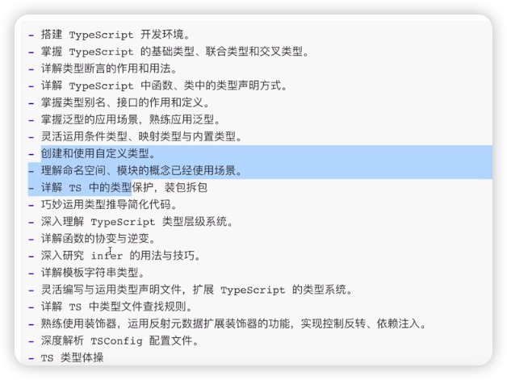
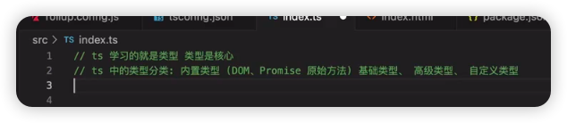

地址：https://kbudi.xetslk.com/sl/3uDEmL

# 大纲



# 环境：

1、安装typescript

2、根目录tsc --init

3、该目录下编写ts文件，执行tsc编译,加上--watch就是实时编译

【非必选步骤】

4、也可以通过脚手架实时编译：

```js
npm install typescript rollup rollup-plugin-typescript2 @rollup/plugin-node-resolve rollup-plugin-serve -D
```

5、配置package.json：

"type": "module", // 表示采用es6语法（编写rollup.config.js）

6、启动脚本

rollup -c -w


# ts学啥



比如写一个Promise，就能command+左键，知道Promise是在全局typescript中已进行了定义

比如原始方法，arr.push，点击push就能进入array的定义，看array上所有方法

高级类型，就是通过基础类型搞出来的比如Omit，Partial等

自定义类型：以上这些类型都搞不定才想着自己去定义一个
