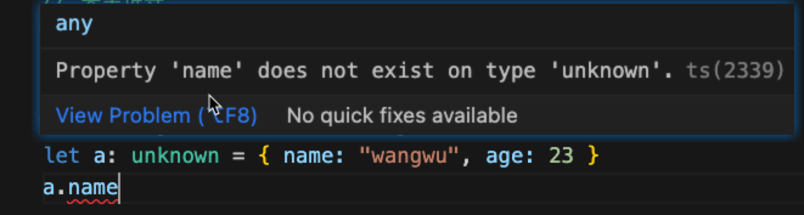
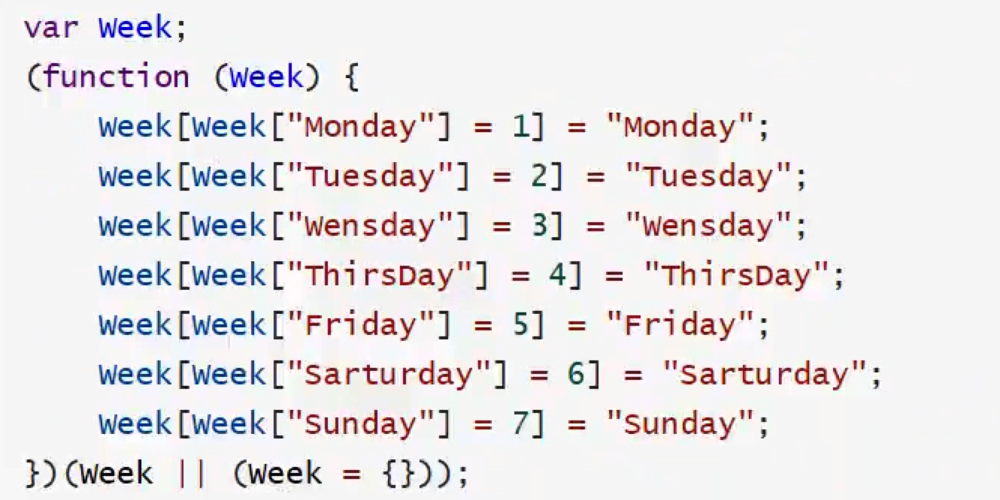
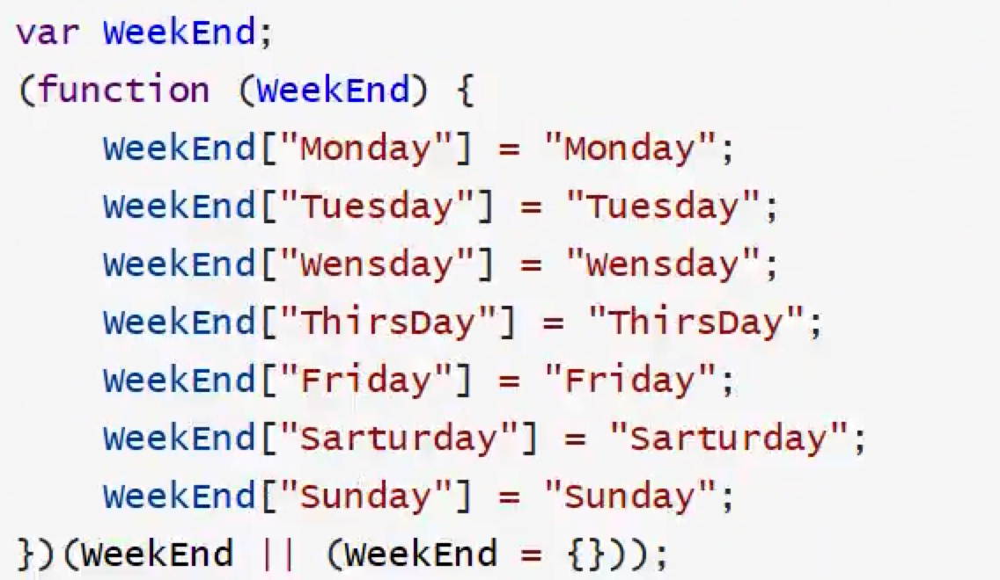
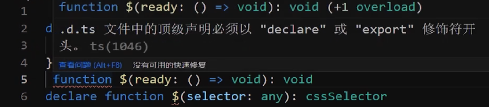

## TS优势

优势1：编译时静态类型检测：函数或方法传参或变量赋值不匹配时，会出现编译错误提示 ，规避了开发期间的大量低级错误，省时，省力。

优势2：能自动提示：变量类型、变量属性，不用来回切换文件或不小心写错导致的编码隐患。

优势3： 引入了泛型：让大中项目，前端框架底层源码具备了高可扩展性这个巨大的优势，同时也有类型安全检查的优势。

优势4： 强大的 d.ts 声明文件：声明文件像一个书的目录一样，清晰直观展示了依赖库文件的接口，type类型，类，函数，变量等声明。

优势5：轻松编译成 JS 文件：即使 TS 文件有错误，绝大多数情况也能编译出 JS 文件。

优势6：灵活性高： 尽管 TS 是一门 强类型检查语言，但也提供了 any 类型 和 as any 断言，这提供了 TS的灵活度。

## 1、开发环境搭建：

```powershell
npm init -y 

yarn  add typescript -D

tsc --init
```

## 2、tsconfig的常见配置：

```js
{
  "compilerOptions": {
    "target": "es2020", // 指定 TS 编译成 JS 后的js版本 // 一般是写成 ES5
    "module": "commonjs", // TS 编译成 JS 后采用的模块规范 commonjs amd cmd  es等   
    "lib": ["DOM","ES2020"], /*  指定 TS 编码期间可以使用的库文件版本 比如：ES5就不支持Set集合 */
    "outDir": "./dist", //     指定 TS 文件编译成 JS 后的输出目录                 /* Redirect output structure to the directory. */
    "rootDir": "./src", // 指定 TS 文件源码目录
    "strict": true, // 启用严格检查模式
    "strictNullChecks":false,// null 和 undefined即是值，也是类型, null 和 undefined 值 只能赋值给 any ,unknown和它们各自的类型
    "noImplicitAny": true, // 一般是指表达式或函数参数上有隐含的 any类型时报错
    "experimentalDecorators": true, /* 启用ES7装饰器实验开启选项 */
    "emitDecoratorMetadata": true, /* 启用装饰器元数据开启选项 */
    "declaration": true, // 指定 TS 文件编译后生成相应的.d.ts文件
    "removeComments": false, // TS 文件编译后删除所有的注释
  
    "baseUrl": "src", /* 工作根目录  解析非相对模块的基地址*/
    "paths": {
        "@/datatype/*": ["datatype/*"],
        "@/131/*": ["131/*"],
        "@/132/*": ["132/*"]
      },  
    // 有些依赖库底层 为了兼容CommonJs规范、AMD规范这二者的规范中相互兼容，
    // 使用了 export =，将二者规范统一。
    // "esModuleInterop":true表示允许依赖库中出现export = 这种兼容规范导出的格式，
    //  TS 可以用import from导入 
    "esModuleInterop": true,  
  },
  "include": [ // 需要编译的ts文件一个*表示文件匹配**表示忽略文件的深度问题
    "./src/**/*.ts" // 匹配src下所有的ts文件
, "src/datatype/typepsenumts"  ],
   "exclude": [
    "./src/**/test",
    "./src/**/premit", 
  ]
}
```

## 3、any 和 unknown 的两个区别

- 定义为any 的变量还可以赋值给一个比如number类型(any类型可以作为别的类型的子类存在)，但是定义为unknown的类型就不能赋值给一个确定的类型，他们的包含关系：

  
- ```ts
  // any既是各种数据类型的子类也是各种数据类型的父类，以下代码TS不报错
  const a:number = 3;
  const j:any = a;
  const k:number = j;

  // 以下代码TS也不报错
  const a:unknown = 3;
  const j:any = a;
  const k:unknown = j;
  ```
- 类型注释和类型推导

```ts
// 类型注解
let price: number = 3
type StudentType = { name: string, age: number }
let stuObj: StudentType = { name: "wangwu", age: 23 }

// stuObj.age  当输入stuObj.的时候就已经有提示了

// 类型推导
let count = 3;
let custObj = { name: "wangwu", age: 23 }

// custObj.name  当输入custObj.的时候就已经有提示了
```

- 推导关系

当我们使用any写法比如：

```ts
const a: any = {"name": 23}
```

我们在输入a.的时候，就不会有name的输入建议了，因为any的原因，a已经不存在类型推导，但是可以写a.name不会因为ts报错，但是我们用unknown:

```ts
const a: unknown = {"name": 23}
```

再调用a.name就会有警告：



- 当我们把一个变量定义为any，那么写成any[]，和写成any代表含义一样

### 案例1：

```ts
let obj = {name: 'wang', age: 1}
let username = 'name'
obj[username]
```

第三行会报错：

Element implicitly has an 'any' type because expression of type 'string' can't be used to index type '{ name: string; age: number; }'.

原因：username可以随意变化

解决办法一：

    把username定义成const，这样就不会报错

解决办法二：

    letusername: keyof typeof obj = 'name'

案例2：

```ts
let obj:object = {name: 'wang', age: 1}
const username = 'name'
obj[username]
```

第三行会报错：

Element implicitly has an 'any' type because expression of type '"name"' can't be used to index type '{}'.

原因：obj被object进行了类型注解，那么在执行obj[username]的时候就是从object上去找username属性，肯定找不到就报警告了

解决办法1：

```ts
let obj:object = {name: 'wang', age: 1}
const username = 'name'
let s = (obj as any)[username]
```

## 4、 BigInt

TS3.2版本后才出现的数据类型

如果使用bigInt，ts编译成js也是用的js的bigint，所以要注意bigint的兼容性

同时tsconfig.json文件中lib依赖要加上["ES2020"]

```ts
// 这种就是导致运算错误
// const max = Number.MAX_SAFE_INTEGER;
// console.log(max)
// const maxBigOne = max + 1
// console.log(maxBigOne)
// const maxBigtwo = max + 2
// console.log(maxBigtwo)
// console.log(maxBigOne === maxBigtwo)

// 这种是bigint标准写法
// const max = BigInt(Number.MAX_SAFE_INTEGER);
// console.log(max)
// const maxBigOne = max + BigInt(1)
// console.log(maxBigOne)
// const maxBigtwo = max + BigInt(2)
// console.log(maxBigtwo)
// console.log(maxBigOne === maxBigtwo)

// 这种简写的写法也ok，但是有个比较诡异的要求，tsconfig中的target必须改成"ES2020"
const max = BigInt(Number.MAX_SAFE_INTEGER);
console.log(max)
const maxBigOne = max + 1n
console.log(maxBigOne)
const maxBigtwo = max + 2n
console.log(maxBigtwo)
console.log(maxBigOne === maxBigtwo)

export { }
```

5、never应用场合

```ts
// dataFlowAnalysisWithNever 方法穷尽了 DataFlow 的所有可能类型。 
// 通过这个示例，我们可以得出一个结论：
// 使用 never 避免出现未来扩展新的类没有对应类型的实现，
// 目的就是写出类型绝对安全的代码。
type DataFlow = string | number
function dataFlowAnalysisWithNever(dataFlow: DataFlow) {
  if (typeof dataFlow === 'string') {
    console.log(dataFlow)
  } else if (typeof dataFlow === 'number') {

  } else {
    // dataFlow 在这里是 never 
    let nothings = dataFlow;//never
  }
}
dataFlowAnalysisWithNever("免税店")


export { }
```

解释：第13行，如果 DataFlow 只定义了 string | number，那么13行就是nerver情况，如果哪天dataFlow扩展了比如boolean，那么13就会变成赋值boolean的操作，就不是nerver了

## 5、枚举

一个比较好的应用场景，就是各种if else进行常量比较的时候引入枚举

使用：

数字枚举：

```ts
enum Week {
  Monday = 1,
  Tuesday,
  Wensday,
  ThirsDay,
  Friday,
  Sarturday,
  Sunday
}
```

原理：



字符串枚举：

```ts
// 字符串枚举
enum EnumAuditStatus {
  MANAGER_ADUIT_FAIL = "项目经理审核失败"
  NO_ADUIT = "没有审核"
  MANAGER_ADUIT_SUCCESS = "项目经理审核成功"
  FINAL_ADUIT_SUCCESS = "财务审核成功"
}

//  字符串枚举
enum WeekEnd {
  Monday = "1",
  Tuesday = "2",
  Wensday = "Wensday",
  ThirsDay = "ThirsDay",
  Friday = "Friday",
  Sarturday = "Sarturday",
  Sunday = "Sunday"
}
```

我们可以通过WeekEnd.Monday 取出 1，也能通过WeekEnd['1']取出Monday

原理：



6、元祖

```ts
// 1. 为什么用元组(tuple)
// 确定的顺序和类型，本质上还是一个数组
// 2. 符合下面条件的数组就是一个元组
//  定义时的元素的类型确定，但各个元素的类型不必相同。
// 为元素赋值时，该值必须是当前位置的类型

let salary: [string, number, number, string] = ["王五", 8000, 10000, "ok"]

// 3.取值
console.log(salary[3])
```

## 6、接口和类和type

- 我们定义接口的时候，接口里面可以定义属性和方法，但是当方法多了过后，定义了接口还得传进来实参定义的函数，返回变得麻烦，【当函数多，属性少】的场合，反而直接定义class来的方便
- 接口只能定义对象类型或者「接口当成名字的函数类型(下面例子2)」}，type可以定义任何类型，包括基础类型，联合类型， 交叉类型，元祖
- 接口可以extends一个或者多个接口或类，也可以继承type，但是type类没有继承功能，还有一般用接口去继承类或者type的应用场景很少
- 用type 交叉类型&可以让类型中的成员合并
- 同名接口会合并
- 接口中如果写了一个函数：load(): void; 和load: () => void;效果一样

```ts
// type 定义基础类型
type num = number
let price: num = 3

type BaseType = string | number | symbol
//let data:BaseType=Symbol()


//  type 定义联合类型例子2：
// interface Car { brandNo: string }
// interface Plane { No: string; brandNo: string }
// type TypVechile = Car | Plane
// let vechile: TypVechile = { No: "110S"; brandNo: "直升飞机" }

interface Car { brandNo: string }
interface Plane { No: string; brandNo: string }
type TypVechile = [Car, Plane] // 元祖类型 
let vechile: TypVechile = [{ "brandNo": "奥迪" }, { No: "110S", brandNo: "直升飞机" }]

type Group = { groupName: string, memberNum: number }
type GroupInfoLog = { info: string, happen: string }
type GroupMemeber = Group & GroupInfoLog// type 交叉类型合并

let data: GroupMemeber = {
  groupName: "001", memberNum: 10,
  info: "集体爬山", happen: "中途有组员差点滑落,有惊无险",
}

// 以下两个同名类就发生了合并，name和message都不能少
interface Error {
  name: string;
}

interface Error {
  message: string;
  stack?: string;
}
// 接口合并
let error: Error = {
  message: "空指针",
  name: "NullPointException"
}

export { }

```

例子2：特殊用法：

```ts
// 接口当名字的函数类型
// Vuex4 特殊点：这里定义的接口，里面的函数明没有名称
interface ActionContext {
  (state: any, commit: any): void
}
// 在定义actionContext的时候，后面不再是一个对象， 而是直接是一个函数
let actionContext:ActionContext=(state:any,commit:any):void=>{
    console.log("state:",state);
}
actionContext("abc","df")
```

## 7、联合类型技巧

当我们想传值拿来当boolean值使用，就可以用到联合类型

```ts
type IncreaseBoolean = Boolean | 1 | 0

function mounted(isStartUp: IncreaseBoolean) {
  if (isStartUp) {
    console.log("yes");
  } else {
    console.log("no");
  }
}

mounted(1)
```

## 8、声明文件用途

### tsconfig文件中的declaration：

"declaration": true, // 指定 TS 文件编译后生成相应的.d.ts文件

我们在tsconfig中开启了这配置，就会在使用tsc编译的时候同时生成.d.ts文件

注意点：

- 当我们编写了一个ts文件，如果没有对这个属性、方法、类等进行导出，那么生成的.d.ts文件里面的内容就不会有相应属性、方法、类等的声明，因为申明文件就是拿来给别人调用的时候的提示和约束，如果没有导出，别人也永不了，所以也就不会生成对应的内容
- 但我们在一个工程下任意位置写了一个.d.ts的声明文件，那么什么地方可以使用呢？这个其实就是在工程的根目录tsconfig的inlude字段，只要包含了这个.d.ts，那么项目中任意位置都可以使用这个声明

#### 例子1：

##### 第一步：写一个声明文件：

```ts
declare type cssSelector = {
  css: (key: string, value: string) => cssSelector
}
declare function $(ready: () => void): void
declare function $(selector: any): cssSelector
```

注意点：

可以看出同一个函数可以被重复定义，比如这里的$

type定义的类型，可以被自己引用，不存在死循环的问题

##### 第二步：调用：

```ts
$(function () {

})

$("div").css("border", "1px solid red").css("marginTop", "20px");

```

注意点：

- 上面的\$函数里面传递了两种参数，但是都能正常使用，就是因为.d.ts中定义了两种\$
- 第二种写法不断的使用css函数，就是应为.d.ts中定义的cssSelector，第二种\$函数运行结果返回cssSelector这个对象，再读取.css函数，再返回cssSelector，就实现了链式调用

### tsconfig文件中的skipLibCheck

"skipLibCheck": true // 跳过申明文件的检查，如果申明文件有问题就会报错

比如：

```ts
declare type cssSelector = {
  css: (key: string, value: string) => cssSelector
}
declare function $(ready: () => void): void
declare function $(selector: any): cssSelector

```

注意点：

- 我们如果把函数的declare去掉，就会报错：



- 虽然declare写，但是我们可以把第5行缺失的declare写成export，这样第5行就不报错了，但是第六行就会报错，因为export后面的函数是不允许重名的，但是declare可以
- 上面演示，虽然函数在声明文件中必须要有export或者declare来声明，但是我们却可以把type，interface这种ts独有的语法前面的declare去掉不会有警告，原因就是ts文件最终是被编译成js运行，type，interface这种只是在ts编译期间的类型检查，type，interface最后是不存在的，所以可以不写declare，同样的道理，class就必须加declare，因为class最后被编译成js，要不是class要么就是fn，在js中都存在这种语法（但是：如果d.ts文件中的type，interface这种会被别人使用，最好还是写上declare或者export)

### 声明文件中的命名空间

如上，我们在一个d.ts文件中declare了\$，再在另外一个d.ts文件中declare了\$函数，这个时候在js中直接使用对应的\$实现传参，的确也是ok的，但是并不知道具体从哪个文件中导出来的，所以命名空间在声明文件中还是有一定的好处

命名空间在被编译成js后会被当成编译成对象的语法

demo：

声明文件：

```ts
declare namespace JQuery {
  type cssSelector = {
    css: (key: string, value: string) => cssSelector
  }
  export function $(ready: () => void): void
  export function $(selector: any): cssSelector
  export namespace $ { // 嵌套命名空间
    function ajax(url: string, settings?: any): void
    function get(url: string, settings?: any): void
    function post(url: string, settings?: any): void
  }
}
```

调用：

```ts
JQuery.$(function () {

})

JQuery.$("div").css("border", "1px solid red").css("marginTop", "20px");

JQuery.$.post("http://localhost:5000/search")
```

### 声明文件中的模块

相对于命名空间，我们在ts中调用的时候，还得Jquery.$.XX的形式去调用，调用链写的比较长，【模块】的方式就更加的简洁（用的更多一些)

编写模块：

```ts

declare module "JQueryModule" {
  type cssSelector = {
    css: (key: string, value: string) => cssSelector
  }
  function $(ready: () => void): void
  function $(selector: any): cssSelector
  namespace $ {
    function ajax(url: string, settings?: any): void
    function get(url: string, settings?: any): void
    function post(url: string, settings?: any): void
  }
  //export default $ // 只适合于esModule
  export =$ // 模块化更加的兼容
}

```

调用：

```ts
import $ from 'JQueryModule' // 需要手动的引用一下


$(function () {

})

$("div").css("border", "1px solid red").css("position", "relative");
```

### tsconfig文件中的allowJs

"allowJs": true, // 代表ts中可以使用js

当我们在js中定义了一个函数，然后导出，被引入到ts中使用，如果不开启"allowJs": true,就会因为这个函数没有被定义而导致ts编译报错

学习TS的意义：

相对以前 JavaScript 不得不用 构造函数来充当”类“，TypeScript 类的出现可以说是一次技术革命。让开发出来的项目尤其是大中项目的可读性好，可扩展性好了不是一点半点。

TypeScrip 类的出现完全改变了前端领域项目代码编写模式，配合 TypeScript 静态语言，编译期间就能检查语法错误的优势【项目上线后隐藏语法错误的风险几乎为零，相比不用 TypeScript 开发项目，使用 TypeScript 后对前端项目尤其是大中项目的开发 或底层第三方插件，组件库的开发带来的优势已经超乎了想象】。

TypeScript 类让前端开发人员开发和组织项目或阅读各大前端框架源码的思维问题的方式变得更先进，更全面了许多。因为类是 OOP【面型对象编程】的技术基石，OOP 思想来自于生活，更利于开发人员思考技术问题。TypeScript 类已经成了每次前端面试的高频面试考点。

在前端各大流行框架开发的项目中，比如 Vue3 项目，Angular项目， 基于 Antd UI 库的项目 还是后端 Nodejs 框架，比如：Nestjs，亦或是 Vue3 底层源码，都可以频频见到类的身影。

尽管 TypeScript 类照搬了 Java 后端语言的思想，但 TypeScript 类的底层依然是基于 JavaScript 的，这一点对于前端工程师更深入理解 TypeScript 打开了一条理解之道，提升他们更深厚的 JavaScript 功底从而为面试加分和项目的运用都提供了间接的帮助。

TypeScript 类是 OOP 的技术基石，包括类、属性封装丶继承、多态、抽象丶泛型。紧密关联的技术包括方法重写，方法重载，构造器，构造器重载，类型守卫，自定义守卫，静态方法、属性，关联引用属性，多种设计模式等。
