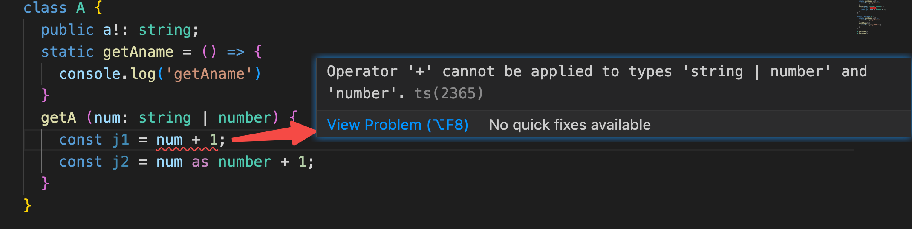

## 本地环境配置

- （1）初始化 npm init --yes 出现 package.json
- （2） 安装 typescript

  全局安装 cnpm i typescript -g     或

  本地安装： cnpm i typescript -D   或

  yarn安装 yarn global   add typescript

  【cnpm i typescript -D 是 cnpm install typescript --save-dev的缩写】
- (3）生成tsconfig.json文件

  tsc --init
- （4）修改 tsconfig.json 中的配置
  “outDir:  "./dist"     --outDir是ts编译后生成js文件保存的目录
  "rootDir": "./src", --rootDir是自己编写的ts源文件所在的目录
  注意: dist src package.json 必须是在一个目录下
- （5）编译src目录以及子目录下的ts文件

  tsc 【在src当前目录下：输入tsc   注意直接写tsc命令即可】
  【会把src目录以及子目录下的ts文件全部编译成js文件，并全部输出到dist目录中】
- （6）安装 ts-node

  ts-node让node能直接运行ts代码，无需使用tsc将ts代码编译成js代码。【ts-node则包装了node，它可以直接的运行ts代码】

  全局安装     cnpm i ts-node -g     或

  本地安装： cnpm i ts-node -D   或

  yarn安装：yarn global   add ts-node
- （7）安装nodemon工具 【自动检测工具】
  nodemon作用：【nodemon可以自动检测到目录中的文件更改时通过重新启动应用程序来调试基于node.js的应用程序】

  全局安装  cnpm install -g nodemon     或

  本地安装： cnpm i nodemon  -D  或

  yarn安装    yarn add nodemon  -D
- （8） 在package.json中配置自动检测，自动重启应用程序

  ```js
  "scripts": {
     "dev": "nodemon --watch src/ -e ts --exec ts-node ./src/app.ts"
  }
  ```

  nodemon --watch src/  表示检测目录是package.json同级目录src

  -e ts   表示nodemon 命令准备将要监听的是ts后缀的文件

  --exec ts-node ./src/project/app.ts 表示检测到src目录下有任何变化 都要重新执行app.ts文件

以上可以在cmd中进行调试，如果需要浏览器环境调试，可以继续如下操作：

Parcel打包支持浏览器运行TS文件（可以在index.html文件中直接引用ts文件)

    （1）安装Parcel打包工具：npm install parcel-bundler --save-dev

    （2）在package.json中给npm添加启动项，支持启动parcel工具包

```js
"scripts": {
	"start": "parcel ./index.html"
}
```

    (3)  启动parcel工具包

    cnpm run start  【cnpm start】或  npm  run start  【npm start】或 yarn run start 【yarn start】

## 继承存在的目的

避免重复定义+内存空间的浪费

以往我们的认知是把公共的属性，方法拿出来放在一个基类中，避免重复定义，其实从另外一个角度上来讲，如果是对象，数组，方法等复杂的数据类型，如果是公共的，就应该放在基类中，避免每次new都会暂用堆内存，导致空间浪费

我们将tsconfig的target输出改成"ES5":

ts：

```ts
class Person {
  name:string = 'temp-wang'
  constructor(_name: string) {
    this.name = _name
  }
  eat(what:string):void {
    console.log(`${this.name} is eat ${what}`)
  }
}

```

编译成ES5后：

```js
"use strict";
var Person = /** @class */ (function () {
    function Person(_name) {
        this.name = 'temp-wang';
        this.name = _name;
    }
    Person.prototype.eat = function (what) {
        console.log("".concat(this.name, " is eat ").concat(what));
    };
    return Person;
}());

```

可以看出方法被挂在到原型上面去了，这里决定一个引用属性是否被放到原型上，其实就是看他是否具有共性，没有共性的东西只能放在当前类上

## TS中模块化检测的问题

在ts中，如果我们在一个工程中（即使不同文件)重复定义了一个变量会提示报错：


因为ts会在整个工程中进行全局搜索，解决这个问题的办法就是把其中一个变成模块，比如shop.ts的最后一行加上export {}就会让这个文件的ts检测只在当前模块检测


## 函数重载

理解：完整一系列功能相同，但是细节不同的包装

比如我们要完成下面一个功能，可以根据id或者type进行查找数据，返回的数据可能是Message或者Message[]

不用函数重载完成：

```TS
type MessageType = "image" | "audio" | string;//微信消息类型
type Message = {
  id: number;
  type: MessageType;
  sendmessage: string;
};
let messages: Message[] = [
  //let messages: Array<Message> = [
  {
    id: 1, type: 'image', sendmessage: "你好啊,今晚咱们一起去三里屯吧",
  },
  {
    id: 2, type: 'audio', sendmessage: "朝辞白帝彩云间，千里江陵一日还"
  },
  {
    id: 3, type: 'audio', sendmessage: "你好！张无忌"
  },
  {
    id: 4, type: 'image', sendmessage: "刘老根苦练舞台绝技！"
  },
  {
    id: 5, type: 'image', sendmessage: "今晚王牌对王牌节目咋样?"
  }]

// 1.函数结构不分明,可读性，可维护性变差
function getMessage(value: number | MessageType):
  Message | undefined | Array<Message> {
  if (typeof value === "number") {
    return messages.find((msg) => { return value === msg.id })
  } else {
    //return messages.filter((msg) => { return value === msg.type })
    return messages.filter((msg) => value === msg.type)
  }
}

console.log(getMessage("audio"));
// TS没有办法运行之前根据传递的值来推导方法最终返回的数据的数据类型
// 只可以根据方法定义的类型展现
//let msg=getMessage(1) 
//console.log(msg.sendMessage)//错误 类型“Message | Message[]”上不存在属性“sendMessage”。
//  类型“Message”上不存在属性“sendMessage”
let msg = (<Message>getMessage(1)).sendmessage // 强行转换类型，不推荐
console.log("msg:", msg)// msg: 你好啊,今晚咱们一起去三里屯吧


export { }
```

可以看出getMessage函数内部进行了一系列的逻辑判断，结构不分明，并且：

出参：返回的数据类型不统一，导致没办法读取sendMessage方法

入参：联合类型，会导致推导的可用方法变少，就好比我们把一个数据类型定义成：

let str:string|unmber，当我们尝试使用str的方法，就只剩下string和number交叉（共同)的方法了


当然以上问题，我们可以通过明确的判断，比如对参数value通过typeof缩小范围，也可以将返回值断言或者统一成一种格式返回，终归是不够分明的，所以有了函数重载：

```ts
function getMessage(value: number, myname: string): Message//第一个根据数字id来查询单个消息的重载签名
function getMessage(value: MessageType, readRecordCount: number): Message[]//第二个根据消息类型来查询消息数组的重载签名
//function getMessage(value: number | MessageType, readRecordCount: number = 1): Message | undefined | Message[] {
//function getMessage(value: any, readRecordCount: any = 1): Message | undefined | Message[] {
// function getMessage(value: number): Message //这个功能本来就没有第二个参数，所以在实现函数里面给readRecordCount加了默认值1，避免这里必须传参
//function getMessage(value: any, readRecordCount: any = 1):any { // 实现函数的入参可以写成any，因为他不知道重载函数的入参到底是什么类型，但是出参最好不要写any，因为我们可以确切的知道最终输出什么
// 并且value可以是any，unknown，但是readRecordCount可以是any不能是unkown，因为unknown是常见类型的父类，splice函数入参要求是number | undefined，不能把父类传给子类
//function getMessage(value: any, myname: string = "abc", readRecordCount: any = 1) {
function getMessage(value: any, value2: any = 1) {
  //console.log(myname)
  if (typeof value === "number") {
    return messages.find((msg) => { return 6 === msg.id })//undefined
  } else {
    //return messages.filter((msg) => { return value === msg.type })
    return messages.filter((msg) => value === msg.type).splice(0, value2)
  }
}
getMessage(1, "df")

//console.log(getMessage(6).sendmessage);
getMessage("image", 2).forEach((msg) => {
  console.log(msg);
})
```

函数重载的规则：

TS 的函数重载比较特殊，和很多其他后端语言的方法重载相比，多了不少规则。学习函数重载，先要了解什么是函数签名，定义如下：

**函数签名** [ function signature ]：函数签名=函数名称+函数参数+函数参数类型+返回值类型四者合成。在 TS 函数重载中，包含了实现签名和重载签名，实现签名是一种函数签名，重载签名也是一种函数签名。

关于函数重载的定义，我们先来看一个很多其他资料提供的不完整且模糊的TS函数重载定义：

**不完整模糊的 TS 函数重载定义**：一组具有相同名字，不同参数列表的和返回值无关的函数 。

**完整的函数重载定义**：包含了以下规则的一组函数就是TS函数重载 【规则内容多，大家要多记，多实践方可】

**规则1：**由一个实现签名+ 一个或多个重载签名合成。

**规则2：** 但外部调用函数重载定义的函数时，只能调用重载签名，不能调用实现签名，这看似矛盾的规则，其实 是TS 的规定：实现签名下的函数体是给重载签名编写的，实现签名只是在定义时起到了统领所有重载签名的作用，在执行调用时就看不到实现签名了。

**规则3：**调用重载函数时，会根据传递的参数来判断你调用的是哪一个函数

**规则4:**  只有一个函数体，只有实现签名配备了函数体，所有的重载签名都只有签名，没有配备函数体。

**规则5:  关于参数类型规则完整总结如下：**

实现签名参数个数可以少于重载签名的参数个数，但实现签名如果准备包含重载签名的某个位置的参数 ，那实现签名就必须兼容所有重载签名该位置的参数类型【联合类型或 any 或 unknown 类型的一种】。

**规则6： 关于重载签名和实现签名的返回值类型规则完整总结如下：**

必须给重载签名提供返回值类型，TS 无法默认推导。

提供给重载签名的返回值类型不一定为其执行时的真实返回值类型，可以为重载签名提供真实返回值类型，也可以提供  void 或 unknown 或 any 类型，如果重载签名的返回值类型是 void 或 unknown 或 any 类型，那么将由实现签名来决定重载签名执行时的真实返回值类型。 当然为了调用时能有自动提示+可读性更好+避免可能出现了类型强制转换，强烈建议为重载签名提供真实返回值类型。

不管重载签名返回值类型是何种类型【包括后面讲的泛型类型】，实现签名都可以返回 any 类型 或 unknown类型，当然一般我们两者都不选择，让 TS 默认为实现签名自动推导返回值类型。

#### 口语化的总结函数重载特点和优势：（这里还不涉及范型）

1、如果我们使用普通函数，输入输出都是联合类型，当我们调用了该函数，输出结果还是联合类型，没办法直接调用某个类型的属性或者方法，只能对这个结果进行强转才行，这就体现出函数重载的优势，函数重载能够返回确定的数据类型。

2、函数重载包含了实现签名和重载签名，外部调用只会调用重载函数。（因为你调用的时候也只有重载签名函数的提示）

3、实现签名的输入输出都要兼容所有的重载签名。例子如下：

```ts
function getMessage(value: number): Message
function getMessage(value: MessageType, readRecordCount: number): Message[]
function getMessage(s: number | MessageType, readRecordCount: number = 1): Message | undefined | Message[] {
	......readRecordCount使用
}
```

第二行多了一个输入readRecordCount，但是第一行的确不需要这个参数，所以就在实现签名上写了readRecordCount并加上了默认值1（或者变成可选参数），当我们通过getMessage(1)去执行的时候，的确调用第一行的时候，从定义上来看是找不到函数体中的readRecordCount，重载找不到就去实现上找，然后就找到了默认值1

注意点：

- 重载签名的输入个数可以多余实现签名，但是这个多出来的参数如果没在实现签名中输入并使用，那其实是毫无意义的。
- 实现签名的形参命名可以和重载签名的形参命名不同，但是位置要对应上（demo可以看下面constructor重载的案例）

4、既然实现签名的输入兼容重载签名的输入就行，那是否可以把参数写成any或者unkown？一般写成any是可以的，但是unkown就要小心了，比如我们第三条案例，当readRecordCount用在比如xx.splice(0, readRecordCount) 上，readRecordCount只能是number ｜ undefined，而如果输入的时候定义成unkown，那么使用的时候把unknow赋值给number ｜ undefined，那肯定就编译报错了。

重载案例：实现一个类似java的ArrayList：

```ts
//  1.对现有的数组进行封装，让数组增删改变得更加好用
//  2.提供get方法 remove方法 显示方法【add方法】
// 其中需求中的remove方法有两个，我们用方法重载来实现

class ArrayList {
  //第一步：定义一个引用属性【数组】
  constructor(public element: Array<object>) {

  }
  // 第二步：根据索引来查询数组中指定元素
  get(index: number) {
    return this.element[index]
  }

  // 第三步: 显示方法
  show() {
    this.element.forEach((ele) => {
      console.log(ele);
    })
  }

  remove(value: number): number
  remove(value: object): object
  //remove(value: number | object): number | object {
  remove(value: any): any {
    this.element = this.element.filter((ele, index) => {
      //如果是根据数字【元素索引】去删除元素，remove方法返回的是一个数字
      if (typeof value === "number") {
        return value !== index
      } else {
        // 如果是根据对象去删除元素，remove方法返回的是一个对象
        return value !== ele
      }
    })
    return value;
  }

}

let stuOne = { stuname: "wnagwu", age: 23 }
let stuTwo = { stuname: "lisi", age: 39 }
let stuThree = { stuname: "liuqi", age: 31 }

let arrayList = new ArrayList([stuOne, stuTwo, stuThree]);
arrayList.show();

console.log("删除第一个学生");
// let value = arrayList.remove(0)
// console.log("删除的元素为第:", value, "学生")
// arrayList.show();
let value = arrayList.remove(stuTwo)
console.log("删除的学生对象为:", value)
arrayList.show();
// 如果是根据数字【元素索引】去删除元素，remove方法返回的是一个数字
// 如果是根据对象去删除元素，remove方法返回的是一个对象
//let value=arr.remove(1)

```

## TS中类constructor芝士

场景1：

之前我们给class赋出数值的时候，都要先写属性，再赋值属性，写法比较臃肿，如下：

```ts
class Person {
  name:string = 'temp-wang'
  constructor(_name: string) {
    this.name = _name
  }
  eat(what:string):void {
    console.log(`${this.name} is eat ${what}`)
  }
}

```

当我们给constructor的属性加上public修饰，这个参数就变成了一个属性[隐式操作]

```ts
class Person {
  constructor(public name: string) {}
  eat(what:string):void {
    console.log(`${this.name} is eat ${what}`)
  }
}
```

场景2：

场景1中ts的简写的确简约，但是可读性不好，所以有时候还是喜欢简约的写法：

```ts
class Person {
  name:string | undefined
  constructor(_name: string) {}
}

```

当一个属性没有被constructor初始化的时候，往往他会因为TS报错，所以加上undefined的联合类型，但是加上联合类型又会导致一些别的问题，比如定义了忘记使用，使用的时候如果参与运算，它又可能是undefined的类型导致TS报错，所以在TS4.0之后又出现了另外一种写法：

```ts
class Person {
  name!:string
  constructor(_name: string) {}
}

```

即使属性没有被constructor初始化，在name后面加一个叹号也可以让TS校验通过（就是不检测了)，这个时候name就算没有被赋值，也默认是string类型

（其实这种写法也尽量要避免)

constructor重载：

```ts
interface ShapeParms_Inter {
  height?: number;
  width?: number;
  radius?: number;
  isShapObj: boolean;
}

class Square {
  public height: number;
  public width: number;

  constructor(width?: number, height?: number)
  constructor(shapeAreaParms?: ShapeParms_Inter)
  constructor(value_?: any, value2_?: number
  ) {
    if (typeof value_ === 'object') {
      this.height = value_.height || 0
      this.width = value_.width || 0
    } else {
      this.width = value_ || 0;
      this.height = value2_ || 0
    }
  }
  getArea() {
    return this.width * this.height
  }
}

let shapeParms_Inter: ShapeParms_Inter = { width: 30, height: 50,isShapObj: true }
let square1 = new Square(shapeParms_Inter);
console.log(square1);
let square2 = new Square(9, 5);
console.log(square2.getArea());//1500

```

## 单件(单例)设计模式

#### 懒汉式设计模式

这种模式也叫做懒汉式设计模式（按需创建），后面还有一种饿汉式设计模式，就是不管你用不用实例，我初始化的时候就先给你new一个实例出来先。

思考：为什么存取localstorage不直接操作浏览器原生api，而要封装成类？

- 代码零散
- 可读性差，不能一下子就能顾名思义
- 对后期的维护产生影响
- JSON.stringify，JSON.parse可以直接放到类中，如果这样写的多，就影响了开发效率

这种场景使用单例的类来解决问题是最好的

demo:

```ts
// 构建单件设计模式
//   第一步：把构造器设置为私有的，不允许外部来创建类的实例【对象】
//   第二步: 至少应该提供一个外部访问的方法或属性，外部可以通过这个方法或属性来得到一个对象
//           所以应该把这个方法设置为静态方法
//   第三步：外部调用第二步提供的静态方法来获取一个对象
export default class MyLocalStorage {
  // 静态属性和对象属性[实例属性】是类中两大成员
  static localstorage: MyLocalStorage//静态引用属性
  static count: number = 3;//静态的基本类型属性
  private constructor() {
    console.log("这是TS的单件设计模式的静态方法的构造器");
  }
  // 提供一个外部访问的方法,
  // 通过这个方法用来提供外部得到一个对象的方法
  //   1. 带static关键字的方法就是一个静态方法
  //   2. 静态方法和对象无关，外部的对象变量不能调用静态方法和静态属性，
  //   3. 外部可以通过类名来调用
  //   静态方法不可以访问实例属性或实例方法【对象属性或对象方法】
  public static getInstance() {
    if (!this.localstorage) {//如果静态对象属性指向创建对象
      console.log("我是一个undefined的静态属性，用来指向一个对象空间的静态属性")
      this.localstorage = new MyLocalStorage()
    }
    return this.localstorage
  }

  public setItem(key: string, value: any) {
    localStorage.setItem(key, JSON.stringify(value))
  }

  public getItem(key: string) {
    let value = localStorage.getItem(key)
    return value != null ? JSON.parse(value) : null;
  }
}
```

#### 饿汉式设计模式

```ts
class MyLocalStorage {
  // 对象属性【对象的基本类型属性和对象的引用属性】
  // 静态属性【静态的基本类型属性和静态的引用属性】
  static localstorage: MyLocalStorage = new MyLocalStorage();
  static count: number = 3
  private constructor() {
    console.log("这是TS的单件设计模式的静态方法的构造器");
  }
  public setItem(key: string, value: any) {
    localStorage.setItem(key, JSON.stringify(value))
  }

  public getItem(key: string) {
    let value = localStorage.getItem(key)
    return value != null ? JSON.parse(value) : null;
  }
}
```

这个模式不好，外面可以通过MyLocalStorage.localstorage = 123被改动

正常使用：MyLocalStorage.localstorage.getItem('xxx')

# 面向对象：

js版本基础：大前端/面向对象基础/ES5版本/read.md

针对ts：

可以把类看成数据类型，而实例看成变量

# 类型断言、转换

## **1、如果  A，B 如果是类并且有继承关系**

【 extends 关系】无论 A，B 谁是父类或子类， A 的对象变量可以断言成 B 类型，B 的对象变量可以断言成A类型 。但注意一般在绝大多数场景下都是把父类的对象变量断言成子类。

```ts
class People {
  public myusername!: string;
  public myage!: number;
  public address!: string
  public phone: string
  constructor() {}
  eat() {}
  step() {
    console.log("People=>step");
  }
}

class Stu extends People {
  public username!: string
  public age!: number;
  public address!: string// 类型 "Stu" 中缺少属性 "address"，但类型 "typestu2" 中需要该属性。t
  constructor(username: string, age: number, address: string, public phone: string) {
    //  super(username, age);
    super();
    this.address = address;
  }
  study() {}
}

let people = new People()
//let result = people as Stu;// 类型断言 正确
let result = <Stu>people;// 类型转换 
// 以上断言和转换效果一样，转了过后一个父实例就能在调用子实例方法时候得到ts提示
result.study();

// 这种用法比较少，更多的业务场景是把父类断言成子类
let stu = new Stu("wangwu", 23, "北京", "123")
let result2=stu as People;// 正确， 父子互相断言
```

## **2、如果   A，B 如果是类，但没有继承关系**

两个类中的任意一个类的所有的 public 实例属性【不包括静态属性】加上所有的 public 实例方法和另一个类的所有 public 实例属性加上所有的 public 实例方法完全相同或是另外一个类的子集，则这两个类可以相互断言，否则这两个类就不能相互断言。

```ts
class People {
  constructor(public username: string, public age: number,
    public address: string) {}
}

class Stu {
  public  username!: string
  public age!: number;
  public address!: string// 类型 "Stu" 中缺少属性 "address"，但类型 "typestu2" 中需要该属性。t
  public phone!:string;
  constructor(username: string, age: number, address: string) {
    //  super(username, age);
    this.address = address;
  }
  public study(){}
}

let people = new People("wangwu", 23, "beijing")
let stuedConvert = people as Stu;//
//let stuedConvert = <Stu>people;//
stuedConvert.study();

let stu = new Stu("wangwu", 23, "北京")
let peopledConvert=stu as People;
```

## **3、如果 A 是类，B 是接口，并且 A 类实现了 B 接口【implements】**，则 A 的对象变量可以断言成 B 接口类型，同样 B 接口类型的对象变量也可以断言成A类型 。(其实和第一种情况一样，只是把继承关系从类变成了接口)

```ts
interface People {
  username: string, age: number, address: string, phone: string
}

class Stu implements People {
  public username!: string
  public age!: number;
  public address!: string// 类型 "Stu" 中缺少属性 "address"，但类型 "typestu2" 中需要该属性。t
  public phone!: string
  constructor(username: string, age: number, address: string) {
    //  super(username, age);
    this.address = address;
  }
}

let people: People = { username: "wangwu", age: 23, address: "11", phone: "111" }
let result = people as Stu;//正确
let result2 = <Stu>people;// 类型转换 正确

let stu = new Stu("wangwu", 23, "北京")
stu as People;// 正确
```

## **4、如果 A 是类，B 是接口，并且 A 类没有实现了 B 接口**，则断言关系和第2项的规则完全相同。（和情况2一样）

```ts
interface People {
  username: string, age: number, address: string, phone: string
}

class Stu {
  public username!: string
  public age!: number;
  public address!: string// 类型 "Stu" 中缺少属性 "address"，但类型 "typestu2" 中需要该属性。
  public phone!: string
  constructor(username: string, age: number, address: string) {
    //  super(username, age);
    this.address = address;
  }
}

let people: People = { username: "wangwu", age: 23, address: "11", phone: "111" }
let result = people as Stu;//正确

let stu = new Stu("wangwu", 23, "北京")
stu as People;// 正确
```

## 5、**如果 A 是类，B 是 type 定义的数据类型**【就是引用数据类型，例如 Array, 对象，不能是基本数据类型，例如 string，number,boolean】，并且有 A 类实现了 B type 定义的数据类型【 implements】，则 A 的对象变量可以断言成 B type 定义的对象数据类型，同样 B type 定义的对象数据类型的对象变量也可以断言成 A 类型 。(同情况1)

```ts
type People = {
  username: string, age: number, address: string, phone: string
}

class Stu implements People {
  public username!: string
  public age!: number;
  public address!: string// 类型 "Stu" 中缺少属性 "address"，但类型 "typestu2" 中需要该属性。t
  public phone!: string
  constructor(username: string, age: number, address: string) {
    //  super(username, age);
    this.address = address;
  }
}

let people: People = { username: "wangwu", age: 23, address: "11", phone: "111" }
let result = people as Stu;//正确

let stu = new Stu("wangwu", 23, "北京")
stu as People;// 正确
```

## 6、*如果 A 是类，B 是 type 定义的数据类型，并且 A 类没有实现 B type定义的数据类型*，则断言关系和第2项的规则完全相同。

```ts
type People = {
  username: string, age: number, address: string, phone: string
}

class Stu {
  public username!: string
  public age!: number;
  public address!: string// 类型 "Stu" 中缺少属性 "address"，但类型 "typestu2" 中需要该属性。
  constructor(username: string, age: number, address: string) {
    //  super(username, age);
    this.address = address;
  }
}

let people: People = { username: "wangwu", age: 23, address: "11", phone: "111" }
let result = people as Stu;//正确

let stu = new Stu("wangwu", 23, "北京")
stu as People;// 正确
```

## 7、*如果 A 是一个函数上参数变量的联合类型**，例如 string |number，那么在函数内部可以断言成 string 或number 类型。



## 8、多个类组成的联合类型如何断言？例如：let vechile: Car | Bus | Trunck。 vechile 可以断言成其中任意一种数据类型。 例如 vechile as Car， vechile as Bus ， vechile as Trunck 。

## 9、**任何数据类型都可以转换成 any 或 unknown 类型**，any 或 unknown 类型也可以转换成任何其他数据类型。

## 10、symbol断言

```ts
let symid = Symbol("objid")
let obj = { [symid]: 101, username: "wangwu", age: 23 }
let username = obj["username"]
//let objid=obj[symid]//类型“symbol”不能作为索引类型使用
// 解决:
let objid = obj[symid as any]
//let objid2 = obj[symid as unknown]//类型“unknown”不能作为索引类型使用
//let symidunknown = symid as unknown// 可以转换成unknown,正确

```

# 类型守卫

**类型守卫定义：** 在 语句的块级作用域【if语句内或条目运算符表达式内】缩小变量的一种类型推断的行为。

**类型守卫产生时机**：TS  条件语句中遇到下列条件关键字时，会在语句的块级作用域内缩小变量的类型，这种类型推断的行为称作类型守卫 ( Type Guard )。类型守卫可以帮助我们在块级作用域中获得更为需要的精确变量类型，从而减少不必要的类型断言。

- 类型判断：`typeof`
- 属性或者方法判断：`in`
- 实例判断：`instanceof`
- 字面量相等判断：`==`, `===`, `!=`, `!==`

案例：

```ts
//  大厂TS类型守卫晋级考核题【综合题】:
//  请编写一个操作对象方法和属性的函数实现以下功能
//   1. 当对象字符串属性有空格时就去掉空格后输出.
//   2. 当遇到对象方法时就执行,其他数据类型的属性一律直接输出
//   3.只有对象中包含allowoutput属性时,才允许输出。
//   4. 函数接收到外部传入的null,undefined,{}时，直接输出不是一个合法的对象。
//  考核点：1. 考核对类型守卫的熟练运用程度 2.静态方法  
interface TestInter {
  username: string,
  age: number,
  eat(): void,
  allowinput?: 1
}

class StringUtil {//工具类
  public static trimSpace(str: string): string {
    return str.replace(/\s+/g, "")
  }
}
let testobj: TestInter = {
  username: " wan  g wu",
  age: 23,
  eat() {
    console.log(StringUtil.trimSpace(this.username) + " 吃饭")
  },
  allowinput: 1
}

function processObjOutput(obj: any) {
  if(obj===undefined || obj===null){
    console.log('不是一个合法的对象。')
    return;
  } 
  if (obj && "allowinput" in obj) {// 判断allowinput属性或者方法在obj对象中是否存在
    let value;
    Object.keys(obj).forEach((key) => {
      value = obj[key];
      // 如果写成tpeof value === 'abc' 就会报错，因为typeof只能判断出结果组合成一些联合类型，number | string | object...
      // 这里的typeof就是类型守卫，把变量守卫在某种数据类型里面，比如当value是string，那么value就具有string类型的方法可调用
      if (typeof value === "string") {//把变量的范围缩小为string类型在语句块内使用该数据类型
        console.log(key + ":", StringUtil.trimSpace(value));
      } else if (typeof value === "function") {
        console.log("value:", value)
        obj[key](); // 这里直接写value()会报错，因为函数内部this指向发生了变化
      } else {
        console.log(key + ":", +value)
      }
      // console.log(key + ":" + obj[key]);
    })
  }
}
// processObjOutput(testobj)
processObjOutput(undefined)

export { }
```

注意点：typeof在进行类型判断时候，并不能准确的判断类型，比如：

```ts
class StringUtil {//工具类
  public static trimSpace(str: string): string {
    return str.replace(/\s+/g, "")
  }
}
let su = new StringUtil();
console.log(typeof su);//object
console.log(typeof new StringUtil());//object

let set = new Set([3, 4])
console.log(typeof set)//object

console.log(typeof null) // object

// 我们可以用下面这种方法进行判断：
console.log(Object.prototype.toString.call(set));//[object Set]
console.log(Object.prototype.toString.call(new Set([3, 4])))//[object Set]
console.log(Object.prototype.toString.call([]));//[object Array]
console.log(Object.prototype.toString.call(new Array([])));//[object Array]
```

但是，注意：Object.prototype.toString.call并不是类型守卫，代替typeof的类型守卫是instanceof，这种用法在继承中用的很多。

下面穿插一点多态，再讲自定义守卫

# 多态

## **1.多态的定义:**

 父类的对象变量可以接受任何一个子类的对象

 从而用这个父类的对象变量来调用子类中重写的方法而输出不同的结果.

## **2.产生多态的条件:**

  1.必须存在继承关系 2.必须有方法重写

## **3.多态的好处:**

  利于项目的扩展【从局部满足了 开闭原则--对修改关闭,对扩展开放】

## **4.多态的局限性**

  无法直接调用子类独有方法，必须结合instanceof类型守卫来解决

相对于上面讲到的断言，注意多态的写法：

```ts
class People {
  public name: string
  public eat() {console.log("People父类的eat")}
}

class AmericanPeople extends People { // 美国人
  public phone: string
  public eat() {console.log("用叉子吃饭...")}
}

class ChinesePeople extends People { //中国人
  public eat() {console.log("用筷子吃饭...")}
}

class TuzhuPeople extends People { // 土族人
  public eat() {console.log("用手抓吃饭...")}
}
// 父类的对象变量people可以接受任何一个子类的对象,
// 例如可以接受AmericanPeople,ChinesePeople,TuzhuPeople子类对象
let people: People = new AmericanPeople();
// 从而用这个父类的对象变量来调用子类中重写的方法而输出不同的结果.
people.eat();
people = new ChinesePeople();
people.eat();
people = new TuzhuPeople();
people.eat();

```

其实多态就是在调用同一个方法有优势，调用自己特有的方法只能用instanceof来缩小范围（没办法的办法）

# 抽象类

抽象类的好处：

0、 防止同一个方法在自类中不同名，方便维护（这种用途就好比实现一个接口一样）

1、抽象类就是需要被继承，不能直接被实现

2、当我们用一个class去继承抽象类，可以按照提示一键生成需要被实现的方法


抽象类的应用场景，我们可以把如下的MouseListenerProcessAdapter看成一个缓冲器，他可以让实现它的类不用实现所有interface定义的函数：

```ts
interface MouseListenerProcess {
  mouseReleased(e: any): void//  鼠标按钮在组件上释放时调用。
  mousePressed(e: any): void//  鼠标按键在组件上按下时调用。
  mouseEntered(e: any): void //鼠标进入到组件上时调用。
  mouseClicked(e: any): void// 鼠标按键在组件上单击（按下并释放）时调用。
  mouseExited(e: any): void//  鼠标离开组件时调用。
}
// 适配器Adapter是一个抽象类
abstract class MouseListenerProcessAdapter implements MouseListenerProcess {
  mouseReleased(e: any): void {
    throw new Error('Method not implemented.');
  }
  mousePressed(e: any): void {
    throw new Error('Method not implemented.');
  }
  mouseEntered(e: any): void {
    throw new Error('Method not implemented.');
  }
  abstract mouseClicked(e: any): void;
  abstract mouseExited(e: any): void;
}

class MyMouseListenerProcess extends MouseListenerProcessAdapter {
  mouseClicked(e: any): void {
    throw new Error('Method not implemented.');
  }
  mouseExited(e: any): void {
    throw new Error('Method not implemented.');
  }
}
```

# 自定义守卫

公式：

```ts
function  函数名( 形参：参数类型【参数类型大多为any】)  : 形参 is 类型 =boolean+类型守卫能力{

	return  true or false

}

```

相比于普通的return，通过【形参 is 类型】让数据进入了类型守卫

我们常常写typeof str === 'string'的判断，当我们把它抽象成一个工具函数，他还要具备像typeof一样的类型守卫的能力，我们这么实现：

```ts
// 实现：
// 含义：当return为true的时候，入参的data就是Function类型
function isFunction(data: any): data is Function {
  return typeof data === "function"
}
// 调用：
if (isString(value)) {
   ...... // value 会被当成Fn使用
}
```

这里入参一般写any，如果写成入参data: Function，那么肯定return true，还守卫啥啊

# const

js里面可以通过const将变量定义成常量，但是比如引用数据类型，值还是可以改的：

```js
const arr = [1,2,3]
arr[0] = 3 // ok
```

如果我们在ts中不希望引用数据类型的值发生变化，我们可以这么定义：

```ts
const arr = [1,2,3] as const 
arr[0] = 3 // 报错
```

这种应用场景，就好比我们要给一个函数传递引用数据类型，我们不希望函数内部对这个引用数据类型做出更改：

```ts
const arr = [1,2,3, '222'] as const 
function test(arr: any[]) {} // 传递arr进去报错
function test2(arr: readonly any[]){} // ok
```

注意，如果我们在如上arr后面加上了as const，就没必要写成如下，因为(string | number)[]是拿来限制变量的，这里已经是常量了，所以就没必要在做(string | number)[]的约束（写成上面格式的就行）

```ts
arr: (string | number)[] = [1,2,3, '222'] as const
```

这样写也会ts报错：


# 可变元祖

这个是ts4新特性

```ts
 //下面写法： 报错
let [username, age]: [string, number] = ["wangwu", 23,"海口海淀岛四东路3号", "133123333", "一路同行,一起飞"]
 //下面写法： ok, 但是麻烦
let [username, age]: [string, number,string,string,string] = ["wangwu", 23,"海口海淀岛四东路3号", "133123333", "一路同行,一起飞"]
// 正解
let [username, age]: [string, number, ...any[]] = ["wangwu", 23,"海口海淀岛四东路3号", "133123333", "一路同行,一起飞",23,"df"]
// ts为了增强可读性，添加了元祖标签的含义，这样写语义性更强
let [username, age, ...rest]: [name_: string, age_: number, ...rest: any[]] = ["wangwu", 23,
  "海口海淀岛四东路3号", "133123333", "一路同行,一起飞", 23, "df"]
// 实现前后固定，中间个数可变的写法，但是这个写法目前js不支持，ts写了可以约束最后n相（本例子是1项）数据类型，比如"str"写成123就编译报错
let [username, age, ...rest]: [name_: string, age_: number,...rest: any[],descri_: string] = ["wangwu", 23,"海口海淀岛四东路3号", "133123333", 23, "weixin", 3, "str"]
   console.log("username:", username)//wangwu
   console.log("age:", age)//23
   console.log("rest:", rest) //[ '海口海淀岛四东路3号', '133123333', 23, 'weixin', 3, 'str' ]


let constnum2 = [10, 30, 40, 60, "abc"]
// 没毛病
let [x1, ...y1]: (string | number)[] = constnum2
// number和上面的的数组是不兼容的，因为constnum2内容可变，他和下面写死的number是不兼容的，除非把上面的数组改成元祖写法
// let constnum2: [number, number,number, number,string] = [10, 30, 40, 60, "abc"]， 这样下面这行就不报错了
let [x2, ...y2]: [number, ...any[]] = constnum2// 错误
// 这里有个特殊点，也可能是bug，如果是上面的数组，不管是显示声明（）还是如上隐式推到，下面写成any都会报错
// 但是如果constnum2是元祖（只能是const a: [string] = ['123'], 后面这种也不行：const a = ['123'] as const），那么下面写法就ok
let [x3, ...y3]: [any, ...any[]] = constnum2
// 解决办法1：我们把这种动态的写法写成如下，不管constnum2是元祖还是数组，都被当成数组结构了（js该怎么写还是怎么写），这里只解决了ts报错的问题
let [x4, ...y4]: [...any[]] = constnum2
// 解决办法2: 当我们的元祖是这种写法：const a = ['123'] as const）:
let constnum3 = [10, 30, 40, 60, "abc"] as const
let [x5, ...y5]: readonly [any, ...any[]] = constnum3 // 不报错
```
