# 1、泛型

## 1、特点：

1、可以把范型理解成【参数化数据类型】，使用的时候需要"传递参数"，比如这里实例化的时候的string，当然不传递的时候也可以给T加上默认值

```ts
// class Person<T = {}>{
class Person<T = any>{
    eat(something: T){}
}
const p1 = new Person<string>()
```

2、范型是定义的时候不明确，使用（比如上面的实例化）的时候明确。这个校验发生在编译阶段，而不是运行时，这无疑提高代码开发效率和减少出错率。

3、泛型可以把一类功能写到一起又十分的清晰，起到了高内聚的功效。

4、定义时候不明确，使用的时候明确

## 2、使用技巧

### 技巧1：

```ts
class Person<T>{
    dance(something: T){}
}
class Monster<T = {}>{
  eat(human: T){}
}
const p1 = new Person<string>()
const m1 = new Monster<Person<string>>() // 和下面一行同样效果
const m2 = new Monster<typeof p1>()
m1.eat(new Person())
const food = {apple: 1, balance: 3};
const p2 = new Person<typeof food>() // 这里就只能写typeof了

```

### 技巧2：

有这样一种场景特别适合泛型，当我们写了一个工具类，这个工具类的上下文都是在处理一种数据类型，比如Stu的实例，这个时候，数据传递链比如是： A `<T>` => 工具类 `<M>`  =>B `<T>`， 工具类的泛型约束M就会和T一致，让一种数据new Stu()的输入输出都是一种类型，并可以得到ts的类型提示

技巧3：

```ts
interface C<S, R> {}
interface B<S, R> {
  [key: string]: C<S, R>
}
interface A<S> {
  state: S,
  action: B<S, S> // 这里不是定义的地方，只是调用的地方，所以可以重复
}
```

## 3、object可以代替泛型吗？

（以下例子：Cat和Dog类是继承Animal）

不行，因为object没办法进行类型安全检查，比如Cat和Dog都是Animal，虽然都是object，但是的确是不同的物种，我们如果将一个类定义成object，，那么又可以传递Cat，又可以传递Dog，岂不是乱套了。但是泛型可以让我们实例的时候约定比如T，就是Cat，那就只能传Cat。

## 4、any可以代替泛型吗？

使用any的缺点同object，并且any不会有任何类型提示，也可以传递任意数据，失去了【约束】，编译不报错，但是运行时可能报错，导致潜在风险。

## 5、泛型约束

**T extends object** 【是泛型约束的一种表现】泛型约束简单点说就是把泛型的具体化数据类型范围缩小

**理解T extends object** ：extends 表示具体化的泛型类型只能是 object 类型，某个变量如果能断言成 object 类型【变量 as object】，那么这个变量的类型就符合 T extends object 。就是说该变量的类型可以是T的具体化类型。

还记得之前说的new底层发生了什么?  任何一个类或者构造函数的底层都是从 new Object ( )而来，这个 new Object ( )对象的类型就是 object 类型。这就是说任何类的对象或者构造函数的对象都符合T extends object。

```ts
class Container<T extends object>{
  t!: T;
  constructor(t_: T) {
    this.t = t_;
  }
  show(): T {
    return this.t;
  }
}

let obj2: object = { username: "lisi", age: 23 }
let c = new Container<object>(obj2) //object可以具体化T extends object,T就是object类型
c.show();

type objtype = { username: string, age: number }
let obj: objtype = { username: "wangwu", age: 23 }
//obj as object// 类型断言, 只要能断言成object就可以传递
let obj3 = <object>obj;//类型转换, 只要能强转成object就可以传递
let c2 = new Container<objtype>(obj) //objtype可以具体化T extends object,具体化后T就是objtype类型
c2.show();

class Customer {
  constructor(public name: string) {}
}
let cust = new Customer("wangwu"); // new的本质就是new Object
let c3 = new Container<Customer>(cust)
c3.show();
```

进行了如上的约束后，Container里面就只能传递对象了，再传递number，string等就会编译报错。

## 6、keyof typeof

### 场景1：

```ts
const person = {name: 'wangl', age: 12};
type TPerson = typeof person

const realPerson:TPerson = {name: '12', age: 666};  // 只能是name+age作为key的对象

type TPersonKey = keyof TPerson;
const realPerson2:TPersonKey = 'name'; // 只能是name或者age
const realPerson3: keyof typeof person = 'age'; // 只能是name或者age
```

### 场景2：

```ts
class Person {
  private _id: 123
  protected _super: '123321'
  public name
  constructor(name:string) {
    this.name = name
  }
  read() {}
}

type TPerson = typeof Person;
const realPeson:TPerson = new Person('hahah') // 报错，没想明白为啥

type TPersonKey = keyof Person;
const realPesonkey:TPersonKey = 'name' // name | age
type TName = Person['name'] // 代表TName的数据类型就是string
```

用途：

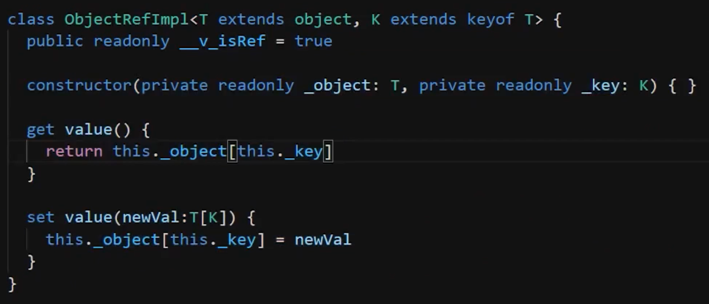

这里的newVal需要被T[K]约束，是因为值是不能随意被赋值的，比如一个对象obj中的name，规定就是一个string类型，要是不做type obj[name] 的约束，然后比如赋值obj[name] = 123，岂不是编译报错了。

这个设计没看懂为什么要这么做，比如我们要获取或者设置某个对象的某个属性,需要如下操作，为啥不直接 objt.name 获取值，为啥不objt.name = 'wang2'不也能被ts编译检测吗？上面截图设计思路来自于vue3，等看完源码再来解答这个问题

```ts
type TObj = {name: string, age: number}
const obj:TObj = {name: 'wang', age: 123}
const objt = new ObjectRefImpl<TObj, 'name'>(obj, 'name')
const obj_name = objt.get();
objt.set('wang2')
```

### 场景3：

```ts
function cross<T extends object, U extends object>(objOne: T, objTwo: U): T & U
function cross<T extends object, U extends object, V extends object>
  (objOne: T, objTwo: U, objThree: V): T & U & V
function cross<T extends object, U extends object, V extends object>
  (objOne: T, objTwo: U, objThree?: V) {
  let obj = {}
  let combine = obj as T & U
  Object.keys(objOne).forEach((key) => {
    if (!combine.hasOwnProperty(key)) {
      console.log(objOne[key])
    }
  })
}
```

这里的第十行会报警告：

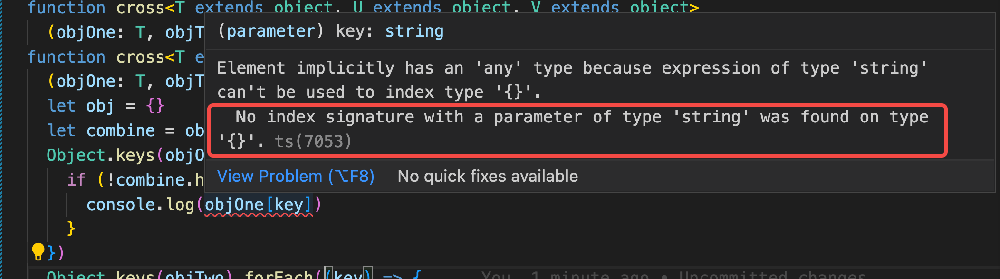

这里报警告的原因是key被推断成了strng：

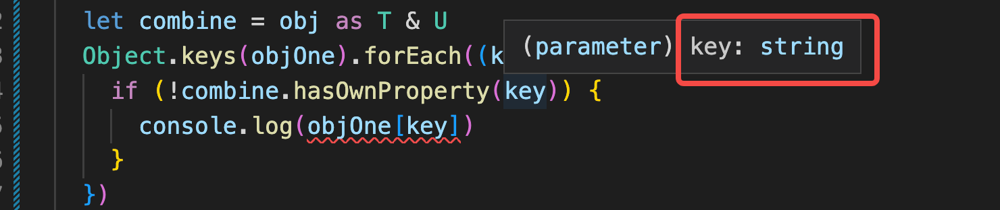

所以我们要想办法让key被推断成ojbOne的key才行，解决办法：

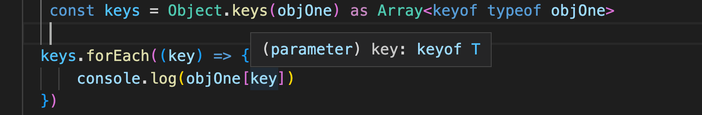

当我们尝试给combine赋值，也会遇到警告，一般我们会这么去解决： as any

```ts
  let obj = {}
  let combine = obj as T & U
   const keys = Object.keys(objOne) as Array<keyof typeof objOne>
  keys.forEach((key) => {
      (combine as any)[key] = objOne[key]
  })
```

这里赋值成功后，并不影响后面对combine的类型的正确使用：

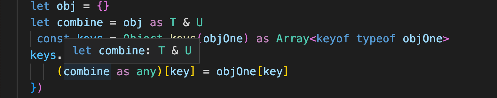

当然也可以这么来写：

```ts
(combine as any) = {...objOne}
```

### 场景4：

```ts
const someObj:ObjectType = data;
const field = 'username';

// This gives an error
const temp = someObj[field];

// Solution 1: When the type of the object is known
const temp = someObj[field as keyof ObjectType]

// Solution 2: When the type of the object is not known
const temp = someObj[field as keyof typeof someObj]
```

## 7、泛型类：

demo:(相关优势写到demo注释中了)

大前端/typescript/教程2/demo/src/index.ts

## 8、泛型函数

范型函数的输入或者输出是泛型，那么首先函数要被写成泛型，如下，getMetric要被T修饰。

```ts
function getMetric<T>(tp: T): T {
// function getMetric<T extends object>(tp: T): T { // 也可以做约束
  return tp
}

const a = 1;
// const b = getMetric(a); // 1 推导
const b = getMetric<number>(a); // 1 显示约束
const aa = 'wang2';
// const bb = getMetric(aa); // wang2
const bb = getMetric<string>(aa); // wang2

const S = function<T>(attr: T): T {
  return attr
}
S<string>('3')

```

## 9、综合demo：

大前端/typescript/教程2/demo/src/fn-chongzai.ts

demo解释sort函数的重载行为：

### 第一个关键点：

```ts
// 这两句话为啥不合并成一句话：
function sort(data: string) : string
function sort<T>(data: T) : T
// 比如：function sort<T>(data: T) : T 兼并了function sort(data: string) : string，只写一句 function sort<T>(data: T) : T 
```

写两句调用是这个效果：优先找 functionsort(data: string) : string

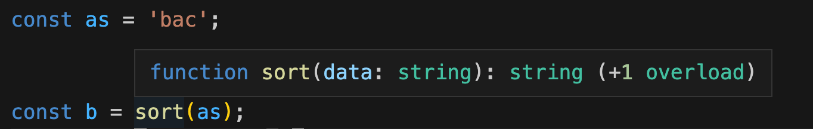

如果写成一句：

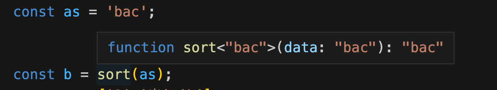

可见并不是我们预期的行为，我们希望推断出的是输入string，输出string，除非调用的时候显示指定：

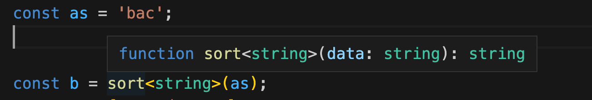

### 第二个关键点：

各种调用，推断效果如下：

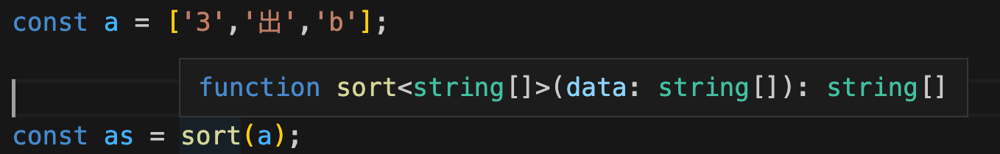

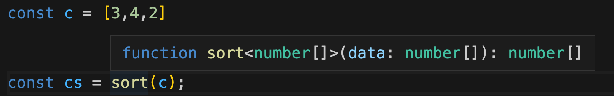

第三种场景：

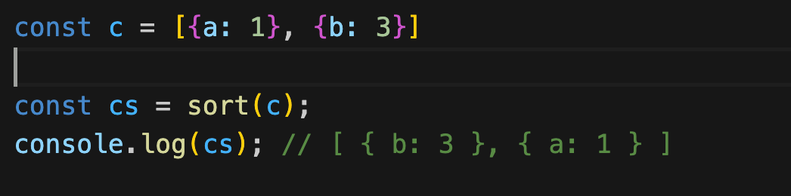

我们的方法其实不支持数组对象的，这里却没有拦截提示，等后面学了泛型工具再来做约束

 以下是vue3对泛型使用的一个案例：

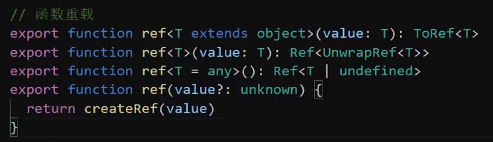

## 10、泛型工厂

当我们想把一个类作为参数传递给一个函数的时候，我们怎么进行约束呢？

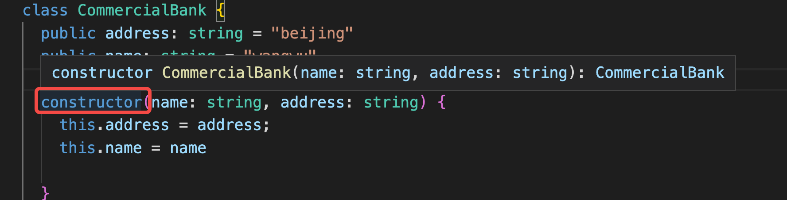

首先，我们能看到，当我们想把一个class实例化的时候，就会调用constructor，而这个constructor他默认的ts约束如同上面的弹窗

下面我们写个demo：

```ts
class CommercialBank {
  public address: string = "beijing"
  public name: string = "wangwu"
  constructor(name: string, address: string) {
    this.address = address;
    this.name = name
  }
}
type CommercialBankType = new (...arg: any) => CommercialBank
interface ICommercialBankType {
  new(...args: any): CommercialBank
}
// 对变量进行约束
type ConstructorTp = new (...arg: any) => any
let Constructor: ConstructorTp = CommercialBank
let con2 = new Constructor("广大银行", "万绿园");

// 对函数参数进行约束
type ConstructorType = new (...arg: any) => any
// const getName = function(Cls: CommercialBankType){ // type写法
// const getName = function(Cls: {new(...args: any): CommercialBank}){ // interface 写法
const getName = function(Cls: ICommercialBankType){ // interface 写法
  const Bank = new Cls('ha','4');
  console.log(Bank.address)
}
getName(CommercialBank); // 4


// 对泛型工厂函数进行约束
function createInstanceFactor<T>(Constructor: { new(...arg: any): T }):T {
  console.log(Constructor.name + "被创建对象");
  return new Constructor("广大银行", "万绿园");
}
let con3 = createInstanceFactor<CommercialBank>(CommercialBank)
con3.name;

// 对装饰器的约束
// 我们一般可以这么写：
function Controller(rootPath: string) {
  return function <T>(targetClass: { new(...args: any[]): T }) {}
}
// 我们对上面的约束进行优化：
type MyClassDecorator = <T>(targetClass: { new(...args: any[]): T }) => any // 这个返回可以是any，T，void，看具体情况
function Controller2(rootPath: string): MyClassDecorator {
  return function (targetClass) {}
}
```

# 2、交叉联合类型

```ts
//定义：将多个类型合并【多个类型属性和方法的并集】成的类型就是交叉类型。
type objtype1 = { username: string, age: number }
type objtype2 = { custname: string, phone: number, age: number }
type objtype3 = { address: string }

let first: objtype1 = { username: "wangwu", age: 23 }
let second: objtype2 = { custname: "lisi", phone: 111, age: 23 }

// 定义：将多个类型合并【多个类型属性和方法的并集】成的类型就是交叉类型。
// 交叉必须包含全部
let jiaochatype: objtype1 & objtype2 & objtype3 = {
  username: "wangwu", age: 23, custname: "lisi", phone: 111, address: "shanghai"
}
// jiaochatype. 会提示所有（objtype1 & objtype2 & objtype3）的属性和方法


// 联合：objtype1或者objtype2中的一种（只要满足其中一种就行）
// ok
let uniontype: objtype1 | objtype2 = {
  username: "wangwu", age: 23, custname: "lisi", phone: 111
}
// uniontype. 只会提示共有的（这里只提示age）
// ok
let uniontype2: objtype1 | objtype2 = {
  username: "wangwu", age: 23, custname: "lisi"
}
// 不ok
let uniontype3: objtype1 | objtype2 = {
  username: "wangwu", age: 23, custname: "lisi", hah: 4
}

```

# 3、infer

案例：

```ts
class A {
  constructor(public age: string) {}
  name() {

  }
  getAge(){
    console.log(this.age)
  }
}

const a1:new (age:string) => A = A;
const aa1 = new a1('12');

const a2:typeof A = A;
const aa2 = new a2('23');

// const a3:A = A;
// const aa3 = new a3('332');

type Tconstructor<T> = new (...args:any[]) => T;
// const a4: Tconstructor<typeof A> = A;
// const aa4 = new a4('444'); // 不太好，age的提示丢失
// aa4.getAge()

const a5:Tconstructor<A> = A;
const aa5 = new a5('555');
aa5.getAge()
// 上面20-27这个案例有点懵，不知道传递 tpye A 和 A的区别

// 案例
class Test{
  public name: string;
  constructor(name:string) {
    this.name = name
  }
  getName() {
    console.log('12' + this.name)
  }
}
function createInstance<T>(constructor: Tconstructor<T>, ...args: any[]) {
  return new constructor(...args)
}
createInstance<Test>(Test, 'hh').getName() // 显示生命
createInstance(Test, 'hh').getName() // 隐式推导
// 但是上面两种都没办法解决参数类型，个数的提示，这里就需要infer了

// infer：结合extends使用，因为我们要先通过extends拿到类型，才能拿到类型上的参数，比如构造器上的入参
type Tconstructor2<T> = T extends new (...args: any[]) => any ? number : never; // 只能是写死的输出
// 我们想拿到args的类型：
type Tconstructor3<T> = T extends new (...args: infer P) => any ? P : never; // 动态获取args的类型，用P来表达

let a6 : Tconstructor3<typeof A>; // a6的类型：[age: string] 元祖
// typeof A就是构造函数，他等价于如下：
let a7 : Tconstructor3<new (age:string) => A>; // a8的类型：[age: string] 元祖
let a8 : Tconstructor3<A>; // a8的类型：never
// 这里传递了A得到一个never，但是其实我们希望Tconstructor3在被使用的时候，就只能传递对应的构造器进去：
type Tconstructor4<T extends new (...args:any[]) => any> = T extends new (...args: infer P) => any ? P : never; // 动态获取args的类型，用P来表达
// let a9 : Tconstructor4<A>; // 就会报错：Type 'A' provides no match for the signature 'new (...args: any[]): any'.

// 解决上面提到的参数类型，个数的问题
// function createInstance2<T, CP extends new (...args: any[]) => any>(constructor: Tconstructor<T>, ...args: CP) {
// function createInstance2<T, CP>(constructor: Tconstructor<T>, ...args: Tconstructor4<CP>) { // 报错：Type 'CP' does not satisfy the constraint 'new (...args: any[]) => any'.【翻译：类型'CP'不满足约束'new(…Args: any[]) => any'。】
function createInstance2<T, CP extends new (...args: any[]) => any>(constructor: Tconstructor<T>, ...args: Tconstructor4<CP>) {
  return new constructor(...args)
}
// createInstance2<Test, typeof Test>(Test, 34).getName() // 报错： Argument of type 'number' is not assignable to parameter of type 'string'.
// createInstance2<Test, typeof Test>(Test, '3', 4).getName() // 报错： Expected 2 arguments, but got 3.
createInstance2<Test, typeof Test>(Test, '3').getName()  // ok
```

别人对infer的理解：

https://juejin.cn/post/6844904170353328135

https://juejin.cn/post/6844904146877808653

https://juejin.cn/post/6999441997236797470

# 4、Extract和Exclude

Extract一个是取交集，Exclude是取差集

Extract的本质就是：当我们的前后都是联合类型的时候，比如：Extract `<string | number, string | number | boolean>,其本质是把前面的string | number`拆开，分别用string extends `string | number | boolean` 以及 `number`  extends  `string | number | boolean,如果两个都成立，就返回string | number,如果不成立就返回never`

可以简单的理解成：type Extract `<T,U>` = T extends U ? T : never;但是其实还是不太一样的

案例：改造之前的cross重载函数：

```ts
function cross<T,U>(objOne: Extract<T, object>, objTwo: Extract<U, object>): T & U
function cross<T,U,V>(objOne: Extract<T, object>, objTwo: Extract<U, object>, objThree: Extract<V, object>): T & U & V
function cross<T,U,V>(objOne: Extract<T, object>, objTwo: Extract<U, object>, objThree?: Extract<V, object>) {
  let obj = {}
  let combine = obj as T & U
  Object.keys(objOne).forEach((key) => {
    if (!(combine as any).hasOwnProperty(key)) {
      console.log(objOne[key])
    }
  })
}

// 更精简的写法：
type CrossType<T> = Extract<T, object>;
function cross<T,U>(objOne: CrossType<T>, objTwo: CrossType<U>): T & U
function cross<T,U,V>(objOne: CrossType<T>, objTwo: CrossType<U>, objThree: CrossType<V>): T & U & V
function cross<T,U,V>(objOne: CrossType<T>, objTwo: CrossType<U>, objThree?: CrossType<V>) {
  let obj = {}
  let combine = obj as T & U
  Object.keys(objOne).forEach((key) => {
    if (!(combine as any).hasOwnProperty(key)) {
      console.log(objOne[key])
    }
  })
}

```

Exclude的本质：当我们的前后都是联合类型的时候，比如：Extract `<string | Funtion, string | number | boolean | Array>,其本质是把前面的string | Function`拆开，分别用string extends `string | number | boolean | Array` 以及 Funtion   extends  `string | number | boolean | Array, 把不成立的内容选出来最后一起返回，这里就返回 Function`

可以简单的理解成：type Extract `<T,U>` = T extends U ? T : U;但是其实还是不太一样的type

案例：

```ts
type func1 = (one: number, two: string) => string
type func2 = (one: number) => string

// 兼容前提条件是个数可以少，类型必须匹配
type beginType1 = func1 extends func2 ? func1 : never// never
type beginType2 = func2 extends func1 ? func2 : never// type beginType2 = (one: number) => string

type extractType1 = Extract<func1, func2> //never
type extractType2 = Extract<func2, func1> //= (one: number) => string

let fn:func1 = function(a:string, b:string):string {return '123'}//ok
let fn2:func1 = (a:string, b:string):string => {return '123'} //ok
let fn3:func1 = (a:string):string => {return '123'} // ok 参数少的实现的可以被参数多的定义所兼容
// 第三行这里的【兼容】有时候觉得怪怪的，明明两个入参，第二个参数是必填，却可以用只有一个参数的函数去实现，那规定的第二个参数岂不是没作用？
// 对于这种问题，我的理解是TS认为这种丢失并不会造成js的异常，所以可以兼容，以下一个例子拿来佐证：
function testFn (fn: func1) {fn(3,'4')}
testFn(function(one:number):string {
  return one + 'ab'
})// 这个时候运营阶段，'4'并不会被接收，所以并不会出错，所以以上的兼容就有合理了
```

# 5、Record

## 1、复习K extends keyof T

```ts
type Customer = {
  custname: string,
  age: number
}

type oneType<T, K> = K extends keyof T ? K : never

// 取type中的key
type oneTypeResult = oneType<Customer, "custname"> // 输出custname类型
type oneTwoTypeResult = oneType<Customer, "xx"> // 输出never

// 取type中的value
type a = {
  j: number;
}
type d = a['j'] // number

type twoType<T, K> = K extends keyof T ? T[K] : never
type twoTypeResult = twoType<Customer, "age">// 输出number
```

## 2、K extends keyof any

```ts
type Worker = {
  custname: string
}
type Customer = {
  custname: string,
  age: number
}

// 因为在js中，对象里面的key只能是string | number | symbol
// 所以 type oneAnyType = keyof any 等同于 type oneAnyType=string | number | symbol
type oneType<K> = K extends keyof any ? K : never

type oneResultType0 = oneType<string> //string

type oneResultType = oneType<Worker> //never

let count: number = 3;
type twoResultType = oneType<typeof count> // number

let strName: string = "abc";
type threeResultType = oneType<typeof strName>// string

type fourResultType = oneType<3> // 3被当成值类型 是一个类型 返回3也是一个值类型
type kk = 3 extends number ? '1' : '3' // '1' 因为3属于number

let stuSymid: symbol = Symbol("stuid")
type symType = typeof stuSymid //symbol
type fiveResultType = oneType<symbol> //symbol
```

## 3、K in T

场景：

```ts
type Record<K extends keyof any, T> = {
  [P in K]: T
}
```

这里的P in K可以理解成比如：P in string，P就是任意的string， P in number，P就是数字

实际应用：

```ts
const Stu = {
  like: 'book',
  eat: 'nothing'
}

type Customer = {
  custname: string,
  age: number
  phone: string
}

//场景1:
// 这里K取值范围：string | number | symbol
type Record<K extends keyof any, T> = {
  [P in "username" | "age"]: T
}

// 下面resultRecord就等同于：
// type resultRecord = {
//   username: Customer;
//   age: Customer;
// }
type resultRecord = Record<string, Customer>

// 场景2:
type Record2<K extends keyof any, T> = {
  [P in K]: T
}
// 下面resultRecord2就等同于：
// type resultRecord2 = {
//   [x: string]: Customer;
// }
type resultRecord2 = Record2<string, Customer>


// 场景3
type Record3<K extends keyof any, T> = {
  [P in K]: T
}
// 下面resultRecord3就等同于：
// type resultRecord3 = {
//   like: Customer;
//   eat: Customer;
// }
type resultRecord3 = Record3<keyof typeof Stu, Customer>
// 上面的keyof typeof Stu就是字符串的联合类型："like" | "eat",及时是TS内置的Record也是可以使用的
```

## 4、K in keyof T

```ts
const Stu = {
  like: 'book',
  eat: 'nothing'
}

type Customer = {
  custname: string,
  age: number
  phone: string
}

//场景1:
// 这里K取值范围：string | number | symbol
type Record2<K extends object, T> = {
  [P in keyof K]: T
}
const TStu = typeof Stu // 等同于： const TStu: "string" | "number" | "bigint" | "boolean" | "symbol" | "undefined" | "object" | "function"
// Ojb等同于：
// type Ojb = {
//   like: Customer;
//   eat: Customer;
// }
type Ojb = Record2<typeof Stu, Customer>

// 内置的Record其实不是不支持上面Record2<K extends object, T>的写法的，只支持Record<K extends keyof any, T>
// 当k被约束成string | number | symbol的时候，前面已经讲解过，这里不再赘述，这里提到一个特殊情况，当K为number的时候：
type A = Record<number, Customer>
const u:A = [{custname: '23', age: 3, phone: '23'}] // u其实是一个数组类型，因为number可以看作数组索引

```

我们看下如下定义：

```ts
type Record<T> = {
  [P in keyof any]: T
}
```

结果：

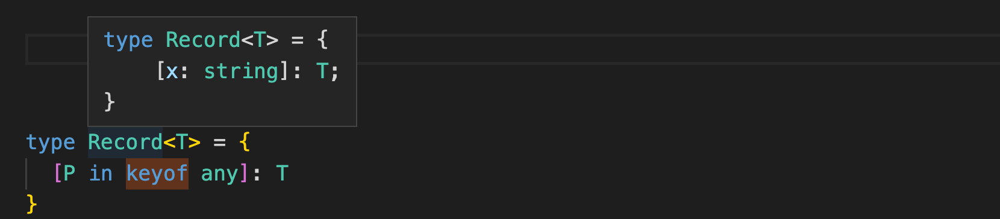

我们前面已经知道keyof any，其实就是string | number | symbol，那么这里为什么只有[x:string]呢，原因是[x:string]已经包含了[x:number]和[x:symbol]，所以ts帮我们进行了合并。

## 5、Record实现数据扁平化

```ts
// 定义Goods接口
const goodSymid = Symbol("goodid")
interface Goods {
  [goodSymid]: number
  name: string
  price: number
}

// 模拟后台取出来的商品数据列表
const goodsList: Goods[] = [
  {
    [goodSymid]: 101,
    "name": "苹果",
    "price": 9
  },
  {
    [goodSymid]: 102,
    "name": "香蕉",
    "price": 3
  },
  {
    [goodSymid]: 103,
    "name": "橘子",
    "price": 3
  }
]

// 期望结果：
// goodRecord: {
//   '101': { name: '苹果', price: 9, [Symbol(goodid)]: 101 },
//   '102': { name: '香蕉', price: 3, [Symbol(goodid)]: 102 },
//   '103': { name: '橘子', price: 3, [Symbol(goodid)]: 103 } 
// }

type resultGoodsType = Record<number, Goods>
let goodRecord: Record<number, Goods> = {}
goodsList.forEach((goods) => {
  goodRecord[goods[goodSymid]] = goods;
})

```

上面的案例，索引是goodid，那我们是否可以让name和price也变成key作为索引呢？比如：

```ts
goodRecord[103] = good;
goodRecord["香蕉"] = good
goodRecord[good[goodSymid]] = good
```

我们想实现这个，其实很容易，这么定义就ok了：

```ts
type Record<T> = {
  [P in keyof T]: T
}
let goodRecord: Record<Goods> = {} // 但是这里初始化默认值就会报错，因为空{}，不符合type的约束，所以一般我们是这么来约束：
type Record<T> = {
  [P in keyof any]: T
}
// 但是这样key又可以是任意string了，唉……
```

## 6、object、Map、Record区别

object特点：

```ts
const a:object = {name: 1} // a如果不写object，就会被推断成{name: 1}，写了就肯定是object类型
a['g'] = 3 // 会报错，因为a是ojbect类型，就会去object找g属性，因为没有所以编译报错
const k:any = a['name'] // 一样报错，ojbect上没有name属性
```

map特点：

Map是js数据类型，一旦使用就需要开辟空间，而Record是TS内置的数据类型约束，他编译成js后就消失了，不占用运行时内存。

# 6、Pick，Omit：

```ts
// Pick本质：
type Pick<T, K extends keyof T> = { [P in K]: T[P] }
// Omit本质：
type Omit<T, K extends keyof T> = Pick<T, Exclude<keyof T, K>>

interface Todo {
  title: string
  completed: boolean
  description: string
}

type excludeType = Exclude<keyof Todo, 'description'>
// excludeType结果等于：type excludeType = "title" | "completed"
type omitYType = Omit<Todo, 'description'>
// omitYType结果等于：
// type omitYType = {
//   title: string;
//   completed: boolean;
// }
type pickType = Pick<Todo, 'description'>
// pickType结果等于：
// type pickType = {
//   description: string;
// }
```
