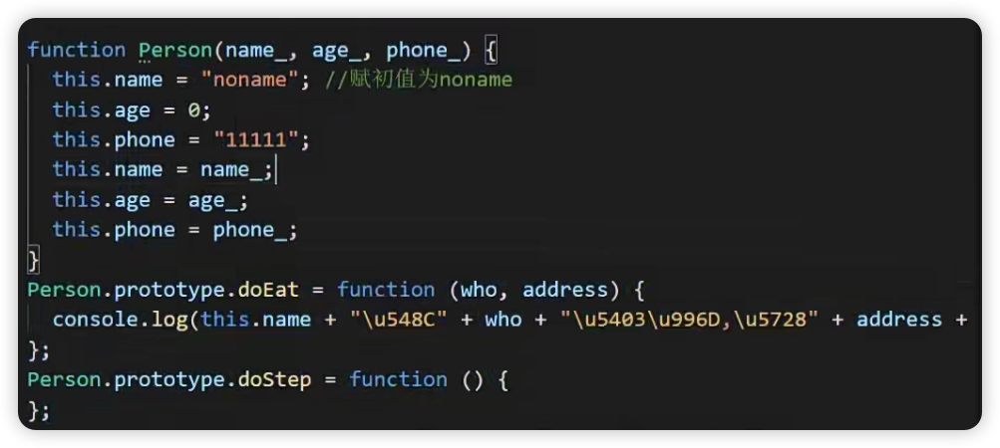

// wanglong的总结：

# 原型的用途：

注意fn在class和对象上直接写的fn都挂在在哪里了

```js
function QQUsers (QQNo_, QQAge_, QQMark_) {
  this.QQNo = QQNo_;//QQ号
  this.QQAge = QQAge_;//Q龄
  this.QQMark = QQMark_;//QQ标签
  //引用对象类型=引用类型=对象类型=引用数据类型 
  // 数组也是一种引用数据类型 
  this.commonfriends = ['骑驴看海', '大漠上的英雄', '坚实的果子', '小草']//共同好友
  // 方法也是一种引用数据类型 
  this.show = function () {
    console.log(`QQ号:${this.QQNo},QQ龄:${this.QQAge},QQ标注:${this.QQMark}`)
    console.log(`共同的好友是:${this.commonfriends}`);
  }
}
// 对象也叫实例(instance)
// QQZhangSan叫做对象变量 对象是等号右边通过new出来的一个实例 而且是运行期间才在堆中开辟对象的内存空间
let QQZhangSan = new QQUsers("37834522", 15, "王阳明传人")
let QQLisi = new QQUsers("30424232", 10, "袁隆平的徒弟")
//let QQLiuwu = new QQUsers("刘武", 12, "飞起来的鸭子")

QQZhangSan.show();
QQLisi.show();
//QQLiuwu.show();

```

// 这里案例说明一个问题，数组（commonfriends）和函数（show）都被反复创建了多次，应该放到原型上去

// 所以可以间接的说明一个问题，原型存在的意义，就是拿来解决上面这个问题的

// 打印这个class，你会发现函数show、construrtor其实是放到了__proto__上面的，也就是原型上，并不是直接在当前实例上，这样才能做到共用一个引用类型

```js
class P {
  a = 4;
  test: string[] = [];
  haha: string[] = ['d'];
  constructor(ss: string) {
    this.test.push(ss)
  }
  getName() {
    console.log(44)
  }
}
const kk = { a: 3, getName: () => { console.log(2) } }
console.log('pp', new P('4'))
console.log('kk', kk)
```


可以看出class和直接定义的对象，在放置fn的时候，放的地方是不一样的，因为对象kk并不需要new，也就是它就是一个，所以没必要把fn放到原型上去，而数组在class上是没new一次就新建一个

编译出来的es5效果如下：




# TS4后class简写：

以前赋值初始化：

```js
class P {
  a = 4;
  public age: string | undefined;
  public arr!: string[] // 不写undefined就用！断言
  public num!: number;//如果后面涉及num * 3，num会被断言成number，如果没有初始化num，就会得到NaN，所以！只能保证ts编译通过，js运算还是得小心
  constructor(age: string, arr: string[]) {
    this.age = age;
    this.arr = arr
  }
}
```

现在：

```js
class P {
  a = 4;
  constructor(public age: number, public arr: string[]) {
  }
  getSum() {
    return this.age * 3 // 这里可以直接编译通过
  }
}
console.log('pp', new P(44, ['5']))
```


