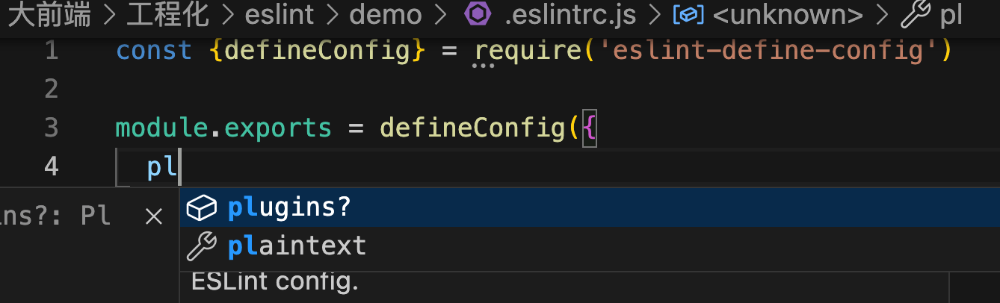

demo：./demo

正常我们对eslintrc文件书写eslint规则，并没有友好的输入提示，可以安装eslint-define-config对输出的对应进行包裹，在编辑的时候就有了友好的提示：

.eslintrc.js:


我们添加eslint-define-config后，就有提示了



```
const {defineConfig} = require('eslint-define-config);
module.exports = defineConfig({})
```

比如我们有一个ts文件正在被编写，就需要添加parser来解析ts：

```
const a:any = '323';
const b = 3;
export default a;

```

配置eslintrc：

```
const {defineConfig} = require('eslint-define-config')

module.exports = defineConfig({
  parser: "@typescript-eslint/parser",
})

```

运行npm run eslint, 发现检测不出来问题，因为目前只是指定来用哪个包来解析，但是解析规则不知道，还需要另外一个包：@typescript-eslint/eslint-plugin， 这个包就是一个【规则合集】的插件，【一条规则就是一个包】，我们把这个插件应用到eslintrc：

```
const {defineConfig} = require('eslint-define-config')

module.exports = defineConfig({
  parser: "@typescript-eslint/parser",
  plugins: ["@typescript-eslint/eslint-plugin"]
})

```

运行npm run eslint：发现还是没有报错，这个是因为我们应用来插件，但是插件的规则是没指定的，我们可以在rules字段中一个个的写，或者叫做覆盖默认规则，demo如下：

```
const {defineConfig} = require('eslint-define-config')

module.exports = defineConfig({
  parser: "@typescript-eslint/parser",
  plugins: ["@typescript-eslint/eslint-plugin"],
  rules: {
    "@typescript-eslint/no-explicit-any": "warn"
  }
})

```

运行后可以看到如下warn提示：


但是一条一条的配置，太多了，所以可以使用推荐的规则：extends字段

```
const {defineConfig} = require('eslint-define-config')

module.exports = defineConfig({
  parser: "@typescript-eslint/parser",
  plugins: ["@typescript-eslint/eslint-plugin"],
  extends: ["plugin:@typescript-eslint/recommended"]
})

```

效果如下：


-
