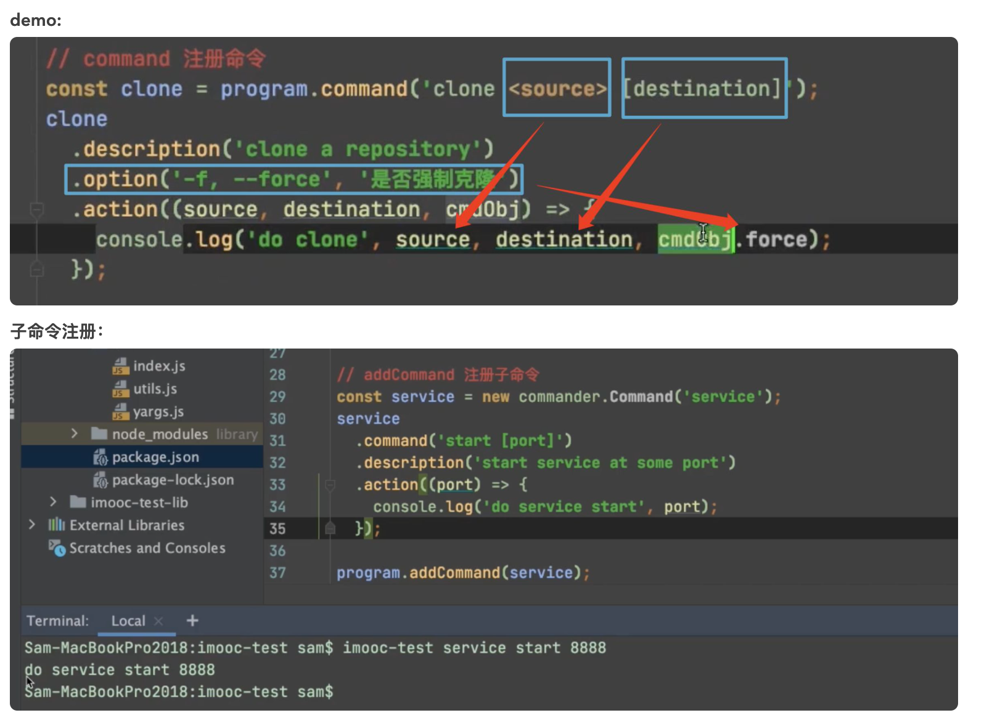

## command基础

## 准备工作

* 安装nodejs
* 安装commander.js，执行 `npm install commander --save`

## version方法

### 作用：定义命令程序的版本号

### 参数说明：

* 版本号<必须>
* 自定义flag<可省略>，默认为 `-V`和 `--version`

### 使用：

#### // index.js const program = require('commander'); program .version('1.0.0') .parse(process.argv); 复制代码* 执行 `node index.js -V` 或者 `node index.js --version`得到版本号。

#### // index.js const program = require('commander'); program .version('1.0.0', '-v, --version') .parse(process.argv); 复制代码* 当自定义flag时，`--version`不能被省略

* 执行 `node index.js -v`或者 `node index.js --version`得到版本号。

## option方法

### 作用：定义命令的选项

### 参数说明：

* 自定义flag<必须>
  * 一长一短的flag，中间可以逗号、竖线或空格隔开
  * flag后面可以跟参数，`<>`定义必需参数，`[]`定义可选参数
* 选项的描述<可省略>：在使用 `-h`或者 `--help`时会显示
* 选项的默认值<可省略>

### 使用

#### // index.js const program = require('commander'); program .version('1.0.0') .option('-a, --add', 'add Something') .option('-u, --update', 'update Something') .option('-r, --remove', 'remove Something') .parse(process.argv); console.log('You choose: '); if (program.add) console.log(' add Something'); if (program.update) console.log(' update Something'); if (program.remove) console.log(' remove Something'); 复制代码* 短flag使用 `-`，长flag使用 `--`

* `program.XXX`可以得到输入的选项
* 执行 `node index.js -a`或者 `node index.js --add`会打印**You choose: add Something**

#### // index.js const program = require('commander'); program .version('1.0.0') .option('--add-file', 'add a file') .parse(process.argv); if (program.addFile) console.log('add a file') 复制代码* 当选项为多单词形式时，使用驼峰形式得到输入项

* 执行 `node index.js --add-file`会打印**add a file**

#### --no形式开头的选项，代表后面紧跟单词的相反面

```
// index.js
const program = require('commander');
program
	.version('1.0.0')
	.option('--no-add', 'not add a file')
  .parse(process.argv);
 
if (program.add) console.log('add a file')
else console.log('not add a file')
复制代码
```

* 执行 `node index.js --no-add`会打印**not add a file**

#### // index.js const program = require('commander'); program .version('1.0.0') .option('-a, --add `<fileName>`', 'add a file') .parse(process.argv); console.log('add a file named: ' + program.add) 复制代码* 执行 `node index.js -a demo.js`会打印**add a file named: demo.js**

## command方法

### 作用：自定义命令

### 参数说明：

* 自定义命令名称
  * 名称<必须>
  * 命令参数<可选>：
    * `<>`和 `[]`定义参数
    * 命令的最后一个参数可以是可变的，需要在数组后面加入 ... 标志；在命令后面传入的参数会
* 命令描述<可省略>
* 配置选项<可省略>：可配置noHelp、isDefault等

### 使用

```
const program = require('commander');
program
	.version('1.0.0')
	.command('my-cli <path>')
	.option('-a, --add <fileName>', 'add a file')
	.option('-u, --update <fileName>', 'update a file')
	.option('-r, --remove <fileName>', 'remove a file')
	.action(function(path, cmd) {
		console.log(path)
		console.log(cmd.add)
	})
 
program.parse(process.argv);
复制代码
```

* 使用 `action`后会开启输入的选项校验，若输入了未定义的选项，则抛出错误
* 执行 `node index.js my-cli C -a demo.js`会打印**C demo.js**



## description方法

### 作用：命令的描述性语句

### 参数说明

* 命令的描述

### 使用

```
// index.js
const program = require('commander');
program
	.version('1.0.0')
	.description('It is my cli')
  .parse(process.argv);
复制代码
```

## action方法

### 作用：定义命令的回调函数

### 参数说明：

* 回调函数

## parse方法

### 作用：用于解析process.argv，设置options以及触发commands

### 参数说明：

* process.argv
