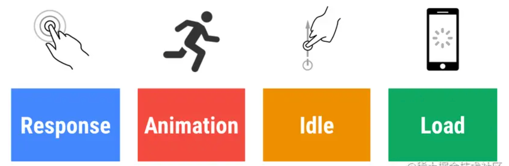
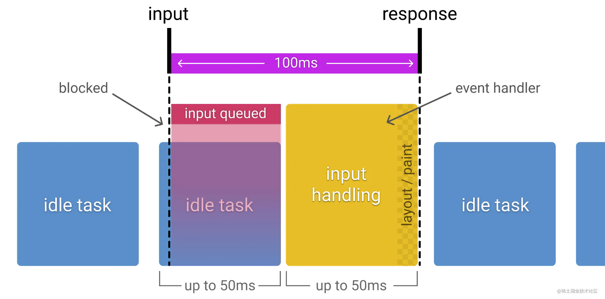

来源：https://juejin.cn/post/7042953849497190407


> 背景：
> 关于web的性能，有人用 [Speed Index](https://link.juejin.cn?target=https%253A%2F%2Fsites.google.com%2Fa%2Fwebpagetest.org%2Fdocs%2Fusing-webpagetest%2Fmetrics%2Fspeed-index "https%3A//sites.google.com/a/webpagetest.org/docs/using-webpagetest/metrics/speed-index") 作为衡量的标准；有人以页面首次绘制时间为准；仍有人使用 body.onload 或 DOMContentLoaded 又或者别的事件为准。衡量的标准并不统一。还有其他衡量性能的方法，比如用 JavaScript 基准（JavaScript benchmark）；比如60 FPS。缺乏统一性、，Rail模型就是提供了一个明确的指引告诉开发者，`用户的眼里` “性能”意味着什么，毕竟用户才是我们最终服务的对象。

##### RAIL模型是Chrome团队于2020.6发布的一种以 `用户为中心`的性能模型。 它提供了一种考虑性能的结构。该模型将用户体验分解为关键操作（例如，点击、滚动、加载），并帮助您为每个操作定义性能目标。

RAIL 代表 Web 应用程序生命周期的四个不同方面：`响应(R)`、`动画(A)`、`空闲时间(I)`和 `加载(L)`。
用户对这些上下文中的每一个都有不同的性能期望，所以这里的性能目标是根据上下文和[【用户如何感知延迟的 UX 研究】](https://link.juejin.cn?target=https%3A%2F%2Fwww.nngroup.com%2Farticles%2Fresponse-times-3-important-limits%2F "https://www.nngroup.com/articles/response-times-3-important-limits/")来定义的。



> 据[【用户如何感知延迟的 UX 研究】](https://link.juejin.cn?target=https%3A%2F%2Fwww.nngroup.com%2Farticles%2Fresponse-times-3-important-limits%2F "https://www.nngroup.com/articles/response-times-3-important-limits/")得出： 在优化 Web 和应用程序性能时，需要牢记 `3`个主要时间限制（由人类感知能力决定）。具体如下:
>
> * **0.1 秒**大约是让用户感觉到系统正在**立即做出反应**的极限，这意味着除了显示结果之外不需要任何特殊的反馈。
> * **1.0 秒**大约是**用户思想流**保持不间断的极限，即使用户会注意到延迟。通常情况下，延迟大于 0.1 秒但小于 1.0 秒时不需要特殊反馈，但用户确实失去了直接对数据进行操作的感觉。
> * **10 秒**大约是**将用户的注意力**集中在对话上的限制。对于较长的延迟，用户将希望在等待计算机完成的同时执行其他任务，因此应向他们提供反馈，指示计算机预计何时完成。如果响应时间可能变化很大，则延迟期间的反馈尤其重要，因为用户将不知道会发生什么。
>
> 可能说的有点晦涩，其实简单点说，就是：
>
> * **0.1 秒： 限制用户感觉他们[**直接操作**](https://link.juejin.cn?target=https%3A%2F%2Fwww.nngroup.com%2Farticles%2Fdirect-manipulation%2F "https://www.nngroup.com/articles/direct-manipulation/")UI 中的对象。** 例如，这是从用户选择表格中的一列到该列应突出显示或以其他方式给出其被选中的反馈的时间限制。理想情况下，这也是对列进行排序的响应时间——如果是这样，用户会觉得 `他们`正在对表进行排序。（与感觉他们正在 `命令`计算机为他们进行*排序*相反。）
> * **1 秒： 限制用户感觉他们可以 `自由地导航`命令空间而不必过度等待计算机。0.2-1.0 秒的延迟确实意味着用户会注意到延迟并因此感觉计算机正在执行命令，而不是让命令成为用户操作的直接影响。** 示例：如果不能在 0.1 秒内完成按所选列对表格进行排序，则肯定必须在 1 秒内完成，否则用户会感觉 UI 呆滞，执行时会失去“流动”感他们的任务。对于超过 1 秒的延迟，向用户表明计算机正在处理问题，例如通过更改光标的形状。
> * **10 秒：限制用户 `将注意力集中`在任务上。** 任何低于 10 秒的时间都需要一个完成百分比指示器以及一个明确的路标，以便用户中断操作。假设用户在延迟超过 10 秒后返回 UI 时需要重新定位自己。超过 10 秒的延迟仅在用户工作的自然中断期间是可接受的，例如在切换任务时。

以上是[【用户如何感知延迟的 UX 研究】](https://link.juejin.cn?target=https%3A%2F%2Fwww.nngroup.com%2Farticles%2Fresponse-times-3-important-limits%2F "https://www.nngroup.com/articles/response-times-3-important-limits/")提出的基于人类感知的web优化标准。

回到rail模型上，他将时间更为细化，提出：

| 时间             | 用户对性能延迟的看法                                                                                                                                                                                 |
| ---------------- | ---------------------------------------------------------------------------------------------------------------------------------------------------------------------------------------------------- |
| 0 至 16 毫秒     | 用户非常擅长跟踪运动，并且他们不喜欢动画不流畅的情况。只要每秒渲染 60 个新帧，他们就会认为动画很流畅。这是每帧 16 毫秒，包括浏览器将新帧绘制到屏幕所需的时间，让应用程序生成一个帧大约需要 10 毫秒。 |
| 0 到 100 毫秒    | 在此时间窗口内响应用户操作，用户感觉结果是立竿见影的。再不下去，行动和反应之间的联系就被打破了。                                                                                                     |
| 100 到 1000 毫秒 | 在这个窗口中，事物感觉是自然而连续的任务进展的一部分。对于网络上的大多数用户来说，加载页面或更改视图是一项任务。                                                                                     |
| 1000 毫秒或更多  | 超过 1000 毫秒（1 秒），用户就会失去对他们正在执行的任务的关注。                                                                                                                                     |
| 10000 毫秒或更多 | 超过 10000 毫秒（10 秒），用户会感到沮丧并可能放弃任务。他们以后可能会也可能不会回来。                                                                                                               |

> 注：用户感知性能延迟的方式不同，具体取决于网络条件和硬件。例如，通过快速 Wi-Fi 连接在功能强大的台式机上加载站点通常会在 1 秒内发生，并且用户已经习惯了这一点。在 3G 连接速度较慢的移动设备上加载站点需要更多时间，因此移动用户通常更有耐心，在移动设备上在 5 秒内加载是一个更现实的目标。

在 【RAIL模型】 的介绍中，会以**目标**和**指导方针** 梳理需求：

* **目标** 。指与用户体验相关的关键性能指标。例如，点击即可在 100 毫秒内绘画。由于人类的感知相对恒定，这些目标不太可能很快改变。
* **指导方针** 。帮助您实现目标的建议。这些可能特定于当前的硬件和网络连接条件，因此可能会随着时间而改变。

#### Response : 在 50 毫秒内处理事件

 **目标：在 100 毫秒内完成由用户输入发起的转换，让用户感觉交互是即时的。** ：

**指导方针：**

* 事件处理函数尽量保证在50ms内完成，考虑到idle task的情况，事件会排队，等待时间大概在50ms。适用于click，toggle，starting animations等，不适用于drag和scroll；
* 复杂的js计算尽可能放在后台，如web worker，避免对用户输入造成阻塞 ；
* 超过50ms的响应，一定要提供反馈，比如倒计时，进度百分比等；

> 补充：web worker是HTML5则提出的新特性。简单说就是在 `Javascript单线程`执行的基础上，开启一个 `子线程`，进行程序处理，而不影响主线程的执行，当子线程执行完毕之后再回到主线程上，在这个过程中并不影响主线程的执行过程。常用于前端数据加密、数据预读取、页面预渲染、复杂数据处理（多层遍历，查找等）。

##### 50 毫秒还是 100 毫秒？

目标是在 100 毫秒内响应输入，那么为什么我们的预算只有 50 毫秒？这是因为除了输入处理之外，通常还有其他工作要做，并且这些工作占用了可接受的输入响应的部分可用时间。如果应用程序在空闲时间在推荐的 50 毫秒块中执行工作，这意味着如果输入在这些工作块之一期间发生，则它可以排队最多 50 毫秒。考虑到这一点，可以安全地假设只有剩余的 50 毫秒可用于实际输入处理。下图显示了这种效果，该图显示了在空闲任务期间收到的输入如何排队，从而减少了可用的处理时间：



#### Animation：在 10 毫秒内生成一帧

**目标：**

* 产生每一帧的时间不要超过10ms，为了保证浏览器60帧，每一帧的时间在16ms左右，但浏览器需要用6ms来渲染每一帧。
* 旨在视觉上的平滑。用户对帧率变化感知很敏感

**指导方针：**

* 在一些高压点上，比如动画，不要去挑战cpu，尽可能地少做事，如：取offset，设置style等操作。尽可能地保证60帧的体验。
* 有关各种动画优化策略，请参见[渲染性能](https://link.juejin.cn?target=https%3A%2F%2Fdevelopers.google.com%2Fweb%2Ffundamentals%2Fperformance%2Frendering "https://developers.google.com/web/fundamentals/performance/rendering")。

> 注：动画不只是UI的视觉效果，以下行为都属于
>
> 1. 视觉动画，如渐隐渐显，操作间隔，loading等
> 2. 滚动，包含弹性滚动，松开手指后，滚动会持续一段距离
> 3. 拖拽，缩放，经常伴随着用户行为

#### Idle：空闲。指利用好空闲时间

**目标：最大化空闲时间，以增大50ms内响应用户输入的几率**

**指导方针：**

* 用空闲时间来完成一些延后的工作（比如说埋点），如先加载页面可见的部分，然后利用空闲时间加载剩余部分，此处可以使用
* 在空闲时间内执行的任务尽量控制在50ms以内，如果更长的话，会影响input handle的pending时间
* 如果用户在空闲时间任务进行时进行交互，必须以此为最高优先级，并暂停空闲时间的任务

> 这里加一点个人理解：这个 `空闲`不仅包括用户没有操作的时间（这个比较好理解，就不解释了）；也包括浏览器渲染或者处理的空闲时间，比如说[requestIdleCallback API](https://link.juejin.cn?target=https%3A%2F%2Fdeveloper.mozilla.org%2Fen-US%2Fdocs%2FWeb%2FAPI%2FWindow%2FrequestIdleCallback "https://developer.mozilla.org/en-US/docs/Web/API/Window/requestIdleCallback")
>
> 简单介绍一下这个API，这个是属于实验阶段API，使用面还比较狭窄（ie,safari不支持）。`requestIdleCallback` 方法只在一帧末尾有空闲的时候，才会执行回调函数；它很适合处理一些需要在浏览器空闲的时候进行处理的任务，比如：统计上传、数据预加载、模板渲染等。
>
> 以前如果需要处理复杂的逻辑，不进行分片，用户界面很可能就会出现假死状态，任何的交互操作都将无效；这时使用 `setTimeout` 就可以把任务拆分成多个模块，每次只处理一个模块，这样能很大程度上缓解这个问题。但是这种方式具有很强的不确定性，我们不知道这一帧是否空闲，如果已经塞满了一大堆任务，这时在处理模块就不太合适了。因此，在这种情况下，我们也可以使用 `requestIdleCallback` 方法来尽可能高效地利用空闲来处理分片任务
>
> 如果一直没有空闲，`requestIdleCallback` 就只能永远在等待状态吗？当然不是，它的参数除了回调函数之外，还有一个可选的配置对象，可以使用 `timeout` 属性设置超时时间；当到达这个时间，`requestIdleCallback` 的回调就会立即推入事件队列。来看下如何使用：

```scss
// 任务队列
const tasks = [  () => {    console.log("第一个任务");  },  () => {    console.log("第二个任务");  },  () => {    console.log("第三个任务");  },];

// 设置超时时间
const rIC = () => window.requestIdleCallback(runTask, {timeout: 3000})

function work() {
  tasks.shift()();
}

function runTask(deadline) {
  if (
    (
      deadline.timeRemaining() > 0 ||
      deadline.didTimeout
    ) &&
    tasks.length > 0
  ) {
    work();
  }

  if (tasks.length > 0) {
    rIC();
  }
}

rIC();
复制代码
```

#### load： 传输内容到页面可交互的时间不超过5秒

如果页面加载比较慢，用户的交点可能会离开。加载很快的页面，用户平均停留时间会变长，跳出率会更低，也就有更高的广告查看率

**目标：**

* 优化加载速度，可以根据设备、网络等条件。目前，比较好的一个方式是，让你的页面在一个中配的3G网络手机上打开时间不超过5秒
* 对于第二次打开，尽量不超过2秒

**指导方针：**

* 在手机设备上测试加载性能，选用中配的3G网络（400kb/s，400ms RTT），可以使用 [WebPageTest](https://link.juejin.cn?target=https%3A%2F%2Fwww.webpagetest.org%2Feasy "https://www.webpagetest.org/easy") 来测试
* 要注意的是，即使用户的网络是4G，但因为丢包或者网络波动，可能会比预期的更慢
* 禁用渲染阻塞的资源，延后加载 `defer`、`async`等
* 可以采用 [lazy load](https://link.juejin.cn?target=https%3A%2F%2Fweb.dev%2Fnative-lazy-loading%2F "https://web.dev/native-lazy-loading/")、[code-splitting](https://link.juejin.cn?target=https%3A%2F%2Fweb.dev%2Freduce-javascript-payloads-with-code-splitting%2F "https://web.dev/reduce-javascript-payloads-with-code-splitting/")等 [其他优化](https://link.juejin.cn?target=https%3A%2F%2Fweb.dev%2Ffast%2F "https://web.dev/fast/")手段，让第一次加载的资源更少

影响页面加载性能的因素：

* 网络速度和延迟
* 硬件（例如较慢的CPU）
* 缓存
* 二级/三级缓存中的差异
* 解析JavaScript

分析RAIL用的工具
Chrome DevTools（[developers.google.com/web/tools/c…](https://link.juejin.cn?target=https%3A%2F%2Fdevelopers.google.com%2Fweb%2Ftools%2Fchrome-devtools%25EF%25BC%2589 "https://developers.google.com/web/tools/chrome-devtools%EF%BC%89")

Lighthouse（[web.dev/measure/）](https://link.juejin.cn?target=https%3A%2F%2Fweb.dev%2Fmeasure%2F%25EF%25BC%2589 "https://web.dev/measure/%EF%BC%89")

WebPageTest（[webpagetest.org/easy）](https://link.juejin.cn?target=https%3A%2F%2Fwebpagetest.org%2Feasy%25EF%25BC%2589 "https://webpagetest.org/easy%EF%BC%89")

####总结了提升用户在网站的交互体验而不断探索。你需要去理解用户如何感知你的站点，这样才能设置最佳的性能目标

1. 聚焦用户
2. 100ms内响应用户的输入
3. 10ms内产生1帧，在滚动或者动画执行时
4. 最大化主线程的空闲时间
5. 5s内让网页变得可交互
