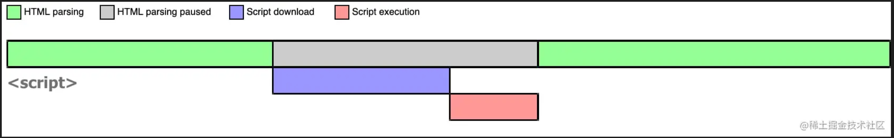
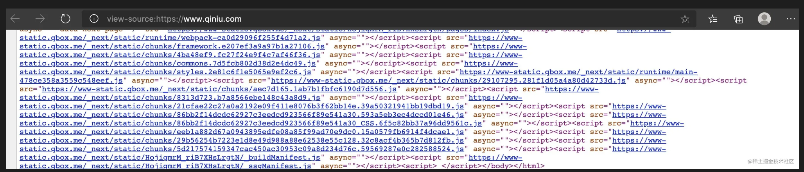
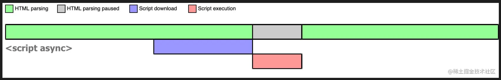
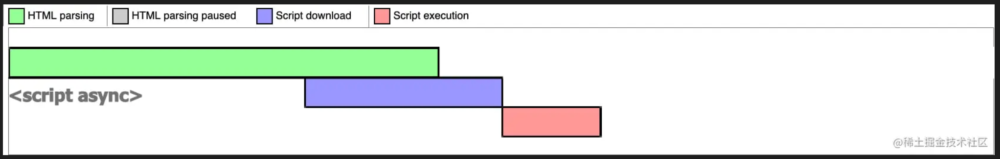
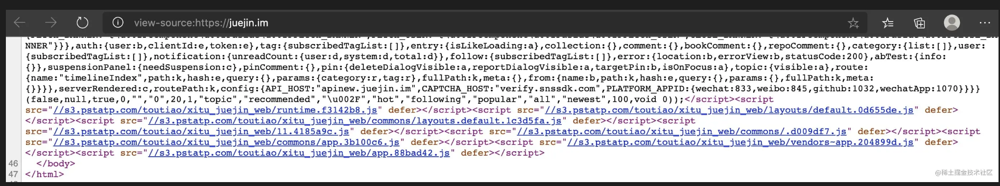
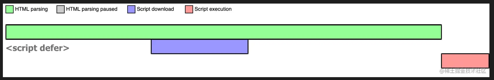

来源：https://juejin.cn/post/6894629999215640583

在 HTML 中会遇到以下三类 script：

* ``
* ``
* ``

那么这三类 script 有什么区别呢？

## script

浏览器在解析 HTML 的时候，如果遇到一个没有任何属性的 script 标签，就会暂停解析，先发送网络请求获取该 JS 脚本的代码内容，然后让 JS 引擎执行该代码，当代码执行完毕后恢复解析。整个过程如下图所示：

可以看到，script 阻塞了浏览器对 HTML 的解析，如果获取 JS 脚本的网络请求迟迟得不到响应，或者 JS 脚本执行时间过长，都会导致白屏，用户看不到页面内容。

## async script

async 表示异步，例如七牛的源码中就有大量的 async 出现

当浏览器遇到带有 async 属性的 script 时，请求该脚本的网络请求是异步的，不会阻塞浏览器解析 HTML，一旦网络请求回来之后，如果此时 HTML 还没有解析完，浏览器会暂停解析，先让 JS 引擎执行代码，执行完毕后再进行解析，图示如下：

当然，如果在 JS 脚本请求回来之前，HTML 已经解析完毕了，那就啥事没有，立即执行 JS 代码，如下图所示：

所以 async 是不可控的，因为执行时间不确定，你如果在异步 JS 脚本中获取某个 DOM 元素，有可能获取到也有可能获取不到。而且如果存在多个 async 的时候，它们之间的执行顺序也不确定，完全依赖于网络传输结果，谁先到执行谁。

## defer script

defer 表示延迟，例如掘金的源码中就有大量的 defer 出现：

当浏览器遇到带有 defer 属性的 script 时，获取该脚本的网络请求也是异步的，不会阻塞浏览器解析 HTML，一旦网络请求回来之后，如果此时 HTML 还没有解析完，浏览器不会暂停解析并执行 JS 代码，而是等待 HTML 解析完毕再执行 JS 代码，图示如下：

如果存在多个 defer script 标签，浏览器（IE9及以下除外）会保证它们按照在 HTML 中出现的顺序执行，不会破坏 JS 脚本之间的依赖关系。

最后，根据上面的分析，不同类型 script 的执行顺序及其是否阻塞解析 HTML 总结如下：

| script 标签        | JS 执行顺序      | 是否阻塞解析 HTML      |
| ------------------ | ---------------- | ---------------------- |
| `<script>`       | 在 HTML 中的顺序 | 阻塞                   |
| `<script async>` | 网络请求返回顺序 | 可能阻塞，也可能不阻塞 |
| `<script defer>` | 在 HTML 中的顺序 | 不阻塞                 |
