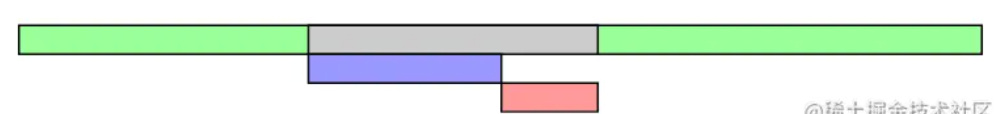
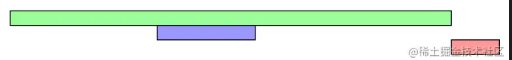
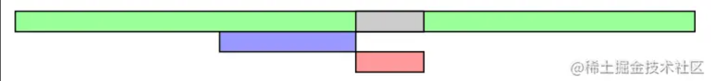

来源：https://juejin.cn/post/6844903745730396174#heading-5


当我们在浏览器地址栏输入一个合法的 `url`时，浏览器首先进行 `DNS`域名解析，拿到服务器IP地址后，浏览器给服务器发送 `GET`请求，等到服务器正常返回后浏览器开始下载并解析 `html`。这里仅总结浏览器解析html的过程。

`html`页面主要由 `dom`、`css`、`javascript`等部分构成，其中 `css`和 `javascript`既能 `内联`也能以 `脚本`的形式引入，当然 `html`中还可能引入 `img`、`iframe`等其他资源。其实所有的这些资源也是以 `dom`标签的形式嵌入在 `html`页面中的，因此本篇总结说的 `html`解析过程就是 `dom`的解析过程。

### 1 `dom`解析过程

整个 `dom`的解析过程是 `顺序`，并且 `渐进式`的。

`顺序`指的是从第一行开始，一行一行依次解析；`渐进式`则指得是浏览器会迫不及待的将解析完成的部分显示出来，如果我们做下面这个实验会发现，在 `断点`处第一个 `div`已经在浏览器渲染出来了：

```xml
<!DOCTYPE html>
<html>
<head>
</head>
<body>
    <div>
        first div
    </div>
    <script>
        debugger
    </script>
    <div>
        second div
    </div>
</body>
</html>
复制代码
```

既然 `dom`是从第一行按顺序解析，那么我们怎么判断 `dom`何时解析完成呢？这个问题应该经常会在面试中问到，比如一般会问：

> `window.onload`和 `DOMContentLoaded`有什么区别？

其实就是想看看是不是明白 `dom树`何时构建完成，这个问题确实很重要，尤其是对于几年前的 `jquery`技术栈来说，因为我们使用 `javascript`操作 `dom`或者给 `dom`绑定事件有个前提条件就是需要 `dom树`已经创建完成。整个 `html`页面的 `dom`解析完成时，`dom树`也就构建完成了。dom树构建完成后 `document`对象会派发事件 `DOMContentLoaded`来通知 `dom树`已构建完成。

`html`从第一行开始解析，遇到 `外联`资源(`外联css`、`外联javascript`、`image`、`iframe`等)就会请求对应资源，那么请求过程是否会阻塞 `dom`的解析过程呢？答案是看情况，有的资源会，有的资源不会。下面按是否会阻塞页面解析分为两类：`阻塞型`与 `非阻塞型`，注意这里区分两类资源的标志是 `document`对象派发 `DOMContentLoaded`事件的时间点，认为派发 `DOMContentLoaded`事件才表示 `dom树`构建完成。

##### 1.1 阻塞型

会阻塞 `dom`解析的资源主要包括：

* 内联css
* 内联javascript
* 外联普通javascript
* 外联defer javascript
* javascript标签之前的外联css

外联 `javascript`可以用 `async`与 `defer`标示，因此这里分为了三类：`外联普通javascript`，`外联defer javascript`、`外联async javascript`，这几类外联 `javascript`本篇后面有详细介绍。
`dom`解析过程中遇到 `外联普通javascript`会暂停解析，请求拿到 `javascript`并执行，然后继续解析 `dom树`。

对于 `外联defer javascript`这里重点说明下为什么也归于 `阻塞型`。前面也说了，这里以 `document`对象派发 `DOMContentLoaded`事件来标识 `dom树`构建完成，而 `defer javascript`是在该事件派发之前请求并执行的，因此也归类于阻塞型，但是需要知道，`defer`的 `javascript`实际上是在 `dom树`构建完成与派发 `DOMContentLoaded`事件之间请求并执行的，不过如果换个思路理解，`<script>`本身也是 `dom`的一部分也就不难理解为什么 `defer`的 `javascript`会在 `DOMContentLoaded`派发之前执行了。

另外需要注意的是 `javascript标签之前的外联css`。其实按说 `css`资源是不应该阻塞 `dom树`的构建过程的，毕竟 `css`只影响 `dom`样式，不影响 `dom`结构，`MDN`上也是这么解释的：

> The **`DOMContentLoaded`** event is fired when the initial HTML document has been completely loaded and parsed, without waiting for  **`stylesheets`** , images, and subframes to finish loading.

但是实际情况是 `dom树`的构建受 `javascript`的阻塞，而 `javascript`执行时又可能会使用类似 `Window.getComputedStyle()`之类的API来获取 `dom`样式，比如：

```ini
const para = document.querySelector('p');
const compStyles = window.getComputedStyle(para);
复制代码
```

因此浏览器一般会在遇到 `<script>`标签时将该标签之前的 `外联css`请求并执行完成。但是注意这里加了一个前提条件就是 `javascript标签之前的外联css`，就是表示被 `javascript`执行依赖的 `外联css`。这个容易忽略的点[这篇文章](https://link.juejin.cn?target=https%3A%2F%2Fjavascript.info%2Fonload-ondomcontentloaded "https://javascript.info/onload-ondomcontentloaded")也有说明，推荐阅读。

**这些 `阻塞型`的资源请求并执行完之后 `dom树`的解析便完成了，这时 `document`对象就会派发 `DOMContentLoaded`事件，表示 `dom树`构建完成。**

##### 1.2 非阻塞型

不阻塞 `dom`解析的资源主要包括：

* javascript标签之后的外联css
* image
* iframe
* 外联async javascript

`dom树`解析完成之后会派发 `DOMContentLoaded`事件，对于 `外联css`资源来说分为两类，一类是位于 `<script>`标签之前，一类是位于 `<script>`标签之后。位于 `<script>`标签之后的 `外联css`是不阻塞 `dom树`的解析的。`外联css`对 `dom树`解析过程的影响这里有一篇非常好的文章介绍：[DOMContentLoaded and stylesheets](https://link.juejin.cn?target=https%3A%2F%2Fmolily.de%2Fdomcontentloaded%2F "https://molily.de/domcontentloaded/")，推荐阅读。

`DOMContentLoaded`事件用来标识 `dom树`构建完成，那如何判断另外这些 `非阻塞型`的资源加载完成呢？答案是 `window.onload`。由于该事件派发的过晚，因此一般情况下我们用不着，而更多的是用 `DOMContentLoaded`来尽早的的操作 `dom`。

另外还有 `image`、`iframe`以及 `外联async javascript`也不会阻塞 `dom`树的构建。这里 `外联async javascript`又是什么呢？下一节整体介绍下 `外联javascript`。

### 2 `外联javascript`加载过程

`html`页面中可以引入 `内联javascript`，也可以引入 `外联javascript`，`外联javascript`又分为：

* 外联普通javascript

```xml
<script src="indx.js"></script>
复制代码
```

* 外联defer javascript

```xml
<script defer src="indx.js"></script>
复制代码
```

* 外联async javascript

```xml
<script async src="indx.js"></script>
复制代码
```

其中第一种就是 `外联普通javascript`，会阻塞 `html`的解析，`html`解析过程中每遇到这种 `<script>`标签就会请求并执行，如下图所示，绿色表示 `html`解析；灰色表示 `html`解析暂停；蓝色表示 `外联javascript`加载；粉色表示 `javascript执行`。


是 `外联普通javascript`的加载执行过程如下：


第二种 `外联defer javascript`稍有不同，`html`解析过程中遇到此类 `<script>`标签不阻塞解析，而是会暂存到一个队列中，等整个 `html`解析完成后再按队列的顺序请求并执行 `javascript`，但是这种 `外联defer javascript`全部加载并执行完成后才会派发 `DOMContentLoaded`事件，`外联defer javascript`的加载执行过程如下：


第三种 `外联async javascript`则不阻塞 `html`的解析过程，注意这里是说的脚本的 `下载`过程不阻塞 `html`解析，如果下载完成后 `html`还没解析完成，则会暂停 `html`解析，先执行完成下载后的 `javascript`代码再继续解析 `html`，过程如下：


但是如果 `html`已经解析完毕，`外联async javascript`还未下载完成，则不阻塞 `DOMContentLoaded`事件的派发。因此 `外联async javascript`很有可能来不及监听 `DOMContentLoaded`事件，比如 `stackoverflow`上的[这个问题](https://link.juejin.cn?target=https%3A%2F%2Fstackoverflow.com%2Fquestions%2F9237044%2Fasync-loaded-scripts-with-domcontentloaded-or-load-event-handlers-not-being-call "https://stackoverflow.com/questions/9237044/async-loaded-scripts-with-domcontentloaded-or-load-event-handlers-not-being-call")。

说明下，这几个图引用自[这里](https://link.juejin.cn?target=https%3A%2F%2Fwww.growingwiththeweb.com%2F2014%2F02%2Fasync-vs-defer-attributes.html "https://www.growingwiththeweb.com/2014/02/async-vs-defer-attributes.html")。

### 3 `DOMContentLoaded`兼容性问题

`DOMContentLoaded`最开始由 `firefox`提出，其他浏览器觉得非常有用也相继开始支持，但是特性却稍有不同，比如 `opera`中 `javascript`的执行并不等待 `外联css`的加载。直到 `HTML5`出来后将 `DOMContentLoaded`标准化，依照 `HTML5`标准，`javascript`脚本执行前，出现在当前 `<script>`之前的 `<link rel="stylesheet">`必须完全载入。

那么在所有浏览器标准化之前怎么解决 `DOMContentLoaded`的兼容性问题呢？可以参考 `jQuery`中 `.ready()`方法的实现，对于该方法的源码分析网上已经一大堆了，这里就不做分析了，直接说下原理。其实是就是用了[MDN: DOMContentLoaded](https://link.juejin.cn?target=https%3A%2F%2Fdeveloper.mozilla.org%2Fen-US%2Fdocs%2FWeb%2FEvents%2FDOMContentLoaded "https://developer.mozilla.org/en-US/docs/Web/Events/DOMContentLoaded")中介绍的兼容性方法，`ie9`才开始支持 `DOMContentedLoaded`，`ie8`环境可以通过检测 `document.readystate`状态来确认 `dom树`是否构建完成。`document.readystate`包括3种状态：

* loading - html文档加载中
* interactive - html文档加载并解析完成，但是图片等资源还未完成加载，相当于 `DOMContentLoaded`
* complete - 所有资源加载完成，相当于 `window onload`

因此我们通过判断 `document.readystate`的状态为 `interactive`来模拟 `DOMContentLoaded`时间点。但是这里需要注意一点，以 `.ready()`方法为例，我们可能在下面这几个地方调用：

* 内联javasctipt
* 外联普通javascript
* 外联defer javascript
* 外联async javascript

其中3三个地方直接判断 `document.readystate`肯定是 `loading`状态，只有 `外联async javascript`可能出现 `document.readystate`为 `interactive`或 `completed`的状态，因为 `外联async javascript`是不阻塞 `dom`解析的，因此为了完全覆盖前面的4种情况，需要监听 `document.readystate`的变化：

```javascript
if (document.readystate === 'interactive'
    || document.readystate === 'complete') {
        // 调用ready回调函数
} else {
    document.onreadystatechange = function () {
        if (document.readystate === 'interative') {
            // 调用ready回调函数
        }
    } 
}
复制代码
```

### 4 引用

主要参考了以下文章，推荐阅读：

1. [Page lifecycle: DOMContentLoaded, load, beforeunload, unload](https://link.juejin.cn?target=https%3A%2F%2Fjavascript.info%2Fonload-ondomcontentloaded "https://javascript.info/onload-ondomcontentloaded")
2. [DOMContentLoaded and stylesheets](https://link.juejin.cn?target=https%3A%2F%2Fmolily.de%2Fdomcontentloaded%2F "https://molily.de/domcontentloaded/")
3. [script标签: async vs defer attributes](https://link.juejin.cn?target=https%3A%2F%2Fwww.growingwiththeweb.com%2F2014%2F02%2Fasync-vs-defer-attributes.html "https://www.growingwiththeweb.com/2014/02/async-vs-defer-attributes.html")
4. [MDN: DOMContentLoaded](https://link.juejin.cn?target=https%3A%2F%2Fdeveloper.mozilla.org%2Fen-US%2Fdocs%2FWeb%2FEvents%2FDOMContentLoaded "https://developer.mozilla.org/en-US/docs/Web/Events/DOMContentLoaded")
5. [MDN: readystatechange](https://link.juejin.cn?target=https%3A%2F%2Fdeveloper.mozilla.org%2Fen-US%2Fdocs%2FWeb%2FEvents%2Freadystatechange "https://developer.mozilla.org/en-US/docs/Web/Events/readystatechange")
6. [Replace jQuery’s Ready() with Plain JavaScript](https://link.juejin.cn?target=https%3A%2F%2Fwww.sitepoint.com%2Fjquery-document-ready-plain-javascript%2F "https://www.sitepoint.com/jquery-document-ready-plain-javascript/")
