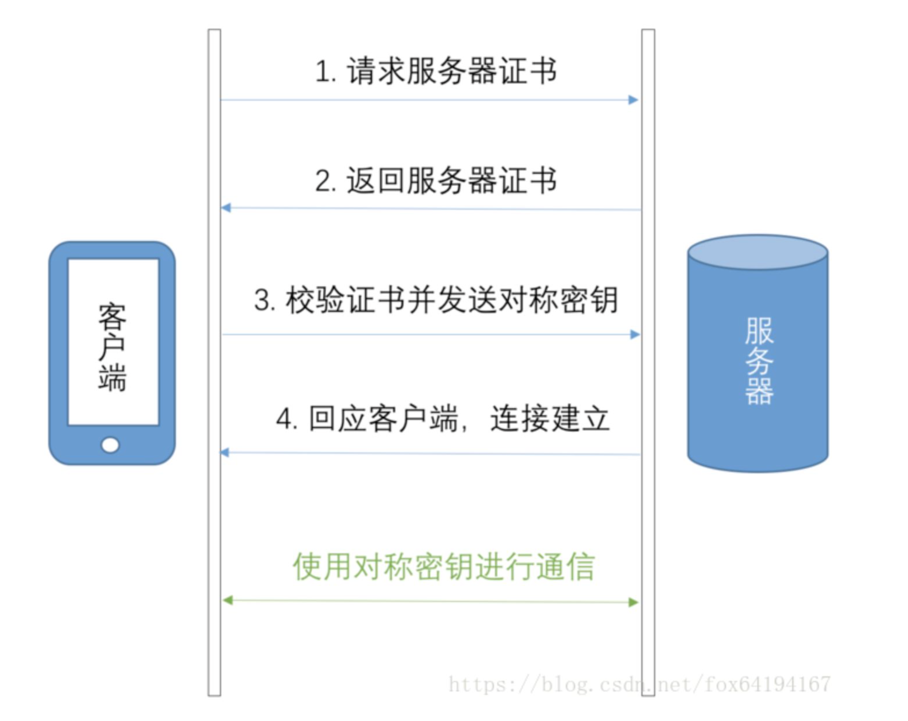
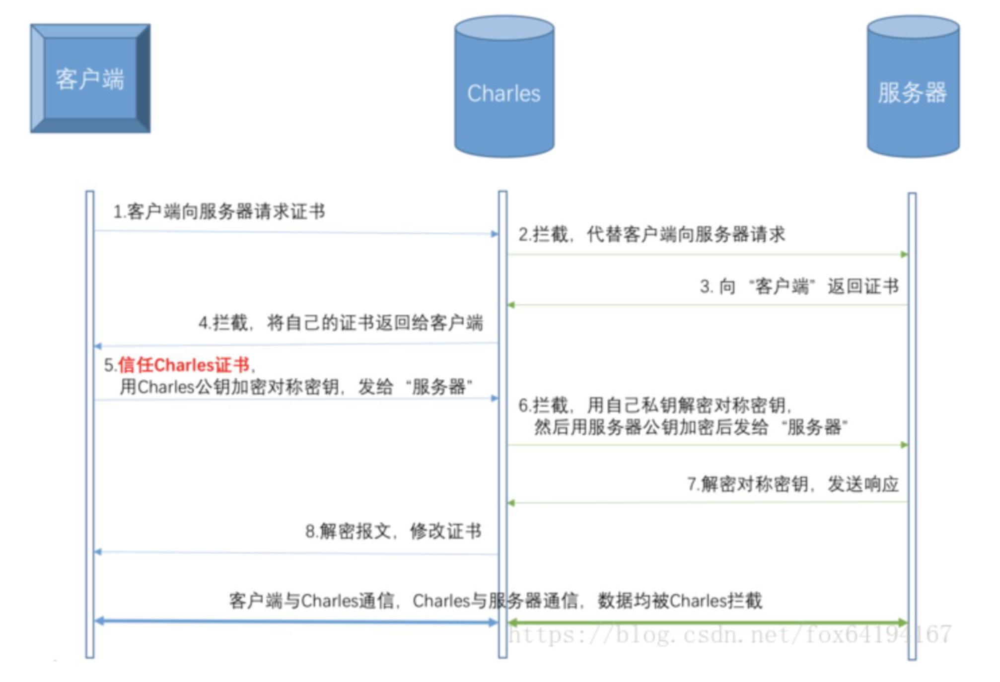

1.对称加密
其变成复杂的加密密文发送出去。收信方收到密文后，若想解读原文，则需要使用加密用过的密钥及相同算法的逆算法对密文进行解密，才能使其恢复成可读明文。在对称加密算法中，使用的密钥只有一个，发收信双方都使用这个密钥对数据进行加密和解密，这就要求解密方事先必须知道加密密钥。
对称加密算法的特点是算法公开、计算量小、加密速度快、加密效率高。
不足之处是，交易双方都使用同样钥匙，安全性得不到保证。此外，每对用户每次使用对称加密算法时，都需要使用其他人不知道的惟一钥匙，这会使得发收信双方所拥有的钥匙数量呈几何级数增长，密钥管理成为用户的负担。对称加密算法在分布式网络系统上使用较为困难，主要是因为密钥管理困难，使用成本较高。而与公开密钥加密算法比起来，对称加密算法能够提供加密和认证却缺乏了签名功能，使得使用范围有所缩小。在计算机专网系统中广泛使用的对称加密算法有DES和IDEA等。美国国家标准局倡导的AES即将作为新标准取代DES。

2.非对称加密
对称加密算法在加密和解密时使用的是同一个秘钥；而非对称加密算法需要两个密钥来进行加密和解密，这两个秘钥是公开密钥（public key，简称公钥）和私有密钥（private key，简称私钥）。

1、乙方生成一对密钥（公钥和私钥）并将公钥向其它方公开。
2、得到该公钥的甲方使用该密钥对机密信息进行加密后再发送给乙方。
3、乙方再用自己保存的另一把专用密钥（私钥）对加密后的信息进行解密。乙方只能用其专用密钥（私钥）解密由对应的公钥加密后的信息。
在传输过程中，即使攻击者截获了传输的密文，并得到了乙的公钥，也无法破解密文，因为只有乙的私钥才能解密密文。
同样，如果乙要回复加密信息给甲，那么需要甲先公布甲的公钥给乙用于加密，甲自己保存甲的私钥用于解密。

3.https如何使用对称加密和非对称加密
HTTPS的解决方案是这样的：用非对称算法随机加密出一个对称密钥，然后双方用对称密钥进行通信。具体来说，就是客户端生成一个随机密钥，用服务器的公钥对这个密钥进行非对称加密，服务器用私钥进行解密，然后双方就用这个对称密钥来进行数据加密了。

4. 信任主机

采用https的服务器必须从CA （Certificate Authority）申请一个用于证明服务器用途类型的证书。该证书只有用于对应的服务器的时候，客户端才信任此主机。所以所有的银行系统网站，关键部分应用都是https 的。客户通过信任该证书，从而信任了该主机。其实这样做效率很低，但是银行更侧重安全。这一点对局域网对内提供服务处的服务器没有任何意义。局域网中的服务器，采用的证书不管是自己发布的还是从公众的地方发布的，其客户端都是自己人，所以该局域网中的客户端也就肯定信任该服务器。

5. https 通信流程

   

①客户端的浏览器向服务器传送客户端SSL 协议的版本号，加密算法的种类，产生的随机数，以及其他服务器和客户端之间通讯所需要的各种信息。
②服务器向客户端传送SSL 协议的版本号，加密算法的种类，随机数以及其他相关信息，同时服务器还将向客户端传送自己的证书。
③客户利用服务器传过来的信息验证服务器的合法性，服务器的合法性包括：证书是否过期，发行服务器证书的CA 是否可靠，发行者证书的公钥能否正确解开服务器证书的“发行者的数字签名”，服务器证书上的域名是否和服务器的实际域名相匹配。如果合法性验证没有通过，通讯将断开；如果合法性验证通过，将继续进行第四步。
④用户端随机产生一个用于后面通讯的“对称密码”，然后用服务器的公钥（服务器的公钥从步骤②中的服务器的证书中获得）对其加密，然后将加密后的“预主密码”传给服务器。
4.1如果服务器要求客户的身份认证（在握手过程中为可选），用户可以建立一个随机数然后对其进行数据签名，将这个含有签名的随机数和客户自己的证书以及加密过的“预主密码”一起传给服务器。

4.2 如果服务器要求客户的身份认证，服务器必须检验客户证书和签名随机数的合法性，具体的合法性验证过程包括：客户的证书使用日期是否有效，为客户提供证书的CA 是否可靠，发行CA 的公钥能否正确解开客户证书的发行CA 的数字签名，检查客户的证书是否在证书废止列表（CRL）中。检验如果没有通过，通讯立刻中断；如果验证通过，服务器将用自己的私钥解开加密的“预主密码”，然后执行一系列步骤来产生主通讯密码（客户端也将通过同样的方法产生相同的主通讯密码）。
5服务器和客户端用相同的主密码即“通话密码”，一个对称密钥用于SSL 协议的安全数据通讯的加解密通讯。同时在SSL 通讯过程中还要完成数据通讯的完整性，防止数据通讯中的任何变化。
客户端向服务器端发出信息，指明后面的数据通讯将使用的步骤5中的主密码为对称密钥，同时通知服务器客户端的握手过程结束。
6服务器向客户端发出信息，指明后面的数据通讯将使用的步骤5中的主密码为对称密钥，同时通知客户端服务器端的握手过程结束。
7SSL 的握手部分结束，SSL 安全通道的数据通讯开始，客户和服务器开始使用相同的对称密钥进行数据通讯，同时进行通讯完整性的检验。

6. Charles 抓包原理

客户端向服务器发起HTTPS请求

Charles拦截客户端的请求，伪装成客户端向服务器进行请求

服务器向“客户端”（实际上是Charles）返回服务器的CA证书

Charles拦截服务器的响应，获取服务器证书公钥，然后自己制作一张证书，将服务器证书替换后发送给客户端。（这一步，Charles拿到了服务器证书的公钥）

客户端接收到“服务器”（实际上是Charles）的证书后，生成一个对称密钥，用Charles的公钥加密，发送给“服务器”（Charles）

Charles拦截客户端的响应，用自己的私钥解密对称密钥，然后用服务器证书公钥加密，发送给服务器。（这一步，Charles拿到了对称密钥）

服务器用自己的私钥解密对称密钥，向“客户端”（Charles）发送响应

Charles拦截服务器的响应，替换成自己的证书后发送给客户端

至此，连接建立，Charles拿到了 服务器证书的公钥 和 客户端与服务器协商的对称密钥，之后就可以解密或者修改加密的报文了。

HTTPS抓包的原理还是挺简单的，简单来说，就是Charles作为“中间人代理”，拿到了 服务器证书公钥 和 HTTPS连接的对称密钥，前提是客户端选择信任并安装Charles的CA证书，否则客户端就会“报警”并中止连接。这样看来，HTTPS还是很安全的。
