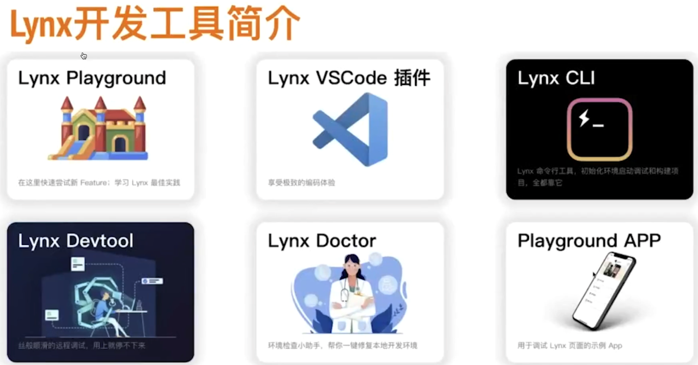

1、lynx相对于小程序，他的视图层是原生组件，而比如小程序，他的视图是webview呈现，所以lynx渲染效率更高

2、lynx相对于reactnative，两者都是原生视图进行渲染，但是lynx那套MVVM是通过c++实现，通信开销更小，更加高效。lynx渲染和逻辑是拆开的，所以首屏不依赖于js下发。

lynx playground：真实的app，内置了lynx的SDK，可以通过这个app直接扫码lynx编译产物，看到开发效果。(内网demo：https://bit.ly/2TNGX1r)

lynx VSCode 插件： 因为lynx也是一种DSL语言，所以vscode市场是找不到对应的插件，该插件可以帮助实现自动补全，语法检查等。

lynx cli： 类似于react cli  / vue cli，开发调试构建等作用。

lynx Devtool：其实就是基于chrome的插件开发协议，开发出对于web开发友好的调试工具，类似于chrome自己的devtool这样一套开发调试工具，方便前端人员使用。

lynx Doctor：就是一个远程的shell脚本，帮助一键生成/修复本地开发环境。

playground APP： web IDE
