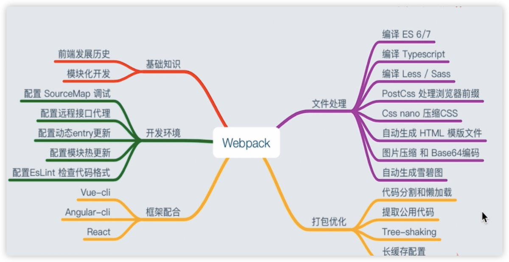

## B、webpack了解

# JS和css模块化

  

  

  

基础知识：

模块化：

  

  

  

  

  

  

  

  

  

  

  

  

  

  

  

# webpack简述

  

  

  

  

  

  

  

  

多页页面应用两种可能：

1、一个业务一个入口

2、SPA将业务和依赖/框架的代码分别做成不同的入口（长缓存优化）

  

  

  

  

第三种扩展性好

  

  

  

  

  

  

  

  

  

  

  

  

  

  

  

  

Chunk ：块，其实就是最小的代码片段

Bundle：把代码片段进行了打包，捆绑

Module： 模块，一个大的功能模块