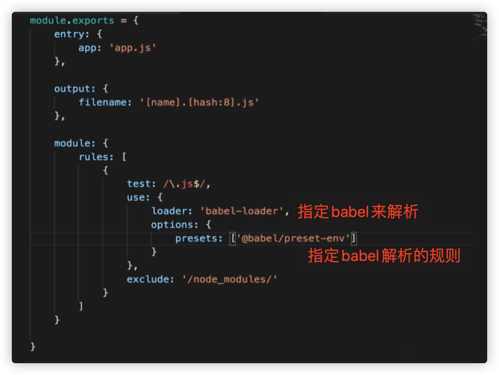

## C、webpack 之 babel

\-g 的webpack打包当前目录：

/当前目录/： webpack entryfile  ouputfile

自己配置当前目录下webpack执行的脚本js： 

webpack --config webpack.con.js  

默认执行的文档目录下的文件名：

webpack.config.js

  

babel打包工具： babel-loader babel-core

上面是babel打包工具，但是还不知道通过什么规范来打包，以下就是打包规则  

  

babel presets:

es2015

es2016

es2017

env

babel-preset-react

babel-preset-stage 0 - 3

  

babel presets 版本：

新版本： @babel/preset-env 

旧版本：babel-preset-env

  

  

  

  

额外的babel插件，上面的babel-preset只是针对语法，对于方法（函数）的转义需要依靠下面的插件，比如这些方法：

  

需要依靠下面的插件进行处理：

  

  

  

  

两者的使用场景和方法：

如果我们是是自己写库，框架，就用babel runtime transform，一般是写在.babelrc里面，并且配置demo如下：

  

这部分其实就是把webapck.config.js中的options拷贝出来，添加了plugins:\[@babel/transform-runtime\]，如果是使用的babel-polyfill，这里就不用写plugins，或者直接不写.babelrc文件，把这里的配置放到wepback的babel-loader的options中去，在app.js（全局的意思）文件引入import ‘babel-polyfill’就好

  

关于使用polyfill和runtime的一点思考：

如果不进行打包优化（缓存框架打包内容），使用runtime肯定最能节约包体积，但是缓存了runtime，如果下次页面使用了更多的ES6的api，缓存的runtime就不会引入对于新api的函数声明，导致runtime失去意义，所以我对于runtime的理解是，如果每次打包都重新打包runtime，大可直接使用runtime，而不是polyfill，但是如果有打包时间优化，可以使用polyfill，缓存后就不用担心使用新api导致没有被降级处理。