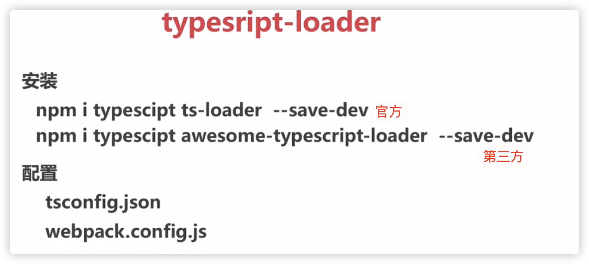
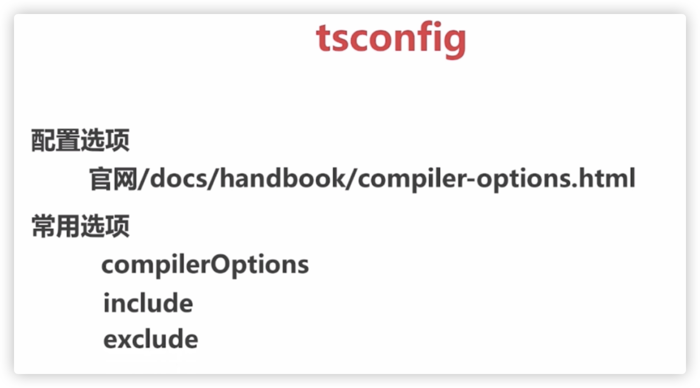
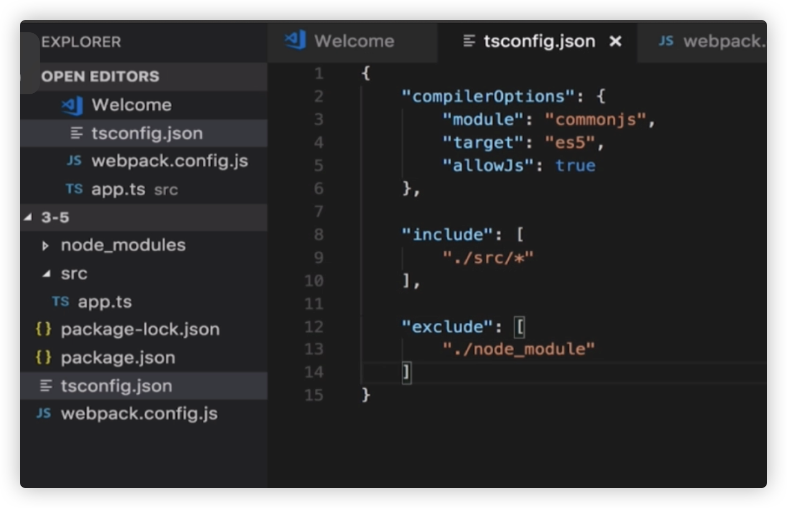
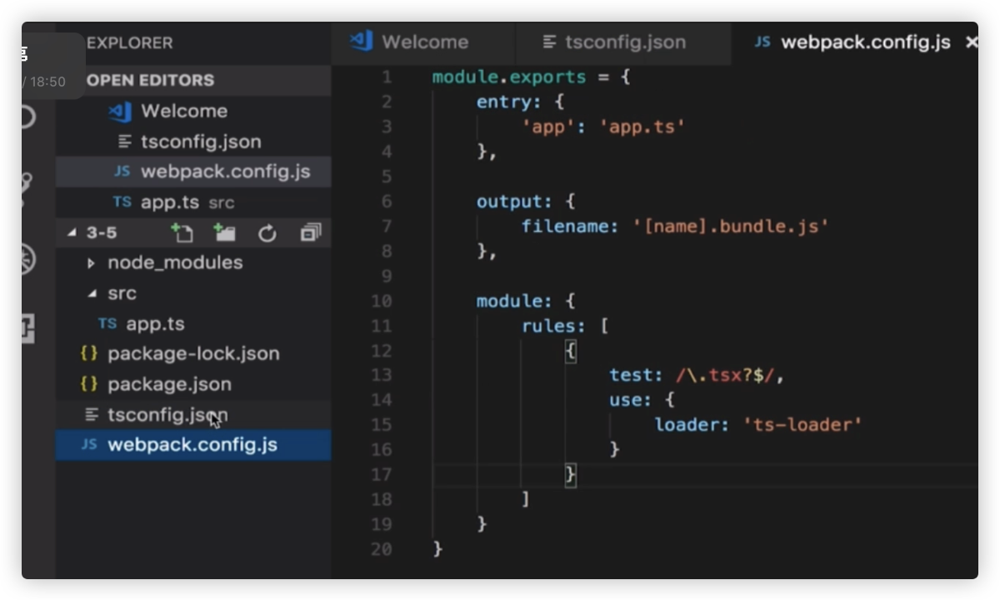
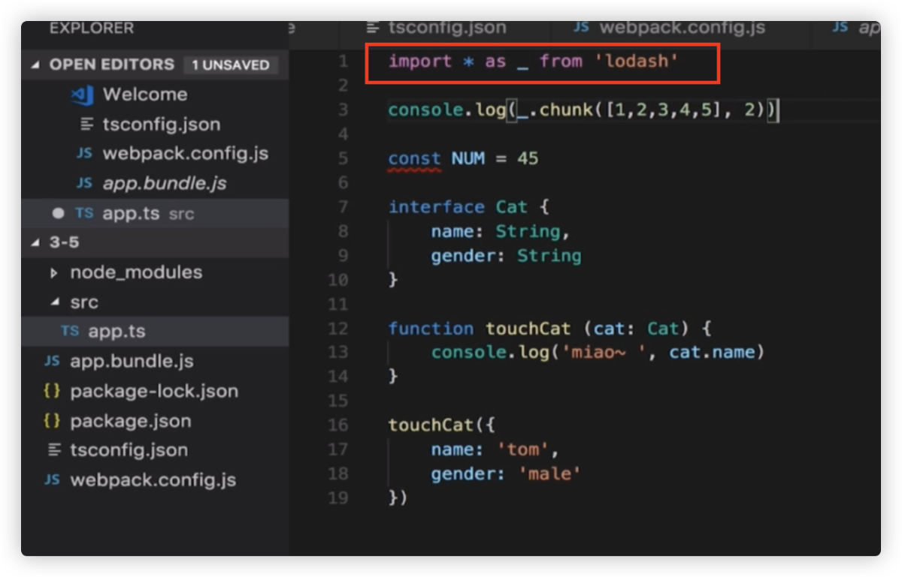
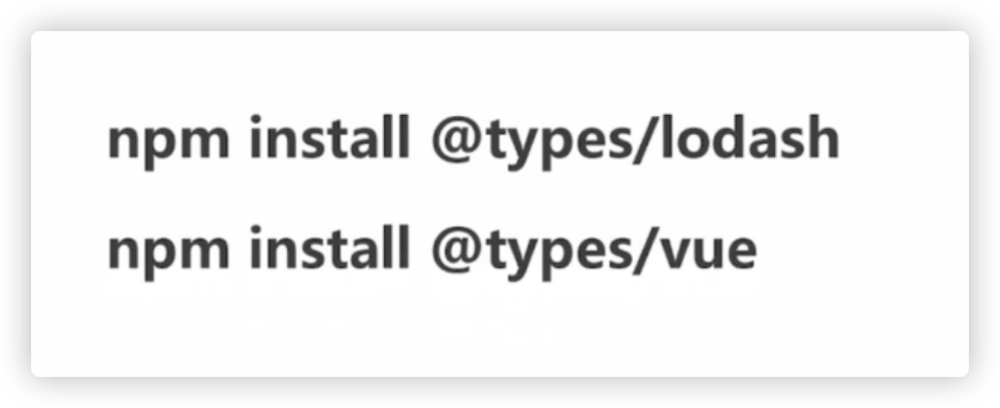
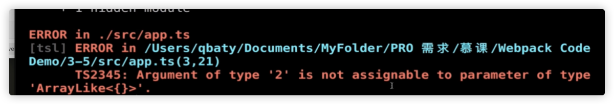

## D、webpack 之 ts

中文网：[https://www.tslang.cn/docs/home.html](https://www.tslang.cn/docs/home.html)

  

tsconfig.json配置：

  

demo:

tsconfig.json配置：

  

webpack.config.js配置：

  

app.ts:

  

如图：ts中直接使用了lodash.js工具库，正常编译使用

上面的简单配置，如果存在一些警告，可能不会跑出来，比如：loash的\_\_.chunk方法，传递参数的时候写成了\_\_.chunk(2)，这个时候仅仅是上面的配置，还是会正常编译，没有异常抛出，

  

比如安装了@types/lodash:编译就会抛出警告：

