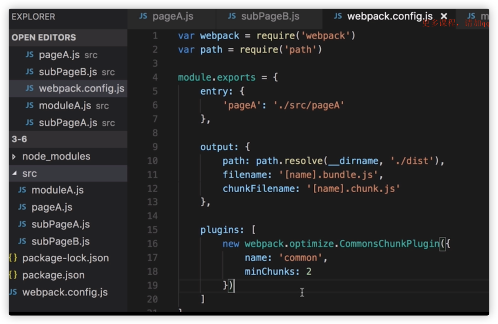

## E、js优化

# 1、提取公共代码

  

options里面的配置：

options.name or options.names：如果选择已经有的chunk，就会把公用代码打包到这里chunk

options.filename：公用代码打包后的文件名，写法可以是eg：’\[name\].\[hash:8\].js’

options.minChunks: value可以是：数字/infinity/函数

 数字：代表公用代码出现的次数，如果是2，表示出现两次就会被抽离出来  

 infinity：不会把公用代码进行提取打包  

 函数：自定义代码提取逻辑

options.chunks: 提取代码的范围，从哪几个代码块中去提取代码

options.children:

options.deepChildren: 

去子模块中去查找共同依赖

options.async: 创建异步代码块

   

  

场景1:

  

预期结果：PageA.js引用了subPageA.js和subPageB.js，subPageA.js和subPageB.js都引用了moduleA.js，这里的配置name:’common’，不存在这个entry，就会新建一个chunk（名称是common）进行输出，输出的要求是只要有2个chunk有公共代码就抽离到common文件中去

至于：chunkFilename的含义，看这个文章：

[https://www.cnblogs.com/skychx/p/webpack-filename-chunkFilename.html](https://www.cnblogs.com/skychx/p/webpack-filename-chunkFilename.html)  

这个时候，我们发现打包的结果并不是我们预期的，因为

## 提取公共代码是一个多entry才会生效

的过程，上面截图我们新建一个pageB.js，PageB.js引用了subPageA.js和subPageB.js，subPageA.js和subPageB.js都引用了moduleA.js，这个时候就会在common中看到subPageA.js和subPageB.js以及moduleA.js

  

【后期实验  开始】

## 实验1

 一个entry，CommonsChunkPlugin肯定不会生效

  

## 实验2

一个entry + lodash，要单独打包lodash：

条件1: 把lodash设置成entry（lodash: \['lodash'\]）

条件2： CommonsChunkPlugin设置：

```
new webpack.optimize.CommonsChunkPlugin({
      name: 'lodash',
      minChunks: Infinity
    })
```

## 实验3

两个entry，都引用了lodash，单独抽离lodash到一个文件：

```
new webpack.optimize.CommonsChunkPlugin({
      name: 'common',
      minChunks: 2
    })
```

如果上面的minChunks: Infinity，这个时候打包出来的common只会是webpack的配置配置文件，并不会抽离lodash，效果如下：

```
Version: webpack 3.10.0
Time: 905ms
    Asset     Size  Chunks                    Chunk Names
     b.js   545 kB       0  [emitted]  [big]  b
     a.js   545 kB       1  [emitted]  [big]  a
common.js  5.78 kB       2  [emitted]         common
```

实验4

如果想将lodash和webpack基础配置信息（调用信息）分开打包：

```
new webpack.optimize.CommonsChunkPlugin({
      name: 'common',
      minChunks: 2
    }),
    new webpack.optimize.CommonsChunkPlugin({
      name: 'manifest',
      minChunks: Infinity
    })
```

这里需要注意js在index.html中的引入顺序，如果是手动引入：

```
<!DOCTYPE html>
<html lang="en">
<head>
  <meta charset="UTF-8">
  <meta name="viewport" content="width=device-width, initial-scale=1.0">
  <title>Document</title>
  <script src="./dist/manifest.js"></script>
  <script src="./dist/common.js"></script>
  <script src="./dist/a.js"></script>
  <script src="./dist/b.js"></script>
</head>
<body>
  
</body>
</html>
```

  

【后期实验  结束】  

  

如果我们在PageB.js（entry）中引用了lodash，这个时候希望将1、lodash单独打包，并且把lodash打包到上面抽离到公共代码中去：

1、在entry中添加一个vendor: lodash

2、配置改动：

  

name的名字和entry中lodash的entry名一样

  

  

  

因为上面vendor和common的配置一样，所以可以通过names合并：

  

  

# 2、代码分割和懒加载

  

  

动态import，替代：require.ensure:

  

  

使用场景：

  

demo目录结构：

demo1  

PageA.js引用了subPageA.js和subPageB.js，subPageA.js和subPageB.js都引用了moduleA.js：  

配置结果：代码分割lodash

  

  

结果：

  

  

demo2  

PageA.js引用了subPageA.js和subPageB.js，subPageA.js和subPageB.js都引用了moduleA.js：  

配置结果：代码分割loash，并且根据条件加载subpageA或者subPageB

  

打包结果：会发现subpageA和subpageB中都有moduleA的内容，我们会想到用commonChunkPlugin来提取公共代码，这个时候因为我们上面测试知道commonChunkPlugin是在多entry才会生效，这里配置不会生效，我们可以在PageA.js的顶部写上：

  

我们新建一index.html引入pageA.bundle.js，来观察其他的/分割的bundle是否被加载进来，这个时候看到报错，找不到资源：

  

这个时候需要指定打包的资源发布目录：

  

线上的话他可以是一个CDN地址，

写法上，以下两种写法是一样的效果：

  

动态import：

  

结果：

  

  

demo3:   

PageA.js引用了subPageA.js和subPageB.js，subPageA.js和subPageB.js都引用了moduleA.js：  

PageB.js引用了subPageA.js和subPageB.js，subPageA.js和subPageB.js都引用了moduleA.js：  

配置结果：多entry，为了实验commonChunkPlugin结合动态import实现异步加载


  

  

  

  

【后期实验  开始】

import使用心得：

如果我们动态import，然后index.html模版是我们自己写的，然后打包如下：

```
output: {
    path: path.resolve(__dirname, './dist'),
    filename: 'js/[name].js',
    publicPath: './dist/'
    chunkFilename: '[name].[hash:8].js'
  },
```

js文件写法：

```
import '../public/index.js'
const btn = document.getElementById('btn')
btn.onclick = function() {
  import(/* webpackChunkName: 'hhh'*/'lodash').then(_ => {
    console.log(_)
  })
}
```

  
打包结果：

```
Time: 995ms
          Asset     Size  Chunks                    Chunk Names
hhh.752c3a14.js   544 kB       0  [emitted]  [big]  hhh
           a.js  6.68 kB       1  [emitted]         a
```

  
这个时候如果是手动写的index.html模版，我们不需要手动引入hhh.752c3a14.js，本来是异步加载，如果手动引入了hhh.752c3a14.js，就变成同步了，就失去了异步打包加载的意义了。

index.html:

```
<!DOCTYPE html>
<html lang="en">
<head>
  <meta charset="UTF-8">
  <meta name="viewport" content="width=device-width, initial-scale=1.0">
  <title>Document</title>
</head>
<body>
  <button id="btn">234523</button>
</body>
<script src="./dist/a.js"></script>
</html>
```

  
  
  

【后期实验  结束】