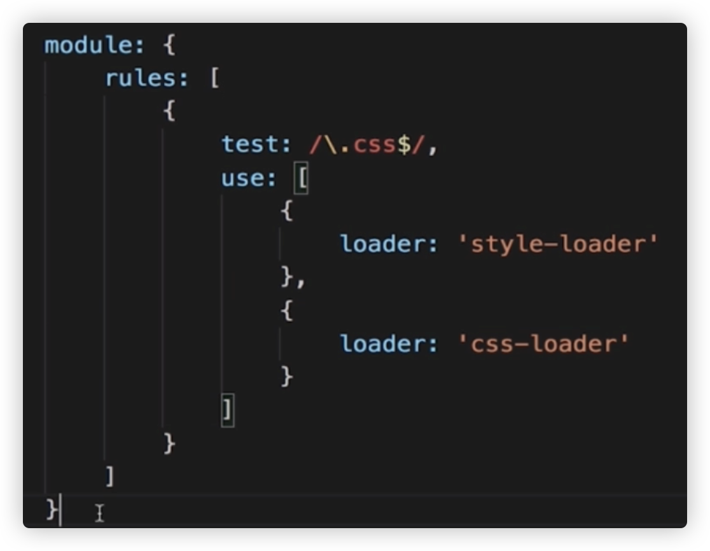
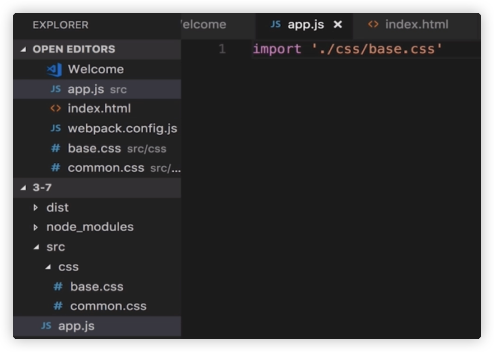
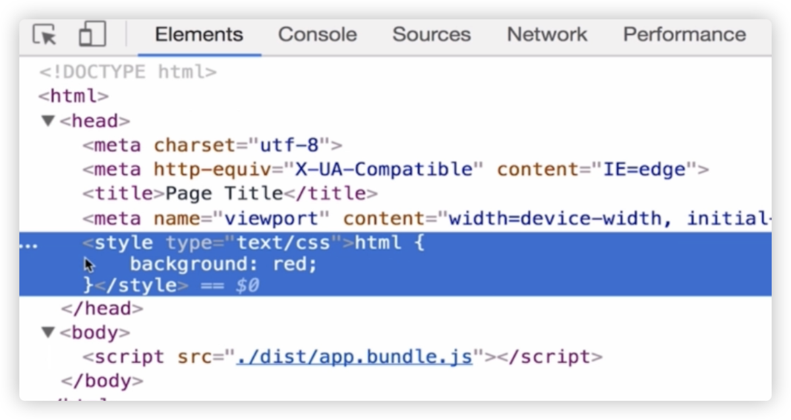
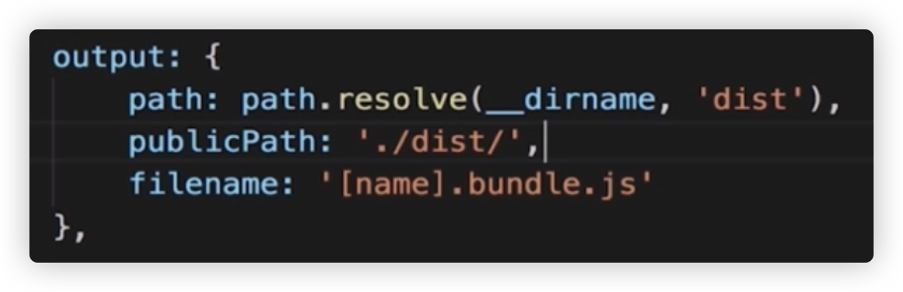
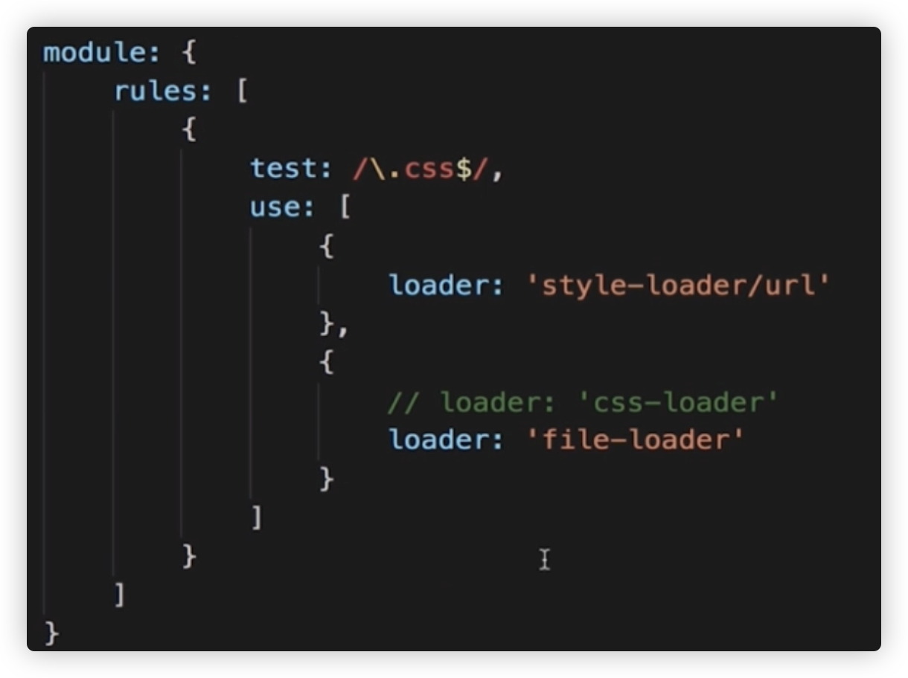
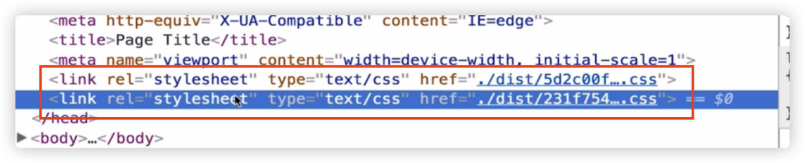
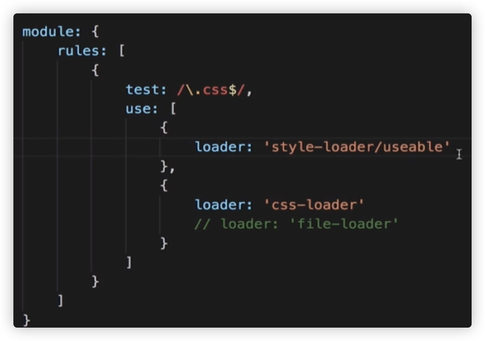
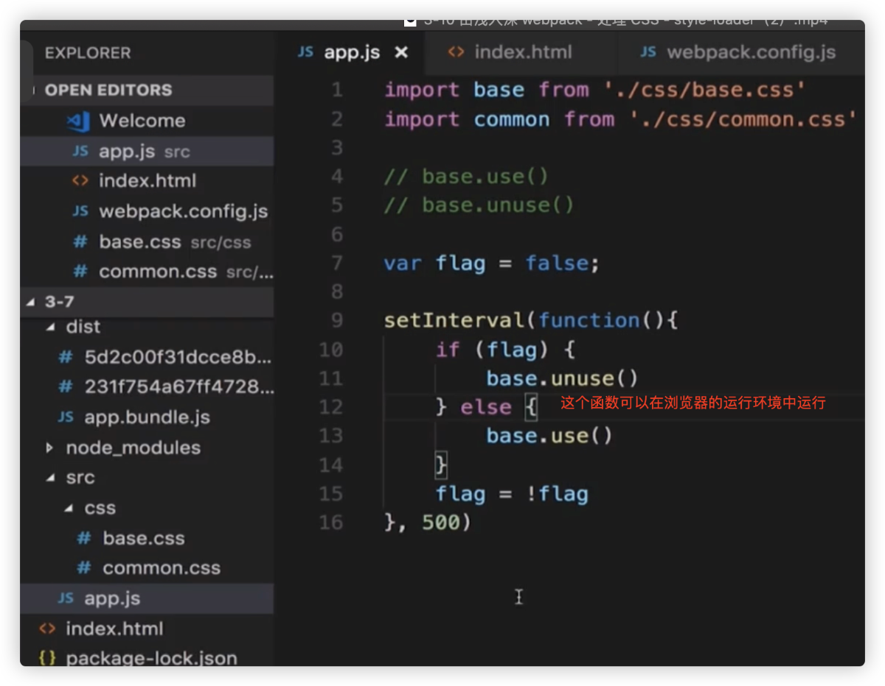
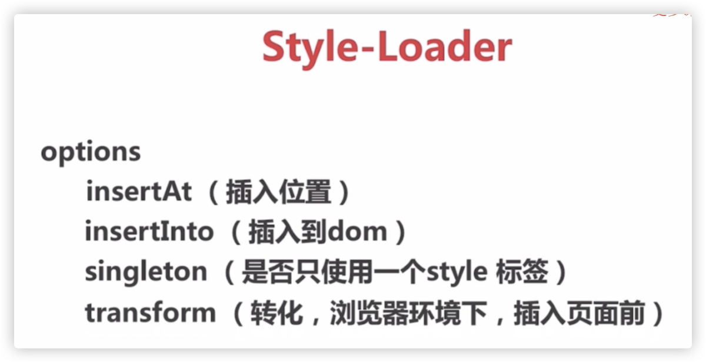
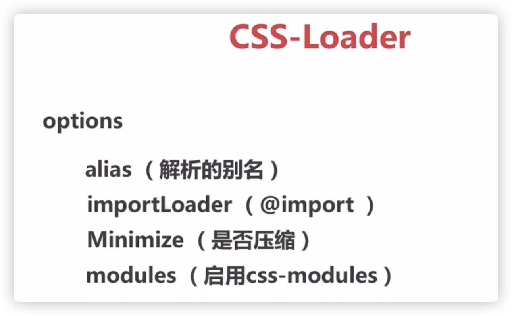

## G、webpack 之 css(less)

style-loader: 在html中创建style标签

css-loader： 允许js中import css

最简单的配置：

  

  

  

  

  

【后期实验  开始】  

如果只使用css-loader是不行的，只是打包了，并没有插入页面，所以需要css-loader + style-loader一起使用

【后期实验  结束】  

  

  

如果我们不想通过style-loader+css-loader的方式来配置，另外一种配置方案：

style-loader/url+file-loader来配置：这个时候css的内容会以单的的css文件被放到html中，因为单独生成来css文件，还需要指定publicPath路径：

  

  

这种配置，如果多次import css到js，就会多次生成css文件，以link标签的形式插入html，造成带宽浪费，不常用！结果如下：

  

  

第二种不常用的配置：

  

  

  

  

# 

```
{
        test: /\.css/,
        use:[
          {
            loader: 'style-loader',
            options: {
              
            }
          }, 'css-loader'
        ]
      }
```

less使用：

安装依赖： less less-loader  

```
{    test: /\.less$/,    use:[      'style-load', 'css-loader', 'less-loader'    ]}
```