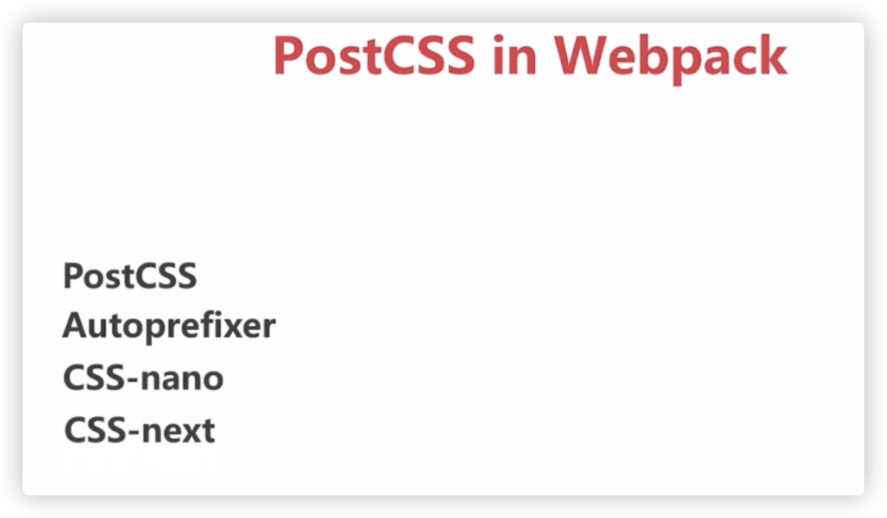

## I、webpack 之 postcss

  

相关插件安装：

```
npm i postcss postcss-loader autoprefixer cssnano postcss-cssnext -D
```

  
！！！上面postcss-cssnext已经废弃，并且npm包都下架，被：postcss-preset-env，代替

测试结果

```
{
        test: /\.less$/,
        use: ExtractTextPlugins.extract({
          fallback: 'style-loader',
          use: [
            {
              loader: 'css-loader'
            }, 
            {
              loader: 'postcss-loader',
              options: {
                ident: 'postcss',
                plugins: [
                  require('autoprefixer')(),
                  require('postcss-preset-env')({ stage: 0 })
                ]
              }
            },
            'less-loader'
          ]
        })
      }
```

  

tips：

stage共分为5个阶段，分别是：

- stage-0 非官方草案
- stage-1 编辑草案或早期工作草案
- stage-2 工作草案
- stage-3 候选版本
- stage-4 推荐标准

  
如上配置，我们使用了需要加前缀的属性和root变量，可以看到：

animation被添加了前缀，mainColor变量并没有被替换编译，最后将postcss-loader autoprefixer升级到最新版本，配合新插件postcss-preset-env来使用，直接导致webpack3打包失败，可能postcss-preset-env不支持webpack3环境下打包吧。  

```
body {
  font-size: 40px;
  -webkit-animation: myfirst 5s;
          animation: myfirst 5s;
}
@-webkit-keyframes myfirst {
  from {
    background: red;
  }
  to {
    background: yellow;
  }
}
@keyframes myfirst {
  from {
    background: red;
  }
  to {
    background: yellow;
  }
}
:root {
  --mainColor: red;
}
.r {
  color: red;
  color: var(--mainColor);
}

```